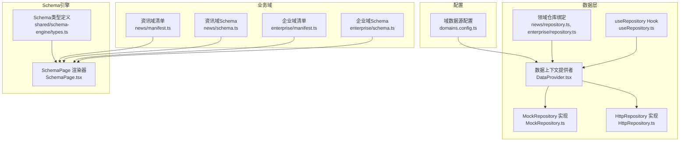
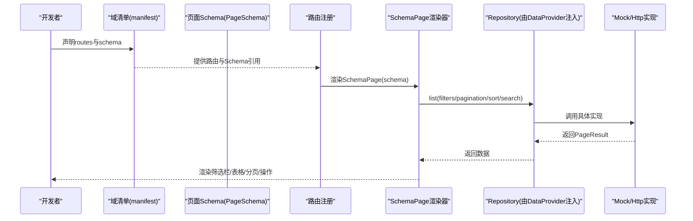
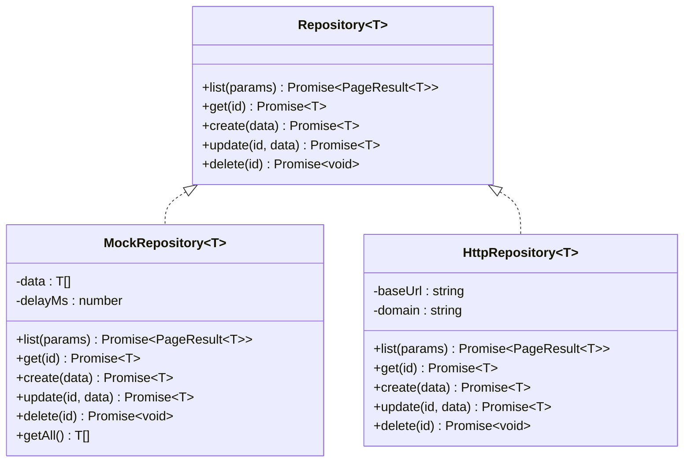
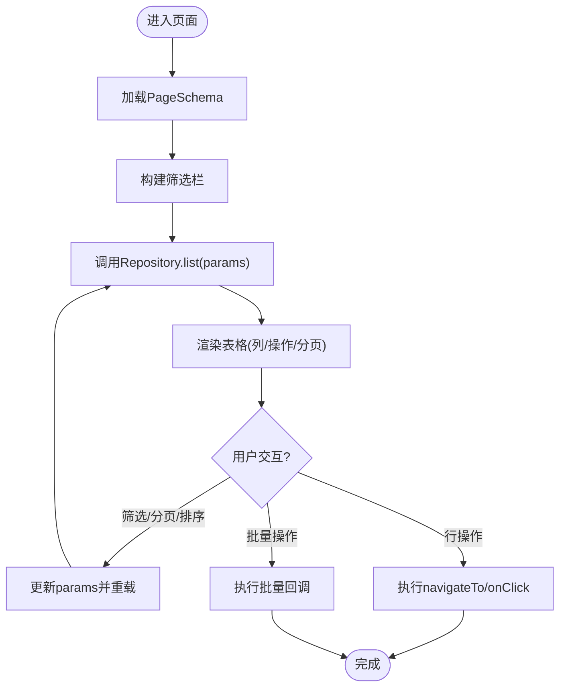
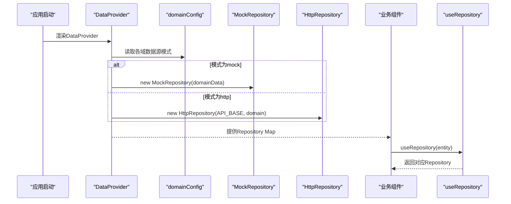
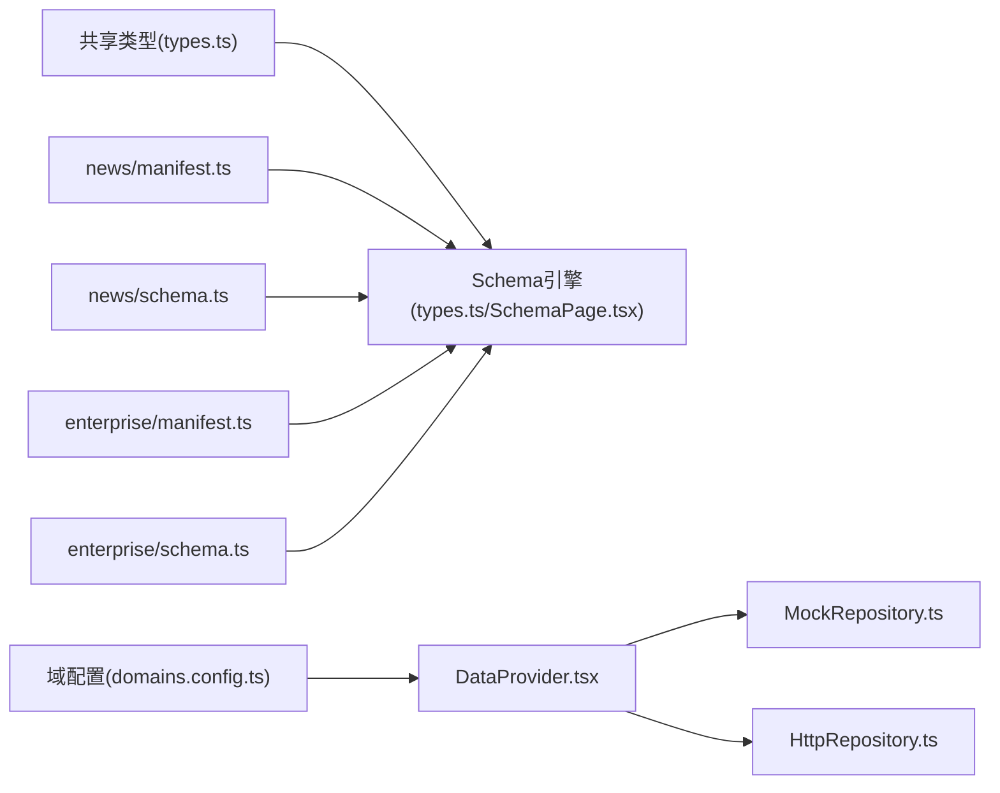

# API参考

<cite>
**本文引用的文件**   
- [domains.config.ts](file://hj-admin/src/config/domains.config.ts)
- [types.ts](file://hj-admin/src/shared/data/types.ts)
- [HttpRepository.ts](file://hj-admin/src/shared/data/HttpRepository.ts)
- [MockRepository.ts](file://hj-admin/src/shared/data/MockRepository.ts)
- [DataProvider.tsx](file://hj-admin/src/shared/data/DataProvider.tsx)
- [useRepository.ts](file://hj-admin/src/shared/data/useRepository.ts)
- [types.ts](file://hj-admin/src/shared/schema-engine/types.ts)
- [SchemaPage.tsx](file://hj-admin/src/shared/schema-engine/SchemaPage.tsx)
- [manifest.ts](file://hj-admin/src/domains/news/manifest.ts)
- [schema.ts](file://hj-admin/src/domains/news/schema.ts)
- [repository.ts](file://hj-admin/src/domains/news/repository.ts)
- [manifest.ts](file://hj-admin/src/domains/enterprise/manifest.ts)
- [schema.ts](file://hj-admin/src/domains/enterprise/schema.ts)
- [repository.ts](file://hj-admin/src/domains/enterprise/repository.ts)
- [index.ts](file://hj-admin/src/types/index.ts)
</cite>

## 目录
1. [简介](#简介)
2. [项目结构](#项目结构)
3. [核心组件](#核心组件)
4. [架构总览](#架构总览)
5. [详细组件分析](#详细组件分析)
6. [依赖分析](#依赖分析)
7. [性能考虑](#性能考虑)
8. [故障排查指南](#故障排查指南)
9. [结论](#结论)
10. [附录](#附录)

## 简介
本API参考文档面向“氢界大数据平台 — 运营管理后台”的前端数据与页面配置层，覆盖以下范围：
- Schema类型定义与页面声明式配置（DomainManifest、PageSchema等）
- Repository接口规范（list/get/create/update/delete）
- Hook函数API（useRepository）
- 数据源模式切换（mock/http）与配置项说明
- HTTP API约定（请求参数、响应结构、错误处理）
- 完整代码示例路径与集成步骤
- 版本兼容性与迁移建议

## 项目结构
本项目采用“域驱动 + 声明式Schema + 统一数据访问抽象”的架构。每个业务域通过清单（manifest）声明路由与Schema；Schema驱动通用列表页渲染器自动构建筛选栏、表格、分页、操作列等；数据访问通过统一的Repository接口屏蔽后端差异，支持在开发期使用Mock、上线期切换到HTTP实现。

图表来源
- [domains.config.ts:1-18](file://hj-admin/src/config/domains.config.ts#L1-L18)
- [DataProvider.tsx:1-44](file://hj-admin/src/shared/data/DataProvider.tsx#L1-L44)
- [MockRepository.ts:1-101](file://hj-admin/src/shared/data/MockRepository.ts#L1-L101)
- [HttpRepository.ts:1-70](file://hj-admin/src/shared/data/HttpRepository.ts#L1-L70)
- [repository.ts:1-11](file://hj-admin/src/domains/news/repository.ts#L1-L11)
- [repository.ts:1-6](file://hj-admin/src/domains/enterprise/repository.ts#L1-L6)
- [types.ts:1-216](file://hj-admin/src/shared/schema-engine/types.ts#L1-L216)
- [SchemaPage.tsx:1-226](file://hj-admin/src/shared/schema-engine/SchemaPage.tsx#L1-L226)
- [manifest.ts:1-42](file://hj-admin/src/domains/news/manifest.ts#L1-L42)
- [schema.ts:1-123](file://hj-admin/src/domains/news/schema.ts#L1-L123)
- [manifest.ts:1-20](file://hj-admin/src/domains/enterprise/manifest.ts#L1-L20)
- [schema.ts:1-64](file://hj-admin/src/domains/enterprise/schema.ts#L1-L64)

章节来源
- [domains.config.ts:1-18](file://hj-admin/src/config/domains.config.ts#L1-L18)
- [DataProvider.tsx:1-44](file://hj-admin/src/shared/data/DataProvider.tsx#L1-L44)
- [types.ts:1-216](file://hj-admin/src/shared/schema-engine/types.ts#L1-L216)
- [SchemaPage.tsx:1-226](file://hj-admin/src/shared/schema-engine/SchemaPage.tsx#L1-L226)
- [manifest.ts:1-42](file://hj-admin/src/domains/news/manifest.ts#L1-L42)
- [schema.ts:1-123](file://hj-admin/src/domains/news/schema.ts#L1-L123)
- [manifest.ts:1-20](file://hj-admin/src/domains/enterprise/manifest.ts#L1-L20)
- [schema.ts:1-64](file://hj-admin/src/domains/enterprise/schema.ts#L1-L64)

## 核心组件
本节聚焦于系统的关键类型与接口，包括数据层契约、Schema类型、以及运行时注入机制。

- 数据层契约
  - QueryParams：查询参数（分页、过滤、排序、关键词搜索）
  - PageResult<T>：分页结果（list、total、page、pageSize）
  - Repository<T>：统一CRUD接口（list/get/create/update/delete）
  - DataSourceMode：数据源模式（'mock'|'http'）
  - DomainDataSourceConfig：按域名映射到数据源模式

- Schema类型
  - FilterField/FilterOption：筛选字段定义
  - ColumnDef：表格列定义（含渲染器引用与自定义渲染）
  - RowAction/BatchAction/ToolbarAction：行/批量/工具栏操作
  - ModalDef/TabDef：弹窗与分组Tab
  - FormSchema/FormFields：表单Schema（用于弹窗新增/编辑）
  - PageSchema：完整页面声明式配置
  - RouteDef/DomainManifest：域清单与路由定义
  - PageActionContext：页面操作上下文（刷新、导航、弹窗）

- 运行时注入
  - DataProvider：根据域配置创建并注入Repository实例
  - useRepository：在任意组件中获取指定entity的Repository
  - MockRepository/HttpRepository：两种具体实现

章节来源
- [types.ts:1-36](file://hj-admin/src/shared/data/types.ts#L1-L36)
- [types.ts:1-216](file://hj-admin/src/shared/schema-engine/types.ts#L1-L216)
- [DataProvider.tsx:1-44](file://hj-admin/src/shared/data/DataProvider.tsx#L1-L44)
- [useRepository.ts:1-24](file://hj-admin/src/shared/data/useRepository.ts#L1-L24)
- [MockRepository.ts:1-101](file://hj-admin/src/shared/data/MockRepository.ts#L1-L101)
- [HttpRepository.ts:1-70](file://hj-admin/src/shared/data/HttpRepository.ts#L1-L70)

## 架构总览
下图展示从“域清单+Schema”到“SchemaPage渲染”再到“数据访问”的端到端流程。

图表来源
- [manifest.ts:1-42](file://hj-admin/src/domains/news/manifest.ts#L1-L42)
- [schema.ts:1-123](file://hj-admin/src/domains/news/schema.ts#L1-L123)
- [SchemaPage.tsx:1-226](file://hj-admin/src/shared/schema-engine/SchemaPage.tsx#L1-L226)
- [DataProvider.tsx:1-44](file://hj-admin/src/shared/data/DataProvider.tsx#L1-L44)
- [MockRepository.ts:1-101](file://hj-admin/src/shared/data/MockRepository.ts#L1-L101)
- [HttpRepository.ts:1-70](file://hj-admin/src/shared/data/HttpRepository.ts#L1-L70)

## 详细组件分析

### 数据访问层（Repository）
- 统一接口
  - list(params): Promise<PageResult<T>>
  - get(id): Promise<T>
  - create(data): Promise<T>
  - update(id, data): Promise<T>
  - delete(id): Promise<void>
- 查询参数QueryParams
  - page?: number
  - pageSize?: number
  - filters?: Record<string, unknown>
  - sort?: { field: string; order: 'ascend'|'descend' }
  - search?: string
- 分页结果PageResult<T>
  - list: T[]
  - total: number
  - page: number
  - pageSize: number

- 实现细节
  - MockRepository：内存过滤/分页/排序，模拟网络延迟，返回Promise
  - HttpRepository：将QueryParams序列化为URLSearchParams，遵循REST风格

图表来源
- [types.ts:1-36](file://hj-admin/src/shared/data/types.ts#L1-L36)
- [MockRepository.ts:1-101](file://hj-admin/src/shared/data/MockRepository.ts#L1-L101)
- [HttpRepository.ts:1-70](file://hj-admin/src/shared/data/HttpRepository.ts#L1-L70)

章节来源
- [types.ts:1-36](file://hj-admin/src/shared/data/types.ts#L1-L36)
- [MockRepository.ts:1-101](file://hj-admin/src/shared/data/MockRepository.ts#L1-L101)
- [HttpRepository.ts:1-70](file://hj-admin/src/shared/data/HttpRepository.ts#L1-L70)

### Schema引擎与页面声明式配置
- 核心类型
  - FilterField/FilterOption：筛选字段与选项
  - ColumnDef：列定义（含render字符串或函数、sorter、固定列、对齐等）
  - RowAction/BatchAction/ToolbarAction：行/批量/工具栏操作
  - ModalDef：弹窗/抽屉定义（可关联formSchema或customComponent）
  - TabDef：Tab分组（支持count/countField/filter）
  - FormSchema/FormFields：表单字段定义（含联动linkage）
  - PageSchema：页面级配置（filters/columns/pagination/rowActions/batchActions/toolbarActions/modals/tabs/quickFilters）
  - RouteDef/DomainManifest：域清单与路由定义
  - PageActionContext：页面操作上下文（refresh/navigate/showModal）

- 渲染器
  - SchemaPage：根据PageSchema自动渲染筛选栏、Tab、表格、分页、操作列，并支持列渲染器注册表

图表来源
- [types.ts:1-216](file://hj-admin/src/shared/schema-engine/types.ts#L1-L216)
- [SchemaPage.tsx:1-226](file://hj-admin/src/shared/schema-engine/SchemaPage.tsx#L1-L226)

章节来源
- [types.ts:1-216](file://hj-admin/src/shared/schema-engine/types.ts#L1-L216)
- [SchemaPage.tsx:1-226](file://hj-admin/src/shared/schema-engine/SchemaPage.tsx#L1-L226)

### 数据源模式与配置
- 域数据源配置
  - domainConfig：键为域名，值为'mock'或'http'
  - 当前所有域默认使用'mock'，后端就绪后逐个切换为'http'

- 运行时注入
  - DataProvider：遍历domainConfig，按模式创建MockRepository或HttpRepository，并通过React Context暴露
  - useRepository：在组件中按entity名称获取对应Repository

图表来源
- [domains.config.ts:1-18](file://hj-admin/src/config/domains.config.ts#L1-L18)
- [DataProvider.tsx:1-44](file://hj-admin/src/shared/data/DataProvider.tsx#L1-L44)
- [useRepository.ts:1-24](file://hj-admin/src/shared/data/useRepository.ts#L1-L24)
- [MockRepository.ts:1-101](file://hj-admin/src/shared/data/MockRepository.ts#L1-L101)
- [HttpRepository.ts:1-70](file://hj-admin/src/shared/data/HttpRepository.ts#L1-L70)

章节来源
- [domains.config.ts:1-18](file://hj-admin/src/config/domains.config.ts#L1-L18)
- [DataProvider.tsx:1-44](file://hj-admin/src/shared/data/DataProvider.tsx#L1-L44)
- [useRepository.ts:1-24](file://hj-admin/src/shared/data/useRepository.ts#L1-L24)

### 业务域清单与Schema示例
- 资讯域
  - manifest：声明菜单组、路由、子页面（含带参数的编辑页）
  - schema：定义资讯池、已发布资讯、数据源管理三个页面的PageSchema
- 企业域
  - manifest：声明待处理池、已确认企业、编辑页
  - schema：定义两个页面的PageSchema（含Tab分组、状态色板、进度条等）

章节来源
- [manifest.ts:1-42](file://hj-admin/src/domains/news/manifest.ts#L1-L42)
- [schema.ts:1-123](file://hj-admin/src/domains/news/schema.ts#L1-L123)
- [manifest.ts:1-20](file://hj-admin/src/domains/enterprise/manifest.ts#L1-L20)
- [schema.ts:1-64](file://hj-admin/src/domains/enterprise/schema.ts#L1-L64)

### 领域仓库绑定与Mock数据
- 资讯域
  - repository.ts：向DataProvider注册news与dataSources的Mock数据
- 企业域
  - repository.ts：向DataProvider注册enterprise的Mock数据

章节来源
- [repository.ts:1-11](file://hj-admin/src/domains/news/repository.ts#L1-L11)
- [repository.ts:1-6](file://hj-admin/src/domains/enterprise/repository.ts#L1-L6)

### 业务实体类型
- 资讯相关：NewsItem、NewsStatus
- 标签相关：TagItem
- 数据源相关：DataSource、SourceType、SourceStatus
- NER相关：NERBlock、NERCandidate、NERLevel、NERStatus、EntityType
- 企业相关：Enterprise、EnterpriseDim1、EnterpriseBizType、EnterpriseStage
- 资源位相关：Banner、IconItem、Promotion、ResourceStatus
- 页面树与实体：PageTreeNode、EntityItem

章节来源
- [index.ts:1-162](file://hj-admin/src/types/index.ts#L1-L162)

## 依赖分析
- 耦合关系
  - SchemaPage强依赖PageSchema类型与列渲染器注册表
  - DataProvider依赖domainConfig与各域Mock数据注册
  - 各域manifest仅依赖types与schema，保持低耦合
- 外部依赖
  - React/antd用于UI渲染
  - fetch用于HTTP实现

图表来源
- [types.ts:1-36](file://hj-admin/src/shared/data/types.ts#L1-L36)
- [types.ts:1-216](file://hj-admin/src/shared/schema-engine/types.ts#L1-L216)
- [SchemaPage.tsx:1-226](file://hj-admin/src/shared/schema-engine/SchemaPage.tsx#L1-L226)
- [domains.config.ts:1-18](file://hj-admin/src/config/domains.config.ts#L1-L18)
- [DataProvider.tsx:1-44](file://hj-admin/src/shared/data/DataProvider.tsx#L1-L44)
- [MockRepository.ts:1-101](file://hj-admin/src/shared/data/MockRepository.ts#L1-L101)
- [HttpRepository.ts:1-70](file://hj-admin/src/shared/data/HttpRepository.ts#L1-L70)
- [manifest.ts:1-42](file://hj-admin/src/domains/news/manifest.ts#L1-L42)
- [schema.ts:1-123](file://hj-admin/src/domains/news/schema.ts#L1-L123)
- [manifest.ts:1-20](file://hj-admin/src/domains/enterprise/manifest.ts#L1-L20)
- [schema.ts:1-64](file://hj-admin/src/domains/enterprise/schema.ts#L1-L64)

## 性能考虑
- 前端分页与排序
  - MockRepository在客户端进行过滤、排序与分页，适合小规模数据演示
- 网络请求
  - HttpRepository使用fetch，注意错误码与超时处理
- 渲染优化
  - SchemaPage对columns与actionColumn使用memo化，减少重渲染
- 建议
  - 大数据量场景优先启用服务端分页与排序
  - 复杂筛选条件尽量在服务端计算，避免全量拉取

## 故障排查指南
- 常见错误
  - Repository未找到：当entity未在DataProvider中注册时，useRepository会返回空操作的fallback并打印警告
  - HTTP错误：HttpRepository在response.ok为false时抛出包含状态码与文本的错误
  - 记录不存在：MockRepository在get/update时若找不到id会抛出错误
- 定位方法
  - 检查domainConfig是否包含该域
  - 检查对应域的repository.ts是否正确注册Mock数据
  - 检查Schema中的entity是否与注册的key一致

章节来源
- [useRepository.ts:1-24](file://hj-admin/src/shared/data/useRepository.ts#L1-L24)
- [HttpRepository.ts:1-70](file://hj-admin/src/shared/data/HttpRepository.ts#L1-L70)
- [MockRepository.ts:1-101](file://hj-admin/src/shared/data/MockRepository.ts#L1-L101)

## 结论
本方案通过“域清单 + 声明式Schema + 统一Repository”实现了高内聚、低耦合的可扩展后台体系。开发者仅需维护少量配置即可快速生成列表页，同时保留足够的扩展点以应对复杂业务需求。

## 附录

### TypeScript类型定义速查
- 数据层
  - QueryParams、PageResult<T>、Repository<T>、DataSourceMode、DomainDataSourceConfig
- Schema引擎
  - FilterField、FilterOption、ColumnDef、RowAction、BatchAction、ToolbarAction、ModalDef、TabDef、FormSchema、FormFields、PageSchema、RouteDef、DomainManifest、PageActionContext

章节来源
- [types.ts:1-36](file://hj-admin/src/shared/data/types.ts#L1-L36)
- [types.ts:1-216](file://hj-admin/src/shared/schema-engine/types.ts#L1-L216)

### 配置选项说明
- DomainManifest
  - name、label、icon、menuGroup、order、collapsible、dot、routes、disabled、badge
- RouteDef
  - path、label、schema/component、hideInMenu
- PageSchema
  - id、title、description、entity、filters、columns、rowKey、scrollX、pagination、rowActions、batchActions、toolbarActions、modals、tabs、quickFilters
- 全局配置
  - domainConfig：按域名映射到'mock'或'http'

章节来源
- [types.ts:1-216](file://hj-admin/src/shared/schema-engine/types.ts#L1-L216)
- [domains.config.ts:1-18](file://hj-admin/src/config/domains.config.ts#L1-L18)

### HTTP API约定
- 基础URL
  - /api/v1/{domain}
- 列表
  - GET /api/v1/{domain}?page=&pageSize=&search=&sortField=&sortOrder=&filter.{field}=...
  - 响应：{ list: T[], total: number, page: number, pageSize: number }
- 详情
  - GET /api/v1/{domain}/{id}
  - 响应：T
- 新增
  - POST /api/v1/{domain}
  - 请求体：Partial<T>
  - 响应：T
- 更新
  - PUT /api/v1/{domain}/{id}
  - 请求体：Partial<T>
  - 响应：T
- 删除
  - DELETE /api/v1/{domain}/{id}
  - 响应：无内容
- 错误处理
  - 非2xx响应抛出错误，包含HTTP状态码与状态文本

章节来源
- [HttpRepository.ts:1-70](file://hj-admin/src/shared/data/HttpRepository.ts#L1-L70)

### 集成指南（逐步）
- 新增一个域
  - 在src/domains下新建域目录，编写manifest.ts与schema.ts
  - 如需Mock数据，编写repository.ts并调用registerMockData注册
  - 在config/domains.config.ts中添加域到domainConfig，选择'mock'或'http'
- 在组件中使用数据
  - 使用useRepository(entity)获取Repository实例，调用list/get/create/update/delete
- 切换数据源
  - 修改domainConfig中对应域的值为'http'，并确保后端API符合约定

章节来源
- [manifest.ts:1-42](file://hj-admin/src/domains/news/manifest.ts#L1-L42)
- [schema.ts:1-123](file://hj-admin/src/domains/news/schema.ts#L1-L123)
- [repository.ts:1-11](file://hj-admin/src/domains/news/repository.ts#L1-L11)
- [domains.config.ts:1-18](file://hj-admin/src/config/domains.config.ts#L1-L18)
- [useRepository.ts:1-24](file://hj-admin/src/shared/data/useRepository.ts#L1-L24)

### 版本兼容性与迁移指南
- 向后兼容
  - Repository接口保持稳定，新增可选参数需保持默认行为
- 迁移步骤
  - 将现有页面迁移至Schema驱动：抽取列、筛选、操作为PageSchema
  - 将数据源从硬编码替换为useRepository(entity)
  - 将domainConfig中目标域切换为'http'，并验证后端API符合约定

[本节为通用指导，不直接分析具体文件]