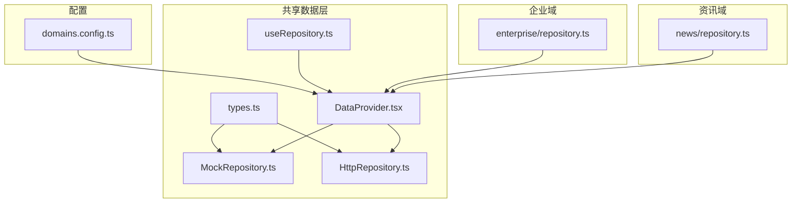
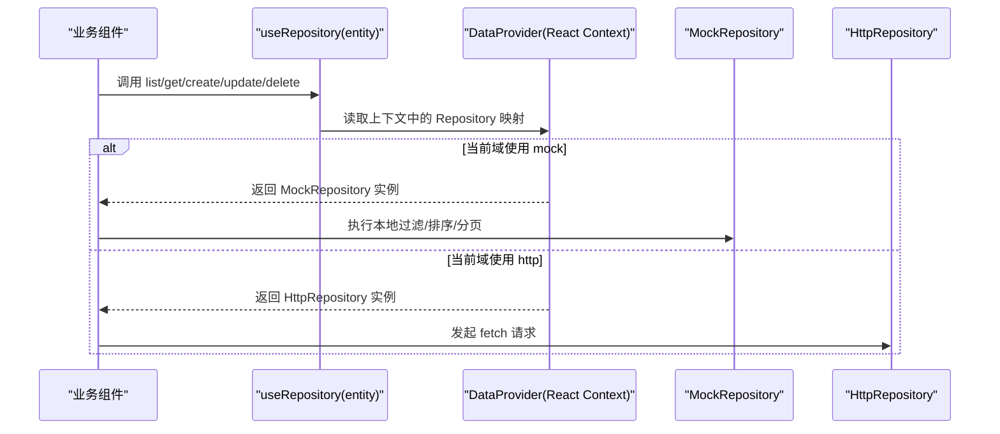
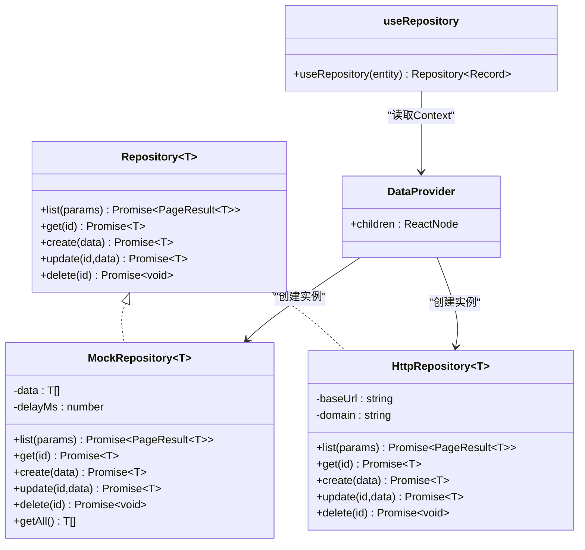

# Repository接口规范

<cite>
**本文引用的文件**
- [HttpRepository.ts](file://hj-admin/src/shared/data/HttpRepository.ts)
- [MockRepository.ts](file://hj-admin/src/shared/data/MockRepository.ts)
- [useRepository.ts](file://hj-admin/src/shared/data/useRepository.ts)
- [types.ts](file://hj-admin/src/shared/data/types.ts)
- [DataProvider.tsx](file://hj-admin/src/shared/data/DataProvider.tsx)
- [domains.config.ts](file://hj-admin/src/config/domains.config.ts)
- [enterprise/repository.ts](file://hj-admin/src/domains/enterprise/repository.ts)
- [news/repository.ts](file://hj-admin/src/domains/news/repository.ts)
</cite>

## 目录
1. [简介](#简介)
2. [项目结构](#项目结构)
3. [核心组件](#核心组件)
4. [架构总览](#架构总览)
5. [详细组件分析](#详细组件分析)
6. [依赖关系分析](#依赖关系分析)
7. [性能与异步处理](#性能与异步处理)
8. [错误处理与排障指南](#错误处理与排障指南)
9. [结论](#结论)
10. [附录：API定义与示例路径](#附录api定义与示例路径)

## 简介
本文件为仓库中数据访问层“Repository”接口的完整API文档，覆盖以下要点：
- 统一接口契约：list、get、create、update、delete 的参数格式、返回值结构与错误语义
- HTTP 与 Mock 两种实现的区别、适用场景与切换方式
- useRepository Hook 的使用方法：状态管理、错误处理与性能优化建议
- 完整的代码示例路径与集成指南（以源码路径引用代替直接粘贴代码）
- 异步操作的处理模式与最佳实践

## 项目结构
数据访问层位于 shared/data 目录，提供统一的 Repository 抽象与两种具体实现；各业务域通过各自的 repository.ts 注册初始数据或绑定数据源。

图示来源
- [types.ts:1-36](file://hj-admin/src/shared/data/types.ts#L1-L36)
- [MockRepository.ts:1-101](file://hj-admin/src/shared/data/MockRepository.ts#L1-L101)
- [HttpRepository.ts:1-70](file://hj-admin/src/shared/data/HttpRepository.ts#L1-L70)
- [DataProvider.tsx:1-44](file://hj-admin/src/shared/data/DataProvider.tsx#L1-L44)
- [useRepository.ts:1-24](file://hj-admin/src/shared/data/useRepository.ts#L1-L24)
- [domains.config.ts:1-18](file://hj-admin/src/config/domains.config.ts#L1-L18)
- [enterprise/repository.ts:1-6](file://hj-admin/src/domains/enterprise/repository.ts#L1-L6)
- [news/repository.ts:1-11](file://hj-admin/src/domains/news/repository.ts#L1-L11)

章节来源
- [types.ts:1-36](file://hj-admin/src/shared/data/types.ts#L1-L36)
- [DataProvider.tsx:1-44](file://hj-admin/src/shared/data/DataProvider.tsx#L1-L44)
- [domains.config.ts:1-18](file://hj-admin/src/config/domains.config.ts#L1-L18)

## 核心组件
- Repository<T>：统一的数据访问接口，定义 list/get/create/update/delete 五个方法
- QueryParams/PageResult：查询参数与分页结果的结构定义
- MockRepository：内存数据+延迟模拟的本地实现，适合前端联调与演示
- HttpRepository：基于 fetch 的HTTP实现，对接后端REST API
- DataProvider：按域装配 Repository 实例，并注入 React Context
- useRepository：在任意组件中以 entity 名称获取对应域的 Repository 实例

章节来源
- [types.ts:1-36](file://hj-admin/src/shared/data/types.ts#L1-L36)
- [MockRepository.ts:1-101](file://hj-admin/src/shared/data/MockRepository.ts#L1-L101)
- [HttpRepository.ts:1-70](file://hj-admin/src/shared/data/HttpRepository.ts#L1-L70)
- [DataProvider.tsx:1-44](file://hj-admin/src/shared/data/DataProvider.tsx#L1-L44)
- [useRepository.ts:1-24](file://hj-admin/src/shared/data/useRepository.ts#L1-L24)

## 架构总览
下图展示了从组件到数据源的调用链路，以及不同数据源模式的装配过程。

图示来源
- [useRepository.ts:1-24](file://hj-admin/src/shared/data/useRepository.ts#L1-L24)
- [DataProvider.tsx:1-44](file://hj-admin/src/shared/data/DataProvider.tsx#L1-L44)
- [MockRepository.ts:1-101](file://hj-admin/src/shared/data/MockRepository.ts#L1-L101)
- [HttpRepository.ts:1-70](file://hj-admin/src/shared/data/HttpRepository.ts#L1-L70)

## 详细组件分析

### Repository 接口与类型定义
- 接口方法
  - list(params): Promise<PageResult<T>>
  - get(id): Promise<T>
  - create(data): Promise<T>
  - update(id, data): Promise<T>
  - delete(id): Promise<void>
- 查询参数 QueryParams
  - page?: number
  - pageSize?: number
  - filters?: Record<string, unknown>
  - sort?: { field: string; order: 'ascend' | 'descend' }
  - search?: string
- 分页结果 PageResult<T>
  - list: T[]
  - total: number
  - page: number
  - pageSize: number

章节来源
- [types.ts:1-36](file://hj-admin/src/shared/data/types.ts#L1-L36)

### MockRepository 实现
- 行为特征
  - 所有方法均返回 Promise，模拟网络延迟（默认约数百毫秒）
  - list 支持关键词搜索、多字段筛选、排序与分页
  - get/update/delete 对不存在ID抛出错误
  - getAll() 暴露全量数据（供Schema页面计数等使用）
- 复杂度
  - list: O(N) 过滤 + O(N log N) 排序 + O(1) 切片
  - get/update/delete: O(N) 查找
- 适用场景
  - 前端独立开发、联调前演示、无需后端时的快速验证

章节来源
- [MockRepository.ts:1-101](file://hj-admin/src/shared/data/MockRepository.ts#L1-L101)

### HttpRepository 实现
- 行为特征
  - 基于 fetch 发起JSON请求，自动设置 Content-Type
  - 非2xx响应抛出错误（包含HTTP状态码信息）
  - list 将 QueryParams 序列化为 URLSearchParams，filters 以 filter.<key>=value 形式拼接
  - get/update/delete 分别对应 GET/PUT/DELETE
- 适用场景
  - 后端API就绪后的真实数据交互
- 注意事项
  - 跨域、鉴权、重试、超时等策略需由上层封装或扩展

章节来源
- [HttpRepository.ts:1-70](file://hj-admin/src/shared/data/HttpRepository.ts#L1-L70)

### DataProvider 装配与 useRepository 使用
- DataProvider
  - 根据 domains.config.ts 中每个域的 DataSourceMode 选择 MockRepository 或 HttpRepository
  - 将各域 Repository 实例放入 React Context
- useRepository
  - 通过 useContext 获取指定 entity 的 Repository
  - 若未注册，返回空操作的 fallback 并打印警告

章节来源
- [DataProvider.tsx:1-44](file://hj-admin/src/shared/data/DataProvider.tsx#L1-L44)
- [useRepository.ts:1-24](file://hj-admin/src/shared/data/useRepository.ts#L1-L24)
- [domains.config.ts:1-18](file://hj-admin/src/config/domains.config.ts#L1-L18)

### 领域绑定示例（注册Mock数据）
- 企业域：在 bootstrap 阶段注册初始企业列表
- 资讯域：注册新闻列表与数据源列表

章节来源
- [enterprise/repository.ts:1-6](file://hj-admin/src/domains/enterprise/repository.ts#L1-L6)
- [news/repository.ts:1-11](file://hj-admin/src/domains/news/repository.ts#L1-L11)

## 依赖关系分析
- types.ts 被 MockRepository、HttpRepository、useRepository 引用
- DataProvider 依赖 domainConfig 与各实现类
- useRepository 依赖 DataProvider 提供的上下文
- 各域 repository.ts 仅负责注册初始数据，不直接耦合实现类

图示来源
- [types.ts:1-36](file://hj-admin/src/shared/data/types.ts#L1-L36)
- [MockRepository.ts:1-101](file://hj-admin/src/shared/data/MockRepository.ts#L1-L101)
- [HttpRepository.ts:1-70](file://hj-admin/src/shared/data/HttpRepository.ts#L1-L70)
- [DataProvider.tsx:1-44](file://hj-admin/src/shared/data/DataProvider.tsx#L1-L44)
- [useRepository.ts:1-24](file://hj-admin/src/shared/data/useRepository.ts#L1-L24)

## 性能与异步处理
- 列表查询
  - MockRepository：在客户端完成过滤、排序与分页，适合小数据集；大数据集建议增加分页或虚拟滚动
  - HttpRepository：服务端完成过滤/排序/分页，客户端仅需渲染当前页
- 并发与竞态
  - 多个并发请求时，建议在组件层做去抖/节流与请求取消（如 AbortController），避免过时响应覆盖最新状态
- 缓存与预取
  - 对热点数据可引入轻量缓存（如内存Map或SWR/React Query），减少重复请求
- 加载态与错误态
  - 所有方法均为异步，组件应显式管理 loading/error/success 三态

[本节为通用指导，不直接分析具体文件]

## 错误处理与排障指南
- 常见错误
  - 404/5xx：HttpRepository 会抛出包含状态码的错误，组件应捕获并提示用户
  - 资源不存在：MockRepository 的 get/update 对不存在ID抛错，需检查ID有效性
  - 未注册实体：useRepository 找不到 entity 时会返回空操作并打印警告，请检查 domains.config.ts 与 DataProvider 装配
- 排查步骤
  - 确认 domains.config.ts 中目标域的模式是否正确
  - 确认对应域的 repository.ts 是否已注册初始数据（mock模式下）
  - 在浏览器控制台查看警告信息与网络请求详情

章节来源
- [HttpRepository.ts:1-70](file://hj-admin/src/shared/data/HttpRepository.ts#L1-L70)
- [MockRepository.ts:1-101](file://hj-admin/src/shared/data/MockRepository.ts#L1-L101)
- [useRepository.ts:1-24](file://hj-admin/src/shared/data/useRepository.ts#L1-L24)
- [DataProvider.tsx:1-44](file://hj-admin/src/shared/data/DataProvider.tsx#L1-L44)
- [domains.config.ts:1-18](file://hj-admin/src/config/domains.config.ts#L1-L18)

## 结论
- Repository 抽象屏蔽了数据源差异，使页面与业务逻辑无需关心底层是本地还是远程
- 通过单一配置文件即可切换数据源模式，便于前后端并行开发与平滑上线
- 结合 useRepository 可在任意组件内便捷获取领域数据访问能力，配合合理的状态管理与错误处理，可获得一致的用户体验

[本节为总结性内容，不直接分析具体文件]

## 附录：API定义与示例路径

### 统一接口与方法签名
- list(params: QueryParams): Promise<PageResult<T>>
- get(id: string): Promise<T>
- create(data: Partial<T>): Promise<T>
- update(id: string, data: Partial<T>): Promise<T>
- delete(id: string): Promise<void>

章节来源
- [types.ts:1-36](file://hj-admin/src/shared/data/types.ts#L1-L36)

### 查询参数与分页结果
- QueryParams
  - page?: number
  - pageSize?: number
  - filters?: Record<string, unknown>
  - sort?: { field: string; order: 'ascend' | 'descend' }
  - search?: string
- PageResult<T>
  - list: T[]
  - total: number
  - page: number
  - pageSize: number

章节来源
- [types.ts:1-36](file://hj-admin/src/shared/data/types.ts#L1-L36)

### HTTP 实现细节（HttpRepository）
- 请求构造
  - list 将 QueryParams 转为 URLSearchParams，filters 以 filter.<key>=value 拼接
  - 统一设置 Content-Type: application/json
- 错误语义
  - response.ok 为 false 时抛出错误，包含状态码与状态文本
- 路由约定
  - base/domain 作为资源根路径
  - GET /base/domain/:id
  - POST /base/domain
  - PUT /base/domain/:id
  - DELETE /base/domain/:id

章节来源
- [HttpRepository.ts:1-70](file://hj-admin/src/shared/data/HttpRepository.ts#L1-L70)

### Mock 实现细节（MockRepository）
- 行为
  - 所有方法返回 Promise，内部模拟延迟
  - list 支持关键词搜索、多字段筛选、排序与分页
  - get/update/delete 对不存在ID抛错
  - getAll() 返回全量数据（用于Schema页面计数等）

章节来源
- [MockRepository.ts:1-101](file://hj-admin/src/shared/data/MockRepository.ts#L1-L101)

### 使用 useRepository Hook 的集成指南
- 在应用根节点包裹 DataProvider
- 在任意组件中通过 useRepository('entity') 获取对应域的 Repository
- 在组件内管理 loading/error/success 三态，并对异常进行友好提示
- 如需切换数据源，修改 domains.config.ts 中对应域的模式即可

章节来源
- [DataProvider.tsx:1-44](file://hj-admin/src/shared/data/DataProvider.tsx#L1-L44)
- [useRepository.ts:1-24](file://hj-admin/src/shared/data/useRepository.ts#L1-L24)
- [domains.config.ts:1-18](file://hj-admin/src/config/domains.config.ts#L1-L18)

### 领域注册示例（Mock 数据）
- 企业域：注册初始企业列表
- 资讯域：注册新闻列表与数据源列表

章节来源
- [enterprise/repository.ts:1-6](file://hj-admin/src/domains/enterprise/repository.ts#L1-L6)
- [news/repository.ts:1-11](file://hj-admin/src/domains/news/repository.ts#L1-L11)