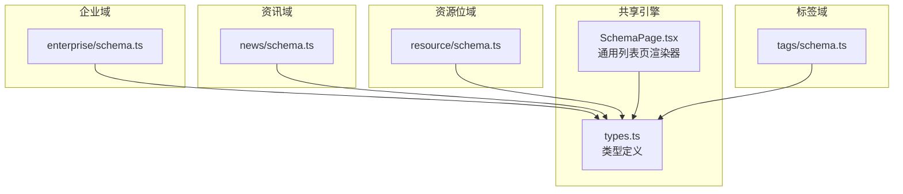
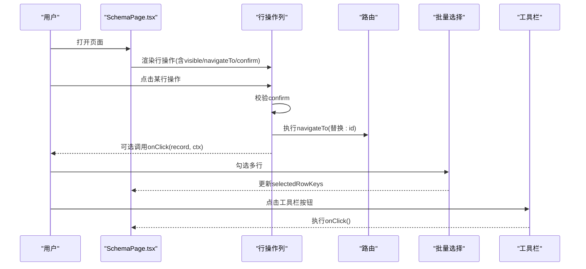
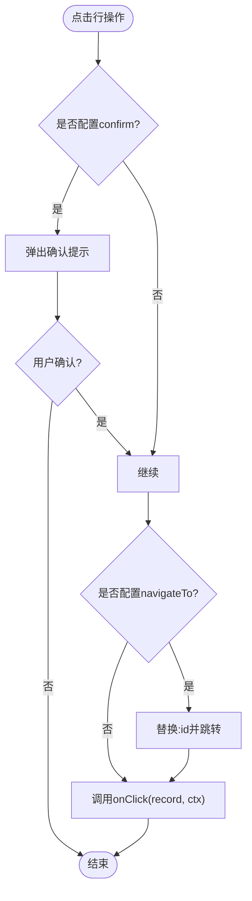
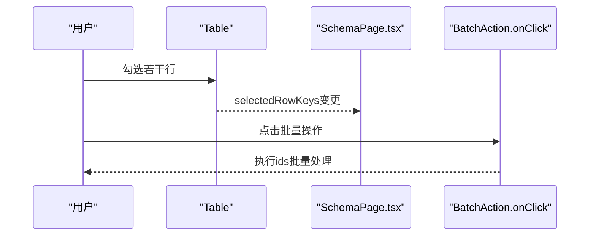
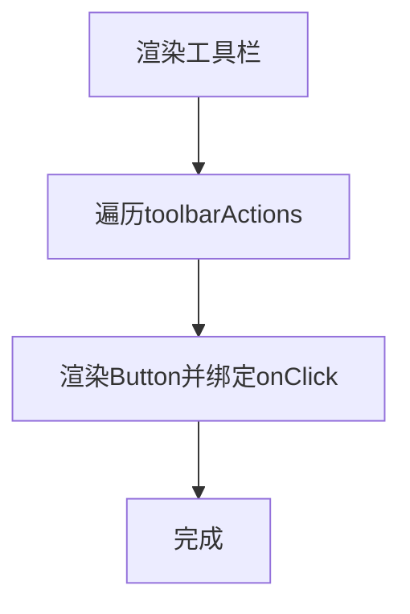
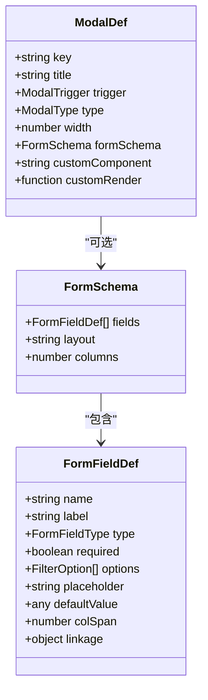
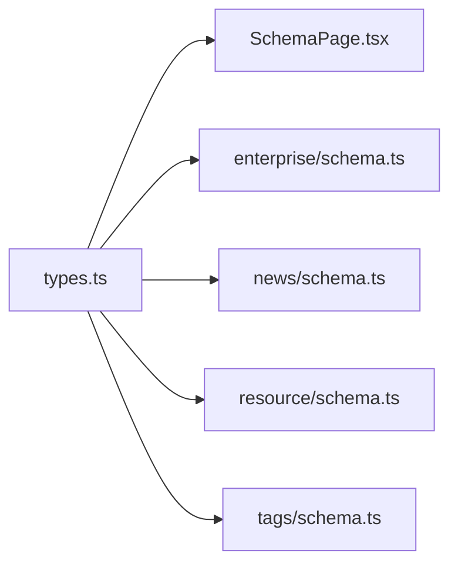

# ActionSchema操作配置

<cite>
**本文引用的文件**   
- [types.ts](file://hj-admin/src/shared/schema-engine/types.ts)
- [SchemaPage.tsx](file://hj-admin/src/shared/schema-engine/SchemaPage.tsx)
- [enterprise/schema.ts](file://hj-admin/src/domains/enterprise/schema.ts)
- [news/schema.ts](file://hj-admin/src/domains/news/schema.ts)
- [resource/schema.ts](file://hj-admin/src/domains/resource/schema.ts)
- [tags/schema.ts](file://hj-admin/src/domains/tags/schema.ts)
</cite>

## 目录
1. [简介](#简介)
2. [项目结构](#项目结构)
3. [核心组件](#核心组件)
4. [架构总览](#架构总览)
5. [详细组件分析](#详细组件分析)
6. [依赖关系分析](#依赖关系分析)
7. [性能与可用性建议](#性能与可用性建议)
8. [故障排查指南](#故障排查指南)
9. [结论](#结论)
10. [附录：常见业务场景示例路径](#附录常见业务场景示例路径)

## 简介
本文件面向使用 Schema 驱动引擎的开发者，系统化说明“操作配置”能力，包括：
- RowAction 行操作、BatchAction 批量操作、ToolbarAction 工具栏操作的配置方法
- 操作的显示条件 visible、点击回调 onClick、导航跳转 navigateTo、确认提示 confirm 等属性
- ModalDef 弹窗定义的配置，包括 trigger 触发方式、type 弹窗类型、formSchema 表单配置、customComponent 自定义组件等
- 提供完整示例路径，覆盖增删改查、批量操作、弹窗编辑等常见业务场景

## 项目结构
本项目采用“领域 + 共享引擎”的组织方式：
- 共享引擎位于 shared/schema-engine，提供页面渲染器与类型定义
- 各业务域（如 enterprise、news、resource、tags）在各自 schema.ts 中声明 PageSchema，包含筛选、列、分页、操作与弹窗等配置

图表来源
- [types.ts:131-174](file://hj-admin/src/shared/schema-engine/types.ts#L131-L174)
- [SchemaPage.tsx:76-226](file://hj-admin/src/shared/schema-engine/SchemaPage.tsx#L76-L226)
- [enterprise/schema.ts:1-64](file://hj-admin/src/domains/enterprise/schema.ts#L1-L64)
- [news/schema.ts:1-123](file://hj-admin/src/domains/news/schema.ts#L1-L123)
- [resource/schema.ts:1-51](file://hj-admin/src/domains/resource/schema.ts#L1-L51)
- [tags/schema.ts:1-39](file://hj-admin/src/domains/tags/schema.ts#L1-L39)

章节来源
- [types.ts:131-174](file://hj-admin/src/shared/schema-engine/types.ts#L131-L174)
- [SchemaPage.tsx:76-226](file://hj-admin/src/shared/schema-engine/SchemaPage.tsx#L76-L226)

## 核心组件
- PageSchema：页面级配置对象，聚合筛选、表格、分页、操作与弹窗等
- RowAction：行级操作，支持可见性、导航、确认、回调
- BatchAction：批量操作，作用于选中行集合
- ToolbarAction：工具栏按钮，常用于新增、刷新等全局动作
- ModalDef：弹窗/抽屉定义，支持表单模式或自定义组件模式
- FormSchema：表单字段描述，用于自动生成弹窗表单

章节来源
- [types.ts:43-92](file://hj-admin/src/shared/schema-engine/types.ts#L43-L92)
- [types.ts:106-129](file://hj-admin/src/shared/schema-engine/types.ts#L106-L129)
- [types.ts:131-174](file://hj-admin/src/shared/schema-engine/types.ts#L131-L174)

## 架构总览
Schema 驱动的列表页由 SchemaPage 统一渲染。其关键流程如下：
- 读取 PageSchema 中的 rowActions、batchActions、toolbarActions、modals
- 根据 visible 过滤行操作
- 处理 navigateTo 路由替换与 confirm 确认
- 当存在 batchActions 时启用表格多选
- 渲染 toolbarActions 为工具栏按钮

图表来源
- [SchemaPage.tsx:112-142](file://hj-admin/src/shared/schema-engine/SchemaPage.tsx#L112-L142)
- [SchemaPage.tsx:185-196](file://hj-admin/src/shared/schema-engine/SchemaPage.tsx#L185-L196)
- [SchemaPage.tsx:205-209](file://hj-admin/src/shared/schema-engine/SchemaPage.tsx#L205-L209)

## 详细组件分析

### 行操作 RowAction
- 作用：在每行末尾展示一组可点击的操作项
- 关键属性
  - key：唯一标识
  - label：按钮文案
  - type：样式类型（primary/default/danger/success）
  - visible：按行数据动态控制是否显示
  - navigateTo：声明式路由，支持 :id 占位符自动替换
  - confirm：二次确认提示文本
  - onClick：点击回调，接收 record 与上下文 ctx（refresh、navigate、showModal）
- 渲染逻辑
  - 若配置了 confirm，先弹出确认框
  - 若配置了 navigateTo，将 :id 替换为当前行的 id 并跳转
  - 最后调用 onClick（如有）

图表来源
- [SchemaPage.tsx:122-131](file://hj-admin/src/shared/schema-engine/SchemaPage.tsx#L122-L131)
- [types.ts:43-56](file://hj-admin/src/shared/schema-engine/types.ts#L43-L56)

章节来源
- [types.ts:43-56](file://hj-admin/src/shared/schema-engine/types.ts#L43-L56)
- [SchemaPage.tsx:112-142](file://hj-admin/src/shared/schema-engine/SchemaPage.tsx#L112-L142)
- [enterprise/schema.ts:24-26](file://hj-admin/src/domains/enterprise/schema.ts#L24-L26)
- [news/schema.ts:48-52](file://hj-admin/src/domains/news/schema.ts#L48-L52)
- [resource/schema.ts:32-36](file://hj-admin/src/domains/resource/schema.ts#L32-L36)
- [tags/schema.ts:16-19](file://hj-admin/src/domains/tags/schema.ts#L16-L19)

### 批量操作 BatchAction
- 作用：对选中的多行进行统一操作
- 关键属性
  - key：唯一标识
  - label：按钮文案
  - type：样式类型（primary/default/danger）
  - onClick：接收选中行的 ids 数组
  - confirm：二次确认提示文本
- 交互要点
  - 当配置了 batchActions，表格会启用多选
  - 选中行变化后，可通过工具区或扩展区域触发批量操作（具体 UI 位置由上层实现决定）

图表来源
- [SchemaPage.tsx:205-209](file://hj-admin/src/shared/schema-engine/SchemaPage.tsx#L205-L209)
- [types.ts:58-65](file://hj-admin/src/shared/schema-engine/types.ts#L58-L65)

章节来源
- [types.ts:58-65](file://hj-admin/src/shared/schema-engine/types.ts#L58-L65)
- [SchemaPage.tsx:205-209](file://hj-admin/src/shared/schema-engine/SchemaPage.tsx#L205-L209)

### 工具栏操作 ToolbarAction
- 作用：在表格上方提供全局操作按钮（如新增、导出、刷新）
- 关键属性
  - key：唯一标识
  - label：按钮文案
  - type：样式类型（primary/default）
  - icon：图标名（字符串引用）
  - onClick：点击回调
- 渲染位置：筛选栏下方、表格上方

图表来源
- [SchemaPage.tsx:185-196](file://hj-admin/src/shared/schema-engine/SchemaPage.tsx#L185-L196)
- [types.ts:67-74](file://hj-admin/src/shared/schema-engine/types.ts#L67-L74)

章节来源
- [types.ts:67-74](file://hj-admin/src/shared/schema-engine/types.ts#L67-L74)
- [SchemaPage.tsx:185-196](file://hj-admin/src/shared/schema-engine/SchemaPage.tsx#L185-L196)
- [tags/schema.ts:20-21](file://hj-admin/src/domains/tags/schema.ts#L20-L21)
- [tags/schema.ts:38-39](file://hj-admin/src/domains/tags/schema.ts#L38-L39)

### 弹窗定义 ModalDef
- 作用：声明弹窗/抽屉，支持两种内容模式
  - 表单模式：通过 formSchema 自动生成表单
  - 自定义模式：通过 customComponent 引用已注册组件，或通过 customRender 函数直接返回节点
- 关键属性
  - key：唯一标识
  - title：弹窗标题
  - trigger：触发来源（rowAction | batchAction | toolbar）
  - type：modal 或 drawer
  - width：宽度
  - formSchema：表单字段定义（见下节）
  - customComponent：自定义组件名称（字符串引用）
  - customRender：自定义渲染函数，接收 record 与上下文 ctx
- 触发方式
  - rowAction：从行操作中触发
  - batchAction：从批量操作中触发
  - toolbar：从工具栏操作中触发

图表来源
- [types.ts:76-92](file://hj-admin/src/shared/schema-engine/types.ts#L76-L92)
- [types.ts:106-129](file://hj-admin/src/shared/schema-engine/types.ts#L106-L129)

章节来源
- [types.ts:76-92](file://hj-admin/src/shared/schema-engine/types.ts#L76-L92)
- [types.ts:106-129](file://hj-admin/src/shared/schema-engine/types.ts#L106-L129)

### 表单 Schema FormSchema
- 作用：以声明式方式描述弹窗表单的字段、布局与联动
- 关键字段
  - fields：字段数组
  - layout：horizontal / vertical / inline
  - columns：栅格列数
- 字段定义 FormFieldDef
  - name：字段名
  - label：显示标签
  - type：input/textarea/select/radio/checkbox/datePicker/rangePicker/number/colorPicker/treeSelect/cascader
  - required：是否必填
  - options：下拉选项（静态或联动计算）
  - placeholder：占位提示
  - defaultValue：默认值
  - colSpan：栅格跨度
  - linkage：联动规则（field + handler）

章节来源
- [types.ts:106-129](file://hj-admin/src/shared/schema-engine/types.ts#L106-L129)

## 依赖关系分析
- types.ts 定义了所有操作与弹窗的类型契约，被 SchemaPage 与各域 schema.ts 共同引用
- SchemaPage.tsx 消费 types.ts 的类型，负责渲染与交互
- 各域 schema.ts 仅做配置声明，不包含渲染逻辑，便于维护与复用

图表来源
- [types.ts:131-174](file://hj-admin/src/shared/schema-engine/types.ts#L131-L174)
- [SchemaPage.tsx:76-226](file://hj-admin/src/shared/schema-engine/SchemaPage.tsx#L76-L226)
- [enterprise/schema.ts:1-64](file://hj-admin/src/domains/enterprise/schema.ts#L1-L64)
- [news/schema.ts:1-123](file://hj-admin/src/domains/news/schema.ts#L1-L123)
- [resource/schema.ts:1-51](file://hj-admin/src/domains/resource/schema.ts#L1-L51)
- [tags/schema.ts:1-39](file://hj-admin/src/domains/tags/schema.ts#L1-L39)

章节来源
- [types.ts:131-174](file://hj-admin/src/shared/schema-engine/types.ts#L131-L174)
- [SchemaPage.tsx:76-226](file://hj-admin/src/shared/schema-engine/SchemaPage.tsx#L76-L226)

## 性能与可用性建议
- 行操作 visible 函数应避免复杂计算，必要时缓存结果或使用 useMemo 提升性能
- navigateTo 使用 :id 占位符时，确保记录中存在 id 字段，避免空值导致路由异常
- confirm 提示应简洁明确，减少误操作风险
- 批量操作前建议增加 confirm 提示，并对 ids 长度做边界检查
- 工具栏操作尽量幂等，避免重复提交

[本节为通用建议，不直接分析具体文件]

## 故障排查指南
- 行操作未显示
  - 检查 visible 函数返回值是否为 true
  - 确认 rowActions 是否配置在当前页面的 PageSchema 中
- 点击无响应
  - 检查 onClick 是否正确挂载
  - 若同时配置了 navigateTo，注意顺序：先导航再回调
- 导航参数缺失
  - 确认记录中存在 id 字段，且 navigateTo 使用了 :id 占位符
- 批量操作无效
  - 确认 batchActions 已配置，且表格启用了多选
  - 检查 selectedRowKeys 是否正确更新
- 工具栏按钮不生效
  - 检查 toolbarActions 是否配置，以及 onClick 是否实现

章节来源
- [SchemaPage.tsx:112-142](file://hj-admin/src/shared/schema-engine/SchemaPage.tsx#L112-L142)
- [SchemaPage.tsx:185-196](file://hj-admin/src/shared/schema-engine/SchemaPage.tsx#L185-L196)
- [SchemaPage.tsx:205-209](file://hj-admin/src/shared/schema-engine/SchemaPage.tsx#L205-L209)

## 结论
通过 RowAction、BatchAction、ToolbarAction 与 ModalDef/FormSchema 的组合，可以在几乎零代码的情况下构建完整的增删改查与弹窗编辑能力。类型驱动与声明式配置使页面维护成本显著降低，适合大规模后台系统的快速迭代。

[本节为总结，不直接分析具体文件]

## 附录：常见业务场景示例路径
- 行操作：查看/编辑/发布/下架/分类/停用/启用/删除
  - 企业库·待处理池：去处理（导航）
    - [enterprise/schema.ts:24-26](file://hj-admin/src/domains/enterprise/schema.ts#L24-L26)
  - 企业库·已确认企业：去分类（带可见条件）、查看
    - [enterprise/schema.ts:55-58](file://hj-admin/src/domains/enterprise/schema.ts#L55-L58)
  - 资讯池：编辑、发布（草稿可见）、下架（已发布可见）
    - [news/schema.ts:48-52](file://hj-admin/src/domains/news/schema.ts#L48-L52)
  - 数据源管理：启用（已停用可见）、停用（运行中可见，带确认）
    - [news/schema.ts:118-121](file://hj-admin/src/domains/news/schema.ts#L118-L121)
  - Banner/Icon/Promotion 管理：编辑、启用/停用切换
    - [resource/schema.ts:19](file://hj-admin/src/domains/resource/schema.ts#L19)
    - [resource/schema.ts:32-36](file://hj-admin/src/domains/resource/schema.ts#L32-L36)
  - 标签管理：编辑、删除（带确认）
    - [tags/schema.ts:16-19](file://hj-admin/src/domains/tags/schema.ts#L16-L19)
    - [tags/schema.ts:34-37](file://hj-admin/src/domains/tags/schema.ts#L34-L37)

- 批量操作：批量启用/停用、批量删除、批量导入等
  - 参考类型定义与表格多选启用逻辑
    - [types.ts:58-65](file://hj-admin/src/shared/schema-engine/types.ts#L58-L65)
    - [SchemaPage.tsx:205-209](file://hj-admin/src/shared/schema-engine/SchemaPage.tsx#L205-L209)

- 工具栏操作：新增、导出、刷新
  - 标签管理：新增标签
    - [tags/schema.ts:20-21](file://hj-admin/src/domains/tags/schema.ts#L20-L21)
    - [tags/schema.ts:38-39](file://hj-admin/src/domains/tags/schema.ts#L38-L39)

- 弹窗编辑：新增/编辑弹窗（表单模式或自定义组件模式）
  - 参考 ModalDef 与 FormSchema 类型定义
    - [types.ts:76-92](file://hj-admin/src/shared/schema-engine/types.ts#L76-L92)
    - [types.ts:106-129](file://hj-admin/src/shared/schema-engine/types.ts#L106-L129)