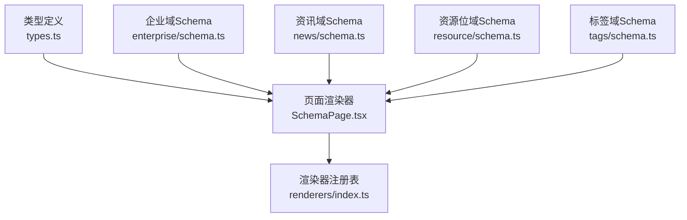
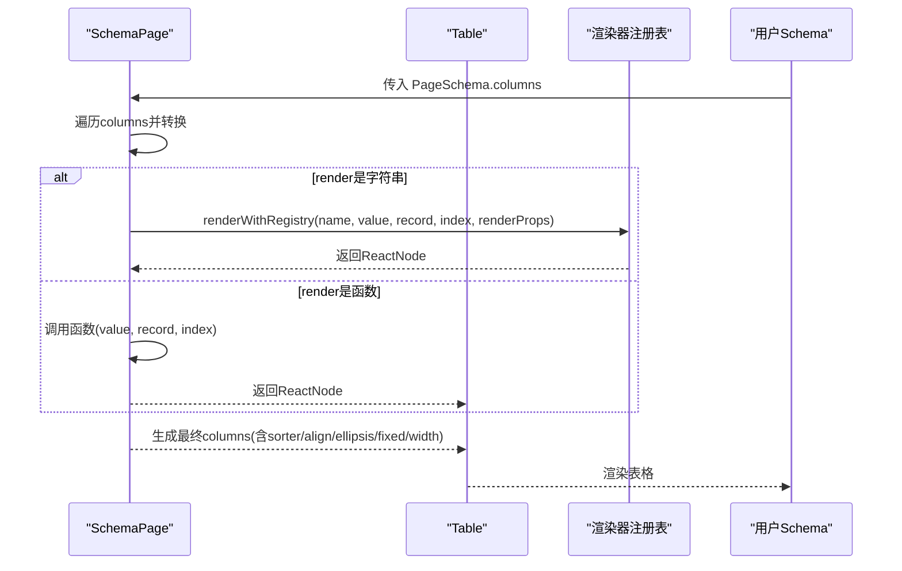
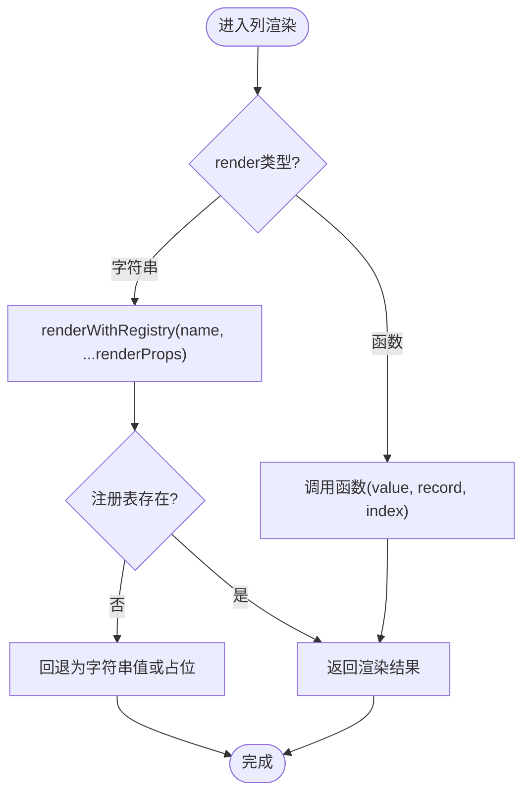
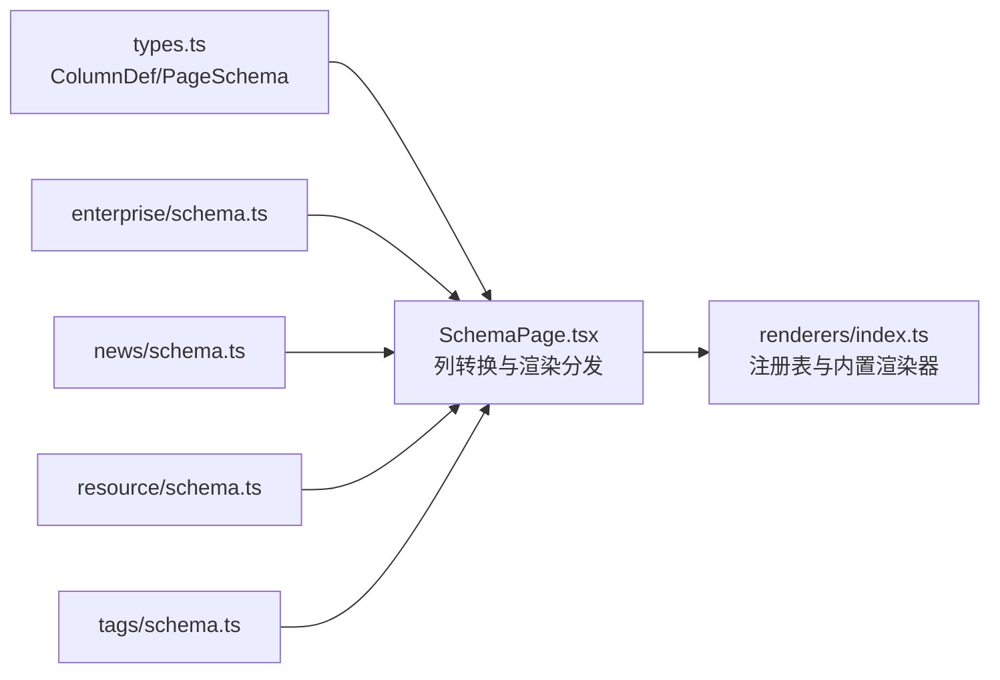

# ColumnSchema列配置

<cite>
**本文引用的文件**
- [types.ts](file://hj-admin/src/shared/schema-engine/types.ts)
- [SchemaPage.tsx](file://hj-admin/src/shared/schema-engine/SchemaPage.tsx)
- [renderers/index.ts](file://hj-admin/src/shared/schema-engine/renderers/index.ts)
- [enterprise/schema.ts](file://hj-admin/src/domains/enterprise/schema.ts)
- [news/schema.ts](file://hj-admin/src/domains/news/schema.ts)
- [resource/schema.ts](file://hj-admin/src/domains/resource/schema.ts)
- [tags/schema.ts](file://hj-admin/src/domains/tags/schema.ts)
</cite>

## 目录
1. [简介](#简介)
2. [项目结构](#项目结构)
3. [核心组件](#核心组件)
4. [架构总览](#架构总览)
5. [详细组件分析](#详细组件分析)
6. [依赖关系分析](#依赖关系分析)
7. [性能与可维护性建议](#性能与可维护性建议)
8. [故障排查指南](#故障排查指南)
9. [结论](#结论)
10. [附录：常用列配置示例速查](#附录常用列配置示例速查)

## 简介
本文件面向使用 Schema 驱动引擎的开发者，系统化说明 ColumnDef 列配置的所有属性与用法，包括字段映射、标题、宽度、固定列、对齐、省略、排序以及自定义渲染器（字符串引用与函数两种模式）。同时提供文本列、数字列、状态列、操作列等常见场景的配置参考路径，帮助快速上手并稳定扩展。

## 项目结构
Schema 驱动的列表页由“类型定义 + 页面渲染器 + 渲染器注册表 + 各域 Schema”组成：
- 类型定义：ColumnDef 接口集中描述列能力
- 页面渲染器：将 ColumnDef 转换为表格列，并处理 render 分支
- 渲染器注册表：集中管理内置渲染器，支持字符串引用
- 各域 Schema：以声明式方式组合列、筛选、分页、行操作等

图表来源
- [types.ts:26-41](file://hj-admin/src/shared/schema-engine/types.ts#L26-L41)
- [SchemaPage.tsx:89-110](file://hj-admin/src/shared/schema-engine/SchemaPage.tsx#L89-L110)
- [renderers/index.ts:1-46](file://hj-admin/src/shared/schema-engine/renderers/index.ts#L1-L46)
- [enterprise/schema.ts:15-21](file://hj-admin/src/domains/enterprise/schema.ts#L15-L21)
- [news/schema.ts:37-44](file://hj-admin/src/domains/news/schema.ts#L37-L44)
- [resource/schema.ts:10-17](file://hj-admin/src/domains/resource/schema.ts#L10-L17)
- [tags/schema.ts:8-14](file://hj-admin/src/domains/tags/schema.ts#L8-L14)

章节来源
- [types.ts:26-41](file://hj-admin/src/shared/schema-engine/types.ts#L26-L41)
- [SchemaPage.tsx:89-110](file://hj-admin/src/shared/schema-engine/SchemaPage.tsx#L89-L110)
- [renderers/index.ts:1-46](file://hj-admin/src/shared/schema-engine/renderers/index.ts#L1-L46)

## 核心组件
本节聚焦 ColumnDef 接口的全部属性及其在渲染流程中的行为。

- field: 数据字段名，作为 dataIndex 和 key 的来源，用于绑定列到记录字段
- title: 列头显示文本
- width: 列宽（px）
- minWidth: 最小列宽
- fixed: 固定列位置，'left' | 'right'
- align: 单元格对齐方式，'left' | 'center' | 'right'
- ellipsis: 是否启用文本省略
- render: 自定义渲染器，支持两种模式
  - 字符串：引用注册表中的渲染器名称，如 'status-badge'
  - 函数：(value, record, index) => ReactNode，直接返回节点
- renderProps: 传递给渲染器的额外参数，类型为 Record<string, unknown>
- sorter: 是否可排序或自定义比较函数
  - boolean: 开启默认排序
  - (a, b) => number: 自定义比较逻辑

章节来源
- [types.ts:26-41](file://hj-admin/src/shared/schema-engine/types.ts#L26-L41)
- [SchemaPage.tsx:89-110](file://hj-admin/src/shared/schema-engine/SchemaPage.tsx#L89-L110)

## 架构总览
SchemaPage 负责将 PageSchema.columns 转换为 Ant Design Table 的 columns，并对 render 进行分发：
- 若为字符串，则通过 renderWithRegistry 查找并执行对应渲染器
- 若为函数，则直接调用该函数渲染
- sorter 透传给 Table，支持布尔开关或自定义比较函数

图表来源
- [SchemaPage.tsx:89-110](file://hj-admin/src/shared/schema-engine/SchemaPage.tsx#L89-L110)
- [renderers/index.ts:31-46](file://hj-admin/src/shared/schema-engine/renderers/index.ts#L31-L46)

## 详细组件分析

### ColumnDef 属性详解
- field
  - 作用：绑定列到数据记录的字段，同时作为 key 与 dataIndex
  - 注意：需与数据类型一致，避免空值导致渲染异常
- title
  - 作用：列头文案
- width / minWidth
  - 作用：控制列宽与最小宽度
  - 建议：对长文本列设置合理 width，配合 ellipsis 提升可读性
- fixed
  - 作用：固定列到左侧或右侧
  - 典型用法：操作列固定右侧
- align
  - 作用：单元格内容对齐
  - 数值型列推荐 right，居中列推荐 center
- ellipsis
  - 作用：超长文本省略显示
  - 建议：与 width 配合使用
- render
  - 字符串模式：引用注册表中已注册的渲染器名称
  - 函数模式：接收 value、record、index，返回 ReactNode
  - 传递参数：通过 renderProps 向渲染器传参
- sorter
  - boolean：开启默认排序
  - 函数：实现自定义比较逻辑，返回正负数决定顺序
- renderProps
  - 作用：向渲染器注入配置项，例如颜色映射、跳转模板等

章节来源
- [types.ts:26-41](file://hj-admin/src/shared/schema-engine/types.ts#L26-L41)
- [SchemaPage.tsx:89-110](file://hj-admin/src/shared/schema-engine/SchemaPage.tsx#L89-L110)

### 渲染器机制与内置渲染器
- 注册表
  - registerRenderer(name, renderer)：注册渲染器
  - getRenderer(name)：获取渲染器
  - renderWithRegistry(name, value, record, index, renderProps, onAction)：按名称查找并执行
- 内置渲染器（部分）
  - tag-list：标签列表
  - status-badge：状态徽章，支持 colorMap
  - entity-count：实体计数，支持点击回调
  - link：可导航链接，支持 :id 模板替换
  - date-or-dash：日期或破折号占位
  - text：纯文本
  - color-tag：带颜色的标签
  - percent：百分比展示，阈值着色
  - url：外链展示，自动截断
  - success-rate：成功率等级展示
  - link-progress：关联进度文本
  - position-tags：位置标签集合

图表来源
- [SchemaPage.tsx:100-107](file://hj-admin/src/shared/schema-engine/SchemaPage.tsx#L100-L107)
- [renderers/index.ts:31-46](file://hj-admin/src/shared/schema-engine/renderers/index.ts#L31-L46)

章节来源
- [renderers/index.ts:1-163](file://hj-admin/src/shared/schema-engine/renderers/index.ts#L1-L163)
- [SchemaPage.tsx:89-110](file://hj-admin/src/shared/schema-engine/SchemaPage.tsx#L89-L110)

### 排序功能（sorter）
- 布尔模式：开启默认排序
- 函数模式：(a, b) => number，返回正负数决定升序/降序
- 使用建议：
  - 数值列可直接基于字段比较
  - 日期列需先解析再比较
  - 复杂列建议封装比较函数，保持 schema 简洁

章节来源
- [types.ts:39-41](file://hj-admin/src/shared/schema-engine/types.ts#L39-L41)
- [SchemaPage.tsx:99](file://hj-admin/src/shared/schema-engine/SchemaPage.tsx#L99)

### 列配置实战示例（按场景）
以下为各域中实际使用的列配置片段路径，便于对照理解不同场景下的写法与最佳实践。

- 文本列（普通文本、链接、URL）
  - 普通文本：[text 渲染器使用:10-17](file://hj-admin/src/domains/resource/schema.ts#L10-L17)
  - 链接跳转：[link 渲染器使用:37-44](file://hj-admin/src/domains/news/schema.ts#L37-L44)
  - URL 外链：[url 渲染器使用:107-115](file://hj-admin/src/domains/news/schema.ts#L107-L115)

- 数字列（百分比、成功率、计数）
  - 百分比：[percent 渲染器使用:44-52](file://hj-admin/src/domains/enterprise/schema.ts#L44-L52)
  - 成功率：[success-rate 渲染器使用:107-115](file://hj-admin/src/domains/news/schema.ts#L107-L115)
  - 计数：[entity-count 渲染器使用:37-44](file://hj-admin/src/domains/news/schema.ts#L37-L44)

- 状态列（状态徽章、颜色标签）
  - 状态徽章：[status-badge 渲染器使用:37-44](file://hj-admin/src/domains/news/schema.ts#L37-L44)
  - 颜色标签：[color-tag 渲染器使用:8-14](file://hj-admin/src/domains/tags/schema.ts#L8-L14)

- 时间列（日期或占位）
  - 日期或破折号：[date-or-dash 渲染器使用:15-21](file://hj-admin/src/domains/enterprise/schema.ts#L15-L21)

- 操作列（行操作）
  - 行操作列由 SchemaPage 自动生成，固定右侧，支持条件可见与确认提示
  - 参考：[行操作列生成逻辑:112-142](file://hj-admin/src/shared/schema-engine/SchemaPage.tsx#L112-L142)

章节来源
- [enterprise/schema.ts:15-21](file://hj-admin/src/domains/enterprise/schema.ts#L15-L21)
- [enterprise/schema.ts:44-52](file://hj-admin/src/domains/enterprise/schema.ts#L44-L52)
- [news/schema.ts:37-44](file://hj-admin/src/domains/news/schema.ts#L37-L44)
- [news/schema.ts:107-115](file://hj-admin/src/domains/news/schema.ts#L107-L115)
- [tags/schema.ts:8-14](file://hj-admin/src/domains/tags/schema.ts#L8-L14)
- [SchemaPage.tsx:112-142](file://hj-admin/src/shared/schema-engine/SchemaPage.tsx#L112-L142)

## 依赖关系分析
- types.ts 提供 ColumnDef 等类型，被 SchemaPage 与各域 Schema 引用
- SchemaPage 消费 ColumnDef，并将 render 分派至渲染器注册表
- 各域 Schema 通过 ColumnDef 组合列、筛选、分页、行操作等

图表来源
- [types.ts:26-41](file://hj-admin/src/shared/schema-engine/types.ts#L26-L41)
- [SchemaPage.tsx:89-110](file://hj-admin/src/shared/schema-engine/SchemaPage.tsx#L89-L110)
- [renderers/index.ts:1-46](file://hj-admin/src/shared/schema-engine/renderers/index.ts#L1-L46)
- [enterprise/schema.ts:15-21](file://hj-admin/src/domains/enterprise/schema.ts#L15-L21)
- [news/schema.ts:37-44](file://hj-admin/src/domains/news/schema.ts#L37-L44)
- [resource/schema.ts:10-17](file://hj-admin/src/domains/resource/schema.ts#L10-L17)
- [tags/schema.ts:8-14](file://hj-admin/src/domains/tags/schema.ts#L8-L14)

章节来源
- [types.ts:26-41](file://hj-admin/src/shared/schema-engine/types.ts#L26-L41)
- [SchemaPage.tsx:89-110](file://hj-admin/src/shared/schema-engine/SchemaPage.tsx#L89-L110)
- [renderers/index.ts:1-46](file://hj-admin/src/shared/schema-engine/renderers/index.ts#L1-L46)

## 性能与可维护性建议
- 优先使用内置渲染器，减少重复代码；仅在特殊需求时编写函数渲染
- 对大列表列渲染函数应轻量，避免重计算；必要时缓存 renderProps 或计算结果
- 合理使用 width/minWidth 与 ellipsis，避免频繁重排
- 固定列数量不宜过多，影响横向滚动体验
- sorter 函数尽量简单高效，复杂排序考虑后端排序

## 故障排查指南
- 渲染器未找到
  - 现象：控制台警告渲染器不存在，回退为字符串值
  - 排查：检查 render 字符串是否与注册表一致，确保已正确注册
  - 参考：[渲染器查找与回退逻辑:31-46](file://hj-admin/src/shared/schema-engine/renderers/index.ts#L31-L46)
- 列不显示或错位
  - 现象：列宽异常、内容溢出
  - 排查：检查 width/minWidth/align/ellipsis 配置；核对 field 与数据类型匹配
  - 参考：[列转换逻辑:89-110](file://hj-admin/src/shared/schema-engine/SchemaPage.tsx#L89-L110)
- 排序无效
  - 现象：点击列头无排序效果
  - 排查：确认 sorter 是否为 true 或提供了比较函数；比较函数返回值是否正确
  - 参考：[sorter 透传](file://hj-admin/src/shared/schema-engine/SchemaPage.tsx#L99)

章节来源
- [renderers/index.ts:31-46](file://hj-admin/src/shared/schema-engine/renderers/index.ts#L31-L46)
- [SchemaPage.tsx:89-110](file://hj-admin/src/shared/schema-engine/SchemaPage.tsx#L89-L110)

## 结论
ColumnDef 提供了声明式、可扩展的列配置能力。通过统一的类型定义与渲染器注册表，既保证了配置的简洁与可序列化，又保留了强大的自定义渲染与排序能力。结合各域的实际 Schema，可以快速构建一致的列表体验。

## 附录：常用列配置示例速查
- 文本列
  - 普通文本：[resource/schema.ts:10-17](file://hj-admin/src/domains/resource/schema.ts#L10-L17)
  - 链接跳转：[news/schema.ts:37-44](file://hj-admin/src/domains/news/schema.ts#L37-L44)
  - URL 外链：[news/schema.ts:107-115](file://hj-admin/src/domains/news/schema.ts#L107-L115)
- 数字列
  - 百分比：[enterprise/schema.ts:44-52](file://hj-admin/src/domains/enterprise/schema.ts#L44-L52)
  - 成功率：[news/schema.ts:107-115](file://hj-admin/src/domains/news/schema.ts#L107-L115)
  - 计数：[news/schema.ts:37-44](file://hj-admin/src/domains/news/schema.ts#L37-L44)
- 状态列
  - 状态徽章：[news/schema.ts:37-44](file://hj-admin/src/domains/news/schema.ts#L37-L44)
  - 颜色标签：[tags/schema.ts:8-14](file://hj-admin/src/domains/tags/schema.ts#L8-L14)
- 时间列
  - 日期或占位：[enterprise/schema.ts:15-21](file://hj-admin/src/domains/enterprise/schema.ts#L15-L21)
- 操作列
  - 行操作列生成：[SchemaPage.tsx:112-142](file://hj-admin/src/shared/schema-engine/SchemaPage.tsx#L112-L142)