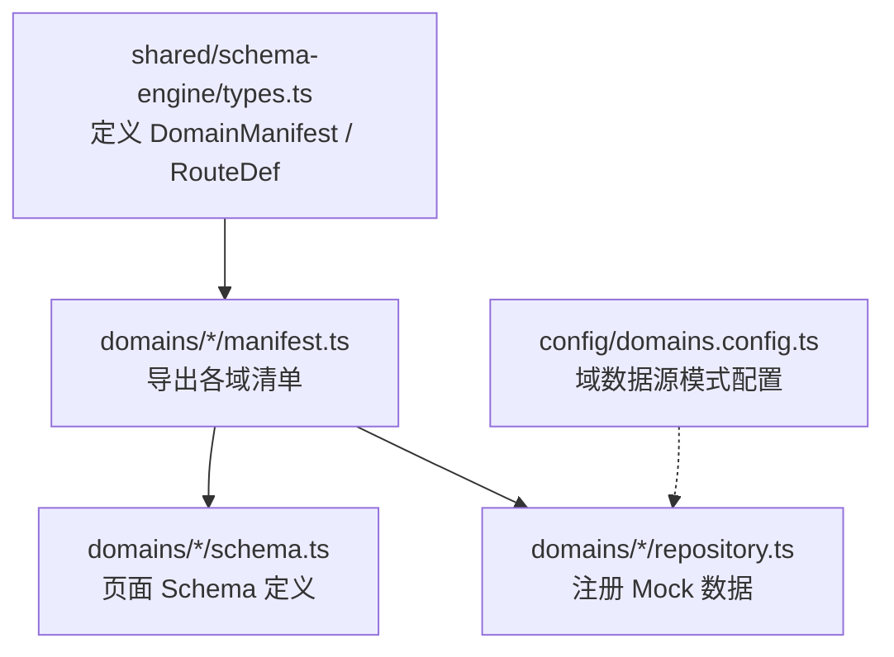
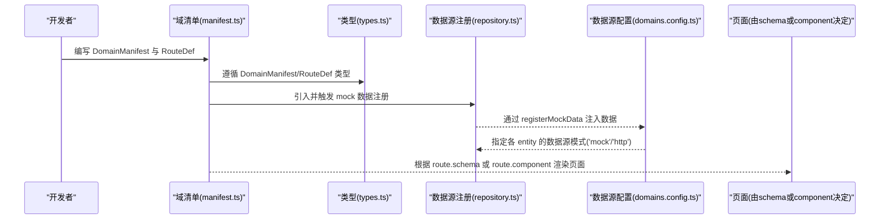
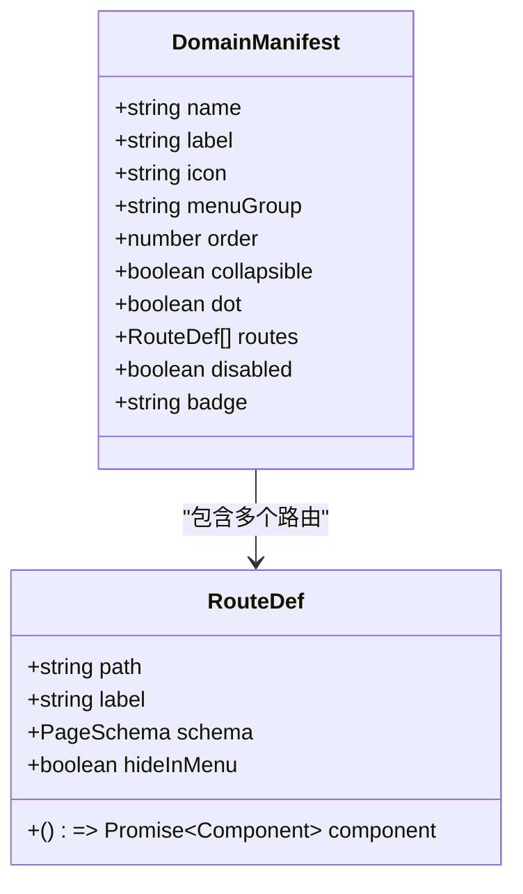
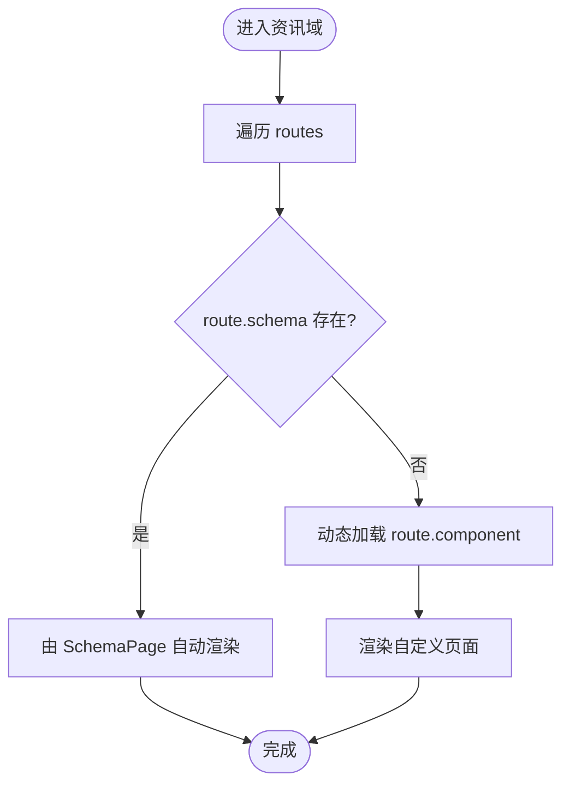
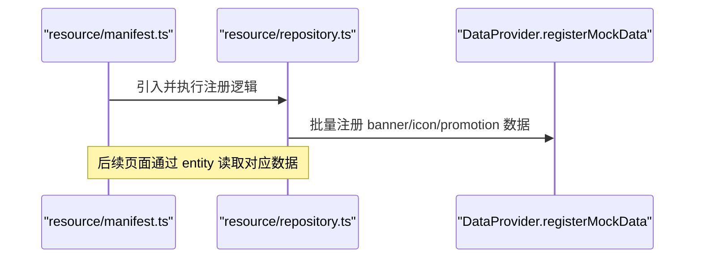
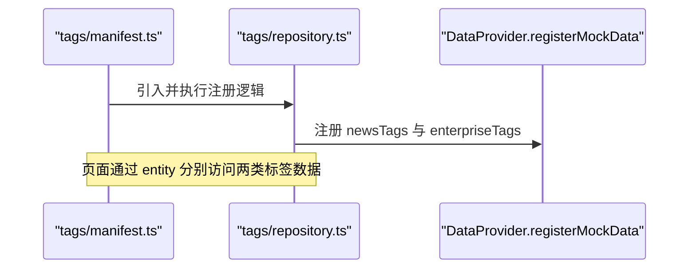
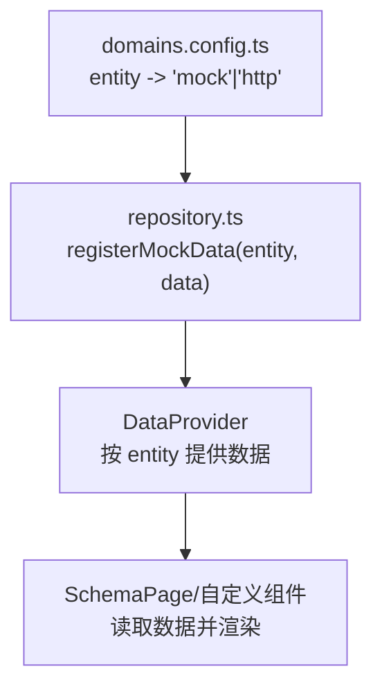
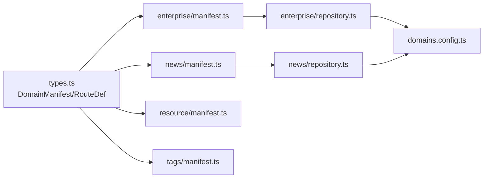

# DomainManifest域清单配置

<cite>
**本文引用的文件**
- [types.ts](file://hj-admin/src/shared/schema-engine/types.ts)
- [manifest.ts（企业域）](file://hj-admin/src/domains/enterprise/manifest.ts)
- [manifest.ts（资讯域）](file://hj-admin/src/domains/news/manifest.ts)
- [manifest.ts（资源位域）](file://hj-admin/src/domains/resource/manifest.ts)
- [manifest.ts（标签域）](file://hj-admin/src/domains/tags/manifest.ts)
- [repository.ts（企业域）](file://hj-admin/src/domains/enterprise/repository.ts)
- [repository.ts（资讯域）](file://hj-admin/src/domains/news/repository.ts)
- [domains.config.ts](file://hj-admin/src/config/domains.config.ts)
</cite>

## 目录
1. [简介](#简介)
2. [项目结构](#项目结构)
3. [核心组件](#核心组件)
4. [架构总览](#架构总览)
5. [详细组件分析](#详细组件分析)
6. [依赖关系分析](#依赖关系分析)
7. [性能考虑](#性能考虑)
8. [故障排查指南](#故障排查指南)
9. [结论](#结论)
10. [附录](#附录)

## 简介
本文件面向“DomainManifest 域清单”的配置与使用，系统性说明：
- DomainManifest 接口的全部属性含义与用法
- RouteDef 路由定义的配置方法
- 多页面、多级菜单的组织方式
- 域的启用/禁用机制与徽章显示能力
- 结合现有示例的完整配置范式

## 项目结构
本项目采用“按域组织”的结构，每个域包含 manifest.ts（域清单）、schema.ts（页面 Schema）、repository.ts（数据源注册）、mock.ts（模拟数据）等。类型定义集中在 shared/schema-engine/types.ts，供所有域复用。

图示来源
- [types.ts:176-208](file://hj-admin/src/shared/schema-engine/types.ts#L176-L208)
- [manifest.ts（企业域）:1-20](file://hj-admin/src/domains/enterprise/manifest.ts#L1-L20)
- [manifest.ts（资讯域）:1-42](file://hj-admin/src/domains/news/manifest.ts#L1-L42)
- [manifest.ts（资源位域）:1-22](file://hj-admin/src/domains/resource/manifest.ts#L1-L22)
- [manifest.ts（标签域）:1-21](file://hj-admin/src/domains/tags/manifest.ts#L1-L21)
- [repository.ts（企业域）:1-6](file://hj-admin/src/domains/enterprise/repository.ts#L1-L6)
- [repository.ts（资讯域）:1-11](file://hj-admin/src/domains/news/repository.ts#L1-L11)
- [domains.config.ts:1-18](file://hj-admin/src/config/domains.config.ts#L1-L18)

章节来源
- [types.ts:176-208](file://hj-admin/src/shared/schema-engine/types.ts#L176-L208)
- [manifest.ts（企业域）:1-20](file://hj-admin/src/domains/enterprise/manifest.ts#L1-L20)
- [manifest.ts（资讯域）:1-42](file://hj-admin/src/domains/news/manifest.ts#L1-L42)
- [manifest.ts（资源位域）:1-22](file://hj-admin/src/domains/resource/manifest.ts#L1-L22)
- [manifest.ts（标签域）:1-21](file://hj-admin/src/domains/tags/manifest.ts#L1-L21)
- [repository.ts（企业域）:1-6](file://hj-admin/src/domains/enterprise/repository.ts#L1-L6)
- [repository.ts（资讯域）:1-11](file://hj-admin/src/domains/news/repository.ts#L1-L11)
- [domains.config.ts:1-18](file://hj-admin/src/config/domains.config.ts#L1-L18)

## 核心组件
本节聚焦 DomainManifest 与 RouteDef 的类型定义与语义。

- DomainManifest 字段说明
  - name：域唯一标识，用于系统内区分不同业务域
  - label：域在菜单中的显示名称
  - icon：域图标（字符串形式）
  - menuGroup：所属菜单分组名
  - order：排序权重，数值越小越靠前
  - collapsible：是否可展开（拥有子路由时控制折叠行为）
  - dot：是否在菜单项旁显示小圆点（常用于提示未读或待处理）
  - routes：该域下的路由列表
  - disabled：域的禁用状态（预留扩展）
  - badge：域级徽章文本（如统计数量）

- RouteDef 字段说明
  - path：路由路径
  - label：菜单项标签
  - schema：页面 Schema（若提供，则由 SchemaPage 自动渲染）
  - component：自定义组件（懒加载函数），当不提供 schema 时使用
  - hideInMenu：是否在菜单中隐藏（常用于编辑页等）

章节来源
- [types.ts:176-208](file://hj-admin/src/shared/schema-engine/types.ts#L176-L208)

## 架构总览
下图展示了“域清单 → 路由 → 页面渲染”的整体流程，以及数据源切换机制。

图示来源
- [manifest.ts（企业域）:1-20](file://hj-admin/src/domains/enterprise/manifest.ts#L1-L20)
- [manifest.ts（资讯域）:1-42](file://hj-admin/src/domains/news/manifest.ts#L1-L42)
- [repository.ts（企业域）:1-6](file://hj-admin/src/domains/enterprise/repository.ts#L1-L6)
- [repository.ts（资讯域）:1-11](file://hj-admin/src/domains/news/repository.ts#L1-L11)
- [domains.config.ts:1-18](file://hj-admin/src/config/domains.config.ts#L1-L18)
- [types.ts:176-208](file://hj-admin/src/shared/schema-engine/types.ts#L176-L208)

## 详细组件分析

### 企业域清单（enterprise）
- 域级别
  - name：企业域标识
  - label：显示名称
  - icon：图标
  - menuGroup：菜单分组
  - order：排序权重
  - collapsible：支持展开
  - dot：显示小圆点
- 路由级别
  - 列表类路由：通过 schema 驱动页面渲染
  - 编辑类路由：通过 component 懒加载自定义组件，并设置 hideInMenu 隐藏于菜单

图示来源
- [types.ts:176-208](file://hj-admin/src/shared/schema-engine/types.ts#L176-L208)
- [manifest.ts（企业域）:1-20](file://hj-admin/src/domains/enterprise/manifest.ts#L1-L20)

章节来源
- [manifest.ts（企业域）:1-20](file://hj-admin/src/domains/enterprise/manifest.ts#L1-L20)
- [repository.ts（企业域）:1-6](file://hj-admin/src/domains/enterprise/repository.ts#L1-L6)
- [types.ts:176-208](file://hj-admin/src/shared/schema-engine/types.ts#L176-L208)

### 资讯域清单（news）
- 域级别
  - name：资讯域标识
  - label：显示名称
  - icon：图标
  - menuGroup：内容管理分组
  - order：排序权重
  - collapsible：支持展开
- 路由级别
  - 池化/已发布/数据源管理等页面均通过 schema 驱动
  - 编辑页通过 component 懒加载并隐藏于菜单

图示来源
- [manifest.ts（资讯域）:1-42](file://hj-admin/src/domains/news/manifest.ts#L1-L42)
- [types.ts:176-208](file://hj-admin/src/shared/schema-engine/types.ts#L176-L208)

章节来源
- [manifest.ts（资讯域）:1-42](file://hj-admin/src/domains/news/manifest.ts#L1-L42)
- [repository.ts（资讯域）:1-11](file://hj-admin/src/domains/news/repository.ts#L1-L11)
- [types.ts:176-208](file://hj-admin/src/shared/schema-engine/types.ts#L176-L208)

### 资源位域清单（resource）
- 特点
  - 将 Banner、Icon、推广活动等资源管理聚合到同一域
  - 通过 repository 侧统一注册 mock 数据
  - 路由均以 schema 驱动，便于快速迭代

图示来源
- [manifest.ts（资源位域）:1-22](file://hj-admin/src/domains/resource/manifest.ts#L1-L22)

章节来源
- [manifest.ts（资源位域）:1-22](file://hj-admin/src/domains/resource/manifest.ts#L1-L22)

### 标签域清单（tags）
- 特点
  - 将资讯标签与企业标签合并为“标签管理”域
  - 通过 repository 侧注册 newsTags 与 enterpriseTags 两类数据
  - 路由以 schema 驱动，结构清晰

图示来源
- [manifest.ts（标签域）:1-21](file://hj-admin/src/domains/tags/manifest.ts#L1-L21)

章节来源
- [manifest.ts（标签域）:1-21](file://hj-admin/src/domains/tags/manifest.ts#L1-L21)

### 域的启用/禁用机制与徽章显示
- 启用/禁用
  - DomainManifest 提供 disabled 字段，可用于在菜单层面对整个域进行显隐控制（当前为预留扩展）
- 徽章显示
  - DomainManifest 提供 badge 字段，可在域菜单项上展示文本型徽章（如待处理数）
- 小圆点显示
  - dot 字段用于在菜单项旁显示小圆点，适合表示“有更新/待处理”等轻量提示

章节来源
- [types.ts:176-208](file://hj-admin/src/shared/schema-engine/types.ts#L176-L208)

### 数据源切换与 Repository 绑定
- 数据源模式
  - domains.config.ts 中维护各 entity 的数据源模式（'mock' 或 'http'）
- 注册方式
  - 各域 repository.ts 通过 registerMockData 将本地 mock 数据注入 DataProvider
- 切换策略
  - 后端 API 就绪后，仅需修改 domains.config.ts 中对应 entity 的模式，无需改动 Schema 与页面代码

图示来源
- [domains.config.ts:1-18](file://hj-admin/src/config/domains.config.ts#L1-L18)
- [repository.ts（企业域）:1-6](file://hj-admin/src/domains/enterprise/repository.ts#L1-L6)
- [repository.ts（资讯域）:1-11](file://hj-admin/src/domains/news/repository.ts#L1-L11)

章节来源
- [domains.config.ts:1-18](file://hj-admin/src/config/domains.config.ts#L1-L18)
- [repository.ts（企业域）:1-6](file://hj-admin/src/domains/enterprise/repository.ts#L1-L6)
- [repository.ts（资讯域）:1-11](file://hj-admin/src/domains/news/repository.ts#L1-L11)

## 依赖关系分析
- 类型依赖
  - 所有 manifest.ts 均依赖 types.ts 中的 DomainManifest 与 RouteDef
- 数据依赖
  - manifest.ts 通过引入 repository.ts 触发数据注册
  - repository.ts 依赖 DataProvider 的 registerMockData
  - domains.config.ts 集中声明各 entity 的数据源模式
- 页面渲染依赖
  - 若 route 提供 schema，则走 SchemaPage 渲染
  - 否则通过 route.component 懒加载自定义组件

图示来源
- [types.ts:176-208](file://hj-admin/src/shared/schema-engine/types.ts#L176-L208)
- [manifest.ts（企业域）:1-20](file://hj-admin/src/domains/enterprise/manifest.ts#L1-L20)
- [manifest.ts（资讯域）:1-42](file://hj-admin/src/domains/news/manifest.ts#L1-L42)
- [manifest.ts（资源位域）:1-22](file://hj-admin/src/domains/resource/manifest.ts#L1-L22)
- [manifest.ts（标签域）:1-21](file://hj-admin/src/domains/tags/manifest.ts#L1-L21)
- [repository.ts（企业域）:1-6](file://hj-admin/src/domains/enterprise/repository.ts#L1-L6)
- [repository.ts（资讯域）:1-11](file://hj-admin/src/domains/news/repository.ts#L1-L11)
- [domains.config.ts:1-18](file://hj-admin/src/config/domains.config.ts#L1-L18)

章节来源
- [types.ts:176-208](file://hj-admin/src/shared/schema-engine/types.ts#L176-L208)
- [manifest.ts（企业域）:1-20](file://hj-admin/src/domains/enterprise/manifest.ts#L1-L20)
- [manifest.ts（资讯域）:1-42](file://hj-admin/src/domains/news/manifest.ts#L1-L42)
- [manifest.ts（资源位域）:1-22](file://hj-admin/src/domains/resource/manifest.ts#L1-L22)
- [manifest.ts（标签域）:1-21](file://hj-admin/src/domains/tags/manifest.ts#L1-L21)
- [repository.ts（企业域）:1-6](file://hj-admin/src/domains/enterprise/repository.ts#L1-L6)
- [repository.ts（资讯域）:1-11](file://hj-admin/src/domains/news/repository.ts#L1-L11)
- [domains.config.ts:1-18](file://hj-admin/src/config/domains.config.ts#L1-L18)

## 性能考虑
- 路由组件懒加载：对无 schema 的路由使用 component 懒加载，减少首屏体积
- 域级 collapsible：合理组织菜单层级，避免过深嵌套影响交互效率
- 数据源切换：通过 domains.config.ts 集中切换，避免多处改动带来的额外开销

## 故障排查指南
- 菜单不显示
  - 检查 domain 的 menuGroup、order、label 是否正确
  - 确认 route.label 与 path 是否冲突或重复
- 页面无法渲染
  - 若使用 schema：核对 entity 是否与 repository 注册的 key 一致
  - 若使用 component：确认懒加载路径正确且模块默认导出存在
- 数据为空
  - 检查 repository.ts 是否成功调用 registerMockData
  - 核对 domains.config.ts 中对应 entity 的数据源模式是否为 'mock'
- 徽章/小圆点不生效
  - 确认 DomainManifest 的 badge/dot 字段已设置
  - 确认 UI 层已消费这些字段进行渲染

章节来源
- [types.ts:176-208](file://hj-admin/src/shared/schema-engine/types.ts#L176-L208)
- [repository.ts（企业域）:1-6](file://hj-admin/src/domains/enterprise/repository.ts#L1-L6)
- [repository.ts（资讯域）:1-11](file://hj-admin/src/domains/news/repository.ts#L1-L11)
- [domains.config.ts:1-18](file://hj-admin/src/config/domains.config.ts#L1-L18)

## 结论
通过 DomainManifest 与 RouteDef 的组合，项目实现了“以域为中心”的可插拔式菜单与路由组织方式。配合 schema 驱动的页面与 repository 的数据源注册，既保证了开发效率，也提供了良好的扩展性与可维护性。未来可通过 disabled 与 badge 进一步增强域的控制与可视化能力。

## 附录
- 典型配置要点速查
  - 域级：name、label、icon、menuGroup、order、collapsible、dot、routes、disabled、badge
  - 路由级：path、label、schema/component、hideInMenu
  - 数据源：repository.ts 注册 entity；domains.config.ts 指定模式