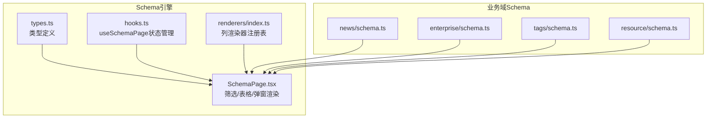
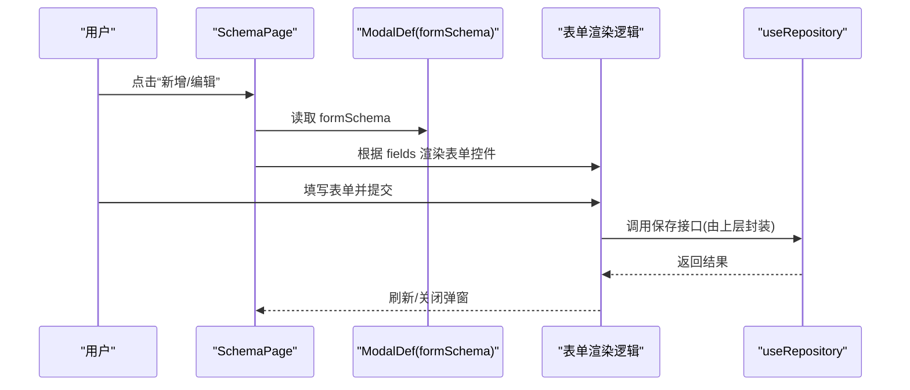
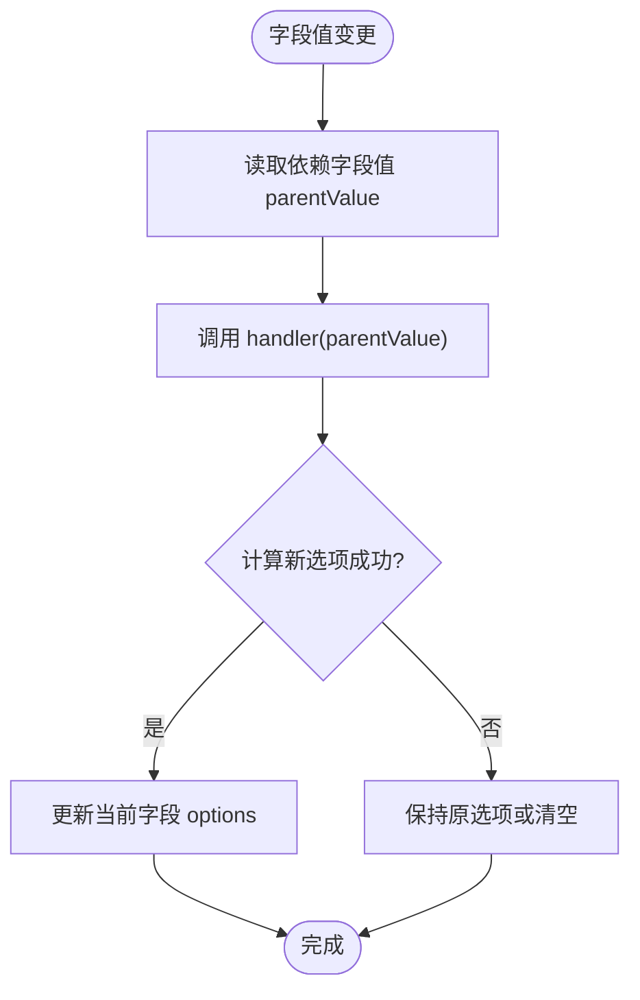
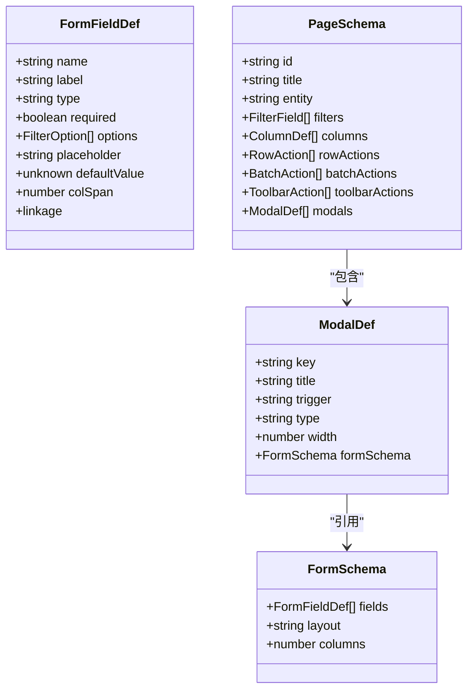

# FormSchema表单配置

<cite>
**本文引用的文件**   
- [types.ts](file://hj-admin/src/shared/schema-engine/types.ts)
- [SchemaPage.tsx](file://hj-admin/src/shared/schema-engine/SchemaPage.tsx)
- [hooks.ts](file://hj-admin/src/shared/schema-engine/hooks.ts)
- [renderers/index.ts](file://hj-admin/src/shared/schema-engine/renderers/index.ts)
- [news/schema.ts](file://hj-admin/src/domains/news/schema.ts)
- [enterprise/schema.ts](file://hj-admin/src/domains/enterprise/schema.ts)
- [tags/schema.ts](file://hj-admin/src/domains/tags/schema.ts)
- [resource/schema.ts](file://hj-admin/src/domains/resource/schema.ts)
</cite>

## 目录
1. [简介](#简介)
2. [项目结构](#项目结构)
3. [核心组件](#核心组件)
4. [架构总览](#架构总览)
5. [详细组件分析](#详细组件分析)
6. [依赖分析](#依赖分析)
7. [性能考虑](#性能考虑)
8. [故障排查指南](#故障排查指南)
9. [结论](#结论)
10. [附录](#附录)

## 简介
本文件聚焦于 FormSchema 表单配置体系，系统化说明 FormFieldDef 字段定义的所有属性、FormSchema 的布局与列数配置、linkage 联动机制的实现方式，并提供输入框、选择器、日期选择器、级联选择器等常见字段的配置示例。文档同时给出类型定义、渲染流程与数据流关系图，帮助读者快速理解并落地使用。

## 项目结构
与 FormSchema 相关的核心代码位于 schema-engine 模块中，包含类型定义、页面状态 Hook、主渲染组件以及渲染器注册表；各业务域通过 PageSchema 引用 ModalDef.formSchema 来声明弹窗表单。

图表来源
- [types.ts:106-129](file://hj-admin/src/shared/schema-engine/types.ts#L106-L129)
- [hooks.ts:20-105](file://hj-admin/src/shared/schema-engine/hooks.ts#L20-L105)
- [SchemaPage.tsx:75-225](file://hj-admin/src/shared/schema-engine/SchemaPage.tsx#L75-L225)
- [renderers/index.ts:1-46](file://hj-admin/src/shared/schema-engine/renderers/index.ts#L1-L46)
- [news/schema.ts:1-123](file://hj-admin/src/domains/news/schema.ts#L1-L123)
- [enterprise/schema.ts:1-64](file://hj-admin/src/domains/enterprise/schema.ts#L1-L64)
- [tags/schema.ts:1-39](file://hj-admin/src/domains/tags/schema.ts#L1-L39)
- [resource/schema.ts:1-51](file://hj-admin/src/domains/resource/schema.ts#L1-L51)

章节来源
- [types.ts:106-129](file://hj-admin/src/shared/schema-engine/types.ts#L106-L129)
- [SchemaPage.tsx:75-225](file://hj-admin/src/shared/schema-engine/SchemaPage.tsx#L75-L225)

## 核心组件
- FormFieldType：表单字段类型集合，包括 input、textarea、select、radio、checkbox、datePicker、rangePicker、number、colorPicker、treeSelect、cascader。
- FormFieldDef：单个表单字段定义，包含 name、label、type、required、options、placeholder、defaultValue、colSpan、linkage 等。
- FormSchema：表单整体配置，包含 fields、layout、columns。
- ModalDef.formSchema：在弹窗（新增/编辑）中引用 FormSchema 进行表单渲染。

章节来源
- [types.ts:106-129](file://hj-admin/src/shared/schema-engine/types.ts#L106-L129)

## 架构总览
下图展示从 Schema 到 UI 的关键路径：业务域提供 PageSchema（可含 modals[].formSchema），SchemaPage 根据类型渲染筛选区与表格，并在触发弹窗时渲染对应 formSchema 的表单。

图表来源
- [SchemaPage.tsx:75-225](file://hj-admin/src/shared/schema-engine/SchemaPage.tsx#L75-L225)
- [hooks.ts:20-105](file://hj-admin/src/shared/schema-engine/hooks.ts#L20-L105)
- [types.ts:80-92](file://hj-admin/src/shared/schema-engine/types.ts#L80-L92)

## 详细组件分析

### FormFieldDef 字段定义详解
- name：字段名，用于表单值键名与提交数据映射。
- label：字段标签，显示在控件上方或左侧。
- type：字段类型，取值见 FormFieldType。
- required：是否必填，用于校验提示。
- options：选项数组，支持字符串数组或 { label, value } 对象数组。
- placeholder：占位符文本。
- defaultValue：默认值。
- colSpan：栅格跨度，控制字段宽度占比。
- linkage：联动配置，包含 field（依赖字段名）与 handler（根据父字段值计算新选项）。

章节来源
- [types.ts:106-123](file://hj-admin/src/shared/schema-engine/types.ts#L106-L123)

### FormSchema 布局与列数
- layout：布局模式，可选 horizontal、vertical、inline。
- columns：每行显示的字段列数，结合 colSpan 可实现复杂排版。

章节来源
- [types.ts:125-129](file://hj-admin/src/shared/schema-engine/types.ts#L125-L129)

### linkage 联动实现方法
- 当被依赖字段变化时，系统会读取其值并调用 handler(parentValue)，返回新的 FilterOption[] 作为当前字段的 options。
- 典型用法：根据“省/市”选择动态加载“区县”，或根据“企业类型”动态加载“细分领域”。

图表来源
- [types.ts:118-123](file://hj-admin/src/shared/schema-engine/types.ts#L118-L123)

### 表单字段类型与配置要点
- 输入类：input、textarea、number、colorPicker
  - 常用属性：name、label、type、placeholder、defaultValue、required、colSpan
- 选择类：select、radio、checkbox、treeSelect、cascader
  - 常用属性：options（字符串数组或对象数组）、defaultValue、required、colSpan、linkage
- 日期类：datePicker、rangePicker
  - 常用属性：defaultValue（单值或范围）、required、colSpan

章节来源
- [types.ts:106-123](file://hj-admin/src/shared/schema-engine/types.ts#L106-L123)

### 实际配置示例（以路径引用代替具体代码）
- 输入框（文本）
  - 参考路径：[news/schema.ts:27-36](file://hj-admin/src/domains/news/schema.ts#L27-L36)
- 选择器（下拉）
  - 参考路径：[news/schema.ts:27-36](file://hj-admin/src/domains/news/schema.ts#L27-L36)、[enterprise/schema.ts:39-43](file://hj-admin/src/domains/enterprise/schema.ts#L39-L43)
- 日期选择器（单值/范围）
  - 参考路径：[news/schema.ts:35](file://hj-admin/src/domains/news/schema.ts#L35)
- 级联选择器（cascader）
  - 参考路径：[types.ts:106-123](file://hj-admin/src/shared/schema-engine/types.ts#L106-L123)

说明：以上为筛选区 FilterField 的配置示例，其结构与 FormFieldDef 高度一致，便于复用同一套字段描述能力。

章节来源
- [news/schema.ts:27-36](file://hj-admin/src/domains/news/schema.ts#L27-L36)
- [enterprise/schema.ts:39-43](file://hj-admin/src/domains/enterprise/schema.ts#L39-L43)
- [types.ts:106-123](file://hj-admin/src/shared/schema-engine/types.ts#L106-L123)

### 弹窗表单（ModalDef.formSchema）集成
- 在 PageSchema.modals 中声明 ModalDef，并通过 formSchema 绑定 FormSchema。
- 触发方式：行操作 rowActions、批量操作 batchActions、工具栏 toolbarActions。
- 渲染流程：SchemaPage 根据 ModalDef 打开弹窗并渲染 formSchema 的 fields。

章节来源
- [types.ts:80-92](file://hj-admin/src/shared/schema-engine/types.ts#L80-L92)
- [SchemaPage.tsx:75-225](file://hj-admin/src/shared/schema-engine/SchemaPage.tsx#L75-L225)

## 依赖分析
- types.ts 提供所有类型定义，是 Schema 体系的基石。
- hooks.ts 提供 useSchemaPage，负责筛选、分页、Tab、选中行与数据加载。
- SchemaPage.tsx 组合渲染筛选区、表格、分页与弹窗，并驱动表单渲染。
- renderers/index.ts 提供列渲染器的注册与执行，与表单无直接耦合，但共同构成页面渲染体系。
- 各域 schema.ts 仅声明 PageSchema，不关心渲染细节，符合低耦合高内聚原则。

图表来源
- [types.ts:106-129](file://hj-admin/src/shared/schema-engine/types.ts#L106-L129)
- [types.ts:80-92](file://hj-admin/src/shared/schema-engine/types.ts#L80-L92)
- [types.ts:131-174](file://hj-admin/src/shared/schema-engine/types.ts#L131-L174)

章节来源
- [types.ts:106-129](file://hj-admin/src/shared/schema-engine/types.ts#L106-L129)
- [types.ts:80-92](file://hj-admin/src/shared/schema-engine/types.ts#L80-L92)
- [types.ts:131-174](file://hj-admin/src/shared/schema-engine/types.ts#L131-L174)

## 性能考虑
- 联动 handler 应轻量且避免重复计算，必要时对 options 做缓存。
- 大列表场景下，减少不必要的重渲染，合理设置 columns 与 colSpan。
- 异步选项加载建议使用 fetchOptions（筛选区已支持），表单侧可按需扩展。

## 故障排查指南
- 字段未渲染或报错
  - 检查 type 是否在 FormFieldType 范围内。
  - 确认 name 唯一且与后端字段一致。
- 联动无效
  - 确认 linkage.field 指向的字段存在且值已更新。
  - handler 返回值应为 FilterOption[]，确保 label/value 格式正确。
- 默认值不生效
  - 检查 defaultValue 类型是否与控件匹配（如 rangePicker 需要范围值）。
- 必填校验不触发
  - 确认 required 为 true，并在提交前进行校验。

章节来源
- [types.ts:106-123](file://hj-admin/src/shared/schema-engine/types.ts#L106-L123)

## 结论
FormSchema 通过统一的字段定义与布局配置，配合 linkage 联动能力，能够以声明式方式快速构建各类表单。结合 ModalDef.formSchema，可在弹窗中复用同一套表单描述，提升开发效率与维护性。

## 附录
- 相关类型与组件位置
  - 类型定义：[types.ts:106-129](file://hj-admin/src/shared/schema-engine/types.ts#L106-L129)
  - 弹窗表单集成：[types.ts:80-92](file://hj-admin/src/shared/schema-engine/types.ts#L80-L92)
  - 页面状态管理：[hooks.ts:20-105](file://hj-admin/src/shared/schema-engine/hooks.ts#L20-L105)
  - 列渲染器注册表：[renderers/index.ts:1-46](file://hj-admin/src/shared/schema-engine/renderers/index.ts#L1-L46)
  - 业务域示例：
    - [news/schema.ts:1-123](file://hj-admin/src/domains/news/schema.ts#L1-L123)
    - [enterprise/schema.ts:1-64](file://hj-admin/src/domains/enterprise/schema.ts#L1-L64)
    - [tags/schema.ts:1-39](file://hj-admin/src/domains/tags/schema.ts#L1-L39)
    - [resource/schema.ts:1-51](file://hj-admin/src/domains/resource/schema.ts#L1-L51)