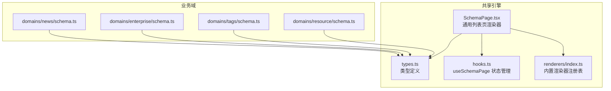
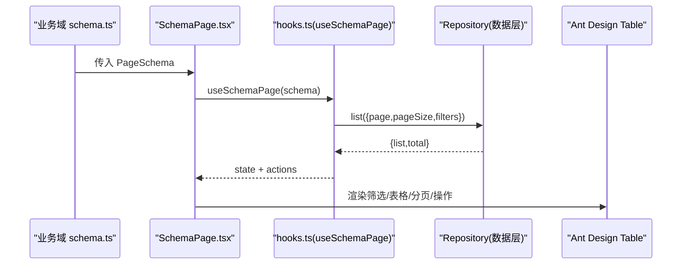
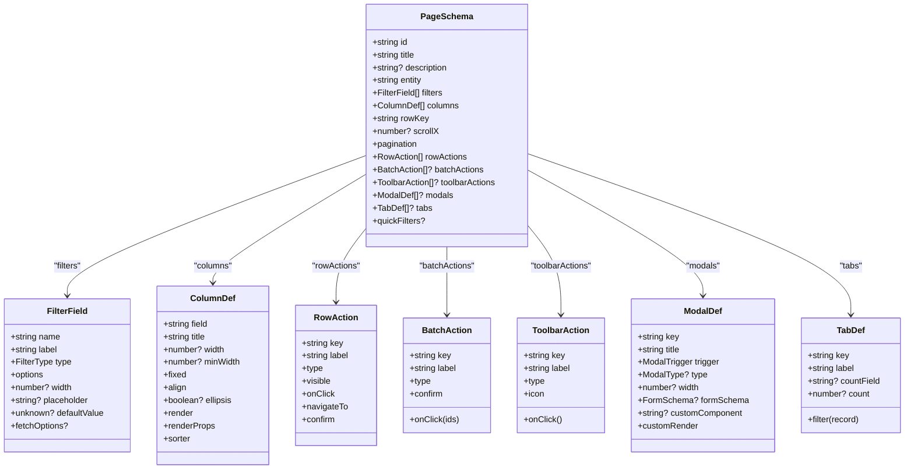

# PageSchema页面配置

<cite>
**本文引用的文件**   
- [types.ts](file://hj-admin/src/shared/schema-engine/types.ts)
- [SchemaPage.tsx](file://hj-admin/src/shared/schema-engine/SchemaPage.tsx)
- [hooks.ts](file://hj-admin/src/shared/schema-engine/hooks.ts)
- [renderers/index.ts](file://hj-admin/src/shared/schema-engine/renderers/index.ts)
- [news/schema.ts](file://hj-admin/src/domains/news/schema.ts)
- [enterprise/schema.ts](file://hj-admin/src/domains/enterprise/schema.ts)
- [tags/schema.ts](file://hj-admin/src/domains/tags/schema.ts)
- [resource/schema.ts](file://hj-admin/src/domains/resource/schema.ts)
</cite>

## 目录
1. [简介](#简介)
2. [项目结构](#项目结构)
3. [核心组件](#核心组件)
4. [架构总览](#架构总览)
5. [详细组件分析](#详细组件分析)
6. [依赖关系分析](#依赖关系分析)
7. [性能与体验建议](#性能与体验建议)
8. [故障排查指南](#故障排查指南)
9. [结论](#结论)
10. [附录：完整列表页配置示例](#附录完整列表页配置示例)

## 简介
本文件面向使用 Schema 驱动引擎的开发者，系统化说明 PageSchema 接口的所有属性与行为，覆盖基础配置、筛选栏 filters、表格列 columns、分页 pagination、行操作 rowActions、批量操作 batchActions、工具栏操作 toolbarActions、弹窗 modals、Tab 分组 tabs、快捷筛选 quickFilters 等。文档同时提供完整的列表页配置示例、最佳实践与常见问题排查指引，帮助快速构建复杂业务页面。

## 项目结构
Schema 驱动引擎位于 shared/schema-engine 下，包含类型定义、渲染器注册表、通用列表页渲染器与状态 Hook；各业务域在 domains/* 中通过 schema.ts 声明式配置页面。

图表来源
- [types.ts:132-174](file://hj-admin/src/shared/schema-engine/types.ts#L132-L174)
- [SchemaPage.tsx:76-225](file://hj-admin/src/shared/schema-engine/SchemaPage.tsx#L76-L225)
- [hooks.ts:20-105](file://hj-admin/src/shared/schema-engine/hooks.ts#L20-L105)
- [renderers/index.ts:1-46](file://hj-admin/src/shared/schema-engine/renderers/index.ts#L1-L46)

章节来源
- [types.ts:132-174](file://hj-admin/src/shared/schema-engine/types.ts#L132-L174)
- [SchemaPage.tsx:76-225](file://hj-admin/src/shared/schema-engine/SchemaPage.tsx#L76-L225)
- [hooks.ts:20-105](file://hj-admin/src/shared/schema-engine/hooks.ts#L20-L105)
- [renderers/index.ts:1-46](file://hj-admin/src/shared/schema-engine/renderers/index.ts#L1-L46)

## 核心组件
- PageSchema：页面配置的根接口，描述一个“列表页”的全部声明式配置。
- useSchemaPage：封装筛选、分页、Tab、选中行、数据加载等状态与交互逻辑。
- SchemaPage：根据 PageSchema 自动渲染筛选栏、Tab、表格、分页、工具栏与行操作。
- renderers：内置渲染器注册表，支持以字符串引用方式渲染列内容（如状态徽章、链接、百分比等）。

章节来源
- [types.ts:132-174](file://hj-admin/src/shared/schema-engine/types.ts#L132-L174)
- [hooks.ts:20-105](file://hj-admin/src/shared/schema-engine/hooks.ts#L20-L105)
- [SchemaPage.tsx:76-225](file://hj-admin/src/shared/schema-engine/SchemaPage.tsx#L76-L225)
- [renderers/index.ts:1-46](file://hj-admin/src/shared/schema-engine/renderers/index.ts#L1-L46)

## 架构总览
下图展示了从配置到渲染的关键流程：业务域通过 schema.ts 声明 PageSchema，SchemaPage 读取配置并调用 useSchemaPage 获取状态，最终渲染出筛选栏、表格、分页与操作区。

图表来源
- [SchemaPage.tsx:76-225](file://hj-admin/src/shared/schema-engine/SchemaPage.tsx#L76-L225)
- [hooks.ts:36-57](file://hj-admin/src/shared/schema-engine/hooks.ts#L36-L57)

## 详细组件分析

### PageSchema 接口属性详解
- id: string
  - 作用：页面唯一标识，用于路由或调试定位。
  - 约束：必填，全局唯一。
- title: string
  - 作用：页面标题，显示在页面顶部。
  - 约束：必填。
- description?: string
  - 作用：页面描述，辅助说明用途。
  - 约束：可选。
- entity: string
  - 作用：绑定的 Repository key，对应 DataProvider 中的注册名，用于数据请求。
  - 约束：必填，需与数据源注册名一致。
- filters: FilterField[]
  - 作用：筛选栏字段集合，支持 select/input/dateRange 等类型。
  - 关键子项：name、label、type、options、width、placeholder、defaultValue、fetchOptions。
  - 行为：变更时重置到第一页并触发重新查询。
- columns: ColumnDef<T>[]
  - 作用：表格列定义，支持宽度、对齐、固定、省略、排序、自定义渲染等。
  - 关键子项：field、title、width/minWidth/fixed/align/ellipsis、render、renderProps、sorter。
  - render：可传字符串引用内置渲染器，或函数实现自定义渲染。
- rowKey: keyof T & string
  - 作用：表格行唯一键，必须为实体主键字段名。
  - 约束：必填且存在于数据类型中。
- scrollX?: number
  - 作用：表格横向滚动阈值，避免列过多导致溢出。
- pagination: { pageSize: number; showTotal?: boolean; showSizeChanger?: boolean }
  - 作用：分页配置，控制默认页大小、是否显示总数、是否允许切换每页条数。
- rowActions: RowAction<T>[]
  - 作用：行级操作按钮，支持条件显示、确认提示、导航跳转、回调执行。
  - 关键子项：key、label、type、visible、onClick、navigateTo、confirm。
- batchActions?: BatchAction[]
  - 作用：批量操作，当开启行选择后显示，支持确认提示。
  - 关键子项：key、label、type、onClick(ids)、confirm。
- toolbarActions?: ToolbarAction[]
  - 作用：工具栏操作，位于筛选栏下方、表格上方。
  - 关键子项：key、label、type、icon、onClick。
- modals?: ModalDef<T>[]
  - 作用：弹窗/抽屉声明，支持表单模式、自定义组件或自定义渲染。
  - 关键子项：key、title、trigger、type、width、formSchema、customComponent、customRender。
- tabs?: TabDef<T>[]
  - 作用：Tab 分组，按 filter 函数过滤当前视图数据，支持静态 count 或动态 countField。
  - 关键子项：key、label、countField、count、filter。
- quickFilters?: { name: string; label: string; options: FilterOption[] }
  - 作用：快捷筛选 Chips，常用于常用维度的一键切换。
  - 注意：该字段已定义但未在当前渲染器中直接渲染，可作为扩展点预留。

章节来源
- [types.ts:132-174](file://hj-admin/src/shared/schema-engine/types.ts#L132-L174)
- [types.ts:14-24](file://hj-admin/src/shared/schema-engine/types.ts#L14-L24)
- [types.ts:27-41](file://hj-admin/src/shared/schema-engine/types.ts#L27-L41)
- [types.ts:44-74](file://hj-admin/src/shared/schema-engine/types.ts#L44-L74)
- [types.ts:80-104](file://hj-admin/src/shared/schema-engine/types.ts#L80-L104)
- [types.ts:106-129](file://hj-admin/src/shared/schema-engine/types.ts#L106-L129)

### 筛选栏 filters
- 支持的 type：select、input、dateRange、cascader、treeSelect、radioGroup。
- options：可为字符串数组或对象数组（{label,value}），也支持异步 fetchOptions。
- 交互：
  - 任一筛选变化会重置 page=1 并触发数据刷新。
  - 提供“重置”清空所有筛选。
- 推荐：
  - 将高频筛选放在前面，并为每个字段设置合理的 width。
  - 对长文本输入提供 placeholder 与 allowClear。

章节来源
- [types.ts:14-24](file://hj-admin/src/shared/schema-engine/types.ts#L14-L24)
- [SchemaPage.tsx:16-73](file://hj-admin/src/shared/schema-engine/SchemaPage.tsx#L16-L73)
- [hooks.ts:59-69](file://hj-admin/src/shared/schema-engine/hooks.ts#L59-L69)

### 表格列 columns
- 基本能力：宽度、最小宽度、固定列、对齐、省略、排序。
- 渲染：
  - 字符串渲染器：通过 render 指定内置渲染器名称，配合 renderProps 传递参数。
  - 函数渲染器：直接返回 ReactNode，适合复杂展示。
- 内置渲染器（部分）：
  - status-badge：状态徽章，支持 colorMap。
  - link：可导航链接，支持模板 :id。
  - date-or-dash：日期或占位符。
  - percent：百分比数值着色。
  - url：外链展示。
  - tag-list：标签列表。
  - success-rate：成功率等级。
  - position-tags：位置标签。
  - text：纯文本。
- 建议：
  - 优先使用内置渲染器减少样板代码。
  - 对超长文本启用 ellipsis，必要时提供 tooltip。
  - 固定操作列为右侧固定列。

章节来源
- [types.ts:27-41](file://hj-admin/src/shared/schema-engine/types.ts#L27-L41)
- [renderers/index.ts:48-162](file://hj-admin/src/shared/schema-engine/renderers/index.ts#L48-L162)
- [SchemaPage.tsx:90-110](file://hj-admin/src/shared/schema-engine/SchemaPage.tsx#L90-L110)

### 分页 pagination
- 配置项：
  - pageSize：默认每页条数。
  - showTotal：是否显示“共 X 条”。
  - showSizeChanger：是否允许切换每页条数。
- 行为：
  - 切换页码或每页条数都会触发数据刷新。
  - 筛选变化时回到第 1 页。

章节来源
- [types.ts:151-155](file://hj-admin/src/shared/schema-engine/types.ts#L151-L155)
- [SchemaPage.tsx:210-217](file://hj-admin/src/shared/schema-engine/SchemaPage.tsx#L210-L217)
- [hooks.ts:71-73](file://hj-admin/src/shared/schema-engine/hooks.ts#L71-L73)

### 行操作 rowActions
- 能力：
  - visible：按行数据条件显示。
  - navigateTo：声明式导航，支持 :id 替换。
  - confirm：点击前确认。
  - onClick：执行自定义逻辑，可访问上下文 refresh/navigate/showModal。
- 渲染：
  - 自动追加到表格最右侧，宽度随操作数量自适应。
  - 支持 primary/danger/success 等语义化颜色。

章节来源
- [types.ts:44-56](file://hj-admin/src/shared/schema-engine/types.ts#L44-L56)
- [SchemaPage.tsx:113-142](file://hj-admin/src/shared/schema-engine/SchemaPage.tsx#L113-L142)
- [hooks.ts:87-92](file://hj-admin/src/shared/schema-engine/hooks.ts#L87-L92)

### 批量操作 batchActions
- 能力：
  - 当存在 batchActions 时，表格启用行选择。
  - onClick(ids) 接收选中行的主键数组。
  - 支持 confirm 二次确认。
- 建议：
  - 批量操作应谨慎设计，避免误删。
  - 对大数据量建议增加二次确认与进度反馈。

章节来源
- [types.ts:59-65](file://hj-admin/src/shared/schema-engine/types.ts#L59-L65)
- [SchemaPage.tsx:206-209](file://hj-admin/src/shared/schema-engine/SchemaPage.tsx#L206-L209)

### 工具栏操作 toolbarActions
- 能力：
  - 位于筛选栏下方、表格上方，适合新增、导出、刷新等操作。
  - 支持 type 与 icon。
- 建议：
  - 控制数量，避免拥挤。
  - 重要操作使用 primary 样式。

章节来源
- [types.ts:68-74](file://hj-admin/src/shared/schema-engine/types.ts#L68-L74)
- [SchemaPage.tsx:186-196](file://hj-admin/src/shared/schema-engine/SchemaPage.tsx#L186-L196)

### 弹窗 modals
- 能力：
  - trigger：rowAction/batchAction/toolbar 三种触发方式。
  - type：modal 或 drawer。
  - formSchema：表单模式，支持联动与选项。
  - customComponent/customRender：高级定制。
- 建议：
  - 表单弹窗优先使用 formSchema 提升一致性。
  - 复杂场景使用 customComponent 保持灵活性。

章节来源
- [types.ts:80-92](file://hj-admin/src/shared/schema-engine/types.ts#L80-L92)
- [types.ts:106-129](file://hj-admin/src/shared/schema-engine/types.ts#L106-L129)

### Tab 分组 tabs
- 能力：
  - 基于 filter 函数对数据进行前端过滤。
  - 支持静态 count 或动态 countField 显示数量。
- 行为：
  - 切换 Tab 会重置 page=1。
- 建议：
  - 大数据集慎用前端过滤，必要时改为后端筛选。

章节来源
- [types.ts:95-104](file://hj-admin/src/shared/schema-engine/types.ts#L95-L104)
- [SchemaPage.tsx:147-152](file://hj-admin/src/shared/schema-engine/SchemaPage.tsx#L147-L152)
- [hooks.ts:75-77](file://hj-admin/src/shared/schema-engine/hooks.ts#L75-L77)

### 快捷筛选 quickFilters
- 能力：
  - 提供一组预设筛选选项，便于快速切换。
- 现状：
  - 类型已定义，但当前渲染器未直接渲染，可作为后续扩展点。

章节来源
- [types.ts:169-173](file://hj-admin/src/shared/schema-engine/types.ts#L169-L173)

## 依赖关系分析
- SchemaPage 依赖：
  - types.ts：所有类型定义。
  - hooks.ts：useSchemaPage 提供状态与数据流。
  - renderers/index.ts：内置渲染器注册表。
- 业务域 schema.ts 仅依赖 types.ts，保持配置与实现解耦。

图表来源
- [types.ts:132-174](file://hj-admin/src/shared/schema-engine/types.ts#L132-L174)
- [types.ts:14-24](file://hj-admin/src/shared/schema-engine/types.ts#L14-L24)
- [types.ts:27-41](file://hj-admin/src/shared/schema-engine/types.ts#L27-L41)
- [types.ts:44-74](file://hj-admin/src/shared/schema-engine/types.ts#L44-L74)
- [types.ts:80-104](file://hj-admin/src/shared/schema-engine/types.ts#L80-L104)

章节来源
- [types.ts:132-174](file://hj-admin/src/shared/schema-engine/types.ts#L132-L174)

## 性能与体验建议
- 列渲染：
  - 优先使用内置渲染器，减少重复实现。
  - 复杂渲染尽量使用 memo 或拆分组件，避免重渲染。
- 筛选与分页：
  - 合理设置 pageSize，避免过大导致首屏慢。
  - 筛选字段较多时考虑折叠或分步筛选。
- 批量操作：
  - 大数据量建议分批提交，避免一次性请求过长。
- 横向滚动：
  - 列过多时设置 scrollX，保证操作列始终可见。

[本节为通用指导，不直接分析具体文件]

## 故障排查指南
- 渲染器未找到：
  - 现象：控制台警告 Renderer not found in registry。
  - 处理：检查 render 字符串是否与注册表一致，确保已 registerRenderer。
- 行操作无效：
  - 现象：点击无反应或无法导航。
  - 处理：检查 navigateTo 模板是否正确，record.id 是否存在；确认 visible 条件。
- 筛选不生效：
  - 现象：筛选后数据不变。
  - 处理：确认后端 QueryParams.filters 字段映射正确；检查过滤器 name 与后端字段一致。
- 分页异常：
  - 现象：切换页码无响应。
  - 处理：检查 pagination.pageSize 与后端分页参数匹配；确认 total 返回值正确。
- 批量操作未出现：
  - 现象：表格未显示复选框。
  - 处理：确认 batchActions 已配置；确保 rowKey 正确。

章节来源
- [renderers/index.ts:32-46](file://hj-admin/src/shared/schema-engine/renderers/index.ts#L32-L46)
- [SchemaPage.tsx:113-142](file://hj-admin/src/shared/schema-engine/SchemaPage.tsx#L113-L142)
- [hooks.ts:36-57](file://hj-admin/src/shared/schema-engine/hooks.ts#L36-L57)

## 结论
PageSchema 通过声明式配置实现了“写配置即页面”的高效开发范式。借助统一的类型体系、渲染器注册表与状态 Hook，开发者可以聚焦业务逻辑，快速组合出复杂的列表页。遵循本文的配置规范与最佳实践，可显著提升可维护性与一致性。

[本节为总结性内容，不直接分析具体文件]

## 附录：完整列表页配置示例
以下示例综合展示了 filters、columns、pagination、rowActions、batchActions、toolbarActions、tabs、modals、quickFilters 的组合用法。请结合各域 schema.ts 参考实际字段与渲染器。

- 资讯池（多筛选+多列+行操作+Tab）
  - 参考路径：[news/schema.ts](file://hj-admin/src/domains/news/schema.ts)
  - 要点：
    - filters：来源、状态、关联状态、关键词、时间范围。
    - columns：标题链接、来源、标签、识别企业计数、状态徽章、发布时间。
    - rowActions：编辑、发布、下架（条件显示）。
    - tabs：全部/已关联/待补关联。
- 企业库·待处理池（Tab+行操作）
  - 参考路径：[enterprise/schema.ts](file://hj-admin/src/domains/enterprise/schema.ts)
  - 要点：
    - filters：企业名称搜索。
    - columns：企业名称链接、来源、关联进度、分类状态、更新时间。
    - rowActions：去处理（导航至编辑）。
    - tabs：待关联、无关联待确认。
- 资讯标签（工具栏操作+行操作）
  - 参考路径：[tags/schema.ts](file://hj-admin/src/domains/tags/schema.ts)
  - 要点：
    - toolbarActions：新增标签。
    - rowActions：编辑、删除（带确认）。
- 资源位（状态徽章+简单行操作）
  - 参考路径：[resource/schema.ts](file://hj-admin/src/domains/resource/schema.ts)
  - 要点：
    - filters：状态。
    - columns：名称、帧数、状态徽章、排期、排序、跳转目标。
    - rowActions：编辑。

章节来源
- [news/schema.ts:22-53](file://hj-admin/src/domains/news/schema.ts#L22-L53)
- [news/schema.ts:56-94](file://hj-admin/src/domains/news/schema.ts#L56-L94)
- [news/schema.ts:97-122](file://hj-admin/src/domains/news/schema.ts#L97-L122)
- [enterprise/schema.ts:7-31](file://hj-admin/src/domains/enterprise/schema.ts#L7-L31)
- [enterprise/schema.ts:34-63](file://hj-admin/src/domains/enterprise/schema.ts#L34-L63)
- [tags/schema.ts:5-21](file://hj-admin/src/domains/tags/schema.ts#L5-L21)
- [tags/schema.ts:23-39](file://hj-admin/src/domains/tags/schema.ts#L23-L39)
- [resource/schema.ts:7-20](file://hj-admin/src/domains/resource/schema.ts#L7-L20)