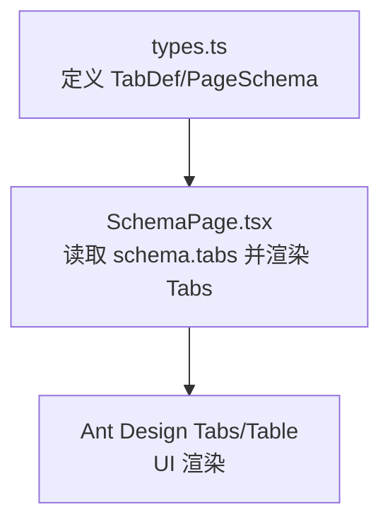
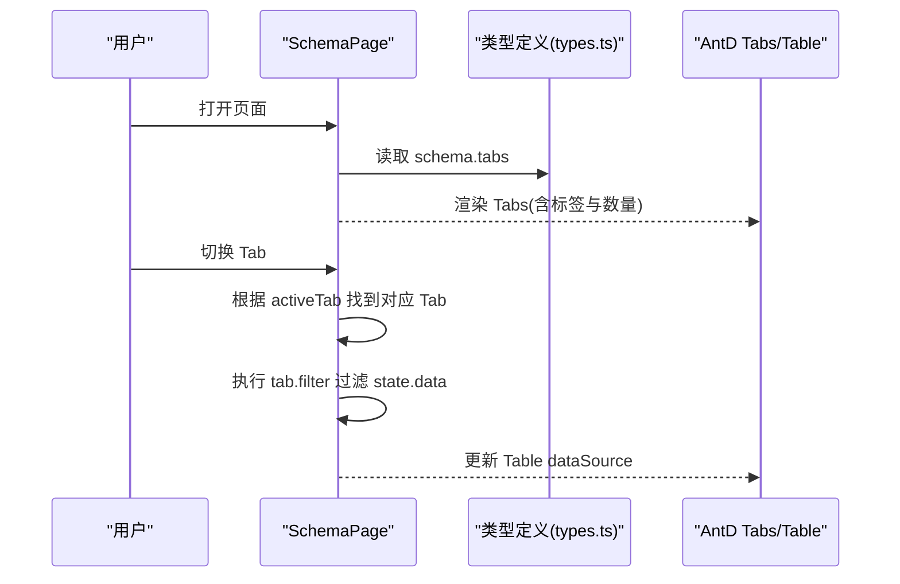
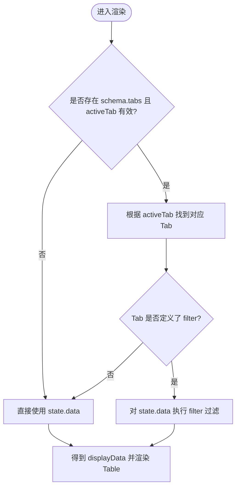
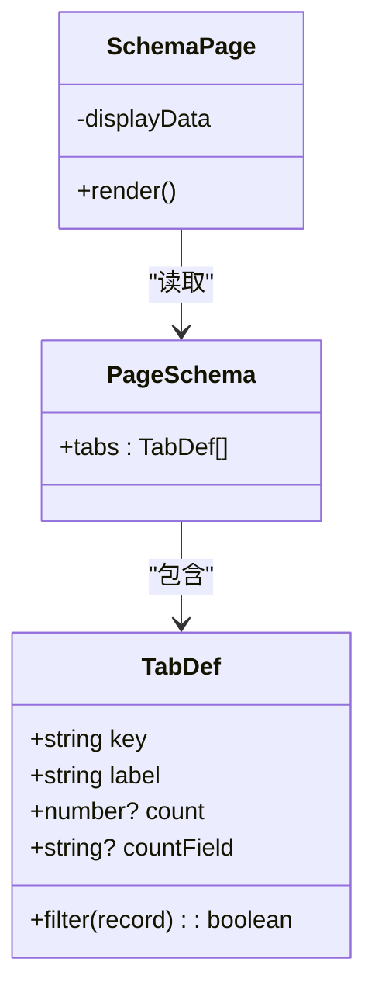

# Tab分组配置

<cite>
**本文引用的文件**   
- [types.ts](file://hj-admin/src/shared/schema-engine/types.ts)
- [SchemaPage.tsx](file://hj-admin/src/shared/schema-engine/SchemaPage.tsx)
</cite>

## 目录
1. [简介](#简介)
2. [项目结构](#项目结构)
3. [核心组件](#核心组件)
4. [架构总览](#架构总览)
5. [详细组件分析](#详细组件分析)
6. [依赖关系分析](#依赖关系分析)
7. [性能与体验优化建议](#性能与体验优化建议)
8. [故障排查指南](#故障排查指南)
9. [结论](#结论)
10. [附录：完整配置示例](#附录完整配置示例)

## 简介
本文件聚焦于“Tab分组配置”的详细说明，围绕 TabDef 接口的属性（key、label、countField、count、filter）展开，解释静态数量 count 与动态数量 countField 的区别与适用场景；阐述 filter 过滤函数的实现逻辑，并给出基于数据状态进行 Tab 分组的实践方法与完整配置示例（如待处理、已确认等业务状态分类展示）。同时提供 Tab 切换的性能与用户体验优化建议。

## 项目结构
与 Tab 分组相关的核心代码位于 schema-engine 模块中：
- types.ts：定义 PageSchema、TabDef 等类型，其中包含 tabs 字段用于声明 Tab 分组。
- SchemaPage.tsx：通用列表页渲染器，负责根据 PageSchema 渲染筛选栏、Tabs、表格、分页等，并在当前激活 Tab 下对数据进行过滤显示。



图表来源
- [types.ts:94-104](file://hj-admin/src/shared/schema-engine/types.ts#L94-L104)
- [SchemaPage.tsx:162-180](file://hj-admin/src/shared/schema-engine/SchemaPage.tsx#L162-L180)

章节来源
- [types.ts:94-104](file://hj-admin/src/shared/schema-engine/types.ts#L94-L104)
- [SchemaPage.tsx:162-180](file://hj-admin/src/shared/schema-engine/SchemaPage.tsx#L162-L180)

## 核心组件
- TabDef：描述一个 Tab 的配置项，包括标识 key、标题 label、可选的动态数量字段 countField、可选的静态数量 count，以及必填的过滤函数 filter。
- PageSchema：页面级 Schema，包含 tabs?: TabDef[]，用于在页面顶部渲染一组 Tab。
- SchemaPage：根据 activeTab 和对应 Tab 的 filter 对数据源进行过滤，并将结果传递给 Table 展示。

章节来源
- [types.ts:94-104](file://hj-admin/src/shared/schema-engine/types.ts#L94-L104)
- [types.ts:131-174](file://hj-admin/src/shared/schema-engine/types.ts#L131-L174)
- [SchemaPage.tsx:146-152](file://hj-admin/src/shared/schema-engine/SchemaPage.tsx#L146-L152)

## 架构总览
下图展示了从配置到渲染的关键流程：页面加载时读取 schema.tabs，用户切换 Tab 后，SchemaPage 计算 displayData，将当前 Tab 对应的 filter 应用于 state.data，最终由 Table 渲染。



图表来源
- [SchemaPage.tsx:146-152](file://hj-admin/src/shared/schema-engine/SchemaPage.tsx#L146-L152)
- [SchemaPage.tsx:162-180](file://hj-admin/src/shared/schema-engine/SchemaPage.tsx#L162-L180)
- [types.ts:94-104](file://hj-admin/src/shared/schema-engine/types.ts#L94-L104)

## 详细组件分析

### TabDef 接口详解
- key: string
  - 作用：Tab 的唯一标识，用于匹配当前激活的 Tab。
  - 注意：需保证唯一性，避免重复导致匹配异常。
- label: string
  - 作用：Tab 显示的标题文本。
- countField?: string
  - 作用：指定一个字段名，作为“动态数量”的来源。该字段通常来自后端统计或前端聚合结果。
  - 使用场景：当每个 Tab 的数量需要随数据变化而实时更新（例如按状态统计的总数），且该数值已在数据模型中存在时。
  - 注意：当前渲染层仅支持直接展示静态 count；如需展示动态数量，可在上层预处理数据，将 countField 解析为具体数字后再传入。
- count?: number
  - 作用：静态数量，优先于 countField 生效。
  - 使用场景：数量固定或在渲染前可确定的情况（如“全部”、“草稿”等固定分类）。
- filter: (record: T) => boolean
  - 作用：过滤函数，决定某条记录是否属于当前 Tab。
  - 实现要点：
    - 返回 true 表示该记录归入当前 Tab。
    - 应基于 record 的业务字段（如 status、type、ownerId 等）进行判断。
    - 保持纯函数特性，避免副作用，确保可预测性与可测试性。

章节来源
- [types.ts:94-104](file://hj-admin/src/shared/schema-engine/types.ts#L94-L104)

### 静态数量 count 与动态数量 countField 的区别与选择
- 静态数量 count
  - 优点：简单直观，无需额外计算，适合固定分类或预计算好的数量。
  - 缺点：无法反映实时数据变化，若数据频繁变动需在上层重新计算并传入新的 count。
- 动态数量 countField
  - 优点：可与数据模型中的统计字段联动，体现“动态”语义。
  - 缺点：当前渲染层未直接消费 countField 的值，需要在调用方将 countField 解析为实际数字后再传入（例如在 hooks 或父组件中计算好每个 Tab 的 count）。
- 选择建议
  - 如果数量是固定的或可以在渲染前确定，优先使用 count。
  - 如果数量来源于数据模型的某个字段，且希望与数据同步，建议使用 countField，并在上层完成解析与赋值。

章节来源
- [types.ts:94-104](file://hj-admin/src/shared/schema-engine/types.ts#L94-L104)
- [SchemaPage.tsx:162-180](file://hj-admin/src/shared/schema-engine/SchemaPage.tsx#L162-L180)

### filter 过滤函数的实现逻辑
- 触发时机：当 activeTab 发生变化时，SchemaPage 会查找对应 Tab，并执行其 filter 函数对 state.data 进行过滤，得到 displayData。
- 数据流：state.data → 按 activeTab 匹配 Tab → 执行 tab.filter → 得到 displayData → 传给 Table 渲染。
- 复杂度：每次切换 Tab 都会对当前数据集进行一次线性扫描 O(n)，n 为当前页数据量。对于大数据集，建议在服务端分页+过滤，或在前端缓存过滤结果。



图表来源
- [SchemaPage.tsx:146-152](file://hj-admin/src/shared/schema-engine/SchemaPage.tsx#L146-L152)

章节来源
- [SchemaPage.tsx:146-152](file://hj-admin/src/shared/schema-engine/SchemaPage.tsx#L146-L152)

### 基于数据状态的 Tab 分组实践
- 常见业务状态：待处理、已确认、已完成、已取消等。
- 设计思路：
  - 在 PageSchema.tabs 中为每种状态定义一个 Tab，设置 key、label、filter。
  - filter 中依据 record.status 等字段判断归属。
  - 若需要显示数量，可使用 count（静态）或在上层计算后传入。
- 注意事项：
  - 确保所有可能的状态都有对应的 Tab，避免数据“丢失”。
  - 若存在“全部”Tab，其 filter 应恒返回 true。
  - 复杂条件可封装为工具函数，提高可读性与复用性。

章节来源
- [types.ts:94-104](file://hj-admin/src/shared/schema-engine/types.ts#L94-L104)
- [SchemaPage.tsx:146-152](file://hj-admin/src/shared/schema-engine/SchemaPage.tsx#L146-L152)

## 依赖关系分析
- SchemaPage 依赖 types.ts 中的 PageSchema 与 TabDef，以获取 tabs 配置。
- SchemaPage 内部使用 Ant Design 的 Tabs 与 Table 组件进行渲染。
- 过滤逻辑完全由 TabDef.filter 驱动，不耦合具体业务，具备良好的扩展性。



图表来源
- [types.ts:94-104](file://hj-admin/src/shared/schema-engine/types.ts#L94-L104)
- [types.ts:131-174](file://hj-admin/src/shared/schema-engine/types.ts#L131-L174)
- [SchemaPage.tsx:146-152](file://hj-admin/src/shared/schema-engine/SchemaPage.tsx#L146-L152)

章节来源
- [types.ts:94-104](file://hj-admin/src/shared/schema-engine/types.ts#L94-L104)
- [types.ts:131-174](file://hj-admin/src/shared/schema-engine/types.ts#L131-L174)
- [SchemaPage.tsx:146-152](file://hj-admin/src/shared/schema-engine/SchemaPage.tsx#L146-L152)

## 性能与体验优化建议
- 减少不必要的重渲染
  - 将 filter 函数稳定化（使用 useCallback 或外部常量），避免每次渲染创建新函数导致 useMemo 失效。
  - 将 tabs 配置提升到组件外或使用常量，避免重复创建。
- 大数据集优化
  - 优先在服务端按状态过滤与分页，前端只做轻量过滤。
  - 若必须在前端过滤，考虑缓存各 Tab 的过滤结果，键为 activeTab，值为过滤后的数组。
- 交互体验
  - 切换 Tab 时提供 Loading 反馈（结合 state.loading）。
  - 对空结果展示友好提示，避免空白区域造成困惑。
  - 合理设置 Tabs 的样式与间距，提升可读性。
- 数量展示
  - 若使用 countField，请在调用方预先计算并转换为数字，再传入渲染层，以保证一致性。

[本节为通用指导，不涉及具体文件分析]

## 故障排查指南
- Tab 切换无效果
  - 检查 activeTab 是否正确更新，schema.tabs 是否包含对应 key。
  - 确认 filter 函数返回值是否符合预期，必要时打印中间结果。
- 数量为 0 或不正确
  - 若使用 countField，请确认上层已将字段解析为数字并传入。
  - 若使用 count，请确认在数据变化后重新计算并传入新的值。
- 性能问题
  - 观察 filter 的执行次数与耗时，必要时引入缓存或改为服务端过滤。
  - 检查 useMemo/useCallback 的依赖项是否过于频繁变化。

章节来源
- [SchemaPage.tsx:146-152](file://hj-admin/src/shared/schema-engine/SchemaPage.tsx#L146-L152)
- [SchemaPage.tsx:162-180](file://hj-admin/src/shared/schema-engine/SchemaPage.tsx#L162-L180)

## 结论
Tab 分组通过 TabDef 的 filter 实现了灵活的数据分类展示，配合 count/countField 可呈现静态或动态数量。在实际项目中，建议将复杂过滤逻辑抽象为工具函数，并结合服务端分页与前端缓存策略，以获得良好的性能与用户体验。

[本节为总结，不涉及具体文件分析]

## 附录：完整配置示例
以下为一个完整的 PageSchema 配置示例，演示如何定义多个 Tab（如“全部”、“待处理”、“已确认”、“已完成”），并通过 filter 对数据进行分类展示。数量方面，示例使用静态 count；如需动态数量，可在调用方将 countField 解析为数字后传入。

```jsonc
{
  "id": "example-list",
  "title": "示例列表",
  "description": "演示 Tab 分组与过滤",
  "entity": "exampleEntity",
  "filters": [],
  "columns": [
    { "field": "name", "title": "名称" },
    { "field": "status", "title": "状态" }
  ],
  "rowKey": "id",
  "pagination": {
    "pageSize": 20,
    "showTotal": true,
    "showSizeChanger": true
  },
  "rowActions": [],
  "batchActions": [],
  "toolbarActions": [],
  "modals": [],
  "tabs": [
    {
      "key": "all",
      "label": "全部",
      "count": 0,
      "filter": () => true
    },
    {
      "key": "pending",
      "label": "待处理",
      "count": 0,
      "filter": (record) => record.status === "pending"
    },
    {
      "key": "confirmed",
      "label": "已确认",
      "count": 0,
      "filter": (record) => record.status === "confirmed"
    },
    {
      "key": "completed",
      "label": "已完成",
      "count": 0,
      "filter": (record) => record.status === "completed"
    }
  ]
}
```

说明
- 每个 Tab 的 filter 根据 record.status 进行分类。
- 若需要动态数量，可在调用方遍历 state.data，按相同 filter 逻辑统计数量，并写入每个 Tab 的 count 字段。
- 若使用 countField，请在上层将字段解析为数字后再传入，因为当前渲染层直接展示的是 count。

章节来源
- [types.ts:94-104](file://hj-admin/src/shared/schema-engine/types.ts#L94-L104)
- [types.ts:131-174](file://hj-admin/src/shared/schema-engine/types.ts#L131-L174)
- [SchemaPage.tsx:146-152](file://hj-admin/src/shared/schema-engine/SchemaPage.tsx#L146-L152)
- [SchemaPage.tsx:162-180](file://hj-admin/src/shared/schema-engine/SchemaPage.tsx#L162-L180)