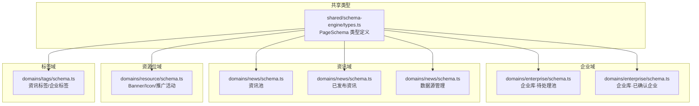
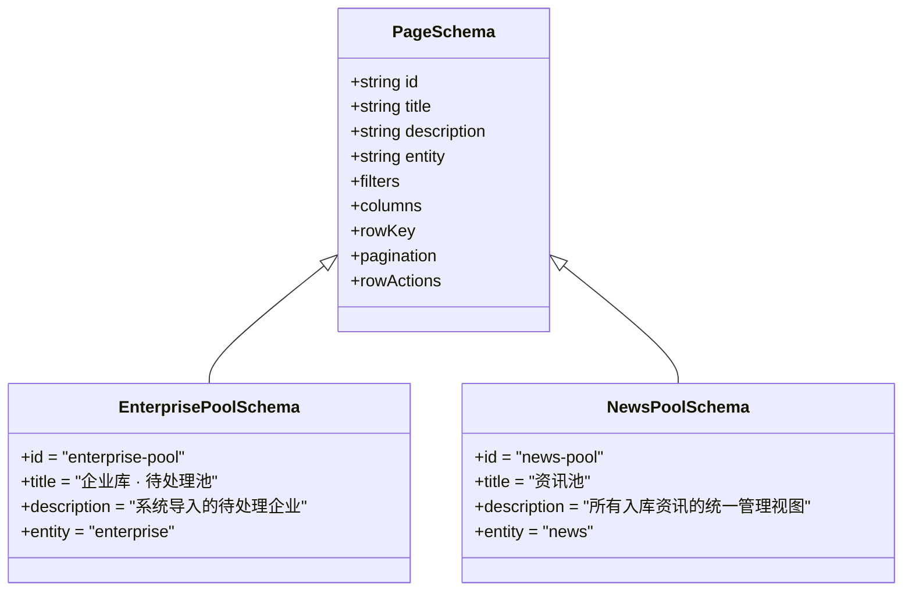
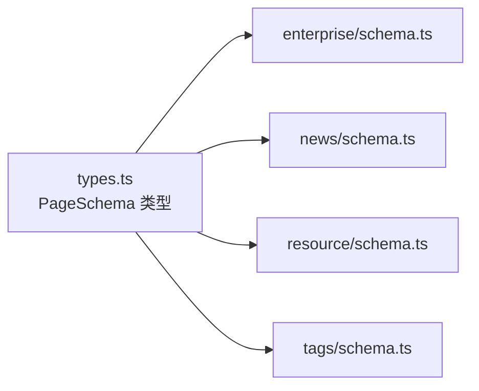

# 基础配置属性

<cite>
**本文引用的文件**   
- [types.ts](file://hj-admin/src/shared/schema-engine/types.ts)
- [enterprise schema.ts](file://hj-admin/src/domains/enterprise/schema.ts)
- [news schema.ts](file://hj-admin/src/domains/news/schema.ts)
- [resource schema.ts](file://hj-admin/src/domains/resource/schema.ts)
- [tags schema.ts](file://hj-admin/src/domains/tags/schema.ts)
</cite>

## 目录
1. [简介](#简介)
2. [项目结构](#项目结构)
3. [核心组件](#核心组件)
4. [架构总览](#架构总览)
5. [详细组件分析](#详细组件分析)
6. [依赖关系分析](#依赖关系分析)
7. [性能考虑](#性能考虑)
8. [故障排查指南](#故障排查指南)
9. [结论](#结论)
10. [附录](#附录)

## 简介
本章节聚焦于 PageSchema 的基础配置属性，重点说明 id、title、description、entity 四个核心属性的作用、数据类型、必填性、默认值与验证规则，并结合企业库与资讯库的实际 Schema 示例，给出最佳实践与常见错误规避建议。读者无需深入代码即可理解如何正确配置这些基础属性。

## 项目结构
本项目采用“域 + Schema”的声明式页面组织方式：每个业务域（如 enterprise、news）在各自目录下维护一个或多个 PageSchema 对象，统一基于共享的类型定义进行约束。类型定义位于 shared/schema-engine/types.ts，具体页面的 Schema 在各域的 schema.ts 中实现。

图表来源
- [types.ts:132-174](file://hj-admin/src/shared/schema-engine/types.ts#L132-L174)
- [enterprise schema.ts:7-31](file://hj-admin/src/domains/enterprise/schema.ts#L7-L31)
- [enterprise schema.ts:34-63](file://hj-admin/src/domains/enterprise/schema.ts#L34-L63)
- [news schema.ts:22-53](file://hj-admin/src/domains/news/schema.ts#L22-L53)
- [news schema.ts:56-94](file://hj-admin/src/domains/news/schema.ts#L56-L94)
- [news schema.ts:97-122](file://hj-admin/src/domains/news/schema.ts#L97-L122)
- [resource schema.ts:7-20](file://hj-admin/src/domains/resource/schema.ts#L7-L20)
- [tags schema.ts:5-21](file://hj-admin/src/domains/tags/schema.ts#L5-L21)

章节来源
- [types.ts:132-174](file://hj-admin/src/shared/schema-engine/types.ts#L132-L174)

## 核心组件
本节对 PageSchema 的基础配置属性逐一说明，包括字段含义、数据类型、是否必填、默认值与校验规则，并给出在各域中的实际使用位置参考。

- id
  - 作用：页面唯一标识，用于路由注册、菜单生成、调试定位等。
  - 数据类型：string
  - 必填性：必填
  - 默认值：无
  - 验证规则：全局唯一；建议使用小写字母、数字与连字符组成的短横线风格，避免中文或特殊字符。
  - 示例参考：
    - 企业库·待处理池：[enterprise schema.ts:8](file://hj-admin/src/domains/enterprise/schema.ts#L8)
    - 企业库·已确认企业：[enterprise schema.ts:35](file://hj-admin/src/domains/enterprise/schema.ts#L35)
    - 资讯池：[news schema.ts:23](file://hj-admin/src/domains/news/schema.ts#L23)
    - 已发布资讯：[news schema.ts:57](file://hj-admin/src/domains/news/schema.ts#L57)
    - 数据源管理：[news schema.ts:98](file://hj-admin/src/domains/news/schema.ts#L98)
    - Banner 管理：[resource schema.ts:8](file://hj-admin/src/domains/resource/schema.ts#L8)
    - Icon 管理：[resource schema.ts:23](file://hj-admin/src/domains/resource/schema.ts#L23)
    - 推广活动管理：[resource schema.ts:39](file://hj-admin/src/domains/resource/schema.ts#L39)
    - 资讯标签：[tags schema.ts:6](file://hj-admin/src/domains/tags/schema.ts#L6)
    - 企业标签：[tags schema.ts:24](file://hj-admin/src/domains/tags/schema.ts#L24)

- title
  - 作用：页面标题，用于导航栏、面包屑、页面头部展示。
  - 数据类型：string
  - 必填性：必填
  - 默认值：无
  - 验证规则：非空字符串；建议简洁明确，体现页面用途。
  - 示例参考：
    - 企业库·待处理池：[enterprise schema.ts:9](file://hj-admin/src/domains/enterprise/schema.ts#L9)
    - 企业库·已确认企业：[enterprise schema.ts:36](file://hj-admin/src/domains/enterprise/schema.ts#L36)
    - 资讯池：[news schema.ts:24](file://hj-admin/src/domains/news/schema.ts#L24)
    - 已发布资讯：[news schema.ts:58](file://hj-admin/src/domains/news/schema.ts#L58)
    - 数据源管理：[news schema.ts:99](file://hj-admin/src/domains/news/schema.ts#L99)
    - Banner 管理：[resource schema.ts:8](file://hj-admin/src/domains/resource/schema.ts#L8)
    - Icon 管理：[resource schema.ts:23](file://hj-admin/src/domains/resource/schema.ts#L23)
    - 推广活动管理：[resource schema.ts:39](file://hj-admin/src/domains/resource/schema.ts#L39)
    - 资讯标签：[tags schema.ts:6](file://hj-admin/src/domains/tags/schema.ts#L6)
    - 企业标签：[tags schema.ts:24](file://hj-admin/src/domains/tags/schema.ts#L24)

- description
  - 作用：页面描述，用于辅助信息展示（如统计摘要、使用说明）。
  - 数据类型：string
  - 必填性：可选
  - 默认值：无
  - 验证规则：若提供则为非空字符串；内容应简明扼要。
  - 示例参考：
    - 企业库·待处理池：[enterprise schema.ts:10](file://hj-admin/src/domains/enterprise/schema.ts#L10)
    - 企业库·已确认企业：[enterprise schema.ts:37](file://hj-admin/src/domains/enterprise/schema.ts#L37)
    - 资讯池：[news schema.ts:25](file://hj-admin/src/domains/news/schema.ts#L25)
    - 已发布资讯：[news schema.ts:59](file://hj-admin/src/domains/news/schema.ts#L59)
    - 数据源管理：[news schema.ts:100](file://hj-admin/src/domains/news/schema.ts#L100)
    - Banner 管理：[resource schema.ts:8](file://hj-admin/src/domains/resource/schema.ts#L8)
    - Icon 管理：[resource schema.ts:23](file://hj-admin/src/domains/resource/schema.ts#L23)
    - 推广活动管理：[resource schema.ts:39](file://hj-admin/src/domains/resource/schema.ts#L39)
    - 资讯标签：[tags schema.ts:6](file://hj-admin/src/domains/tags/schema.ts#L6)
    - 企业标签：[tags schema.ts:24](file://hj-admin/src/domains/tags/schema.ts#L24)

- entity
  - 作用：绑定数据仓库（Repository）键名，驱动数据加载、筛选、分页等操作。
  - 数据类型：string
  - 必填性：必填
  - 默认值：无
  - 验证规则：必须与 DataProvider 中注册的实体键一致；命名应与领域模型对应，便于维护。
  - 示例参考：
    - 企业库·待处理池：[enterprise schema.ts:11](file://hj-admin/src/domains/enterprise/schema.ts#L11)
    - 企业库·已确认企业：[enterprise schema.ts:38](file://hj-admin/src/domains/enterprise/schema.ts#L38)
    - 资讯池：[news schema.ts:26](file://hj-admin/src/domains/news/schema.ts#L26)
    - 已发布资讯：[news schema.ts:60](file://hj-admin/src/domains/news/schema.ts#L60)
    - 数据源管理：[news schema.ts:101](file://hj-admin/src/domains/news/schema.ts#L101)
    - Banner 管理：[resource schema.ts:8](file://hj-admin/src/domains/resource/schema.ts#L8)
    - Icon 管理：[resource schema.ts:23](file://hj-admin/src/domains/resource/schema.ts#L23)
    - 推广活动管理：[resource schema.ts:39](file://hj-admin/src/domains/resource/schema.ts#L39)
    - 资讯标签：[tags schema.ts:6](file://hj-admin/src/domains/tags/schema.ts#L6)
    - 企业标签：[tags schema.ts:24](file://hj-admin/src/domains/tags/schema.ts#L24)

章节来源
- [types.ts:132-174](file://hj-admin/src/shared/schema-engine/types.ts#L132-L174)
- [enterprise schema.ts:7-31](file://hj-admin/src/domains/enterprise/schema.ts#L7-L31)
- [enterprise schema.ts:34-63](file://hj-admin/src/domains/enterprise/schema.ts#L34-L63)
- [news schema.ts:22-53](file://hj-admin/src/domains/news/schema.ts#L22-L53)
- [news schema.ts:56-94](file://hj-admin/src/domains/news/schema.ts#L56-L94)
- [news schema.ts:97-122](file://hj-admin/src/domains/news/schema.ts#L97-L122)
- [resource schema.ts:7-20](file://hj-admin/src/domains/resource/schema.ts#L7-L20)
- [tags schema.ts:5-21](file://hj-admin/src/domains/tags/schema.ts#L5-L21)

## 架构总览
下图展示了 PageSchema 基础属性在整个渲染管线中的角色：类型定义提供契约，各域 Schema 按契约填充基础属性，引擎据此完成页面渲染与数据绑定。

图表来源
- [types.ts:132-174](file://hj-admin/src/shared/schema-engine/types.ts#L132-L174)
- [enterprise schema.ts:7-31](file://hj-admin/src/domains/enterprise/schema.ts#L7-L31)
- [news schema.ts:22-53](file://hj-admin/src/domains/news/schema.ts#L22-L53)

## 详细组件分析

### 企业库基础属性配置要点
- id 建议以领域+场景组合，例如 “enterprise-pool”、“enterprise-confirmed”，保持可读性与唯一性。
- title 需体现当前视图范围，如“企业库 · 待处理池”、“企业库 · 已确认企业”。
- description 可补充统计或说明信息，帮助运营快速理解页面用途。
- entity 必须与后端仓库键一致，确保数据加载链路畅通。

章节来源
- [enterprise schema.ts:7-31](file://hj-admin/src/domains/enterprise/schema.ts#L7-L31)
- [enterprise schema.ts:34-63](file://hj-admin/src/domains/enterprise/schema.ts#L34-L63)

### 资讯库基础属性配置要点
- id 区分不同视图，如 “news-pool”、“news-published”、“news-sources”。
- title 清晰表达页面功能，如“资讯池”、“已发布资讯”、“数据源管理”。
- description 可用于汇总关键指标，提升信息密度。
- entity 分别指向 “news” 与 “dataSources”，注意与仓库注册保持一致。

章节来源
- [news schema.ts:22-53](file://hj-admin/src/domains/news/schema.ts#L22-L53)
- [news schema.ts:56-94](file://hj-admin/src/domains/news/schema.ts#L56-L94)
- [news schema.ts:97-122](file://hj-admin/src/domains/news/schema.ts#L97-L122)

### 其他域基础属性配置要点
- 资源位域（Banner/Icon/推广活动）：id 以资源类型区分，title 直接表明管理对象，description 可包含尺寸或数量限制提示，entity 对应相应仓库键。
- 标签域（资讯标签/企业标签）：id 区分标签类别，title 明确标签范围，description 可显示总数与使用情况，entity 对应标签仓库键。

章节来源
- [resource schema.ts:7-20](file://hj-admin/src/domains/resource/schema.ts#L7-L20)
- [tags schema.ts:5-21](file://hj-admin/src/domains/tags/schema.ts#L5-L21)

## 依赖关系分析
- 类型契约：所有域 Schema 均引用 types.ts 中的 PageSchema 类型，保证基础属性的一致性与可推导性。
- 运行时绑定：entity 作为键，驱动数据层（DataProvider/Repository）加载数据；id 用于路由与菜单映射；title/description 用于 UI 展示。
- 耦合度：基础属性之间相互独立，但共同构成页面元数据的最小集合，低耦合高内聚。

图表来源
- [types.ts:132-174](file://hj-admin/src/shared/schema-engine/types.ts#L132-L174)
- [enterprise schema.ts:7-31](file://hj-admin/src/domains/enterprise/schema.ts#L7-L31)
- [news schema.ts:22-53](file://hj-admin/src/domains/news/schema.ts#L22-L53)
- [resource schema.ts:7-20](file://hj-admin/src/domains/resource/schema.ts#L7-L20)
- [tags schema.ts:5-21](file://hj-admin/src/domains/tags/schema.ts#L5-L21)

## 性能考虑
- id 唯一性可减少重复渲染与缓存冲突。
- description 仅用于展示，避免过长文本影响首屏渲染。
- entity 与仓库键严格匹配，避免因键不一致导致额外请求失败与重试。

## 故障排查指南
- 页面无法加载或数据为空
  - 检查 entity 是否与仓库注册键一致。
  - 参考路径：[types.ts:132-174](file://hj-admin/src/shared/schema-engine/types.ts#L132-L174)、[news schema.ts:101](file://hj-admin/src/domains/news/schema.ts#L101)
- 导航或菜单不显示
  - 检查 id 是否重复或与路由定义冲突。
  - 参考路径：[enterprise schema.ts:8](file://hj-admin/src/domains/enterprise/schema.ts#L8)、[news schema.ts:23](file://hj-admin/src/domains/news/schema.ts#L23)
- 页面标题或描述未生效
  - 确认 title/description 是否为空或未正确赋值。
  - 参考路径：[resource schema.ts:8](file://hj-admin/src/domains/resource/schema.ts#L8)、[tags schema.ts:6](file://hj-admin/src/domains/tags/schema.ts#L6)

章节来源
- [types.ts:132-174](file://hj-admin/src/shared/schema-engine/types.ts#L132-L174)
- [enterprise schema.ts:7-31](file://hj-admin/src/domains/enterprise/schema.ts#L7-L31)
- [news schema.ts:22-53](file://hj-admin/src/domains/news/schema.ts#L22-L53)
- [resource schema.ts:7-20](file://hj-admin/src/domains/resource/schema.ts#L7-L20)
- [tags schema.ts:5-21](file://hj-admin/src/domains/tags/schema.ts#L5-L21)

## 结论
id、title、description、entity 是 PageSchema 的基础配置属性，它们共同定义了页面的身份、展示与数据绑定。遵循统一的命名规范、严格的必填校验与一致的仓库键约定，可以显著提升系统的可维护性与稳定性。

## 附录

### 基础属性速查表
- id
  - 类型：string
  - 必填：是
  - 默认值：无
  - 校验：全局唯一；推荐小写+连字符
- title
  - 类型：string
  - 必填：是
  - 默认值：无
  - 校验：非空
- description
  - 类型：string
  - 必填：否
  - 默认值：无
  - 校验：若存在则非空
- entity
  - 类型：string
  - 必填：是
  - 默认值：无
  - 校验：与仓库注册键一致

章节来源
- [types.ts:132-174](file://hj-admin/src/shared/schema-engine/types.ts#L132-L174)

### 最佳实践建议
- 为 id 建立命名规范，如 “域_模块_视图”，避免跨域冲突。
- title 尽量简短且语义明确，便于导航与搜索。
- description 用于补充关键信息，避免冗长。
- entity 与仓库键一一对应，并在变更时同步更新相关注册与调用处。

### 常见错误与避免方法
- 忘记设置必填属性（id/title/entity），导致页面无法渲染或报错。
- entity 拼写错误或与仓库键不一致，导致数据无法加载。
- id 重复造成路由或菜单异常，需在全局范围内去重。