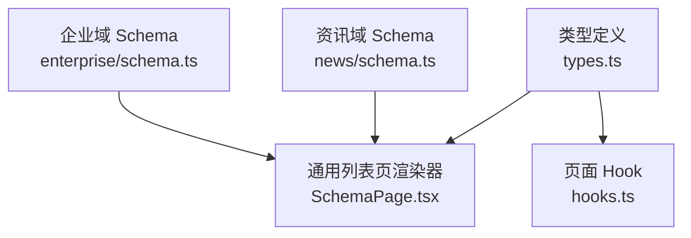
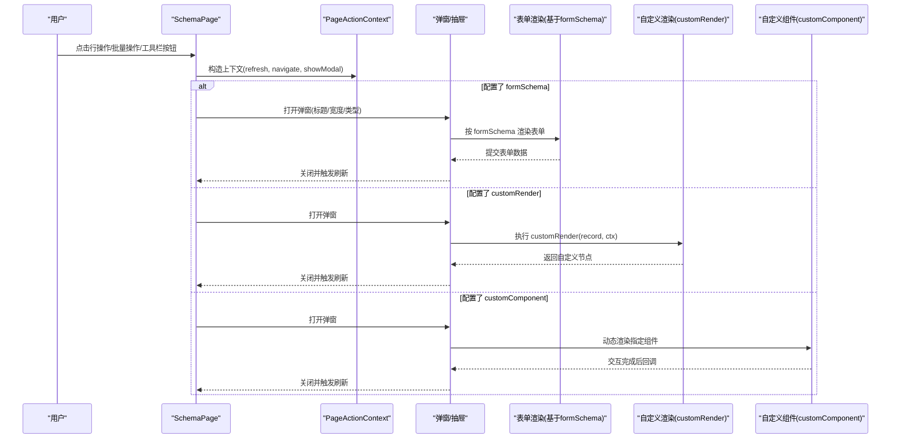
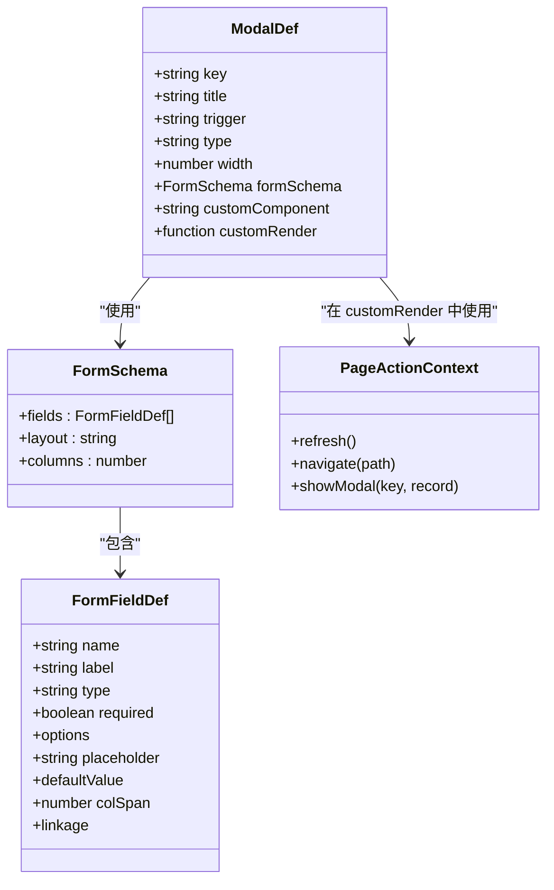

# 弹窗配置

<cite>
**本文引用的文件**
- [types.ts](file://hj-admin/src/shared/schema-engine/types.ts)
- [SchemaPage.tsx](file://hj-admin/src/shared/schema-engine/SchemaPage.tsx)
- [hooks.ts](file://hj-admin/src/shared/schema-engine/hooks.ts)
- [news schema.ts](file://hj-admin/src/domains/news/schema.ts)
- [enterprise schema.ts](file://hj-admin/src/domains/enterprise/schema.ts)
</cite>

## 目录
1. [简介](#简介)
2. [项目结构](#项目结构)
3. [核心组件](#核心组件)
4. [架构总览](#架构总览)
5. [详细组件分析](#详细组件分析)
6. [依赖分析](#依赖分析)
7. [性能考虑](#性能考虑)
8. [故障排查指南](#故障排查指南)
9. [结论](#结论)
10. [附录](#附录)

## 简介
本文件面向“弹窗配置”的完整说明，聚焦于 ModalDef 接口及其在 Schema 驱动页面中的使用方式。内容覆盖：
- ModalDef 所有属性（key、title、trigger、type、width、formSchema、customComponent、customRender）
- formSchema 表单配置与新增/编辑场景用法
- customComponent 自定义组件与 customRender 自定义渲染的实现方式
- 弹窗配置示例（表单弹窗、确认弹窗、详情弹窗等）
- 弹窗状态管理与数据同步最佳实践

## 项目结构
与弹窗配置相关的核心代码位于 schema-engine 类型定义与通用列表页渲染器中，具体分布如下：
- 类型定义：ModalDef、FormSchema、FormFieldDef、PageActionContext 等
- 通用列表页渲染器：SchemaPage（负责根据 PageSchema 渲染筛选、表格、分页、操作列等）
- 页面 Hook：useSchemaPage（封装筛选、分页、Tab、选中行、数据加载等操作上下文）

图表来源
- [types.ts:76-92](file://hj-admin/src/shared/schema-engine/types.ts#L76-L92)
- [SchemaPage.tsx:76-142](file://hj-admin/src/shared/schema-engine/SchemaPage.tsx#L76-L142)
- [hooks.ts:20-105](file://hj-admin/src/shared/schema-engine/hooks.ts#L20-L105)
- [news schema.ts:22-53](file://hj-admin/src/domains/news/schema.ts#L22-L53)
- [enterprise schema.ts:7-31](file://hj-admin/src/domains/enterprise/schema.ts#L7-L31)

章节来源
- [types.ts:76-92](file://hj-admin/src/shared/schema-engine/types.ts#L76-L92)
- [SchemaPage.tsx:76-142](file://hj-admin/src/shared/schema-engine/SchemaPage.tsx#L76-L142)
- [hooks.ts:20-105](file://hj-admin/src/shared/schema-engine/hooks.ts#L20-L105)

## 核心组件
本节对弹窗相关的关键类型与能力进行概览式说明，便于快速理解后续细节。

- ModalDef：描述一个弹窗/抽屉的配置项，包含触发方式、展示形态、宽度、表单 Schema、自定义组件或自定义渲染函数等。
- FormSchema / FormFieldDef：声明式表单配置，支持多种字段类型、必填、占位符、默认值、列宽、联动选项等。
- PageActionContext：页面操作上下文，提供刷新、导航、打开弹窗等能力，供行操作、批量操作、工具栏操作调用。

章节来源
- [types.ts:76-92](file://hj-admin/src/shared/schema-engine/types.ts#L76-L92)
- [types.ts:106-129](file://hj-admin/src/shared/schema-engine/types.ts#L106-L129)
- [types.ts:210-215](file://hj-admin/src/shared/schema-engine/types.ts#L210-L215)

## 架构总览
下图展示了 Schema 驱动的页面如何承载弹窗配置，以及弹窗在不同触发点下的渲染路径。

图表来源
- [SchemaPage.tsx:76-142](file://hj-admin/src/shared/schema-engine/SchemaPage.tsx#L76-L142)
- [types.ts:76-92](file://hj-admin/src/shared/schema-engine/types.ts#L76-L92)
- [types.ts:106-129](file://hj-admin/src/shared/schema-engine/types.ts#L106-L129)

## 详细组件分析

### ModalDef 接口详解
- key：字符串，弹窗唯一标识，用于区分不同弹窗实例。
- title：字符串，弹窗标题。
- trigger：枚举，触发来源，可选值为 rowAction、batchAction、toolbar。
- type：可选，弹窗形态，modal 或 drawer。
- width：可选，弹窗宽度（数值）。
- formSchema：可选，表单 Schema，用于自动生成表单弹窗（新增/编辑）。
- customComponent：可选，字符串，引用已注册的自定义组件名，用于复杂业务弹窗。
- customRender：可选，函数，接收当前记录 record 与上下文 ctx，返回 ReactNode，用于高度定制化的弹窗内容。

章节来源
- [types.ts:76-92](file://hj-admin/src/shared/schema-engine/types.ts#L76-L92)

### formSchema 表单配置
- fields：数组，每个元素为 FormFieldDef，描述一个表单项。
- layout：可选，布局模式，horizontal | vertical | inline。
- columns：可选，列数，控制多列布局。

FormFieldDef 常用属性：
- name：字段名，对应表单数据键。
- label：显示标签。
- type：字段类型，如 input、textarea、select、radio、checkbox、datePicker、rangePicker、number、colorPicker、treeSelect、cascader。
- required：是否必填。
- options：静态选项（适用于 select/radio/checkbox 等）。
- placeholder：占位提示。
- defaultValue：默认值。
- colSpan：列宽占比。
- linkage：联动配置，当某字段变化时重新计算选项。

新增/编辑场景建议：
- 新增：formSchema 的 fields 仅包含输入项；提交后调用刷新。
- 编辑：在打开弹窗前将 record 的值回填到表单初始值；提交后更新并刷新。

章节来源
- [types.ts:106-129](file://hj-admin/src/shared/schema-engine/types.ts#L106-L129)

### customComponent 自定义组件
- 通过字符串名称引用已注册的组件，适合需要独立生命周期、复杂交互或外部库集成的弹窗。
- 建议在组件内部自行处理数据获取、校验与提交，并在完成后通知上层刷新。

章节来源
- [types.ts:76-92](file://hj-admin/src/shared/schema-engine/types.ts#L76-L92)

### customRender 自定义渲染
- 以函数形式直接返回 ReactNode，适合轻量级、一次性定制的弹窗内容。
- 可访问 record 与 ctx，ctx 提供 refresh、navigate、showModal 等能力。

章节来源
- [types.ts:76-92](file://hj-admin/src/shared/schema-engine/types.ts#L76-L92)

### 弹窗配置示例（概念性说明）
以下为常见场景的配置思路（不直接粘贴代码，仅提供结构指引）：
- 表单弹窗（新增/编辑）
  - 设置 trigger 为 toolbar 或 rowAction
  - 配置 formSchema.fields 定义字段
  - 在提交回调中调用 ctx.refresh()
- 确认弹窗
  - 使用 RowAction.confirm 进行简单确认
  - 或在 customRender 中实现更丰富的确认流程
- 详情弹窗
  - 使用 customRender 渲染只读信息
  - 或通过 customComponent 渲染复杂详情视图

章节来源
- [types.ts:76-92](file://hj-admin/src/shared/schema-engine/types.ts#L76-L92)
- [types.ts:106-129](file://hj-admin/src/shared/schema-engine/types.ts#L106-L129)

### 弹窗状态管理与数据同步最佳实践
- 统一刷新入口：在弹窗提交成功后调用 ctx.refresh()，确保列表数据与弹窗内数据一致。
- 避免重复请求：在弹窗内发起的数据请求应遵循幂等原则，必要时加入去抖或缓存策略。
- 表单初始值管理：编辑场景下，打开弹窗前将 record 映射到表单初始值；新增场景使用 formSchema.defaultValue。
- 错误处理：网络或校验失败时给出明确提示，并保持弹窗可见以便重试。
- 上下文传递：通过 PageActionContext 暴露 refresh、navigate、showModal，减少跨层状态耦合。

章节来源
- [hooks.ts:87-92](file://hj-admin/src/shared/schema-engine/hooks.ts#L87-L92)
- [types.ts:210-215](file://hj-admin/src/shared/schema-engine/types.ts#L210-L215)

## 依赖分析
弹窗配置与页面渲染之间的依赖关系如下：

图表来源
- [types.ts:76-92](file://hj-admin/src/shared/schema-engine/types.ts#L76-L92)
- [types.ts:106-129](file://hj-admin/src/shared/schema-engine/types.ts#L106-L129)
- [types.ts:210-215](file://hj-admin/src/shared/schema-engine/types.ts#L210-L215)

章节来源
- [types.ts:76-92](file://hj-admin/src/shared/schema-engine/types.ts#L76-L92)
- [types.ts:106-129](file://hj-admin/src/shared/schema-engine/types.ts#L106-L129)
- [types.ts:210-215](file://hj-admin/src/shared/schema-engine/types.ts#L210-L215)

## 性能考虑
- 表单字段较多时，优先使用 columns 进行分列布局，减少滚动与重排。
- 对于大型弹窗内容，建议使用 customComponent 并配合懒加载与虚拟滚动。
- 避免在 customRender 中执行重型计算，必要时拆分逻辑至独立模块。
- 合理设置 width 与 type（drawer 更适合长表单），提升用户体验。

[本节为通用指导，无需源码引用]

## 故障排查指南
- 弹窗未出现
  - 检查 trigger 是否与按钮绑定正确
  - 确认 modals 配置是否在 PageSchema 中注册
- 表单无法提交
  - 检查 formSchema.fields.name 与后端字段映射
  - 确认提交后调用了 ctx.refresh()
- 自定义组件不生效
  - 确认 customComponent 名称与注册表一致
  - 检查组件是否正确导出与引入
- 数据不同步
  - 确认刷新入口是否被调用
  - 检查 useSchemaPage 的 fetchData 依赖是否发生变化

章节来源
- [hooks.ts:36-57](file://hj-admin/src/shared/schema-engine/hooks.ts#L36-L57)
- [hooks.ts:83-92](file://hj-admin/src/shared/schema-engine/hooks.ts#L83-L92)

## 结论
通过 ModalDef 与 formSchema 的组合，可以在 Schema 驱动模式下以声明式方式快速构建各类弹窗，包括表单弹窗、确认弹窗与详情弹窗。结合 PageActionContext 提供的刷新与导航能力，可实现良好的状态管理与数据同步。对于复杂场景，customComponent 与 customRender 提供了足够的扩展空间。

[本节为总结，无需源码引用]

## 附录
- 参考领域 Schema 示例（不含弹窗配置，但可作为页面结构参考）
  - [news schema.ts](file://hj-admin/src/domains/news/schema.ts)
  - [enterprise schema.ts](file://hj-admin/src/domains/enterprise/schema.ts)

章节来源
- [news schema.ts:22-53](file://hj-admin/src/domains/news/schema.ts#L22-L53)
- [enterprise schema.ts:7-31](file://hj-admin/src/domains/enterprise/schema.ts#L7-L31)