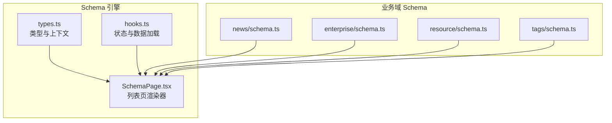
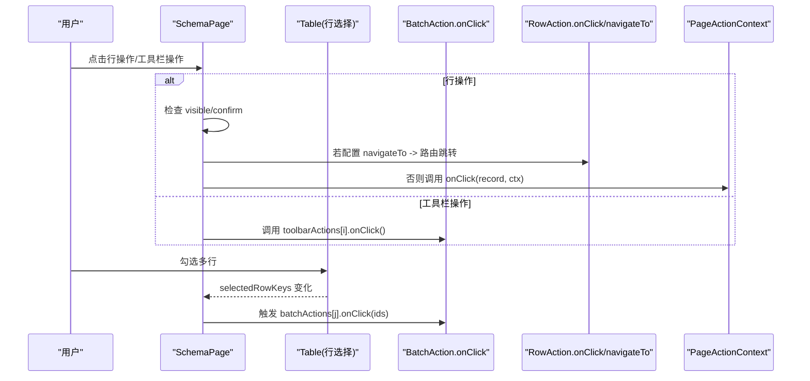
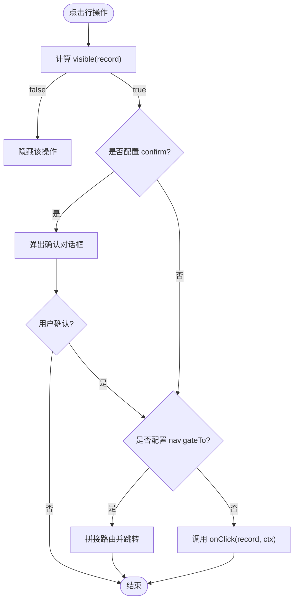
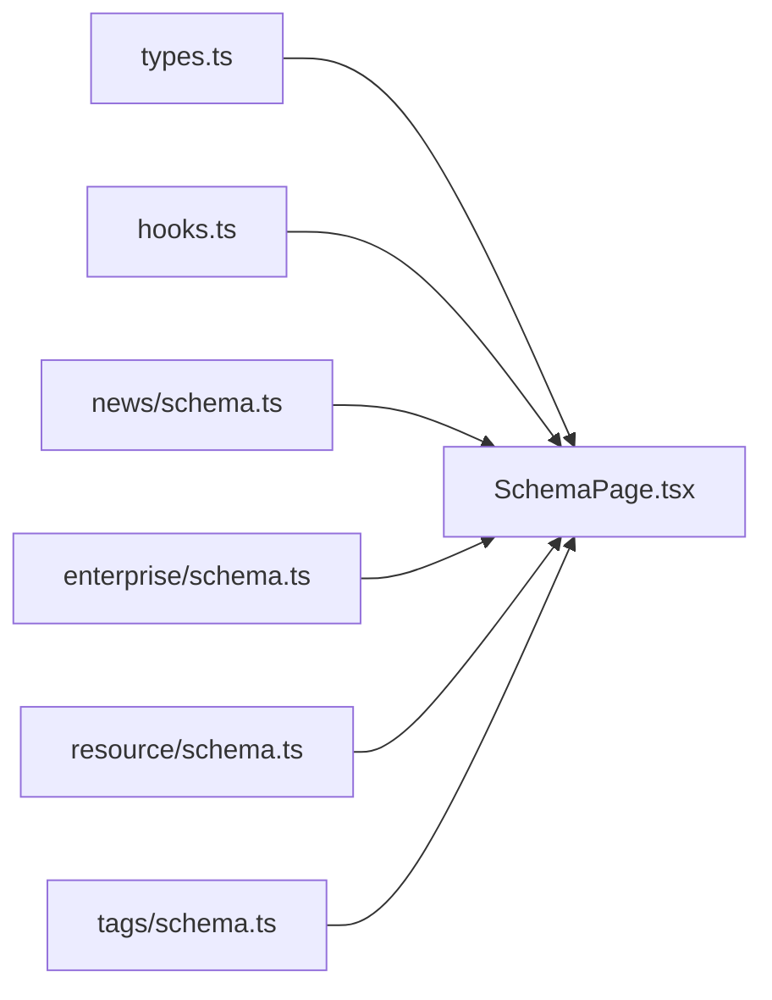

# 操作配置

<cite>
**本文引用的文件**   
- [types.ts](file://hj-admin/src/shared/schema-engine/types.ts)
- [SchemaPage.tsx](file://hj-admin/src/shared/schema-engine/SchemaPage.tsx)
- [hooks.ts](file://hj-admin/src/shared/schema-engine/hooks.ts)
- [news/schema.ts](file://hj-admin/src/domains/news/schema.ts)
- [enterprise/schema.ts](file://hj-admin/src/domains/enterprise/schema.ts)
- [resource/schema.ts](file://hj-admin/src/domains/resource/schema.ts)
- [tags/schema.ts](file://hj-admin/src/domains/tags/schema.ts)
</cite>

## 目录
1. [简介](#简介)
2. [项目结构](#项目结构)
3. [核心组件](#核心组件)
4. [架构总览](#架构总览)
5. [详细组件分析](#详细组件分析)
6. [依赖分析](#依赖分析)
7. [性能考虑](#性能考虑)
8. [故障排查指南](#故障排查指南)
9. [结论](#结论)
10. [附录](#附录)

## 简介
本文件面向“操作配置”，系统性说明以下三类操作的声明式配置与运行时行为：
- RowAction 行操作：每行数据的操作按钮，支持条件显示、确认对话框、声明式导航、回调函数。
- BatchAction 批量操作：表格多选后触发的批量动作（类型定义已提供）。
- ToolbarAction 工具栏操作：页面级工具栏按钮，常用于新增、导出等全局操作。

文档同时覆盖可见性逻辑、触发流程、与弹窗/抽屉的联动方式、以及权限与安全最佳实践，并提供来自真实业务模块的配置示例路径，便于快速上手与扩展。

## 项目结构
操作相关能力集中在 Schema 引擎层，并通过各域 schema 进行声明式配置：
- 类型与上下文：RowAction/BatchAction/ToolbarAction/PageActionContext 等类型定义
- 渲染与交互：SchemaPage 负责将配置渲染为筛选栏、工具栏、表格、分页及行操作列
- 状态与数据：useSchemaPage 管理筛选、分页、Tab、选中行、刷新等
- 业务示例：新闻、企业、资源位、标签等域的 schema 中提供了丰富的操作配置样例

图表来源
- [types.ts:43-74](file://hj-admin/src/shared/schema-engine/types.ts#L43-L74)
- [SchemaPage.tsx:76-142](file://hj-admin/src/shared/schema-engine/SchemaPage.tsx#L76-L142)
- [hooks.ts:20-105](file://hj-admin/src/shared/schema-engine/hooks.ts#L20-L105)
- [news/schema.ts:22-53](file://hj-admin/src/domains/news/schema.ts#L22-L53)
- [enterprise/schema.ts:7-31](file://hj-admin/src/domains/enterprise/schema.ts#L7-L31)
- [resource/schema.ts:7-20](file://hj-admin/src/domains/resource/schema.ts#L7-L20)
- [tags/schema.ts:5-21](file://hj-admin/src/domains/tags/schema.ts#L5-L21)

章节来源
- [types.ts:43-74](file://hj-admin/src/shared/schema-engine/types.ts#L43-L74)
- [SchemaPage.tsx:76-142](file://hj-admin/src/shared/schema-engine/SchemaPage.tsx#L76-L142)
- [hooks.ts:20-105](file://hj-admin/src/shared/schema-engine/hooks.ts#L20-L105)
- [news/schema.ts:22-53](file://hj-admin/src/domains/news/schema.ts#L22-L53)
- [enterprise/schema.ts:7-31](file://hj-admin/src/domains/enterprise/schema.ts#L7-L31)
- [resource/schema.ts:7-20](file://hj-admin/src/domains/resource/schema.ts#L7-L20)
- [tags/schema.ts:5-21](file://hj-admin/src/domains/tags/schema.ts#L5-L21)

## 核心组件
- PageSchema：页面级配置对象，包含 filters、columns、pagination、rowActions、batchActions、toolbarActions、modals、tabs 等。
- RowAction：行操作项，支持 visible 条件显示、confirm 确认文案、navigateTo 声明式导航、onClick 自定义回调。
- BatchAction：批量操作项，支持 confirm 确认文案、onClick(ids) 处理选中行 ID 集合。
- ToolbarAction：工具栏操作项，支持 type/icon/onClick。
- PageActionContext：行操作回调上下文，提供 refresh、navigate、showModal 等能力。

章节来源
- [types.ts:131-174](file://hj-admin/src/shared/schema-engine/types.ts#L131-L174)
- [types.ts:43-74](file://hj-admin/src/shared/schema-engine/types.ts#L43-L74)
- [types.ts:210-215](file://hj-admin/src/shared/schema-engine/types.ts#L210-L215)

## 架构总览
Schema 驱动的列表页由 SchemaPage 统一渲染，根据 PageSchema 中的 rowActions/batchActions/toolbarActions 生成对应 UI 与交互。行操作点击时，先执行 confirm 校验，再按 navigateTo 或 onClick 分支处理；工具栏操作直接调用 onClick；批量操作通过 Table 的 rowSelection 收集选中行 keys 并触发 BatchAction.onClick。

图表来源
- [SchemaPage.tsx:112-142](file://hj-admin/src/shared/schema-engine/SchemaPage.tsx#L112-L142)
- [SchemaPage.tsx:185-196](file://hj-admin/src/shared/schema-engine/SchemaPage.tsx#L185-L196)
- [SchemaPage.tsx:206-209](file://hj-admin/src/shared/schema-engine/SchemaPage.tsx#L206-L209)
- [types.ts:43-74](file://hj-admin/src/shared/schema-engine/types.ts#L43-L74)
- [types.ts:210-215](file://hj-admin/src/shared/schema-engine/types.ts#L210-L215)

## 详细组件分析

### RowAction 行操作
- 字段说明
  - key/label/type：唯一键、显示文本、样式类型（primary/default/danger/success）
  - visible：基于当前行的条件函数，返回 true 才显示该操作
  - confirm：字符串提示，点击前弹出确认框
  - navigateTo：声明式路由模板，如 '/news/edit/:id'，自动替换 :id
  - onClick：自定义回调，接收 record 与 PageActionContext
- 触发流程
  - 渲染阶段：对每一行计算 visible，过滤不可见操作
  - 点击阶段：若配置 confirm，先弹确认；若配置 navigateTo，执行路由跳转；最后调用 onClick（如有）
- 常见用法
  - 编辑：navigateTo 指向编辑页
  - 发布/下架：visible 根据 status 控制，type 区分成功/默认
  - 删除：设置 confirm 二次确认，type 使用 danger
- 参考示例
  - 资讯池：编辑/发布/下架
  - 数据源管理：启用/停用（含 confirm）
  - 企业库：去处理/查看/分类（含 visible）
  - 标签管理：编辑/删除（含 confirm）

图表来源
- [SchemaPage.tsx:120-142](file://hj-admin/src/shared/schema-engine/SchemaPage.tsx#L120-L142)
- [types.ts:43-56](file://hj-admin/src/shared/schema-engine/types.ts#L43-L56)

章节来源
- [types.ts:43-56](file://hj-admin/src/shared/schema-engine/types.ts#L43-L56)
- [SchemaPage.tsx:112-142](file://hj-admin/src/shared/schema-engine/SchemaPage.tsx#L112-L142)
- [news/schema.ts:48-53](file://hj-admin/src/domains/news/schema.ts#L48-L53)
- [news/schema.ts:118-122](file://hj-admin/src/domains/news/schema.ts#L118-L122)
- [enterprise/schema.ts:24-31](file://hj-admin/src/domains/enterprise/schema.ts#L24-L31)
- [enterprise/schema.ts:55-58](file://hj-admin/src/domains/enterprise/schema.ts#L55-L58)
- [tags/schema.ts:16-19](file://hj-admin/src/domains/tags/schema.ts#L16-L19)

### BatchAction 批量操作
- 字段说明
  - key/label/type：唯一键、显示文本、样式类型
  - onClick：接收 ids 数组，用于批量删除/启停/导入等
  - confirm：可选确认文案
- 集成方式
  - 当 schema.batchActions 存在时，Table 开启 rowSelection，selectedRowKeys 由 hooks 维护
  - 点击批量按钮时，读取 state.selectedRowKeys 并传入 onClick
- 典型场景
  - 批量删除、批量启用/停用、批量导出

章节来源
- [types.ts:58-65](file://hj-admin/src/shared/schema-engine/types.ts#L58-L65)
- [SchemaPage.tsx:206-209](file://hj-admin/src/shared/schema-engine/SchemaPage.tsx#L206-L209)
- [hooks.ts:79-81](file://hj-admin/src/shared/schema-engine/hooks.ts#L79-L81)

### ToolbarAction 工具栏操作
- 字段说明
  - key/label/type/icon：唯一键、显示文本、样式类型、图标名
  - onClick：无参回调，常用于打开新增弹窗、导出数据等
- 渲染位置
  - 位于筛选栏下方、表格上方，以 Space 布局展示多个按钮
- 典型场景
  - 新增条目、批量导入、导出报表、切换视图

章节来源
- [types.ts:67-74](file://hj-admin/src/shared/schema-engine/types.ts#L67-L74)
- [SchemaPage.tsx:185-196](file://hj-admin/src/shared/schema-engine/SchemaPage.tsx#L185-L196)
- [tags/schema.ts:20-21](file://hj-admin/src/domains/tags/schema.ts#L20-L21)

### 可见性条件 visible 的实现逻辑
- 实现要点
  - 在行操作渲染时，针对每个 action 调用 visible(record)，返回 false 则跳过渲染
  - 建议在 visible 中仅做轻量判断（如状态、角色标记），避免复杂计算影响列表性能
- 建议模式
  - 基于记录字段：例如 r.status === '草稿'
  - 基于上下文：结合 PageActionContext 中的权限信息（需自行注入）

章节来源
- [types.ts:48-49](file://hj-admin/src/shared/schema-engine/types.ts#L48-L49)
- [SchemaPage.tsx:122-124](file://hj-admin/src/shared/schema-engine/SchemaPage.tsx#L122-L124)

### 与弹窗/抽屉的联动
- ModalDef 支持三种触发来源：rowAction、batchAction、toolbar
- 可通过 formSchema 驱动表单弹窗，或通过 customComponent/customRender 自定义内容
- 在行操作中，可借助 PageActionContext.showModal(key, record) 打开指定弹窗

章节来源
- [types.ts:76-92](file://hj-admin/src/shared/schema-engine/types.ts#L76-L92)
- [types.ts:210-215](file://hj-admin/src/shared/schema-engine/types.ts#L210-L215)

### 完整配置示例（来自业务模块）
- 资讯池（编辑/发布/下架）
  - 参考路径：[news/schema.ts:48-53](file://hj-admin/src/domains/news/schema.ts#L48-L53)
- 数据源管理（启用/停用，含确认）
  - 参考路径：[news/schema.ts:118-122](file://hj-admin/src/domains/news/schema.ts#L118-L122)
- 企业库（去处理/查看/分类，含可见性）
  - 参考路径：[enterprise/schema.ts:24-31](file://hj-admin/src/domains/enterprise/schema.ts#L24-L31)
  - 参考路径：[enterprise/schema.ts:55-58](file://hj-admin/src/domains/enterprise/schema.ts#L55-L58)
- 资源位（编辑/启停）
  - 参考路径：[resource/schema.ts:19](file://hj-admin/src/domains/resource/schema.ts#L19)
  - 参考路径：[resource/schema.ts:32-36](file://hj-admin/src/domains/resource/schema.ts#L32-L36)
- 标签管理（编辑/删除，含确认；工具栏新增）
  - 参考路径：[tags/schema.ts:16-21](file://hj-admin/src/domains/tags/schema.ts#L16-L21)

## 依赖分析
- 类型与上下文：types.ts 定义了所有操作接口与上下文
- 渲染与交互：SchemaPage.tsx 消费 types 并实现点击、导航、确认、批量选择等
- 状态与数据：hooks.ts 提供筛选、分页、Tab、选中行、刷新等能力，供操作回调使用
- 业务配置：各域 schema 通过 rowActions/batchActions/toolbarActions 声明具体行为

图表来源
- [types.ts:43-74](file://hj-admin/src/shared/schema-engine/types.ts#L43-L74)
- [SchemaPage.tsx:76-142](file://hj-admin/src/shared/schema-engine/SchemaPage.tsx#L76-L142)
- [hooks.ts:20-105](file://hj-admin/src/shared/schema-engine/hooks.ts#L20-L105)
- [news/schema.ts:22-53](file://hj-admin/src/domains/news/schema.ts#L22-L53)
- [enterprise/schema.ts:7-31](file://hj-admin/src/domains/enterprise/schema.ts#L7-L31)
- [resource/schema.ts:7-20](file://hj-admin/src/domains/resource/schema.ts#L7-L20)
- [tags/schema.ts:5-21](file://hj-admin/src/domains/tags/schema.ts#L5-L21)

章节来源
- [types.ts:43-74](file://hj-admin/src/shared/schema-engine/types.ts#L43-L74)
- [SchemaPage.tsx:76-142](file://hj-admin/src/shared/schema-engine/SchemaPage.tsx#L76-L142)
- [hooks.ts:20-105](file://hj-admin/src/shared/schema-engine/hooks.ts#L20-L105)

## 性能考虑
- visible 函数应保持轻量，避免在列表渲染时执行耗时计算
- 行操作数量较多时，合理设置列宽与固定列，减少重排
- 批量操作涉及大量 ID 时，注意后端接口分页或分批提交策略
- 使用 PageActionContext.refresh 在操作成功后刷新数据，避免全量重新请求

## 故障排查指南
- 行操作不显示
  - 检查 visible 返回值是否为 true
  - 确认 rowActions 已正确配置且未为空
- 点击无响应
  - 确认 onClick 是否实现
  - 若使用 navigateTo，检查路由模板与参数占位符是否正确
- 确认框未出现
  - 检查 confirm 字段是否为非空字符串
- 批量操作未生效
  - 确认 batchActions 已配置且 Table 开启了 rowSelection
  - 检查 selectedRowKeys 是否正确更新

章节来源
- [SchemaPage.tsx:120-142](file://hj-admin/src/shared/schema-engine/SchemaPage.tsx#L120-L142)
- [SchemaPage.tsx:206-209](file://hj-admin/src/shared/schema-engine/SchemaPage.tsx#L206-L209)
- [hooks.ts:79-81](file://hj-admin/src/shared/schema-engine/hooks.ts#L79-L81)

## 结论
通过 Schema 驱动的操作配置，开发者可以以声明式方式完成行操作、批量操作与工具栏操作的构建，配合 visible 条件、confirm 确认、navigateTo 导航与 onClick 回调，即可覆盖绝大多数 CRUD 与运营场景。结合 ModalDef 与 PageActionContext，还能轻松扩展弹窗/抽屉与跨页面交互。

## 附录

### 安全与权限最佳实践
- 前端可见性控制
  - 使用 visible 限制操作按钮显示，降低误操作风险
  - 结合用户角色/权限标识，在 visible 中做快速判定
- 关键操作二次确认
  - 对删除、停用等高风险操作务必配置 confirm
- 最小权限原则
  - 仅在必要范围内暴露操作入口，避免越权
- 敏感操作审计
  - 在 onClick 中记录操作日志（用户、时间、目标 ID、结果）
- 输入与输出校验
  - 对 navigateTo 的路径参数进行白名单校验，防止注入
  - 对批量 IDs 进行长度与格式校验，必要时分批提交
- 服务端兜底
  - 前端权限仅为体验优化，服务端仍需校验操作权限与数据归属