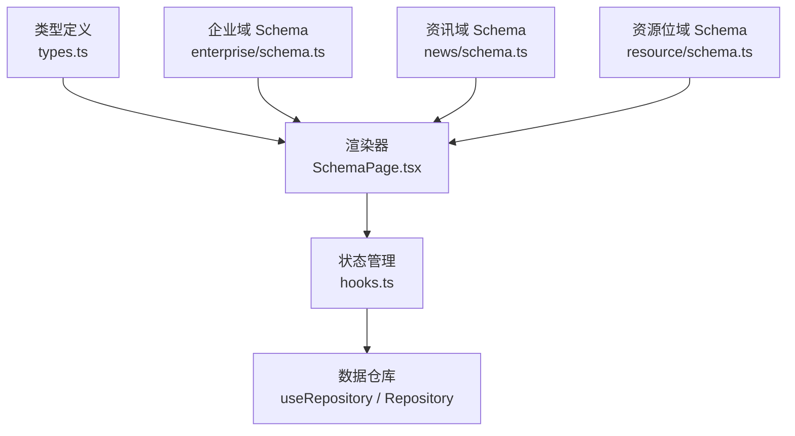
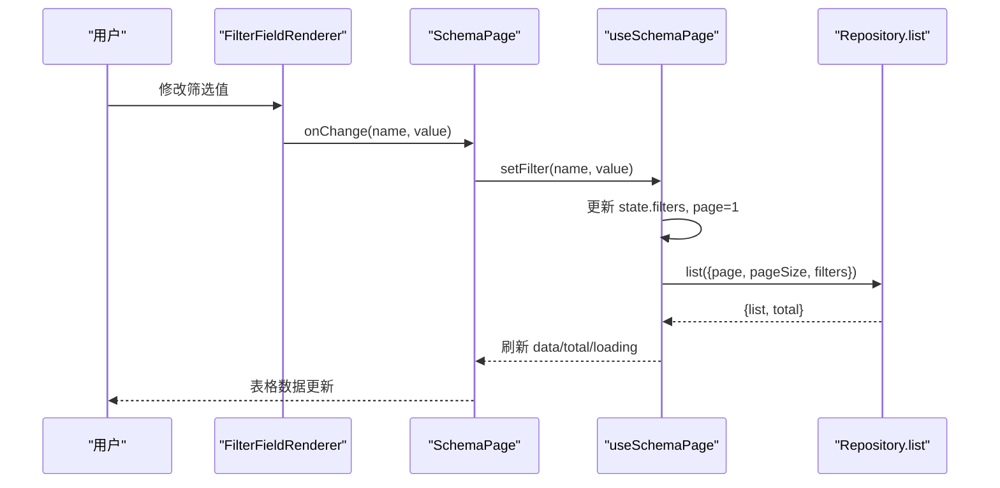
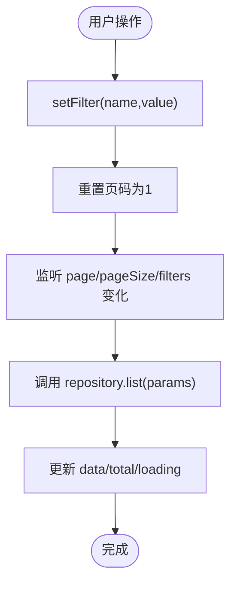
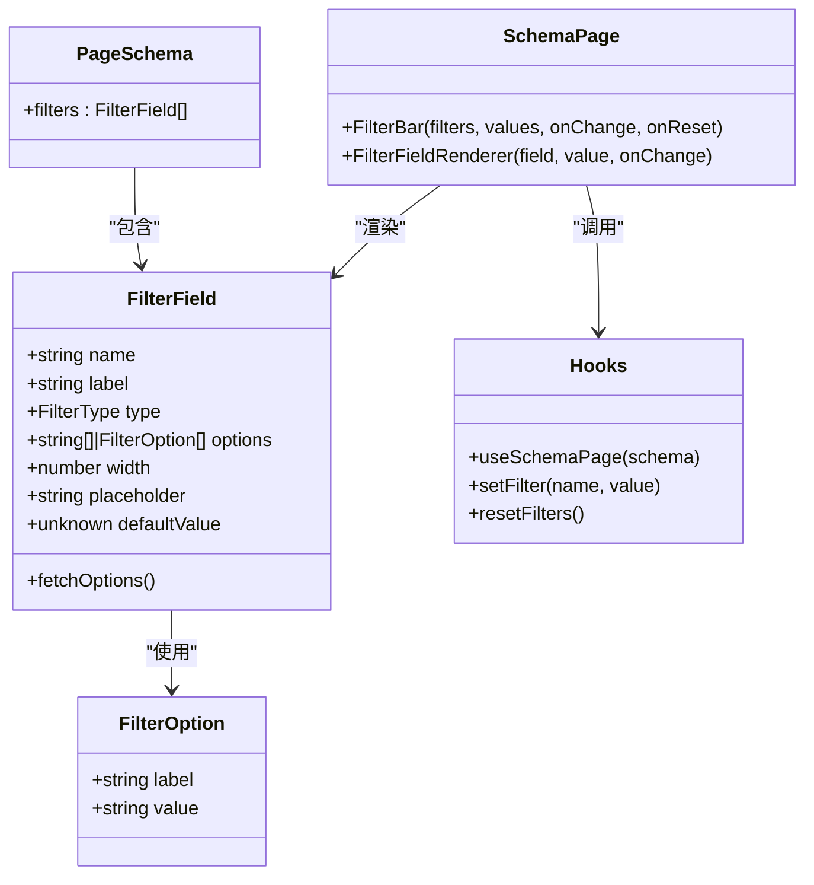

# 筛选栏配置

<cite>
**本文引用的文件**   
- [types.ts](file://hj-admin/src/shared/schema-engine/types.ts)
- [SchemaPage.tsx](file://hj-admin/src/shared/schema-engine/SchemaPage.tsx)
- [hooks.ts](file://hj-admin/src/shared/schema-engine/hooks.ts)
- [enterprise/schema.ts](file://hj-admin/src/domains/enterprise/schema.ts)
- [news/schema.ts](file://hj-admin/src/domains/news/schema.ts)
- [resource/schema.ts](file://hj-admin/src/domains/resource/schema.ts)
</cite>

## 目录
1. [简介](#简介)
2. [项目结构](#项目结构)
3. [核心组件与类型](#核心组件与类型)
4. [架构总览](#架构总览)
5. [详细组件分析](#详细组件分析)
6. [依赖关系分析](#依赖关系分析)
7. [性能考虑](#性能考虑)
8. [故障排查指南](#故障排查指南)
9. [结论](#结论)
10. [附录：完整示例与最佳实践](#附录完整示例与最佳实践)

## 简介
本文件面向“筛选栏配置”的开发者与产品运营人员，系统性说明 FilterField 接口的所有属性、支持的筛选类型（select、input、dateRange、cascader、treeSelect、radioGroup）的使用方法与差异、异步加载选项 fetchOptions 的实现方式，并提供复杂业务场景下的组合使用示例、性能优化建议与用户体验设计指导。

## 项目结构
筛选能力由“类型定义 + 渲染器 + 状态管理 + 领域 Schema”共同构成：
- 类型定义：FilterField、FilterOption、FilterType 等
- 渲染器：FilterBar、FilterFieldRenderer 根据 type 渲染不同控件
- 状态管理：useSchemaPage 维护 filters、分页、Tab、选中行等
- 领域 Schema：各业务域通过 PageSchema.filters 声明筛选字段

图表来源
- [types.ts:1-24](file://hj-admin/src/shared/schema-engine/types.ts#L1-L24)
- [SchemaPage.tsx:15-73](file://hj-admin/src/shared/schema-engine/SchemaPage.tsx#L15-L73)
- [hooks.ts:20-105](file://hj-admin/src/shared/schema-engine/hooks.ts#L20-L105)
- [enterprise/schema.ts:12-14](file://hj-admin/src/domains/enterprise/schema.ts#L12-L14)
- [news/schema.ts:27-36](file://hj-admin/src/domains/news/schema.ts#L27-L36)
- [resource/schema.ts:7-10](file://hj-admin/src/domains/resource/schema.ts#L7-L10)

章节来源
- [types.ts:1-24](file://hj-admin/src/shared/schema-engine/types.ts#L1-L24)
- [SchemaPage.tsx:15-73](file://hj-admin/src/shared/schema-engine/SchemaPage.tsx#L15-L73)
- [hooks.ts:20-105](file://hj-admin/src/shared/schema-engine/hooks.ts#L20-L105)
- [enterprise/schema.ts:12-14](file://hj-admin/src/domains/enterprise/schema.ts#L12-L14)
- [news/schema.ts:27-36](file://hj-admin/src/domains/news/schema.ts#L27-L36)
- [resource/schema.ts:7-10](file://hj-admin/src/domains/resource/schema.ts#L7-L10)

## 核心组件与类型
- FilterType：支持 'select' | 'input' | 'dateRange' | 'cascader' | 'treeSelect' | 'radioGroup'
- FilterOption：{ label, value }
- FilterField：name、label、type、options、width、placeholder、defaultValue、fetchOptions
- PageSchema.filters：FilterField[]，用于声明页面筛选栏

章节来源
- [types.ts:6-24](file://hj-admin/src/shared/schema-engine/types.ts#L6-L24)
- [types.ts:132-144](file://hj-admin/src/shared/schema-engine/types.ts#L132-L144)

## 架构总览
筛选流程从“配置驱动”到“数据请求”的关键路径如下：
- 页面通过 PageSchema.filters 声明筛选字段
- SchemaPage 渲染 FilterBar 与 FilterFieldRenderer
- 用户交互触发 setFilter，更新 state.filters
- useSchemaPage 监听 filters 变化，调用 repository.list(params) 拉取数据
- 表格展示结果

图表来源
- [SchemaPage.tsx:15-73](file://hj-admin/src/shared/schema-engine/SchemaPage.tsx#L15-L73)
- [hooks.ts:36-57](file://hj-admin/src/shared/schema-engine/hooks.ts#L36-L57)

章节来源
- [SchemaPage.tsx:15-73](file://hj-admin/src/shared/schema-engine/SchemaPage.tsx#L15-L73)
- [hooks.ts:36-57](file://hj-admin/src/shared/schema-engine/hooks.ts#L36-L57)

## 详细组件分析

### FilterField 接口详解
- name：筛选字段名，作为查询参数键
- label：显示标签
- type：筛选控件类型，见下节
- options：静态选项，支持字符串数组或对象数组
- width：控件宽度
- placeholder：占位提示
- defaultValue：默认值
- fetchOptions：异步加载选项函数，返回 Promise<FilterOption[]>

章节来源
- [types.ts:6-24](file://hj-admin/src/shared/schema-engine/types.ts#L6-L24)

### 支持的筛选类型与差异
- select
  - 用途：单选下拉
  - options：string[] 或 FilterOption[]
  - 行为：当前渲染器直接渲染 Select，未实现 fetchOptions 自动加载
- input
  - 用途：文本输入
  - 行为：带清除按钮，适合关键词搜索
- dateRange
  - 用途：日期范围选择
  - 行为：返回起止时间，常用于按时间过滤
- cascader
  - 用途：级联选择
  - 现状：类型已支持，但当前渲染器未实现对应分支
- treeSelect
  - 用途：树形选择
  - 现状：类型已支持，但当前渲染器未实现对应分支
- radioGroup
  - 用途：单选组
  - 现状：类型已支持，但当前渲染器未实现对应分支

注意：当前渲染器对 select、input、dateRange 有明确实现；cascader、treeSelect、radioGroup 在类型中声明但未在渲染器中处理，会回退为普通 Input。

章节来源
- [types.ts:6-7](file://hj-admin/src/shared/schema-engine/types.ts#L6-L7)
- [SchemaPage.tsx:40-73](file://hj-admin/src/shared/schema-engine/SchemaPage.tsx#L40-L73)

### 异步加载选项 fetchOptions 的实现方式
- 接口约定：fetchOptions?: () => Promise<FilterOption[]>
- 当前实现：渲染器未消费该字段，需扩展以支持动态加载
- 推荐实现思路
  - 在 FilterFieldRenderer 中根据 field.type 判断是否需要异步加载
  - 首次打开或聚焦时调用 fetchOptions()，缓存结果并渲染
  - 提供 loading 态与错误态反馈
  - 对于级联/树形，可结合父级选择联动重新加载子级选项

章节来源
- [types.ts:22-24](file://hj-admin/src/shared/schema-engine/types.ts#L22-L24)
- [SchemaPage.tsx:40-73](file://hj-admin/src/shared/schema-engine/SchemaPage.tsx#L40-L73)

### 筛选状态管理与数据流
- setFilter：更新 filters 并将页码重置为 1
- resetFilters：清空 filters 并回到第 1 页
- useEffect 监听 page/pageSize/filters 变化，触发列表刷新
- 提交参数：{ page, pageSize, filters }

图表来源
- [hooks.ts:59-69](file://hj-admin/src/shared/schema-engine/hooks.ts#L59-L69)
- [hooks.ts:36-57](file://hj-admin/src/shared/schema-engine/hooks.ts#L36-L57)

章节来源
- [hooks.ts:59-69](file://hj-admin/src/shared/schema-engine/hooks.ts#L59-L69)
- [hooks.ts:36-57](file://hj-admin/src/shared/schema-engine/hooks.ts#L36-L57)

## 依赖关系分析
- types.ts 被 SchemaPage.tsx 与 hooks.ts 引用
- SchemaPage.tsx 依赖 antd 组件与 useSchemaPage
- hooks.ts 依赖 useRepository 进行数据获取
- 各 domain schema 通过 PageSchema.filters 注入筛选配置

图表来源
- [types.ts:6-24](file://hj-admin/src/shared/schema-engine/types.ts#L6-L24)
- [types.ts:132-144](file://hj-admin/src/shared/schema-engine/types.ts#L132-L144)
- [SchemaPage.tsx:15-73](file://hj-admin/src/shared/schema-engine/SchemaPage.tsx#L15-L73)
- [hooks.ts:20-105](file://hj-admin/src/shared/schema-engine/hooks.ts#L20-L105)

章节来源
- [types.ts:6-24](file://hj-admin/src/shared/schema-engine/types.ts#L6-L24)
- [SchemaPage.tsx:15-73](file://hj-admin/src/shared/schema-engine/SchemaPage.tsx#L15-L73)
- [hooks.ts:20-105](file://hj-admin/src/shared/schema-engine/hooks.ts#L20-L105)

## 性能考虑
- 避免频繁重渲染
  - 将 filters 变更合并后统一触发列表刷新（当前已实现）
  - 对大型 options 列表做本地缓存，减少重复请求
- 异步选项加载
  - 使用防抖/节流控制 fetchOptions 触发频率
  - 对级联/树形按需加载子节点，避免一次性加载全量
- 网络层
  - 合理设置 pageSize，避免单次返回过多数据
  - 对相同 filters 的请求做去重或短期缓存
- 交互体验
  - 为异步加载提供 loading 态与错误重试
  - 对长列表启用虚拟滚动（若后续引入）

[本节为通用建议，不直接分析具体文件]

## 故障排查指南
- 筛选无效
  - 检查 filters 是否被正确传入 repository.list
  - 确认 setFilter 是否触发了 useEffect 依赖变化
- 异步选项不生效
  - 当前渲染器未消费 fetchOptions，需在渲染器中补充逻辑
- 类型未实现的控件
  - cascader、treeSelect、radioGroup 在当前渲染器中未实现，会回退为 Input，需扩展 switch 分支

章节来源
- [hooks.ts:36-57](file://hj-admin/src/shared/schema-engine/hooks.ts#L36-L57)
- [SchemaPage.tsx:40-73](file://hj-admin/src/shared/schema-engine/SchemaPage.tsx#L40-L73)

## 结论
本项目采用“配置驱动”的筛选方案，通过 FilterField 与 PageSchema 的组合快速构建筛选栏。当前已完善 select、input、dateRange 的渲染与数据流，cascader、treeSelect、radioGroup 的类型已预留，待渲染器扩展后即可全面支持。异步选项 fetchOptions 已在类型中定义，建议在渲染器中实现按需加载与缓存策略，以提升性能与体验。

[本节为总结性内容，不直接分析具体文件]

## 附录：完整示例与最佳实践

### 基础配置示例（来自业务 Schema）
- 企业库·待处理池：单输入框筛选
  - 参考路径：[enterprise/schema.ts:12-14](file://hj-admin/src/domains/enterprise/schema.ts#L12-L14)
- 企业库·已确认企业：多 select + input
  - 参考路径：[enterprise/schema.ts:39-43](file://hj-admin/src/domains/enterprise/schema.ts#L39-L43)
- 资讯池：select + input + dateRange
  - 参考路径：[news/schema.ts:27-36](file://hj-admin/src/domains/news/schema.ts#L27-L36)
- Banner 管理：单 select
  - 参考路径：[resource/schema.ts:7-10](file://hj-admin/src/domains/resource/schema.ts#L7-L10)

章节来源
- [enterprise/schema.ts:12-14](file://hj-admin/src/domains/enterprise/schema.ts#L12-L14)
- [enterprise/schema.ts:39-43](file://hj-admin/src/domains/enterprise/schema.ts#L39-L43)
- [news/schema.ts:27-36](file://hj-admin/src/domains/news/schema.ts#L27-L36)
- [resource/schema.ts:7-10](file://hj-admin/src/domains/resource/schema.ts#L7-L10)

### 复杂业务场景组合建议
- 多级联动
  - 使用 cascader/treeSelect 表达层级关系，配合 fetchOptions 实现父子级联加载
- 条件显隐
  - 当某筛选项为空时隐藏相关联动项，减少干扰
- 快捷筛选
  - 结合 quickFilters 提供常用组合（如“全部/已关联/待补关联”），提升效率
- 默认值与重置
  - 合理使用 defaultValue 与重置按钮，保证初始状态清晰

[本节为概念性指导，不直接分析具体文件]