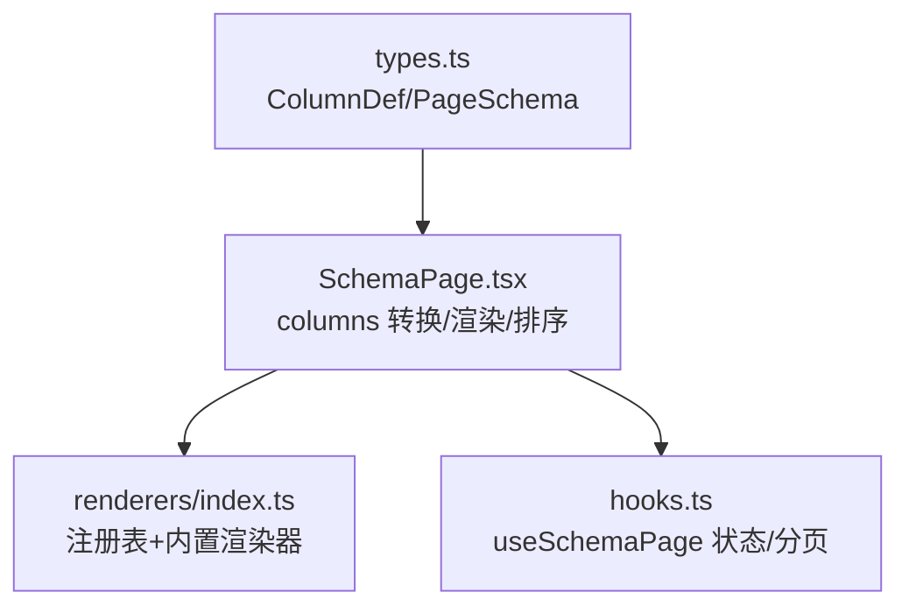
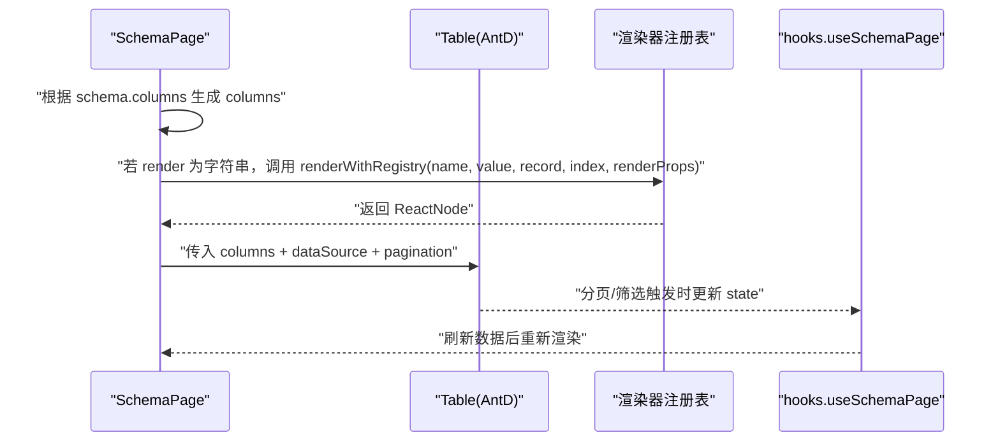
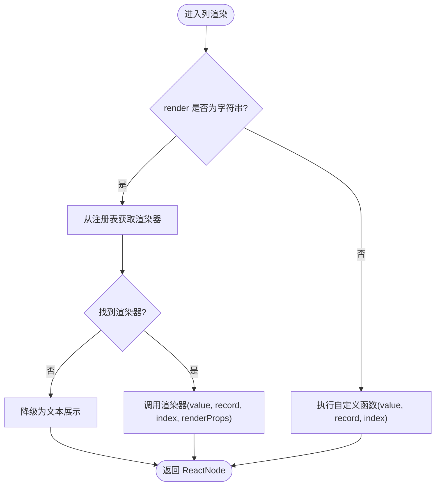
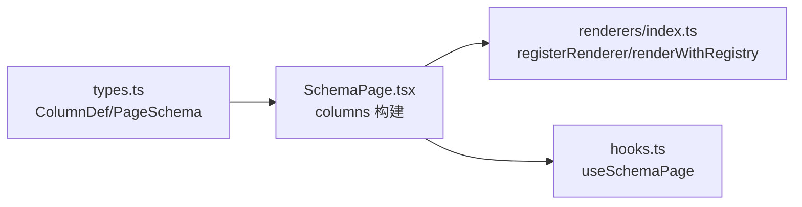

# 表格列配置

<cite>
**本文引用的文件**   
- [types.ts](file://hj-admin/src/shared/schema-engine/types.ts)
- [SchemaPage.tsx](file://hj-admin/src/shared/schema-engine/SchemaPage.tsx)
- [renderers/index.ts](file://hj-admin/src/shared/schema-engine/renderers/index.ts)
- [hooks.ts](file://hj-admin/src/shared/schema-engine/hooks.ts)
</cite>

## 目录
1. [简介](#简介)
2. [项目结构](#项目结构)
3. [核心组件](#核心组件)
4. [架构总览](#架构总览)
5. [详细组件分析](#详细组件分析)
6. [依赖分析](#依赖分析)
7. [性能考虑](#性能考虑)
8. [故障排查指南](#故障排查指南)
9. [结论](#结论)
10. [附录](#附录)

## 简介
本文件聚焦于“表格列配置”的完整说明，围绕 ColumnDef 接口的所有属性进行系统化梳理，涵盖基础显示、渲染器（字符串引用与自定义函数）、排序（布尔开关与自定义比较函数），并提供复杂列配置示例（数据格式化、条件渲染、操作按钮等）以及性能优化与响应式建议。文档同时给出架构图与流程图，帮助读者快速理解从 Schema 到最终表格渲染的完整链路。

## 项目结构
与表格列配置相关的核心代码位于 schema-engine 子系统中：
- types.ts：定义 ColumnDef、PageSchema 等类型契约
- SchemaPage.tsx：将 PageSchema 转换为 Ant Design Table 的 columns 并处理 render/sorter
- renderers/index.ts：注册表与内置渲染器实现
- hooks.ts：页面状态与数据加载（与列配置间接相关）

图表来源
- [types.ts:26-41](file://hj-admin/src/shared/schema-engine/types.ts#L26-L41)
- [SchemaPage.tsx:89-110](file://hj-admin/src/shared/schema-engine/SchemaPage.tsx#L89-L110)
- [renderers/index.ts:1-46](file://hj-admin/src/shared/schema-engine/renderers/index.ts#L1-L46)
- [hooks.ts:20-57](file://hj-admin/src/shared/schema-engine/hooks.ts#L20-L57)

章节来源
- [types.ts:26-41](file://hj-admin/src/shared/schema-engine/types.ts#L26-L41)
- [SchemaPage.tsx:89-110](file://hj-admin/src/shared/schema-engine/SchemaPage.tsx#L89-L110)
- [renderers/index.ts:1-46](file://hj-admin/src/shared/schema-engine/renderers/index.ts#L1-L46)
- [hooks.ts:20-57](file://hj-admin/src/shared/schema-engine/hooks.ts#L20-L57)

## 核心组件
本节对 ColumnDef 接口进行全面说明，包括字段含义、默认行为、与渲染/排序的关系。

- field: 绑定数据源字段名，作为 dataIndex/key 使用
- title: 列头标题
- width/minWidth: 列宽控制；未设置时由表格自适应
- fixed: 固定列位置，支持 left/right
- align: 单元格对齐方式，left/center/right
- ellipsis: 是否启用省略号展示
- render: 渲染器，支持两种模式
  - 字符串引用：指向注册表中的渲染器名称
  - 自定义函数：(value, record, index) => ReactNode
- renderProps: 传递给渲染器的额外参数（当 render 为字符串引用时生效）
- sorter: 排序开关或自定义比较函数
  - true/false：开启/关闭基于字段的默认排序
  - (a, b) => number：自定义比较逻辑

章节来源
- [types.ts:26-41](file://hj-admin/src/shared/schema-engine/types.ts#L26-L41)

## 架构总览
下图展示了从 Schema 到表格渲染的关键流程，重点体现列配置的解析与执行路径。

图表来源
- [SchemaPage.tsx:89-110](file://hj-admin/src/shared/schema-engine/SchemaPage.tsx#L89-L110)
- [renderers/index.ts:32-46](file://hj-admin/src/shared/schema-engine/renderers/index.ts#L32-L46)
- [hooks.ts:36-57](file://hj-admin/src/shared/schema-engine/hooks.ts#L36-L57)

## 详细组件分析

### ColumnDef 属性详解
- 基础显示
  - field/title/width/minWidth/fixed/align/ellipsis：直接映射到 Ant Design Table 对应列属性
- 渲染器 render
  - 字符串引用：通过注册表动态查找渲染器，便于序列化与 AI 友好
  - 自定义函数：在列级别灵活定制任意 UI
- 渲染参数 renderProps
  - 仅当 render 为字符串引用时生效，用于向渲染器传递配置
- 排序 sorter
  - 布尔值：true 表示按该列字段值进行默认排序
  - 自定义函数：接收两条记录 a/b，返回正负零以决定顺序

章节来源
- [types.ts:26-41](file://hj-admin/src/shared/schema-engine/types.ts#L26-L41)

#### 渲染器机制（字符串引用 vs 自定义函数）

图表来源
- [SchemaPage.tsx:100-107](file://hj-admin/src/shared/schema-engine/SchemaPage.tsx#L100-L107)
- [renderers/index.ts:32-46](file://hj-admin/src/shared/schema-engine/renderers/index.ts#L32-L46)

章节来源
- [SchemaPage.tsx:89-110](file://hj-admin/src/shared/schema-engine/SchemaPage.tsx#L89-L110)
- [renderers/index.ts:1-46](file://hj-admin/src/shared/schema-engine/renderers/index.ts#L1-L46)

#### 排序 sorter 的行为
- 当 sorter 为 true 时，表格按当前列字段值进行升序/降序切换
- 当 sorter 为函数时，提供完全自定义的比较逻辑，可跨字段或复杂规则排序

章节来源
- [types.ts:39-41](file://hj-admin/src/shared/schema-engine/types.ts#L39-L41)
- [SchemaPage.tsx:99](file://hj-admin/src/shared/schema-engine/SchemaPage.tsx#L99)

### 内置渲染器一览
以下为已注册的内置渲染器及其用途（均通过 registerRenderer 注册，Schema 中以字符串引用）：
- tag-list：标签列表展示，支持自动换行
- status-badge：状态徽章，支持颜色映射
- entity-count：实体计数，点击可触发 onAction
- link：可导航链接，支持模板替换 :id
- date-or-dash：日期或破折号占位
- text：纯文本
- color-tag：带颜色的标签
- percent：百分比数值，按阈值着色
- url：外链预览，超长截断
- success-rate：成功率等级（高/中/低）
- link-progress：关联进度文本
- position-tags：位置标签，不同值不同色

章节来源
- [renderers/index.ts:50-163](file://hj-admin/src/shared/schema-engine/renderers/index.ts#L50-L163)

### 复杂列配置示例（概念性说明）
以下示例为概念性描述，展示如何组合多种能力完成高级场景。为避免泄露具体实现，不直接粘贴源码，仅提供路径参考。

- 数据格式化
  - 使用内置渲染器：如 percent、success-rate、date-or-dash
  - 自定义函数：对数字/时间/枚举进行本地化或单位换算
  - 参考路径：[renderers/index.ts:118-144](file://hj-admin/src/shared/schema-engine/renderers/index.ts#L118-L144)

- 条件渲染
  - 在自定义 render 函数中依据 record 字段判断分支
  - 结合 RowAction.visible 做行级操作的条件显示
  - 参考路径：[SchemaPage.tsx:122-124](file://hj-admin/src/shared/schema-engine/SchemaPage.tsx#L122-L124)

- 操作按钮
  - 使用 rowActions 声明式配置，支持 navigateTo、confirm、onClick
  - 参考路径：[types.ts:44-56](file://hj-admin/src/shared/schema-engine/types.ts#L44-L56)、[SchemaPage.tsx:113-142](file://hj-admin/src/shared/schema-engine/SchemaPage.tsx#L113-L142)

- 多列联动与交互
  - 借助 renderProps 向渲染器传递上下文，或在自定义函数内访问 record/index
  - 参考路径：[types.ts:36-38](file://hj-admin/src/shared/schema-engine/types.ts#L36-L38)

## 依赖分析
- SchemaPage 依赖 types.ts 的 ColumnDef/PageSchema 类型
- SchemaPage 在构建 columns 时，将 sorter 透传给 Ant Design Table
- 当 render 为字符串时，SchemaPage 调用 renderWithRegistry 从注册表解析渲染器
- hooks.ts 负责分页/筛选/Tab 等状态，影响 dataSource 与 total，从而驱动表格重渲染

图表来源
- [types.ts:26-41](file://hj-admin/src/shared/schema-engine/types.ts#L26-L41)
- [SchemaPage.tsx:89-110](file://hj-admin/src/shared/schema-engine/SchemaPage.tsx#L89-L110)
- [renderers/index.ts:21-46](file://hj-admin/src/shared/schema-engine/renderers/index.ts#L21-L46)
- [hooks.ts:20-57](file://hj-admin/src/shared/schema-engine/hooks.ts#L20-L57)

章节来源
- [types.ts:26-41](file://hj-admin/src/shared/schema-engine/types.ts#L26-L41)
- [SchemaPage.tsx:89-110](file://hj-admin/src/shared/schema-engine/SchemaPage.tsx#L89-L110)
- [renderers/index.ts:21-46](file://hj-admin/src/shared/schema-engine/renderers/index.ts#L21-L46)
- [hooks.ts:20-57](file://hj-admin/src/shared/schema-engine/hooks.ts#L20-L57)

## 性能考虑
- 避免在 render 中进行昂贵计算
  - 优先使用内置渲染器或轻量自定义函数
  - 复杂逻辑可封装为独立渲染器并通过 registerRenderer 复用
- 合理使用 width/minWidth
  - 明确列宽可减少布局抖动与重排
- 谨慎使用 sorter
  - 大数据量下建议使用服务端排序，前端 sorter 仅用于小数据集或简单排序
- 减少不必要的 re-render
  - 将 render 函数稳定化（如 useMemo 包裹），或使用字符串引用渲染器以降低闭包重建
- 滚动与固定列
  - 合理设置 scrollX 与 fixed，避免过多固定列导致横向滚动性能下降

## 故障排查指南
- 渲染器未找到
  - 现象：控制台出现警告，单元格回退为文本
  - 排查：确认 render 字符串已在注册表中正确注册
  - 参考路径：[renderers/index.ts:40-44](file://hj-admin/src/shared/schema-engine/renderers/index.ts#L40-L44)
- 排序无效
  - 现象：点击列头无变化
  - 排查：确认 sorter 为 true 或提供了正确的比较函数；检查字段值类型是否一致
  - 参考路径：[types.ts:39-41](file://hj-admin/src/shared/schema-engine/types.ts#L39-L41)、[SchemaPage.tsx:99](file://hj-admin/src/shared/schema-engine/SchemaPage.tsx#L99)
- 列宽异常
  - 现象：内容溢出或列过窄
  - 排查：设置 width/minWidth 或启用 ellipsis；必要时调整 scrollX
  - 参考路径：[types.ts:30-34](file://hj-admin/src/shared/schema-engine/types.ts#L30-L34)
- 操作按钮不显示
  - 现象：rowActions 未渲染
  - 排查：检查 visible 条件与 confirm/navigateTo 配置
  - 参考路径：[SchemaPage.tsx:122-130](file://hj-admin/src/shared/schema-engine/SchemaPage.tsx#L122-L130)

章节来源
- [renderers/index.ts:40-44](file://hj-admin/src/shared/schema-engine/renderers/index.ts#L40-L44)
- [types.ts:30-41](file://hj-admin/src/shared/schema-engine/types.ts#L30-L41)
- [SchemaPage.tsx:99-130](file://hj-admin/src/shared/schema-engine/SchemaPage.tsx#L99-L130)

## 结论
ColumnDef 提供了从基础显示到高级渲染与排序的完整能力。通过字符串引用渲染器与自定义函数的双模设计，既能保证配置的可序列化与可维护性，又能满足高度灵活的个性化需求。配合合理的性能策略与响应式实践，可在复杂业务场景中高效构建高质量的数据表格。

## 附录

### ColumnDef 属性速查表
- field: 必填，数据字段键
- title: 必填，列标题
- width/minWidth: 可选，列宽
- fixed: 可选，'left'|'right'
- align: 可选，'left'|'center'|'right'
- ellipsis: 可选，是否省略
- render: 可选，字符串引用或自定义函数
- renderProps: 可选，渲染器参数
- sorter: 可选，true/false 或比较函数

章节来源
- [types.ts:26-41](file://hj-admin/src/shared/schema-engine/types.ts#L26-L41)