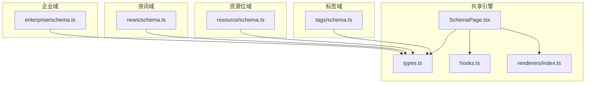
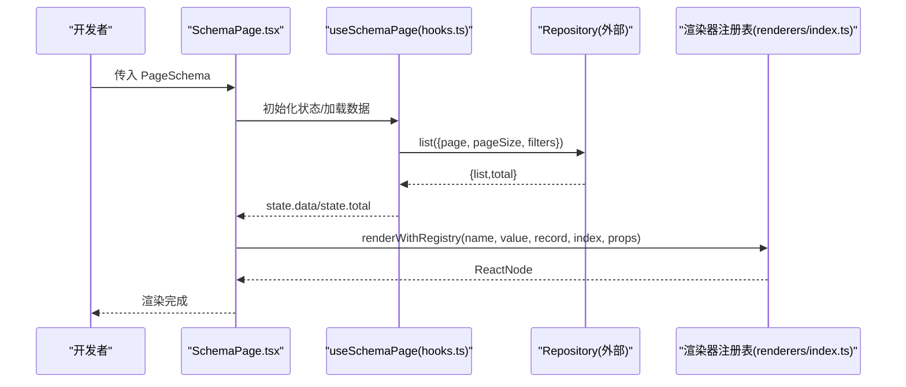
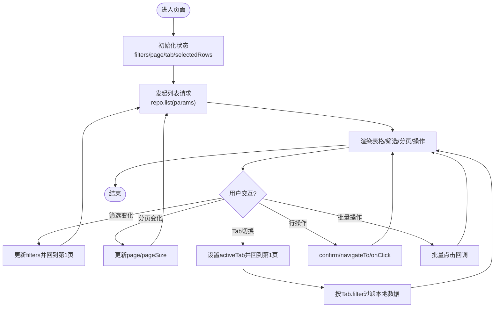
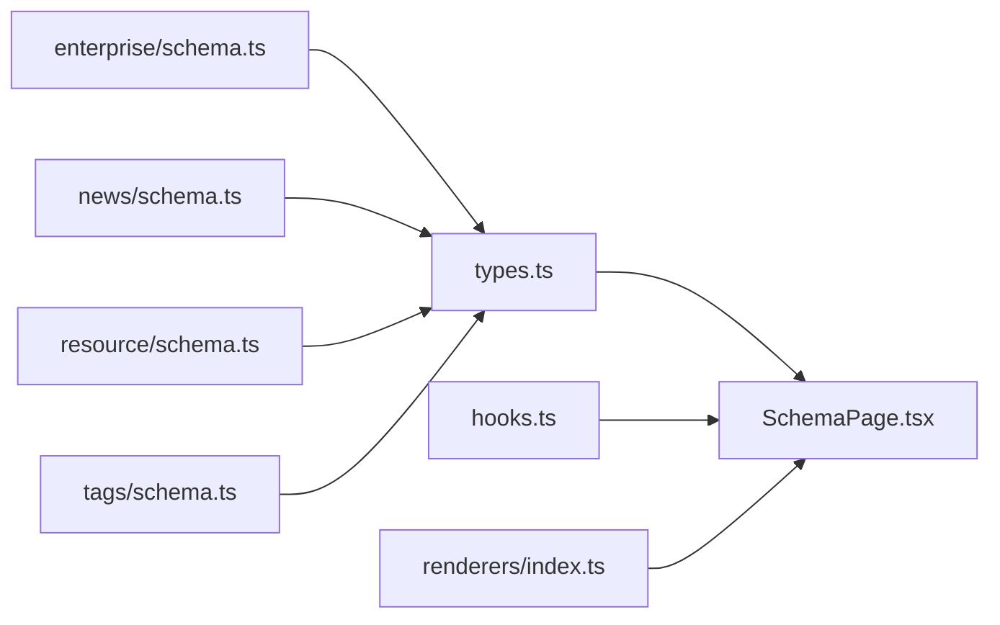

# Schema配置接口

<cite>
**本文引用的文件**
- [types.ts](file://hj-admin/src/shared/schema-engine/types.ts)
- [SchemaPage.tsx](file://hj-admin/src/shared/schema-engine/SchemaPage.tsx)
- [hooks.ts](file://hj-admin/src/shared/schema-engine/hooks.ts)
- [renderers/index.ts](file://hj-admin/src/shared/schema-engine/renderers/index.ts)
- [enterprise/schema.ts](file://hj-admin/src/domains/enterprise/schema.ts)
- [news/schema.ts](file://hj-admin/src/domains/news/schema.ts)
- [resource/schema.ts](file://hj-admin/src/domains/resource/schema.ts)
- [tags/schema.ts](file://hj-admin/src/domains/tags/schema.ts)
</cite>

## 目录
1. [简介](#简介)
2. [项目结构](#项目结构)
3. [核心组件](#核心组件)
4. [架构总览](#架构总览)
5. [详细组件分析](#详细组件分析)
6. [依赖关系分析](#依赖关系分析)
7. [性能与可扩展性](#性能与可扩展性)
8. [故障排查指南](#故障排查指南)
9. [结论](#结论)
10. [附录：迁移与兼容性](#附录：迁移与兼容性)

## 简介
本文件面向“基于配置的页面生成”能力，系统化记录 Schema 配置接口的完整定义与使用方式。重点覆盖以下类型与能力：
- PageSchema：页面级配置（筛选、表格、分页、操作、弹窗、Tab、快捷筛选等）
- ColumnDef：列定义（字段、标题、宽度、对齐、排序、渲染器引用或函数）
- FormSchema / FormFieldDef：表单字段配置（布局、联动、校验提示占位等）
- FilterField：筛选字段（输入、选择、日期范围、级联、树选择、单选组）
- RowAction / BatchAction / ToolbarAction：行/批量/工具栏操作
- ModalDef：弹窗/抽屉声明（支持表单、自定义组件、自定义渲染）
- TabDef：Tab 分组与过滤
- 渲染器注册表：字符串引用渲染器，保持可序列化与 AI 友好

同时提供列表页、详情页、编辑页的配置模式示例路径，以及自定义渲染器的注册和使用方法。

## 项目结构
该能力位于共享的 schema-engine 模块中，并在各业务域通过各自的 schema.ts 进行配置。

图表来源
- [types.ts:1-216](file://hj-admin/src/shared/schema-engine/types.ts#L1-L216)
- [SchemaPage.tsx:1-226](file://hj-admin/src/shared/schema-engine/SchemaPage.tsx#L1-L226)
- [hooks.ts:1-106](file://hj-admin/src/shared/schema-engine/hooks.ts#L1-L106)
- [renderers/index.ts:1-163](file://hj-admin/src/shared/schema-engine/renderers/index.ts#L1-L163)
- [enterprise/schema.ts:1-64](file://hj-admin/src/domains/enterprise/schema.ts#L1-L64)
- [news/schema.ts:1-123](file://hj-admin/src/domains/news/schema.ts#L1-L123)
- [resource/schema.ts:1-51](file://hj-admin/src/domains/resource/schema.ts#L1-L51)
- [tags/schema.ts:1-39](file://hj-admin/src/domains/tags/schema.ts#L1-L39)

章节来源
- [types.ts:1-216](file://hj-admin/src/shared/schema-engine/types.ts#L1-L216)
- [SchemaPage.tsx:1-226](file://hj-admin/src/shared/schema-engine/SchemaPage.tsx#L1-L226)
- [hooks.ts:1-106](file://hj-admin/src/shared/schema-engine/hooks.ts#L1-L106)
- [renderers/index.ts:1-163](file://hj-admin/src/shared/schema-engine/renderers/index.ts#L1-L163)

## 核心组件
- 类型基石：types.ts 定义了所有 Schema 相关类型，包括 PageSchema、ColumnDef、FormSchema、FilterField、RowAction、BatchAction、ToolbarAction、ModalDef、TabDef、RouteDef、DomainManifest、PageActionContext 等。
- 通用列表页渲染器：SchemaPage.tsx 根据 PageSchema 自动渲染筛选栏、Tab、表格、分页、操作列等，并支持列渲染器字符串引用与自定义函数。
- 状态与数据流：hooks.ts 封装 useSchemaPage，管理筛选、分页、Tab、选中行、数据加载与刷新。
- 渲染器注册表：renderers/index.ts 提供 registerRenderer/getRenderer/renderWithRegistry，内置多种常用渲染器（标签、状态徽章、链接、百分比、URL、成功率等）。

章节来源
- [types.ts:1-216](file://hj-admin/src/shared/schema-engine/types.ts#L1-L216)
- [SchemaPage.tsx:1-226](file://hj-admin/src/shared/schema-engine/SchemaPage.tsx#L1-L226)
- [hooks.ts:1-106](file://hj-admin/src/shared/schema-engine/hooks.ts#L1-L106)
- [renderers/index.ts:1-163](file://hj-admin/src/shared/schema-engine/renderers/index.ts#L1-L163)

## 架构总览
下图展示了从配置到渲染的关键流程：Schema 配置 → SchemaPage 解析 → hooks 数据获取 → 表格渲染 → 渲染器执行。

图表来源
- [SchemaPage.tsx:76-226](file://hj-admin/src/shared/schema-engine/SchemaPage.tsx#L76-L226)
- [hooks.ts:20-106](file://hj-admin/src/shared/schema-engine/hooks.ts#L20-L106)
- [renderers/index.ts:32-46](file://hj-admin/src/shared/schema-engine/renderers/index.ts#L32-L46)

## 详细组件分析

### 类型体系与字段说明
- PageSchema<T>
  - 标识与元信息：id、title、description、entity
  - 筛选栏：filters: FilterField[]
  - 表格：columns: ColumnDef<T>[]、rowKey、scrollX
  - 分页：pagination.pageSize、showTotal、showSizeChanger
  - 操作：rowActions、batchActions、toolbarActions
  - 弹窗：modals: ModalDef<T>[]
  - Tab 分组：tabs: TabDef<T>[]
  - 快捷筛选：quickFilters
- ColumnDef<T>
  - field、title、width/minWidth、fixed、align、ellipsis
  - render: string | (value, record, index) => ReactNode
  - renderProps: Record<string, unknown>
  - sorter: boolean | comparator
- FormSchema / FormFieldDef
  - fields: FormFieldDef[]
  - layout: 'horizontal' | 'vertical' | 'inline'
  - columns: number
  - FormFieldDef: name、label、type、required、options、placeholder、defaultValue、colSpan、linkage
- FilterField
  - name、label、type、options、width、placeholder、defaultValue、fetchOptions
- RowAction / BatchAction / ToolbarAction
  - key、label、type、visible、onClick、navigateTo、confirm
  - BatchAction.onClick(ids)
  - ToolbarAction.icon
- ModalDef
  - key、title、trigger、type、width、formSchema、customComponent、customRender
- TabDef
  - key、label、countField、count、filter(record)
- RouteDef / DomainManifest
  - 路由与菜单清单，schema/component 二选一
- PageActionContext
  - refresh、navigate、showModal

章节来源
- [types.ts:106-174](file://hj-admin/src/shared/schema-engine/types.ts#L106-L174)
- [types.ts:26-105](file://hj-admin/src/shared/schema-engine/types.ts#L26-L105)
- [types.ts:176-216](file://hj-admin/src/shared/schema-engine/types.ts#L176-L216)

### 渲染器机制与内置渲染器
- 注册与调用
  - registerRenderer(name, renderer)
  - getRenderer(name)
  - renderWithRegistry(name, value, record, index, renderProps?, onAction?)
- 内置渲染器（部分）
  - tag-list：标签列表
  - status-badge：状态徽章（支持 colorMap）
  - entity-count：实体计数（支持 onAction）
  - link：可导航链接（支持 :id 模板替换）
  - date-or-dash：日期或破折号
  - text：纯文本
  - color-tag：颜色标签
  - percent：百分比
  - url：URL 链接
  - success-rate：成功率等级
  - link-progress：关联进度
  - position-tags：位置标签

章节来源
- [renderers/index.ts:1-163](file://hj-admin/src/shared/schema-engine/renderers/index.ts#L1-L163)

### 列表页配置模式（以实际 Schema 为例）
- 企业库·待处理池
  - 筛选：企业名称（input）
  - 列：名称（link）、来源、关联进度（link-progress）、分类状态（status-badge）、更新时间（date-or-dash）
  - 行操作：去处理（navigateTo）
  - Tab：待关联、无关联待确认
  - 参考路径：[enterprise/schema.ts:7-31](file://hj-admin/src/domains/enterprise/schema.ts#L7-L31)
- 企业库·已确认企业
  - 筛选：企业性质、企业类型、名称搜索
  - 列：名称（link）、关联资讯、关联项目、氢能关联度（percent）、企业性质（status-badge）、状态（status-badge）、更新时间（date-or-dash）
  - 行操作：去分类（条件可见）、查看
  - Tab：待分类、已分类
  - 参考路径：[enterprise/schema.ts:34-63](file://hj-admin/src/domains/enterprise/schema.ts#L34-L63)
- 资讯池
  - 筛选：来源、状态、关联状态、关键词、发布时间（dateRange）
  - 列：标题（link）、来源、标签（tag-list）、识别企业（entity-count）、状态（status-badge）、发布时间（date-or-dash）
  - 行操作：编辑、发布（条件可见）、下架（条件可见）
  - 参考路径：[news/schema.ts:22-53](file://hj-admin/src/domains/news/schema.ts#L22-L53)
- 已发布资讯
  - 快捷筛选：关联状态（全部/已关联/待补关联）
  - 列：标题（link）、来源、标签（tag-list）、关联企业（entity-count）、状态（status-badge）、发布时间（date-or-dash）
  - 行操作：编辑
  - Tab：全部、已关联、待补关联
  - 参考路径：[news/schema.ts:56-94](file://hj-admin/src/domains/news/schema.ts#L56-L94)
- 数据源管理
  - 筛选：类型、状态、搜索
  - 列：名称（text）、类型（color-tag）、域名（url）、状态（status-badge）、最近采集（date-or-dash）、成功率（success-rate）、文章数
  - 行操作：启用（条件可见）、停用（条件可见+确认）
  - 参考路径：[news/schema.ts:97-122](file://hj-admin/src/domains/news/schema.ts#L97-L122)
- Banner/Icon/推广活动
  - 统一风格：状态（status-badge）、时间（date-or-dash）、操作（edit/toggle）
  - 参考路径：[resource/schema.ts:7-51](file://hj-admin/src/domains/resource/schema.ts#L7-L51)
- 资讯标签/企业标签
  - 列：名称（color-tag）、颜色（color-tag）、使用次数、创建/更新时间（date-or-dash）
  - 行操作：编辑、删除（带确认）
  - 工具栏：新增
  - 参考路径：[tags/schema.ts:5-39](file://hj-admin/src/domains/tags/schema.ts#L5-L39)

章节来源
- [enterprise/schema.ts:1-64](file://hj-admin/src/domains/enterprise/schema.ts#L1-L64)
- [news/schema.ts:1-123](file://hj-admin/src/domains/news/schema.ts#L1-L123)
- [resource/schema.ts:1-51](file://hj-admin/src/domains/resource/schema.ts#L1-L51)
- [tags/schema.ts:1-39](file://hj-admin/src/domains/tags/schema.ts#L1-L39)

### 详情页与编辑页配置模式
- 详情页
  - 当前仓库未提供独立的“详情页 Schema”。常见做法是：在列表页列中使用 link 渲染器跳转到详情路由；或在 RouteDef 中配置 component 指向自定义详情页组件。
  - 参考路径：
    - 列渲染跳转：[enterprise/schema.ts:16](file://hj-admin/src/domains/enterprise/schema.ts#L16)、[news/schema.ts:38](file://hj-admin/src/domains/news/schema.ts#L38)
    - 路由声明（component 懒加载）：[types.ts:177-186](file://hj-admin/src/shared/schema-engine/types.ts#L177-L186)
- 编辑页
  - 当前仓库未提供“编辑页 Schema”。可在 RouteDef 中配置 component 指向自定义编辑页组件，或使用 ModalDef.formSchema 在弹窗内完成简单编辑。
  - 参考路径：
    - 路由声明（component 懒加载）：[types.ts:177-186](file://hj-admin/src/shared/schema-engine/types.ts#L177-L186)
    - 弹窗表单：[types.ts:80-92](file://hj-admin/src/shared/schema-engine/types.ts#L80-L92)

章节来源
- [types.ts:177-186](file://hj-admin/src/shared/schema-engine/types.ts#L177-L186)
- [types.ts:80-92](file://hj-admin/src/shared/schema-engine/types.ts#L80-L92)

### 自定义渲染器：注册与使用
- 注册
  - 在渲染器注册表中调用 registerRenderer('your-name', renderer)
  - 在列定义中使用 render: 'your-name'，并通过 renderProps 传递参数
- 使用
  - SchemaPage 在渲染列时，若 render 为字符串，则通过 renderWithRegistry 查找并执行对应渲染器
- 示例参考
  - 内置渲染器实现与注册：[renderers/index.ts:51-162](file://hj-admin/src/shared/schema-engine/renderers/index.ts#L51-L162)
  - 列渲染分支逻辑：[SchemaPage.tsx:90-110](file://hj-admin/src/shared/schema-engine/SchemaPage.tsx#L90-L110)

章节来源
- [renderers/index.ts:1-46](file://hj-admin/src/shared/schema-engine/renderers/index.ts#L1-L46)
- [SchemaPage.tsx:90-110](file://hj-admin/src/shared/schema-engine/SchemaPage.tsx#L90-L110)

### 交互流程与状态管理
- 筛选变化：重置到第一页并触发重新请求
- 分页切换：更新 page/pageSize 后重新请求
- Tab 切换：重置到第一页并按 filter 过滤本地数据
- 行操作：支持 confirm 确认、navigateTo 导航、onClick 回调
- 批量操作：勾选行后展示批量按钮（由 batchActions 控制）

图表来源
- [hooks.ts:20-106](file://hj-admin/src/shared/schema-engine/hooks.ts#L20-L106)
- [SchemaPage.tsx:146-152](file://hj-admin/src/shared/schema-engine/SchemaPage.tsx#L146-L152)

章节来源
- [hooks.ts:20-106](file://hj-admin/src/shared/schema-engine/hooks.ts#L20-L106)
- [SchemaPage.tsx:146-152](file://hj-admin/src/shared/schema-engine/SchemaPage.tsx#L146-L152)

## 依赖关系分析
- SchemaPage 依赖 types 中的 PageSchema、ColumnDef、FilterField、PageActionContext
- SchemaPage 依赖 hooks.useSchemaPage 管理状态与数据
- SchemaPage 依赖 renderers.renderWithRegistry 执行列渲染
- 各域 schema.ts 仅依赖 types 中的 PageSchema 与领域类型

图表来源
- [types.ts:1-216](file://hj-admin/src/shared/schema-engine/types.ts#L1-L216)
- [SchemaPage.tsx:1-226](file://hj-admin/src/shared/schema-engine/SchemaPage.tsx#L1-L226)
- [hooks.ts:1-106](file://hj-admin/src/shared/schema-engine/hooks.ts#L1-L106)
- [renderers/index.ts:1-163](file://hj-admin/src/shared/schema-engine/renderers/index.ts#L1-L163)
- [enterprise/schema.ts:1-64](file://hj-admin/src/domains/enterprise/schema.ts#L1-L64)
- [news/schema.ts:1-123](file://hj-admin/src/domains/news/schema.ts#L1-L123)
- [resource/schema.ts:1-51](file://hj-admin/src/domains/resource/schema.ts#L1-L51)
- [tags/schema.ts:1-39](file://hj-admin/src/domains/tags/schema.ts#L1-L39)

章节来源
- [types.ts:1-216](file://hj-admin/src/shared/schema-engine/types.ts#L1-L216)
- [SchemaPage.tsx:1-226](file://hj-admin/src/shared/schema-engine/SchemaPage.tsx#L1-L226)
- [hooks.ts:1-106](file://hj-admin/src/shared/schema-engine/hooks.ts#L1-L106)
- [renderers/index.ts:1-163](file://hj-admin/src/shared/schema-engine/renderers/index.ts#L1-L163)

## 性能与可扩展性
- 列渲染优化
  - 优先使用字符串渲染器 + renderProps，避免在列定义中写闭包函数，减少重渲染开销
  - 对大数据量场景，合理设置 scrollX 与列宽，避免横向滚动过大导致重排
- 筛选与分页
  - 筛选变化会重置到第一页，避免大结果集下频繁翻页
  - 建议后端配合分页与过滤，减少前端内存压力
- 渲染器扩展
  - 新增渲染器只需注册一次，即可在多处复用，提升一致性
  - 复杂渲染器建议拆分小组件，按需懒加载

[本节为通用指导，不直接分析具体文件]

## 故障排查指南
- 渲染器未找到
  - 现象：控制台输出警告，单元格回退为字符串值
  - 排查：确认是否已调用 registerRenderer，且列定义中 render 名称一致
  - 参考路径：[renderers/index.ts:32-46](file://hj-admin/src/shared/schema-engine/renderers/index.ts#L32-L46)
- 数据加载失败
  - 现象：loading 始终为 false，但无数据
  - 排查：检查 Repository 的 list 实现与返回结构是否符合 {list,total}
  - 参考路径：[hooks.ts:36-52](file://hj-admin/src/shared/schema-engine/hooks.ts#L36-L52)
- 行操作无效
  - 现象：navigateTo 不生效或 onClick 未触发
  - 排查：确认 navigateTo 模板包含 :id 且 record.id 存在；onClick 签名正确
  - 参考路径：[SchemaPage.tsx:120-142](file://hj-admin/src/shared/schema-engine/SchemaPage.tsx#L120-L142)
- Tab 过滤不生效
  - 现象：切换 Tab 后数据不变
  - 排查：确认 TabDef.filter 返回布尔值，且 activeTab 已设置
  - 参考路径：[SchemaPage.tsx:146-152](file://hj-admin/src/shared/schema-engine/SchemaPage.tsx#L146-L152)

章节来源
- [renderers/index.ts:32-46](file://hj-admin/src/shared/schema-engine/renderers/index.ts#L32-L46)
- [hooks.ts:36-52](file://hj-admin/src/shared/schema-engine/hooks.ts#L36-L52)
- [SchemaPage.tsx:120-142](file://hj-admin/src/shared/schema-engine/SchemaPage.tsx#L120-L142)
- [SchemaPage.tsx:146-152](file://hj-admin/src/shared/schema-engine/SchemaPage.tsx#L146-L152)

## 结论
通过统一的 Schema 配置接口，系统实现了“写配置即页面”的能力。PageSchema 作为入口，结合 ColumnDef、FormSchema、FilterField 等类型，覆盖了列表、筛选、分页、操作、弹窗、Tab 等常见后台场景。渲染器注册表进一步解耦了列渲染逻辑，便于扩展与维护。

[本节为总结，不直接分析具体文件]

## 附录：迁移与兼容性

### 配置验证规则与错误提示
- 当前仓库未实现显式的 Schema 运行时校验与错误提示。建议在应用层增加轻量校验：
  - 必填字段：PageSchema.id/title/entity、ColumnDef.field/title、FormFieldDef.name/label/type
  - 渲染器名称：确保 render 字符串已在注册表中注册
  - 导航模板：navigateTo 中包含 :id 时，需保证 record.id 存在
- 错误提示策略
  - 开发阶段：在控制台输出告警（如渲染器未找到）
  - 运行阶段：对关键错误（如数据加载失败）进行日志记录与用户提示

章节来源
- [renderers/index.ts:32-46](file://hj-admin/src/shared/schema-engine/renderers/index.ts#L32-L46)
- [hooks.ts:48-51](file://hj-admin/src/shared/schema-engine/hooks.ts#L48-L51)

### 版本兼容性与迁移指南
- 向后兼容
  - 新增可选字段（如 quickFilters、batchActions、toolbarActions）不影响现有配置
  - 列渲染支持字符串与函数两种形式，旧配置无需改动
- 迁移步骤
  - 将手写 JSX 列表页迁移为 Schema 配置：对照 PageSchema 字段逐项映射
  - 将列渲染逻辑抽取为渲染器并注册，列定义改为字符串引用
  - 将路由与菜单清单迁移至 RouteDef/DomainManifest，schema 与 component 二选一
- 注意事项
  - 若使用 ModalDef.formSchema，请确保 FormSchema.fields 与后端提交字段一致
  - 若使用 TabDef.count/countField，注意与后端统计字段保持一致

章节来源
- [types.ts:132-174](file://hj-admin/src/shared/schema-engine/types.ts#L132-L174)
- [types.ts:176-208](file://hj-admin/src/shared/schema-engine/types.ts#L176-L208)
- [renderers/index.ts:1-46](file://hj-admin/src/shared/schema-engine/renderers/index.ts#L1-L46)