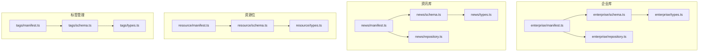
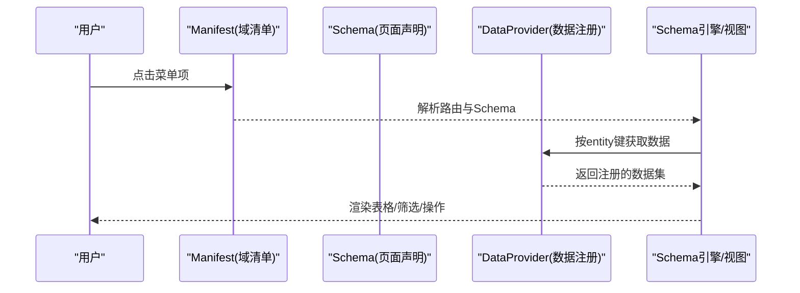
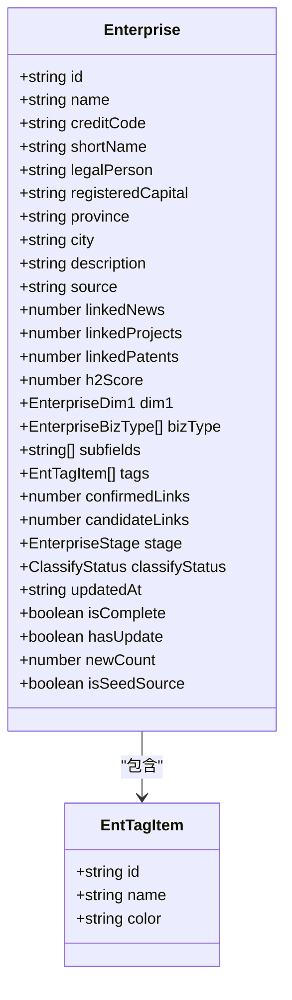
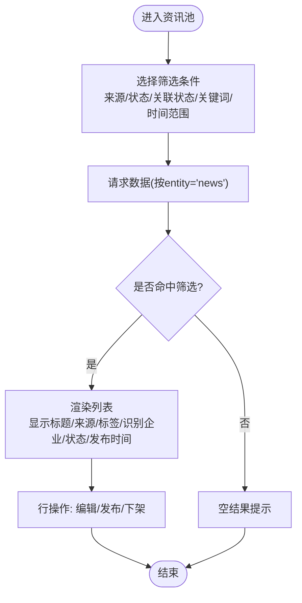
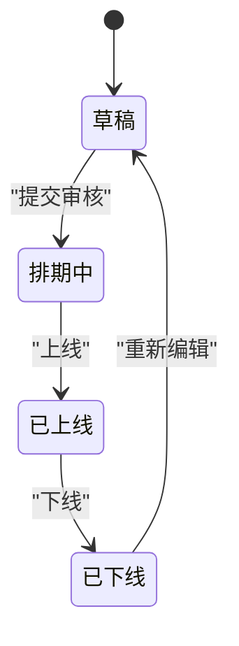
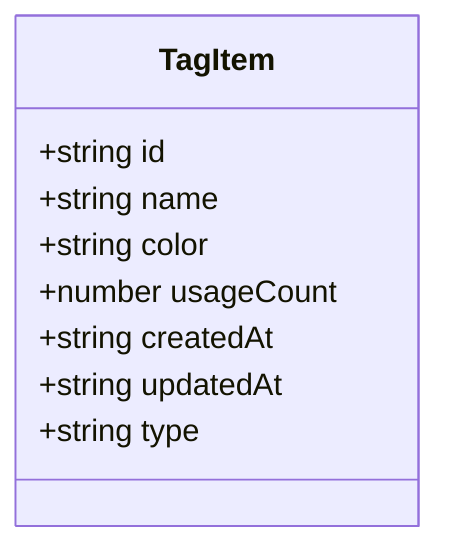
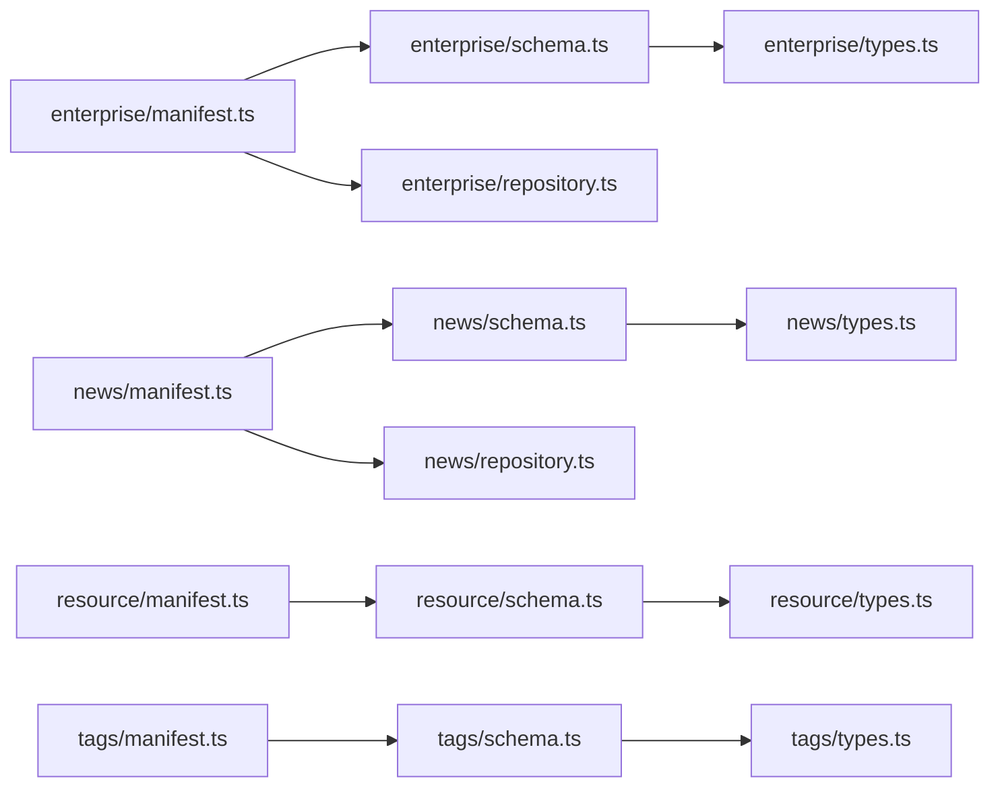

# 业务域API

<cite>
**本文引用的文件**   
- [enterprise/types.ts](file://hj-admin/src/domains/enterprise/types.ts)
- [enterprise/schema.ts](file://hj-admin/src/domains/enterprise/schema.ts)
- [enterprise/repository.ts](file://hj-admin/src/domains/enterprise/repository.ts)
- [enterprise/manifest.ts](file://hj-admin/src/domains/enterprise/manifest.ts)
- [news/types.ts](file://hj-admin/src/domains/news/types.ts)
- [news/schema.ts](file://hj-admin/src/domains/news/schema.ts)
- [news/repository.ts](file://hj-admin/src/domains/news/repository.ts)
- [news/manifest.ts](file://hj-admin/src/domains/news/manifest.ts)
- [resource/types.ts](file://hj-admin/src/domains/resource/types.ts)
- [resource/schema.ts](file://hj-admin/src/domains/resource/schema.ts)
- [resource/manifest.ts](file://hj-admin/src/domains/resource/manifest.ts)
- [tags/types.ts](file://hj-admin/src/domains/tags/types.ts)
- [tags/schema.ts](file://hj-admin/src/domains/tags/schema.ts)
- [tags/manifest.ts](file://hj-admin/src/domains/tags/manifest.ts)
</cite>

## 目录
1. [简介](#简介)
2. [项目结构](#项目结构)
3. [核心组件](#核心组件)
4. [架构总览](#架构总览)
5. [详细组件分析](#详细组件分析)
6. [依赖分析](#依赖分析)
7. [性能考虑](#性能考虑)
8. [故障排查指南](#故障排查指南)
9. [结论](#结论)
10. [附录](#附录)

## 简介
本参考文档面向“企业库、资讯库、标签管理、资源管理”四大业务域，系统化梳理实体类型定义、字段含义与约束、查询参数与操作接口、计算属性与派生数据、领域事件与状态管理，以及跨域关联查询方法与数据模型。文档以声明式Schema驱动的前端页面为入口，结合各域的Repository注册机制与Manifest路由配置，形成从数据到界面的完整闭环。

## 项目结构
各业务域遵循统一组织方式：types（类型）、schema（页面Schema）、repository（数据源注册）、manifest（域清单与路由）。通过统一的Schema引擎渲染列表页、筛选器、列定义、行操作等；通过Repository将Mock数据注入全局DataProvider；通过Manifest声明菜单、分组、路由与页面标题。

图表来源
- [enterprise/manifest.ts:1-20](file://hj-admin/src/domains/enterprise/manifest.ts#L1-L20)
- [enterprise/schema.ts:1-64](file://hj-admin/src/domains/enterprise/schema.ts#L1-L64)
- [enterprise/types.ts:1-50](file://hj-admin/src/domains/enterprise/types.ts#L1-L50)
- [enterprise/repository.ts:1-6](file://hj-admin/src/domains/enterprise/repository.ts#L1-L6)
- [news/manifest.ts:1-42](file://hj-admin/src/domains/news/manifest.ts#L1-L42)
- [news/schema.ts:1-123](file://hj-admin/src/domains/news/schema.ts#L1-L123)
- [news/types.ts:1-50](file://hj-admin/src/domains/news/types.ts#L1-L50)
- [news/repository.ts:1-11](file://hj-admin/src/domains/news/repository.ts#L1-L11)
- [resource/manifest.ts:1-22](file://hj-admin/src/domains/resource/manifest.ts#L1-L22)
- [resource/schema.ts:1-51](file://hj-admin/src/domains/resource/schema.ts#L1-L51)
- [resource/types.ts:1-31](file://hj-admin/src/domains/resource/types.ts#L1-L31)
- [tags/manifest.ts:1-21](file://hj-admin/src/domains/tags/manifest.ts#L1-L21)
- [tags/schema.ts:1-39](file://hj-admin/src/domains/tags/schema.ts#L1-L39)
- [tags/types.ts:1-10](file://hj-admin/src/domains/tags/types.ts#L1-L10)

章节来源
- [enterprise/manifest.ts:1-20](file://hj-admin/src/domains/enterprise/manifest.ts#L1-L20)
- [news/manifest.ts:1-42](file://hj-admin/src/domains/news/manifest.ts#L1-L42)
- [resource/manifest.ts:1-22](file://hj-admin/src/domains/resource/manifest.ts#L1-L22)
- [tags/manifest.ts:1-21](file://hj-admin/src/domains/tags/manifest.ts#L1-L21)

## 核心组件
- 企业库
  - 实体：Enterprise，包含基础信息、来源、关联计数、氢能评分、分类维度、阶段与状态、更新时间、完整性标记等。
  - 页面：待处理池、已确认企业，提供筛选、分页、行操作与Tab切换。
- 资讯库
  - 实体：NewsItem、DataSource，涵盖标题、来源、标签、NER识别、已关联实体、状态、发布时间、采集源信息等。
  - 页面：资讯池、已发布资讯、数据源管理，支持多条件筛选、快速筛选、行操作与Tab。
- 资源位
  - 实体：Banner、IconItem、Promotion，覆盖轮播、快捷入口、推广活动的位置、排期、排序与跳转目标。
  - 页面：Banner管理、Icon管理、推广活动管理，提供状态筛选与行操作。
- 标签管理
  - 实体：TagItem，用于资讯与企业两类标签的元数据与使用统计。
  - 页面：资讯标签、企业标签，支持搜索、编辑、删除与新增。

章节来源
- [enterprise/types.ts:1-50](file://hj-admin/src/domains/enterprise/types.ts#L1-L50)
- [enterprise/schema.ts:1-64](file://hj-admin/src/domains/enterprise/schema.ts#L1-L64)
- [news/types.ts:1-50](file://hj-admin/src/domains/news/types.ts#L1-L50)
- [news/schema.ts:1-123](file://hj-admin/src/domains/news/schema.ts#L1-L123)
- [resource/types.ts:1-31](file://hj-admin/src/domains/resource/types.ts#L1-L31)
- [resource/schema.ts:1-51](file://hj-admin/src/domains/resource/schema.ts#L1-L51)
- [tags/types.ts:1-10](file://hj-admin/src/domains/tags/types.ts#L1-L10)
- [tags/schema.ts:1-39](file://hj-admin/src/domains/tags/schema.ts#L1-L39)

## 架构总览
系统采用“域清单 + Schema + Repository”的解耦模式：
- Manifest声明域名称、菜单分组、图标、顺序、可折叠与路由映射。
- Schema描述页面行为：筛选器、列、分页、行操作、Tab与快速筛选。
- Repository负责向全局DataProvider注册对应实体的Mock数据集合。
- 页面由Schema引擎根据Schema渲染，读取DataProvider中的数据并展示。

图表来源
- [enterprise/manifest.ts:1-20](file://hj-admin/src/domains/enterprise/manifest.ts#L1-L20)
- [enterprise/schema.ts:1-64](file://hj-admin/src/domains/enterprise/schema.ts#L1-L64)
- [enterprise/repository.ts:1-6](file://hj-admin/src/domains/enterprise/repository.ts#L1-L6)
- [news/manifest.ts:1-42](file://hj-admin/src/domains/news/manifest.ts#L1-L42)
- [news/schema.ts:1-123](file://hj-admin/src/domains/news/schema.ts#L1-L123)
- [news/repository.ts:1-11](file://hj-admin/src/domains/news/repository.ts#L1-L11)
- [resource/manifest.ts:1-22](file://hj-admin/src/domains/resource/manifest.ts#L1-L22)
- [resource/schema.ts:1-51](file://hj-admin/src/domains/resource/schema.ts#L1-L51)
- [tags/manifest.ts:1-21](file://hj-admin/src/domains/tags/manifest.ts#L1-L21)
- [tags/schema.ts:1-39](file://hj-admin/src/domains/tags/schema.ts#L1-L39)

## 详细组件分析

### 企业库（Enterprise）
- 实体与字段
  - 标识与基础信息：id、name、creditCode、shortName、legalPerson、registeredCapital、province、city、description、source。
  - 关联与评分：linkedNews、linkedProjects、linkedPatents、h2Score。
  - 分类维度：dim1（企业性质）、bizType（企业类型，多选）、subfields（子领域）。
  - 标签：tags（含id、name、color）。
  - 关联进度：confirmedLinks、candidateLinks。
  - 阶段与状态：stage（need-link/no-signal/need-classify）、classifyStatus（待分类/已分类/待确认）。
  - 时间戳与完整性：updatedAt、isComplete。
  - 可选扩展：hasUpdate、newCount、isSeedSource。
- 页面与查询
  - 待处理池：支持企业名称关键词筛选；列含来源、关联进度、分类状态、更新时间；行操作“去处理”。
  - 已确认企业：支持企业性质、企业类型、名称关键词筛选；列含关联资讯/项目数、氢能关联度、企业性质、状态、更新时间；行操作“去分类/查看”；Tab“待分类/已分类”。
- 计算属性与派生数据
  - h2Score：氢能关联度（百分比展示）。
  - 关联进度：confirmedLinks/candidateLinks用于可视化进度。
  - 分类状态：classifyStatus驱动不同颜色与可见性逻辑。
- 状态与事件
  - 状态机：stage与classifyStatus共同决定工作流（待关联→无信号待确认→待分类→已分类）。
  - 典型事件：分类完成、关联确认、更新同步。
- 跨域关联
  - 与资讯、项目、专利的关联计数字段体现跨域关系。
- 示例路径
  - 类型定义：[enterprise/types.ts:1-50](file://hj-admin/src/domains/enterprise/types.ts#L1-L50)
  - 页面Schema：[enterprise/schema.ts:1-64](file://hj-admin/src/domains/enterprise/schema.ts#L1-L64)
  - 数据注册：[enterprise/repository.ts:1-6](file://hj-admin/src/domains/enterprise/repository.ts#L1-L6)
  - 域清单：[enterprise/manifest.ts:1-20](file://hj-admin/src/domains/enterprise/manifest.ts#L1-L20)

图表来源
- [enterprise/types.ts:1-50](file://hj-admin/src/domains/enterprise/types.ts#L1-L50)

章节来源
- [enterprise/types.ts:1-50](file://hj-admin/src/domains/enterprise/types.ts#L1-L50)
- [enterprise/schema.ts:1-64](file://hj-admin/src/domains/enterprise/schema.ts#L1-L64)
- [enterprise/repository.ts:1-6](file://hj-admin/src/domains/enterprise/repository.ts#L1-L6)
- [enterprise/manifest.ts:1-20](file://hj-admin/src/domains/enterprise/manifest.ts#L1-L20)

### 资讯库（News）
- 实体与字段
  - NewsItem：id、title、source、tags、autoTags、nerEntities（ent/prj/pol/std/pat计数）、linkedEntities（同上）、status（草稿/已发布/已下架/已归档）、publishTime、province。
  - DataSource：id、name、type（爬虫采集/API接入/RSS订阅）、domain、status（运行中/异常/已停用）、lastCrawl、successRate、articleCount。
- 页面与查询
  - 资讯池：支持来源、状态、关联状态、关键词、发布时间范围筛选；列含标题、来源、自动标签、识别企业数量、状态、发布时间；行操作“编辑/发布/下架”。
  - 已发布资讯：支持来源、关键词筛选；快速筛选“全部/已关联/待补关联”；列含标题、来源、标签、关联企业数、状态、发布时间；行操作“编辑”；Tab“全部/已关联/待补关联”。
  - 数据源管理：支持类型、状态、名称搜索；列含名称、类型、域名、状态、最近采集、成功率、文章数；行操作“启用/停用”。
- 计算属性与派生数据
  - 关联状态：基于nerEntities与linkedEntities对比得出“未关联/部分关联/已完整关联”。
  - 成功率：successRate用于数据源健康度评估。
- 状态与事件
  - 资讯生命周期：草稿→已发布→已下架/已归档。
  - 数据源状态：运行中/异常/已停用，支持启停控制。
- 跨域关联
  - nerEntities与linkedEntities对“企业/项目/政策/标准/专利”进行计数，体现跨域实体识别与关联。
- 示例路径
  - 类型定义：[news/types.ts:1-50](file://hj-admin/src/domains/news/types.ts#L1-L50)
  - 页面Schema：[news/schema.ts:1-123](file://hj-admin/src/domains/news/schema.ts#L1-L123)
  - 数据注册：[news/repository.ts:1-11](file://hj-admin/src/domains/news/repository.ts#L1-L11)
  - 域清单：[news/manifest.ts:1-42](file://hj-admin/src/domains/news/manifest.ts#L1-L42)

图表来源
- [news/schema.ts:1-123](file://hj-admin/src/domains/news/schema.ts#L1-L123)

章节来源
- [news/types.ts:1-50](file://hj-admin/src/domains/news/types.ts#L1-L50)
- [news/schema.ts:1-123](file://hj-admin/src/domains/news/schema.ts#L1-L123)
- [news/repository.ts:1-11](file://hj-admin/src/domains/news/repository.ts#L1-L11)
- [news/manifest.ts:1-42](file://hj-admin/src/domains/news/manifest.ts#L1-L42)

### 资源位（Resource）
- 实体与字段
  - Banner：id、name、frameCount、status（已上线/排期中/已下线/草稿）、schedule、sort、jumpTarget。
  - IconItem：id、name、emoji、color、jumpTarget、status（enabled/disabled）。
  - Promotion：id、name、date、location、status（已上线/排期中/已下线/草稿）、positions、jumpTarget。
- 页面与查询
  - Banner管理：支持状态筛选；列含名称、帧数、状态、排期、排序、跳转目标；行操作“编辑”。
  - Icon管理：支持状态筛选；列含图标、名称、跳转目标、状态；行操作“编辑/启用/停用”。
  - 推广活动管理：支持状态筛选；列含活动标题、日期、地点、展示位置、状态；行操作“编辑”。
- 计算属性与派生数据
  - 排序：sort影响展示顺序。
  - 位置：positions数组表示多个展示位。
- 状态与事件
  - 资源位生命周期：草稿→排期中→已上线→已下线。
- 示例路径
  - 类型定义：[resource/types.ts:1-31](file://hj-admin/src/domains/resource/types.ts#L1-L31)
  - 页面Schema：[resource/schema.ts:1-51](file://hj-admin/src/domains/resource/schema.ts#L1-L51)
  - 域清单：[resource/manifest.ts:1-22](file://hj-admin/src/domains/resource/manifest.ts#L1-L22)

图表来源
- [resource/schema.ts:1-51](file://hj-admin/src/domains/resource/schema.ts#L1-L51)

章节来源
- [resource/types.ts:1-31](file://hj-admin/src/domains/resource/types.ts#L1-L31)
- [resource/schema.ts:1-51](file://hj-admin/src/domains/resource/schema.ts#L1-L51)
- [resource/manifest.ts:1-22](file://hj-admin/src/domains/resource/manifest.ts#L1-L22)

### 标签管理（Tags）
- 实体与字段
  - TagItem：id、name、color、usageCount、createdAt、updatedAt、type（news/enterprise）。
- 页面与查询
  - 资讯标签：支持名称搜索；列含名称、颜色、使用次数、创建/更新时间；行操作“编辑/删除”，工具栏“新增标签”。
  - 企业标签：支持名称搜索；列含名称、颜色、使用次数、创建/更新时间；行操作“编辑/删除”，工具栏“新增标签”。
- 计算属性与派生数据
  - usageCount：标签被使用的次数，反映热度。
- 状态与事件
  - 标签生命周期：新增→编辑→删除（删除后关联实体移除该标签）。
- 示例路径
  - 类型定义：[tags/types.ts:1-10](file://hj-admin/src/domains/tags/types.ts#L1-L10)
  - 页面Schema：[tags/schema.ts:1-39](file://hj-admin/src/domains/tags/schema.ts#L1-L39)
  - 域清单：[tags/manifest.ts:1-21](file://hj-admin/src/domains/tags/manifest.ts#L1-L21)

图表来源
- [tags/types.ts:1-10](file://hj-admin/src/domains/tags/types.ts#L1-L10)

章节来源
- [tags/types.ts:1-10](file://hj-admin/src/domains/tags/types.ts#L1-L10)
- [tags/schema.ts:1-39](file://hj-admin/src/domains/tags/schema.ts#L1-L39)
- [tags/manifest.ts:1-21](file://hj-admin/src/domains/tags/manifest.ts#L1-L21)

## 依赖分析
- 模块耦合
  - Manifest依赖Schema与Repository（或直接在Manifest内注册Mock），并通过路由将Schema与页面组件绑定。
  - Schema依赖Types定义，确保列与筛选器的字段一致性。
  - Repository通过registerMockData将数据集注册到DataProvider，供Schema引擎消费。
- 外部依赖
  - 统一类型PageSchema、DomainManifest来自共享的Schema引擎类型定义。
- 潜在循环
  - 当前结构为单向依赖（Manifest→Schema→Types；Manifest→Repository），未发现循环依赖。

图表来源
- [enterprise/manifest.ts:1-20](file://hj-admin/src/domains/enterprise/manifest.ts#L1-L20)
- [enterprise/schema.ts:1-64](file://hj-admin/src/domains/enterprise/schema.ts#L1-L64)
- [enterprise/types.ts:1-50](file://hj-admin/src/domains/enterprise/types.ts#L1-L50)
- [enterprise/repository.ts:1-6](file://hj-admin/src/domains/enterprise/repository.ts#L1-L6)
- [news/manifest.ts:1-42](file://hj-admin/src/domains/news/manifest.ts#L1-L42)
- [news/schema.ts:1-123](file://hj-admin/src/domains/news/schema.ts#L1-L123)
- [news/types.ts:1-50](file://hj-admin/src/domains/news/types.ts#L1-L50)
- [news/repository.ts:1-11](file://hj-admin/src/domains/news/repository.ts#L1-L11)
- [resource/manifest.ts:1-22](file://hj-admin/src/domains/resource/manifest.ts#L1-L22)
- [resource/schema.ts:1-51](file://hj-admin/src/domains/resource/schema.ts#L1-L51)
- [resource/types.ts:1-31](file://hj-admin/src/domains/resource/types.ts#L1-L31)
- [tags/manifest.ts:1-21](file://hj-admin/src/domains/tags/manifest.ts#L1-L21)
- [tags/schema.ts:1-39](file://hj-admin/src/domains/tags/schema.ts#L1-L39)
- [tags/types.ts:1-10](file://hj-admin/src/domains/tags/types.ts#L1-L10)

章节来源
- [enterprise/manifest.ts:1-20](file://hj-admin/src/domains/enterprise/manifest.ts#L1-L20)
- [news/manifest.ts:1-42](file://hj-admin/src/domains/news/manifest.ts#L1-L42)
- [resource/manifest.ts:1-22](file://hj-admin/src/domains/resource/manifest.ts#L1-L22)
- [tags/manifest.ts:1-21](file://hj-admin/src/domains/tags/manifest.ts#L1-L21)

## 性能考虑
- 列表分页：所有页面均配置pageSize=20与showTotal，建议后端配合分页与索引优化。
- 筛选器：多条件筛选建议在服务端实现，避免前端全量过滤导致卡顿。
- 渲染优化：列render如link、percent、tag-list等应复用组件，减少重复渲染。
- 数据源监控：数据源的successRate与lastCrawl可用于告警与限流策略。

## 故障排查指南
- 数据未加载
  - 检查对应域的repository是否正确调用registerMockData，且entity键与Schema一致。
  - 确认Manifest已import repository触发注册。
- 筛选无效
  - 核对filters中的name与实体字段一致；若为复合筛选（如日期范围），需确认后端或本地数据处理逻辑。
- 行操作不生效
  - 检查rowActions的visible条件是否与实体状态匹配；确认navigateTo路径与路由一致。
- 状态颜色不一致
  - 核对renderProps.colorMap与实体状态枚举值是否完全匹配。

章节来源
- [enterprise/repository.ts:1-6](file://hj-admin/src/domains/enterprise/repository.ts#L1-L6)
- [news/repository.ts:1-11](file://hj-admin/src/domains/news/repository.ts#L1-L11)
- [resource/manifest.ts:1-22](file://hj-admin/src/domains/resource/manifest.ts#L1-L22)
- [tags/manifest.ts:1-21](file://hj-admin/src/domains/tags/manifest.ts#L1-L21)

## 结论
本参考文档围绕四大业务域，系统性梳理了实体类型、页面Schema、数据注册与路由清单，明确了字段含义、验证规则、业务约束、计算属性与状态流转，并提供了跨域关联查询的思路与数据模型。通过声明式Schema与统一数据注册机制，系统具备良好的可扩展性与可维护性，便于后续对接真实后端与增强交互能力。

## 附录
- 跨域关联查询方法
  - 资讯→企业：通过NewsItem.linkedEntities.ent与Enterprise.id建立关联，可在资讯详情页展示关联企业列表。
  - 企业→资讯：通过Enterprise.linkedNews与NewsItem.source/sourceId建立反向关联，在企业详情展示相关资讯。
  - 标签→实体：通过TagItem.type区分资讯与企业，在实体列表中按标签聚合展示。
- 领域事件建议
  - 资讯发布/下架：触发通知与缓存失效。
  - 企业分类完成：更新h2Score与分类状态，刷新相关报表。
  - 资源位上线/下线：触发前端资源位刷新与埋点上报。