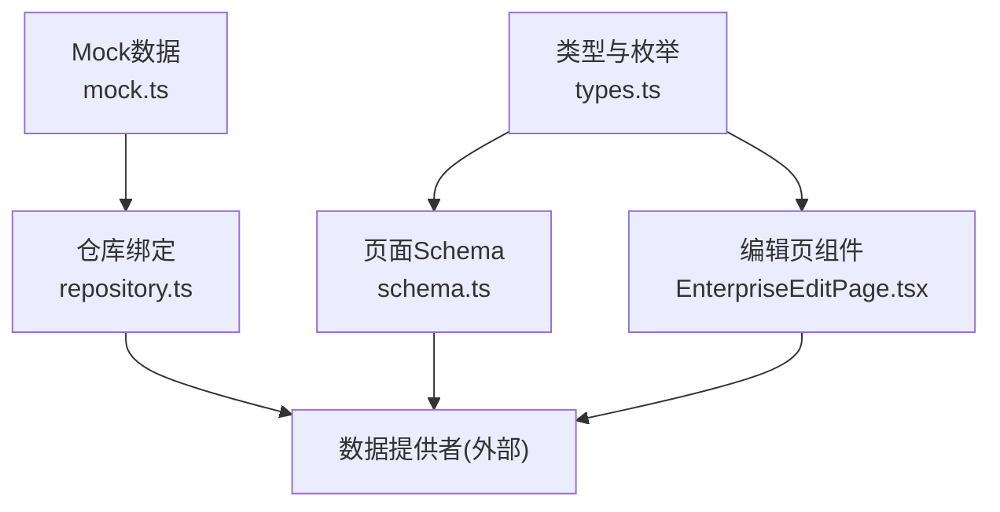
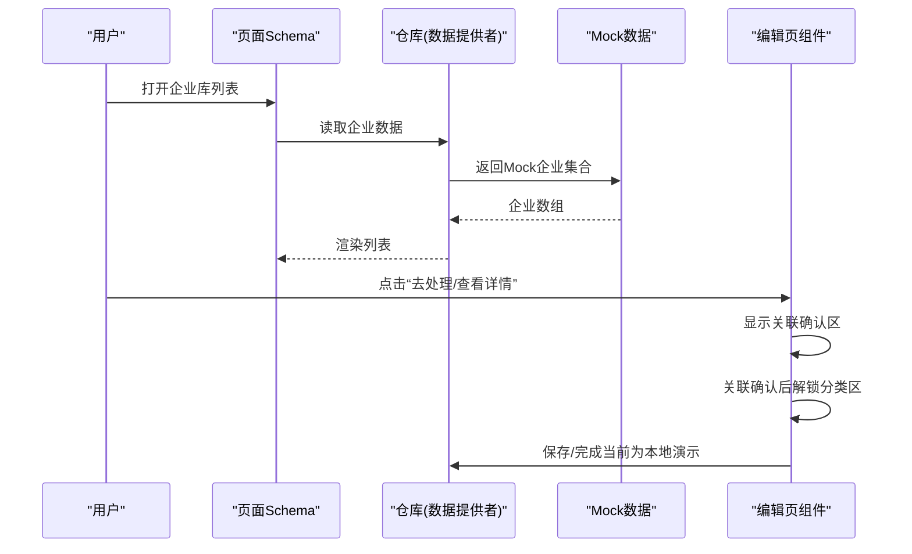
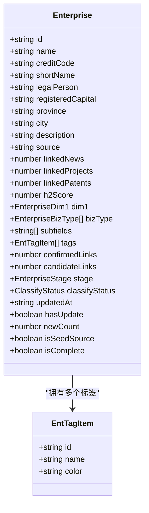
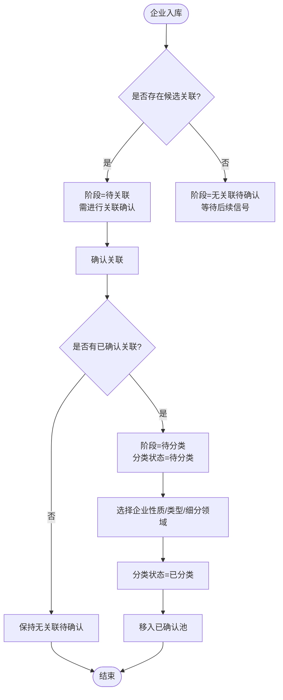
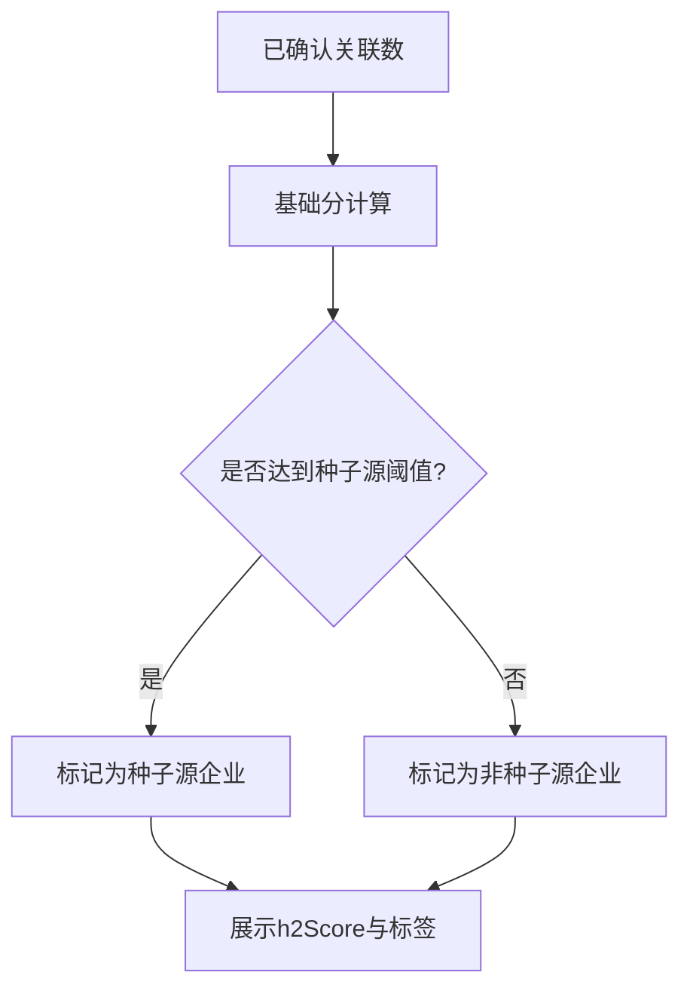
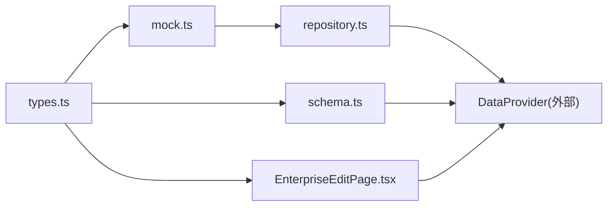

# 企业库API

<cite>
**本文引用的文件**
- [types.ts](file://hj-admin/src/domains/enterprise/types.ts)
- [schema.ts](file://hj-admin/src/domains/enterprise/schema.ts)
- [repository.ts](file://hj-admin/src/domains/enterprise/repository.ts)
- [mock.ts](file://hj-admin/src/domains/enterprise/mock.ts)
- [EnterpriseEditPage.tsx](file://hj-admin/src/domains/enterprise/pages/EnterpriseEditPage.tsx)
</cite>

## 目录
1. [简介](#简介)
2. [项目结构](#项目结构)
3. [核心组件](#核心组件)
4. [架构总览](#架构总览)
5. [详细组件分析](#详细组件分析)
6. [依赖关系分析](#依赖关系分析)
7. [性能与扩展性](#性能与扩展性)
8. [故障排查指南](#故障排查指南)
9. [结论](#结论)
10. [附录：字段与枚举定义](#附录字段与枚举定义)

## 简介
本文件为企业库API的详细文档，聚焦于Enterprise实体的完整字段定义、分类体系与业务类型枚举、标签系统EntTagItem结构、阶段流转与分类状态管理、以及关联度分析与派生数据接口。文档面向产品与研发人员，既提供高层概览，也给出代码级映射与可视化图示，便于快速理解与落地实施。

## 项目结构
企业域位于前端应用的企业子域中，采用“领域模型 + Schema + Repository + Mock”的组织方式：
- 类型与枚举：在类型文件中集中定义实体、枚举与常量
- 页面Schema：以声明式配置描述列表页的筛选、列、分页、操作等
- 仓库绑定：将Mock数据注册到数据提供者，供页面消费
- Mock数据：提供示例企业与标签，用于开发与演示
- 编辑页：实现渐进式处理流程（先关联确认，后分类）

图表来源
- [types.ts:1-50](file://hj-admin/src/domains/enterprise/types.ts#L1-L50)
- [schema.ts:1-64](file://hj-admin/src/domains/enterprise/schema.ts#L1-L64)
- [repository.ts:1-6](file://hj-admin/src/domains/enterprise/repository.ts#L1-L6)
- [mock.ts:1-24](file://hj-admin/src/domains/enterprise/mock.ts#L1-L24)
- [EnterpriseEditPage.tsx:1-117](file://hj-admin/src/domains/enterprise/pages/EnterpriseEditPage.tsx#L1-L117)

章节来源
- [types.ts:1-50](file://hj-admin/src/domains/enterprise/types.ts#L1-L50)
- [schema.ts:1-64](file://hj-admin/src/domains/enterprise/schema.ts#L1-L64)
- [repository.ts:1-6](file://hj-admin/src/domains/enterprise/repository.ts#L1-L6)
- [mock.ts:1-24](file://hj-admin/src/domains/enterprise/mock.ts#L1-L24)
- [EnterpriseEditPage.tsx:1-117](file://hj-admin/src/domains/enterprise/pages/EnterpriseEditPage.tsx#L1-L117)

## 核心组件
- Enterprise实体：承载企业基本信息、业务属性、关联统计、阶段与分类状态、完整性标记等
- EntTagItem：企业标签项，包含标识、名称与颜色
- 页面Schema：定义待处理池与已确认池的筛选、列、操作与Tab分组
- 仓库绑定：将Mock企业数据注册为可查询的数据源
- 编辑页：实现“先关联确认，后分类”的渐进式工作流

章节来源
- [types.ts:1-50](file://hj-admin/src/domains/enterprise/types.ts#L1-L50)
- [schema.ts:1-64](file://hj-admin/src/domains/enterprise/schema.ts#L1-L64)
- [repository.ts:1-6](file://hj-admin/src/domains/enterprise/repository.ts#L1-L6)
- [EnterpriseEditPage.tsx:1-117](file://hj-admin/src/domains/enterprise/pages/EnterpriseEditPage.tsx#L1-L117)

## 架构总览
企业库API在前端侧通过Schema驱动列表展示与交互，通过Repository接入数据源（当前为Mock），编辑页实现分步处理逻辑。整体遵循“类型先行、Schema驱动、数据解耦”的前端工程化模式。

图表来源
- [schema.ts:1-64](file://hj-admin/src/domains/enterprise/schema.ts#L1-L64)
- [repository.ts:1-6](file://hj-admin/src/domains/enterprise/repository.ts#L1-L6)
- [mock.ts:1-24](file://hj-admin/src/domains/enterprise/mock.ts#L1-L24)
- [EnterpriseEditPage.tsx:1-117](file://hj-admin/src/domains/enterprise/pages/EnterpriseEditPage.tsx#L1-L117)

## 详细组件分析

### Enterprise实体与标签系统
- 基本信息：id、name、creditCode、shortName、legalPerson、registeredCapital、province、city、description、source
- 业务属性：dim1（企业性质）、bizType（企业类型，多选）、subfields（细分领域，多选）
- 关联统计：linkedNews、linkedProjects、linkedPatents、confirmedLinks、candidateLinks、h2Score
- 状态管理：stage（阶段）、classifyStatus（分类状态）、isComplete（是否完整）、hasUpdate、newCount、isSeedSource、updatedAt
- 标签：tags（EntTagItem[]）

图表来源
- [types.ts:1-50](file://hj-admin/src/domains/enterprise/types.ts#L1-L50)

章节来源
- [types.ts:1-50](file://hj-admin/src/domains/enterprise/types.ts#L1-L50)

### 分类体系与业务类型枚举
- 企业性质（dim1）：氢能核心企业、氢能关联企业、非氢能企业
- 企业类型（bizType）：投资运营型、装备制造型、投资金融型、公共服务型
- 细分领域（subfields）：按bizType映射，例如投资运营型对应制氢企业、加氢站运营企业、综合能源服务商、应用运营商；装备制造型对应电解槽企业、燃料电池企业、压缩机企业、加氢机企业、储氢容器企业、其他装备企业；投资金融型对应产业投资基金、VC/PE机构、银行、证券公司、融资租赁公司；公共服务型对应检验检测机构、认证认可机构、设计咨询机构、工程建设机构、运维服务机构

使用场景
- 列表筛选：支持按企业性质与企业类型过滤
- 分类表单：单选企业性质，多选企业类型，多选细分领域（带系统推荐）
- 可视化呈现：不同性质与类型在列表中用徽章或标签展示

章节来源
- [types.ts:1-50](file://hj-admin/src/domains/enterprise/types.ts#L1-L50)
- [schema.ts:1-64](file://hj-admin/src/domains/enterprise/schema.ts#L1-L64)
- [EnterpriseEditPage.tsx:1-117](file://hj-admin/src/domains/enterprise/pages/EnterpriseEditPage.tsx#L1-117)

### 阶段与分类状态管理
- 阶段（stage）：need-link（待关联）、need-classify（关联已确认，待分类）、no-signal（无关联待确认）
- 分类状态（classifyStatus）：待分类、已分类、待确认

阶段流转逻辑
- 初始导入或新增企业进入待处理池，根据候选关联情况分为need-link或no-signal
- 当关联确认完成后，若存在已确认关联，则进入need-classify等待分类
- 分类完成后，classifyStatus更新为已分类，并移入已确认池

图表来源
- [schema.ts:1-64](file://hj-admin/src/domains/enterprise/schema.ts#L1-L64)
- [EnterpriseEditPage.tsx:1-117](file://hj-admin/src/domains/enterprise/pages/EnterpriseEditPage.tsx#L1-117)

章节来源
- [schema.ts:1-64](file://hj-admin/src/domains/enterprise/schema.ts#L1-L64)
- [EnterpriseEditPage.tsx:1-117](file://hj-admin/src/domains/enterprise/pages/EnterpriseEditPage.tsx#L1-117)

### 企业关联度分析与派生数据
- 关联度指标：h2Score（氢能关联度得分）
- 种子源判定：基于h2Score阈值（≥70视为种子源企业）
- 关联进度：confirmedLinks（已确认关联数）、candidateLinks（候选关联数）
- 关联明细：linkedNews（资讯）、linkedProjects（项目）、linkedPatents（专利）
- 派生展示：在编辑页与列表中实时计算并展示分数与种子源标签

图表来源
- [EnterpriseEditPage.tsx:1-117](file://hj-admin/src/domains/enterprise/pages/EnterpriseEditPage.tsx#L1-117)
- [mock.ts:1-24](file://hj-admin/src/domains/enterprise/mock.ts#L1-L24)

章节来源
- [EnterpriseEditPage.tsx:1-117](file://hj-admin/src/domains/enterprise/pages/EnterpriseEditPage.tsx#L1-117)
- [mock.ts:1-24](file://hj-admin/src/domains/enterprise/mock.ts#L1-L24)

### 企业标签系统EntTagItem
- 结构：id、name、color
- 用途：在企业详情与列表中作为可视化标签，辅助识别企业特征（如中国氢能联盟、专精特新、高新技术企业等）
- 数据来源：Mock中预置标签集合，企业对象通过tags字段引用

章节来源
- [types.ts:1-50](file://hj-admin/src/domains/enterprise/types.ts#L1-L50)
- [mock.ts:1-24](file://hj-admin/src/domains/enterprise/mock.ts#L1-L24)

### 列表与编辑页交互
- 待处理池：支持关键词搜索、按阶段Tab切换（待关联、无关联待确认）、显示关联进度与分类状态
- 已确认池：支持按企业性质、企业类型、名称搜索；展示关联资讯/项目数量、氢能关联度、性质与分类状态；提供“去分类/查看”操作
- 编辑页：分三步（基本信息、关联确认、企业分类），关联确认完成后解锁分类区；支持暂存与完成

章节来源
- [schema.ts:1-64](file://hj-admin/src/domains/enterprise/schema.ts#L1-L64)
- [EnterpriseEditPage.tsx:1-117](file://hj-admin/src/domains/enterprise/pages/EnterpriseEditPage.tsx#L1-117)

## 依赖关系分析
- types.ts为领域模型与枚举的唯一真相来源，被schema.ts、mock.ts、EnterpriseEditPage.tsx共同引用
- schema.ts依赖types.ts中的Enterprise类型，用于泛型约束与字段渲染
- repository.ts通过DataProvider注册Mock数据，使页面可通过统一数据接口获取企业集合
- mock.ts提供示例企业与标签，支撑开发调试与演示

图表来源
- [types.ts:1-50](file://hj-admin/src/domains/enterprise/types.ts#L1-L50)
- [schema.ts:1-64](file://hj-admin/src/domains/enterprise/schema.ts#L1-L64)
- [repository.ts:1-6](file://hj-admin/src/domains/enterprise/repository.ts#L1-L6)
- [mock.ts:1-24](file://hj-admin/src/domains/enterprise/mock.ts#L1-L24)
- [EnterpriseEditPage.tsx:1-117](file://hj-admin/src/domains/enterprise/pages/EnterpriseEditPage.tsx#L1-117)

章节来源
- [types.ts:1-50](file://hj-admin/src/domains/enterprise/types.ts#L1-L50)
- [schema.ts:1-64](file://hj-admin/src/domains/enterprise/schema.ts#L1-L64)
- [repository.ts:1-6](file://hj-admin/src/domains/enterprise/repository.ts#L1-L6)
- [mock.ts:1-24](file://hj-admin/src/domains/enterprise/mock.ts#L1-L24)
- [EnterpriseEditPage.tsx:1-117](file://hj-admin/src/domains/enterprise/pages/EnterpriseEditPage.tsx#L1-117)

## 性能与扩展性
- 列表渲染：通过Schema声明列与筛选，避免硬编码，提升维护性与扩展性
- 数据源解耦：Repository层屏蔽后端差异，便于从Mock平滑迁移至真实API
- 标签与枚举：集中管理，减少重复字符串与不一致风险
- 建议：
  - 对大数据量列表启用服务端分页与按需加载
  - 对h2Score等派生字段在后端计算并缓存，前端仅展示
  - 对分类状态与阶段变更引入幂等接口与审计日志

[本节为通用指导，不直接分析具体文件]

## 故障排查指南
- 列表无法显示：检查repository是否正确注册Mock数据，确认DataProvider可用
- 筛选无效：核对schema中filters与options是否与types.ts枚举一致
- 编辑页分类不可用：确认已确认关联数大于0，否则分类区将被锁定
- 标签未显示：检查企业tags是否为空，或Mock标签集合是否完整

章节来源
- [repository.ts:1-6](file://hj-admin/src/domains/enterprise/repository.ts#L1-L6)
- [schema.ts:1-64](file://hj-admin/src/domains/enterprise/schema.ts#L1-L64)
- [EnterpriseEditPage.tsx:1-117](file://hj-admin/src/domains/enterprise/pages/EnterpriseEditPage.tsx#L1-117)
- [mock.ts:1-24](file://hj-admin/src/domains/enterprise/mock.ts#L1-L24)

## 结论
企业库API围绕Enterprise实体构建，通过类型与枚举明确数据结构，借助Schema驱动列表与交互，配合Repository与Mock实现前后端解耦。阶段与分类状态管理清晰，关联度分析与派生数据在编辑页与列表中直观呈现。该设计具备良好的可扩展性与可维护性，适合逐步演进至生产环境。

[本节为总结，不直接分析具体文件]

## 附录：字段与枚举定义

- 企业性质（dim1）
  - 值：氢能核心企业、氢能关联企业、非氢能企业
  - 使用：列表筛选、分类表单单选、可视化徽章

- 企业类型（bizType）
  - 值：投资运营型、装备制造型、投资金融型、公共服务型
  - 使用：列表筛选、分类表单多选、细分领域映射

- 细分领域（subfields）
  - 值：依据bizType映射的多组细分领域
  - 使用：分类表单多选，系统推荐

- 阶段（stage）
  - 值：need-link、need-classify、no-signal
  - 使用：待处理池Tab分组与流程控制

- 分类状态（classifyStatus）
  - 值：待分类、已分类、待确认
  - 使用：已确认池Tab分组与操作可见性

- 关联度与派生
  - h2Score：氢能关联度得分
  - isSeedSource：是否种子源企业（由h2Score阈值判定）
  - confirmedLinks/candidateLinks：已确认/候选关联数
  - linkedNews/linkedProjects/linkedPatents：关联资讯/项目/专利数量

- 标签（EntTagItem）
  - 字段：id、name、color
  - 使用：企业详情与列表中的标签展示

章节来源
- [types.ts:1-50](file://hj-admin/src/domains/enterprise/types.ts#L1-L50)
- [schema.ts:1-64](file://hj-admin/src/domains/enterprise/schema.ts#L1-L64)
- [EnterpriseEditPage.tsx:1-117](file://hj-admin/src/domains/enterprise/pages/EnterpriseEditPage.tsx#L1-117)
- [mock.ts:1-24](file://hj-admin/src/domains/enterprise/mock.ts#L1-L24)