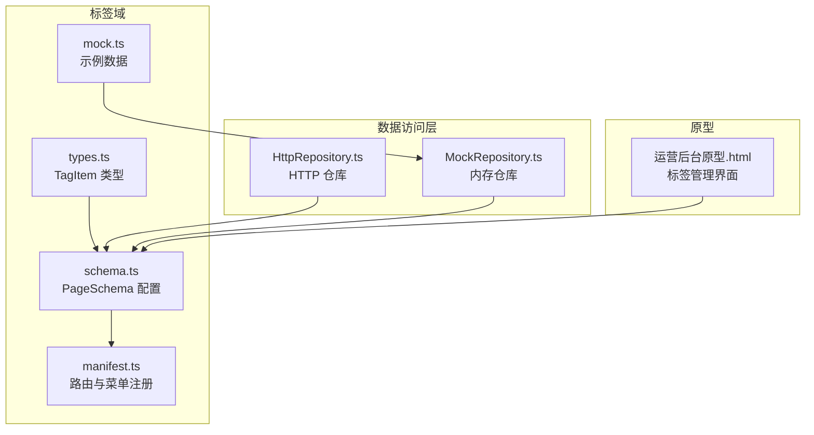
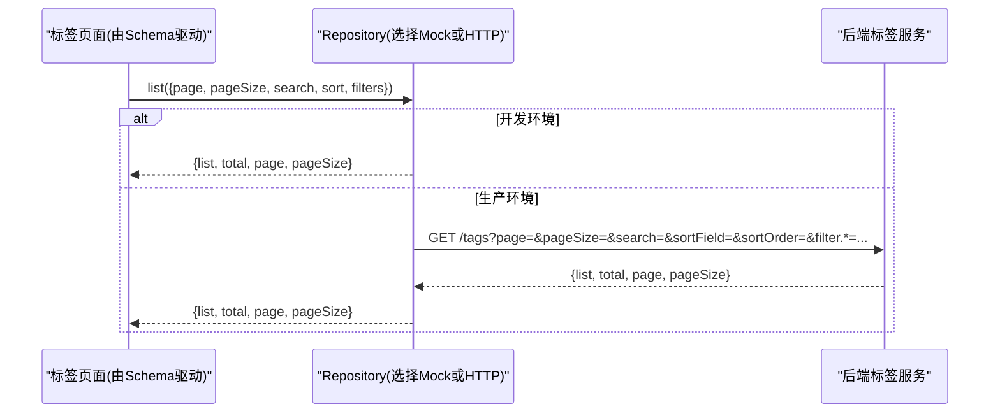
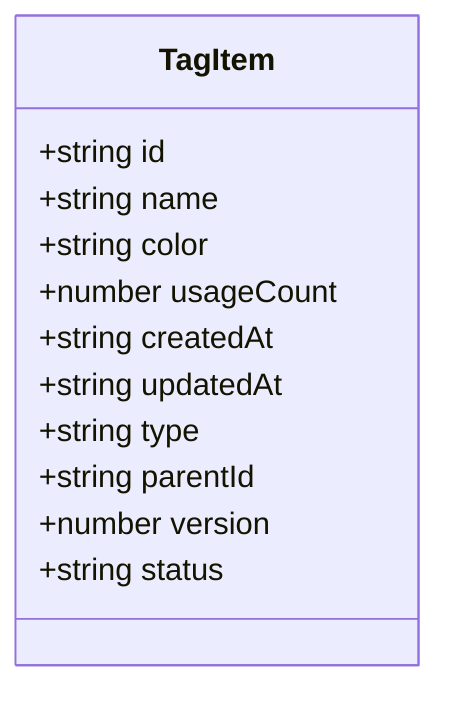
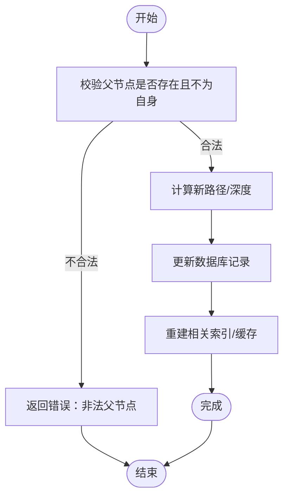
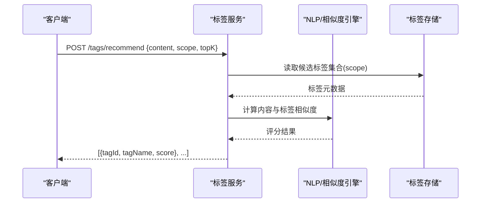
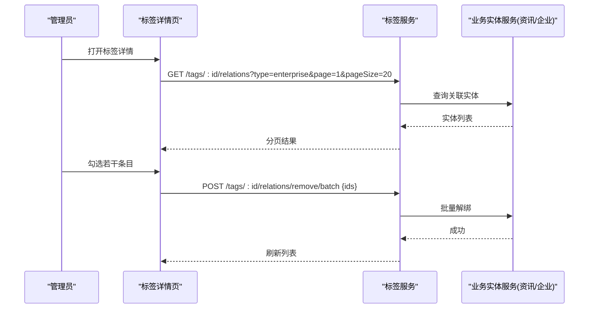
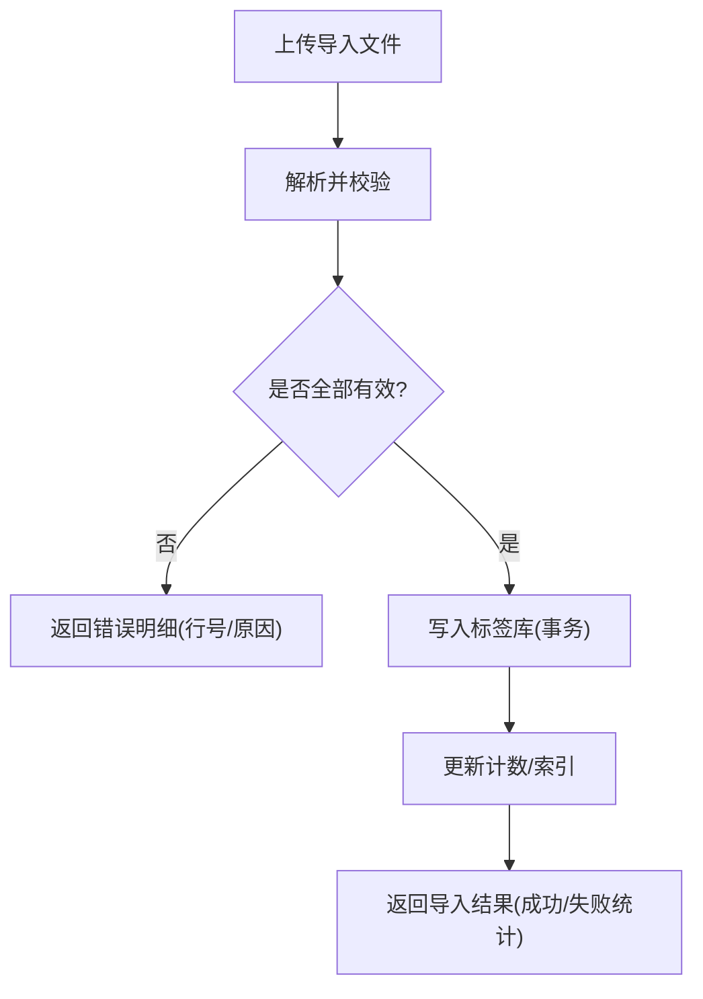
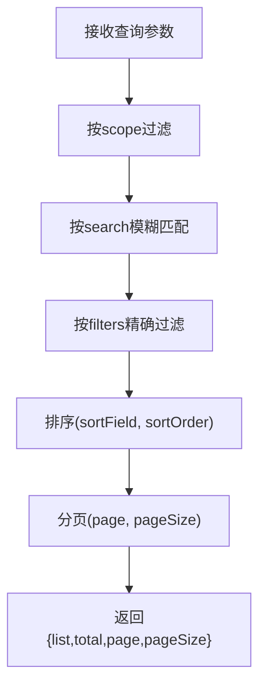
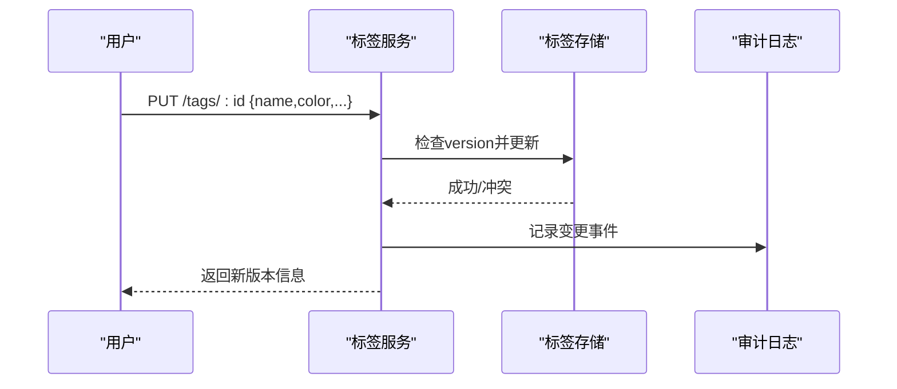
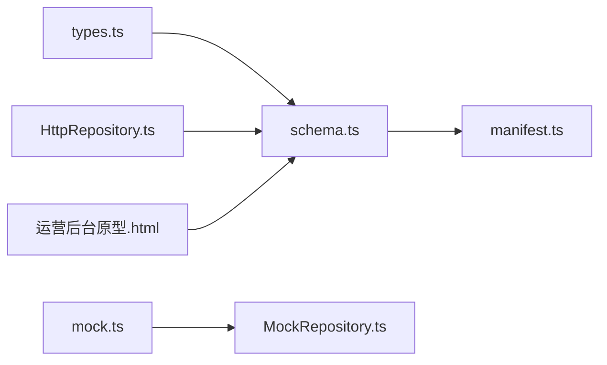

# 标签管理API

<cite>
**本文引用的文件**
- [types.ts](file://hj-admin/src/domains/tags/types.ts)
- [schema.ts](file://hj-admin/src/domains/tags/schema.ts)
- [manifest.ts](file://hj-admin/src/domains/tags/manifest.ts)
- [mock.ts](file://hj-admin/src/domains/tags/mock.ts)
- [HttpRepository.ts](file://hj-admin/src/shared/data/HttpRepository.ts)
- [MockRepository.ts](file://hj-admin/src/shared/data/MockRepository.ts)
- [运营后台原型.html](file://氢界大数据平台 — 运营管理后台 v3.2.html)
</cite>

## 目录
1. [简介](#简介)
2. [项目结构](#项目结构)
3. [核心组件](#核心组件)
4. [架构总览](#架构总览)
5. [详细组件分析](#详细组件分析)
6. [依赖关系分析](#依赖关系分析)
7. [性能考虑](#性能考虑)
8. [故障排查指南](#故障排查指南)
9. [结论](#结论)
10. [附录](#附录)

## 简介
本文件面向“标签管理”能力，提供与前端域模型、页面Schema、仓库实现以及运营后台原型中可见的交互行为相对应的API设计说明。内容覆盖：
- Tag实体结构与字段语义
- 树形结构与父子关系（概念性设计）
- 智能推荐接口（基于内容相似度）
- 与企业、资讯等实体的关联管理
- 批量操作、导入导出、统计分析
- 搜索、分类浏览、热度排序查询
- 版本管理与历史追溯

说明：当前代码库为前端工程与原型，后端API尚未落地。本文以现有类型定义、Schema配置、HTTP/Mock仓库实现及原型界面为依据，给出可落地的API契约建议与前后端协作约定。

## 项目结构
标签域位于 hj-admin/src/domains/tags，包含类型定义、页面Schema、领域清单与Mock数据；通用数据访问层在 shared/data 下提供 HTTP 与 Mock 两种仓库实现。运营后台原型展示了标签列表、编辑弹窗、批量移除与导出等操作入口。

图示来源
- [types.ts:1-10](file://hj-admin/src/domains/tags/types.ts#L1-L10)
- [schema.ts:1-39](file://hj-admin/src/domains/tags/schema.ts#L1-L39)
- [manifest.ts:1-21](file://hj-admin/src/domains/tags/manifest.ts#L1-L21)
- [mock.ts:1-20](file://hj-admin/src/domains/tags/mock.ts#L1-L20)
- [HttpRepository.ts:1-70](file://hj-admin/src/shared/data/HttpRepository.ts#L1-L70)
- [MockRepository.ts:1-101](file://hj-admin/src/shared/data/MockRepository.ts#L1-L101)
- [运营后台原型.html](file://氢界大数据平台 — 运营管理后台 v3.2.html)

章节来源
- [types.ts:1-10](file://hj-admin/src/domains/tags/types.ts#L1-L10)
- [schema.ts:1-39](file://hj-admin/src/domains/tags/schema.ts#L1-L39)
- [manifest.ts:1-21](file://hj-admin/src/domains/tags/manifest.ts#L1-L21)
- [mock.ts:1-20](file://hj-admin/src/domains/tags/mock.ts#L1-L20)
- [HttpRepository.ts:1-70](file://hj-admin/src/shared/data/HttpRepository.ts#L1-L70)
- [MockRepository.ts:1-101](file://hj-admin/src/shared/data/MockRepository.ts#L1-L101)
- [运营后台原型.html](file://氢界大数据平台 — 运营管理后台 v3.2.html)

## 核心组件
- TagItem 实体
  - id: 唯一标识
  - name: 标签名称
  - color: 展示颜色
  - usageCount: 使用次数（热度指标）
  - createdAt / updatedAt: 时间戳
  - type: 标签类别（news | enterprise）
- PageSchema 配置
  - 支持关键词过滤、分页、列渲染、行操作（新增/编辑/删除）、工具栏动作
- 领域清单 manifest
  - 注册“资讯标签”“企业标签”两个子页面路由
- 仓库实现
  - HttpRepository：标准CRUD + 分页/排序/筛选参数映射
  - MockRepository：内存模拟，支持搜索、筛选、排序、分页

章节来源
- [types.ts:1-10](file://hj-admin/src/domains/tags/types.ts#L1-L10)
- [schema.ts:1-39](file://hj-admin/src/domains/tags/schema.ts#L1-L39)
- [manifest.ts:1-21](file://hj-admin/src/domains/tags/manifest.ts#L1-L21)
- [HttpRepository.ts:1-70](file://hj-admin/src/shared/data/HttpRepository.ts#L1-L70)
- [MockRepository.ts:1-101](file://hj-admin/src/shared/data/MockRepository.ts#L1-L101)

## 架构总览
前端通过 Schema 驱动页面，调用 Repository 进行数据访问。开发期使用 MockRepository，上线后替换为 HttpRepository 对接后端。

图示来源
- [schema.ts:1-39](file://hj-admin/src/domains/tags/schema.ts#L1-L39)
- [HttpRepository.ts:1-70](file://hj-admin/src/shared/data/HttpRepository.ts#L1-L70)
- [MockRepository.ts:1-101](file://hj-admin/src/shared/data/MockRepository.ts#L1-L101)

## 详细组件分析

### 实体与数据结构
- TagItem 字段说明
  - id: 字符串主键
  - name: 非空，用于检索与展示
  - color: 十六进制色值，用于可视化
  - usageCount: 数值型，作为热度统计基础
  - createdAt / updatedAt: ISO 日期字符串
  - type: 枚举 'news' | 'enterprise'，区分业务域
- 扩展字段建议（用于树形与版本）
  - parentId: 父标签ID（可选），用于构建层级
  - version: 版本号（整数或时间戳），用于变更追踪
  - status: 状态（active/inactive），用于软删除与归档

图示来源
- [types.ts:1-10](file://hj-admin/src/domains/tags/types.ts#L1-L10)

章节来源
- [types.ts:1-10](file://hj-admin/src/domains/tags/types.ts#L1-L10)

### 树形结构与父子关系管理
- 设计要点
  - 每个标签可拥有至多一个父标签，形成有根树
  - 禁止循环引用，插入前校验祖先链
  - 移动节点时级联更新路径或缓存深度
- 建议接口
  - 获取树：GET /tags/tree?scope={news|enterprise}
  - 创建节点：POST /tags {name, color, parentId?, type}
  - 更新节点：PUT /tags/:id {name?, color?, parentId?}
  - 删除节点：DELETE /tags/:id（若存在子节点需提示或级联处理）
  - 移动节点：PATCH /tags/:id/move {parentId}
- 复杂度与一致性
  - 树遍历 O(n)，移动操作需校验环路与深度限制
  - 建议在事务内完成父子关系更新与索引重建

图示来源
- [schema.ts:1-39](file://hj-admin/src/domains/tags/schema.ts#L1-L39)

章节来源
- [schema.ts:1-39](file://hj-admin/src/domains/tags/schema.ts#L1-L39)

### 智能推荐算法接口
- 目标：根据输入内容（标题/正文/摘要）自动推荐相关标签
- 输入输出
  - 请求体：{content: string, scope?: 'news'|'enterprise', topK?: number}
  - 响应：[{tagId, tagName, score}, ...]
- 算法建议
  - 文本向量化（TF-IDF/BM25/Embedding）+ 标签向量匹配
  - 结合 usageCount 做热度加权
  - 阈值过滤与去重
- 接口建议
  - POST /tags/recommend {content, scope, topK}
  - 可选：POST /tags/recommend/batch [{content, scope, topK}]

图示来源
- [schema.ts:1-39](file://hj-admin/src/domains/tags/schema.ts#L1-L39)

章节来源
- [schema.ts:1-39](file://hj-admin/src/domains/tags/schema.ts#L1-L39)

### 与企业、资讯等实体的关联管理
- 现状
  - 原型中点击“使用次数”可查看关联详情；支持批量移除标签与导出清单
- 建议接口
  - 查询关联：GET /tags/:id/relations?type={news|enterprise}&page&pageSize
  - 批量添加：POST /tags/:id/relations/batch {ids: string[]}
  - 批量移除：POST /tags/:id/relations/remove/batch {ids: string[]}
  - 导出清单：GET /tags/:id/export?type={news|enterprise}
- 注意事项
  - 大对象导出采用异步任务+回调下载
  - 批量操作需幂等与事务保障

图示来源
- [运营后台原型.html](file://氢界大数据平台 — 运营管理后台 v3.2.html)

章节来源
- [运营后台原型.html](file://氢界大数据平台 — 运营管理后台 v3.2.html)

### 批量操作、导入导出、统计分析
- 批量操作
  - 批量启用/停用：PATCH /tags/batch/status {ids[], status}
  - 批量修改颜色/名称：PATCH /tags/batch/update {updates[]}
- 导入导出
  - 导入模板：GET /tags/import/template
  - 执行导入：POST /tags/import {file}
  - 导出清单：GET /tags/export?scope={news|enterprise}&filters...
- 统计分析
  - 概览：GET /tags/stats?scope={news|enterprise}
    - 返回：总数、已使用、未使用、本月新增、TopN 热门标签
  - 趋势：GET /tags/trend?scope={news|enterprise}&period=month

图示来源
- [schema.ts:1-39](file://hj-admin/src/domains/tags/schema.ts#L1-L39)

章节来源
- [schema.ts:1-39](file://hj-admin/src/domains/tags/schema.ts#L1-L39)

### 搜索、分类浏览、热度排序
- 搜索
  - GET /tags?search=关键词&scope={news|enterprise}
- 分类浏览
  - GET /tags?scope={news|enterprise}&status=active
- 热度排序
  - GET /tags?sortField=usageCount&sortOrder=descend&scope={news|enterprise}
- 分页
  - page/pageSize 默认 1/20，最大上限建议 200

图示来源
- [HttpRepository.ts:1-70](file://hj-admin/src/shared/data/HttpRepository.ts#L1-L70)
- [MockRepository.ts:1-101](file://hj-admin/src/shared/data/MockRepository.ts#L1-L101)

章节来源
- [HttpRepository.ts:1-70](file://hj-admin/src/shared/data/HttpRepository.ts#L1-L70)
- [MockRepository.ts:1-101](file://hj-admin/src/shared/data/MockRepository.ts#L1-L101)

### 版本管理与历史追溯
- 版本策略
  - 乐观锁：version 字段自增，冲突时拒绝更新
  - 审计日志：记录 create/update/delete 的操作人、时间、差异
- 建议接口
  - 获取版本：GET /tags/:id/version/{version}
  - 版本对比：GET /tags/:id/versions/{v1}/diff/{v2}
  - 回滚：POST /tags/:id/rollback {targetVersion}
- 约束
  - 仅允许回滚到最近稳定版本
  - 回滚触发二次确认与审计记录

图示来源
- [schema.ts:1-39](file://hj-admin/src/domains/tags/schema.ts#L1-L39)

章节来源
- [schema.ts:1-39](file://hj-admin/src/domains/tags/schema.ts#L1-L39)

## 依赖关系分析
- 模块耦合
  - schema.ts 依赖 types.ts 的类型定义
  - manifest.ts 依赖 schema.ts 的页面配置
  - mock.ts 提供初始数据供 MockRepository 使用
  - HttpRepository/MockRepository 遵循统一 Repository 接口
- 外部依赖
  - 原型页面与 Schema 共同决定前端交互体验
  - 后端需实现与 HttpRepository 一致的REST契约

图示来源
- [types.ts:1-10](file://hj-admin/src/domains/tags/types.ts#L1-L10)
- [schema.ts:1-39](file://hj-admin/src/domains/tags/schema.ts#L1-L39)
- [manifest.ts:1-21](file://hj-admin/src/domains/tags/manifest.ts#L1-L21)
- [mock.ts:1-20](file://hj-admin/src/domains/tags/mock.ts#L1-L20)
- [HttpRepository.ts:1-70](file://hj-admin/src/shared/data/HttpRepository.ts#L1-L70)
- [MockRepository.ts:1-101](file://hj-admin/src/shared/data/MockRepository.ts#L1-L101)
- [运营后台原型.html](file://氢界大数据平台 — 运营管理后台 v3.2.html)

章节来源
- [types.ts:1-10](file://hj-admin/src/domains/tags/types.ts#L1-L10)
- [schema.ts:1-39](file://hj-admin/src/domains/tags/schema.ts#L1-L39)
- [manifest.ts:1-21](file://hj-admin/src/domains/tags/manifest.ts#L1-L21)
- [mock.ts:1-20](file://hj-admin/src/domains/tags/mock.ts#L1-L20)
- [HttpRepository.ts:1-70](file://hj-admin/src/shared/data/HttpRepository.ts#L1-L70)
- [MockRepository.ts:1-101](file://hj-admin/src/shared/data/MockRepository.ts#L1-L101)
- [运营后台原型.html](file://氢界大数据平台 — 运营管理后台 v3.2.html)

## 性能考虑
- 列表查询
  - 合理使用 search/filters/sort，避免全表扫描
  - 对常用排序字段建立索引（如 usageCount、createdAt）
- 树形结构
  - 预计算 depth/path 字段，减少递归开销
  - 缓存热点分支，设置合理过期策略
- 推荐接口
  - 对高频标签维护向量索引，降低实时计算成本
  - 控制 topK 与阈值，避免返回过多低置信度结果
- 批量与导出
  - 大批量操作分片提交，避免长事务
  - 导出采用异步任务与流式下载

[本节为通用指导，无需源码引用]

## 故障排查指南
- 常见问题
  - 搜索无结果：检查 search 参数大小写与空格；确认 scope 是否正确
  - 排序异常：确认 sortField 是否为白名单字段；order 取值应为 ascend/descend
  - 分页越界：page/pageSize 超出范围时返回空列表或修正为默认值
  - 树形循环：插入/移动前检测祖先链，防止环路
- 定位方法
  - 查看浏览器网络面板的请求/响应
  - 开启服务端日志，核对参数与SQL/索引命中
  - 使用 MockRepository 复现问题，隔离后端因素

章节来源
- [HttpRepository.ts:1-70](file://hj-admin/src/shared/data/HttpRepository.ts#L1-L70)
- [MockRepository.ts:1-101](file://hj-admin/src/shared/data/MockRepository.ts#L1-L101)

## 结论
本文基于现有前端类型、Schema、仓库实现与原型界面，给出了标签管理的完整API设计建议，涵盖实体结构、树形关系、智能推荐、关联管理、批量与导入导出、统计与分析、搜索与排序、版本与追溯等关键能力。后续可在后端实现 REST 接口并与 HttpRepository 对齐，逐步替换 MockRepository 完成上线。

[本节为总结，无需源码引用]

## 附录
- 命名规范
  - 资源名使用复数名词（/tags）
  - 动词使用标准HTTP方法（GET/POST/PUT/PATCH/DELETE）
- 错误码建议
  - 400 参数错误
  - 404 资源不存在
  - 409 版本冲突
  - 422 业务校验失败（如循环引用）
  - 500 服务器内部错误

[本节为补充说明，无需源码引用]