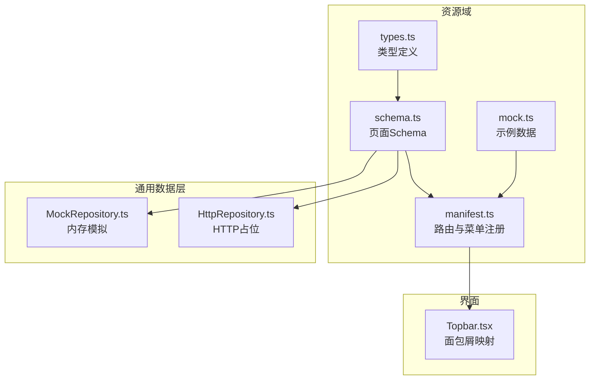
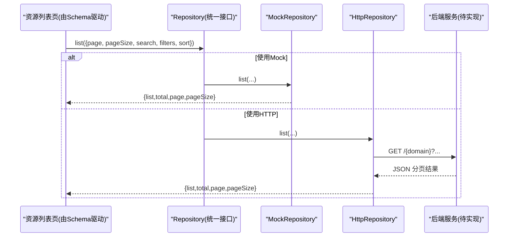
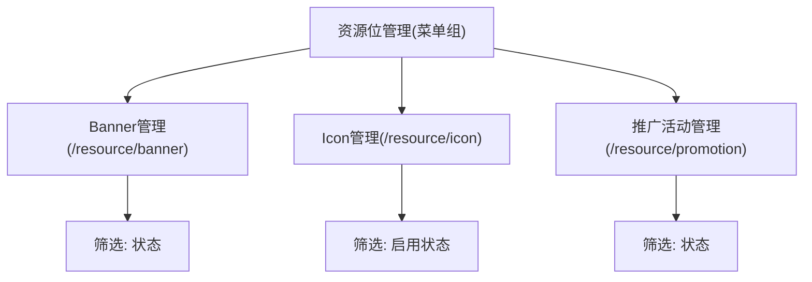
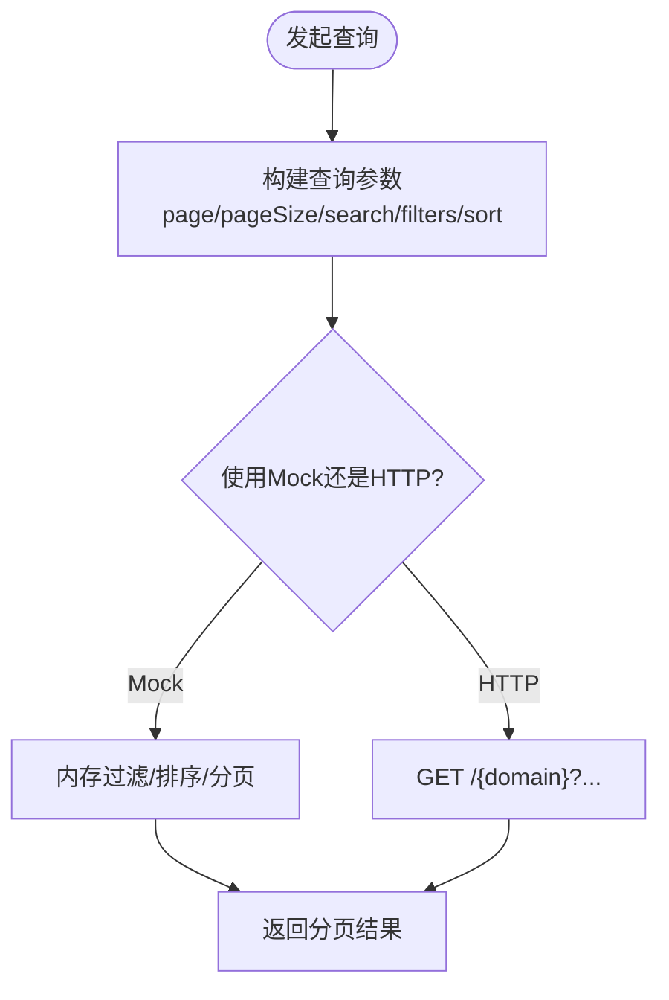
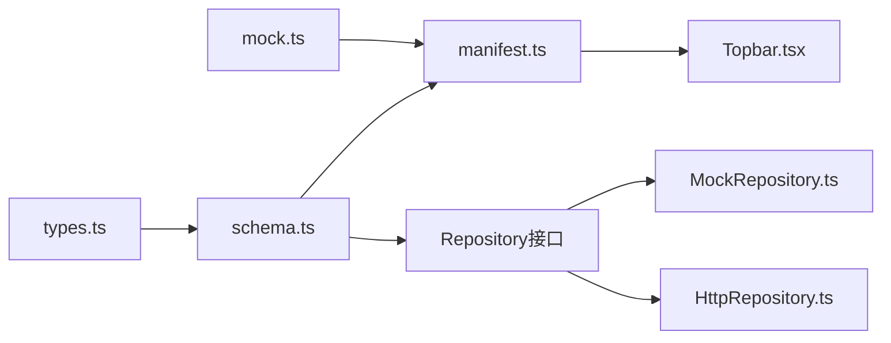

# 资源管理API

<cite>
**本文引用的文件列表**
- [types.ts](file://hj-admin/src/domains/resource/types.ts)
- [schema.ts](file://hj-admin/src/domains/resource/schema.ts)
- [manifest.ts](file://hj-admin/src/domains/resource/manifest.ts)
- [mock.ts](file://hj-admin/src/domains/resource/mock.ts)
- [HttpRepository.ts](file://hj-admin/src/shared/data/HttpRepository.ts)
- [MockRepository.ts](file://hj-admin/src/shared/data/MockRepository.ts)
- [Topbar.tsx](file://hj-admin/src/layouts/Topbar.tsx)
</cite>

## 目录
1. [简介](#简介)
2. [项目结构](#项目结构)
3. [核心组件](#核心组件)
4. [架构总览](#架构总览)
5. [详细组件分析](#详细组件分析)
6. [依赖关系分析](#依赖关系分析)
7. [性能与扩展性](#性能与扩展性)
8. [故障排查指南](#故障排查指南)
9. [结论](#结论)
10. [附录：接口规范与数据模型](#附录接口规范与数据模型)

## 简介
本文件面向“资源管理”能力，聚焦于资源实体定义、分类与目录结构、CRUD 操作、权限与访问策略、版本与变更历史、搜索过滤与批量操作、统计分析、以及清理归档备份等全生命周期管理能力。当前仓库为前端工程，已提供资源域的数据类型、页面 Schema、路由清单与通用 Repository 实现（Mock 与 HTTP），可作为后端 API 契约的前置依据与对接蓝图。

## 项目结构
资源域位于 hj-admin 的 domains/resource 下，包含类型定义、Schema 配置、Manifest 注册与 Mock 数据；通用数据访问层位于 shared/data，提供 Mock 与 HTTP 两种 Repository 实现；导航面包屑在 layouts/Topbar.tsx 中维护。



图表来源
- [types.ts:1-31](file://hj-admin/src/domains/resource/types.ts#L1-L31)
- [schema.ts:1-51](file://hj-admin/src/domains/resource/schema.ts#L1-L51)
- [manifest.ts:1-22](file://hj-admin/src/domains/resource/manifest.ts#L1-L22)
- [mock.ts:1-28](file://hj-admin/src/domains/resource/mock.ts#L1-L28)
- [MockRepository.ts:1-101](file://hj-admin/src/shared/data/MockRepository.ts#L1-L101)
- [HttpRepository.ts:1-70](file://hj-admin/src/shared/data/HttpRepository.ts#L1-L70)
- [Topbar.tsx:1-33](file://hj-admin/src/layouts/Topbar.tsx#L1-L33)

章节来源
- [types.ts:1-31](file://hj-admin/src/domains/resource/types.ts#L1-L31)
- [schema.ts:1-51](file://hj-admin/src/domains/resource/schema.ts#L1-L51)
- [manifest.ts:1-22](file://hj-admin/src/domains/resource/manifest.ts#L1-L22)
- [mock.ts:1-28](file://hj-admin/src/domains/resource/mock.ts#L1-L28)
- [MockRepository.ts:1-101](file://hj-admin/src/shared/data/MockRepository.ts#L1-L101)
- [HttpRepository.ts:1-70](file://hj-admin/src/shared/data/HttpRepository.ts#L1-L70)
- [Topbar.tsx:1-33](file://hj-admin/src/layouts/Topbar.tsx#L1-L33)

## 核心组件
- 资源类型与字段
  - Banner：用于首页轮播，包含名称、帧数、状态、排期、排序权重、跳转目标等字段。
  - IconItem：用于首页快捷入口图标，包含名称、表情、背景色、跳转目标、启用状态。
  - Promotion：用于推广活动，包含名称、日期、地点、展示位置集合、状态、跳转目标。
- 页面 Schema
  - 通过 PageSchema 声明各资源的筛选器、列定义、分页、行内操作等，驱动统一渲染。
- 路由与菜单
  - 通过 DomainManifest 将三类资源页注册到“资源位管理”分组，并绑定对应路径与标签。
- 数据访问
  - MockRepository：本地内存过滤、分页、排序，模拟网络延迟，便于开发联调。
  - HttpRepository：统一的 RESTful 请求封装，作为后端 API 就绪后的替换实现。

章节来源
- [types.ts:1-31](file://hj-admin/src/domains/resource/types.ts#L1-L31)
- [schema.ts:1-51](file://hj-admin/src/domains/resource/schema.ts#L1-L51)
- [manifest.ts:1-22](file://hj-admin/src/domains/resource/manifest.ts#L1-L22)
- [MockRepository.ts:1-101](file://hj-admin/src/shared/data/MockRepository.ts#L1-L101)
- [HttpRepository.ts:1-70](file://hj-admin/src/shared/data/HttpRepository.ts#L1-L70)

## 架构总览
资源管理采用“领域 Schema + 通用数据层”的分层设计：
- 表现层：基于 Schema 自动渲染列表、筛选、分页、行操作。
- 领域层：types.ts 定义资源实体，schema.ts 定义页面行为，manifest.ts 注册路由。
- 数据层：MockRepository 与 HttpRepository 实现统一 Repository 接口，屏蔽差异。



图表来源
- [schema.ts:1-51](file://hj-admin/src/domains/resource/schema.ts#L1-L51)
- [MockRepository.ts:1-101](file://hj-admin/src/shared/data/MockRepository.ts#L1-L101)
- [HttpRepository.ts:1-70](file://hj-admin/src/shared/data/HttpRepository.ts#L1-L70)

## 详细组件分析

### 资源实体与数据结构
- Banner
  - 字段：标识、名称、帧数、状态、排期、排序权重、跳转目标。
  - 用途：首页轮播图配置，支持多帧与排序。
- IconItem
  - 字段：标识、名称、表情、背景色、跳转目标、启用状态。
  - 用途：首页快捷入口，固定数量与布局。
- Promotion
  - 字段：标识、名称、日期、地点、展示位置集合、状态、跳转目标。
  - 用途：专题或活动推广位，支持多位置投放。

```mermaid
classDiagram
class Banner {
+string id
+string name
+number frameCount
+ResourceStatus status
+string schedule
+number sort
+string jumpTarget
}
class IconItem {
+string id
+string name
+string emoji
+string color
+string jumpTarget
+string status
}
class Promotion {
+string id
+string name
+string date
+string location
+string[] positions
+ResourceStatus status
+string jumpTarget
}
class ResourceStatus {
<<enum>>
"已上线"
"排期中"
"已下线"
"草稿"
}
Banner --> ResourceStatus : "使用"
Promotion --> ResourceStatus : "使用"
```

图表来源
- [types.ts:1-31](file://hj-admin/src/domains/resource/types.ts#L1-L31)

章节来源
- [types.ts:1-31](file://hj-admin/src/domains/resource/types.ts#L1-L31)

### 资源分类体系与目录结构管理
- 分类维度
  - 按资源类型：Banner、Icon、Promotion。
  - 按状态：已上线、排期中、已下线、草稿（Banner/Promotion）；已启用/已停用（Icon）。
- 目录与路由
  - 通过 manifest.ts 将三类资源页注册至“资源位管理”分组，分别对应 /resource/banner、/resource/icon、/resource/promotion。
  - Topbar.tsx 维护面包屑映射，体现层级：资源位管理 › 具体资源页。



图表来源
- [manifest.ts:1-22](file://hj-admin/src/domains/resource/manifest.ts#L1-L22)
- [Topbar.tsx:1-33](file://hj-admin/src/layouts/Topbar.tsx#L1-L33)
- [schema.ts:1-51](file://hj-admin/src/domains/resource/schema.ts#L1-L51)

章节来源
- [manifest.ts:1-22](file://hj-admin/src/domains/resource/manifest.ts#L1-L22)
- [Topbar.tsx:1-33](file://hj-admin/src/layouts/Topbar.tsx#L1-L33)
- [schema.ts:1-51](file://hj-admin/src/domains/resource/schema.ts#L1-L51)

### 资源上传、下载、预览、编辑等操作API
- 现状说明
  - 当前仓库未提供文件上传/下载/预览的具体实现。
  - 通用 HTTP 层已提供标准 CRUD 方法，可在此基础上扩展文件类接口。
- 建议接口设计（供后端实现参考）
  - 上传：POST /{domain}/files/upload，返回资源URL与元信息。
  - 下载：GET /{domain}/files/{id}/download，返回二进制流。
  - 预览：GET /{domain}/files/{id}/preview，返回预览HTML或缩略图。
  - 编辑：PUT /{domain}/{id}，更新文本/结构化字段；文件变更走上传接口后回填引用。
- 与现有代码的衔接点
  - 可在 schema.ts 的行操作中增加“上传/预览/下载”按钮，调用 HttpRepository 扩展方法。
  - 若需要分片/断点续传，可在 HttpRepository.request 基础上封装专用方法。

章节来源
- [HttpRepository.ts:1-70](file://hj-admin/src/shared/data/HttpRepository.ts#L1-L70)
- [schema.ts:1-51](file://hj-admin/src/domains/resource/schema.ts#L1-L51)

### 权限控制与访问策略
- 现状说明
  - 当前仓库未实现鉴权与授权逻辑。
- 建议接入方案
  - 在 HttpRepository.request 中注入认证头（如 Authorization: Bearer <token>）。
  - 对敏感操作（删除、发布、归档）增加二次确认与权限校验。
  - 服务端侧根据角色/组织维度控制资源可见性与操作权限。

章节来源
- [HttpRepository.ts:1-70](file://hj-admin/src/shared/data/HttpRepository.ts#L1-L70)

### 版本管理与变更历史
- 现状说明
  - 当前资源实体未包含版本字段与变更记录。
- 建议扩展
  - 在实体中增加 version 字段与 updated_at 时间戳。
  - 新增 /{domain}/{id}/history 接口，返回变更日志（操作人、时间、变更摘要）。
  - 在 schema.ts 的行操作中增加“查看历史”、“回滚到指定版本”。

章节来源
- [types.ts:1-31](file://hj-admin/src/domains/resource/types.ts#L1-L31)
- [schema.ts:1-51](file://hj-admin/src/domains/resource/schema.ts#L1-L51)

### 搜索、过滤与批量操作
- 现有能力
  - MockRepository 支持关键词搜索、多条件过滤、排序与分页。
  - HttpRepository 将查询参数序列化为 URLSearchParams，约定 filter.* 前缀传递筛选条件。
- 批量操作建议
  - 在 schema.ts 的行选择区增加“批量启用/停用/归档/删除”等动作。
  - 后端提供 POST /{domain}/batch 接口，接收 ids 数组与动作类型。



图表来源
- [MockRepository.ts:1-101](file://hj-admin/src/shared/data/MockRepository.ts#L1-L101)
- [HttpRepository.ts:1-70](file://hj-admin/src/shared/data/HttpRepository.ts#L1-L70)

章节来源
- [MockRepository.ts:1-101](file://hj-admin/src/shared/data/MockRepository.ts#L1-L101)
- [HttpRepository.ts:1-70](file://hj-admin/src/shared/data/HttpRepository.ts#L1-L70)

### 统计分析和使用监控
- 现状说明
  - 当前仓库未提供统计与监控接口。
- 建议指标
  - 曝光/点击量、转化率、活跃时段分布、资源热度排行。
  - 提供 GET /{domain}/stats 接口，返回聚合指标与趋势数据。
  - 在 schema.ts 顶部增加统计卡片区域，按需刷新。

章节来源
- [schema.ts:1-51](file://hj-admin/src/domains/resource/schema.ts#L1-L51)

### 清理、归档与备份
- 现状说明
  - 当前仓库未实现归档与备份流程。
- 建议能力
  - 归档：POST /{domain}/{id}/archive，标记为归档态并隐藏于默认列表。
  - 恢复：POST /{domain}/{id}/restore，从归档恢复。
  - 清理：POST /{domain}/cleanup，按策略删除过期/无用资源。
  - 备份：POST /{domain}/backup/export，导出快照；POST /{domain}/backup/import，导入恢复。

章节来源
- [schema.ts:1-51](file://hj-admin/src/domains/resource/schema.ts#L1-L51)

## 依赖关系分析
- 模块耦合
  - schema.ts 依赖 types.ts 的类型约束。
  - manifest.ts 依赖 schema.ts 的页面配置与 mock.ts 的示例数据。
  - Topbar.tsx 维护路由与面包屑映射，与 manifest.ts 的路径保持一致。
- 数据层解耦
  - 上层仅依赖 Repository 接口，Mock 与 HTTP 实现可无缝切换。



图表来源
- [types.ts:1-31](file://hj-admin/src/domains/resource/types.ts#L1-L31)
- [schema.ts:1-51](file://hj-admin/src/domains/resource/schema.ts#L1-L51)
- [manifest.ts:1-22](file://hj-admin/src/domains/resource/manifest.ts#L1-L22)
- [mock.ts:1-28](file://hj-admin/src/domains/resource/mock.ts#L1-L28)
- [MockRepository.ts:1-101](file://hj-admin/src/shared/data/MockRepository.ts#L1-L101)
- [HttpRepository.ts:1-70](file://hj-admin/src/shared/data/HttpRepository.ts#L1-L70)
- [Topbar.tsx:1-33](file://hj-admin/src/layouts/Topbar.tsx#L1-L33)

章节来源
- [types.ts:1-31](file://hj-admin/src/domains/resource/types.ts#L1-L31)
- [schema.ts:1-51](file://hj-admin/src/domains/resource/schema.ts#L1-L51)
- [manifest.ts:1-22](file://hj-admin/src/domains/resource/manifest.ts#L1-L22)
- [mock.ts:1-28](file://hj-admin/src/domains/resource/mock.ts#L1-L28)
- [MockRepository.ts:1-101](file://hj-admin/src/shared/data/MockRepository.ts#L1-L101)
- [HttpRepository.ts:1-70](file://hj-admin/src/shared/data/HttpRepository.ts#L1-L70)
- [Topbar.tsx:1-33](file://hj-admin/src/layouts/Topbar.tsx#L1-L33)

## 性能与扩展性
- 列表加载
  - 使用分页与服务器端过滤，避免一次性拉取全量数据。
  - 对热点资源（如 Banner）可增加缓存层（浏览器缓存/CDN）。
- 交互体验
  - 在 MockRepository 中保留延迟模拟，确保加载态与错误态体验一致。
- 可扩展点
  - 在 HttpRepository 中统一处理重试、超时、错误码映射。
  - 在 schema.ts 中通过 render 扩展自定义列与操作。

[本节为通用指导，不直接分析具体文件]

## 故障排查指南
- 常见问题
  - 列表无数据：检查 QueryParams 是否传入 page/pageSize；确认 filters 键名与后端一致。
  - 排序异常：确认 sort.field 与 sort.order 命名是否符合约定。
  - 404/500：检查 endpoint 拼接是否正确，域名与路径是否与后端一致。
- 定位步骤
  - 打开浏览器开发者工具，查看 Network 面板的请求与响应。
  - 在 MockRepository 中临时关闭延迟，验证是否为异步时序问题。
  - 对比 schema.ts 的 filters/columns 与后端字段映射是否一致。

章节来源
- [MockRepository.ts:1-101](file://hj-admin/src/shared/data/MockRepository.ts#L1-L101)
- [HttpRepository.ts:1-70](file://hj-admin/src/shared/data/HttpRepository.ts#L1-L70)
- [schema.ts:1-51](file://hj-admin/src/domains/resource/schema.ts#L1-L51)

## 结论
当前仓库为资源管理提供了清晰的前端分层与通用数据访问抽象，具备快速迭代与向后兼容的能力。后续应优先补齐文件上传/下载/预览、权限与审计、版本与变更历史、统计与监控、归档与备份等能力，并通过 schema.ts 与 Repository 的统一接口平滑落地。

[本节为总结性内容，不直接分析具体文件]

## 附录：接口规范与数据模型

### 通用查询参数
- 分页
  - page：页码，默认 1
  - pageSize：每页条数，默认 20
- 搜索
  - search：关键词，模糊匹配字符串字段
- 过滤
  - filter.{field}：按字段精确过滤，支持多次追加
- 排序
  - sortField：排序字段
  - sortOrder：ascend/descend

章节来源
- [HttpRepository.ts:1-70](file://hj-admin/src/shared/data/HttpRepository.ts#L1-L70)
- [MockRepository.ts:1-101](file://hj-admin/src/shared/data/MockRepository.ts#L1-L101)

### 资源实体字段一览
- Banner
  - id、name、frameCount、status、schedule、sort、jumpTarget
- IconItem
  - id、name、emoji、color、jumpTarget、status
- Promotion
  - id、name、date、location、positions、status、jumpTarget

章节来源
- [types.ts:1-31](file://hj-admin/src/domains/resource/types.ts#L1-L31)

### 页面Schema要点
- 筛选器：按状态/启用状态过滤
- 列定义：名称、关键属性、状态、跳转目标等
- 分页：默认 20 条/页，显示总数
- 行操作：编辑、启用/停用、归档等（可按需扩展）

章节来源
- [schema.ts:1-51](file://hj-admin/src/domains/resource/schema.ts#L1-L51)

### 路由与菜单
- 分组：资源位管理
- 路由
  - /resource/banner：Banner管理
  - /resource/icon：Icon管理
  - /resource/promotion：推广活动管理
- 面包屑：资源位管理 › 具体资源页

章节来源
- [manifest.ts:1-22](file://hj-admin/src/domains/resource/manifest.ts#L1-L22)
- [Topbar.tsx:1-33](file://hj-admin/src/layouts/Topbar.tsx#L1-L33)