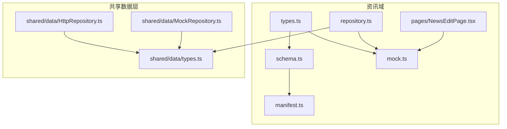
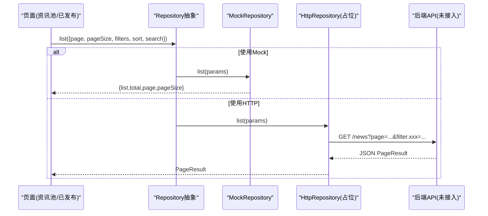
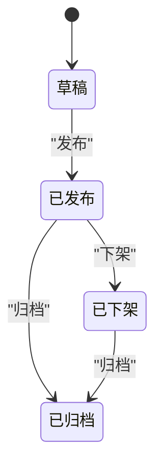
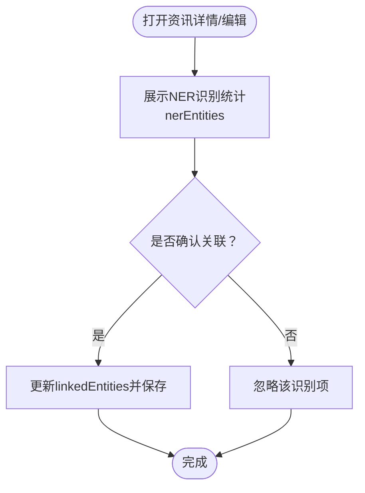
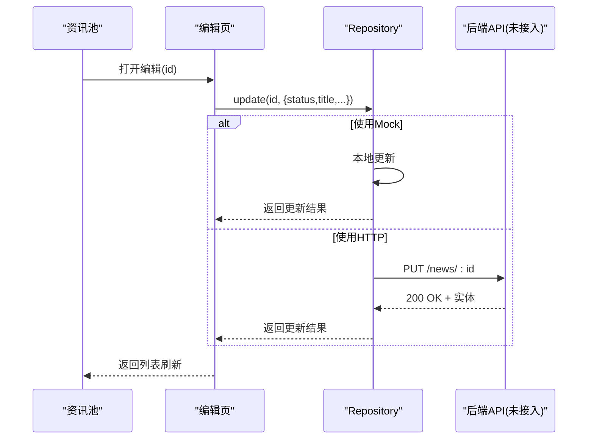
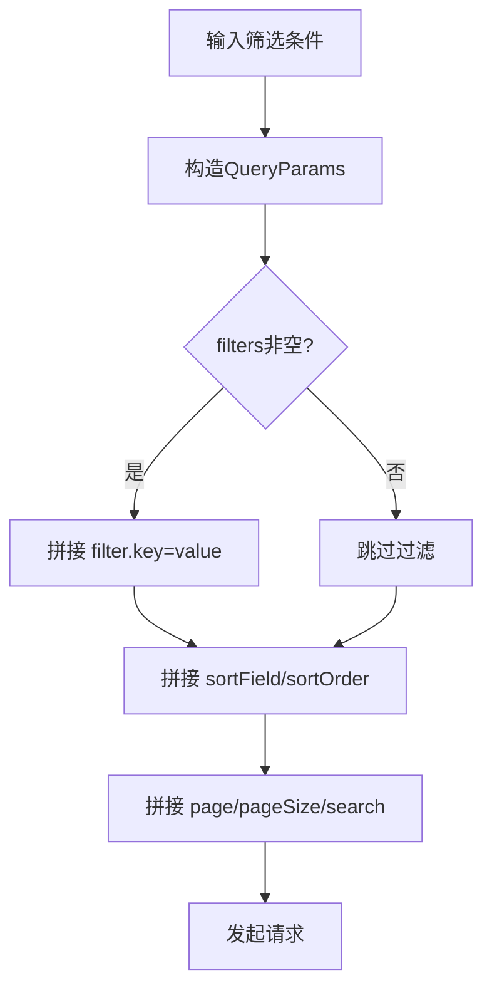
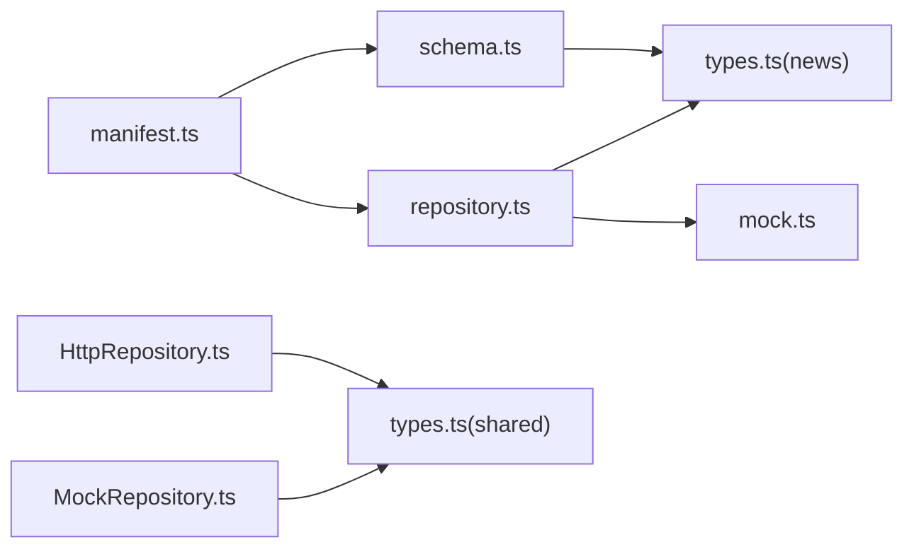

# 资讯库API

<cite>
**本文引用的文件**
- [types.ts](file://hj-admin/src/domains/news/types.ts)
- [schema.ts](file://hj-admin/src/domains/news/schema.ts)
- [repository.ts](file://hj-admin/src/domains/news/repository.ts)
- [mock.ts](file://hj-admin/src/domains/news/mock.ts)
- [manifest.ts](file://hj-admin/src/domains/news/manifest.ts)
- [index.ts](file://hj-admin/src/domains/news/index.ts)
- [NewsEditPage.tsx](file://hj-admin/src/domains/news/pages/NewsEditPage.tsx)
- [HttpRepository.ts](file://hj-admin/src/shared/data/HttpRepository.ts)
- [MockRepository.ts](file://hj-admin/src/shared/data/MockRepository.ts)
- [types.ts](file://hj-admin/src/shared/data/types.ts)
- [NewsPool.tsx](file://hj-admin/src/pages/news/NewsPool.tsx)
- [types.ts](file://hj-admin/src/domains/tags/types.ts)
</cite>

## 目录
1. [简介](#简介)
2. [项目结构](#项目结构)
3. [核心组件](#核心组件)
4. [架构总览](#架构总览)
5. [详细组件分析](#详细组件分析)
6. [依赖分析](#依赖分析)
7. [性能考虑](#性能考虑)
8. [故障排查指南](#故障排查指南)
9. [结论](#结论)
10. [附录](#附录)

## 简介
本文件为“资讯库”模块的完整API与数据契约文档，面向前后端开发与运营人员。内容覆盖：
- News实体数据结构定义（标题、来源、标签、发布时间等）
- 资讯状态管理接口（草稿、已发布、已下架、已归档）
- 资讯分类与标签关联方法
- 资讯与企业等实体的关联查询
- 采集、编辑、审核、发布的业务流程API
- 搜索、筛选、分页查询参数规范
- 数据源管理与质量评估相关接口

说明：当前前端采用声明式Schema驱动页面，数据访问通过统一的Repository抽象层实现；后端API尚未接入，HTTP仓库为占位实现，便于后续替换真实接口。

## 项目结构
资讯域位于 hj-admin/src/domains/news，包含类型定义、Schema配置、路由清单、Mock数据与编辑页。数据访问统一由 shared/data 下的 Repository 抽象与具体实现提供。

图表来源
- [manifest.ts:1-42](file://hj-admin/src/domains/news/manifest.ts#L1-L42)
- [schema.ts:1-123](file://hj-admin/src/domains/news/schema.ts#L1-L123)
- [types.ts:1-50](file://hj-admin/src/domains/news/types.ts#L1-L50)
- [repository.ts:1-11](file://hj-admin/src/domains/news/repository.ts#L1-L11)
- [mock.ts:1-60](file://hj-admin/src/domains/news/mock.ts#L1-L60)
- [NewsEditPage.tsx:1-166](file://hj-admin/src/domains/news/pages/NewsEditPage.tsx#L1-L166)
- [HttpRepository.ts:1-70](file://hj-admin/src/shared/data/HttpRepository.ts#L1-L70)
- [MockRepository.ts:1-101](file://hj-admin/src/shared/data/MockRepository.ts#L1-L101)
- [types.ts:1-36](file://hj-admin/src/shared/data/types.ts#L1-L36)

章节来源
- [manifest.ts:1-42](file://hj-admin/src/domains/news/manifest.ts#L1-L42)
- [schema.ts:1-123](file://hj-admin/src/domains/news/schema.ts#L1-L123)
- [repository.ts:1-11](file://hj-admin/src/domains/news/repository.ts#L1-L11)
- [mock.ts:1-60](file://hj-admin/src/domains/news/mock.ts#L1-L60)
- [NewsEditPage.tsx:1-166](file://hj-admin/src/domains/news/pages/NewsEditPage.tsx#L1-L166)
- [HttpRepository.ts:1-70](file://hj-admin/src/shared/data/HttpRepository.ts#L1-L70)
- [MockRepository.ts:1-101](file://hj-admin/src/shared/data/MockRepository.ts#L1-L101)
- [types.ts:1-36](file://hj-admin/src/shared/data/types.ts#L1-L36)

## 核心组件
- 领域类型与枚举
  - 资讯状态：草稿、已发布、已下架、已归档
  - 数据源类型：爬虫采集、API接入、RSS订阅
  - 数据源状态：运行中、异常、已停用
- 数据模型
  - NewsItem：资讯主实体
  - DataSource：数据源实体
  - TagItem：标签实体（跨域复用）
- 数据访问抽象
  - Repository<T>：统一CRUD与列表查询接口
  - HttpRepository：HTTP实现（待接入后端）
  - MockRepository：内存模拟实现（开发体验一致）

章节来源
- [types.ts:1-50](file://hj-admin/src/domains/news/types.ts#L1-L50)
- [types.ts:1-10](file://hj-admin/src/domains/tags/types.ts#L1-L10)
- [types.ts:1-36](file://hj-admin/src/shared/data/types.ts#L1-L36)
- [HttpRepository.ts:1-70](file://hj-admin/src/shared/data/HttpRepository.ts#L1-L70)
- [MockRepository.ts:1-101](file://hj-admin/src/shared/data/MockRepository.ts#L1-L101)

## 架构总览
前端以Schema驱动页面渲染，结合Repository抽象进行数据访问。当前使用MockRepository，后续可无缝切换至HttpRepository对接后端REST API。

图表来源
- [schema.ts:22-53](file://hj-admin/src/domains/news/schema.ts#L22-L53)
- [MockRepository.ts:20-67](file://hj-admin/src/shared/data/MockRepository.ts#L20-L67)
- [HttpRepository.ts:29-46](file://hj-admin/src/shared/data/HttpRepository.ts#L29-L46)

## 详细组件分析

### 实体与数据结构
- NewsItem字段
  - id: 字符串标识
  - title: 标题
  - source: 来源
  - tags: 手动标签集合
  - autoTags: 自动标签集合
  - nerEntities: NER识别统计（企业、项目、政策、标准、专利计数）
  - linkedEntities: 人工关联确认后的实体计数
  - status: 资讯状态
  - publishTime: 发布时间
  - province: 省份/区域
- DataSource字段
  - id/name/type/domain/status/lastCrawl/successRate/articleCount
- TagItem字段
  - id/name/color/usageCount/createdAt/updatedAt/type

章节来源
- [types.ts:5-28](file://hj-admin/src/domains/news/types.ts#L5-L28)
- [types.ts:40-49](file://hj-admin/src/domains/news/types.ts#L40-L49)
- [types.ts:1-10](file://hj-admin/src/domains/tags/types.ts#L1-L10)

### 状态管理与流转
- 状态集合：草稿、已发布、已下架、已归档
- 常见流转
  - 草稿 → 已发布：在资讯池或编辑页执行“发布”
  - 已发布 → 已下架：在资讯池或已发布页执行“下架”
  - 已发布/已下架 → 已归档：归档操作（页面未显式暴露，可在扩展中增加）
- 页面行为约束
  - 仅“草稿”显示“发布”
  - 仅“已发布”显示“下架”

图表来源
- [schema.ts:48-52](file://hj-admin/src/domains/news/schema.ts#L48-L52)
- [NewsPool.tsx:74-79](file://hj-admin/src/pages/news/NewsPool.tsx#L74-L79)
- [NewsEditPage.tsx:33-36](file://hj-admin/src/domains/news/pages/NewsEditPage.tsx#L33-L36)

章节来源
- [schema.ts:48-52](file://hj-admin/src/domains/news/schema.ts#L48-L52)
- [NewsPool.tsx:74-79](file://hj-admin/src/pages/news/NewsPool.tsx#L74-L79)
- [NewsEditPage.tsx:33-36](file://hj-admin/src/domains/news/pages/NewsEditPage.tsx#L33-L36)

### 标签与分类关联
- 标签类型
  - 手动标签：tags数组
  - 自动标签：autoTags数组（AI打标）
- 标签实体
  - TagItem支持按type区分“news”或“enterprise”，便于跨域复用
- 关联方式
  - 编辑页展示自动标签，支持一键采用/删除
  - 可通过标签域统一管理标签元信息

章节来源
- [types.ts:5-28](file://hj-admin/src/domains/news/types.ts#L5-L28)
- [types.ts:1-10](file://hj-admin/src/domains/tags/types.ts#L1-L10)
- [NewsEditPage.tsx:43-55](file://hj-admin/src/domains/news/pages/NewsEditPage.tsx#L43-L55)

### 资讯与企业等实体关联查询
- 识别统计
  - nerEntities：NER识别出的实体数量（企业、项目、政策、标准、专利）
- 关联确认
  - linkedEntities：经人工确认后关联的实体数量
- 查询入口
  - 资讯池/已发布列表展示识别与关联计数
  - 点击计数进入编辑页进行确认处理

图表来源
- [types.ts:11-24](file://hj-admin/src/domains/news/types.ts#L11-L24)
- [NewsEditPage.tsx:82-148](file://hj-admin/src/domains/news/pages/NewsEditPage.tsx#L82-L148)
- [NewsPool.tsx:52-66](file://hj-admin/src/pages/news/NewsPool.tsx#L52-L66)

章节来源
- [types.ts:11-24](file://hj-admin/src/domains/news/types.ts#L11-L24)
- [NewsEditPage.tsx:82-148](file://hj-admin/src/domains/news/pages/NewsEditPage.tsx#L82-L148)
- [NewsPool.tsx:52-66](file://hj-admin/src/pages/news/NewsPool.tsx#L52-L66)

### 采集、编辑、审核、发布流程API
- 采集
  - 数据源类型：爬虫采集、API接入、RSS订阅
  - 指标：最近采集时间、成功率、文章数
- 编辑
  - 富文本正文、摘要、自动排版、快照
  - 自动标签推荐与人工采纳
- 审核与发布
  - 从“草稿”到“已发布”
  - “已发布”可“下架”
  - 归档能力可扩展
- 对应页面
  - 资讯池：列表、筛选、行内发布/下架
  - 已发布资讯：快速筛选关联状态
  - 数据源管理：启用/停用、查看成功率

图表来源
- [schema.ts:48-52](file://hj-admin/src/domains/news/schema.ts#L48-L52)
- [NewsEditPage.tsx:33-36](file://hj-admin/src/domains/news/pages/NewsEditPage.tsx#L33-L36)
- [HttpRepository.ts:59-64](file://hj-admin/src/shared/data/HttpRepository.ts#L59-L64)
- [MockRepository.ts:83-89](file://hj-admin/src/shared/data/MockRepository.ts#L83-L89)

章节来源
- [schema.ts:96-122](file://hj-admin/src/domains/news/schema.ts#L96-L122)
- [NewsEditPage.tsx:20-37](file://hj-admin/src/domains/news/pages/NewsEditPage.tsx#L20-L37)
- [HttpRepository.ts:59-64](file://hj-admin/src/shared/data/HttpRepository.ts#L59-L64)
- [MockRepository.ts:83-89](file://hj-admin/src/shared/data/MockRepository.ts#L83-L89)

### 搜索、筛选、分页查询参数规范
- 通用查询参数（Repository抽象）
  - page: 页码
  - pageSize: 每页条数
  - filters: 键值对过滤条件
  - sort.field: 排序字段
  - sort.order: ascend | descend
  - search: 关键词
- 资讯池常用筛选
  - source: 来源（下拉）
  - status: 状态（下拉）
  - linkStatus: 关联状态（未关联/部分关联/已完整关联）
  - keyword: 标题/摘要关键词
  - dateRange: 发布时间范围
- 已发布资讯
  - 支持source、keyword筛选
  - 快捷筛选：全部/已关联/待补关联
- 数据源管理
  - type: 类型（爬虫采集/API接入/RSS订阅）
  - status: 状态（运行中/异常/已停用）
  - keyword: 名称搜索

图表来源
- [HttpRepository.ts:29-46](file://hj-admin/src/shared/data/HttpRepository.ts#L29-L46)
- [MockRepository.ts:20-67](file://hj-admin/src/shared/data/MockRepository.ts#L20-L67)
- [schema.ts:27-36](file://hj-admin/src/domains/news/schema.ts#L27-L36)
- [schema.ts:61-65](file://hj-admin/src/domains/news/schema.ts#L61-L65)
- [schema.ts:102-106](file://hj-admin/src/domains/news/schema.ts#L102-L106)

章节来源
- [types.ts:1-36](file://hj-admin/src/shared/data/types.ts#L1-L36)
- [HttpRepository.ts:29-46](file://hj-admin/src/shared/data/HttpRepository.ts#L29-L46)
- [MockRepository.ts:20-67](file://hj-admin/src/shared/data/MockRepository.ts#L20-L67)
- [schema.ts:27-36](file://hj-admin/src/domains/news/schema.ts#L27-L36)
- [schema.ts:61-65](file://hj-admin/src/domains/news/schema.ts#L61-L65)
- [schema.ts:102-106](file://hj-admin/src/domains/news/schema.ts#L102-L106)

### 数据源管理与质量评估
- 数据源字段
  - name/type/domain/status/lastCrawl/successRate/articleCount
- 质量指标
  - successRate：采集成功率
  - lastCrawl：最近采集时间
  - articleCount：累计文章数
- 管理动作
  - 启用/停用数据源
  - 按类型、状态、关键字筛选

章节来源
- [types.ts:40-49](file://hj-admin/src/domains/news/types.ts#L40-L49)
- [schema.ts:96-122](file://hj-admin/src/domains/news/schema.ts#L96-L122)

## 依赖分析
- 模块耦合
  - manifest依赖schema与repository，注册路由与菜单
  - repository绑定mock数据，供页面消费
  - schema定义页面列、筛选、分页、行操作
  - types集中定义领域类型，被多处引用
- 外部依赖
  - 共享数据层Repository抽象，解耦具体数据源实现
  - 页面组件依赖Ant Design与React Router

图表来源
- [manifest.ts:1-42](file://hj-admin/src/domains/news/manifest.ts#L1-L42)
- [schema.ts:1-123](file://hj-admin/src/domains/news/schema.ts#L1-L123)
- [repository.ts:1-11](file://hj-admin/src/domains/news/repository.ts#L1-L11)
- [mock.ts:1-60](file://hj-admin/src/domains/news/mock.ts#L1-L60)
- [HttpRepository.ts:1-70](file://hj-admin/src/shared/data/HttpRepository.ts#L1-L70)
- [MockRepository.ts:1-101](file://hj-admin/src/shared/data/MockRepository.ts#L1-L101)
- [types.ts:1-50](file://hj-admin/src/domains/news/types.ts#L1-L50)
- [types.ts:1-36](file://hj-admin/src/shared/data/types.ts#L1-L36)

章节来源
- [manifest.ts:1-42](file://hj-admin/src/domains/news/manifest.ts#L1-L42)
- [repository.ts:1-11](file://hj-admin/src/domains/news/repository.ts#L1-L11)
- [HttpRepository.ts:1-70](file://hj-admin/src/shared/data/HttpRepository.ts#L1-L70)
- [MockRepository.ts:1-101](file://hj-admin/src/shared/data/MockRepository.ts#L1-L101)

## 性能考虑
- 列表查询
  - 优先使用服务端分页与过滤，避免全量拉取
  - 合理设置pageSize，默认20条
- 前端渲染
  - 长表格开启横向滚动与固定列，减少重排
  - 标签与实体计数使用轻量渲染器
- 网络层
  - 使用统一的错误处理与重试策略（待后端接入后完善）
  - 对高频筛选条件做防抖与缓存（可选）

## 故障排查指南
- 列表为空
  - 检查filters与search是否正确传递
  - 确认后端是否返回PageResult格式
- 状态按钮不显示
  - 核对当前status是否符合可见条件
- 数据源异常
  - 关注successRate与lastCrawl，定位异常源
- 编辑页NER面板无数据
  - 检查nerEntities是否为空对象或计数为0

章节来源
- [schema.ts:48-52](file://hj-admin/src/domains/news/schema.ts#L48-L52)
- [schema.ts:102-106](file://hj-admin/src/domains/news/schema.ts#L102-L106)
- [HttpRepository.ts:20-27](file://hj-admin/src/shared/data/HttpRepository.ts#L20-L27)

## 结论
本方案通过Schema驱动与Repository抽象，实现了资讯库的前端能力闭环：实体建模、状态流转、标签与实体关联、数据源管理以及统一的查询分页接口。当前使用MockRepository保证开发体验，后续只需将HttpRepository接入即可平滑过渡到真实后端API。

## 附录

### 路由与页面清单
- /news/pool：资讯池
- /news/published：已发布资讯
- /news/sources：数据源管理
- /news/edit/:id：资讯编辑（隐藏于菜单）

章节来源
- [manifest.ts:18-40](file://hj-admin/src/domains/news/manifest.ts#L18-L40)

### 数据源模式切换
- 通过DomainDataSourceConfig指定各域的DataSourceMode（mock/http）
- 当前资讯域默认使用MockRepository，便于离线开发

章节来源
- [types.ts:29-36](file://hj-admin/src/shared/data/types.ts#L29-L36)
- [repository.ts:1-11](file://hj-admin/src/domains/news/repository.ts#L1-L11)