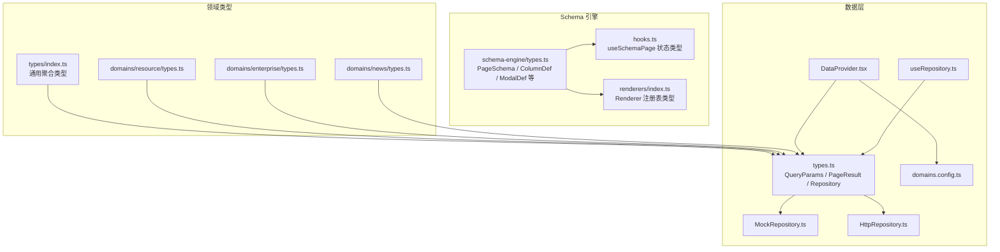
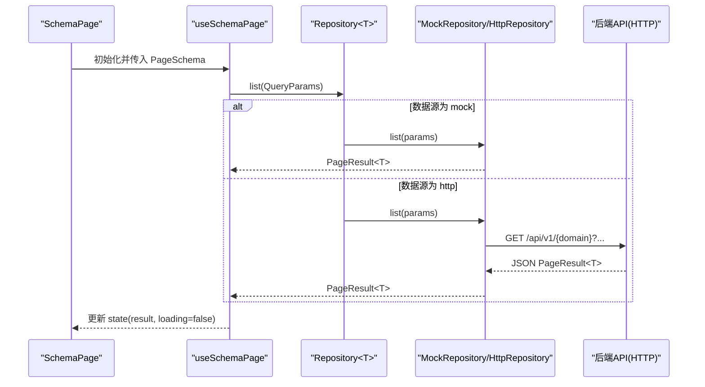
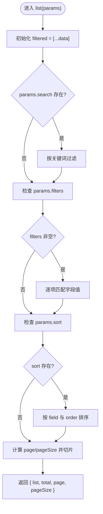
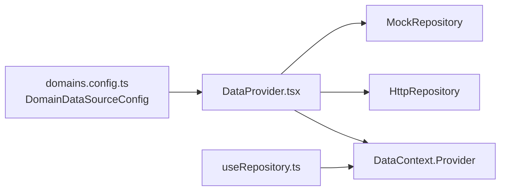
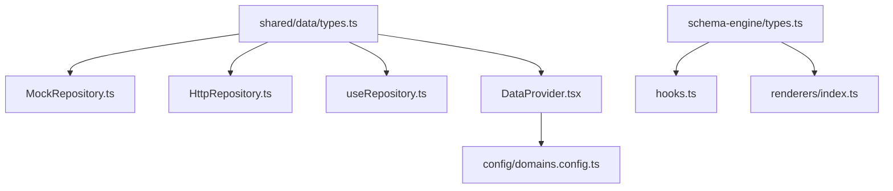

# 核心类型定义

<cite>
**本文引用的文件**
- [src/shared/data/types.ts](file://hj-admin/src/shared/data/types.ts)
- [src/shared/schema-engine/types.ts](file://hj-admin/src/shared/schema-engine/types.ts)
- [src/shared/data/MockRepository.ts](file://hj-admin/src/shared/data/MockRepository.ts)
- [src/shared/data/HttpRepository.ts](file://hj-admin/src/shared/data/HttpRepository.ts)
- [src/shared/data/useRepository.ts](file://hj-admin/src/shared/data/useRepository.ts)
- [src/shared/data/DataProvider.tsx](file://hj-admin/src/shared/data/DataProvider.tsx)
- [src/config/domains.config.ts](file://hj-admin/src/config/domains.config.ts)
- [src/shared/schema-engine/hooks.ts](file://hj-admin/src/shared/schema-engine/hooks.ts)
- [src/shared/schema-engine/renderers/index.ts](file://hj-admin/src/shared/schema-engine/renderers/index.ts)
- [src/types/index.ts](file://hj-admin/src/types/index.ts)
- [src/domains/news/types.ts](file://hj-admin/src/domains/news/types.ts)
- [src/domains/enterprise/types.ts](file://hj-admin/src/domains/enterprise/types.ts)
- [src/domains/resource/types.ts](file://hj-admin/src/domains/resource/types.ts)
</cite>

## 目录
1. [简介](#简介)
2. [项目结构](#项目结构)
3. [核心组件](#核心组件)
4. [架构总览](#架构总览)
5. [详细组件分析](#详细组件分析)
6. [依赖关系分析](#依赖关系分析)
7. [性能考量](#性能考量)
8. [故障排查指南](#故障排查指南)
9. [结论](#结论)
10. [附录](#附录)

## 简介
本文件聚焦于项目的“核心类型定义”，系统化梳理并文档化所有与数据访问、Schema 驱动引擎以及领域实体相关的 TypeScript 接口与类型。重点覆盖：
- 查询参数 QueryParams、分页结果 PageResult<T>、仓库抽象 Repository<T>
- Schema 驱动引擎的筛选、列、操作、弹窗、表单等配置类型
- 渲染器注册表与页面上下文类型
- 领域实体类型（资讯、企业、资源位）及其枚举约束
- 错误处理相关类型与最佳实践

目标是帮助开发者准确理解类型契约、使用方式与相互关系，提升开发效率与代码健壮性。

## 项目结构
围绕核心类型定义的相关文件组织如下：
- 数据层抽象：统一查询参数、分页结果与仓库接口
- Schema 引擎：以声明式配置驱动列表页渲染的类型体系
- 仓库实现：Mock 与 HTTP 两种实现，遵循统一接口
- 领域类型：各业务域的数据模型与状态枚举
- 运行时辅助：Provider、Hook、渲染器注册表等



图表来源
- [src/shared/data/types.ts:1-36](file://hj-admin/src/shared/data/types.ts#L1-L36)
- [src/shared/data/MockRepository.ts:1-101](file://hj-admin/src/shared/data/MockRepository.ts#L1-L101)
- [src/shared/data/HttpRepository.ts:1-70](file://hj-admin/src/shared/data/HttpRepository.ts#L1-L70)
- [src/shared/data/useRepository.ts:1-24](file://hj-admin/src/shared/data/useRepository.ts#L1-L24)
- [src/shared/data/DataProvider.tsx:1-43](file://hj-admin/src/shared/data/DataProvider.tsx#L1-L43)
- [src/config/domains.config.ts:1-18](file://hj-admin/src/config/domains.config.ts#L1-L18)
- [src/shared/schema-engine/types.ts:1-216](file://hj-admin/src/shared/schema-engine/types.ts#L1-L216)
- [src/shared/schema-engine/hooks.ts:1-106](file://hj-admin/src/shared/schema-engine/hooks.ts#L1-L106)
- [src/shared/schema-engine/renderers/index.ts:1-83](file://hj-admin/src/shared/schema-engine/renderers/index.ts#L1-L83)
- [src/domains/news/types.ts:1-50](file://hj-admin/src/domains/news/types.ts#L1-L50)
- [src/domains/enterprise/types.ts:1-50](file://hj-admin/src/domains/enterprise/types.ts#L1-L50)
- [src/domains/resource/types.ts:1-31](file://hj-admin/src/domains/resource/types.ts#L1-L31)
- [src/types/index.ts:1-162](file://hj-admin/src/types/index.ts#L1-L162)

章节来源
- [src/shared/data/types.ts:1-36](file://hj-admin/src/shared/data/types.ts#L1-L36)
- [src/shared/schema-engine/types.ts:1-216](file://hj-admin/src/shared/schema-engine/types.ts#L1-L216)
- [src/shared/data/MockRepository.ts:1-101](file://hj-admin/src/shared/data/MockRepository.ts#L1-L101)
- [src/shared/data/HttpRepository.ts:1-70](file://hj-admin/src/shared/data/HttpRepository.ts#L1-L70)
- [src/shared/data/useRepository.ts:1-24](file://hj-admin/src/shared/data/useRepository.ts#L1-L24)
- [src/shared/data/DataProvider.tsx:1-43](file://hj-admin/src/shared/data/DataProvider.tsx#L1-L43)
- [src/config/domains.config.ts:1-18](file://hj-admin/src/config/domains.config.ts#L1-L18)
- [src/shared/schema-engine/hooks.ts:1-106](file://hj-admin/src/shared/schema-engine/hooks.ts#L1-L106)
- [src/shared/schema-engine/renderers/index.ts:1-83](file://hj-admin/src/shared/schema-engine/renderers/index.ts#L1-L83)
- [src/domains/news/types.ts:1-50](file://hj-admin/src/domains/news/types.ts#L1-L50)
- [src/domains/enterprise/types.ts:1-50](file://hj-admin/src/domains/enterprise/types.ts#L1-L50)
- [src/domains/resource/types.ts:1-31](file://hj-admin/src/domains/resource/types.ts#L1-L31)
- [src/types/index.ts:1-162](file://hj-admin/src/types/index.ts#L1-L162)

## 核心组件
本节对关键类型进行逐条说明，包括属性含义、可选性、默认值与约束条件，并提供使用示例路径与最佳实践。

### 数据层抽象类型
- QueryParams
  - 作用：统一描述列表查询参数
  - 字段
    - page?: number — 当前页码，可选
    - pageSize?: number — 每页数量，可选
    - filters?: Record<string, unknown> — 筛选条件键值对，可选
    - sort?: { field: string; order: 'ascend' | 'descend' } — 排序规则，可选
    - search?: string — 关键词搜索，可选
  - 默认值：未显式设置时由具体实现提供（如 MockRepository 默认 page=1, pageSize=20）
  - 约束：filters 的值需为可序列化为字符串的类型；sort.order 仅接受升序或降序
  - 使用示例路径：[src/shared/data/MockRepository.ts:20-67](file://hj-admin/src/shared/data/MockRepository.ts#L20-L67)、[src/shared/data/HttpRepository.ts:29-46](file://hj-admin/src/shared/data/HttpRepository.ts#L29-L46)
  - 最佳实践：将 filters 中的复杂对象扁平化为后端可识别的键值；search 用于全文检索场景

- PageResult<T>
  - 作用：标准分页响应结构
  - 字段
    - list: T[] — 当前页数据
    - total: number — 总记录数
    - page: number — 当前页码
    - pageSize: number — 每页数量
  - 约束：total 应与服务端一致；list 长度不超过 pageSize
  - 使用示例路径：[src/shared/data/types.ts:12-18](file://hj-admin/src/shared/data/types.ts#L12-L18)
  - 最佳实践：前端分页控件直接绑定该结构，避免二次转换

- Repository<T>
  - 作用：数据访问的统一契约
  - 方法
    - list(params: QueryParams): Promise<PageResult<T>>
    - get(id: string): Promise<T>
    - create(data: Partial<T>): Promise<T>
    - update(id: string, data: Partial<T>): Promise<T>
    - delete(id: string): Promise<void>
  - 约束：get/update/delete 在找不到记录时应抛出错误（见实现）
  - 使用示例路径：[src/shared/data/types.ts:20-27](file://hj-admin/src/shared/data/types.ts#L20-L27)
  - 最佳实践：通过 useRepository(entity) 获取实例，避免硬编码依赖

- DataSourceMode
  - 取值：'mock' | 'http'
  - 用途：控制 DataProvider 选择哪种仓库实现
  - 使用示例路径：[src/shared/data/types.ts:29-30](file://hj-admin/src/shared/data/types.ts#L29-L30)

- DomainDataSourceConfig
  - 作用：按域名映射数据源模式
  - 结构：Record<string, DataSourceMode>
  - 使用示例路径：[src/shared/data/types.ts:32-35](file://hj-admin/src/shared/data/types.ts#L32-L35)、[src/config/domains.config.ts:7-18](file://hj-admin/src/config/domains.config.ts#L7-L18)
  - 最佳实践：新增域时需在此处注册，否则 useRepository 会返回空操作 fallback

章节来源
- [src/shared/data/types.ts:1-36](file://hj-admin/src/shared/data/types.ts#L1-L36)
- [src/shared/data/MockRepository.ts:1-101](file://hj-admin/src/shared/data/MockRepository.ts#L1-L101)
- [src/shared/data/HttpRepository.ts:1-70](file://hj-admin/src/shared/data/HttpRepository.ts#L1-L70)
- [src/shared/data/useRepository.ts:1-24](file://hj-admin/src/shared/data/useRepository.ts#L1-L24)
- [src/config/domains.config.ts:1-18](file://hj-admin/src/config/domains.config.ts#L1-L18)

### Schema 驱动引擎类型
- FilterType / FilterField / FilterOption
  - FilterType：筛选控件类型，支持 select、input、dateRange、cascader、treeSelect、radioGroup
  - FilterField：筛选字段定义，包含 name、label、type、options、width、placeholder、defaultValue、fetchOptions 等
  - FilterOption：选项定义，label/value
  - 使用示例路径：[src/shared/schema-engine/types.ts:6-24](file://hj-admin/src/shared/schema-engine/types.ts#L6-L24)
  - 最佳实践：动态选项使用 fetchOptions 异步加载；defaultValue 用于初始化筛选

- ColumnDef<T>
  - 作用：表格列定义
  - 关键字段：field、title、width/minWidth/fixed/align/ellipsis、render（字符串引用或函数）、renderProps、sorter
  - 使用示例路径：[src/shared/schema-engine/types.ts:26-41](file://hj-admin/src/shared/schema-engine/types.ts#L26-L41)
  - 最佳实践：优先使用 render 字符串引用内置渲染器，便于序列化与 AI 友好

- RowAction<T> / BatchAction / ToolbarAction
  - 行操作：key、label、type、visible、onClick、navigateTo、confirm
  - 批量操作：key、label、type、onClick、confirm
  - 工具栏操作：key、label、type、icon、onClick
  - 使用示例路径：[src/shared/schema-engine/types.ts:43-74](file://hj-admin/src/shared/schema-engine/types.ts#L43-L74)
  - 最佳实践：navigateTo 使用模板路径 '/news/edit/:id'，自动注入 id

- ModalDef<T> / ModalTrigger / ModalType
  - 弹窗定义：key、title、trigger、type、width、formSchema/customComponent/customRender
  - 触发来源：rowAction、batchAction、toolbar
  - 使用示例路径：[src/shared/schema-engine/types.ts:76-92](file://hj-admin/src/shared/schema-engine/types.ts#L76-L92)
  - 最佳实践：表单弹窗使用 formSchema；自定义弹窗使用 customComponent 或 customRender

- TabDef<T>
  - 作用：Tab 分组定义，支持 countField/count 显示计数，filter 过滤数据
  - 使用示例路径：[src/shared/schema-engine/types.ts:94-104](file://hj-admin/src/shared/schema-engine/types.ts#L94-L104)

- FormFieldType / FormFieldDef / FormSchema
  - 表单字段类型与定义，支持联动 linkage、布局 layout、列数 columns
  - 使用示例路径：[src/shared/schema-engine/types.ts:106-129](file://hj-admin/src/shared/schema-engine/types.ts#L106-L129)

- PageSchema<T>
  - 作用：完整页面配置，聚合 filters、columns、pagination、actions、modals、tabs、quickFilters 等
  - 关键字段：id、title、description、entity、filters、columns、rowKey、scrollX、pagination、rowActions、batchActions、toolbarActions、modals、tabs、quickFilters
  - 使用示例路径：[src/shared/schema-engine/types.ts:131-174](file://hj-admin/src/shared/schema-engine/types.ts#L131-L174)
  - 最佳实践：entity 必须与 DataProvider 中注册的仓库 key 一致

- RouteDef / DomainManifest
  - 路由与域清单类型，支持 schema/component/hideInMenu 等
  - 使用示例路径：[src/shared/schema-engine/types.ts:176-208](file://hj-admin/src/shared/schema-engine/types.ts#L176-L208)

- PageActionContext
  - 作用：页面操作上下文，提供 refresh、navigate、showModal
  - 使用示例路径：[src/shared/schema-engine/types.ts:210-215](file://hj-admin/src/shared/schema-engine/types.ts#L210-L215)

章节来源
- [src/shared/schema-engine/types.ts:1-216](file://hj-admin/src/shared/schema-engine/types.ts#L1-L216)

### 渲染器与 Hook 类型
- RendererProps / Renderer / registerRenderer / getRenderer / renderWithRegistry
  - 作用：渲染器注册表与调用入口
  - 使用示例路径：[src/shared/schema-engine/renderers/index.ts:9-46](file://hj-admin/src/shared/schema-engine/renderers/index.ts#L9-L46)
  - 最佳实践：新增渲染器后在 Schema 中以字符串引用

- useSchemaPage 状态类型 SchemaPageState<T>
  - 字段：loading、data、total、page、pageSize、filters、activeTab、selectedRowKeys
  - 使用示例路径：[src/shared/schema-engine/hooks.ts:9-18](file://hj-admin/src/shared/schema-engine/hooks.ts#L9-L18)

章节来源
- [src/shared/schema-engine/renderers/index.ts:1-83](file://hj-admin/src/shared/schema-engine/renderers/index.ts#L1-L83)
- [src/shared/schema-engine/hooks.ts:1-106](file://hj-admin/src/shared/schema-engine/hooks.ts#L1-L106)

### 领域实体类型
- 资讯域（NewsItem、NewsTagItem、SourceType、SourceStatus、DataSource）
  - 使用示例路径：[src/domains/news/types.ts:1-50](file://hj-admin/src/domains/news/types.ts#L1-L50)
  - 约束：status 为限定枚举；tags 为标签数组；nerEntities/linkedEntities 为结构化计数

- 企业域（Enterprise、EntTagItem、EnterpriseDim1、EnterpriseBizType、EnterpriseStage、ClassifyStatus）
  - 使用示例路径：[src/domains/enterprise/types.ts:1-50](file://hj-admin/src/domains/enterprise/types.ts#L1-L50)
  - 约束：bizType 为多选枚举；stage/classifyStatus 为状态枚举

- 资源位域（Banner、IconItem、Promotion、ResourceStatus）
  - 使用示例路径：[src/domains/resource/types.ts:1-31](file://hj-admin/src/domains/resource/types.ts#L1-L31)
  - 约束：status 为资源位状态枚举

- 通用聚合类型（TagItem、NERBlock、NERCandidate、EntityItem、PageTreeNode 等）
  - 使用示例路径：[src/types/index.ts:1-162](file://hj-admin/src/types/index.ts#L1-L162)

章节来源
- [src/domains/news/types.ts:1-50](file://hj-admin/src/domains/news/types.ts#L1-L50)
- [src/domains/enterprise/types.ts:1-50](file://hj-admin/src/domains/enterprise/types.ts#L1-L50)
- [src/domains/resource/types.ts:1-31](file://hj-admin/src/domains/resource/types.ts#L1-L31)
- [src/types/index.ts:1-162](file://hj-admin/src/types/index.ts#L1-L162)

## 架构总览
下图展示类型之间的依赖与交互关系，涵盖数据层抽象、Schema 引擎、仓库实现与 Provider 装配。

```mermaid
classDiagram
class QueryParams {
+number? page
+number? pageSize
+Record~string, unknown~? filters
+{ field : string; order : 'ascend'|'descend' }? sort
+string? search
}
class PageResult~T~ {
+T[] list
+number total
+number page
+number pageSize
}
class Repository~T~ {
+list(params : QueryParams) Promise~PageResult~T~~
+get(id : string) Promise~T~
+create(data : Partial~T~) Promise~T~
+update(id : string, data : Partial~T~) Promise~T~
+delete(id : string) Promise~void~
}
class MockRepository~T~ {
-data : T[]
-delayMs : number
+list(params : QueryParams) Promise~PageResult~T~~
+get(id : string) Promise~T~
+create(data : Partial~T~) Promise~T~
+update(id : string, data : Partial~T~) Promise~T~
+delete(id : string) Promise~void~
}
class HttpRepository~T~ {
-baseUrl : string
-domain : string
+list(params : QueryParams) Promise~PageResult~T~~
+get(id : string) Promise~T~
+create(data : Partial~T~) Promise~T~
+update(id : string, data : Partial~T~) Promise~T~
+delete(id : string) Promise~void~
}
class PageSchema~T~ {
+string id
+string title
+string? description
+string entity
+FilterField[] filters
+ColumnDef~T~[] columns
+string rowKey
+Pagination pagination
+RowAction~T~[] rowActions
+BatchAction[] batchActions
+ToolbarAction[] toolbarActions
+ModalDef~T~[] modals
+TabDef~T~[] tabs
+QuickFilters quickFilters
}
class RendererProps {
+unknown value
+Record~string, unknown~ record
+number index
+Record~string, unknown~? renderProps
+onAction(action, payload) void
}
class PageActionContext {
+refresh() void
+navigate(path) void
+showModal(key, record?) void
}
Repository~T~ <|.. MockRepository~T~
Repository~T~ <|.. HttpRepository~T~
PageSchema~T~ --> ColumnDef~T~ : "包含"
PageSchema~T~ --> FilterField : "包含"
PageSchema~T~ --> RowAction~T~ : "包含"
PageSchema~T~ --> ModalDef~T~ : "包含"
PageSchema~T~ --> TabDef~T~ : "包含"
RendererProps --> PageActionContext : "回调上下文"
```

图表来源
- [src/shared/data/types.ts:1-36](file://hj-admin/src/shared/data/types.ts#L1-L36)
- [src/shared/data/MockRepository.ts:1-101](file://hj-admin/src/shared/data/MockRepository.ts#L1-L101)
- [src/shared/data/HttpRepository.ts:1-70](file://hj-admin/src/shared/data/HttpRepository.ts#L1-L70)
- [src/shared/schema-engine/types.ts:1-216](file://hj-admin/src/shared/schema-engine/types.ts#L1-L216)
- [src/shared/schema-engine/renderers/index.ts:1-83](file://hj-admin/src/shared/schema-engine/renderers/index.ts#L1-L83)

## 详细组件分析

### 数据访问流程（Sequence）
以下时序图展示了从 Schema 页面到仓库实现的典型数据请求流程，体现类型间的协作。



图表来源
- [src/shared/schema-engine/hooks.ts:20-57](file://hj-admin/src/shared/schema-engine/hooks.ts#L20-L57)
- [src/shared/data/MockRepository.ts:20-67](file://hj-admin/src/shared/data/MockRepository.ts#L20-L67)
- [src/shared/data/HttpRepository.ts:29-46](file://hj-admin/src/shared/data/HttpRepository.ts#L29-L46)

章节来源
- [src/shared/schema-engine/hooks.ts:1-106](file://hj-admin/src/shared/schema-engine/hooks.ts#L1-L106)
- [src/shared/data/MockRepository.ts:1-101](file://hj-admin/src/shared/data/MockRepository.ts#L1-L101)
- [src/shared/data/HttpRepository.ts:1-70](file://hj-admin/src/shared/data/HttpRepository.ts#L1-L70)

### 筛选与分页处理（Flowchart）
下图展示 MockRepository 对 QueryParams 的处理逻辑，包括搜索、筛选、排序与分页。



图表来源
- [src/shared/data/MockRepository.ts:20-67](file://hj-admin/src/shared/data/MockRepository.ts#L20-L67)

章节来源
- [src/shared/data/MockRepository.ts:1-101](file://hj-admin/src/shared/data/MockRepository.ts#L1-L101)

### 仓库装配与选择（DataProvider）
DataProvider 根据 domainConfig 为每个域创建对应的仓库实例，并通过 Context 暴露给 useRepository。



图表来源
- [src/config/domains.config.ts:1-18](file://hj-admin/src/config/domains.config.ts#L1-L18)
- [src/shared/data/DataProvider.tsx:1-43](file://hj-admin/src/shared/data/DataProvider.tsx#L1-L43)
- [src/shared/data/useRepository.ts:1-24](file://hj-admin/src/shared/data/useRepository.ts#L1-L24)

章节来源
- [src/shared/data/DataProvider.tsx:1-43](file://hj-admin/src/shared/data/DataProvider.tsx#L1-L43)
- [src/shared/data/useRepository.ts:1-24](file://hj-admin/src/shared/data/useRepository.ts#L1-L24)
- [src/config/domains.config.ts:1-18](file://hj-admin/src/config/domains.config.ts#L1-L18)

## 依赖关系分析
- 耦合与内聚
  - Repository 接口高度内聚，Mock/Http 实现与其解耦，便于替换
  - Schema 引擎类型与渲染器注册表松耦合，通过字符串引用降低编译期依赖
- 外部依赖
  - React、Ant Design、react-router-dom 作为 UI 与路由依赖
  - fetch 用于 HTTP 请求
- 潜在循环依赖
  - 当前未见循环导入；类型定义集中在 types.ts，避免互相引用
- 接口契约
  - Repository<T> 是所有数据访问的契约，确保上层组件无需关心底层实现



图表来源
- [src/shared/data/types.ts:1-36](file://hj-admin/src/shared/data/types.ts#L1-L36)
- [src/shared/data/MockRepository.ts:1-101](file://hj-admin/src/shared/data/MockRepository.ts#L1-L101)
- [src/shared/data/HttpRepository.ts:1-70](file://hj-admin/src/shared/data/HttpRepository.ts#L1-L70)
- [src/shared/data/useRepository.ts:1-24](file://hj-admin/src/shared/data/useRepository.ts#L1-L24)
- [src/shared/data/DataProvider.tsx:1-43](file://hj-admin/src/shared/data/DataProvider.tsx#L1-L43)
- [src/shared/schema-engine/types.ts:1-216](file://hj-admin/src/shared/schema-engine/types.ts#L1-L216)
- [src/shared/schema-engine/hooks.ts:1-106](file://hj-admin/src/shared/schema-engine/hooks.ts#L1-L106)
- [src/shared/schema-engine/renderers/index.ts:1-83](file://hj-admin/src/shared/schema-engine/renderers/index.ts#L1-L83)
- [src/config/domains.config.ts:1-18](file://hj-admin/src/config/domains.config.ts#L1-L18)

章节来源
- [src/shared/data/types.ts:1-36](file://hj-admin/src/shared/data/types.ts#L1-L36)
- [src/shared/schema-engine/types.ts:1-216](file://hj-admin/src/shared/schema-engine/types.ts#L1-L216)
- [src/shared/data/DataProvider.tsx:1-43](file://hj-admin/src/shared/data/DataProvider.tsx#L1-L43)
- [src/config/domains.config.ts:1-18](file://hj-admin/src/config/domains.config.ts#L1-L18)

## 性能考量
- 查询参数优化
  - 合理设置 pageSize，避免过大导致渲染卡顿
  - filters 尽量使用精确匹配，减少前端过滤开销
- 排序与分页
  - 大数据量建议启用服务端排序与分页，减少内存占用
- 渲染器
  - 优先使用内置渲染器，避免重复实现
  - 自定义渲染函数注意 memo 与重渲染控制
- 网络请求
  - HTTPRepository 已封装基础请求，后续可增加重试、超时与缓存策略

## 故障排查指南
- 常见错误与定位
  - Repository 未注册：useRepository 会输出警告并返回空操作 fallback，检查 domains.config.ts 是否包含对应域
    - 参考路径：[src/shared/data/useRepository.ts:11-23](file://hj-admin/src/shared/data/useRepository.ts#L11-L23)
  - 数据不存在：MockRepository.get/update 在找不到记录时抛出错误
    - 参考路径：[src/shared/data/MockRepository.ts:72-89](file://hj-admin/src/shared/data/MockRepository.ts#L72-L89)
  - HTTP 错误：HttpRepository.request 在 response.ok 为 false 时抛出错误
    - 参考路径：[src/shared/data/HttpRepository.ts:20-27](file://hj-admin/src/shared/data/HttpRepository.ts#L20-L27)
  - 渲染器未找到：renderWithRegistry 会输出警告并回退为字符串渲染
    - 参考路径：[src/shared/schema-engine/renderers/index.ts:40-46](file://hj-admin/src/shared/schema-engine/renderers/index.ts#L40-L46)
- 调试建议
  - 打开控制台查看警告与错误信息
  - 确认 PageSchema.entity 与 DataProvider 中注册的仓库 key 一致
  - 校验 QueryParams 字段是否符合约束（如 sort.order 取值）

章节来源
- [src/shared/data/useRepository.ts:1-24](file://hj-admin/src/shared/data/useRepository.ts#L1-L24)
- [src/shared/data/MockRepository.ts:1-101](file://hj-admin/src/shared/data/MockRepository.ts#L1-L101)
- [src/shared/data/HttpRepository.ts:1-70](file://hj-admin/src/shared/data/HttpRepository.ts#L1-L70)
- [src/shared/schema-engine/renderers/index.ts:1-83](file://hj-admin/src/shared/schema-engine/renderers/index.ts#L1-L83)

## 结论
本项目通过统一的类型契约与声明式 Schema 引擎，实现了“写配置即页面”的高效开发模式。核心类型定义清晰、职责明确，配合 Provider 与 Hook 形成稳定的数据流与渲染链路。遵循本文档的最佳实践与约束条件，可显著提升类型安全与可维护性。

## 附录
- 类型使用示例（路径）
  - 查询参数构造与分页：[src/shared/data/MockRepository.ts:20-67](file://hj-admin/src/shared/data/MockRepository.ts#L20-L67)
  - HTTP 请求参数拼接：[src/shared/data/HttpRepository.ts:29-46](file://hj-admin/src/shared/data/HttpRepository.ts#L29-L46)
  - Schema 页面配置聚合：[src/shared/schema-engine/types.ts:131-174](file://hj-admin/src/shared/schema-engine/types.ts#L131-L174)
  - 渲染器注册与调用：[src/shared/schema-engine/renderers/index.ts:21-46](file://hj-admin/src/shared/schema-engine/renderers/index.ts#L21-L46)
  - 领域实体定义：[src/domains/news/types.ts:1-50](file://hj-admin/src/domains/news/types.ts#L1-L50)、[src/domains/enterprise/types.ts:1-50](file://hj-admin/src/domains/enterprise/types.ts#L1-L50)、[src/domains/resource/types.ts:1-31](file://hj-admin/src/domains/resource/types.ts#L1-L31)