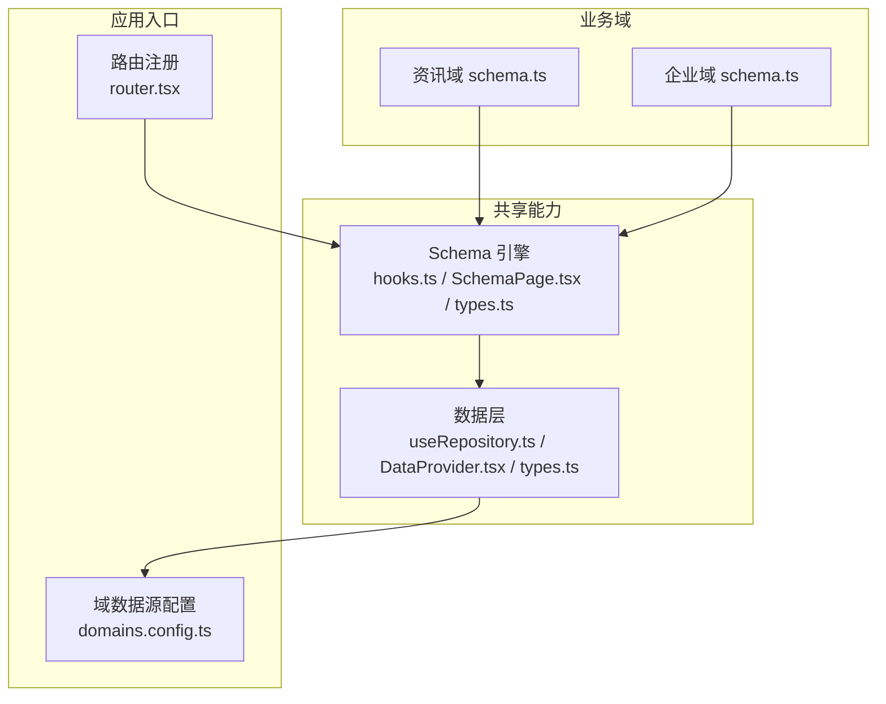
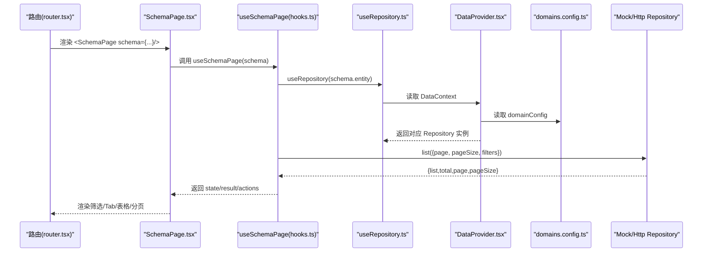
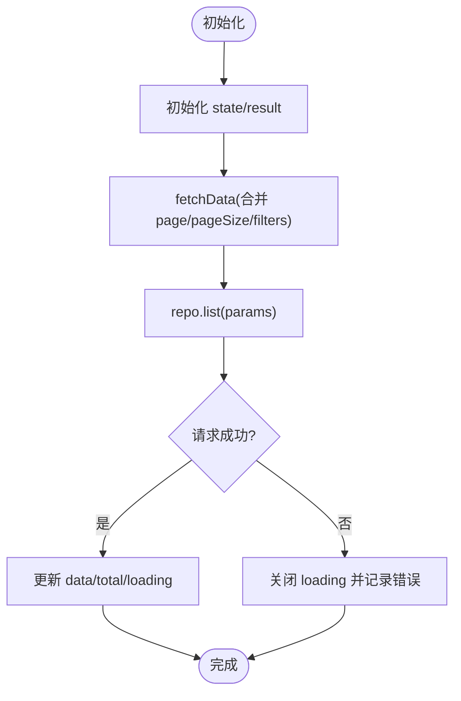
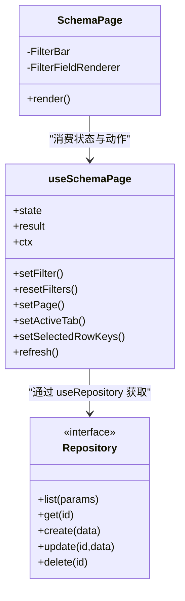
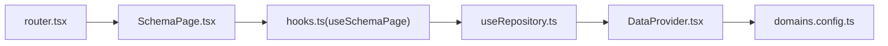

# Schema Hooks

<cite>
**本文引用的文件**   
- [hooks.ts](file://hj-admin/src/shared/schema-engine/hooks.ts)
- [SchemaPage.tsx](file://hj-admin/src/shared/schema-engine/SchemaPage.tsx)
- [types.ts](file://hj-admin/src/shared/schema-engine/types.ts)
- [useRepository.ts](file://hj-admin/src/shared/data/useRepository.ts)
- [DataProvider.tsx](file://hj-admin/src/shared/data/DataProvider.tsx)
- [types.ts（数据层）](file://hj-admin/src/shared/data/types.ts)
- [domains.config.ts](file://hj-admin/src/config/domains.config.ts)
- [router.tsx](file://hj-admin/src/app/router.tsx)
- [schema.ts（资讯域）](file://hj-admin/src/domains/news/schema.ts)
- [schema.ts（企业域）](file://hj-admin/src/domains/enterprise/schema.ts)
</cite>

## 目录
1. [简介](#简介)
2. [项目结构](#项目结构)
3. [核心组件](#核心组件)
4. [架构总览](#架构总览)
5. [详细组件分析](#详细组件分析)
6. [依赖关系分析](#依赖关系分析)
7. [性能与可扩展性](#性能与可扩展性)
8. [集成指南：React Query、Formik 等](#集成指南react-queryformik-等)
9. [自定义 Hook 开发指南与最佳实践](#自定义-hook-开发指南与最佳实践)
10. [常见问题排查](#常见问题排查)
11. [结论](#结论)

## 简介
本文件围绕 Schema 驱动的列表页体系，深入解析 useSchemaPage Hook 的状态管理机制与渲染流程，涵盖数据获取、分页处理、筛选逻辑、Tab 分组、行选择与操作上下文。文档同时给出与 React 生态库（如 React Query、Formik）的集成思路，并提供自定义 Hook 的开发指南与最佳实践，辅以丰富的使用示例与问题排查建议。

## 项目结构
该工程采用“领域 + 配置驱动”的组织方式：
- shared/schema-engine：提供 Schema 引擎的核心类型、Hook 与通用页面渲染器
- shared/data：数据访问抽象（Repository）、数据源提供者（DataProvider）与仓库钩子（useRepository）
- config/domains.config.ts：按域切换数据源模式（mock/http）
- app/router.tsx：根据路由声明自动注入 SchemaPage 或懒加载自定义组件
- domains/*：各业务域的 manifest、schema、repository、mock 等

图表来源
- [router.tsx:34-57](file://hj-admin/src/app/router.tsx#L34-L57)
- [hooks.ts:1-106](file://hj-admin/src/shared/schema-engine/hooks.ts#L1-L106)
- [SchemaPage.tsx:1-226](file://hj-admin/src/shared/schema-engine/SchemaPage.tsx#L1-L226)
- [types.ts（Schema 引擎）:1-216](file://hj-admin/src/shared/schema-engine/types.ts#L1-L216)
- [useRepository.ts:1-24](file://hj-admin/src/shared/data/useRepository.ts#L1-L24)
- [DataProvider.tsx:1-43](file://hj-admin/src/shared/data/DataProvider.tsx#L1-L43)
- [domains.config.ts:1-18](file://hj-admin/src/config/domains.config.ts#L1-L18)
- [schema.ts（资讯域）:1-123](file://hj-admin/src/domains/news/schema.ts#L1-L123)
- [schema.ts（企业域）:1-64](file://hj-admin/src/domains/enterprise/schema.ts#L1-L64)

章节来源
- [router.tsx:34-57](file://hj-admin/src/app/router.tsx#L34-L57)
- [domains.config.ts:1-18](file://hj-admin/src/config/domains.config.ts#L1-L18)

## 核心组件
- useSchemaPage Hook：封装筛选、分页、Tab、选中行、数据加载等状态与行为，统一通过 Repository 进行数据访问
- SchemaPage 组件：基于 PageSchema 自动渲染筛选栏、Tab、表格、分页与行操作列
- 数据层抽象：Repository 接口、useRepository 钩子、DataProvider 上下文与 domainConfig 数据源切换

章节来源
- [hooks.ts:1-106](file://hj-admin/src/shared/schema-engine/hooks.ts#L1-L106)
- [SchemaPage.tsx:1-226](file://hj-admin/src/shared/schema-engine/SchemaPage.tsx#L1-L226)
- [useRepository.ts:1-24](file://hj-admin/src/shared/data/useRepository.ts#L1-L24)
- [DataProvider.tsx:1-43](file://hj-admin/src/shared/data/DataProvider.tsx#L1-L43)
- [types.ts（数据层）:1-36](file://hj-admin/src/shared/data/types.ts#L1-L36)

## 架构总览
Schema 驱动页面的关键路径：
- 路由匹配到带 schema 的路由时，直接渲染 SchemaPage
- SchemaPage 调用 useSchemaPage(schema)，内部通过 useRepository(entity) 获取对应 Repository
- 当 page/pageSize/filters 变化时，触发 fetchData，调用 repo.list(params) 拉取数据并更新 state/result
- 表格渲染使用 columns 与 rowActions；Tab 对本地数据进行过滤展示

图表来源
- [router.tsx:34-57](file://hj-admin/src/app/router.tsx#L34-L57)
- [SchemaPage.tsx:76-110](file://hj-admin/src/shared/schema-engine/SchemaPage.tsx#L76-L110)
- [hooks.ts:20-57](file://hj-admin/src/shared/schema-engine/hooks.ts#L20-L57)
- [useRepository.ts:8-23](file://hj-admin/src/shared/data/useRepository.ts#L8-L23)
- [DataProvider.tsx:26-41](file://hj-admin/src/shared/data/DataProvider.tsx#L26-L41)
- [domains.config.ts:7-18](file://hj-admin/src/config/domains.config.ts#L7-L18)

## 详细组件分析

### useSchemaPage Hook 深度解析
- 输入参数
  - schema: PageSchema<T>，包含 entity、filters、columns、pagination、rowActions、tabs 等
- 内部状态
  - state: loading、data、total、page、pageSize、filters、activeTab、selectedRowKeys
  - result: 原始分页结果（list、total、page、pageSize），便于上层直接使用
- 数据获取
  - 依赖 page、pageSize、filters 变化时自动触发 fetchData
  - 合并 overrides 后调用 repo.list(params)
  - 成功时更新 data/total/loading；失败时仅关闭 loading 并打印错误
- 筛选与重置
  - setFilter(name, value)：更新 filters 并回退到第 1 页
  - resetFilters()：清空 filters 并回到第 1 页
- 分页控制
  - setPage(page, pageSize?)：更新当前页与每页条数
- Tab 切换
  - setActiveTab(key)：切换 activeTab 并回退到第 1 页
- 行选择
  - setSelectedRowKeys(keys)：批量操作所需
- 刷新
  - refresh()：重新执行 fetchData
- 操作上下文
  - ctx: { refresh, navigate, showModal }，其中 navigate/showModal 由 SchemaPage 注入真实实现

图表来源
- [hooks.ts:20-57](file://hj-admin/src/shared/schema-engine/hooks.ts#L20-L57)
- [hooks.ts:59-85](file://hj-admin/src/shared/schema-engine/hooks.ts#L59-L85)

章节来源
- [hooks.ts:1-106](file://hj-admin/src/shared/schema-engine/hooks.ts#L1-L106)

### SchemaPage 组件与交互
- 标题与描述：从 schema.title/description 渲染
- Tab 分组：根据 activeTab 对本地 data 进行 filter 过滤显示
- 筛选栏：根据 schema.filters 动态渲染 select/input/dateRange 等控件，onChange 调用 setFilter，点击重置调用 resetFilters
- 工具栏操作：schema.toolbarActions 渲染按钮
- 表格：
  - columns：支持字符串渲染器引用或函数渲染器
  - rowActions：支持条件可见、确认弹窗、导航跳转与 onClick 回调
  - 批量选择：根据 schema.batchActions 启用 selectedRowKeys 与 onChange
  - 分页：current/pageSize/total 绑定 state，onChange 调用 setPage
- 操作上下文：将 refresh 与 navigate 注入 ctx，供行操作使用

图表来源
- [SchemaPage.tsx:76-226](file://hj-admin/src/shared/schema-engine/SchemaPage.tsx#L76-L226)
- [hooks.ts:20-105](file://hj-admin/src/shared/schema-engine/hooks.ts#L20-L105)
- [types.ts（数据层）:20-27](file://hj-admin/src/shared/data/types.ts#L20-L27)

章节来源
- [SchemaPage.tsx:1-226](file://hj-admin/src/shared/schema-engine/SchemaPage.tsx#L1-L226)

### 数据层与数据源切换
- Repository 接口：统一 list/get/create/update/delete 契约
- useRepository：从 DataContext 中按 entity 名称获取 Repository，未找到时返回空操作的 fallback，避免崩溃
- DataProvider：根据 domainConfig 为每个域创建 MockRepository 或 HttpRepository，并通过 Context 提供
- domains.config.ts：集中配置各域的数据源模式（mock/http），切换时无需改动 Schema 与页面代码

章节来源
- [useRepository.ts:1-24](file://hj-admin/src/shared/data/useRepository.ts#L1-L24)
- [DataProvider.tsx:1-43](file://hj-admin/src/shared/data/DataProvider.tsx#L1-L43)
- [types.ts（数据层）:1-36](file://hj-admin/src/shared/data/types.ts#L1-L36)
- [domains.config.ts:1-18](file://hj-admin/src/config/domains.config.ts#L1-L18)

### 典型 Schema 示例
- 资讯域
  - newsPoolSchema：多筛选项（来源/状态/关联状态/关键词/时间范围）、标签/实体计数/状态徽章等列渲染、行操作（编辑/发布/下架）
  - newsPublishedSchema：快速筛选 quickFilters、Tabs 分组（全部/已关联/待补关联）
  - newsSourcesSchema：数据源管理（启用/停用）
- 企业域
  - enterprisePoolSchema：待处理池，含 Tabs（待关联/无关联待确认）
  - enterpriseConfirmedSchema：已确认企业，含 Tabs（待分类/已分类）

章节来源
- [schema.ts（资讯域）:1-123](file://hj-admin/src/domains/news/schema.ts#L1-L123)
- [schema.ts（企业域）:1-64](file://hj-admin/src/domains/enterprise/schema.ts#L1-L64)

## 依赖关系分析
- SchemaPage 依赖 useSchemaPage 提供的状态与动作
- useSchemaPage 依赖 useRepository 获取 Repository
- useRepository 依赖 DataProvider 提供的上下文
- DataProvider 依赖 domains.config.ts 决定具体 Repository 实现
- 路由层 router.tsx 在匹配到带 schema 的路由时直接渲染 SchemaPage

图表来源
- [router.tsx:34-57](file://hj-admin/src/app/router.tsx#L34-L57)
- [SchemaPage.tsx:76-110](file://hj-admin/src/shared/schema-engine/SchemaPage.tsx#L76-L110)
- [hooks.ts:20-57](file://hj-admin/src/shared/schema-engine/hooks.ts#L20-L57)
- [useRepository.ts:8-23](file://hj-admin/src/shared/data/useRepository.ts#L8-L23)
- [DataProvider.tsx:26-41](file://hj-admin/src/shared/data/DataProvider.tsx#L26-L41)
- [domains.config.ts:7-18](file://hj-admin/src/config/domains.config.ts#L7-L18)

章节来源
- [router.tsx:34-57](file://hj-admin/src/app/router.tsx#L34-L57)
- [hooks.ts:20-57](file://hj-admin/src/shared/schema-engine/hooks.ts#L20-L57)
- [useRepository.ts:8-23](file://hj-admin/src/shared/data/useRepository.ts#L8-L23)
- [DataProvider.tsx:26-41](file://hj-admin/src/shared/data/DataProvider.tsx#L26-L41)
- [domains.config.ts:7-18](file://hj-admin/src/config/domains.config.ts#L7-L18)

## 性能与可扩展性
- 数据获取时机
  - 仅在 page/pageSize/filters 变化时触发请求，避免重复请求
  - 建议在 Repository 层增加去抖/缓存策略以优化网络开销
- 前端过滤
  - Tabs 的 filter 在当前页数据上进行本地过滤，适合轻量场景；大数据量建议在后端实现服务端过滤
- 渲染性能
  - 列渲染支持字符串渲染器引用，减少内联函数创建，提升稳定性
  - 大表格可考虑虚拟滚动（在 Table 层面扩展）
- 可扩展点
  - 新增渲染器：在渲染器注册表中注册，Schema 中以字符串引用
  - 新增筛选控件：在 FilterFieldRenderer 中扩展 type 分支
  - 新增操作：在 rowActions/toolbarActions/batchActions 中声明式配置

[本节为通用指导，不直接分析具体文件]

## 集成指南：React Query、Formik 等

### 与 React Query 集成思路
- 目标：用 React Query 接管数据获取、缓存与失效策略，保留 useSchemaPage 的状态编排
- 方案要点
  - 将 useSchemaPage 中的 fetchData 替换为 React Query 的查询键（key）：[entity, page, pageSize, filters]
  - 使用 queryClient.invalidateQueries 在表单提交、删除等操作后触发刷新
  - 利用 onSuccess/onError 替代 console.error，统一错误处理与用户提示
  - 保持 state.result 与 state.loading 映射到 React Query 的 data/status，以便兼容现有 UI
- 注意事项
  - 确保 key 稳定且随筛选/分页变化而变更
  - 合理设置 staleTime/garbageCollection，避免频繁重拉
  - 若需要乐观更新，可在 mutation 成功后立即更新本地缓存

[本节为概念性指导，不直接分析具体文件]

### 与 Formik 集成思路
- 目标：在弹窗/抽屉中使用 Formik 管理表单，提交后刷新列表
- 方案要点
  - 在 ModalDef 中声明 formSchema，结合 Formik 的 initialValues/validationSchema
  - 在提交回调中调用 ctx.refresh 或 queryClient.invalidateQueries 刷新列表
  - 联动字段可通过 Formik 的 FieldArray/FormikHelpers 实现
- 注意事项
  - 表单校验失败时不要触发列表刷新
  - 对于大型表单，注意内存占用与卸载清理

[本节为概念性指导，不直接分析具体文件]

## 自定义 Hook 开发指南与最佳实践
- 何时编写自定义 Hook
  - 当需要在多个页面复用复杂状态逻辑（如跨 Tab 的筛选组合、批量操作后的全局刷新）时
- 设计原则
  - 单一职责：一个 Hook 聚焦一类状态（如筛选、分页、批量操作）
  - 可组合：通过参数传入依赖项（如 entity、默认筛选），返回最小必要 API
  - 可测试：尽量纯函数化，避免隐式副作用
- 推荐模式
  - 组合 useSchemaPage：在其基础上叠加业务逻辑（例如记住上次筛选条件、URL 同步）
  - 与数据层解耦：通过 Repository 接口而非直接调用 HTTP
  - 与上下文协作：如需跨组件通信，使用 Context 或状态管理库
- 示例步骤
  - 定义 Hook 签名与返回类型
  - 内部使用 useState/useEffect/useCallback 管理状态与副作用
  - 暴露 setFilter/resetFilters/setPage 等原子方法，供外部组合
  - 在 SchemaPage 或自定义组件中消费 Hook 返回值

[本节为概念性指导，不直接分析具体文件]

## 常见问题排查
- 页面空白或无数据
  - 检查 entity 是否在 domains.config.ts 中正确配置
  - 确认 DataProvider 是否已包裹应用根节点
  - 查看控制台是否有 Repository not found 警告
- 筛选无效
  - 确认 filters 的 name 与后端字段一致
  - 检查 setFilter 是否正确触发 useEffect 依赖变化
- 分页异常
  - 确认后端返回 total 与 list 长度一致
  - 检查 showTotal/showSizeChanger 配置是否符合预期
- 行操作不生效
  - 检查 visible 条件与 confirm 文案
  - 确认 navigateTo 路径模板中的占位符与 record.id 存在
- 渲染器未找到
  - 确认 render 字符串已在渲染器注册表中注册
  - 检查 renderProps 传递是否正确

章节来源
- [useRepository.ts:11-21](file://hj-admin/src/shared/data/useRepository.ts#L11-L21)
- [hooks.ts:48-52](file://hj-admin/src/shared/schema-engine/hooks.ts#L48-L52)
- [SchemaPage.tsx:113-142](file://hj-admin/src/shared/schema-engine/SchemaPage.tsx#L113-L142)

## 结论
useSchemaPage 作为 Schema 驱动列表页的核心 Hook，提供了稳定的状态管理与数据获取机制，配合 SchemaPage 的声明式渲染，显著降低了页面开发成本。通过 Repository 抽象与 DataProvider 的数据源切换，系统具备良好的可扩展性与可维护性。结合 React Query、Formik 等生态库，可进一步提升性能与用户体验。遵循本文的最佳实践与排错建议，可高效构建高质量的后台管理页面。