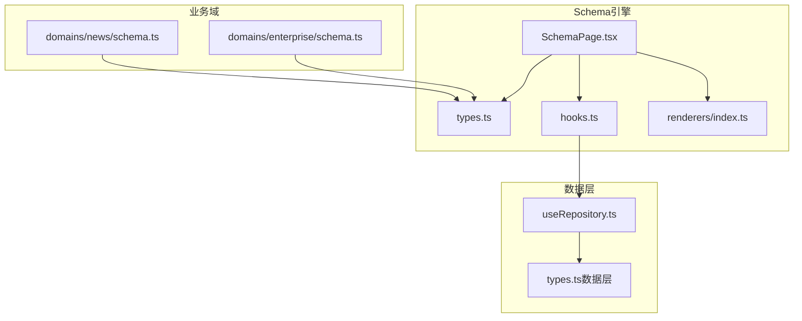
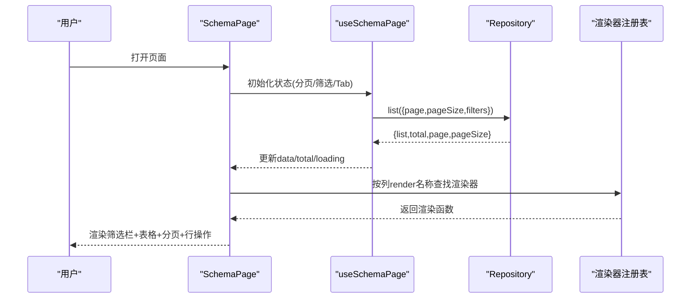
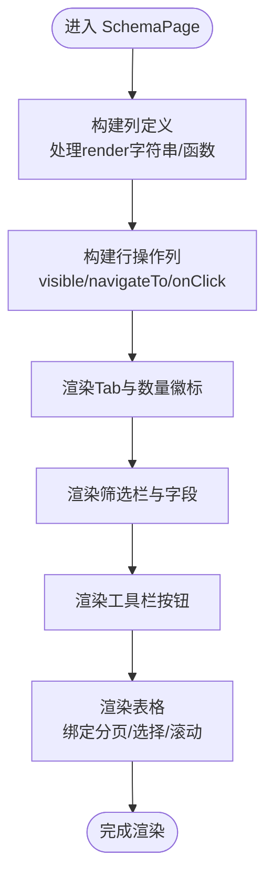
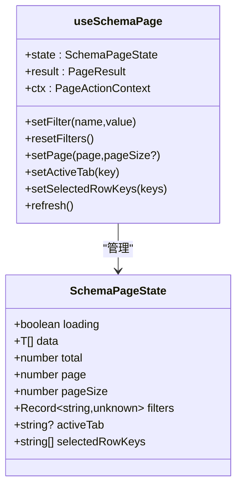
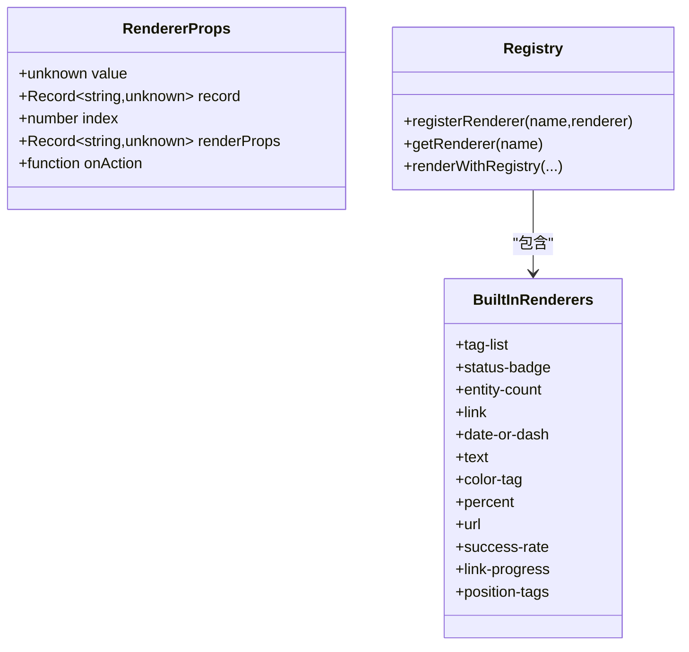
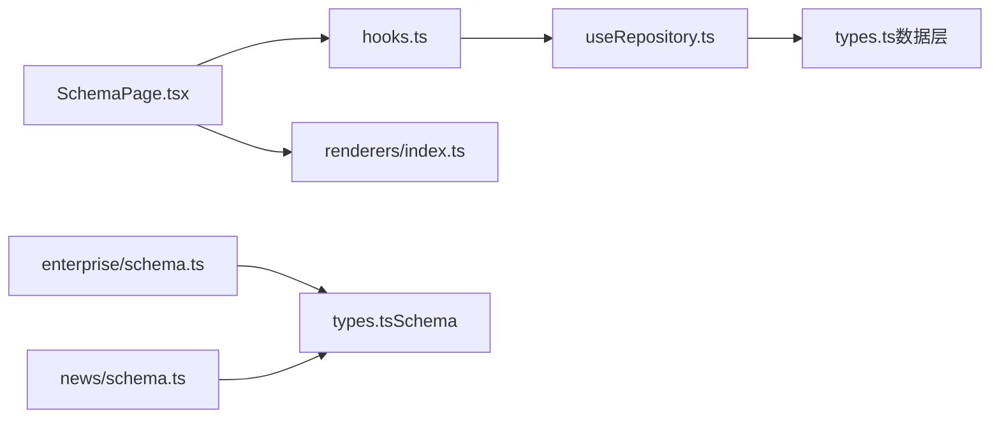
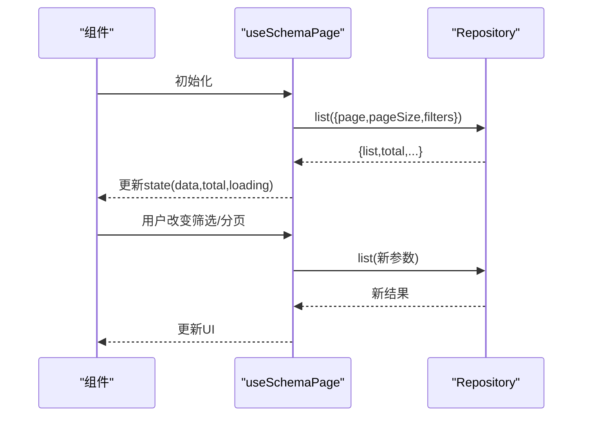

# SchemaPage组件

<cite>
**本文引用的文件**   
- [SchemaPage.tsx](file://hj-admin/src/shared/schema-engine/SchemaPage.tsx)
- [types.ts](file://hj-admin/src/shared/schema-engine/types.ts)
- [hooks.ts](file://hj-admin/src/shared/schema-engine/hooks.ts)
- [renderers/index.ts](file://hj-admin/src/shared/schema-engine/renderers/index.ts)
- [useRepository.ts](file://hj-admin/src/shared/data/useRepository.ts)
- [types.ts（数据层）](file://hj-admin/src/shared/data/types.ts)
- [schema.ts（企业域）](file://hj-admin/src/domains/enterprise/schema.ts)
- [schema.ts（资讯域）](file://hj-admin/src/domains/news/schema.ts)
</cite>

## 目录
1. [简介](#简介)
2. [项目结构](#项目结构)
3. [核心组件与类型](#核心组件与类型)
4. [架构总览](#架构总览)
5. [详细组件分析](#详细组件分析)
6. [依赖关系分析](#依赖关系分析)
7. [性能考量](#性能考量)
8. [疑难排查指南](#疑难排查指南)
9. [结论](#结论)
10. [附录：扩展与实战](#附录扩展与实战)

## 简介
本技术文档围绕 SchemaPage 组件展开，系统性阐述其实现原理、渲染流程、状态管理集成、Props 接口、生命周期行为与性能优化策略。同时覆盖复杂业务场景的处理方式（如嵌套表格、条件渲染、异步数据加载），并提供自定义扩展点开发指南（新增渲染器与行为）、实际使用示例路径与调试技巧。

## 项目结构
SchemaPage 位于共享的 schema-engine 模块中，配合 types、hooks 与 renderers 共同构成“配置驱动页面”的核心能力；数据访问通过 shared/data 层的 Repository 抽象完成；具体业务域的页面由 domains 下的 schema 定义驱动。

图表来源
- [SchemaPage.tsx:1-226](file://hj-admin/src/shared/schema-engine/SchemaPage.tsx#L1-L226)
- [types.ts:1-216](file://hj-admin/src/shared/schema-engine/types.ts#L1-L216)
- [hooks.ts:1-106](file://hj-admin/src/shared/schema-engine/hooks.ts#L1-L106)
- [renderers/index.ts:1-163](file://hj-admin/src/shared/schema-engine/renderers/index.ts#L1-L163)
- [useRepository.ts:1-24](file://hj-admin/src/shared/data/useRepository.ts#L1-L24)
- [types.ts（数据层）:1-36](file://hj-admin/src/shared/data/types.ts#L1-L36)
- [schema.ts（企业域）:1-64](file://hj-admin/src/domains/enterprise/schema.ts#L1-L64)
- [schema.ts（资讯域）:1-123](file://hj-admin/src/domains/news/schema.ts#L1-L123)

章节来源
- [SchemaPage.tsx:1-226](file://hj-admin/src/shared/schema-engine/SchemaPage.tsx#L1-L226)
- [types.ts:1-216](file://hj-admin/src/shared/schema-engine/types.ts#L1-L216)
- [hooks.ts:1-106](file://hj-admin/src/shared/schema-engine/hooks.ts#L1-L106)
- [renderers/index.ts:1-163](file://hj-admin/src/shared/schema-engine/renderers/index.ts#L1-L163)
- [useRepository.ts:1-24](file://hj-admin/src/shared/data/useRepository.ts#L1-L24)
- [types.ts（数据层）:1-36](file://hj-admin/src/shared/data/types.ts#L1-L36)
- [schema.ts（企业域）:1-64](file://hj-admin/src/domains/enterprise/schema.ts#L1-L64)
- [schema.ts（资讯域）:1-123](file://hj-admin/src/domains/news/schema.ts#L1-L123)

## 核心组件与类型
- SchemaPage 主组件：根据 PageSchema 自动渲染筛选栏、Tab、表格、分页与行操作列，并支持列渲染器的字符串引用或函数渲染。
- useSchemaPage Hook：封装筛选、分页、Tab、选中行、数据加载等状态与副作用，统一调用 Repository.list 获取分页数据。
- 渲染器注册表：提供 registerRenderer/getRenderer/renderWithRegistry 机制，内置多种常用渲染器（标签、状态徽章、链接、百分比、URL、成功率等）。
- 类型体系：定义 FilterField、ColumnDef、RowAction、BatchAction、ToolbarAction、ModalDef、TabDef、FormSchema、PageSchema、RouteDef、DomainManifest、PageActionContext 等。

章节来源
- [SchemaPage.tsx:75-226](file://hj-admin/src/shared/schema-engine/SchemaPage.tsx#L75-L226)
- [hooks.ts:20-106](file://hj-admin/src/shared/schema-engine/hooks.ts#L20-L106)
- [renderers/index.ts:19-46](file://hj-admin/src/shared/schema-engine/renderers/index.ts#L19-L46)
- [types.ts:6-216](file://hj-admin/src/shared/schema-engine/types.ts#L6-L216)

## 架构总览
SchemaPage 作为“通用列表页渲染器”，将“写页面”降维为“写配置”。其核心流程如下：
- 读取 PageSchema 配置，解析 filters/columns/tabs/pagination/rowActions 等。
- 使用 useSchemaPage 维护本地状态并触发数据请求。
- 基于 columns.render 字段，按字符串名称从渲染器注册表中查找渲染器，或执行自定义函数。
- 组装最终列定义（含行操作列），渲染 Ant Design Table 及筛选栏、工具栏、分页等。

图表来源
- [SchemaPage.tsx:75-226](file://hj-admin/src/shared/schema-engine/SchemaPage.tsx#L75-L226)
- [hooks.ts:36-57](file://hj-admin/src/shared/schema-engine/hooks.ts#L36-L57)
- [renderers/index.ts:32-46](file://hj-admin/src/shared/schema-engine/renderers/index.ts#L32-L46)

## 详细组件分析

### SchemaPage 主组件
- 职责
  - 解析 PageSchema，构建列定义与行操作列。
  - 渲染筛选栏（FilterBar）与每个筛选字段（FilterFieldRenderer）。
  - 渲染 Tab 分组与数量徽标。
  - 渲染工具栏按钮。
  - 渲染表格（Antd Table），绑定分页、选择、滚动等。
- 关键逻辑
  - 列渲染：当列 render 为字符串时，通过 renderWithRegistry 动态渲染；否则直接调用自定义函数。
  - 行操作列：根据 visible 条件过滤，支持 navigateTo 路由替换 :id，以及 onClick 回调。
  - Tab 过滤：根据 activeTab 对应的 filter 函数对数据进行前端过滤。
  - 上下文注入：向行操作提供 refresh/navigate/showModal 等上下文。

图表来源
- [SchemaPage.tsx:90-144](file://hj-admin/src/shared/schema-engine/SchemaPage.tsx#L90-L144)
- [SchemaPage.tsx:146-180](file://hj-admin/src/shared/schema-engine/SchemaPage.tsx#L146-L180)
- [SchemaPage.tsx:182-221](file://hj-admin/src/shared/schema-engine/SchemaPage.tsx#L182-L221)

章节来源
- [SchemaPage.tsx:75-226](file://hj-admin/src/shared/schema-engine/SchemaPage.tsx#L75-L226)

### useSchemaPage Hook
- 职责
  - 维护 loading/data/total/page/pageSize/filters/activeTab/selectedRowKeys 等状态。
  - 监听 page/pageSize/filters 变化，触发数据加载。
  - 提供 setFilter/resetFilters/setPage/setActiveTab/setSelectedRowKeys/refresh 等方法。
- 数据流
  - 通过 useRepository(entity) 获取对应实体的 Repository。
  - 调用 repo.list(params) 获取分页结果，更新 state 与 result。
  - 错误处理：捕获异常并设置 loading=false。

图表来源
- [hooks.ts:9-18](file://hj-admin/src/shared/schema-engine/hooks.ts#L9-L18)
- [hooks.ts:20-106](file://hj-admin/src/shared/schema-engine/hooks.ts#L20-L106)

章节来源
- [hooks.ts:20-106](file://hj-admin/src/shared/schema-engine/hooks.ts#L20-L106)

### 渲染器注册表与内置渲染器
- 注册机制
  - registerRenderer(name, renderer)：注册命名渲染器。
  - getRenderer(name)：查询已注册的渲染器。
  - renderWithRegistry(name, value, record, index, renderProps, onAction)：查找并执行渲染器。
- 内置渲染器
  - tag-list：标签列表展示。
  - status-badge：带颜色映射的状态徽章。
  - entity-count：实体计数并可触发 onAction。
  - link：可导航链接，支持模板 :id 替换。
  - date-or-dash：日期或破折号占位。
  - text：纯文本。
  - color-tag：带颜色的标签。
  - percent：百分比，按阈值着色。
  - url：外部链接，超长截断。
  - success-rate：成功率等级显示。
  - link-progress：关联进度文本。
  - position-tags：位置标签集合。

图表来源
- [renderers/index.ts:9-17](file://hj-admin/src/shared/schema-engine/renderers/index.ts#L9-L17)
- [renderers/index.ts:19-46](file://hj-admin/src/shared/schema-engine/renderers/index.ts#L19-L46)
- [renderers/index.ts:48-163](file://hj-admin/src/shared/schema-engine/renderers/index.ts#L48-L163)

章节来源
- [renderers/index.ts:1-163](file://hj-admin/src/shared/schema-engine/renderers/index.ts#L1-L163)

### 类型体系概览
- 筛选字段 FilterField：支持 select/input/dateRange/cascader/treeSelect/radioGroup，可配置选项、宽度、占位符、默认值与异步选项加载。
- 列定义 ColumnDef：支持 width/minWidth/fixed/align/ellipsis/sorter，render 可为字符串或函数，并携带 renderProps。
- 行操作 RowAction：支持可见性控制、点击回调、声明式导航、确认提示。
- 批量操作 BatchAction、工具栏 ToolbarAction、弹窗 ModalDef、Tab 分组 TabDef、表单 FormSchema/FormFieldDef。
- 完整页面 PageSchema：聚合上述所有配置项，包括 entity、filters、columns、pagination、rowActions/batchActions/toolbarActions、modals、tabs、quickFilters。
- 域清单 DomainManifest 与路由 RouteDef：用于菜单与懒加载自定义组件。
- 页面操作上下文 PageActionContext：提供 refresh/navigate/showModal。

章节来源
- [types.ts:6-216](file://hj-admin/src/shared/schema-engine/types.ts#L6-L216)

## 依赖关系分析
- SchemaPage 依赖
  - hooks.useSchemaPage：状态与数据加载。
  - renderers.renderWithRegistry：列渲染器解析与执行。
  - antd 组件：Table/Select/Input/Button/Space/Badge/Tabs/Modal/DatePicker。
  - react-router-dom：useNavigate 进行路由跳转。
- useSchemaPage 依赖
  - shared/data/useRepository：按 entity 获取 Repository。
  - shared/data/types：QueryParams/PageResult/Repository 契约。
- 业务域 schema 依赖
  - 通过 PageSchema 描述页面，引用内置渲染器与路由模板。

图表来源
- [SchemaPage.tsx:1-226](file://hj-admin/src/shared/schema-engine/SchemaPage.tsx#L1-L226)
- [hooks.ts:1-106](file://hj-admin/src/shared/schema-engine/hooks.ts#L1-L106)
- [useRepository.ts:1-24](file://hj-admin/src/shared/data/useRepository.ts#L1-L24)
- [types.ts（数据层）:1-36](file://hj-admin/src/shared/data/types.ts#L1-L36)
- [schema.ts（企业域）:1-64](file://hj-admin/src/domains/enterprise/schema.ts#L1-L64)
- [schema.ts（资讯域）:1-123](file://hj-admin/src/domains/news/schema.ts#L1-L123)

章节来源
- [SchemaPage.tsx:1-226](file://hj-admin/src/shared/schema-engine/SchemaPage.tsx#L1-L226)
- [hooks.ts:1-106](file://hj-admin/src/shared/schema-engine/hooks.ts#L1-L106)
- [useRepository.ts:1-24](file://hj-admin/src/shared/data/useRepository.ts#L1-L24)
- [types.ts（数据层）:1-36](file://hj-admin/src/shared/data/types.ts#L1-L36)
- [schema.ts（企业域）:1-64](file://hj-admin/src/domains/enterprise/schema.ts#L1-L64)
- [schema.ts（资讯域）:1-123](file://hj-admin/src/domains/news/schema.ts#L1-L123)

## 性能考量
- 计算缓存
  - 列定义与行操作列通过 useMemo 缓存，避免每次渲染重复计算。
  - 当前页数据 displayData 通过 useMemo 结合 activeTab 过滤，减少不必要的重排。
- 事件与回调
  - 使用 useCallback 包装 setFilter/resetFilters/setPage/setActiveTab/setSelectedRowKeys/refresh，降低子组件重渲染概率。
- 渲染器查找
  - 列 render 为字符串时走注册表查找，避免在列定义中创建闭包函数。
- 建议
  - 大数据量场景下，优先启用后端分页与排序，避免前端全量过滤。
  - 复杂列渲染尽量复用内置渲染器或注册轻量级渲染器，减少闭包开销。
  - 对频繁变化的筛选字段，考虑防抖后再触发刷新（可在上层封装）。

章节来源
- [SchemaPage.tsx:90-144](file://hj-admin/src/shared/schema-engine/SchemaPage.tsx#L90-L144)
- [SchemaPage.tsx:146-152](file://hj-admin/src/shared/schema-engine/SchemaPage.tsx#L146-L152)
- [hooks.ts:59-85](file://hj-admin/src/shared/schema-engine/hooks.ts#L59-L85)

## 疑难排查指南
- 常见错误
  - Repository 未注册：控制台会输出警告，并返回空操作的 fallback Repository，导致列表为空。检查 domains.config 是否注册了 entity 对应的 Repository。
  - 渲染器未找到：控制台输出警告，回退为字符串渲染。检查 render 名称是否正确且已在注册表中注册。
  - 路由参数缺失：navigateTo 模板中的 :id 需确保记录存在 id 字段，否则会拼接空串。
- 定位方法
  - 在浏览器控制台查看 [useSchemaPage] Failed to fetch data 日志，确认网络与后端响应格式是否符合 PageResult。
  - 在控制台查看 [SchemaEngine] Renderer "xxx" not found in registry 日志，确认渲染器名称与注册顺序。
  - 使用 React DevTools 检查 SchemaPage 的 props.schema 与内部 state 的变化。

章节来源
- [useRepository.ts:11-23](file://hj-admin/src/shared/data/useRepository.ts#L11-L23)
- [renderers/index.ts:40-46](file://hj-admin/src/shared/schema-engine/renderers/index.ts#L40-L46)
- [hooks.ts:48-52](file://hj-admin/src/shared/schema-engine/hooks.ts#L48-L52)

## 结论
SchemaPage 以“配置即页面”的方式，将常见的列表页需求标准化、可配置化。通过类型驱动的 PageSchema、统一的 Repository 数据契约、可扩展的渲染器注册表，实现了高内聚低耦合的架构。配合 useSchemaPage 的状态管理与 Ant Design 组件生态，能够快速搭建复杂的运营后台页面，并通过最小改动满足多样化业务场景。

## 附录：扩展与实战

### Props 接口与使用示例
- 入口组件 Props
  - schema: PageSchema<T>，包含标题、描述、实体名、筛选、列、分页、操作、弹窗、Tab 等配置。
- 使用示例路径
  - 企业域待处理池：[schema.ts（企业域）:7-31](file://hj-admin/src/domains/enterprise/schema.ts#L7-L31)
  - 企业域已确认池：[schema.ts（企业域）:34-64](file://hj-admin/src/domains/enterprise/schema.ts#L34-L64)
  - 资讯池：[schema.ts（资讯域）:22-53](file://hj-admin/src/domains/news/schema.ts#L22-L53)
  - 已发布资讯：[schema.ts（资讯域）:56-94](file://hj-admin/src/domains/news/schema.ts#L56-L94)
  - 数据源管理：[schema.ts（资讯域）:97-123](file://hj-admin/src/domains/news/schema.ts#L97-L123)

章节来源
- [types.ts:132-174](file://hj-admin/src/shared/schema-engine/types.ts#L132-L174)
- [schema.ts（企业域）:7-64](file://hj-admin/src/domains/enterprise/schema.ts#L7-L64)
- [schema.ts（资讯域）:22-123](file://hj-admin/src/domains/news/schema.ts#L22-L123)

### 生命周期与数据流
- 初次加载
  - 组件挂载后，useSchemaPage 的 useEffect 触发 fetchData，调用 repository.list 获取数据。
- 依赖变化
  - page/pageSize/filters 变化时重新加载数据；activeTab 切换重置到第一页。
- 刷新
  - 通过 ctx.refresh 或外部调用 hook 暴露的 refresh 方法触发重新拉取。

图表来源
- [hooks.ts:36-57](file://hj-admin/src/shared/schema-engine/hooks.ts#L36-L57)
- [hooks.ts:71-85](file://hj-admin/src/shared/schema-engine/hooks.ts#L71-L85)

章节来源
- [hooks.ts:36-85](file://hj-admin/src/shared/schema-engine/hooks.ts#L36-L85)

### 复杂业务场景处理
- 嵌套表格
  - 方案一：在列 render 中使用函数渲染，返回包含子 Table 的组件。
  - 方案二：注册专用渲染器（如 nested-table），在注册器中实现展开/折叠与子表数据加载。
- 条件渲染
  - 行操作 visible(record) 控制显示；列 render 函数或渲染器内部根据 record/value 分支渲染。
- 异步数据加载
  - 筛选字段支持 fetchOptions 异步加载选项；列渲染器可通过 onAction 触发父级动作（如打开弹窗、加载详情）。
  - 建议在 useSchemaPage 外层封装防抖与重试逻辑，提升用户体验。

章节来源
- [types.ts:14-24](file://hj-admin/src/shared/schema-engine/types.ts#L14-L24)
- [renderers/index.ts:78-89](file://hj-admin/src/shared/schema-engine/renderers/index.ts#L78-L89)

### 自定义扩展点开发指南
- 新增渲染器
  - 在 renderers/index.ts 中调用 registerRenderer('your-renderer', rendererFn)。
  - 在列定义中使用 render: 'your-renderer' 与 renderProps 传递参数。
- 自定义列渲染函数
  - 直接在 ColumnDef.render 中传入函数，接收 value/record/index 并返回 ReactNode。
- 自定义行操作
  - 在 rowActions 中配置 key/label/type/visible/confirm/navigateTo/onClick。
  - 使用 PageActionContext 提供的 refresh/navigate/showModal 进行交互。
- 自定义弹窗/抽屉
  - 在 modals 中声明 formSchema/customComponent/customRender，并在触发处（行操作/批量操作/工具栏）调用 showModal。

章节来源
- [renderers/index.ts:21-46](file://hj-admin/src/shared/schema-engine/renderers/index.ts#L21-L46)
- [types.ts:44-92](file://hj-admin/src/shared/schema-engine/types.ts#L44-L92)
- [SchemaPage.tsx:113-142](file://hj-admin/src/shared/schema-engine/SchemaPage.tsx#L113-L142)

### 调试技巧
- 控制台日志
  - 查看 [useSchemaPage] Failed to fetch data 与 [SchemaEngine] Renderer "xxx" not found in registry 提示。
- 网络面板
  - 确认请求参数 page/pageSize/filters 是否符合预期，响应体是否为 {list,total,page,pageSize}。
- 组件树
  - 使用 React DevTools 检查 SchemaPage 的 props.schema 与内部 state 变化，验证 useMemo 与 useCallback 的效果。
- 快速复现
  - 在业务域 schema 中临时添加 console.log 或在渲染器中打印 value/record，定位数据问题。

章节来源
- [hooks.ts:48-52](file://hj-admin/src/shared/schema-engine/hooks.ts#L48-L52)
- [renderers/index.ts:40-46](file://hj-admin/src/shared/schema-engine/renderers/index.ts#L40-L46)