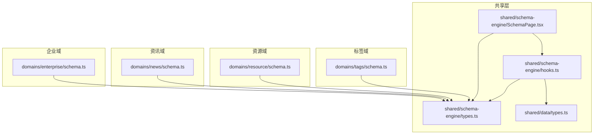
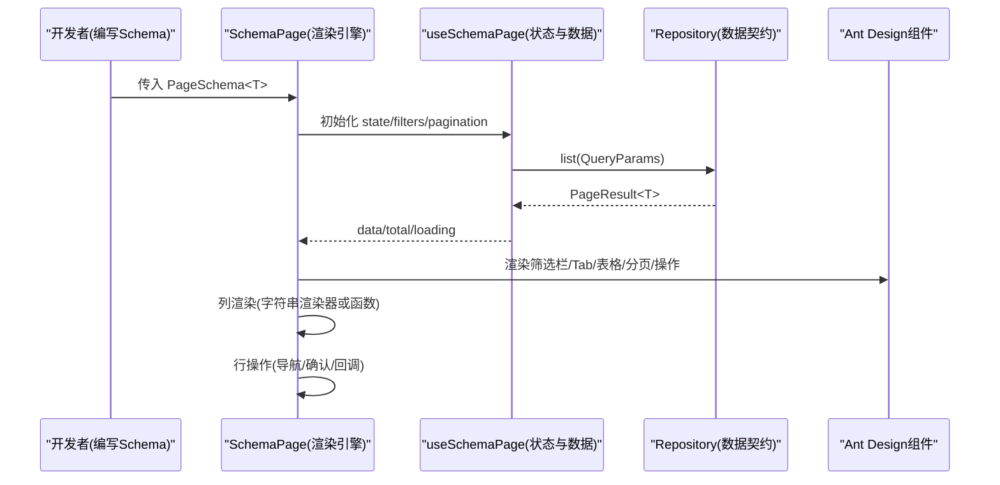
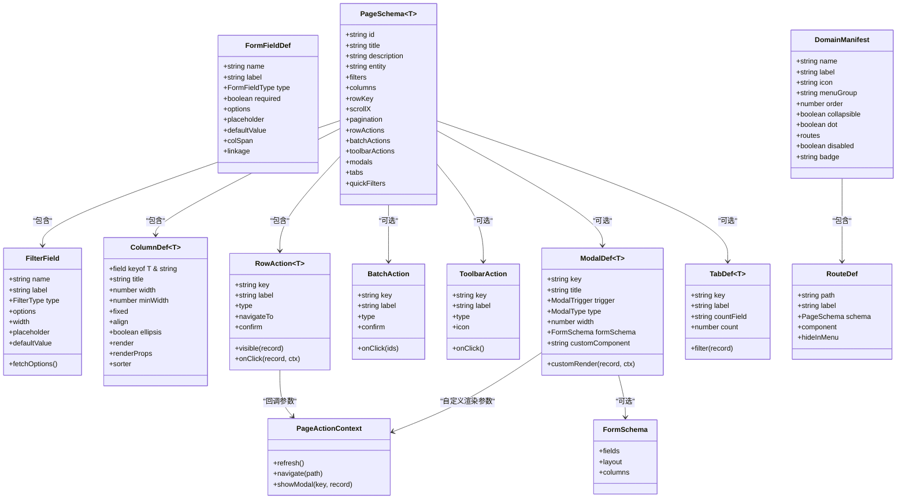
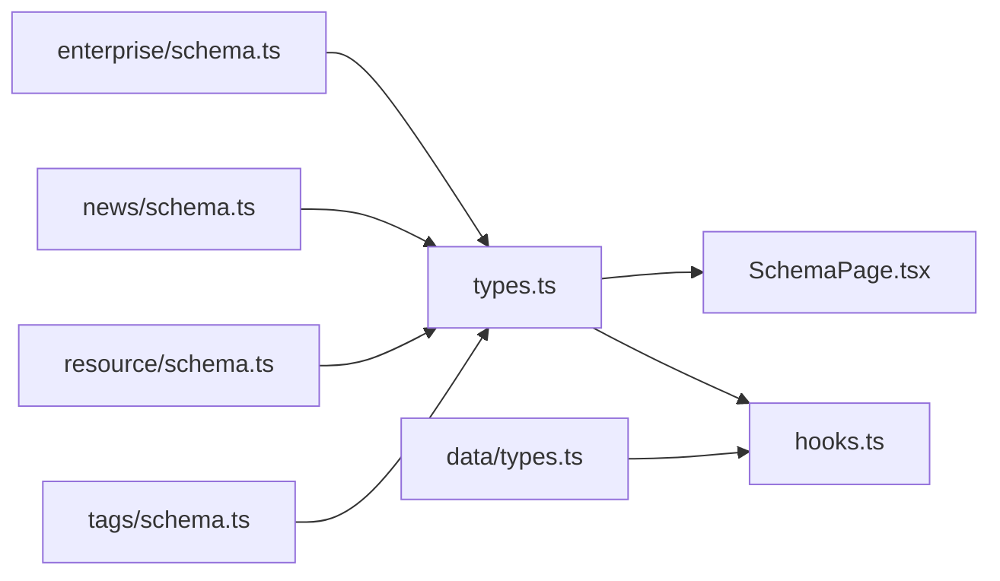

# Schema类型定义

<cite>
**本文引用的文件列表**
- [types.ts](file://hj-admin/src/shared/schema-engine/types.ts)
- [SchemaPage.tsx](file://hj-admin/src/shared/schema-engine/SchemaPage.tsx)
- [hooks.ts](file://hj-admin/src/shared/schema-engine/hooks.ts)
- [enterprise/schema.ts](file://hj-admin/src/domains/enterprise/schema.ts)
- [news/schema.ts](file://hj-admin/src/domains/news/schema.ts)
- [resource/schema.ts](file://hj-admin/src/domains/resource/schema.ts)
- [tags/schema.ts](file://hj-admin/src/domains/tags/schema.ts)
- [data types.ts](file://hj-admin/src/shared/data/types.ts)
</cite>

## 目录
1. [引言](#引言)
2. [项目结构](#项目结构)
3. [核心组件与类型总览](#核心组件与类型总览)
4. [架构概览](#架构概览)
5. [详细类型分析](#详细类型分析)
6. [依赖关系分析](#依赖关系分析)
7. [性能与可扩展性](#性能与可扩展性)
8. [故障排查指南](#故障排查指南)
9. [结论](#结论)
10. [附录：最佳实践与示例路径](#附录最佳实践与示例路径)

## 引言
本文件聚焦于“Schema驱动引擎”的类型系统，系统性梳理并解释所有核心类型定义及其在页面配置中的使用方式。文档覆盖以下关键接口：
- PageSchema 页面配置
- FilterField 筛选字段
- ColumnDef 列定义
- RowAction 行操作
- ModalDef 弹窗定义
- FormSchema 表单模式（用于新增/编辑弹窗）
- TabDef、BatchAction、ToolbarAction 等辅助类型

同时提供类型继承关系图、数据流与渲染流程的可视化说明，以及面向业务页面的最佳实践与扩展机制建议。

## 项目结构
该类型系统位于共享层，被各业务域复用。核心文件分布如下：
- 共享类型与引擎：src/shared/schema-engine/types.ts、SchemaPage.tsx、hooks.ts
- 领域Schema示例：domains/*/schema.ts
- 数据抽象契约：src/shared/data/types.ts

图表来源
- [types.ts:1-216](file://hj-admin/src/shared/schema-engine/types.ts#L1-L216)
- [SchemaPage.tsx:1-226](file://hj-admin/src/shared/schema-engine/SchemaPage.tsx#L1-L226)
- [hooks.ts:1-105](file://hj-admin/src/shared/schema-engine/hooks.ts#L1-L105)
- [data types.ts:1-36](file://hj-admin/src/shared/data/types.ts#L1-L36)
- [enterprise/schema.ts:1-64](file://hj-admin/src/domains/enterprise/schema.ts#L1-L64)
- [news/schema.ts:1-123](file://hj-admin/src/domains/news/schema.ts#L1-L123)
- [resource/schema.ts:1-51](file://hj-admin/src/domains/resource/schema.ts#L1-L51)
- [tags/schema.ts:1-39](file://hj-admin/src/domains/tags/schema.ts#L1-L39)

章节来源
- [types.ts:1-216](file://hj-admin/src/shared/schema-engine/types.ts#L1-L216)
- [SchemaPage.tsx:1-226](file://hj-admin/src/shared/schema-engine/SchemaPage.tsx#L1-L226)
- [hooks.ts:1-105](file://hj-admin/src/shared/schema-engine/hooks.ts#L1-L105)
- [data types.ts:1-36](file://hj-admin/src/shared/data/types.ts#L1-L36)
- [enterprise/schema.ts:1-64](file://hj-admin/src/domains/enterprise/schema.ts#L1-L64)
- [news/schema.ts:1-123](file://hj-admin/src/domains/news/schema.ts#L1-L123)
- [resource/schema.ts:1-51](file://hj-admin/src/domains/resource/schema.ts#L1-L51)
- [tags/schema.ts:1-39](file://hj-admin/src/domains/tags/schema.ts#L1-L39)

## 核心组件与类型总览
- 类型基石：types.ts 定义了全部Schema驱动引擎的核心类型，包括筛选、表格列、行操作、批量操作、工具栏操作、弹窗、Tab分组、表单Schema、完整页面Schema、路由与域清单、页面操作上下文等。
- 运行时渲染：SchemaPage.tsx 根据 PageSchema 自动渲染筛选栏、Tab、表格、分页、行操作等；并通过 renderers 注册表支持字符串渲染器。
- 状态管理：hooks.ts 封装了 useSchemaPage Hook，负责筛选、分页、Tab切换、选中行、数据加载与刷新等操作。
- 数据契约：shared/data/types.ts 定义了 Repository 统一接口与分页结果类型，供 SchemaPage 通过 entity 绑定具体数据源。

章节来源
- [types.ts:1-216](file://hj-admin/src/shared/schema-engine/types.ts#L1-L216)
- [SchemaPage.tsx:1-226](file://hj-admin/src/shared/schema-engine/SchemaPage.tsx#L1-L226)
- [hooks.ts:1-105](file://hj-admin/src/shared/schema-engine/hooks.ts#L1-L105)
- [data types.ts:1-36](file://hj-admin/src/shared/data/types.ts#L1-L36)

## 架构概览
下图展示了从“声明式Schema”到“运行时渲染”的整体流程，以及类型之间的协作关系。

图表来源
- [SchemaPage.tsx:76-226](file://hj-admin/src/shared/schema-engine/SchemaPage.tsx#L76-L226)
- [hooks.ts:20-105](file://hj-admin/src/shared/schema-engine/hooks.ts#L20-L105)
- [data types.ts:21-27](file://hj-admin/src/shared/data/types.ts#L21-L27)

## 详细类型分析

### 类型关系图（代码级）

图表来源
- [types.ts:14-24](file://hj-admin/src/shared/schema-engine/types.ts#L14-L24)
- [types.ts:27-41](file://hj-admin/src/shared/schema-engine/types.ts#L27-L41)
- [types.ts:44-56](file://hj-admin/src/shared/schema-engine/types.ts#L44-L56)
- [types.ts:59-65](file://hj-admin/src/shared/schema-engine/types.ts#L59-L65)
- [types.ts:68-74](file://hj-admin/src/shared/schema-engine/types.ts#L68-L74)
- [types.ts:80-92](file://hj-admin/src/shared/schema-engine/types.ts#L80-L92)
- [types.ts:95-104](file://hj-admin/src/shared/schema-engine/types.ts#L95-L104)
- [types.ts:109-129](file://hj-admin/src/shared/schema-engine/types.ts#L109-L129)
- [types.ts:132-174](file://hj-admin/src/shared/schema-engine/types.ts#L132-L174)
- [types.ts:177-208](file://hj-admin/src/shared/schema-engine/types.ts#L177-L208)
- [types.ts:211-215](file://hj-admin/src/shared/schema-engine/types.ts#L211-L215)

#### 类型属性详解与使用场景

- FilterField（筛选字段）
  - 作用：描述筛选栏中单个输入控件的配置，如文本框、下拉选择、日期范围等。
  - 关键字段：name、label、type、options、width、placeholder、defaultValue、fetchOptions。
  - 使用场景：组合多条件查询，支持静态选项与异步加载选项。
  - 参考实现：筛选栏渲染逻辑见 [SchemaPage.tsx:35-73](file://hj-admin/src/shared/schema-engine/SchemaPage.tsx#L35-L73)。

- ColumnDef（列定义）
  - 作用：描述表格列的展示与交互行为，支持宽度、对齐、固定、省略、排序、渲染器等。
  - 关键字段：field、title、width、minWidth、fixed、align、ellipsis、render、renderProps、sorter。
  - 使用场景：将业务字段映射为表格列，并通过字符串渲染器或函数渲染复杂内容。
  - 参考实现：列转换与渲染器调用见 [SchemaPage.tsx:90-110](file://hj-admin/src/shared/schema-engine/SchemaPage.tsx#L90-L110)。

- RowAction（行操作）
  - 作用：定义每行右侧的操作按钮，支持可见性控制、确认提示、声明式导航与回调。
  - 关键字段：key、label、type、visible、onClick、navigateTo、confirm。
  - 使用场景：编辑、删除、发布、下架等行级操作。
  - 参考实现：行操作列渲染与点击处理见 [SchemaPage.tsx:113-142](file://hj-admin/src/shared/schema-engine/SchemaPage.tsx#L113-L142)。

- ModalDef（弹窗定义）
  - 作用：声明弹窗/抽屉的触发方式、标题、尺寸、表单Schema或自定义组件。
  - 关键字段：key、title、trigger、type、width、formSchema、customComponent、customRender。
  - 使用场景：新增/编辑弹窗、详情查看、扫描录入等。
  - 注意：当前 SchemaPage 未内置弹窗开关逻辑，但类型已预留能力，可在上层注入 showModal 与 customRender。

- FormSchema / FormFieldDef（表单模式）
  - 作用：描述弹窗内表单的结构与字段，支持布局、列数、联动等。
  - 关键字段：fields、layout、columns；字段含 name、label、type、required、options、placeholder、defaultValue、colSpan、linkage。
  - 使用场景：新增/编辑弹窗的表单生成与校验。

- TabDef（Tab分组）
  - 作用：对数据进行分组过滤，支持静态数量与动态过滤函数。
  - 关键字段：key、label、countField、count、filter。
  - 使用场景：待处理/已处理、全部/已关联/待补关联等视图切换。
  - 参考实现：Tab过滤逻辑见 [SchemaPage.tsx:147-152](file://hj-admin/src/shared/schema-engine/SchemaPage.tsx#L147-L152)。

- BatchAction / ToolbarAction（批量与工具栏操作）
  - 作用：批量操作与工具栏按钮，支持图标、类型、点击回调。
  - 使用场景：批量启用/停用、新增、导出等。

- PageSchema（完整页面Schema）
  - 作用：聚合上述所有配置，形成可被 SchemaPage 直接渲染的页面声明。
  - 关键字段：id、title、description、entity、filters、columns、rowKey、scrollX、pagination、rowActions、batchActions、toolbarActions、modals、tabs、quickFilters。
  - 使用场景：每个业务页面对应一个 PageSchema，交由 SchemaPage 渲染。

- RouteDef / DomainManifest（路由与域清单）
  - 作用：描述路由与域菜单信息，支持懒加载自定义组件或基于 Schema 的自动渲染。
  - 使用场景：构建菜单与路由表，结合 Schema 快速生成页面。

- PageActionContext（页面操作上下文）
  - 作用：向行操作与弹窗回调注入 refresh、navigate、showModal 等能力。
  - 使用场景：在 onClick/customRender 中刷新数据、跳转路由、打开弹窗。

章节来源
- [types.ts:14-24](file://hj-admin/src/shared/schema-engine/types.ts#L14-L24)
- [types.ts:27-41](file://hj-admin/src/shared/schema-engine/types.ts#L27-L41)
- [types.ts:44-56](file://hj-admin/src/shared/schema-engine/types.ts#L44-L56)
- [types.ts:59-65](file://hj-admin/src/shared/schema-engine/types.ts#L59-L65)
- [types.ts:68-74](file://hj-admin/src/shared/schema-engine/types.ts#L68-L74)
- [types.ts:80-92](file://hj-admin/src/shared/schema-engine/types.ts#L80-L92)
- [types.ts:95-104](file://hj-admin/src/shared/schema-engine/types.ts#L95-L104)
- [types.ts:109-129](file://hj-admin/src/shared/schema-engine/types.ts#L109-L129)
- [types.ts:132-174](file://hj-admin/src/shared/schema-engine/types.ts#L132-L174)
- [types.ts:177-208](file://hj-admin/src/shared/schema-engine/types.ts#L177-L208)
- [types.ts:211-215](file://hj-admin/src/shared/schema-engine/types.ts#L211-L215)
- [SchemaPage.tsx:35-73](file://hj-admin/src/shared/schema-engine/SchemaPage.tsx#L35-L73)
- [SchemaPage.tsx:90-110](file://hj-admin/src/shared/schema-engine/SchemaPage.tsx#L90-L110)
- [SchemaPage.tsx:113-142](file://hj-admin/src/shared/schema-engine/SchemaPage.tsx#L113-L142)
- [SchemaPage.tsx:147-152](file://hj-admin/src/shared/schema-engine/SchemaPage.tsx#L147-L152)

## 依赖关系分析
- SchemaPage 依赖 types.ts 中的类型定义，并在运行时解析 columns、rowActions、tabs、pagination 等配置。
- hooks.ts 通过 useRepository(schema.entity) 获取数据源，遵循 shared/data/types.ts 的 Repository 契约。
- 各域 schema.ts 仅声明 PageSchema，不关心渲染细节，体现“配置即页面”的设计。

图表来源
- [types.ts:1-216](file://hj-admin/src/shared/schema-engine/types.ts#L1-L216)
- [SchemaPage.tsx:1-226](file://hj-admin/src/shared/schema-engine/SchemaPage.tsx#L1-L226)
- [hooks.ts:1-105](file://hj-admin/src/shared/schema-engine/hooks.ts#L1-L105)
- [data types.ts:1-36](file://hj-admin/src/shared/data/types.ts#L1-L36)
- [enterprise/schema.ts:1-64](file://hj-admin/src/domains/enterprise/schema.ts#L1-L64)
- [news/schema.ts:1-123](file://hj-admin/src/domains/news/schema.ts#L1-L123)
- [resource/schema.ts:1-51](file://hj-admin/src/domains/resource/schema.ts#L1-L51)
- [tags/schema.ts:1-39](file://hj-admin/src/domains/tags/schema.ts#L1-L39)

章节来源
- [types.ts:1-216](file://hj-admin/src/shared/schema-engine/types.ts#L1-L216)
- [SchemaPage.tsx:1-226](file://hj-admin/src/shared/schema-engine/SchemaPage.tsx#L1-L226)
- [hooks.ts:1-105](file://hj-admin/src/shared/schema-engine/hooks.ts#L1-L105)
- [data types.ts:1-36](file://hj-admin/src/shared/data/types.ts#L1-L36)

## 性能与可扩展性
- 列渲染优化：当列较多时，优先使用字符串渲染器（通过注册表）以减少闭包开销；仅在必要时使用函数渲染。
- 筛选与分页：useSchemaPage 在 filters/pageSize 变化时重新请求数据，避免不必要的重渲染。
- 滚动与固定列：通过 scrollX 与 fixed 提升大数据量表格的可读性与性能。
- 扩展点：
  - 列渲染器注册表：通过字符串引用扩展新渲染器，无需修改 SchemaPage。
  - 弹窗与表单：ModalDef 支持 formSchema 与 customComponent，便于按需扩展复杂交互。
  - 快捷筛选：quickFilters 提供常用筛选入口，减少用户操作成本。

[本节为通用指导，不涉及具体文件分析]

## 故障排查指南
- 列字段不显示：检查 ColumnDef.field 是否与后端返回字段一致，并确保 rowKey 正确设置。
- 行操作无效：确认 visible 条件、navigateTo 模板替换是否正确，以及 onClick 是否接收正确的 record 与 ctx。
- 筛选不生效：确保 FilterField.name 与 QueryParams.filters 键名一致，且 useSchemaPage 的 setFilter 已更新 page=1。
- 弹窗未打开：ModalDef 需要上层注入 showModal 与 context，当前 SchemaPage 未内置弹窗开关逻辑。

章节来源
- [SchemaPage.tsx:113-142](file://hj-admin/src/shared/schema-engine/SchemaPage.tsx#L113-L142)
- [hooks.ts:59-77](file://hj-admin/src/shared/schema-engine/hooks.ts#L59-L77)
- [types.ts:80-92](file://hj-admin/src/shared/schema-engine/types.ts#L80-L92)

## 结论
Schema驱动引擎通过强类型的 PageSchema 体系，将“写页面”降维成“写配置”。类型系统清晰、职责分离明确，配合 SchemaPage 与 useSchemaPage Hook，实现了高内聚、低耦合的页面生成机制。通过字符串渲染器与弹窗/表单扩展点，系统具备良好的可扩展性与维护性。

[本节为总结，不涉及具体文件分析]

## 附录：最佳实践与示例路径

- 设计原则
  - 单一职责：每个 PageSchema 只描述一个页面的结构与行为。
  - 类型安全：利用泛型 T 约束列字段与行操作的数据类型，避免运行时错误。
  - 声明式优先：尽量使用字符串渲染器与预置配置，减少手写函数。

- 典型用法路径
  - 企业域待处理池：[enterprise/schema.ts:7-31](file://hj-admin/src/domains/enterprise/schema.ts#L7-L31)
  - 企业域已确认池：[enterprise/schema.ts:34-63](file://hj-admin/src/domains/enterprise/schema.ts#L34-L63)
  - 资讯池：[news/schema.ts:22-53](file://hj-admin/src/domains/news/schema.ts#L22-L53)
  - 已发布资讯（含 quickFilters 与 tabs）：[news/schema.ts:56-94](file://hj-admin/src/domains/news/schema.ts#L56-L94)
  - 数据源管理（含 confirm 与 visible）：[news/schema.ts:97-122](file://hj-admin/src/domains/news/schema.ts#L97-L122)
  - Banner/Icon/Promotion 管理：[resource/schema.ts:7-51](file://hj-admin/src/domains/resource/schema.ts#L7-L51)
  - 资讯与企业标签（含 toolbarActions）：[tags/schema.ts:5-39](file://hj-admin/src/domains/tags/schema.ts#L5-L39)

- 扩展机制建议
  - 新增列渲染器：在 renderers 注册表中添加新渲染器，并在 ColumnDef.render 中以字符串引用。
  - 新增弹窗表单：在 ModalDef.formSchema 中声明字段，或使用 customComponent 引用自定义弹窗组件。
  - 增强操作上下文：在 SchemaPage 中完善 PageActionContext 的 navigate/showModal 注入，使行操作与弹窗能协同工作。

章节来源
- [enterprise/schema.ts:7-31](file://hj-admin/src/domains/enterprise/schema.ts#L7-L31)
- [enterprise/schema.ts:34-63](file://hj-admin/src/domains/enterprise/schema.ts#L34-L63)
- [news/schema.ts:22-53](file://hj-admin/src/domains/news/schema.ts#L22-L53)
- [news/schema.ts:56-94](file://hj-admin/src/domains/news/schema.ts#L56-L94)
- [news/schema.ts:97-122](file://hj-admin/src/domains/news/schema.ts#L97-L122)
- [resource/schema.ts:7-51](file://hj-admin/src/domains/resource/schema.ts#L7-L51)
- [tags/schema.ts:5-39](file://hj-admin/src/domains/tags/schema.ts#L5-L39)