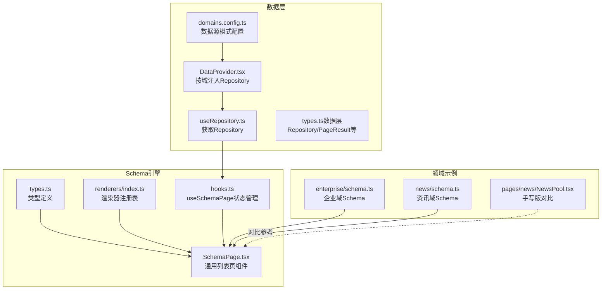
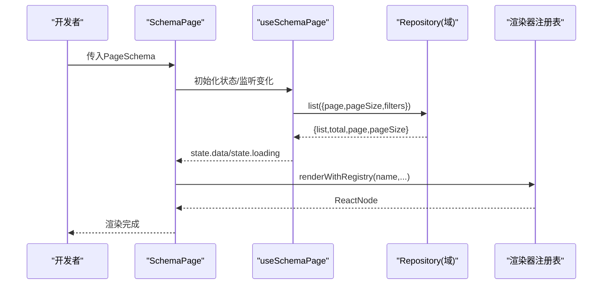
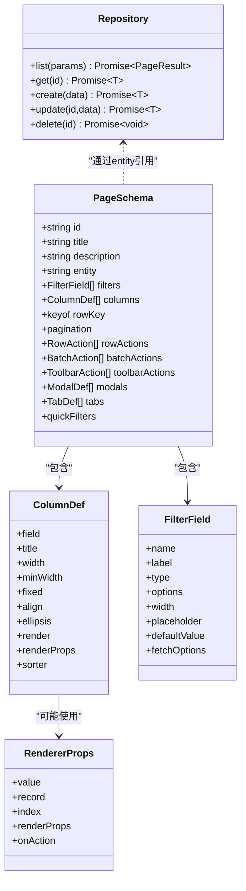

# Schema驱动引擎

<cite>
**本文引用的文件**
- [types.ts](file://hj-admin/src/shared/schema-engine/types.ts)
- [SchemaPage.tsx](file://hj-admin/src/shared/schema-engine/SchemaPage.tsx)
- [hooks.ts](file://hj-admin/src/shared/schema-engine/hooks.ts)
- [renderers/index.ts](file://hj-admin/src/shared/schema-engine/renderers/index.ts)
- [useRepository.ts](file://hj-admin/src/shared/data/useRepository.ts)
- [DataProvider.tsx](file://hj-admin/src/shared/data/DataProvider.tsx)
- [types.ts（数据层）](file://hj-admin/src/shared/data/types.ts)
- [domains.config.ts](file://hj-admin/src/config/domains.config.ts)
- [schema.ts（企业域）](file://hj-admin/src/domains/enterprise/schema.ts)
- [schema.ts（资讯域）](file://hj-admin/src/domains/news/schema.ts)
- [NewsPool.tsx（手写版对比）](file://hj-admin/src/pages/news/NewsPool.tsx)
</cite>

## 目录
1. [简介](#简介)
2. [项目结构](#项目结构)
3. [核心组件与类型](#核心组件与类型)
4. [架构总览](#架构总览)
5. [详细组件分析](#详细组件分析)
6. [依赖关系分析](#依赖关系分析)
7. [性能优化策略](#性能优化策略)
8. [调试与排错指南](#调试与排错指南)
9. [结论](#结论)
10. [附录：自定义渲染器开发指南](#附录自定义渲染器开发指南)

## 简介
本技术文档围绕“Schema驱动引擎”展开，系统性阐述其设计思想、核心类型定义、渲染器注册表机制、动态页面生成流程以及状态管理。通过声明式配置即可快速生成CRUD列表页，显著降低重复代码与维护成本。文档同时提供内置渲染器的功能说明、自定义渲染器开发规范、最佳实践与性能优化建议，帮助开发者高效构建复杂业务页面。

## 项目结构
该引擎位于共享模块中，主要包含以下部分：
- 类型定义：统一描述页面Schema、列定义、筛选字段、操作、弹窗、Tab分组等
- 渲染器注册表：集中注册并分发列渲染逻辑
- 通用页面组件：根据Schema自动渲染筛选栏、表格、分页、行操作、Tab分组等
- Hook状态管理：封装筛选、分页、Tab切换、选中行、数据加载等状态
- 数据访问抽象：通过Repository接口解耦数据源（Mock/HTTP），由DataProvider注入

图表来源
- [types.ts:1-216](file://hj-admin/src/shared/schema-engine/types.ts#L1-L216)
- [SchemaPage.tsx:1-226](file://hj-admin/src/shared/schema-engine/SchemaPage.tsx#L1-L226)
- [hooks.ts:1-106](file://hj-admin/src/shared/schema-engine/hooks.ts#L1-L106)
- [renderers/index.ts:1-163](file://hj-admin/src/shared/schema-engine/renderers/index.ts#L1-L163)
- [useRepository.ts:1-24](file://hj-admin/src/shared/data/useRepository.ts#L1-L24)
- [DataProvider.tsx:1-44](file://hj-admin/src/shared/data/DataProvider.tsx#L1-L44)
- [types.ts（数据层）:1-36](file://hj-admin/src/shared/data/types.ts#L1-L36)
- [domains.config.ts:1-18](file://hj-admin/src/config/domains.config.ts#L1-L18)
- [schema.ts（企业域）:1-64](file://hj-admin/src/domains/enterprise/schema.ts#L1-L64)
- [schema.ts（资讯域）:1-123](file://hj-admin/src/domains/news/schema.ts#L1-L123)
- [NewsPool.tsx（手写版对比）:1-142](file://hj-admin/src/pages/news/NewsPool.tsx#L1-L142)

章节来源
- [types.ts:1-216](file://hj-admin/src/shared/schema-engine/types.ts#L1-L216)
- [SchemaPage.tsx:1-226](file://hj-admin/src/shared/schema-engine/SchemaPage.tsx#L1-L226)
- [hooks.ts:1-106](file://hj-admin/src/shared/schema-engine/hooks.ts#L1-L106)
- [renderers/index.ts:1-163](file://hj-admin/src/shared/schema-engine/renderers/index.ts#L1-L163)
- [useRepository.ts:1-24](file://hj-admin/src/shared/data/useRepository.ts#L1-L24)
- [DataProvider.tsx:1-44](file://hj-admin/src/shared/data/DataProvider.tsx#L1-L44)
- [types.ts（数据层）:1-36](file://hj-admin/src/shared/data/types.ts#L1-L36)
- [domains.config.ts:1-18](file://hj-admin/src/config/domains.config.ts#L1-L18)
- [schema.ts（企业域）:1-64](file://hj-admin/src/domains/enterprise/schema.ts#L1-L64)
- [schema.ts（资讯域）:1-123](file://hj-admin/src/domains/news/schema.ts#L1-L123)
- [NewsPool.tsx（手写版对比）:1-142](file://hj-admin/src/pages/news/NewsPool.tsx#L1-L142)

## 核心组件与类型
- PageSchema：完整页面配置，包括标题、描述、实体名、筛选、列、分页、行/批量/工具栏操作、弹窗、Tab分组、快捷筛选等
- ColumnDef：列定义，支持宽度、对齐、固定、省略、排序、渲染器引用或函数
- FilterField：筛选字段，支持输入、选择、日期范围、级联、树选择、单选组等
- RowAction/BatchAction/ToolbarAction：行内、批量、工具栏操作
- ModalDef：弹窗/抽屉声明，支持表单Schema或自定义组件
- TabDef：Tab分组，支持数量显示与过滤函数
- RendererProps/Renderer：渲染器参数与函数签名
- Repository/PageResult/QueryParams：数据访问抽象与分页结果

章节来源
- [types.ts:1-216](file://hj-admin/src/shared/schema-engine/types.ts#L1-L216)
- [types.ts（数据层）:1-36](file://hj-admin/src/shared/data/types.ts#L1-L36)

## 架构总览
Schema驱动的核心流程：
- 在领域模块中声明PageSchema
- 使用SchemaPage组件传入Schema进行渲染
- useSchemaPage负责状态管理与数据请求
- renderWithRegistry根据列的字符串渲染器名称查找并执行渲染器
- DataProvider按域注入Repository实例，useRepository获取对应实现

图表来源
- [SchemaPage.tsx:76-226](file://hj-admin/src/shared/schema-engine/SchemaPage.tsx#L76-L226)
- [hooks.ts:20-106](file://hj-admin/src/shared/schema-engine/hooks.ts#L20-L106)
- [renderers/index.ts:32-46](file://hj-admin/src/shared/schema-engine/renderers/index.ts#L32-L46)
- [useRepository.ts:8-23](file://hj-admin/src/shared/data/useRepository.ts#L8-L23)
- [DataProvider.tsx:26-41](file://hj-admin/src/shared/data/DataProvider.tsx#L26-L41)

## 详细组件分析

### PageSchema类型定义与渲染器注册表机制
- PageSchema将页面布局与行为完全声明化，便于AI维护与跨团队复用
- 列渲染支持两种形式：
  - 字符串引用：如 render: 'status-badge'，配合renderProps传递额外参数
  - 函数渲染：直接返回ReactNode，适合复杂交互
- 渲染器注册表集中管理所有列渲染器，新增渲染器只需注册，无需改动SchemaPage

章节来源
- [types.ts:26-174](file://hj-admin/src/shared/schema-engine/types.ts#L26-L174)
- [renderers/index.ts:1-46](file://hj-admin/src/shared/schema-engine/renderers/index.ts#L1-L46)

### 动态页面生成流程
- SchemaPage接收PageSchema后：
  - 解析筛选栏，动态渲染FilterFieldRenderer
  - 解析列定义，将字符串渲染器转换为实际渲染函数
  - 组装行操作列，处理导航与确认
  - 渲染Tabs与数据表格，绑定分页与选中行
- useSchemaPage负责：
  - 初始状态设置（分页、筛选、Tab、选中行）
  - 数据加载与错误处理
  - 筛选/分页/Tab切换时触发重新加载

章节来源
- [SchemaPage.tsx:76-226](file://hj-admin/src/shared/schema-engine/SchemaPage.tsx#L76-L226)
- [hooks.ts:20-106](file://hj-admin/src/shared/schema-engine/hooks.ts#L20-L106)

### useSchemaPage Hook的状态管理机制
- 内部状态包括loading、data、total、page、pageSize、filters、activeTab、selectedRowKeys
- 对外暴露setFilter、resetFilters、setPage、setActiveTab、setSelectedRowKeys、refresh等方法
- 通过useRepository获取对应域的Repository实例，调用list方法拉取数据
- 当page、pageSize、filters变化时自动触发数据刷新

章节来源
- [hooks.ts:9-106](file://hj-admin/src/shared/schema-engine/hooks.ts#L9-L106)
- [useRepository.ts:8-23](file://hj-admin/src/shared/data/useRepository.ts#L8-L23)

### 内置渲染器功能与用法
- tag-list：标签列表，支持auto样式
- status-badge：状态徽章，支持颜色映射
- entity-count：实体计数，支持点击回调
- link：可导航链接，支持模板替换:id
- date-or-dash：日期或破折号
- text：纯文本
- color-tag：带颜色的标签
- percent：百分比，支持阈值配色
- url：URL链接，支持截断
- success-rate：成功率等级展示
- link-progress：关联进度文本
- position-tags：位置标签，支持不同颜色

章节来源
- [renderers/index.ts:48-163](file://hj-admin/src/shared/schema-engine/renderers/index.ts#L48-L163)

### 领域Schema示例
- 企业域：待处理池与已确认池，分别演示了基础筛选、列渲染、行操作、Tab分组
- 资讯域：资讯池、已发布资讯、数据源管理，展示了更多列渲染器与条件操作

章节来源
- [schema.ts（企业域）:1-64](file://hj-admin/src/domains/enterprise/schema.ts#L1-L64)
- [schema.ts（资讯域）:1-123](file://hj-admin/src/domains/news/schema.ts#L1-L123)

### 手写版与Schema驱动的对比
- 手写版NewsPool包含大量重复的筛选、表格、操作逻辑
- 使用Schema驱动后，相同页面仅需声明式配置，大幅减少样板代码

章节来源
- [NewsPool.tsx（手写版对比）:1-142](file://hj-admin/src/pages/news/NewsPool.tsx#L1-L142)

## 依赖关系分析
- SchemaPage依赖：
  - types.ts中的PageSchema、ColumnDef、FilterField等
  - hooks.ts中的useSchemaPage
  - renderers/index.ts中的renderWithRegistry
- useSchemaPage依赖：
  - useRepository获取Repository
  - data/types.ts中的QueryParams、PageResult
- DataProvider按域注入Repository，支持mock与http两种模式
- domains.config.ts控制各域的数据源模式

图表来源
- [types.ts:26-174](file://hj-admin/src/shared/schema-engine/types.ts#L26-L174)
- [renderers/index.ts:9-17](file://hj-admin/src/shared/schema-engine/renderers/index.ts#L9-L17)
- [types.ts（数据层）:20-27](file://hj-admin/src/shared/data/types.ts#L20-L27)

章节来源
- [types.ts:1-216](file://hj-admin/src/shared/schema-engine/types.ts#L1-L216)
- [types.ts（数据层）:1-36](file://hj-admin/src/shared/data/types.ts#L1-L36)

## 性能优化策略
- 使用useMemo缓存columns与actionColumn，避免每次渲染重新计算
- 合理设置scrollX，避免不必要的横向滚动重排
- 对大型数据集启用服务端分页与筛选，减少前端内存占用
- 渲染器尽量无副作用，避免在渲染过程中发起网络请求
- 使用showTotal与showSizeChanger按需开启，减少UI复杂度
- 对于复杂列渲染，考虑拆分独立组件并通过字符串渲染器引用，提升可读性与复用性

[本节为通用指导，不直接分析具体文件]

## 调试与排错指南
- 渲染器未找到：控制台会输出警告信息，检查注册表是否包含对应名称
- Repository未注册：控制台会输出警告，检查domains.config.ts与DataProvider是否正确注入
- 数据加载失败：查看useSchemaPage的错误日志，确认后端接口或Mock数据
- 路由跳转异常：检查navigateTo模板与路由定义是否匹配
- 筛选无效：确认filters字段名与后端查询参数一致

章节来源
- [renderers/index.ts:40-46](file://hj-admin/src/shared/schema-engine/renderers/index.ts#L40-L46)
- [useRepository.ts:11-21](file://hj-admin/src/shared/data/useRepository.ts#L11-L21)
- [hooks.ts:48-52](file://hj-admin/src/shared/schema-engine/hooks.ts#L48-L52)

## 结论
Schema驱动引擎通过声明式配置与渲染器注册表机制，将复杂的列表页开发简化为“写配置”，显著提升开发效率与可维护性。结合useSchemaPage的状态管理与Repository数据抽象，实现了高度解耦与可扩展的架构。内置渲染器覆盖常见场景，同时支持自定义扩展，满足多样化业务需求。

[本节为总结，不直接分析具体文件]

## 附录：自定义渲染器开发指南

### 渲染器接口规范
- 参数对象RendererProps包含：
  - value：当前单元格值
  - record：整行记录
  - index：行索引
  - renderProps：从列定义中传递的额外参数
  - onAction：用于触发上层动作（如打开弹窗、刷新数据）
- 返回值：ReactNode

章节来源
- [renderers/index.ts:9-17](file://hj-admin/src/shared/schema-engine/renderers/index.ts#L9-L17)

### 注册方法与使用步骤
- 在渲染器文件中定义渲染函数
- 使用registerRenderer(name, renderer)进行注册
- 在Schema列定义中使用render: 'renderer-name'与renderProps传递参数
- 如需事件回调，可通过onAction向上层传递

章节来源
- [renderers/index.ts:21-46](file://hj-admin/src/shared/schema-engine/renderers/index.ts#L21-L46)

### 最佳实践
- 保持渲染器无副作用，仅负责展示
- 复杂交互拆分为独立组件，通过字符串渲染器引用
- 合理使用renderProps传递样式、文案、颜色映射等
- 对数值型数据进行格式化与阈值判断，提升可读性
- 为常用渲染器编写单元测试，确保稳定性

[本节为通用指导，不直接分析具体文件]