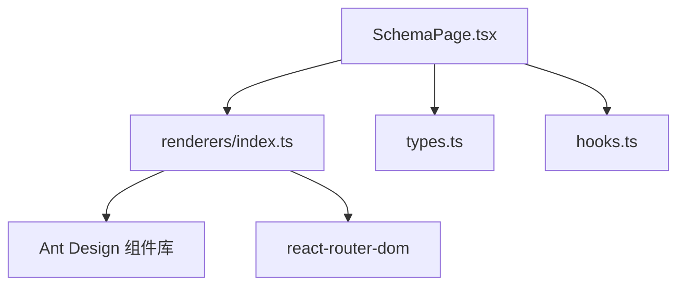
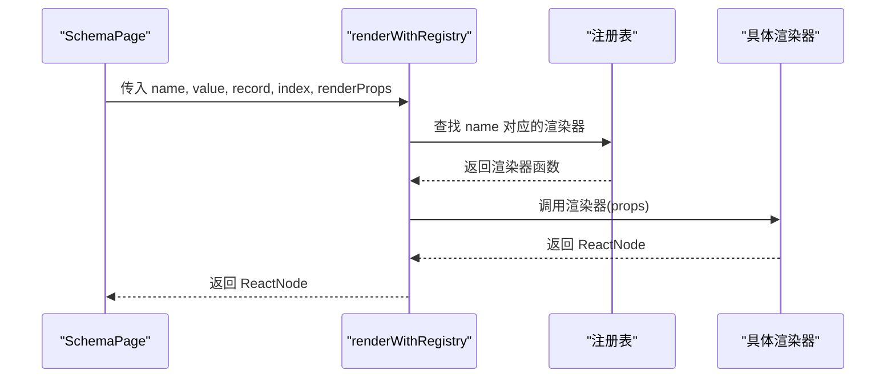
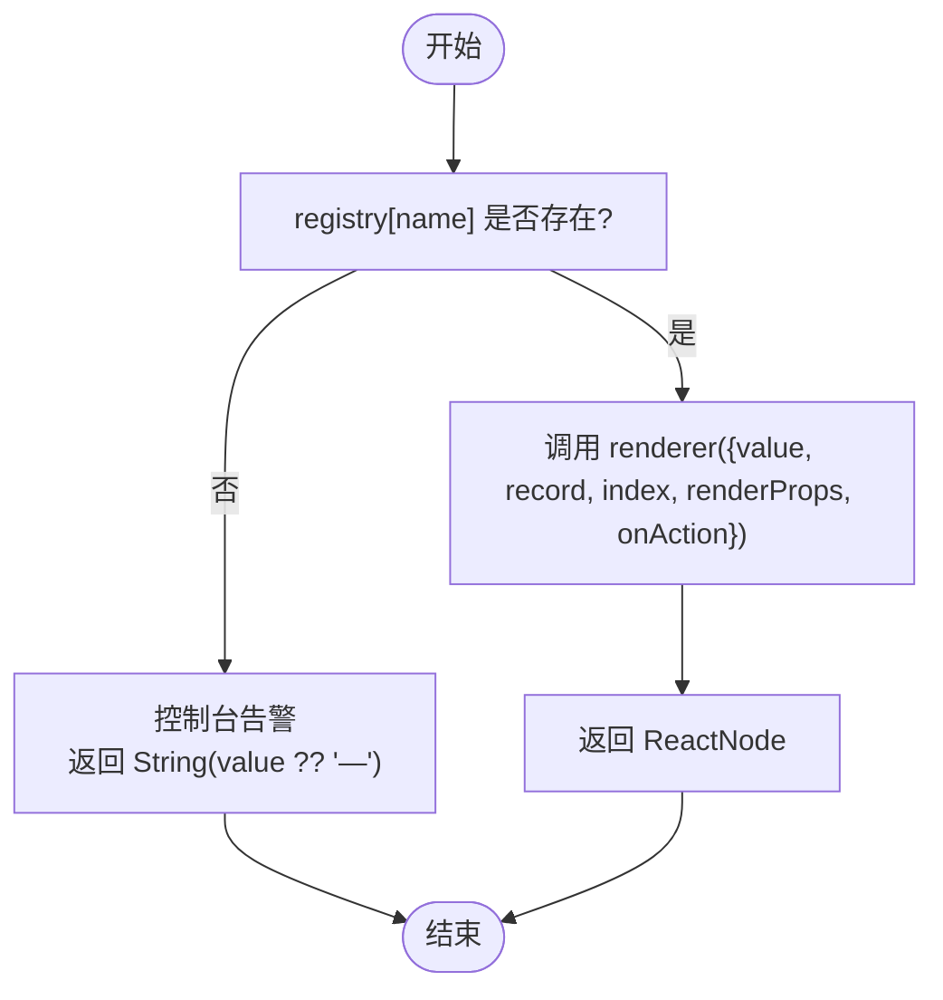
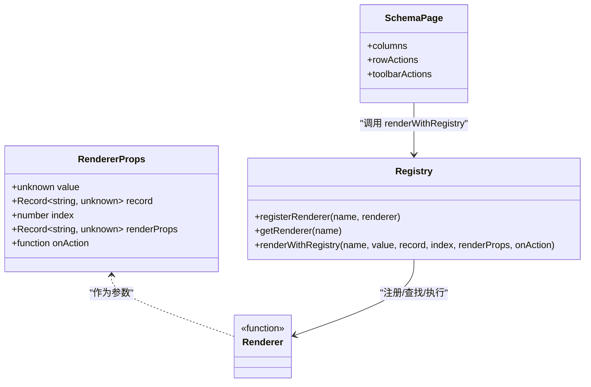
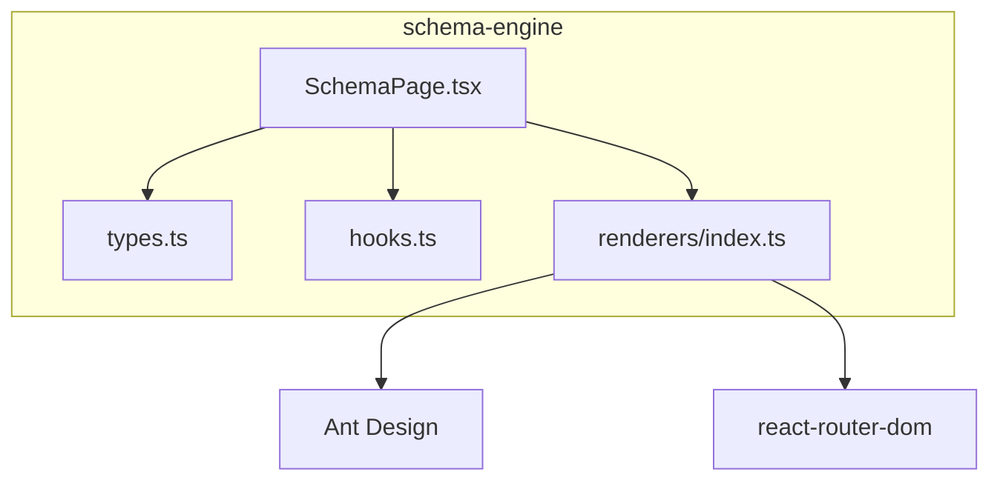

# 渲染器系统

<cite>
**本文引用的文件**
- [renderers/index.ts](file://hj-admin/src/shared/schema-engine/renderers/index.ts)
- [types.ts](file://hj-admin/src/shared/schema-engine/types.ts)
- [SchemaPage.tsx](file://hj-admin/src/shared/schema-engine/SchemaPage.tsx)
- [hooks.ts](file://hj-admin/src/shared/schema-engine/hooks.ts)
</cite>

## 目录
1. [简介](#简介)
2. [项目结构](#项目结构)
3. [核心组件](#核心组件)
4. [架构总览](#架构总览)
5. [详细组件分析](#详细组件分析)
6. [依赖关系分析](#依赖关系分析)
7. [性能考量](#性能考量)
8. [故障排查指南](#故障排查指南)
9. [结论](#结论)
10. [附录](#附录)

## 简介
本技术文档聚焦于“渲染器系统”，围绕渲染器注册表机制、内置渲染器的实现与配置、自定义渲染器的开发规范、执行上下文与数据传递机制展开。该体系以“声明式 Schema + 字符串引用渲染器”为核心，使页面构建从“写代码”降维为“写配置”，并通过统一的注册表在运行时解析并执行渲染逻辑。

## 项目结构
渲染器系统位于 schema-engine 子模块中，关键文件如下：
- renderers/index.ts：定义渲染器接口、注册表、查找与执行函数，以及内置渲染器实现
- types.ts：定义 PageSchema、ColumnDef、RowAction、ModalDef 等类型，支撑 Schema 驱动
- SchemaPage.tsx：通用列表页渲染器，根据 PageSchema 自动渲染筛选栏、Tab、表格、分页、弹窗等
- hooks.ts：封装 useSchemaPage，管理筛选、分页、Tab、选中行、数据加载等状态

图表来源
- [SchemaPage.tsx:1-226](file://hj-admin/src/shared/schema-engine/SchemaPage.tsx#L1-L226)
- [renderers/index.ts:1-163](file://hj-admin/src/shared/schema-engine/renderers/index.ts#L1-L163)
- [types.ts:1-216](file://hj-admin/src/shared/schema-engine/types.ts#L1-L216)
- [hooks.ts:1-106](file://hj-admin/src/shared/schema-engine/hooks.ts#L1-L106)

章节来源
- [SchemaPage.tsx:1-226](file://hj-admin/src/shared/schema-engine/SchemaPage.tsx#L1-L226)
- [renderers/index.ts:1-163](file://hj-admin/src/shared/schema-engine/renderers/index.ts#L1-L163)
- [types.ts:1-216](file://hj-admin/src/shared/schema-engine/types.ts#L1-L216)
- [hooks.ts:1-106](file://hj-admin/src/shared/schema-engine/hooks.ts#L1-L106)

## 核心组件
- 渲染器接口与注册表
  - RendererProps：包含 value、record、index、renderProps、onAction
  - Renderer：统一渲染函数签名
  - registerRenderer/getRenderer/renderWithRegistry：注册、查询、执行渲染的核心 API
- 内置渲染器
  - tag-list、status-badge、entity-count、link、date-or-dash、text、color-tag、percent、url、success-rate、link-progress、position-tags
- Schema 驱动
  - ColumnDef.render 支持字符串引用或函数；SchemaPage 将字符串渲染器通过 renderWithRegistry 执行
  - RowAction/ToolbarAction/BatchAction 提供行级、批量、工具栏操作能力
  - ModalDef 支持表单 Schema 或自定义组件名/渲染函数
  - TabDef 支持按记录过滤的分组展示

章节来源
- [renderers/index.ts:9-46](file://hj-admin/src/shared/schema-engine/renderers/index.ts#L9-L46)
- [renderers/index.ts:48-163](file://hj-admin/src/shared/schema-engine/renderers/index.ts#L48-L163)
- [types.ts:26-174](file://hj-admin/src/shared/schema-engine/types.ts#L26-L174)
- [SchemaPage.tsx:89-110](file://hj-admin/src/shared/schema-engine/SchemaPage.tsx#L89-L110)

## 架构总览
渲染器系统的整体流程：
- Schema 定义列的 render 字段为字符串（如 'text'、'status-badge'）
- SchemaPage 在构造列时，若 render 为字符串，则使用 renderWithRegistry 进行解析与执行
- renderWithRegistry 从注册表中查找对应渲染器并调用，返回 ReactNode
- 渲染器可访问当前行的 record、索引 index、额外参数 renderProps，以及可选的 onAction 回调

图表来源
- [SchemaPage.tsx:89-110](file://hj-admin/src/shared/schema-engine/SchemaPage.tsx#L89-L110)
- [renderers/index.ts:31-46](file://hj-admin/src/shared/schema-engine/renderers/index.ts#L31-L46)

## 详细组件分析

### 渲染器注册表机制
- 设计要点
  - 字符串引用：Schema 中的 render 字段采用字符串，保持可序列化，便于 AI 友好配置
  - 集中注册：所有内置与自定义渲染器通过 registerRenderer 注册到全局 registry
  - 安全降级：未找到渲染器时输出警告并以文本形式回退显示
- 关键 API
  - registerRenderer(name, renderer)：注册渲染器
  - getRenderer(name)：获取渲染器（调试用）
  - renderWithRegistry(name, value, record, index, renderProps, onAction)：查找并执行渲染

图表来源
- [renderers/index.ts:19-46](file://hj-admin/src/shared/schema-engine/renderers/index.ts#L19-L46)

章节来源
- [renderers/index.ts:1-46](file://hj-admin/src/shared/schema-engine/renderers/index.ts#L1-46)

### 内置渲染器一览与配置选项
以下为各内置渲染器的功能说明与常用 renderProps 配置项（仅列出关键项，完整实现见源码路径）：
- text：纯文本渲染，空值回退为占位符
- url：URL 链接渲染，超长截断，新窗口打开
- link：可导航链接渲染，支持模板 :id 替换
- status-badge：状态徽章渲染，支持 colorMap 映射颜色
- percent：百分比渲染，阈值分色
- success-rate：成功率渲染，高/中/低分级与颜色
- tag-list：标签列表渲染，支持 auto 样式开关
- position-tags：位置标签渲染，固定配色策略
- entity-count：实体计数渲染，点击触发 onAction('entity-click', { entityKey, count })
- date-or-dash：日期或破折号渲染，空值显示占位符
- color-tag：颜色标签渲染，支持 color 指定 Tag 颜色

章节来源
- [renderers/index.ts:48-163](file://hj-admin/src/shared/schema-engine/renderers/index.ts#L48-L163)

### 执行上下文与数据传递机制
- 列渲染上下文
  - value：当前单元格值
  - record：整行记录对象
  - index：行索引
  - renderProps：列定义中 renderProps 透传
  - onAction：可选回调，用于向父层上报动作（例如 entity-count 触发 entity-click）
- 页面操作上下文
  - refresh：刷新数据
  - navigate：路由跳转
  - showModal：打开弹窗（由 SchemaPage 注入）
- 数据流
  - SchemaPage 通过 useSchemaPage 管理筛选、分页、Tab、选中行等状态
  - 列渲染阶段，SchemaPage 将 ColumnDef.render 字符串转为 renderWithRegistry 调用
  - 行操作列通过 onClick/navigateTo 与上下文交互

图表来源
- [renderers/index.ts:9-46](file://hj-admin/src/shared/schema-engine/renderers/index.ts#L9-L46)
- [SchemaPage.tsx:89-110](file://hj-admin/src/shared/schema-engine/SchemaPage.tsx#L89-L110)

章节来源
- [renderers/index.ts:9-46](file://hj-admin/src/shared/schema-engine/renderers/index.ts#L9-L46)
- [SchemaPage.tsx:89-110](file://hj-admin/src/shared/schema-engine/SchemaPage.tsx#L89-L110)
- [hooks.ts:20-106](file://hj-admin/src/shared/schema-engine/hooks.ts#L20-L106)

### 自定义渲染器开发规范
- 接口规范
  - 遵循 RendererProps 结构：value、record、index、renderProps、onAction
  - 返回 ReactNode
- 注册方式
  - 使用 registerRenderer(name, renderer) 注册
  - 在 Schema 的 ColumnDef.render 中使用字符串引用 name
- 最佳实践
  - 对 value 做类型转换与空值处理
  - 合理使用 renderProps 控制样式与行为
  - 如需交互，优先使用 onAction 上报事件，避免直接耦合父组件
  - 复杂逻辑建议拆分为独立模块，并在应用启动时完成注册
- 测试方法
  - 单元测试：模拟 RendererProps，断言渲染结果与交互
  - 集成测试：在 SchemaPage 中引入自定义渲染器，验证列渲染与交互
  - 回归测试：确保新增渲染器不影响其他内置渲染器

章节来源
- [renderers/index.ts:9-46](file://hj-admin/src/shared/schema-engine/renderers/index.ts#L9-L46)
- [types.ts:26-41](file://hj-admin/src/shared/schema-engine/types.ts#L26-L41)
- [SchemaPage.tsx:89-110](file://hj-admin/src/shared/schema-engine/SchemaPage.tsx#L89-L110)

### 业务场景示例
- 文本与链接
  - 使用 text 渲染普通文本，空值回退
  - 使用 url 渲染外部链接，超长截断
  - 使用 link 渲染站内导航，支持 :id 动态替换
- 状态与进度
  - 使用 status-badge 结合 colorMap 映射不同状态颜色
  - 使用 percent/success-rate 展示比例与等级
- 标签与位置
  - 使用 tag-list 展示多标签，auto 控制样式
  - 使用 position-tags 展示位置标签，固定配色
- 计数与交互
  - 使用 entity-count 展示数量，点击触发 onAction('entity-click', { entityKey, count })

章节来源
- [renderers/index.ts:48-163](file://hj-admin/src/shared/schema-engine/renderers/index.ts#L48-L163)

### 调试方法
- 未注册渲染器
  - 现象：控制台输出 "[SchemaEngine] Renderer ... not found in registry"
  - 排查：确认 registerRenderer 是否被调用，名称是否与 Schema 一致
- 渲染异常
  - 现象：单元格显示为空或占位符
  - 排查：检查 value 类型转换与空值处理逻辑
- 交互无响应
  - 现象：entity-count 点击无效
  - 排查：确认 onAction 是否在 SchemaPage 或上层正确监听与处理

章节来源
- [renderers/index.ts:31-46](file://hj-admin/src/shared/schema-engine/renderers/index.ts#L31-L46)

## 依赖关系分析
- 内部依赖
  - SchemaPage 依赖 renderers/index.ts 的 renderWithRegistry
  - SchemaPage 依赖 types.ts 的 PageSchema、ColumnDef、RowAction 等类型
  - SchemaPage 依赖 hooks.ts 的 useSchemaPage 管理状态
- 外部依赖
  - Ant Design 组件库：Tag、Badge、Space、Table、Tabs、Modal、Select、Input、Button、DatePicker
  - react-router-dom：Link、useNavigate

图表来源
- [SchemaPage.tsx:1-226](file://hj-admin/src/shared/schema-engine/SchemaPage.tsx#L1-L226)
- [renderers/index.ts:1-163](file://hj-admin/src/shared/schema-engine/renderers/index.ts#L1-L163)
- [types.ts:1-216](file://hj-admin/src/shared/schema-engine/types.ts#L1-L216)
- [hooks.ts:1-106](file://hj-admin/src/shared/schema-engine/hooks.ts#L1-L106)

章节来源
- [SchemaPage.tsx:1-226](file://hj-admin/src/shared/schema-engine/SchemaPage.tsx#L1-L226)
- [renderers/index.ts:1-163](file://hj-admin/src/shared/schema-engine/renderers/index.ts#L1-L163)
- [types.ts:1-216](file://hj-admin/src/shared/schema-engine/types.ts#L1-L216)
- [hooks.ts:1-106](file://hj-admin/src/shared/schema-engine/hooks.ts#L1-L106)

## 性能考量
- 渲染器复杂度
  - 避免在渲染器中进行重计算或网络请求，必要时缓存或提升到父层
- 列表渲染优化
  - 合理设置 Table 的 rowKey、scrollX，减少不必要的重排
  - 对长列表启用虚拟滚动（若后续扩展）
- 条件渲染
  - 使用 useMemo 包裹列定义与操作列，避免重复计算
- 交互事件
  - 使用 onAction 上报事件，避免在渲染器内直接修改父层状态

[本节为通用指导，不直接分析具体文件]

## 故障排查指南
- 常见错误
  - 渲染器未注册：检查 registerRenderer 调用时机与名称一致性
  - 类型不匹配：确保 value 类型与渲染器预期一致，做好类型转换
  - 路由模板缺失：link 渲染器需确保 record.id 存在且模板包含 :id
- 定位步骤
  - 查看控制台告警信息
  - 在 SchemaPage 打印 columns 与最终渲染结果
  - 在 hooks.ts 的 fetchData 中打印请求参数与响应

章节来源
- [renderers/index.ts:31-46](file://hj-admin/src/shared/schema-engine/renderers/index.ts#L31-L46)
- [SchemaPage.tsx:89-110](file://hj-admin/src/shared/schema-engine/SchemaPage.tsx#L89-L110)
- [hooks.ts:36-57](file://hj-admin/src/shared/schema-engine/hooks.ts#L36-L57)

## 结论
渲染器系统通过“字符串引用 + 注册表”的方式实现了高度可扩展的列渲染能力。内置渲染器覆盖了常见的展示与交互需求，同时提供了清晰的自定义开发规范与调试手段。配合 Schema 驱动的页面构建，开发者可以专注于配置与业务逻辑，提升交付效率与可维护性。

[本节为总结，不直接分析具体文件]

## 附录
- 快速上手
  - 在应用启动时注册自定义渲染器
  - 在 PageSchema 的 ColumnDef.render 中使用字符串引用
  - 在需要交互时使用 onAction 上报事件
- 参考路径
  - 渲染器接口与注册表：[renderers/index.ts:9-46](file://hj-admin/src/shared/schema-engine/renderers/index.ts#L9-L46)
  - 内置渲染器实现：[renderers/index.ts:48-163](file://hj-admin/src/shared/schema-engine/renderers/index.ts#L48-L163)
  - Schema 类型定义：[types.ts:26-174](file://hj-admin/src/shared/schema-engine/types.ts#L26-L174)
  - 页面渲染入口：[SchemaPage.tsx:89-110](file://hj-admin/src/shared/schema-engine/SchemaPage.tsx#L89-L110)
  - 状态管理与数据加载：[hooks.ts:20-106](file://hj-admin/src/shared/schema-engine/hooks.ts#L20-L106)