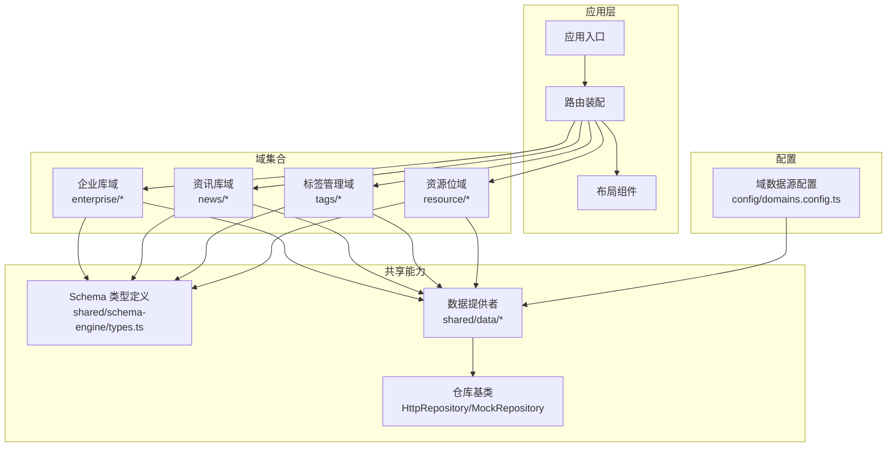
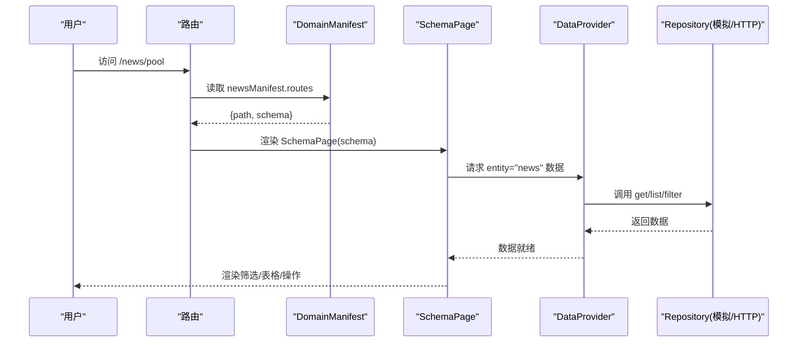
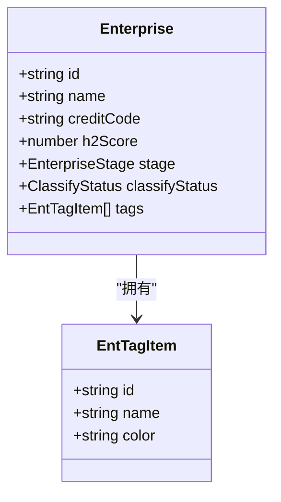
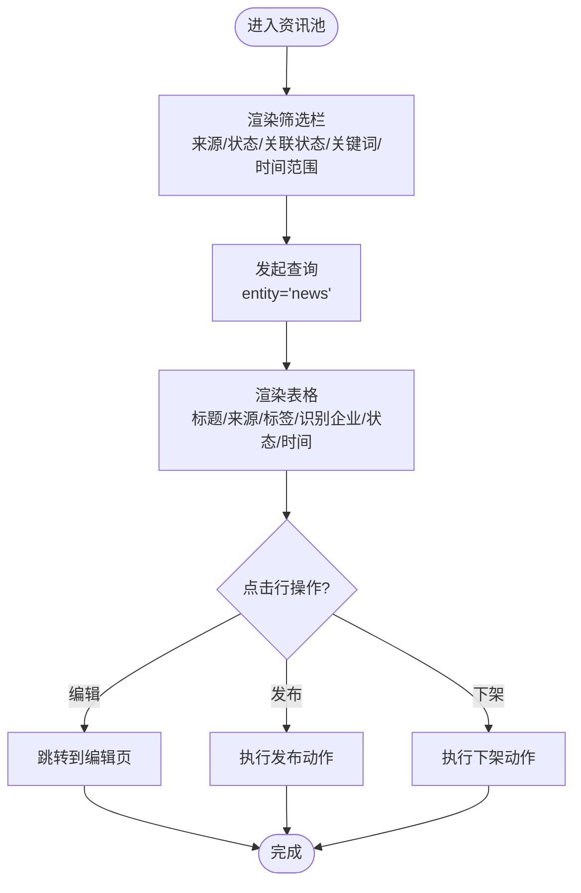
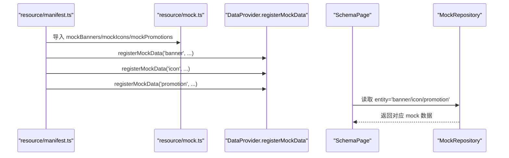
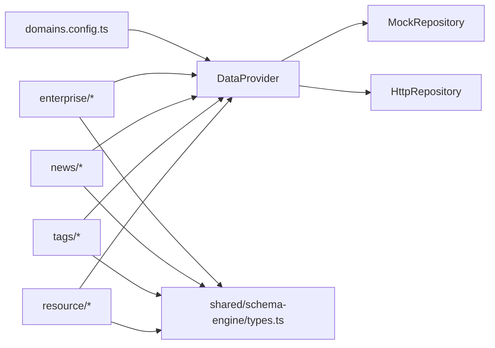

# 业务领域模块

<cite>
**本文引用的文件**   
- [domains.config.ts](file://hj-admin/src/config/domains.config.ts)
- [types.ts](file://hj-admin/src/shared/schema-engine/types.ts)
- [manifest.ts（企业域）](file://hj-admin/src/domains/enterprise/manifest.ts)
- [schema.ts（企业域）](file://hj-admin/src/domains/enterprise/schema.ts)
- [types.ts（企业域）](file://hj-admin/src/domains/enterprise/types.ts)
- [repository.ts（企业域）](file://hj-admin/src/domains/enterprise/repository.ts)
- [manifest.ts（资讯域）](file://hj-admin/src/domains/news/manifest.ts)
- [schema.ts（资讯域）](file://hj-admin/src/domains/news/schema.ts)
- [types.ts（资讯域）](file://hj-admin/src/domains/news/types.ts)
- [repository.ts（资讯域）](file://hj-admin/src/domains/news/repository.ts)
- [manifest.ts（资源位域）](file://hj-admin/src/domains/resource/manifest.ts)
- [schema.ts（资源位域）](file://hj-admin/src/domains/resource/schema.ts)
- [types.ts（资源位域）](file://hj-admin/src/domains/resource/types.ts)
- [mock.ts（资源位域）](file://hj-admin/src/domains/resource/mock.ts)
- [manifest.ts（标签域）](file://hj-admin/src/domains/tags/manifest.ts)
- [schema.ts（标签域）](file://hj-admin/src/domains/tags/schema.ts)
- [types.ts（标签域）](file://hj-admin/src/domains/tags/types.ts)
</cite>

## 目录
1. [引言](#引言)
2. [项目结构](#项目结构)
3. [核心组件](#核心组件)
4. [架构总览](#架构总览)
5. [详细组件分析](#详细组件分析)
6. [依赖关系分析](#依赖关系分析)
7. [性能考虑](#性能考虑)
8. [故障排查指南](#故障排查指南)
9. [结论](#结论)
10. [附录：新业务域开发指南与最佳实践](#附录新业务域开发指南与最佳实践)

## 引言
本文件面向“业务领域模块”的开发者与维护者，系统性阐述领域驱动设计在该前端工程中的落地方式。重点包括：
- 领域清单 DomainManifest 的配置规范与生命周期管理
- 各业务域的实现要点：企业库、资讯库、标签管理、资源管理等
- 每个域的 Schema 定义、数据类型、页面渲染与交互
- 域之间的依赖关系与数据共享机制
- 新业务域的开发流程、目录组织与最佳实践

## 项目结构
本项目采用“按域拆分 + 声明式 Schema 驱动页面”的组织方式。每个域包含 manifest、schema、types、repository、mock 等文件；全局通过配置中心注册数据源模式，并通过 Schema 引擎统一渲染列表页。

图表来源
- [domains.config.ts:1-18](file://hj-admin/src/config/domains.config.ts#L1-L18)
- [types.ts:1-216](file://hj-admin/src/shared/schema-engine/types.ts#L1-L216)

章节来源
- [domains.config.ts:1-18](file://hj-admin/src/config/domains.config.ts#L1-L18)
- [types.ts:1-216](file://hj-admin/src/shared/schema-engine/types.ts#L1-L216)

## 核心组件
- 领域清单 DomainManifest：描述域的名称、图标、菜单分组、排序、路由与是否可折叠等元信息。
- 页面 Schema PageSchema：以声明式方式描述筛选栏、表格列、分页、行操作、批量操作、工具栏、弹窗、Tab 分组、快捷筛选等。
- 数据源配置 domainConfig：集中声明每个域的数据源模式（mock/http），切换时无需改动 Schema 与页面代码。
- 仓库 Repository：封装实体数据的获取与变更逻辑，支持 Mock 与 HTTP 两种实现。
- 类型定义 types：为每个域提供强类型的实体与枚举，确保 Schema 与页面的一致性。

章节来源
- [types.ts:176-216](file://hj-admin/src/shared/schema-engine/types.ts#L176-L216)
- [types.ts:131-174](file://hj-admin/src/shared/schema-engine/types.ts#L131-L174)
- [domains.config.ts:1-18](file://hj-admin/src/config/domains.config.ts#L1-L18)

## 架构总览
下图展示了从路由到页面渲染、再到数据获取的整体流程。DomainManifest 声明路由与 Schema；路由匹配后由 SchemaPage 根据 PageSchema 渲染筛选、表格、操作等；数据通过 DataProvider 选择具体 Repository（Mock 或 Http）进行加载。

图表来源
- [manifest.ts（资讯域）:1-42](file://hj-admin/src/domains/news/manifest.ts#L1-L42)
- [schema.ts（资讯域）:1-123](file://hj-admin/src/domains/news/schema.ts#L1-L123)
- [types.ts:131-216](file://hj-admin/src/shared/schema-engine/types.ts#L131-L216)

## 详细组件分析

### 企业库域（enterprise）
- 领域清单：声明菜单分组、排序、可折叠、小圆点以及多条路由（待处理池、已确认企业、编辑页）。
- 页面 Schema：
  - 待处理池：关键词筛选、企业名称链接跳转、关联进度、分类状态、更新时间、行操作“去处理”、Tab 分组（待关联/无关联待确认）。
  - 已确认企业：多维度筛选（企业性质、企业类型、名称搜索）、多列展示（关联资讯/项目、氢能关联度、性质、状态、更新时间）、条件可见的行操作（去分类/查看）、Tab 分组（待分类/已分类）。
- 类型定义：企业维度、业务类型、阶段、分类状态等枚举，以及企业实体字段与子标签项。
- 仓库：在 manifest 中引入 repository 以触发数据源注册（Mock/HTTP）。

图表来源
- [types.ts（企业域）:1-50](file://hj-admin/src/domains/enterprise/types.ts#L1-L50)

章节来源
- [manifest.ts（企业域）:1-20](file://hj-admin/src/domains/enterprise/manifest.ts#L1-L20)
- [schema.ts（企业域）:1-64](file://hj-admin/src/domains/enterprise/schema.ts#L1-L64)
- [types.ts（企业域）:1-50](file://hj-admin/src/domains/enterprise/types.ts#L1-L50)
- [repository.ts（企业域）](file://hj-admin/src/domains/enterprise/repository.ts)

### 资讯库域（news）
- 领域清单：声明“内容管理”分组下的资讯池、已发布资讯、数据源管理与编辑页路由。
- 页面 Schema：
  - 资讯池：来源/状态/关联状态/关键词/时间范围筛选；标题链接跳转、自动标签、识别企业计数、状态徽章、发布时间；行操作（编辑/发布/下架）。
  - 已发布资讯：快速筛选 Chips（全部/已关联/待补关联）；类似列与操作。
  - 数据源管理：类型/状态/关键词筛选；来源名称、类型色标、域名、状态、最近采集、成功率、文章数；启用/停用操作。
- 类型定义：资讯状态、资讯条目、资讯标签、数据源类型与状态、数据源实体。
- 仓库：在 manifest 中引入 repository 以触发数据源注册。

图表来源
- [schema.ts（资讯域）:1-123](file://hj-admin/src/domains/news/schema.ts#L1-L123)
- [manifest.ts（资讯域）:1-42](file://hj-admin/src/domains/news/manifest.ts#L1-L42)

章节来源
- [manifest.ts（资讯域）:1-42](file://hj-admin/src/domains/news/manifest.ts#L1-L42)
- [schema.ts（资讯域）:1-123](file://hj-admin/src/domains/news/schema.ts#L1-L123)
- [types.ts（资讯域）:1-50](file://hj-admin/src/domains/news/types.ts#L1-L50)
- [repository.ts（资讯域）](file://hj-admin/src/domains/news/repository.ts)

### 标签管理域（tags）
- 领域清单：声明“标签管理”分组下的资讯标签与企业标签两个子页面。
- 页面 Schema：
  - 资讯标签：名称/颜色/使用次数/创建与更新时间；新增与删除操作。
  - 企业标签：同上，适用于企业维度。
- 类型定义：标签通用结构（名称、颜色、使用次数、时间戳、类型区分）。
- 数据源：通过 manifest 引入 mock 数据注册（见下文“资源位域”示例）。

章节来源
- [manifest.ts（标签域）:1-21](file://hj-admin/src/domains/tags/manifest.ts#L1-L21)
- [schema.ts（标签域）:1-39](file://hj-admin/src/domains/tags/schema.ts#L1-L39)
- [types.ts（标签域）:1-10](file://hj-admin/src/domains/tags/types.ts#L1-L10)

### 资源位域（resource）
- 领域清单：声明“资源位管理”分组下的 Banner、Icon、推广活动三个子页面。
- 页面 Schema：
  - Banner：状态筛选、帧数、排期、排序、跳转目标；编辑操作。
  - Icon：启用/停用筛选、emoji、名称、跳转目标、状态；编辑与启停操作。
  - 推广活动：状态筛选、日期、地点、展示位置、跳转目标；编辑操作。
- 类型定义：Banner、IconItem、Promotion 实体及状态枚举。
- 数据源：在 manifest 中直接注册 mock 数据（registerMockData），用于本地演示。

图表来源
- [manifest.ts（资源位域）:1-22](file://hj-admin/src/domains/resource/manifest.ts#L1-L22)
- [mock.ts（资源位域）](file://hj-admin/src/domains/resource/mock.ts)

章节来源
- [manifest.ts（资源位域）:1-22](file://hj-admin/src/domains/resource/manifest.ts#L1-L22)
- [schema.ts（资源位域）:1-51](file://hj-admin/src/domains/resource/schema.ts#L1-L51)
- [types.ts（资源位域）:1-31](file://hj-admin/src/domains/resource/types.ts#L1-L31)
- [mock.ts（资源位域）](file://hj-admin/src/domains/resource/mock.ts)

## 依赖关系分析
- 配置依赖：所有域的数据源模式集中在 domains.config.ts 中声明，便于统一切换至后端 API。
- 类型依赖：各域 Schema 均基于 shared/schema-engine/types.ts 的类型体系，保证一致性与可维护性。
- 数据依赖：
  - 企业库与资讯库通过各自 repository 注入数据源（Mock/HTTP）。
  - 资源位域通过 manifest 直接注册 mock 数据。
  - 标签域可通过 mock 或 repository 接入数据。
- 路由与菜单：由各域 manifest 声明，系统据此生成侧边菜单与路由表。

图表来源
- [domains.config.ts:1-18](file://hj-admin/src/config/domains.config.ts#L1-L18)
- [types.ts:1-216](file://hj-admin/src/shared/schema-engine/types.ts#L1-L216)

章节来源
- [domains.config.ts:1-18](file://hj-admin/src/config/domains.config.ts#L1-L18)
- [types.ts:1-216](file://hj-admin/src/shared/schema-engine/types.ts#L1-L216)

## 性能考虑
- 懒加载页面组件：对非列表页（如编辑页）使用动态 import，减少首屏体积。
- 分页与滚动：合理设置 pageSize 与 scrollX，避免一次性渲染过多 DOM。
- 筛选与 Tab：利用声明式 filters/tabs/quickFilters，减少自定义逻辑带来的重渲染。
- 数据源切换：通过 domains.config.ts 统一切换 mock/http，便于开发与联调阶段的性能对比与优化。

## 故障排查指南
- 数据未显示
  - 检查 domains.config.ts 中对应域的数据源是否为 'mock' 或 'http'。
  - 若使用 mock，确认是否在 manifest 中正确注册了 mock 数据或引入了 repository。
- 路由不生效
  - 核对 manifest 中的 path 与 label 是否正确，必要时检查 hideInMenu 配置。
- 列渲染异常
  - 检查 columns 中 render 与 renderProps 是否与 PageSchema 类型定义一致。
- 行操作无效
  - 确认 navigateTo 路径参数占位符（如 :id）与页面实际路由一致。

章节来源
- [domains.config.ts:1-18](file://hj-admin/src/config/domains.config.ts#L1-L18)
- [types.ts:131-216](file://hj-admin/src/shared/schema-engine/types.ts#L131-L216)

## 结论
本项目通过 DomainManifest 与 PageSchema 将“领域模型”与“页面表现”解耦，配合统一的类型系统与数据源配置，实现了高内聚、低耦合的可扩展架构。各业务域遵循一致的目录结构与配置规范，便于团队协作与后续演进。

## 附录：新业务域开发指南与最佳实践

### 目录与文件组织
- 新建域目录：src/domains/<domain-name>/
- 建议文件：
  - manifest.ts：领域清单（路由、菜单、图标、分组、排序等）
  - schema.ts：页面 Schema（筛选、表格、操作、弹窗、Tab、快捷筛选）
  - types.ts：实体与枚举类型
  - repository.ts：数据仓库（可选，用于注册 mock 或 http 数据源）
  - mock.ts：本地演示数据（可选）
  - pages/：自定义页面组件（可选，针对复杂场景）

### 配置方法
- 在 manifest.ts 中导出 DomainManifest，声明 routes 与元信息。
- 在 schema.ts 中导出若干 PageSchema，绑定 entity 与列、操作等。
- 在 types.ts 中定义强类型实体与枚举，供 schema 与页面使用。
- 如需本地数据，可在 manifest 中引入 mock 并调用 registerMockData，或在 repository 中注册数据源。
- 在 domains.config.ts 中为该域配置数据源模式（'mock' 或 'http'）。

### 域间依赖与数据共享
- 通过 entity 键名在 DataProvider 中共享数据（例如 banner、icon、promotion、newsTags、enterpriseTags 等）。
- 跨域引用时，优先使用类型与 Schema 的声明式约定，避免硬编码字符串。
- 对于需要跨域展示的字段，建议在类型层建立统一命名与语义约定。

### 开发示例（步骤）
- 步骤一：创建 src/domains/my-domain/ 目录，并添加 manifest.ts、schema.ts、types.ts。
- 步骤二：在 manifest.ts 中声明路由与菜单，指向 schema 或自定义组件。
- 步骤三：在 schema.ts 中定义 PageSchema，配置 filters、columns、rowActions、tabs 等。
- 步骤四：在 types.ts 中定义实体类型，确保与 schema 字段一致。
- 步骤五：如需本地数据，在 manifest 中引入 mock 并注册；或编写 repository 对接后端。
- 步骤六：在 domains.config.ts 中为该域配置数据源模式。
- 步骤七：启动应用，验证菜单、路由、筛选、表格与操作是否正常。

### 最佳实践
- 保持 Schema 与类型同步更新，避免运行时不一致。
- 使用 render 与 renderProps 组合内置渲染器，减少重复 UI 代码。
- 对复杂页面使用自定义组件，并在 manifest 中以懒加载方式引入。
- 合理使用 tabs 与 quickFilters，提升用户体验与性能。
- 在 domains.config.ts 中统一管理数据源，便于灰度切换与回归测试。