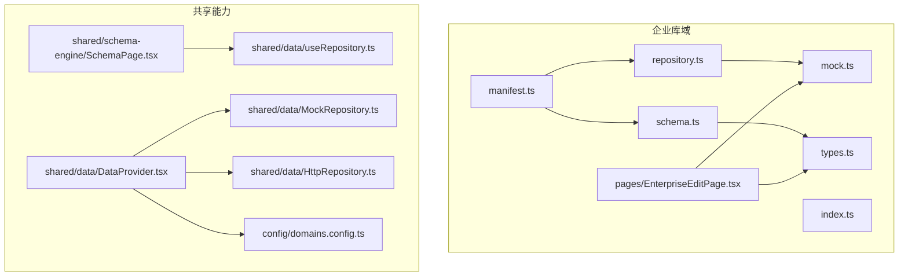
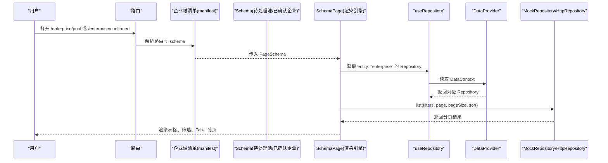
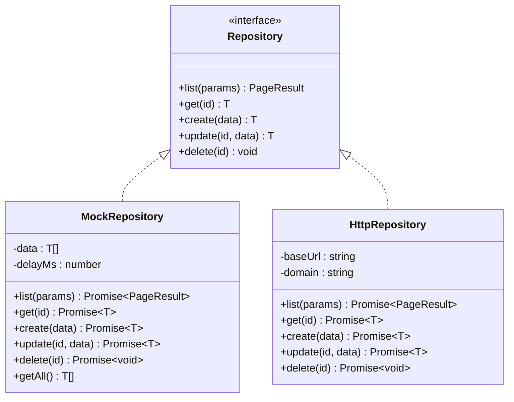
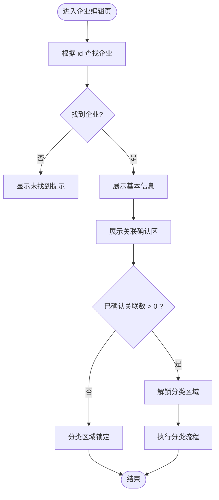
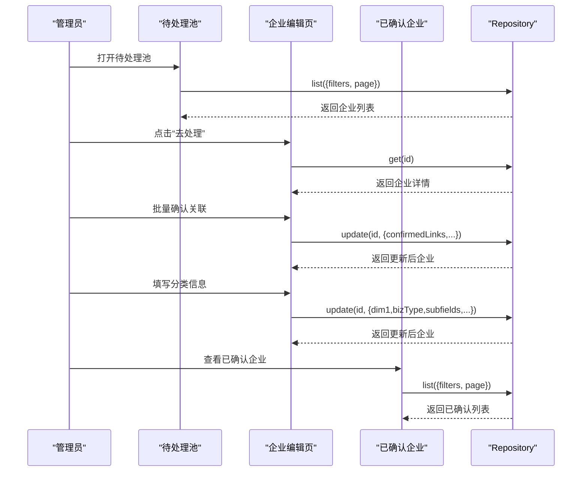
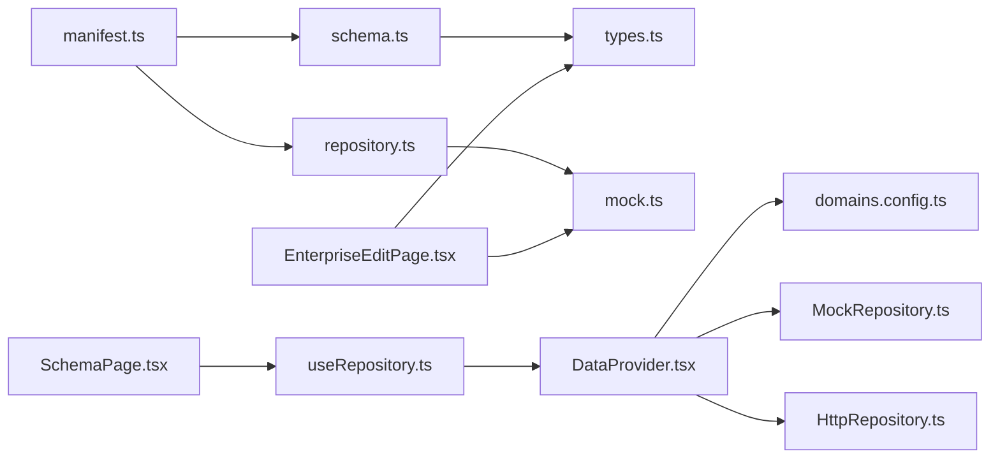
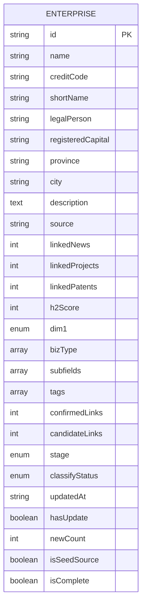

# 企业库域

<cite>
**本文引用的文件**   
- [manifest.ts](file://hj-admin/src/domains/enterprise/manifest.ts)
- [schema.ts](file://hj-admin/src/domains/enterprise/schema.ts)
- [types.ts](file://hj-admin/src/domains/enterprise/types.ts)
- [repository.ts](file://hj-admin/src/domains/enterprise/repository.ts)
- [mock.ts](file://hj-admin/src/domains/enterprise/mock.ts)
- [EnterpriseEditPage.tsx](file://hj-admin/src/domains/enterprise/pages/EnterpriseEditPage.tsx)
- [index.ts](file://hj-admin/src/domains/enterprise/index.ts)
- [SchemaPage.tsx](file://hj-admin/src/shared/schema-engine/SchemaPage.tsx)
- [MockRepository.ts](file://hj-admin/src/shared/data/MockRepository.ts)
- [HttpRepository.ts](file://hj-admin/src/shared/data/HttpRepository.ts)
- [useRepository.ts](file://hj-admin/src/shared/data/useRepository.ts)
- [DataProvider.tsx](file://hj-admin/src/shared/data/DataProvider.tsx)
- [domains.config.ts](file://hj-admin/src/config/domains.config.ts)
</cite>

## 目录
1. [简介](#简介)
2. [项目结构](#项目结构)
3. [核心组件](#核心组件)
4. [架构总览](#架构总览)
5. [详细组件分析](#详细组件分析)
6. [依赖关系分析](#依赖关系分析)
7. [性能考量](#性能考量)
8. [故障排查指南](#故障排查指南)
9. [结论](#结论)
10. [附录](#附录)

## 简介
本文件围绕“企业库域”进行系统化文档化，覆盖业务目标、领域模型、配置与渲染机制、数据访问层实现、CRUD 操作、关联分析与智能分类流程，以及企业编辑页面的自定义组件实现。通过“配置驱动页面”的 Schema 引擎与 Repository 抽象，企业库实现了从数据采集到确认发布的完整工作流，并支持待处理池与已确认企业两类视图。

## 项目结构
企业库域位于 domains/enterprise 下，采用“按域组织”的结构：清单（manifest）、页面 Schema（schema）、类型定义（types）、数据访问绑定（repository）、示例数据（mock）与编辑页（pages）。

图表来源
- [manifest.ts:1-20](file://hj-admin/src/domains/enterprise/manifest.ts#L1-L20)
- [schema.ts:1-64](file://hj-admin/src/domains/enterprise/schema.ts#L1-L64)
- [types.ts:1-50](file://hj-admin/src/domains/enterprise/types.ts#L1-L50)
- [repository.ts:1-6](file://hj-admin/src/domains/enterprise/repository.ts#L1-L6)
- [mock.ts:1-24](file://hj-admin/src/domains/enterprise/mock.ts#L1-L24)
- [EnterpriseEditPage.tsx:1-117](file://hj-admin/src/domains/enterprise/pages/EnterpriseEditPage.tsx#L1-L117)
- [SchemaPage.tsx:1-226](file://hj-admin/src/shared/schema-engine/SchemaPage.tsx#L1-L226)
- [MockRepository.ts:1-101](file://hj-admin/src/shared/data/MockRepository.ts#L1-L101)
- [HttpRepository.ts:1-70](file://hj-admin/src/shared/data/HttpRepository.ts#L1-L70)
- [useRepository.ts:1-24](file://hj-admin/src/shared/data/useRepository.ts#L1-L24)
- [DataProvider.tsx:1-44](file://hj-admin/src/shared/data/DataProvider.tsx#L1-L44)
- [domains.config.ts:1-18](file://hj-admin/src/config/domains.config.ts#L1-L18)

章节来源
- [manifest.ts:1-20](file://hj-admin/src/domains/enterprise/manifest.ts#L1-L20)
- [schema.ts:1-64](file://hj-admin/src/domains/enterprise/schema.ts#L1-L64)
- [types.ts:1-50](file://hj-admin/src/domains/enterprise/types.ts#L1-L50)
- [repository.ts:1-6](file://hj-admin/src/domains/enterprise/repository.ts#L1-L6)
- [mock.ts:1-24](file://hj-admin/src/domains/enterprise/mock.ts#L1-L24)
- [EnterpriseEditPage.tsx:1-117](file://hj-admin/src/domains/enterprise/pages/EnterpriseEditPage.tsx#L1-L117)
- [SchemaPage.tsx:1-226](file://hj-admin/src/shared/schema-engine/SchemaPage.tsx#L1-L226)
- [MockRepository.ts:1-101](file://hj-admin/src/shared/data/MockRepository.ts#L1-L101)
- [HttpRepository.ts:1-70](file://hj-admin/src/shared/data/HttpRepository.ts#L1-L70)
- [useRepository.ts:1-24](file://hj-admin/src/shared/data/useRepository.ts#L1-L24)
- [DataProvider.tsx:1-44](file://hj-admin/src/shared/data/DataProvider.tsx#L1-L44)
- [domains.config.ts:1-18](file://hj-admin/src/config/domains.config.ts#L1-L18)

## 核心组件
- 域清单 DomainManifest：声明企业库的名称、菜单分组、图标、排序、可折叠与红点提示，并注册路由（待处理池、已确认企业、企业编辑）。
- 页面 Schema：分别定义“待处理池”和“已确认企业”的筛选器、列、行操作、分页与 Tab 分组。
- 数据类型：定义企业实体字段、枚举与细分领域映射。
- 数据访问层：通过 registerMockData 将 mock 数据注册到 DataProvider，由 MockRepository 提供 list/get/create/update/delete 等通用能力；同时预留 HttpRepository 用于后端 API 接入。
- 编辑页：基于 Ant Design 构建的企业编辑页面，包含基本信息、关联确认与企业分类三部分。

章节来源
- [manifest.ts:1-20](file://hj-admin/src/domains/enterprise/manifest.ts#L1-L20)
- [schema.ts:1-64](file://hj-admin/src/domains/enterprise/schema.ts#L1-L64)
- [types.ts:1-50](file://hj-admin/src/domains/enterprise/types.ts#L1-L50)
- [repository.ts:1-6](file://hj-admin/src/domains/enterprise/repository.ts#L1-L6)
- [MockRepository.ts:1-101](file://hj-admin/src/shared/data/MockRepository.ts#L1-L101)
- [HttpRepository.ts:1-70](file://hj-admin/src/shared/data/HttpRepository.ts#L1-L70)
- [EnterpriseEditPage.tsx:1-117](file://hj-admin/src/domains/enterprise/pages/EnterpriseEditPage.tsx#L1-L117)

## 架构总览
企业库域遵循“配置驱动 + 数据源抽象”的架构模式：
- 配置驱动：通过 PageSchema 描述列表页的筛选、列、操作、分页与 Tab，SchemaPage 自动渲染。
- 数据源抽象：统一使用 Repository 接口，运行时根据 domainConfig 选择 MockRepository 或 HttpRepository。
- 数据上下文：DataProvider 在启动时按域创建 Repository 实例，并通过 useRepository 暴露给页面。

图表来源
- [manifest.ts:14-18](file://hj-admin/src/domains/enterprise/manifest.ts#L14-L18)
- [schema.ts:7-31](file://hj-admin/src/domains/enterprise/schema.ts#L7-L31)
- [schema.ts:34-63](file://hj-admin/src/domains/enterprise/schema.ts#L34-L63)
- [SchemaPage.tsx:76-110](file://hj-admin/src/shared/schema-engine/SchemaPage.tsx#L76-L110)
- [useRepository.ts:8-23](file://hj-admin/src/shared/data/useRepository.ts#L8-L23)
- [DataProvider.tsx:26-41](file://hj-admin/src/shared/data/DataProvider.tsx#L26-L41)
- [MockRepository.ts:20-67](file://hj-admin/src/shared/data/MockRepository.ts#L20-L67)
- [HttpRepository.ts:29-46](file://hj-admin/src/shared/data/HttpRepository.ts#L29-L46)

## 详细组件分析

### 域清单 DomainManifest
- 名称与展示：name=enterprise，label=企业库，icon=🏢，menuGroup=数据库管理，order=4，collapsible=true，dot=true。
- 路由：
  - /enterprise/pool：待处理池，绑定 enterprisePoolSchema。
  - /enterprise/confirmed：已确认企业，绑定 enterpriseConfirmedSchema。
  - /enterprise/edit/:id：企业编辑，动态加载 EnterpriseEditPage，隐藏于菜单。

章节来源
- [manifest.ts:1-20](file://hj-admin/src/domains/enterprise/manifest.ts#L1-L20)

### Schema 定义（待处理池与已确认企业）
- 待处理池：
  - 筛选：企业名称关键词。
  - 列：企业名称（可跳转编辑）、来源、关联进度、分类状态（带颜色映射）、更新时间。
  - 行操作：去处理（跳转到编辑页）。
  - Tab：待关联、无关联待确认，支持过滤函数。
- 已确认企业：
  - 筛选：企业性质、企业类型、名称搜索。
  - 列：企业名称（可跳转编辑）、关联资讯、关联项目、氢能关联度（百分比）、企业性质（颜色映射）、状态（颜色映射）、更新时间。
  - 行操作：去分类（仅当分类状态为待分类时可见）、查看。
  - Tab：待分类、已分类，支持过滤函数。

章节来源
- [schema.ts:7-31](file://hj-admin/src/domains/enterprise/schema.ts#L7-L31)
- [schema.ts:34-63](file://hj-admin/src/domains/enterprise/schema.ts#L34-L63)

### 数据类型定义
- 企业维度与类型：
  - 企业性质 dim1：氢能核心企业 | 氢能关联企业 | 非氢能企业。
  - 企业类型 bizType：投资运营型 | 装备制造型 | 投资金融型 | 公共服务型。
  - 阶段 stage：need-link | need-classify | no-signal。
  - 分类状态 classifyStatus：待分类 | 已分类 | 待确认。
- 企业实体 Enterprise：包含基础信息、关联指标（资讯/项目/专利数量、氢能关联度 h2Score）、标签 tags、关联进度 confirmedLinks/candidateLinks、是否种子源 isSeedSource、是否完成 isComplete、更新时间 updatedAt 等。
- 细分领域映射 BIZ_TYPE_SUBFIELDS：按企业类型给出可选细分领域集合，供编辑页分类时使用。

章节来源
- [types.ts:1-50](file://hj-admin/src/domains/enterprise/types.ts#L1-L50)

### 数据访问层（Repository）
- 注册机制：
  - 企业域的 repository.ts 调用 registerMockData('enterprise', mockEnterprises)，将企业样例数据注入全局注册表。
- 数据源切换：
  - DataProvider 根据 domains.config.ts 中 enterprise='mock' 选择 MockRepository；若改为 'http'，则使用 HttpRepository。
- MockRepository：
  - 提供 list/get/create/update/delete 与 getAll。
  - list 支持 search、filters、sort、page/pageSize，模拟网络延迟，返回 PageResult。
- HttpRepository：
  - 占位实现，list 将参数编码为查询字符串，get/create/update/delete 对应 RESTful 方法。

图表来源
- [MockRepository.ts:7-100](file://hj-admin/src/shared/data/MockRepository.ts#L7-L100)
- [HttpRepository.ts:7-69](file://hj-admin/src/shared/data/HttpRepository.ts#L7-L69)

章节来源
- [repository.ts:1-6](file://hj-admin/src/domains/enterprise/repository.ts#L1-L6)
- [DataProvider.tsx:26-41](file://hj-admin/src/shared/data/DataProvider.tsx#L26-L41)
- [domains.config.ts:7-17](file://hj-admin/src/config/domains.config.ts#L7-L17)
- [MockRepository.ts:20-67](file://hj-admin/src/shared/data/MockRepository.ts#L20-L67)
- [HttpRepository.ts:29-46](file://hj-admin/src/shared/data/HttpRepository.ts#L29-L46)

### 企业编辑页面（自定义组件）
- 基本信息：展示企业全称、社会信用代码、简称、法定代表人、注册资本、省市、简介，标注数据来源（API/手动/映射）。
- 关联确认：
  - 显示氢能关联度分数与是否种子源企业标识。
  - 简易关联 Tab：资讯/项目/专利三类，展示已确认与候选数量，并提供批量确认与全部忽略按钮。
- 企业分类：
  - 判断氢能企业（单选：核心/关联/非氢能）。
  - 判断企业类型（多选：四类）。
  - 判断细分领域（多选，选项来自 BIZ_TYPE_SUBFIELDS），并标注系统推荐。
- 交互约束：
  - 当 confirmedLinks 为 0 时，分类区域锁定不可用，需先完成关联确认。

图表来源
- [EnterpriseEditPage.tsx:9-88](file://hj-admin/src/domains/enterprise/pages/EnterpriseEditPage.tsx#L9-L88)
- [types.ts:44-49](file://hj-admin/src/domains/enterprise/types.ts#L44-L49)

章节来源
- [EnterpriseEditPage.tsx:1-117](file://hj-admin/src/domains/enterprise/pages/EnterpriseEditPage.tsx#L1-L117)
- [types.ts:1-50](file://hj-admin/src/domains/enterprise/types.ts#L1-L50)

### 企业数据处理工作流程（采集→确认→发布）
- 数据采集：通过外部导入或手动新增生成企业记录，初始 stage 可能为 need-link/no-signal，classifyStatus 为待分类/待确认。
- 待处理池：
  - 管理员在“待处理池”中查看新入库企业，按来源、关联进度、分类状态筛选。
  - 点击“去处理”进入编辑页，进行关联确认。
- 关联确认：
  - 在编辑页的关联确认区，对资讯/项目/专利进行批量确认或忽略。
  - 确认后更新 confirmedLinks 与 candidateLinks，并影响是否种子源企业的判定。
- 智能分类：
  - 关联完成后解锁分类区，管理员选择企业性质、企业类型与细分领域。
  - 系统可根据规则计算或辅助推荐细分领域（BIZ_TYPE_SUBFIELDS）。
- 发布与归档：
  - 分类完成后，企业进入“已确认企业”视图，可按企业性质、类型、关键词检索。
  - 支持查看与二次分类调整。

图表来源
- [schema.ts:7-31](file://hj-admin/src/domains/enterprise/schema.ts#L7-L31)
- [schema.ts:34-63](file://hj-admin/src/domains/enterprise/schema.ts#L34-L63)
- [MockRepository.ts:20-67](file://hj-admin/src/shared/data/MockRepository.ts#L20-L67)
- [HttpRepository.ts:29-46](file://hj-admin/src/shared/data/HttpRepository.ts#L29-L46)

## 依赖关系分析
- 模块耦合：
  - manifest 依赖 schema 与 repository，负责路由与入口。
  - schema 依赖 types，描述 UI 行为与列渲染。
  - repository 依赖 mock 数据，并通过 DataProvider 注册。
  - 编辑页依赖 types 与 mock 数据，用于表单展示与交互。
- 数据源解耦：
  - 通过 useRepository 与 DataProvider 解耦具体实现，便于在 mock/http 间切换。
- 潜在循环依赖：
  - 当前未见循环引用；各模块职责清晰。

图表来源
- [manifest.ts:1-20](file://hj-admin/src/domains/enterprise/manifest.ts#L1-L20)
- [schema.ts:1-64](file://hj-admin/src/domains/enterprise/schema.ts#L1-L64)
- [repository.ts:1-6](file://hj-admin/src/domains/enterprise/repository.ts#L1-L6)
- [mock.ts:1-24](file://hj-admin/src/domains/enterprise/mock.ts#L1-L24)
- [EnterpriseEditPage.tsx:1-117](file://hj-admin/src/domains/enterprise/pages/EnterpriseEditPage.tsx#L1-L117)
- [SchemaPage.tsx:1-226](file://hj-admin/src/shared/schema-engine/SchemaPage.tsx#L1-L226)
- [useRepository.ts:1-24](file://hj-admin/src/shared/data/useRepository.ts#L1-L24)
- [DataProvider.tsx:1-44](file://hj-admin/src/shared/data/DataProvider.tsx#L1-L44)
- [domains.config.ts:1-18](file://hj-admin/src/config/domains.config.ts#L1-L18)
- [MockRepository.ts:1-101](file://hj-admin/src/shared/data/MockRepository.ts#L1-L101)
- [HttpRepository.ts:1-70](file://hj-admin/src/shared/data/HttpRepository.ts#L1-L70)

章节来源
- [manifest.ts:1-20](file://hj-admin/src/domains/enterprise/manifest.ts#L1-L20)
- [schema.ts:1-64](file://hj-admin/src/domains/enterprise/schema.ts#L1-L64)
- [repository.ts:1-6](file://hj-admin/src/domains/enterprise/repository.ts#L1-L6)
- [mock.ts:1-24](file://hj-admin/src/domains/enterprise/mock.ts#L1-L24)
- [EnterpriseEditPage.tsx:1-117](file://hj-admin/src/domains/enterprise/pages/EnterpriseEditPage.tsx#L1-L117)
- [SchemaPage.tsx:1-226](file://hj-admin/src/shared/schema-engine/SchemaPage.tsx#L1-L226)
- [useRepository.ts:1-24](file://hj-admin/src/shared/data/useRepository.ts#L1-L24)
- [DataProvider.tsx:1-44](file://hj-admin/src/shared/data/DataProvider.tsx#L1-L44)
- [domains.config.ts:1-18](file://hj-admin/src/config/domains.config.ts#L1-L18)
- [MockRepository.ts:1-101](file://hj-admin/src/shared/data/MockRepository.ts#L1-L101)
- [HttpRepository.ts:1-70](file://hj-admin/src/shared/data/HttpRepository.ts#L1-L70)

## 性能考量
- 列表查询：
  - MockRepository 在内存中进行过滤、排序与分页，适合开发体验；生产环境建议切换到 HttpRepository，由后端承担复杂查询与索引优化。
- 渲染性能：
  - SchemaPage 使用 useMemo 缓存列与行操作列，减少重复计算。
- 交互反馈：
  - MockRepository 内置延迟模拟，便于观察 loading 态；上线后可移除或降低延迟。

[本节为通用指导，不直接分析具体文件]

## 故障排查指南
- 未找到企业：
  - 编辑页在未匹配到 id 时会显示“企业未找到”，检查路由参数与 mock 数据是否存在该 id。
- 数据源未注册：
  - 若 useRepository 找不到 entity 对应的 Repository，会输出警告并使用空操作 fallback，检查 domains.config.ts 与 DataProvider 初始化。
- 筛选/排序异常：
  - 确认 PageSchema 的 filters 与 columns 字段名与 Enterprise 类型一致；MockRepository 的 filter/sort 逻辑基于字段名匹配。

章节来源
- [EnterpriseEditPage.tsx:14-16](file://hj-admin/src/domains/enterprise/pages/EnterpriseEditPage.tsx#L14-L16)
- [useRepository.ts:11-21](file://hj-admin/src/shared/data/useRepository.ts#L11-L21)
- [MockRepository.ts:35-58](file://hj-admin/src/shared/data/MockRepository.ts#L35-L58)

## 结论
企业库域以“配置驱动 + 数据源抽象”为核心，通过 DomainManifest 与 PageSchema 快速搭建待处理池与已确认企业两大视图，结合 Repository 抽象实现前后端解耦。编辑页提供完整的关联确认与智能分类流程，满足从数据采集到确认发布的端到端需求。后续可在后端就绪后平滑切换至 HttpRepository，并在 Schema 中扩展更多列渲染器与校验规则。

[本节为总结性内容，不直接分析具体文件]

## 附录

### 企业实体数据模型（ER 风格）

图表来源
- [types.ts:8-36](file://hj-admin/src/domains/enterprise/types.ts#L8-L36)

### 代码片段路径参考
- 域清单与路由：[manifest.ts:6-19](file://hj-admin/src/domains/enterprise/manifest.ts#L6-L19)
- 待处理池 Schema：[schema.ts:7-31](file://hj-admin/src/domains/enterprise/schema.ts#L7-L31)
- 已确认企业 Schema：[schema.ts:34-63](file://hj-admin/src/domains/enterprise/schema.ts#L34-L63)
- 企业类型与细分领域映射：[types.ts:3-49](file://hj-admin/src/domains/enterprise/types.ts#L3-L49)
- 数据源注册与切换：
  - 企业域注册 mock：[repository.ts:1-6](file://hj-admin/src/domains/enterprise/repository.ts#L1-L6)
  - 数据上下文与仓库创建：[DataProvider.tsx:26-41](file://hj-admin/src/shared/data/DataProvider.tsx#L26-L41)
  - 数据源配置：[domains.config.ts:7-17](file://hj-admin/src/config/domains.config.ts#L7-L17)
- 列表渲染与行操作：
  - SchemaPage 主渲染：[SchemaPage.tsx:76-142](file://hj-admin/src/shared/schema-engine/SchemaPage.tsx#L76-L142)
  - 列渲染与自定义渲染器调用：[SchemaPage.tsx:90-110](file://hj-admin/src/shared/schema-engine/SchemaPage.tsx#L90-L110)
- 编辑页关键逻辑：
  - 基本信息与关联确认：[EnterpriseEditPage.tsx:29-62](file://hj-admin/src/domains/enterprise/pages/EnterpriseEditPage.tsx#L29-L62)
  - 分类区与细分领域选项：[EnterpriseEditPage.tsx:64-85](file://hj-admin/src/domains/enterprise/pages/EnterpriseEditPage.tsx#L64-L85)