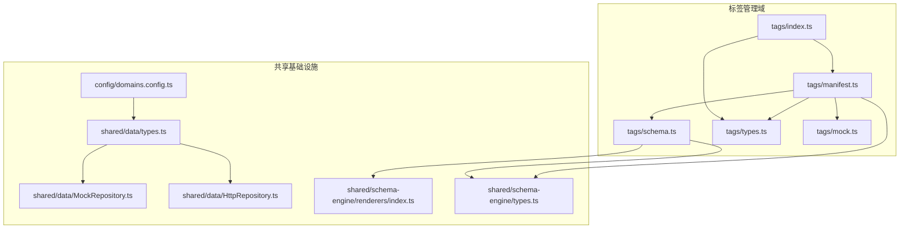
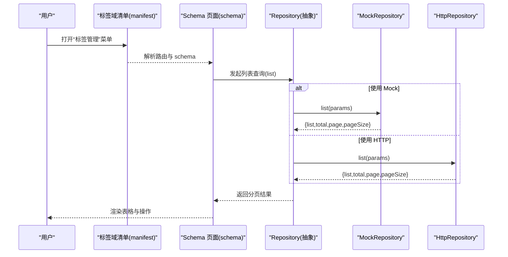
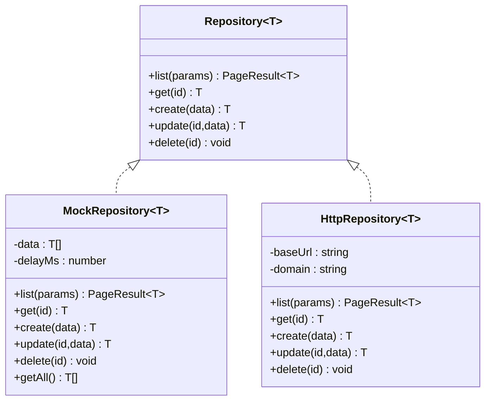
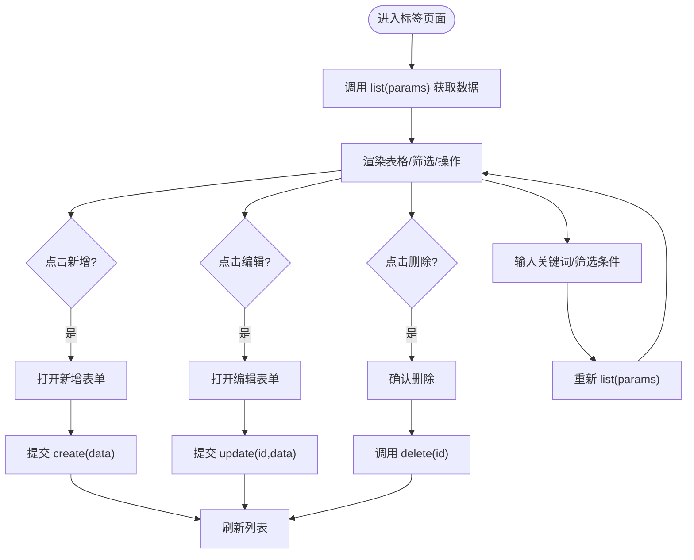
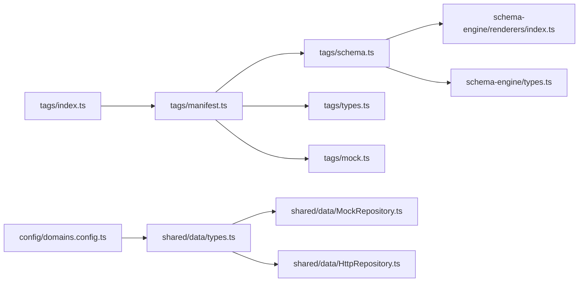

# 标签管理域

<cite>
**本文引用的文件**   
- [manifest.ts](file://hj-admin/src/domains/tags/manifest.ts)
- [schema.ts](file://hj-admin/src/domains/tags/schema.ts)
- [types.ts](file://hj-admin/src/domains/tags/types.ts)
- [index.ts](file://hj-admin/src/domains/tags/index.ts)
- [mock.ts](file://hj-admin/src/domains/tags/mock.ts)
- [domains.config.ts](file://hj-admin/src/config/domains.config.ts)
- [types.ts](file://hj-admin/src/shared/data/types.ts)
- [MockRepository.ts](file://hj-admin/src/shared/data/MockRepository.ts)
- [HttpRepository.ts](file://hj-admin/src/shared/data/HttpRepository.ts)
- [renderers/index.ts](file://hj-admin/src/shared/schema-engine/renderers/index.ts)
- [types.ts](file://hj-admin/src/shared/schema-engine/types.ts)
</cite>

## 目录
1. [引言](#引言)
2. [项目结构](#项目结构)
3. [核心组件](#核心组件)
4. [架构总览](#架构总览)
5. [详细组件分析](#详细组件分析)
6. [依赖关系分析](#依赖关系分析)
7. [性能考虑](#性能考虑)
8. [故障排查指南](#故障排查指南)
9. [结论](#结论)
10. [附录](#附录)

## 引言
本文件围绕“标签管理域”进行系统化文档化，覆盖设计理念、实现方案与最佳实践。重点包括：
- DomainManifest 配置与路由组织
- Schema 驱动页面渲染（筛选、表格、操作）
- 数据类型结构与领域模型
- Repository 数据访问层（Mock/HTTP）
- 标签体系层次结构与分类
- 标签的增删改查流程
- 标签与资讯、企业等实体的关联管理
- 标签搜索与筛选能力
- 业务规则与最佳实践（命名规范、去重策略、批量操作）
- 集成指南与示例路径

## 项目结构
标签管理域位于前端工程 domains 下，采用“按域划分”的组织方式，每个域包含 manifest、schema、types、mock 等文件；数据访问通过共享的 DataProvider + Repository 抽象统一接入。

图表来源
- [manifest.ts:1-21](file://hj-admin/src/domains/tags/manifest.ts#L1-L21)
- [schema.ts:1-39](file://hj-admin/src/domains/tags/schema.ts#L1-L39)
- [types.ts:1-10](file://hj-admin/src/domains/tags/types.ts#L1-L10)
- [index.ts:1-2](file://hj-admin/src/domains/tags/index.ts#L1-L2)
- [mock.ts:1-20](file://hj-admin/src/domains/tags/mock.ts#L1-L20)
- [domains.config.ts:1-18](file://hj-admin/src/config/domains.config.ts#L1-L18)
- [types.ts:1-36](file://hj-admin/src/shared/data/types.ts#L1-L36)
- [MockRepository.ts:1-101](file://hj-admin/src/shared/data/MockRepository.ts#L1-L101)
- [HttpRepository.ts:1-70](file://hj-admin/src/shared/data/HttpRepository.ts#L1-L70)
- [renderers/index.ts:1-163](file://hj-admin/src/shared/schema-engine/renderers/index.ts#L1-L163)
- [types.ts:1-216](file://hj-admin/src/shared/schema-engine/types.ts#L1-L216)

章节来源
- [manifest.ts:1-21](file://hj-admin/src/domains/tags/manifest.ts#L1-L21)
- [schema.ts:1-39](file://hj-admin/src/domains/tags/schema.ts#L1-L39)
- [types.ts:1-10](file://hj-admin/src/domains/tags/types.ts#L1-L10)
- [index.ts:1-2](file://hj-admin/src/domains/tags/index.ts#L1-L2)
- [mock.ts:1-20](file://hj-admin/src/domains/tags/mock.ts#L1-L20)
- [domains.config.ts:1-18](file://hj-admin/src/config/domains.config.ts#L1-L18)
- [types.ts:1-36](file://hj-admin/src/shared/data/types.ts#L1-L36)
- [MockRepository.ts:1-101](file://hj-admin/src/shared/data/MockRepository.ts#L1-L101)
- [HttpRepository.ts:1-70](file://hj-admin/src/shared/data/HttpRepository.ts#L1-L70)
- [renderers/index.ts:1-163](file://hj-admin/src/shared/schema-engine/renderers/index.ts#L1-L163)
- [types.ts:1-216](file://hj-admin/src/shared/schema-engine/types.ts#L1-L216)

## 核心组件
- 域清单（DomainManifest）：定义标签域的菜单分组、排序、图标与子路由，并注册 Mock 数据源键名。
- Schema 页面：声明筛选栏、表格列、分页、行操作与工具栏操作，驱动无代码/低代码页面渲染。
- 类型定义：TagItem 描述标签实体字段，type 区分“资讯标签/企业标签”。
- 数据访问层：通过统一的 Repository 接口，支持 Mock 与 HTTP 两种后端模式。
- 渲染器：提供 color-tag、date-or-dash 等内置渲染器，用于表格单元格展示。

章节来源
- [manifest.ts:1-21](file://hj-admin/src/domains/tags/manifest.ts#L1-L21)
- [schema.ts:1-39](file://hj-admin/src/domains/tags/schema.ts#L1-L39)
- [types.ts:1-10](file://hj-admin/src/domains/tags/types.ts#L1-L10)
- [types.ts:1-36](file://hj-admin/src/shared/data/types.ts#L1-L36)
- [MockRepository.ts:1-101](file://hj-admin/src/shared/data/MockRepository.ts#L1-L101)
- [HttpRepository.ts:1-70](file://hj-admin/src/shared/data/HttpRepository.ts#L1-L70)
- [renderers/index.ts:1-163](file://hj-admin/src/shared/schema-engine/renderers/index.ts#L1-L163)

## 架构总览
标签管理域基于“Schema 驱动 + Repository 抽象”的架构：
- 上层：DomainManifest 声明路由与菜单；PageSchema 声明页面行为与 UI。
- 中层：Schema 引擎根据 PageSchema 渲染筛选、表格、操作按钮等。
- 下层：DataProvider 根据 domainConfig 选择 MockRepository 或 HttpRepository，统一暴露 list/get/create/update/delete 等能力。

图表来源
- [manifest.ts:1-21](file://hj-admin/src/domains/tags/manifest.ts#L1-L21)
- [schema.ts:1-39](file://hj-admin/src/domains/tags/schema.ts#L1-L39)
- [types.ts:1-36](file://hj-admin/src/shared/data/types.ts#L1-L36)
- [MockRepository.ts:1-101](file://hj-admin/src/shared/data/MockRepository.ts#L1-L101)
- [HttpRepository.ts:1-70](file://hj-admin/src/shared/data/HttpRepository.ts#L1-L70)

## 详细组件分析

### 域清单（DomainManifest）
- 作用：声明标签域的菜单分组、排序、图标、可折叠以及子路由。
- 关键点：
  - 注册两个子路由：资讯标签与企业标签，分别绑定对应 PageSchema。
  - 在模块加载时注册 Mock 数据键名，供 DataProvider 发现。
- 扩展建议：
  - 如需新增“通用标签”视图，可在 routes 中增加一条 path 与 schema 映射。
  - 若需要禁用某子路由，可通过 RouteDef.hideInMenu 控制。

章节来源
- [manifest.ts:1-21](file://hj-admin/src/domains/tags/manifest.ts#L1-L21)
- [types.ts:176-208](file://hj-admin/src/shared/schema-engine/types.ts#L176-L208)

### Schema 定义（PageSchema）
- 资讯标签与企业标签共用同一套 PageSchema 结构，差异在于 entity 键名与文案。
- 关键能力：
  - filters：关键词搜索输入框。
  - columns：名称、颜色、使用次数、创建/更新时间，使用内置渲染器。
  - rowActions：编辑、删除（带确认提示）。
  - toolbarActions：新增标签。
  - pagination：分页大小与总数显示。
- 渲染器：
  - color-tag：以 Tag 组件展示名称并着色。
  - date-or-dash：日期或缺省值显示。

章节来源
- [schema.ts:1-39](file://hj-admin/src/domains/tags/schema.ts#L1-L39)
- [renderers/index.ts:103-116](file://hj-admin/src/shared/schema-engine/renderers/index.ts#L103-L116)
- [types.ts:131-174](file://hj-admin/src/shared/schema-engine/types.ts#L131-L174)

### 数据类型结构（TagItem）
- 字段说明：
  - id：唯一标识
  - name：标签名称
  - color：标签颜色
  - usageCount：使用次数
  - createdAt/updatedAt：时间戳
  - type：标签类型（news | enterprise）
- 用途：作为 Schema 泛型参数，保证列定义与数据一致。

章节来源
- [types.ts:1-10](file://hj-admin/src/domains/tags/types.ts#L1-L10)
- [types.ts:131-174](file://hj-admin/src/shared/schema-engine/types.ts#L131-L174)

### 数据访问层（Repository）
- 抽象契约：
  - list：分页、筛选、排序、关键词搜索
  - get/create/update/delete：单条记录 CRUD
- 实现：
  - MockRepository：内存过滤/分页/排序，模拟网络延迟，返回 Promise。
  - HttpRepository：将 QueryParams 转换为 URL 查询参数，调用 RESTful API。
- 切换机制：
  - config/domains.config.ts 指定各域的数据源模式（'mock' | 'http'），无需改动 Schema 与页面。

图表来源
- [types.ts:1-36](file://hj-admin/src/shared/data/types.ts#L1-L36)
- [MockRepository.ts:1-101](file://hj-admin/src/shared/data/MockRepository.ts#L1-L101)
- [HttpRepository.ts:1-70](file://hj-admin/src/shared/data/HttpRepository.ts#L1-L70)

章节来源
- [types.ts:1-36](file://hj-admin/src/shared/data/types.ts#L1-L36)
- [MockRepository.ts:1-101](file://hj-admin/src/shared/data/MockRepository.ts#L1-L101)
- [HttpRepository.ts:1-70](file://hj-admin/src/shared/data/HttpRepository.ts#L1-L70)
- [domains.config.ts:1-18](file://hj-admin/src/config/domains.config.ts#L1-L18)

### 标签体系与层次结构
- 当前实现为扁平标签集合，通过 type 字段区分“资讯标签/企业标签”，便于在不同页面独立维护。
- 可扩展方向：
  - 引入 parent_id 与 level 字段构建多级树形结构。
  - 增加 category 字段形成“分类-标签”两级结构。
  - 在 Schema 中使用 treeSelect/cascader 筛选器支撑层级浏览。

章节来源
- [types.ts:1-10](file://hj-admin/src/domains/tags/types.ts#L1-L10)
- [schema.ts:1-39](file://hj-admin/src/domains/tags/schema.ts#L1-L39)
- [types.ts:6-24](file://hj-admin/src/shared/schema-engine/types.ts#L6-L24)

### 标签的增删改查流程
- 新增：点击工具栏“+ 新增标签”，触发弹窗表单（可由 formSchema 驱动），提交后调用 create。
- 编辑：行操作“编辑”，打开表单回填数据，提交后调用 update。
- 删除：行操作“删除”，确认后调用 delete，并刷新列表。
- 列表查询：filters 与 search 组合，由 Repository.list 处理分页、排序与过滤。

[此图为概念流程图，不直接映射具体源码文件]

### 标签智能推荐算法（设计建议）
当前仓库未提供智能推荐实现，以下为可落地的设计建议：
- 候选生成：
  - 基于内容语义相似度（标题/正文向量与标签向量匹配）
  - 基于共现统计（历史已用标签的 TF-IDF/Word2Vec 聚合）
  - 基于规则（行业词库、同义词扩展）
- 排序策略：
  - 综合得分 = α·语义相似度 + β·使用热度 + γ·新颖度惩罚
- 交互体验：
  - 在新增/编辑弹窗中提供“智能推荐”按钮，展示 Top-N 候选标签
  - 支持一键采纳/批量采纳
- 数据回流：
  - 记录采纳日志，定期更新标签热度与权重

[本节为概念性设计，不涉及具体源码文件]

### 标签与实体关联管理
- 当前标签域仅维护标签元数据与使用次数，未直接存储与资讯/企业的多对多关系。
- 建议方案：
  - 在资讯/企业实体侧维护 tag_ids 数组或中间表。
  - 删除标签时，级联清理关联实体的 tag_ids。
  - 使用“实体计数渲染器”或“快速筛选 Chips”在标签页展示关联数量与跳转。

章节来源
- [schema.ts:1-39](file://hj-admin/src/domains/tags/schema.ts#L1-L39)
- [renderers/index.ts:77-89](file://hj-admin/src/shared/schema-engine/renderers/index.ts#L77-L89)

### 标签搜索与筛选
- 关键词搜索：filters 中的 input 类型，传入 params.search，由 MockRepository/HttpRepository 统一处理。
- 高级筛选：可在 filters 中扩展 select/treeSelect/cascader 等类型，结合后端索引提升性能。
- 排序：columns 的 sorter 启用后，params.sort 传递至后端。

章节来源
- [schema.ts:1-39](file://hj-admin/src/domains/tags/schema.ts#L1-L39)
- [types.ts:6-24](file://hj-admin/src/shared/schema-engine/types.ts#L6-L24)
- [MockRepository.ts:20-67](file://hj-admin/src/shared/data/MockRepository.ts#L20-L67)
- [HttpRepository.ts:29-46](file://hj-admin/src/shared/data/HttpRepository.ts#L29-L46)

### 业务规则与最佳实践
- 命名规范：
  - 简洁明确、避免歧义；建议使用名词短语，长度控制在 2-10 字。
  - 禁止使用特殊字符与空格，统一小写或驼峰风格。
- 去重策略：
  - 新增前校验 name 是否重复（同 type 维度）。
  - 合并相似标签（同义词归一化）。
- 批量操作：
  - 在 batchActions 中支持批量启用/停用、批量迁移到上级分类等。
- 权限控制：
  - 新增/编辑/删除需具备相应角色权限。
- 审计追踪：
  - 记录创建者、修改者与变更摘要。

[本节为通用规范，不涉及具体源码文件]

## 依赖关系分析
- 标签域内部依赖：
  - manifest 依赖 schema、types、mock，并在入口 index 导出。
- 跨域共享依赖：
  - schema 依赖 schema-engine 的类型与渲染器。
  - data 层通过 domainConfig 决定使用 MockRepository 还是 HttpRepository。

图表来源
- [index.ts:1-2](file://hj-admin/src/domains/tags/index.ts#L1-L2)
- [manifest.ts:1-21](file://hj-admin/src/domains/tags/manifest.ts#L1-L21)
- [schema.ts:1-39](file://hj-admin/src/domains/tags/schema.ts#L1-L39)
- [types.ts:1-10](file://hj-admin/src/domains/tags/types.ts#L1-L10)
- [mock.ts:1-20](file://hj-admin/src/domains/tags/mock.ts#L1-L20)
- [renderers/index.ts:1-163](file://hj-admin/src/shared/schema-engine/renderers/index.ts#L1-L163)
- [types.ts:1-216](file://hj-admin/src/shared/schema-engine/types.ts#L1-L216)
- [domains.config.ts:1-18](file://hj-admin/src/config/domains.config.ts#L1-L18)
- [types.ts:1-36](file://hj-admin/src/shared/data/types.ts#L1-L36)
- [MockRepository.ts:1-101](file://hj-admin/src/shared/data/MockRepository.ts#L1-L101)
- [HttpRepository.ts:1-70](file://hj-admin/src/shared/data/HttpRepository.ts#L1-L70)

章节来源
- [index.ts:1-2](file://hj-admin/src/domains/tags/index.ts#L1-L2)
- [manifest.ts:1-21](file://hj-admin/src/domains/tags/manifest.ts#L1-L21)
- [schema.ts:1-39](file://hj-admin/src/domains/tags/schema.ts#L1-L39)
- [types.ts:1-10](file://hj-admin/src/domains/tags/types.ts#L1-L10)
- [mock.ts:1-20](file://hj-admin/src/domains/tags/mock.ts#L1-L20)
- [renderers/index.ts:1-163](file://hj-admin/src/shared/schema-engine/renderers/index.ts#L1-L163)
- [types.ts:1-216](file://hj-admin/src/shared/schema-engine/types.ts#L1-L216)
- [domains.config.ts:1-18](file://hj-admin/src/config/domains.config.ts#L1-L18)
- [types.ts:1-36](file://hj-admin/src/shared/data/types.ts#L1-L36)
- [MockRepository.ts:1-101](file://hj-admin/src/shared/data/MockRepository.ts#L1-L101)
- [HttpRepository.ts:1-70](file://hj-admin/src/shared/data/HttpRepository.ts#L1-L70)

## 性能考虑
- 列表查询：
  - 优先在后端实现关键词与筛选索引，减少前端全量过滤。
  - 合理设置 pageSize，避免一次性渲染过多 DOM。
- 渲染优化：
  - 使用虚拟滚动（大数据集）与懒加载渲染器。
- 缓存策略：
  - 对热点标签列表做短期缓存，减少重复请求。
- 网络重试与超时：
  - 在 HttpRepository 层统一处理错误码与重试策略。

[本节为通用指导，不涉及具体源码文件]

## 故障排查指南
- 页面空白或无数据：
  - 检查 domainConfig 是否正确指向 'mock' 或 'http'。
  - 确认对应的 Mock 数据是否已注册（registerMockData）。
- 筛选无效：
  - 核对 filters.name 是否与后端字段一致。
  - 检查 MockRepository 的过滤逻辑是否覆盖该字段。
- 删除失败：
  - 确认 id 是否存在，MockRepository 会抛出未找到异常。
- 渲染异常：
  - 确认 column.render 使用的渲染器已在 registry 中注册。

章节来源
- [domains.config.ts:1-18](file://hj-admin/src/config/domains.config.ts#L1-L18)
- [MockRepository.ts:69-94](file://hj-admin/src/shared/data/MockRepository.ts#L69-L94)
- [renderers/index.ts:21-46](file://hj-admin/src/shared/schema-engine/renderers/index.ts#L21-L46)

## 结论
标签管理域通过 DomainManifest + PageSchema + Repository 的解耦设计，实现了高内聚、低耦合的可插拔式功能扩展。当前版本聚焦于基础 CRUD 与可视化展示，后续可按需增强层级结构、智能推荐与批量操作能力，并结合后端索引与缓存策略提升整体性能与用户体验。

## 附录
- 集成步骤（简要）：
  - 在 config/domains.config.ts 中为 newsTags/enterpriseTags 配置数据源模式。
  - 在 tags/manifest.ts 中注册 Mock 数据键名与路由。
  - 在 tags/schema.ts 中完善筛选、列与操作。
  - 在 shared/data/MockRepository.ts 或 HttpRepository.ts 中调整查询参数映射。
  - 在 renderers/index.ts 中按需扩展自定义渲染器。

章节来源
- [domains.config.ts:1-18](file://hj-admin/src/config/domains.config.ts#L1-L18)
- [manifest.ts:1-21](file://hj-admin/src/domains/tags/manifest.ts#L1-L21)
- [schema.ts:1-39](file://hj-admin/src/domains/tags/schema.ts#L1-L39)
- [MockRepository.ts:1-101](file://hj-admin/src/shared/data/MockRepository.ts#L1-L101)
- [HttpRepository.ts:1-70](file://hj-admin/src/shared/data/HttpRepository.ts#L1-L70)
- [renderers/index.ts:1-163](file://hj-admin/src/shared/schema-engine/renderers/index.ts#L1-L163)