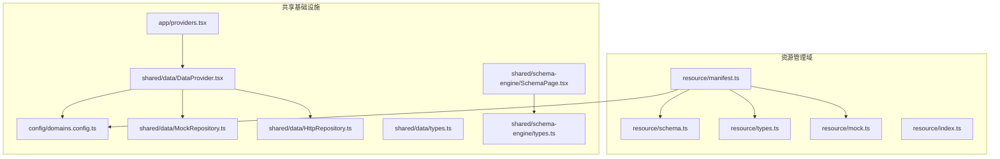
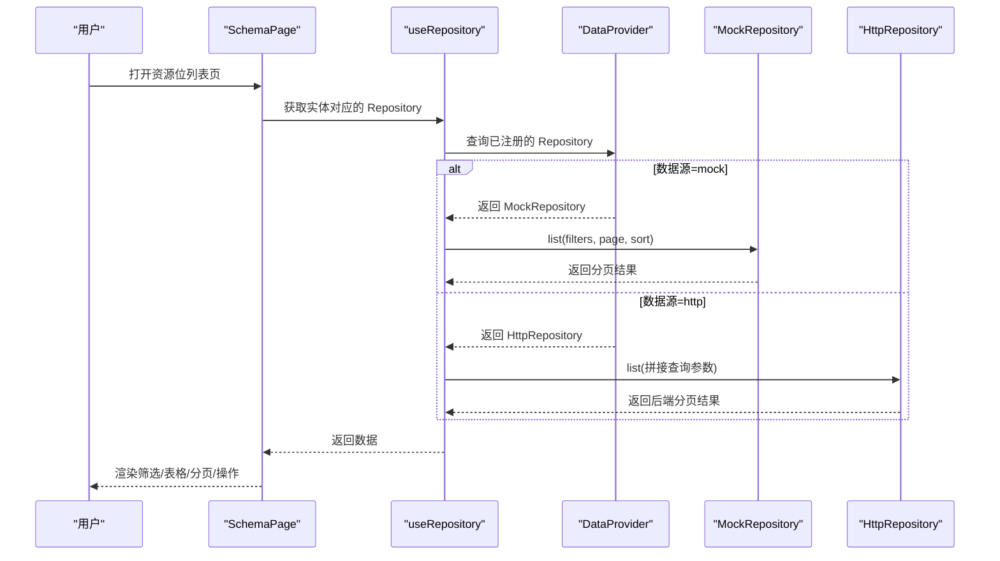
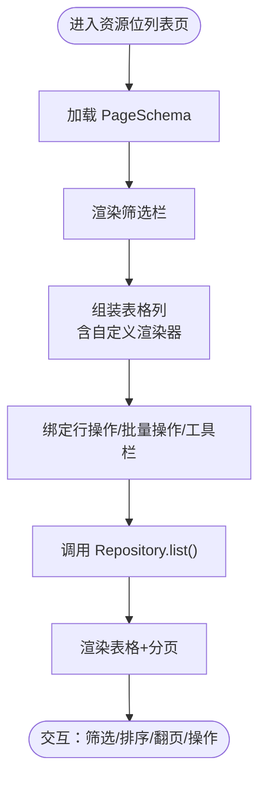
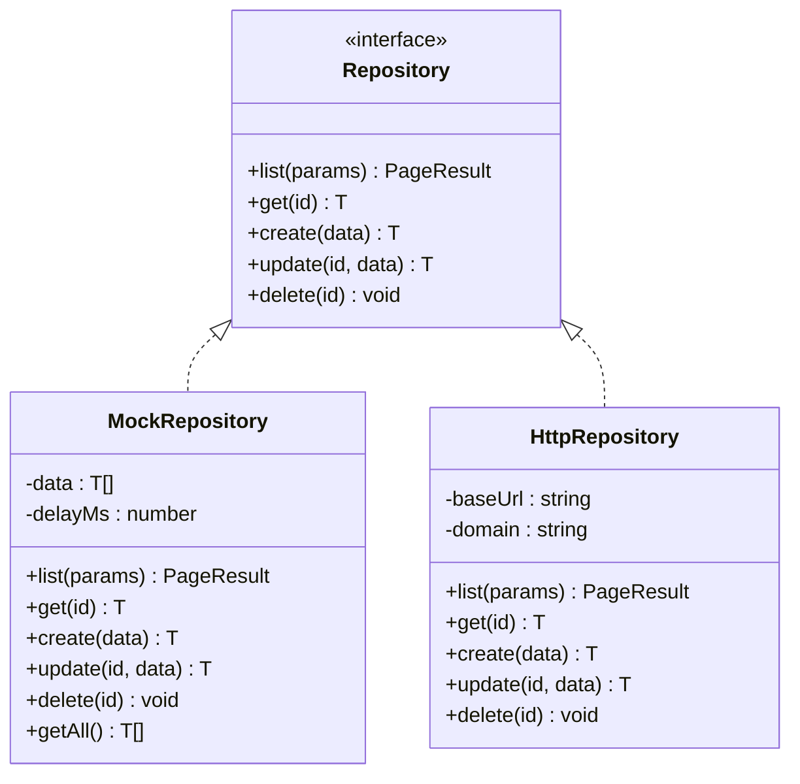
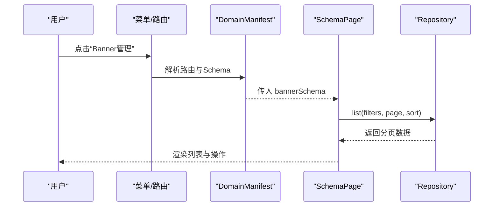
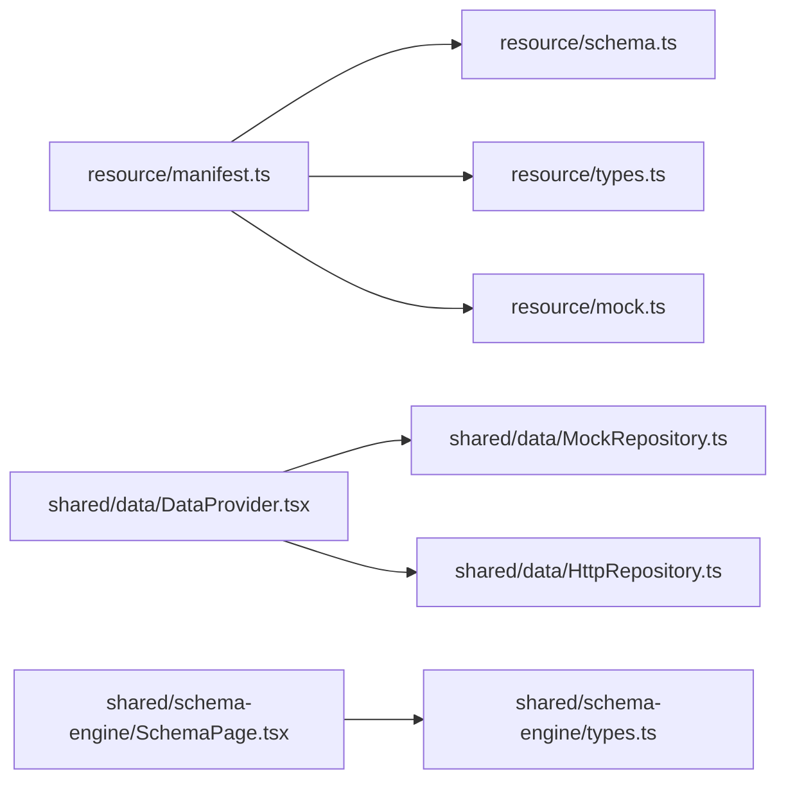

# 资源管理域

<cite>
**本文引用的文件**
- [manifest.ts](file://hj-admin/src/domains/resource/manifest.ts)
- [schema.ts](file://hj-admin/src/domains/resource/schema.ts)
- [types.ts](file://hj-admin/src/domains/resource/types.ts)
- [index.ts](file://hj-admin/src/domains/resource/index.ts)
- [mock.ts](file://hj-admin/src/domains/resource/mock.ts)
- [domains.config.ts](file://hj-admin/src/config/domains.config.ts)
- [DataProvider.tsx](file://hj-admin/src/shared/data/DataProvider.tsx)
- [MockRepository.ts](file://hj-admin/src/shared/data/MockRepository.ts)
- [HttpRepository.ts](file://hj-admin/src/shared/data/HttpRepository.ts)
- [types.ts](file://hj-admin/src/shared/data/types.ts)
- [SchemaPage.tsx](file://hj-admin/src/shared/schema-engine/SchemaPage.tsx)
- [types.ts](file://hj-admin/src/shared/schema-engine/types.ts)
- [providers.tsx](file://hj-admin/src/app/providers.tsx)
</cite>

## 目录
1. [简介](#简介)
2. [项目结构](#项目结构)
3. [核心组件](#核心组件)
4. [架构总览](#架构总览)
5. [详细组件分析](#详细组件分析)
6. [依赖关系分析](#依赖关系分析)
7. [性能与扩展性](#性能与扩展性)
8. [故障排查指南](#故障排查指南)
9. [结论](#结论)
10. [附录：开发示例与扩展指南](#附录开发示例与扩展指南)

## 简介
本文件面向“资源管理域”，聚焦资源位（Banner、Icon、推广活动）的配置与管理。文档从 DomainManifest 配置、Schema 定义、数据类型规范、Repository 数据访问层入手，系统阐述资源位的创建、配置、启用/禁用等能力；并说明资源类型分类、存储管理、访问控制策略，以及与业务模块的集成方式和数据流转机制。同时提供上传、预览、版本管理等高级能力的实现建议与扩展路径。

## 项目结构
资源管理域采用“域驱动 + Schema 驱动”的组织方式：每个域包含 manifest、schema、types、mock、repository 等文件，通过统一的数据上下文和 Schema 引擎渲染页面，屏蔽具体 UI 细节差异。

图表来源
- [manifest.ts:1-22](file://hj-admin/src/domains/resource/manifest.ts#L1-L22)
- [schema.ts:1-51](file://hj-admin/src/domains/resource/schema.ts#L1-L51)
- [types.ts:1-31](file://hj-admin/src/domains/resource/types.ts#L1-L31)
- [mock.ts:1-28](file://hj-admin/src/domains/resource/mock.ts#L1-L28)
- [domains.config.ts:1-18](file://hj-admin/src/config/domains.config.ts#L1-L18)
- [DataProvider.tsx:1-44](file://hj-admin/src/shared/data/DataProvider.tsx#L1-L44)
- [MockRepository.ts:1-101](file://hj-admin/src/shared/data/MockRepository.ts#L1-L101)
- [HttpRepository.ts:1-70](file://hj-admin/src/shared/data/HttpRepository.ts#L1-L70)
- [types.ts:1-36](file://hj-admin/src/shared/data/types.ts#L1-L36)
- [SchemaPage.tsx:1-226](file://hj-admin/src/shared/schema-engine/SchemaPage.tsx#L1-L226)
- [types.ts:1-216](file://hj-admin/src/shared/schema-engine/types.ts#L1-L216)
- [providers.tsx:1-14](file://hj-admin/src/app/providers.tsx#L1-L14)

章节来源
- [manifest.ts:1-22](file://hj-admin/src/domains/resource/manifest.ts#L1-L22)
- [schema.ts:1-51](file://hj-admin/src/domains/resource/schema.ts#L1-L51)
- [types.ts:1-31](file://hj-admin/src/domains/resource/types.ts#L1-L31)
- [mock.ts:1-28](file://hj-admin/src/domains/resource/mock.ts#L1-L28)
- [domains.config.ts:1-18](file://hj-admin/src/config/domains.config.ts#L1-L18)
- [DataProvider.tsx:1-44](file://hj-admin/src/shared/data/DataProvider.tsx#L1-L44)
- [MockRepository.ts:1-101](file://hj-admin/src/shared/data/MockRepository.ts#L1-L101)
- [HttpRepository.ts:1-70](file://hj-admin/src/shared/data/HttpRepository.ts#L1-L70)
- [types.ts:1-36](file://hj-admin/src/shared/data/types.ts#L1-L36)
- [SchemaPage.tsx:1-226](file://hj-admin/src/shared/schema-engine/SchemaPage.tsx#L1-L226)
- [types.ts:1-216](file://hj-admin/src/shared/schema-engine/types.ts#L1-L216)
- [providers.tsx:1-14](file://hj-admin/src/app/providers.tsx#L1-L14)

## 核心组件
- 域清单（DomainManifest）：声明资源域的菜单分组、路由与对应 Schema，用于注册到全局导航与路由表。
- Schema 定义：以声明式方式描述列表页的筛选、表格列、分页、行操作、Tab 分组等，驱动通用页面渲染器自动构建界面。
- 类型定义：约束 Banner、Icon、Promotion 等实体的字段与状态枚举，保证前后端一致性与可维护性。
- 数据访问层（Repository）：抽象统一的 CRUD 接口，支持 Mock 与 HTTP 两种实现，通过 DataProvider 按域注入。
- 数据上下文（DataProvider）：根据 domains.config 为各域选择 mock 或 http 仓库，并提供 useRepository 钩子供页面使用。
- Schema 引擎（SchemaPage）：基于 PageSchema 渲染筛选栏、表格、分页、行操作等，屏蔽具体 UI 实现细节。

章节来源
- [manifest.ts:1-22](file://hj-admin/src/domains/resource/manifest.ts#L1-L22)
- [schema.ts:1-51](file://hj-admin/src/domains/resource/schema.ts#L1-L51)
- [types.ts:1-31](file://hj-admin/src/domains/resource/types.ts#L1-L31)
- [types.ts:1-36](file://hj-admin/src/shared/data/types.ts#L1-L36)
- [DataProvider.tsx:1-44](file://hj-admin/src/shared/data/DataProvider.tsx#L1-L44)
- [SchemaPage.tsx:1-226](file://hj-admin/src/shared/schema-engine/SchemaPage.tsx#L1-L226)

## 架构总览
资源管理域遵循“配置即页面”的架构：通过 DomainManifest 声明路由与 Schema，由 SchemaPage 自动渲染列表页；数据访问通过 Repository 抽象，在 DataProvider 中按域注入具体实现（Mock/HTTP）。

图表来源
- [SchemaPage.tsx:1-226](file://hj-admin/src/shared/schema-engine/SchemaPage.tsx#L1-L226)
- [DataProvider.tsx:1-44](file://hj-admin/src/shared/data/DataProvider.tsx#L1-L44)
- [MockRepository.ts:1-101](file://hj-admin/src/shared/data/MockRepository.ts#L1-L101)
- [HttpRepository.ts:1-70](file://hj-admin/src/shared/data/HttpRepository.ts#L1-L70)
- [types.ts:1-36](file://hj-admin/src/shared/data/types.ts#L1-L36)

## 详细组件分析

### 域清单（DomainManifest）
- 作用：声明资源域的名称、标签、图标、菜单分组、排序权重以及路由集合。
- 路由：将 /resource/banner、/resource/icon、/resource/promotion 分别绑定到 bannerSchema、iconSchema、promotionSchema，实现“无代码页面”。
- Mock 数据注册：在清单文件中调用 registerMockData 完成各实体初始数据的注册，便于本地开发与演示。

章节来源
- [manifest.ts:1-22](file://hj-admin/src/domains/resource/manifest.ts#L1-L22)
- [DataProvider.tsx:1-44](file://hj-admin/src/shared/data/DataProvider.tsx#L1-L44)

### Schema 定义与页面渲染
- 筛选栏：通过 filters 声明筛选字段类型、选项、宽度等，SchemaPage 自动渲染 Select/Input/RangePicker 等控件。
- 表格列：columns 定义字段标题、宽度、对齐、是否固定、是否可排序、自定义渲染器等。
- 分页：pagination 控制每页条数、总数显示、大小切换等。
- 行操作：rowActions 支持条件可见、跳转编辑页、确认弹窗等。
- Tab 分组：tabs 支持按规则过滤数据并在 Tab 上展示计数。

图表来源
- [schema.ts:1-51](file://hj-admin/src/domains/resource/schema.ts#L1-L51)
- [SchemaPage.tsx:1-226](file://hj-admin/src/shared/schema-engine/SchemaPage.tsx#L1-L226)
- [types.ts:1-216](file://hj-admin/src/shared/schema-engine/types.ts#L1-L216)

章节来源
- [schema.ts:1-51](file://hj-admin/src/domains/resource/schema.ts#L1-L51)
- [types.ts:1-216](file://hj-admin/src/shared/schema-engine/types.ts#L1-L216)
- [SchemaPage.tsx:1-226](file://hj-admin/src/shared/schema-engine/SchemaPage.tsx#L1-L226)

### 数据类型规范
- 资源状态枚举：ResourceStatus 统一表示“已上线/排期中/已下线/草稿”，用于 Banner 与 Promotion 的状态字段。
- Banner：包含名称、帧数、状态、排期、排序、跳转目标等字段。
- IconItem：包含名称、emoji、颜色、跳转目标、启用/停用状态。
- Promotion：包含活动标题、日期、地点、状态、展示位置数组、跳转目标等。

章节来源
- [types.ts:1-31](file://hj-admin/src/domains/resource/types.ts#L1-L31)

### 数据访问层（Repository）
- 统一契约：Repository<T> 定义 list/get/create/update/delete 五个方法，QueryParams/PageResult 定义查询与分页结构。
- Mock 实现：内存过滤、关键词搜索、多字段排序、分页，模拟网络延迟，返回 Promise，使前端体验与真实 API 一致。
- HTTP 实现：将 QueryParams 转换为 URL 查询参数，封装 fetch 请求，统一错误处理与 JSON 解析。
- 数据源切换：domains.config 中按域指定 'mock' 或 'http'，DataProvider 据此注入对应仓库实例。

图表来源
- [types.ts:1-36](file://hj-admin/src/shared/data/types.ts#L1-L36)
- [MockRepository.ts:1-101](file://hj-admin/src/shared/data/MockRepository.ts#L1-L101)
- [HttpRepository.ts:1-70](file://hj-admin/src/shared/data/HttpRepository.ts#L1-L70)

章节来源
- [types.ts:1-36](file://hj-admin/src/shared/data/types.ts#L1-L36)
- [MockRepository.ts:1-101](file://hj-admin/src/shared/data/MockRepository.ts#L1-L101)
- [HttpRepository.ts:1-70](file://hj-admin/src/shared/data/HttpRepository.ts#L1-L70)
- [domains.config.ts:1-18](file://hj-admin/src/config/domains.config.ts#L1-L18)
- [DataProvider.tsx:1-44](file://hj-admin/src/shared/data/DataProvider.tsx#L1-L44)

### 资源位管理能力
- 创建：通过新增弹窗或新建按钮触发 create，表单由 formSchema 驱动（可在 schema 中扩展 modals/formSchema）。
- 配置：在编辑弹窗中修改名称、跳转目标、排期、展示位置等字段。
- 启用/禁用：Icon 列表支持行级“启用/停用”操作，Banner/Promotion 可通过行操作或批量操作更新状态。
- 排期与排序：Banner 支持 schedule 与 sort 字段，配合筛选与排序实现发布节奏管理。
- 展示位置：Promotion 支持 positions 数组，用于标识投放渠道（如“与氢同行”“洞察专题”）。

章节来源
- [schema.ts:1-51](file://hj-admin/src/domains/resource/schema.ts#L1-L51)
- [types.ts:1-31](file://hj-admin/src/domains/resource/types.ts#L1-L31)

### 资源类型分类与存储管理
- 类型分类：Banner、Icon、Promotion 三类资源位，分别对应不同业务场景与展示形态。
- 存储管理：当前使用 MockRepository 进行内存持久化；切换到 HttpRepository 后，数据落库由后端负责，前端仅关注接口契约。
- 访问控制：当前未内置权限控制逻辑，可在行操作 visible 函数或后端接口层实现细粒度权限校验。

章节来源
- [schema.ts:1-51](file://hj-admin/src/domains/resource/schema.ts#L1-L51)
- [MockRepository.ts:1-101](file://hj-admin/src/shared/data/MockRepository.ts#L1-L101)
- [HttpRepository.ts:1-70](file://hj-admin/src/shared/data/HttpRepository.ts#L1-L70)

### 与业务模块的集成与数据流转
- 集成方式：通过 DomainManifest 将资源域挂载到主应用菜单与路由；SchemaPage 作为通用页面渲染器，无需编写页面代码即可生成完整列表页。
- 数据流转：用户交互 → SchemaPage 收集筛选/分页/排序参数 → useRepository 获取 Repository → 调用 list/get/create/update/delete → 返回数据 → 渲染更新。

图表来源
- [manifest.ts:1-22](file://hj-admin/src/domains/resource/manifest.ts#L1-L22)
- [SchemaPage.tsx:1-226](file://hj-admin/src/shared/schema-engine/SchemaPage.tsx#L1-L226)
- [types.ts:1-216](file://hj-admin/src/shared/schema-engine/types.ts#L1-L216)

章节来源
- [manifest.ts:1-22](file://hj-admin/src/domains/resource/manifest.ts#L1-L22)
- [SchemaPage.tsx:1-226](file://hj-admin/src/shared/schema-engine/SchemaPage.tsx#L1-L226)

### 业务规则与权限控制策略
- 业务规则
  - Banner 最多 5 帧，尺寸 686×280px（在 Schema description 中提示）。
  - Icon 固定 10 个（5列×2行），已用数量可在 UI 中展示。
  - Promotion 在各展示位置上限为 2 个。
- 权限控制
  - 前端：通过 rowActions.visible 控制按钮显隐；后续可扩展为基于角色/资源的鉴权中间件。
  - 后端：建议在 HttpRepository 层统一拦截，校验 Token、角色与资源权限，再执行业务逻辑。

章节来源
- [schema.ts:1-51](file://hj-admin/src/domains/resource/schema.ts#L1-L51)
- [HttpRepository.ts:1-70](file://hj-admin/src/shared/data/HttpRepository.ts#L1-L70)

### 高级功能：上传、预览、版本管理
- 上传
  - 在表单 Schema 中增加 file 类型字段（若引擎扩展支持），或在自定义弹窗组件中调用后端上传接口。
  - 上传成功后回填资源地址至实体字段（如图片 URL）。
- 预览
  - 在列渲染器中增加“预览”按钮，打开新窗口或抽屉展示大图/外链。
- 版本管理
  - 实体增加 version 字段，每次更新递增；后端记录变更历史，前端在详情页展示版本对比与回滚入口。
- 注意：上述为扩展建议，当前仓库未直接实现，可按需接入。

[本节为概念性扩展建议，不直接分析具体文件]

## 依赖关系分析
- 低耦合高内聚：Schema 与页面渲染解耦，Repository 与 UI 解耦，通过 Provider 注入，便于替换实现。
- 外部依赖：Ant Design 组件库用于 UI 渲染；React Router 用于导航。
- 潜在循环依赖：当前未发现循环引用；各域通过 index.ts 暴露 manifest 与类型，避免重复导入。

图表来源
- [manifest.ts:1-22](file://hj-admin/src/domains/resource/manifest.ts#L1-L22)
- [schema.ts:1-51](file://hj-admin/src/domains/resource/schema.ts#L1-L51)
- [types.ts:1-31](file://hj-admin/src/domains/resource/types.ts#L1-L31)
- [mock.ts:1-28](file://hj-admin/src/domains/resource/mock.ts#L1-L28)
- [DataProvider.tsx:1-44](file://hj-admin/src/shared/data/DataProvider.tsx#L1-L44)
- [MockRepository.ts:1-101](file://hj-admin/src/shared/data/MockRepository.ts#L1-L101)
- [HttpRepository.ts:1-70](file://hj-admin/src/shared/data/HttpRepository.ts#L1-L70)
- [SchemaPage.tsx:1-226](file://hj-admin/src/shared/schema-engine/SchemaPage.tsx#L1-L226)
- [types.ts:1-216](file://hj-admin/src/shared/schema-engine/types.ts#L1-L216)

章节来源
- [manifest.ts:1-22](file://hj-admin/src/domains/resource/manifest.ts#L1-L22)
- [DataProvider.tsx:1-44](file://hj-admin/src/shared/data/DataProvider.tsx#L1-L44)
- [SchemaPage.tsx:1-226](file://hj-admin/src/shared/schema-engine/SchemaPage.tsx#L1-L226)

## 性能与扩展性
- 性能
  - MockRepository 默认 200ms 延迟，便于观察 loading 态；生产环境切换 HttpRepository 后，建议在后端做分页与索引优化。
  - 大列表建议使用虚拟滚动（可在 Table 层扩展）。
- 扩展性
  - 新增资源类型：复制现有域结构，新增 types/schema/manifest，并在 domains.config 中注册数据源模式。
  - 新增渲染器：在 renderers 注册表中扩展自定义渲染器，供 columns.render 使用。
  - 权限扩展：在 HttpRepository.request 中统一注入鉴权头与权限校验。

[本节为通用指导，不直接分析具体文件]

## 故障排查指南
- 数据为空
  - 检查 domains.config 是否已为该域配置数据源模式。
  - 检查 registerMockData 是否被正确调用，确保 mock 数据已注册。
- 筛选无效
  - 确认 filters.name 与实体字段名一致；MockRepository 对字符串字段进行相等匹配。
- 排序异常
  - 确认 sorter 配置与字段类型；MockRepository 使用 localeCompare 进行中文数字排序。
- 网络错误
  - 检查 HttpRepository 的 baseUrl 与后端路由是否一致；查看 response.ok 分支的错误信息。

章节来源
- [domains.config.ts:1-18](file://hj-admin/src/config/domains.config.ts#L1-L18)
- [DataProvider.tsx:1-44](file://hj-admin/src/shared/data/DataProvider.tsx#L1-L44)
- [MockRepository.ts:1-101](file://hj-admin/src/shared/data/MockRepository.ts#L1-L101)
- [HttpRepository.ts:1-70](file://hj-admin/src/shared/data/HttpRepository.ts#L1-L70)

## 结论
资源管理域通过 DomainManifest 与 Schema 驱动，实现了“配置即页面”的高效开发模式；Repository 抽象屏蔽了数据源差异，便于从 Mock 平滑迁移到 HTTP。当前已覆盖 Banner、Icon、Promotion 三类资源位的基础管理与状态控制，后续可在此基础上扩展上传、预览、版本管理等高级能力，并通过权限中间件完善访问控制。

[本节为总结性内容，不直接分析具体文件]

## 附录：开发示例与扩展指南
- 新增一个资源位类型
  - 在 resource/types.ts 中新增实体类型。
  - 在 resource/schema.ts 中新增 PageSchema，定义筛选、列、分页、行操作。
  - 在 resource/manifest.ts 中新增路由项，指向新 Schema。
  - 在 resource/mock.ts 中补充初始数据，并在清单中注册。
  - 在 domains.config.ts 中为新实体注册数据源模式（如 banner/icon/promotion 同级键）。
- 接入后端 API
  - 将 domains.config 中对应域的模式改为 'http'。
  - 在 HttpRepository 中调整 endpoint 与参数映射，确保与后端契约一致。
- 扩展权限控制
  - 在 HttpRepository.request 中统一附加鉴权头与权限校验。
  - 在前端通过 rowActions.visible 结合用户角色控制按钮显隐。
- 扩展上传与预览
  - 在表单 Schema 中增加文件字段（若引擎支持），或在自定义弹窗组件中调用上传接口。
  - 在列渲染器中增加“预览”按钮，打开新窗口或抽屉展示资源。

章节来源
- [manifest.ts:1-22](file://hj-admin/src/domains/resource/manifest.ts#L1-L22)
- [schema.ts:1-51](file://hj-admin/src/domains/resource/schema.ts#L1-L51)
- [types.ts:1-31](file://hj-admin/src/domains/resource/types.ts#L1-L31)
- [mock.ts:1-28](file://hj-admin/src/domains/resource/mock.ts#L1-L28)
- [domains.config.ts:1-18](file://hj-admin/src/config/domains.config.ts#L1-L18)
- [HttpRepository.ts:1-70](file://hj-admin/src/shared/data/HttpRepository.ts#L1-L70)