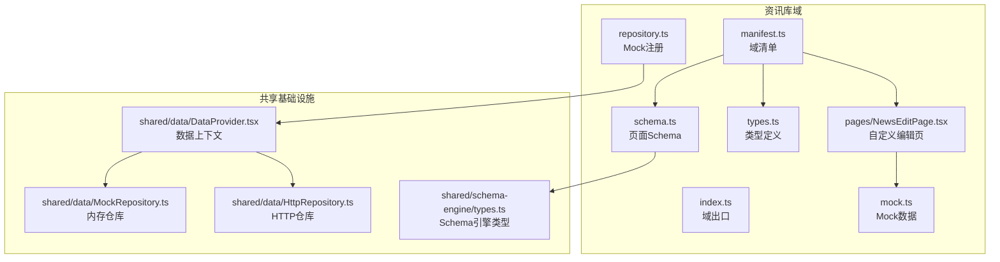
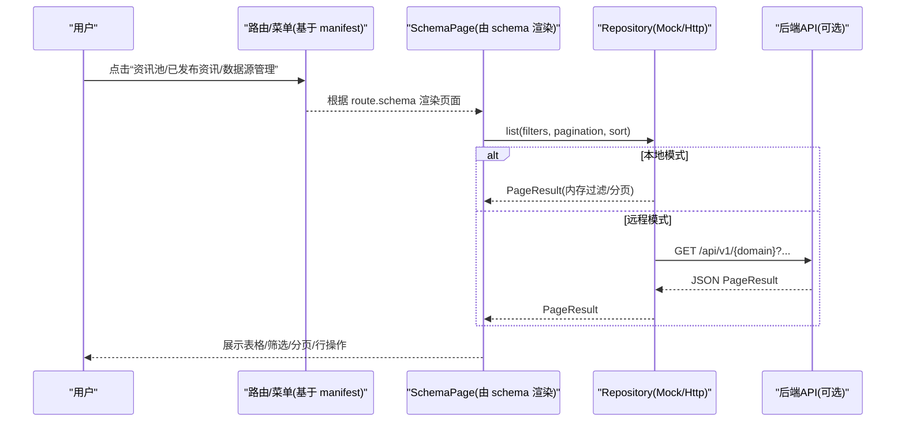
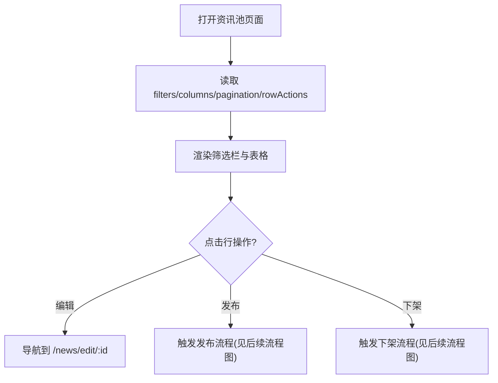
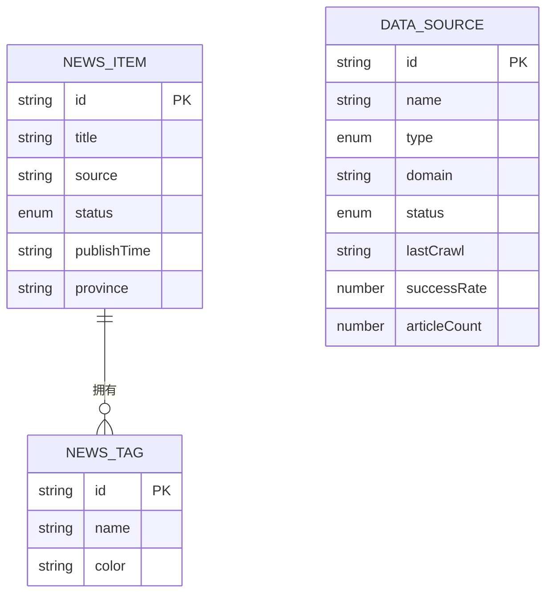
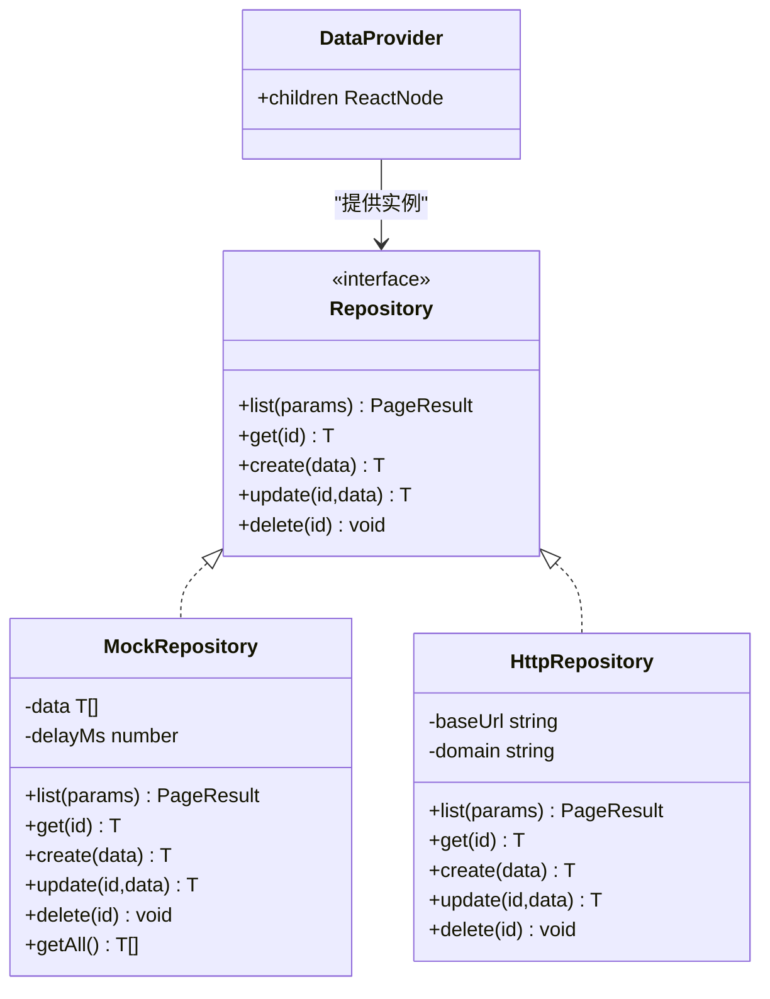
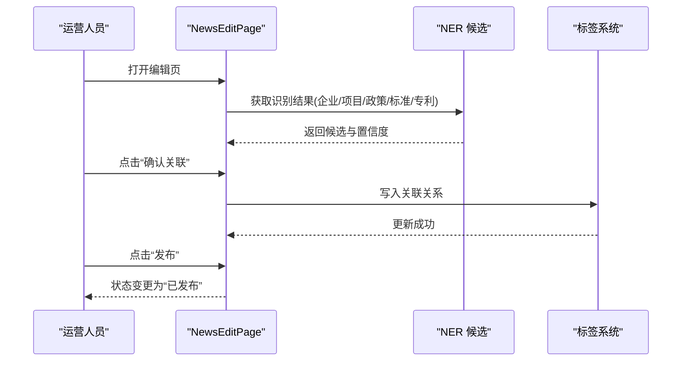
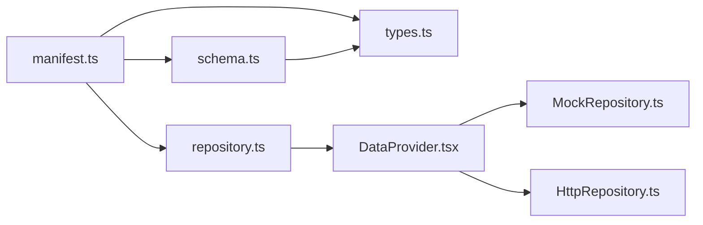
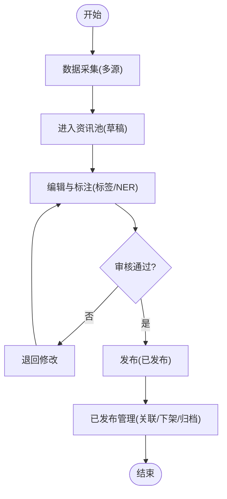

# 资讯库域

<cite>
**本文引用的文件**   
- [manifest.ts](file://hj-admin/src/domains/news/manifest.ts)
- [schema.ts](file://hj-admin/src/domains/news/schema.ts)
- [types.ts](file://hj-admin/src/domains/news/types.ts)
- [repository.ts](file://hj-admin/src/domains/news/repository.ts)
- [NewsEditPage.tsx](file://hj-admin/src/domains/news/pages/NewsEditPage.tsx)
- [index.ts](file://hj-admin/src/domains/news/index.ts)
- [mock.ts](file://hj-admin/src/domains/news/mock.ts)
- [DataProvider.tsx](file://hj-admin/src/shared/data/DataProvider.tsx)
- [HttpRepository.ts](file://hj-admin/src/shared/data/HttpRepository.ts)
- [MockRepository.ts](file://hj-admin/src/shared/data/MockRepository.ts)
- [types.ts](file://hj-admin/src/shared/schema-engine/types.ts)
- [NewsPool.tsx](file://hj-admin/src/pages/news/NewsPool.tsx)
- [tags_manifest.ts](file://hj-admin/src/domains/tags/manifest.ts)
- [tags_types.ts](file://hj-admin/src/domains/tags/types.ts)
</cite>

## 目录
1. [简介](#简介)
2. [项目结构](#项目结构)
3. [核心组件](#核心组件)
4. [架构总览](#架构总览)
5. [详细组件分析](#详细组件分析)
6. [依赖关系分析](#依赖关系分析)
7. [性能考虑](#性能考虑)
8. [故障排查指南](#故障排查指南)
9. [结论](#结论)
10. [附录](#附录)

## 简介
本文件面向“资讯库域”的业务与实现，系统性阐述以下方面：
- 业务功能：资讯采集、编辑、审核、发布全流程；资讯池管理；已发布资讯管理；数据源管理。
- 实现架构：基于 Schema 驱动的页面声明式配置、领域清单（DomainManifest）、类型定义、Repository 数据访问层。
- 数据类型规范：资讯实体、标签、数据源等数据结构与约束。
- 自定义编辑页：富文本编辑、NER 关联确认、标签自动推荐与采用、来源管理等交互。
- 与标签系统的集成方式及最佳实践。
- 实际开发示例与常见问题处理建议。

## 项目结构
资讯库域位于 domains/news 下，遵循“按域组织”的目录结构，包含清单、Schema、类型、仓库绑定、页面与 Mock 数据。

图表来源
- [manifest.ts:1-42](file://hj-admin/src/domains/news/manifest.ts#L1-L42)
- [schema.ts:1-123](file://hj-admin/src/domains/news/schema.ts#L1-L123)
- [types.ts:1-50](file://hj-admin/src/domains/news/types.ts#L1-L50)
- [repository.ts:1-11](file://hj-admin/src/domains/news/repository.ts#L1-L11)
- [NewsEditPage.tsx:1-166](file://hj-admin/src/domains/news/pages/NewsEditPage.tsx#L1-L166)
- [DataProvider.tsx:1-44](file://hj-admin/src/shared/data/DataProvider.tsx#L1-L44)
- [MockRepository.ts:1-101](file://hj-admin/src/shared/data/MockRepository.ts#L1-L101)
- [HttpRepository.ts:1-70](file://hj-admin/src/shared/data/HttpRepository.ts#L1-L70)
- [types.ts:1-216](file://hj-admin/src/shared/schema-engine/types.ts#L1-L216)

章节来源
- [manifest.ts:1-42](file://hj-admin/src/domains/news/manifest.ts#L1-L42)
- [schema.ts:1-123](file://hj-admin/src/domains/news/schema.ts#L1-L123)
- [types.ts:1-50](file://hj-admin/src/domains/news/types.ts#L1-L50)
- [repository.ts:1-11](file://hj-admin/src/domains/news/repository.ts#L1-L11)
- [NewsEditPage.tsx:1-166](file://hj-admin/src/domains/news/pages/NewsEditPage.tsx#L1-L166)
- [DataProvider.tsx:1-44](file://hj-admin/src/shared/data/DataProvider.tsx#L1-L44)
- [MockRepository.ts:1-101](file://hj-admin/src/shared/data/MockRepository.ts#L1-L101)
- [HttpRepository.ts:1-70](file://hj-admin/src/shared/data/HttpRepository.ts#L1-L70)
- [types.ts:1-216](file://hj-admin/src/shared/schema-engine/types.ts#L1-L216)

## 核心组件
- 域清单（DomainManifest）：声明路由、菜单分组、图标、排序、子路由与对应 Schema 或自定义组件。
- 页面 Schema：以声明式方式描述筛选栏、表格列、分页、行操作、Tab 分组、快捷筛选等。
- 类型系统：统一 NewsItem、DataSource 等数据结构，保证前后端一致性与编辑器提示。
- Repository 数据访问层：通过 DataProvider 注入 Mock 或 HTTP 仓库，屏蔽数据源差异。
- 自定义编辑页：承载复杂交互（富文本、NER 关联、标签采用），不适合纯 Schema 化。

章节来源
- [manifest.ts:11-41](file://hj-admin/src/domains/news/manifest.ts#L11-L41)
- [schema.ts:22-122](file://hj-admin/src/domains/news/schema.ts#L22-L122)
- [types.ts:1-50](file://hj-admin/src/domains/news/types.ts#L1-L50)
- [DataProvider.tsx:26-41](file://hj-admin/src/shared/data/DataProvider.tsx#L26-L41)
- [NewsEditPage.tsx:1-166](file://hj-admin/src/domains/news/pages/NewsEditPage.tsx#L1-L166)

## 架构总览
资讯库域采用“Schema 驱动 + 领域清单 + 仓库抽象”的分层架构：
- 表现层：由 Schema 自动生成列表页（资讯池、已发布资讯、数据源管理），复杂编辑页使用自定义组件。
- 领域层：通过 DomainManifest 聚合路由与页面能力，提供统一的入口。
- 数据层：通过 DataProvider 注入具体 Repository 实现（Mock/HTTP），对外暴露一致的 list/get/create/update/delete 接口。

图表来源
- [manifest.ts:18-40](file://hj-admin/src/domains/news/manifest.ts#L18-L40)
- [schema.ts:22-122](file://hj-admin/src/domains/news/schema.ts#L22-L122)
- [DataProvider.tsx:26-41](file://hj-admin/src/shared/data/DataProvider.tsx#L26-L41)
- [MockRepository.ts:20-67](file://hj-admin/src/shared/data/MockRepository.ts#L20-L67)
- [HttpRepository.ts:29-46](file://hj-admin/src/shared/data/HttpRepository.ts#L29-L46)

## 详细组件分析

### 域清单（DomainManifest）
- 作用：作为域的“身份证”，集中声明路由、菜单、图标、排序、是否可折叠、子路由与页面渲染策略（Schema 或自定义组件）。
- 关键要点：
  - 路由映射：资讯池、已发布资讯、数据源管理均通过 schema 自动渲染；资讯编辑通过懒加载自定义组件。
  - 菜单组织：归属于“内容管理”分组，支持展开与排序。
  - 扩展性：新增页面只需在 routes 中追加 schema 或 component。

章节来源
- [manifest.ts:11-41](file://hj-admin/src/domains/news/manifest.ts#L11-L41)
- [types.ts:176-208](file://hj-admin/src/shared/schema-engine/types.ts#L176-L208)

### 页面 Schema 定义
- 资讯池 Schema：
  - 筛选：来源、状态、关联状态、关键词、发布时间范围。
  - 列：标题（可跳转编辑）、来源、标签（自动标签）、识别企业数、状态（颜色徽章）、发布时间。
  - 行操作：编辑、发布（仅草稿可见）、下架（仅已发布可见）。
- 已发布资讯 Schema：
  - 筛选：来源、关键词。
  - 快捷筛选：全部/已关联/待补关联。
  - 列：标题、来源、标签、关联企业数、状态、发布时间。
  - Tab 分组：全部/已关联/待补关联。
- 数据源管理 Schema：
  - 筛选：类型、状态、搜索。
  - 列：名称、类型、域名、状态、最近采集、成功率、文章数。
  - 行操作：启用/停用（带二次确认）。

图表来源
- [schema.ts:22-53](file://hj-admin/src/domains/news/schema.ts#L22-L53)
- [schema.ts:56-94](file://hj-admin/src/domains/news/schema.ts#L56-L94)
- [schema.ts:97-122](file://hj-admin/src/domains/news/schema.ts#L97-L122)

章节来源
- [schema.ts:22-122](file://hj-admin/src/domains/news/schema.ts#L22-L122)
- [types.ts:132-174](file://hj-admin/src/shared/schema-engine/types.ts#L132-L174)

### 类型定义与数据模型
- 资讯实体（NewsItem）：
  - 标识与基础字段：id、title、source、status、publishTime、province。
  - 标签相关：tags（人工）、autoTags（AI 自动打标）。
  - NER 统计：nerEntities（识别计数）、linkedEntities（已关联计数）。
- 数据源（DataSource）：
  - 基本信息：id、name、type、domain、status。
  - 运行指标：lastCrawl、successRate、articleCount。

图表来源
- [types.ts:1-50](file://hj-admin/src/domains/news/types.ts#L1-L50)

章节来源
- [types.ts:1-50](file://hj-admin/src/domains/news/types.ts#L1-L50)

### Repository 数据访问层
- 设计目标：为各域提供统一的数据访问接口，屏蔽 Mock 与真实 API 的差异。
- 实现要点：
  - DataProvider 根据配置选择 MockRepository 或 HttpRepository。
  - MockRepository：内存过滤、排序、分页，模拟网络延迟，返回 Promise。
  - HttpRepository：将查询参数序列化为 URL 查询串，调用 RESTful API。
- 资讯域注册：
  - repository.ts 将 news 与 dataSources 的 Mock 数据注册到 DataProvider，供 Schema 页面消费。

图表来源
- [DataProvider.tsx:26-41](file://hj-admin/src/shared/data/DataProvider.tsx#L26-L41)
- [MockRepository.ts:7-101](file://hj-admin/src/shared/data/MockRepository.ts#L7-L101)
- [HttpRepository.ts:7-70](file://hj-admin/src/shared/data/HttpRepository.ts#L7-L70)

章节来源
- [repository.ts:1-11](file://hj-admin/src/domains/news/repository.ts#L1-L11)
- [DataProvider.tsx:1-44](file://hj-admin/src/shared/data/DataProvider.tsx#L1-L44)
- [MockRepository.ts:1-101](file://hj-admin/src/shared/data/MockRepository.ts#L1-L101)
- [HttpRepository.ts:1-70](file://hj-admin/src/shared/data/HttpRepository.ts#L1-L70)

### 资讯编辑页（自定义组件）
- 适用场景：富文本编辑、NER 关联确认、标签自动推荐与采用、摘要生成等复杂交互，不适合纯 Schema 化。
- 主要特性：
  - 顶部工具栏：返回列表、标题输入、状态徽章、省份选择、保存草稿/发布。
  - 左栏：标签区（AI 自动打标，支持一键采用）、正文（contentEditable 简易富文本）、摘要（支持 AI 生成）。
  - 右栏：NER 关联确认面板（精确匹配/归一化/相似度三级置信度），支持确认关联、忽略、创建新实体。
  - 底部信息栏：来源、采集时间、编辑人、版本、版本历史、导出关联。

图表来源
- [NewsEditPage.tsx:1-166](file://hj-admin/src/domains/news/pages/NewsEditPage.tsx#L1-L166)

章节来源
- [NewsEditPage.tsx:1-166](file://hj-admin/src/domains/news/pages/NewsEditPage.tsx#L1-L166)

### 资讯池与已发布资讯（对比说明）
- 资讯池：面向全量入库资讯，强调筛选维度丰富（来源、状态、关联状态、关键词、时间范围），并提供发布/下架等生命周期操作。
- 已发布资讯：聚焦运营已完成处理的资讯，突出“关联状态”的快捷筛选与 Tab 分组，便于快速定位待补关联条目。

章节来源
- [schema.ts:22-94](file://hj-admin/src/domains/news/schema.ts#L22-L94)

### 数据源管理
- 目的：统一管理爬虫采集、API 接入、RSS 订阅等多渠道数据源，监控运行状态与成功率。
- 关键能力：启用/停用数据源、查看最近采集时间与成功率、统计文章数量。

章节来源
- [schema.ts:97-122](file://hj-admin/src/domains/news/schema.ts#L97-L122)

### 与标签系统的集成
- 资讯域内嵌 autoTags（AI 自动打标）与 tags（人工维护），并在编辑页提供“全部采用”等操作。
- 标签域提供独立的“资讯标签/企业标签”管理页面，支撑跨域复用。
- 集成方式：
  - 前端：通过标签列表渲染与选择器进行关联。
  - 数据：标签实体与资讯实体解耦，通过引用关系建立关联。

章节来源
- [tags_manifest.ts:1-21](file://hj-admin/src/domains/tags/manifest.ts#L1-L21)
- [tags_types.ts:1-10](file://hj-admin/src/domains/tags/types.ts#L1-L10)
- [schema.ts:40-41](file://hj-admin/src/domains/news/schema.ts#L40-L41)
- [NewsEditPage.tsx:43-55](file://hj-admin/src/domains/news/pages/NewsEditPage.tsx#L43-L55)

## 依赖关系分析
- 模块耦合：
  - manifest.ts 依赖 schema.ts 与 types.ts，并引入 repository.ts 以注册 Mock 数据。
  - schema.ts 依赖 types.ts 中的实体类型，确保列与筛选字段与数据模型一致。
  - repository.ts 依赖 DataProvider 的 registerMockData 接口完成数据注册。
  - DataProvider 根据配置动态注入 MockRepository 或 HttpRepository。
- 外部依赖：
  - Ant Design 组件用于 UI 呈现。
  - react-router-dom 用于路由导航。
  - 未来对接后端时，HttpRepository 负责与 RESTful API 通信。

图表来源
- [manifest.ts:1-42](file://hj-admin/src/domains/news/manifest.ts#L1-L42)
- [schema.ts:1-123](file://hj-admin/src/domains/news/schema.ts#L1-L123)
- [repository.ts:1-11](file://hj-admin/src/domains/news/repository.ts#L1-L11)
- [DataProvider.tsx:1-44](file://hj-admin/src/shared/data/DataProvider.tsx#L1-L44)

章节来源
- [manifest.ts:1-42](file://hj-admin/src/domains/news/manifest.ts#L1-L42)
- [schema.ts:1-123](file://hj-admin/src/domains/news/schema.ts#L1-L123)
- [repository.ts:1-11](file://hj-admin/src/domains/news/repository.ts#L1-L11)
- [DataProvider.tsx:1-44](file://hj-admin/src/shared/data/DataProvider.tsx#L1-L44)

## 性能考虑
- 列表页性能：
  - 合理设置 scrollX 与列宽，避免横向滚动过大导致重排。
  - 使用分页减少首屏渲染压力，pageSize 建议 20-50。
  - 对大列表优先服务端分页与过滤，避免前端内存占用过高。
- 渲染优化：
  - 列渲染尽量使用内置渲染器（如 link、tag-list、status-badge），减少自定义渲染开销。
  - 复杂组件（如 NER 面板）按需懒加载或虚拟化渲染。
- 数据访问：
  - 使用 QueryParams 的 filters/search/sort 组合，减少不必要的全量拉取。
  - 后端就绪后，利用索引与缓存提升查询效率。

[本节为通用指导，不直接分析具体文件]

## 故障排查指南
- 页面无法显示或报错：
  - 检查 manifest.ts 的路由 path 与 schema/component 是否正确。
  - 确认 repository.ts 是否已注册对应 entity 的 Mock 数据。
- 列表为空或筛选无效：
  - 检查 MockRepository 的过滤逻辑是否与前端 filters 字段名一致。
  - 确认传入的 filter 值是否为空字符串或未定义。
- 编辑页找不到资讯：
  - 检查路由参数 id 是否存在于 mockNewsList。
  - 确认 navigateTo 路径模板与路由定义一致。
- 数据源异常：
  - 关注“最近采集”与“成功率”指标，必要时停用异常数据源。
  - 核对 domain 地址与类型配置。

章节来源
- [repository.ts:1-11](file://hj-admin/src/domains/news/repository.ts#L1-L11)
- [MockRepository.ts:20-67](file://hj-admin/src/shared/data/MockRepository.ts#L20-L67)
- [NewsEditPage.tsx:16-18](file://hj-admin/src/domains/news/pages/NewsEditPage.tsx#L16-L18)
- [schema.ts:97-122](file://hj-admin/src/domains/news/schema.ts#L97-L122)

## 结论
资讯库域通过“清单 + Schema + 类型 + 仓库”的清晰分层，实现了从数据采集、编辑、审核到发布的完整闭环。Schema 驱动大幅降低了列表页的开发与维护成本，而复杂编辑页则通过自定义组件满足高阶交互需求。配合标签系统与 NER 能力，形成高效的内容生产与知识沉淀体系。

[本节为总结性内容，不直接分析具体文件]

## 附录

### 业务流程图（采集-编辑-审核-发布）

[此图为概念流程示意，未直接映射具体源码文件]

### 开发最佳实践
- 新增页面：
  - 在 manifest.ts 的 routes 中添加路由项，优先使用 schema 自动渲染。
  - 若交互复杂，使用 component 懒加载自定义组件。
- 数据模型变更：
  - 同步更新 types.ts，并确保 schema.ts 的列与筛选字段与之对齐。
- 数据访问切换：
  - 在 DataProvider 配置中将对应域切换为 http 模式，替换 MockRepository 为 HttpRepository。
- 标签集成：
  - 在编辑页提供“全部采用”与手动添加能力，保持 autoTags 与 tags 的一致性。

[本节为通用指导，不直接分析具体文件]