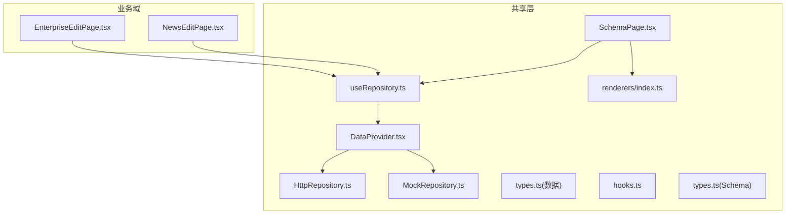
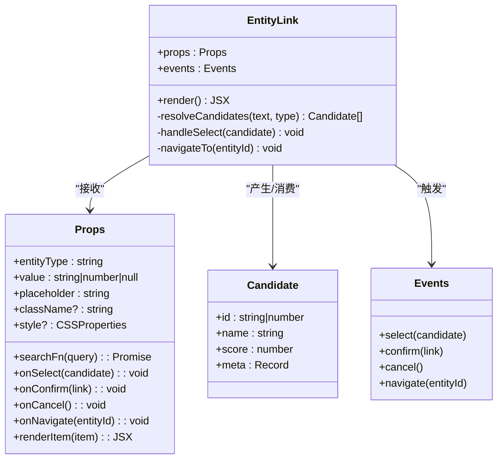
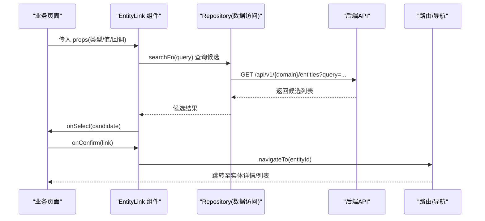
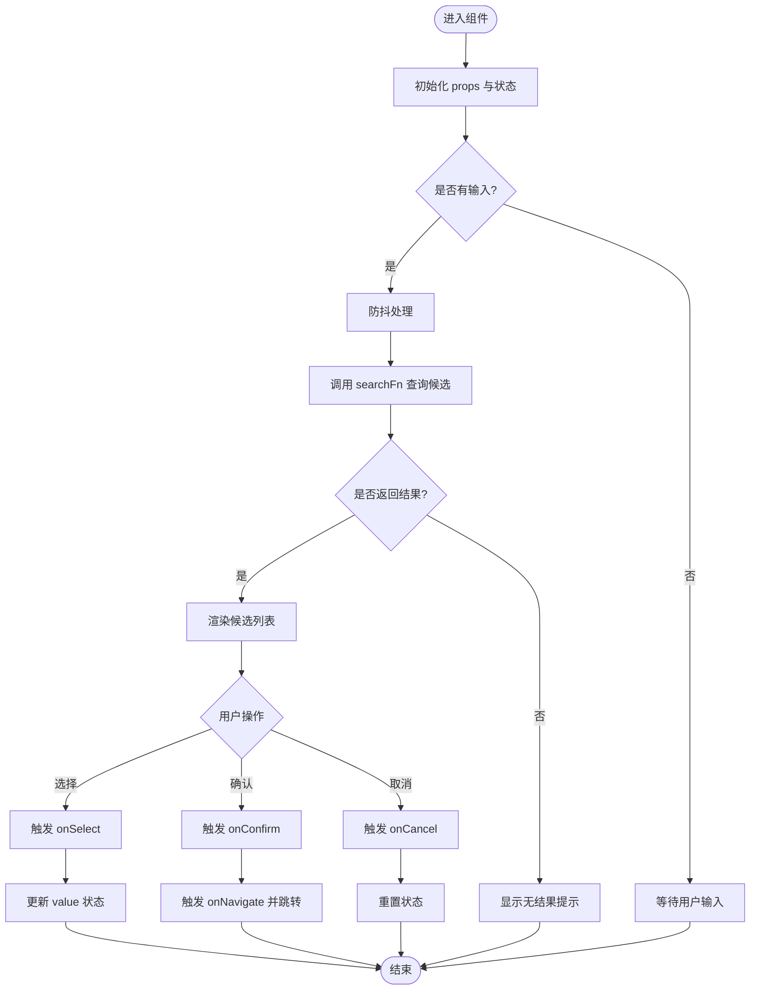
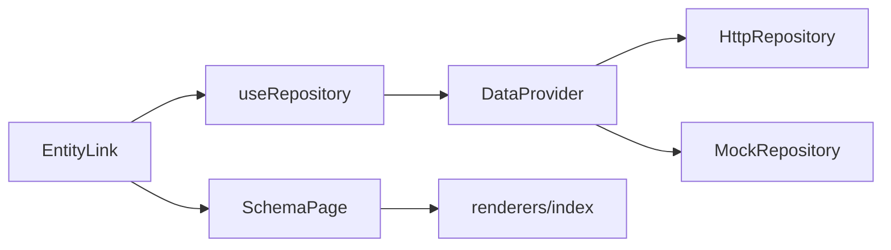

# EntityLink实体链接组件

<cite>
**本文引用的文件**   
- [DataProvider.tsx](file://hj-admin/src/shared/data/DataProvider.tsx)
- [HttpRepository.ts](file://hj-admin/src/shared/data/HttpRepository.ts)
- [MockRepository.ts](file://hj-admin/src/shared/data/MockRepository.ts)
- [types.ts](file://hj-admin/src/shared/data/types.ts)
- [useRepository.ts](file://hj-admin/src/shared/data/useRepository.ts)
- [SchemaPage.tsx](file://hj-admin/src/shared/schema-engine/SchemaPage.tsx)
- [hooks.ts](file://hj-admin/src/shared/schema-engine/hooks.ts)
- [types.ts](file://hj-admin/src/shared/schema-engine/types.ts)
- [index.ts](file://hj-admin/src/shared/schema-engine/renderers/index.ts)
- [NewsEditPage.tsx](file://hj-admin/src/domains/news/pages/NewsEditPage.tsx)
- [EnterpriseEditPage.tsx](file://hj-admin/src/domains/enterprise/pages/EnterpriseEditPage.tsx)
</cite>

## 目录
1. [简介](#简介)
2. [项目结构](#项目结构)
3. [核心组件](#核心组件)
4. [架构总览](#架构总览)
5. [详细组件分析](#详细组件分析)
6. [依赖关系分析](#依赖关系分析)
7. [性能考虑](#性能考虑)
8. [故障排查指南](#故障排查指南)
9. [结论](#结论)
10. [附录](#附录)

## 简介
EntityLink（实体链接）组件用于在业务页面中展示与导航到相关实体数据，支持从文本或表单上下文中识别候选实体、进行相似度匹配与确认关联，并提供跳转至目标实体的能力。该组件与 Schema 驱动引擎集成，通过声明式配置渲染不同场景下的实体链接交互，同时可与其他业务组件组合使用，形成统一的实体关系管理体验。

## 项目结构
本仓库采用“领域 + 共享能力”的组织方式：
- shared/data：提供 Repository 抽象与数据上下文，统一 Mock/HTTP 数据访问
- shared/schema-engine：Schema 驱动渲染器与 Hook，负责将配置转换为 UI 行为
- domains/*：各业务域的数据模型、页面与资源
- pages：页面级入口与聚合视图

图表来源
- [DataProvider.tsx:1-44](file://hj-admin/src/shared/data/DataProvider.tsx#L1-L44)
- [HttpRepository.ts](file://hj-admin/src/shared/data/HttpRepository.ts)
- [MockRepository.ts](file://hj-admin/src/shared/data/MockRepository.ts)
- [types.ts](file://hj-admin/src/shared/data/types.ts)
- [useRepository.ts](file://hj-admin/src/shared/data/useRepository.ts)
- [SchemaPage.tsx](file://hj-admin/src/shared/schema-engine/SchemaPage.tsx)
- [hooks.ts](file://hj-admin/src/shared/schema-engine/hooks.ts)
- [types.ts](file://hj-admin/src/shared/schema-engine/types.ts)
- [index.ts](file://hj-admin/src/shared/schema-engine/renderers/index.ts)
- [NewsEditPage.tsx](file://hj-admin/src/domains/news/pages/NewsEditPage.tsx)
- [EnterpriseEditPage.tsx](file://hj-admin/src/domains/enterprise/pages/EnterpriseEditPage.tsx)

章节来源
- [DataProvider.tsx:1-44](file://hj-admin/src/shared/data/DataProvider.tsx#L1-L44)
- [useRepository.ts](file://hj-admin/src/shared/data/useRepository.ts)
- [SchemaPage.tsx](file://hj-admin/src/shared/schema-engine/SchemaPage.tsx)
- [NewsEditPage.tsx](file://hj-admin/src/domains/news/pages/NewsEditPage.tsx)
- [EnterpriseEditPage.tsx](file://hj-admin/src/domains/enterprise/pages/EnterpriseEditPage.tsx)

## 核心组件
EntityLink 组件的核心职责包括：
- 显示与导航：以可点击的链接形式展示实体名称，点击后跳转到目标实体详情或列表
- 候选与确认：根据输入文本或上下文生成候选实体，支持用户确认或忽略
- 与 Schema 引擎集成：通过 Schema 配置控制渲染模式、字段映射、搜索与跳转策略
- 事件机制：对外暴露选择、确认、取消、跳转等回调，便于上层业务处理
- 样式定制：提供主题与布局覆盖点，适配不同业务场景

为便于理解，以下给出一个概念性的类图（仅示意，不直接对应具体源码文件）：

说明
- Props 定义组件的外部接口，包括数据类型、默认值、必填项与可选项
- Candidate 表示候选实体，包含 ID、名称、相似度分数与元信息
- Events 描述组件对外触发的关键事件，供父组件监听并执行后续逻辑

章节来源
- [SchemaPage.tsx](file://hj-admin/src/shared/schema-engine/SchemaPage.tsx)
- [hooks.ts](file://hj-admin/src/shared/schema-engine/hooks.ts)
- [types.ts](file://hj-admin/src/shared/schema-engine/types.ts)
- [index.ts](file://hj-admin/src/shared/schema-engine/renderers/index.ts)

## 架构总览
EntityLink 与 Schema 驱动引擎及数据层的协作流程如下：

图表来源
- [DataProvider.tsx:1-44](file://hj-admin/src/shared/data/DataProvider.tsx#L1-L44)
- [HttpRepository.ts](file://hj-admin/src/shared/data/HttpRepository.ts)
- [MockRepository.ts](file://hj-admin/src/shared/data/MockRepository.ts)
- [useRepository.ts](file://hj-admin/src/shared/data/useRepository.ts)
- [SchemaPage.tsx](file://hj-admin/src/shared/schema-engine/SchemaPage.tsx)

章节来源
- [DataProvider.tsx:1-44](file://hj-admin/src/shared/data/DataProvider.tsx#L1-L44)
- [useRepository.ts](file://hj-admin/src/shared/data/useRepository.ts)
- [SchemaPage.tsx](file://hj-admin/src/shared/schema-engine/SchemaPage.tsx)

## 详细组件分析

### 组件属性（Props）
- entityType: 字符串，指定实体类型，用于区分不同领域的实体集合
- value: 当前已选实体标识（ID），可为空
- placeholder: 占位提示文本
- searchFn: 函数，接收查询字符串，返回候选实体数组的 Promise
- onSelect: 选择候选时触发，参数为候选对象
- onConfirm: 确认关联时触发，参数为最终链接对象
- onCancel: 取消操作时触发
- onNavigate: 跳转时触发，参数为目标实体 ID
- renderItem: 自定义渲染单个候选项
- className/style: 样式覆盖

建议
- 必填项：entityType、searchFn、onSelect/onConfirm/onNavigate 至少实现其一
- 可选项：value 用于受控模式；renderItem 用于复杂候选展示

章节来源
- [SchemaPage.tsx](file://hj-admin/src/shared/schema-engine/SchemaPage.tsx)
- [hooks.ts](file://hj-admin/src/shared/schema-engine/hooks.ts)
- [types.ts](file://hj-admin/src/shared/schema-engine/types.ts)

### 事件处理机制
- select：当用户点击候选项时触发，携带候选对象
- confirm：当用户确认关联时触发，携带最终链接对象（含实体 ID、名称、类型等）
- cancel：当用户取消选择或关闭弹窗时触发
- navigate：当用户点击链接跳转时触发，携带目标实体 ID

最佳实践
- 在父组件中集中处理事件，避免在子组件内耦合业务逻辑
- 对 confirm 事件进行幂等校验，防止重复提交
- 对 navigate 事件结合路由守卫，确保权限与数据加载完成后再跳转

章节来源
- [SchemaPage.tsx](file://hj-admin/src/shared/schema-engine/SchemaPage.tsx)
- [hooks.ts](file://hj-admin/src/shared/schema-engine/hooks.ts)

### 样式定制选项
- 通过 className/style 覆盖外层容器样式
- 通过 renderItem 自定义候选项布局与高亮
- 结合全局主题变量调整颜色、字号与间距

注意
- 避免在组件内部硬编码样式，保持可配置性
- 对移动端与桌面端分别提供适配方案

章节来源
- [SchemaPage.tsx](file://hj-admin/src/shared/schema-engine/SchemaPage.tsx)
- [index.ts](file://hj-admin/src/shared/schema-engine/renderers/index.ts)

### 与 Schema 驱动引擎的集成
- 在 Schema 中声明实体链接字段，指定 entityType、searchFn、onConfirm 等
- SchemaPage 解析配置并渲染 EntityLink，自动注入数据上下文与路由能力
- 通过 renderers/index 注册自定义渲染器，扩展不同场景下的展示与交互

示例路径
- 在 Schema 中引用 EntityLink 渲染器
- 在页面中使用 useRepository 获取数据源并绑定 searchFn

章节来源
- [SchemaPage.tsx](file://hj-admin/src/shared/schema-engine/SchemaPage.tsx)
- [hooks.ts](file://hj-admin/src/shared/schema-engine/hooks.ts)
- [types.ts](file://hj-admin/src/shared/schema-engine/types.ts)
- [index.ts](file://hj-admin/src/shared/schema-engine/renderers/index.ts)

### 与其他业务组件的组合使用
- 与表单组件组合：在编辑页中作为字段，支持实时搜索与确认
- 与列表组件组合：在列表中展示已关联实体，点击跳转详情
- 与标签组件组合：以 Tag 形式展示多个关联实体，支持批量操作

参考页面
- 新闻编辑页中的关联区域
- 企业编辑页中的简易关联 Tab

章节来源
- [NewsEditPage.tsx](file://hj-admin/src/domains/news/pages/NewsEditPage.tsx)
- [EnterpriseEditPage.tsx](file://hj-admin/src/domains/enterprise/pages/EnterpriseEditPage.tsx)

### 使用示例（路径指引）
- 基础用法：在表单字段中引入 EntityLink，设置 entityType 与 searchFn
- 受控模式：通过 value 与 onChange 控制选中状态
- 自定义渲染：通过 renderItem 实现富文本候选展示
- 多实体关联：在列表或卡片中展示多个已关联实体，支持删除与重排

章节来源
- [SchemaPage.tsx](file://hj-admin/src/shared/schema-engine/SchemaPage.tsx)
- [NewsEditPage.tsx](file://hj-admin/src/domains/news/pages/NewsEditPage.tsx)
- [EnterpriseEditPage.tsx](file://hj-admin/src/domains/enterprise/pages/EnterpriseEditPage.tsx)

### 算法与数据处理流程（流程图）

图表来源
- [SchemaPage.tsx](file://hj-admin/src/shared/schema-engine/SchemaPage.tsx)
- [hooks.ts](file://hj-admin/src/shared/schema-engine/hooks.ts)

章节来源
- [SchemaPage.tsx](file://hj-admin/src/shared/schema-engine/SchemaPage.tsx)
- [hooks.ts](file://hj-admin/src/shared/schema-engine/hooks.ts)

## 依赖关系分析
EntityLink 的依赖主要围绕数据访问与 Schema 渲染：
- 数据访问：通过 useRepository 获取 Repository 实例，统一 Mock/HTTP 访问
- 数据上下文：DataProvider 按域注册 Repository，提供全局数据源
- Schema 渲染：SchemaPage 解析配置并调用渲染器，注入事件与导航能力

图表来源
- [DataProvider.tsx:1-44](file://hj-admin/src/shared/data/DataProvider.tsx#L1-L44)
- [HttpRepository.ts](file://hj-admin/src/shared/data/HttpRepository.ts)
- [MockRepository.ts](file://hj-admin/src/shared/data/MockRepository.ts)
- [useRepository.ts](file://hj-admin/src/shared/data/useRepository.ts)
- [SchemaPage.tsx](file://hj-admin/src/shared/schema-engine/SchemaPage.tsx)
- [index.ts](file://hj-admin/src/shared/schema-engine/renderers/index.ts)

章节来源
- [DataProvider.tsx:1-44](file://hj-admin/src/shared/data/DataProvider.tsx#L1-L44)
- [useRepository.ts](file://hj-admin/src/shared/data/useRepository.ts)
- [SchemaPage.tsx](file://hj-admin/src/shared/schema-engine/SchemaPage.tsx)

## 性能考虑
- 防抖与节流：对 searchFn 的调用进行防抖，减少频繁请求
- 分页与虚拟滚动：候选列表较大时使用分页或虚拟滚动提升渲染性能
- 缓存策略：对常用实体查询结果进行本地缓存，缩短响应时间
- 懒加载：仅在需要时加载候选数据，避免首屏阻塞
- 去重与合并：对候选结果进行去重与合并，降低渲染开销

[本节为通用指导，无需特定文件来源]

## 故障排查指南
常见问题与定位方法
- 候选为空：检查 searchFn 是否正确返回数据；确认 domain 配置与 API 路径
- 无法跳转：验证 onNavigate 是否被正确触发；检查路由配置与权限
- 样式异常：检查 className/style 覆盖是否冲突；确认主题变量生效
- 事件未触发：确认父组件是否正确绑定事件；检查受控与非受控模式混用

定位步骤
- 在浏览器控制台查看网络请求与错误日志
- 使用 React DevTools 检查组件状态与事件流
- 在 Schema 配置中逐步缩小范围，定位问题字段

章节来源
- [DataProvider.tsx:1-44](file://hj-admin/src/shared/data/DataProvider.tsx#L1-L44)
- [SchemaPage.tsx](file://hj-admin/src/shared/schema-engine/SchemaPage.tsx)

## 结论
EntityLink 组件通过与 Schema 驱动引擎和数据层的深度集成，提供了灵活、可扩展的实体链接能力。其清晰的 Props 接口、完善的事件机制与样式定制选项，使其能够适应多种业务场景。遵循性能优化与最佳实践，可进一步提升用户体验与系统稳定性。

[本节为总结性内容，无需特定文件来源]

## 附录
- 术语表
  - 实体：系统中可独立存在与管理的数据对象
  - 候选：根据输入或上下文生成的可能匹配的实体集合
  - 链接：实体之间的关联关系，包含来源与目标实体信息
- 参考页面
  - 新闻编辑页：展示 L2/L3 级别的实体关联与确认流程
  - 企业编辑页：提供简易关联 Tab，整合资讯、项目、专利等多维度关联

章节来源
- [NewsEditPage.tsx](file://hj-admin/src/domains/news/pages/NewsEditPage.tsx)
- [EnterpriseEditPage.tsx](file://hj-admin/src/domains/enterprise/pages/EnterpriseEditPage.tsx)