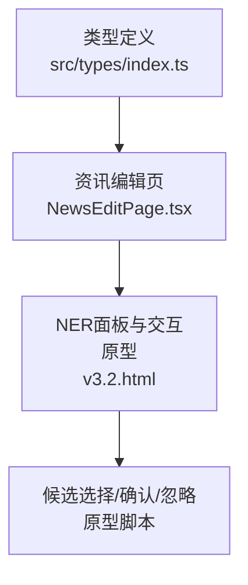
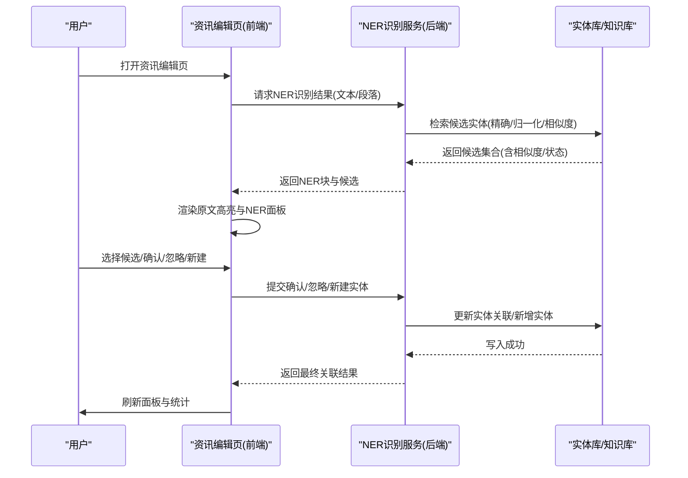
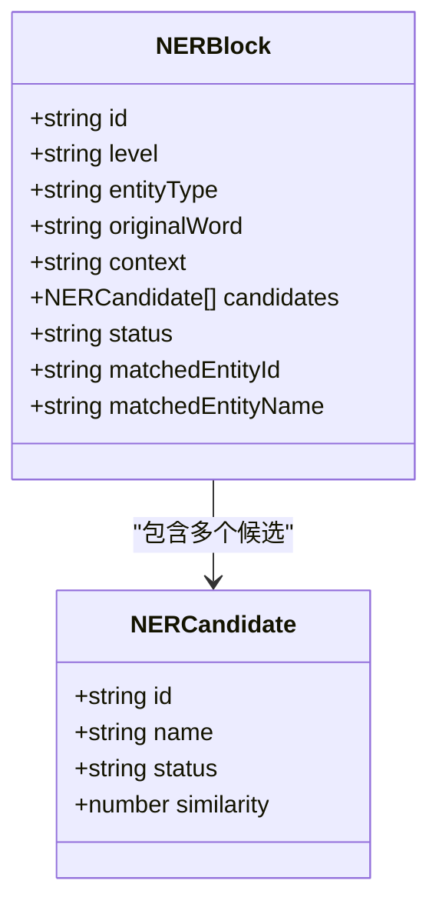
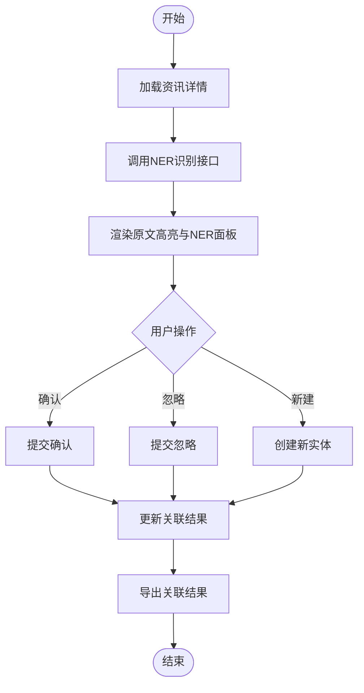
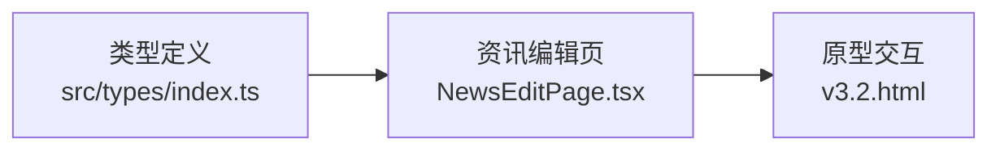

# NER命名实体识别组件

<cite>
**本文引用的文件**   
- [src/types/index.ts](file://hj-admin/src/types/index.ts)
- [src/domains/news/pages/NewsEditPage.tsx](file://hj-admin/src/domains/news/pages/NewsEditPage.tsx)
- [氢界大数据平台 — 运营管理后台 v3.2.html](file://氢界大数据平台 — 运营管理后台 v3.2.html)
</cite>

## 目录
1. [简介](#简介)
2. [项目结构](#项目结构)
3. [核心组件](#核心组件)
4. [架构总览](#架构总览)
5. [详细组件分析](#详细组件分析)
6. [依赖关系分析](#依赖关系分析)
7. [性能考虑](#性能考虑)
8. [故障排查指南](#故障排查指南)
9. [结论](#结论)
10. [附录](#附录)

## 简介
本组件面向资讯编辑与知识图谱构建场景，提供自动识别文本中企业、项目、政策、标准、专利等实体的能力，并以“置信度分层 + 候选匹配 + 人工确认”的方式完成实体归一化与关联。其目标是在保证准确率的同时提升标注效率，支持在新闻内容编辑时进行实时或批量的实体标注与确认。

## 项目结构
NER相关能力在前端以类型定义与页面交互为主：
- 类型层：集中定义实体类型、识别块、候选项、状态等数据结构
- 页面层：资讯编辑页集成NER面板，展示原文高亮、候选列表、确认/忽略操作
- 原型演示：HTML原型中包含NER扫描弹窗、候选选择、批量确认等交互逻辑

图表来源
- [src/types/index.ts:56-77](file://hj-admin/src/types/index.ts#L56-L77)
- [src/domains/news/pages/NewsEditPage.tsx:80-148](file://hj-admin/src/domains/news/pages/NewsEditPage.tsx#L80-L148)
- [氢界大数据平台 — 运营管理后台 v3.2.html:2758-2775](file://氢界大数据平台 — 运营管理后台 v3.2.html#L2758-L2775)

章节来源
- [src/types/index.ts:56-77](file://hj-admin/src/types/index.ts#L56-L77)
- [src/domains/news/pages/NewsEditPage.tsx:80-148](file://hj-admin/src/domains/news/pages/NewsEditPage.tsx#L80-L148)
- [氢界大数据平台 — 运营管理后台 v3.2.html:2758-2775](file://氢界大数据平台 — 运营管理后台 v3.2.html#L2758-L2775)

## 核心组件
- 数据类型模型
  - 实体类型：企业、项目、政策、标准、专利
  - 识别等级：L1/L2/L3（精确匹配/归一化匹配/相似度匹配）
  - 识别块：包含原文片段、上下文、候选集合、当前状态、已关联实体信息
  - 候选项：名称、状态、相似度
- 交互流程
  - 自动识别并生成NER块
  - 展示候选并按相似度排序
  - 人工确认/忽略/创建新实体
  - 批量处理与结果导出
- 结果展示
  - 原文高亮对应实体词
  - 右侧面板按等级分组展示候选与操作
  - 统计卡片汇总各类型数量与等级分布

章节来源
- [src/types/index.ts:56-77](file://hj-admin/src/types/index.ts#L56-L77)
- [src/domains/news/pages/NewsEditPage.tsx:80-148](file://hj-admin/src/domains/news/pages/NewsEditPage.tsx#L80-L148)
- [氢界大数据平台 — 运营管理后台 v3.2.html:1654-1671](file://氢界大数据平台 — 运营管理后台 v3.2.html#L1654-L1671)

## 架构总览
前端侧的NER工作流由“数据模型 + 页面渲染 + 交互脚本”构成；后端识别服务通过接口返回结构化结果，前端据此渲染NER面板与原文高亮。

图表来源
- [src/domains/news/pages/NewsEditPage.tsx:80-148](file://hj-admin/src/domains/news/pages/NewsEditPage.tsx#L80-L148)
- [氢界大数据平台 — 运营管理后台 v3.2.html:3051-3071](file://氢界大数据平台 — 运营管理后台 v3.2.html#L3051-L3071)

## 详细组件分析

### 数据模型与字段说明
- 实体类型与等级
  - 实体类型：企业(ent)、项目(prj)、政策(pol)、标准(std)、专利(pat)
  - 识别等级：L1/L2/L3
- NERBlock
  - id：识别块唯一标识
  - level：识别等级
  - entityType：实体类型
  - originalWord：被识别的原文词
  - context：上下文片段
  - candidates：候选实体数组
  - status：当前状态（已关联/待确认/已确认/已忽略）
  - matchedEntityId/matchedEntityName：已关联的实体ID与名称
- NERCandidate
  - id：候选实体ID
  - name：候选名称
  - status：候选状态（已确认/待分类/待匹配）
  - similarity：相似度百分比

图表来源
- [src/types/index.ts:56-77](file://hj-admin/src/types/index.ts#L56-L77)

章节来源
- [src/types/index.ts:56-77](file://hj-admin/src/types/index.ts#L56-L77)

### 识别算法参数与配置
- 识别等级策略
  - L1 精确匹配：基于字典/别名表直接命中
  - L2 归一化匹配：基于标准化规则（如简称/全称映射）
  - L3 相似度匹配：基于字符串相似度阈值
- 关键参数
  - 相似度阈值：用于过滤低置信度候选
  - 候选上限：限制每个识别块展示的候选数量
  - 去重策略：合并重复候选与近似候选
  - 上下文窗口：控制上下文片段长度
- 配置建议
  - 根据业务领域调整阈值与候选上限
  - 对高频实体优先启用L1/L2，降低误报
  - 对长尾实体使用L3并配合人工复核

章节来源
- [src/types/index.ts:56-58](file://hj-admin/src/types/index.ts#L56-L58)
- [氢界大数据平台 — 运营管理后台 v3.2.html:1724-1755](file://氢界大数据平台 — 运营管理后台 v3.2.html#L1724-L1755)

### 结果展示格式
- 原文高亮：在正文中对识别到的实体词进行高亮显示
- 右侧面板：按等级分组展示候选与操作按钮
- 统计卡片：汇总各类型数量与等级分布
- 标签与状态：为候选项标注状态与相似度

章节来源
- [src/domains/news/pages/NewsEditPage.tsx:80-148](file://hj-admin/src/domains/news/pages/NewsEditPage.tsx#L80-L148)
- [氢界大数据平台 — 运营管理后台 v3.2.html:1654-1671](file://氢界大数据平台 — 运营管理后台 v3.2.html#L1654-L1671)

### API接口文档
- 识别接口
  - 方法：POST /api/ner/recognize
  - 请求体：{ text, options }
    - text：待识别文本
    - options：{ levels: ["L1","L2","L3"], topK: number, threshold: number }
  - 响应体：{ blocks: NERBlock[], stats: { ent:number, prj:number, pol:number, std:number, pat:number } }
- 确认/忽略接口
  - 方法：POST /api/ner/confirm
  - 请求体：{ blockId, candidateId, action: "confirm"|"reject" }
  - 响应体：{ success: boolean, updatedBlock: NERBlock }
- 新建实体接口
  - 方法：POST /api/entities/create
  - 请求体：{ name, type, meta }
  - 响应体：{ entity: EntityItem }

注意：以上为基于现有数据模型的接口契约建议，便于前后端协作开发。

章节来源
- [src/types/index.ts:56-77](file://hj-admin/src/types/index.ts#L56-L77)

### 实际业务集成示例（新闻内容编辑）
- 打开资讯编辑页后，系统自动调用识别接口并渲染NER面板
- 编辑者在右侧面板逐项确认候选，可一键忽略或创建新实体
- 完成后导出关联结果，进入下游知识图谱入库流程

图表来源
- [src/domains/news/pages/NewsEditPage.tsx:80-148](file://hj-admin/src/domains/news/pages/NewsEditPage.tsx#L80-L148)
- [氢界大数据平台 — 运营管理后台 v3.2.html:3051-3071](file://氢界大数据平台 — 运营管理后台 v3.2.html#L3051-L3071)

章节来源
- [src/domains/news/pages/NewsEditPage.tsx:80-148](file://hj-admin/src/domains/news/pages/NewsEditPage.tsx#L80-L148)
- [氢界大数据平台 — 运营管理后台 v3.2.html:3051-3071](file://氢界大数据平台 — 运营管理后台 v3.2.html#L3051-L3071)

### 扩展机制（自定义实体类型与识别规则）
- 新增实体类型
  - 在类型定义中扩展EntityType枚举
  - 在页面统计与面板中增加对应展示与筛选
- 新增识别规则
  - 在识别服务中追加规则（如正则、词典、相似度策略）
  - 调整阈值与候选上限，确保召回与精度的平衡
- 新增候选状态
  - 在NERCandidate状态中扩展新状态
  - 在交互逻辑中适配新状态的提示与流转

章节来源
- [src/types/index.ts:56-77](file://hj-admin/src/types/index.ts#L56-L77)

## 依赖关系分析
- 前端依赖
  - React + Ant Design：用于页面布局与交互组件
  - 路由与参数：用于资讯详情页导航与参数解析
- 数据依赖
  - 类型定义：统一前后端数据结构
  - 原型脚本：用于快速验证交互流程

图表来源
- [src/types/index.ts:56-77](file://hj-admin/src/types/index.ts#L56-L77)
- [src/domains/news/pages/NewsEditPage.tsx:80-148](file://hj-admin/src/domains/news/pages/NewsEditPage.tsx#L80-L148)
- [氢界大数据平台 — 运营管理后台 v3.2.html:3051-3071](file://氢界大数据平台 — 运营管理后台 v3.2.html#L3051-L3071)

章节来源
- [src/types/index.ts:56-77](file://hj-admin/src/types/index.ts#L56-L77)
- [src/domains/news/pages/NewsEditPage.tsx:80-148](file://hj-admin/src/domains/news/pages/NewsEditPage.tsx#L80-L148)
- [氢界大数据平台 — 运营管理后台 v3.2.html:3051-3071](file://氢界大数据平台 — 运营管理后台 v3.2.html#L3051-L3071)

## 性能考虑
- 识别阶段
  - 分块识别：将长文本切分为段落或句子，降低单次计算量
  - 缓存策略：对常见实体与别名建立本地缓存，减少重复计算
  - 并行处理：对多段落并发识别，提高吞吐
- 渲染阶段
  - 虚拟滚动：当候选较多时使用虚拟列表优化渲染
  - 增量更新：仅更新变更的NER块，避免全量重绘
- 网络阶段
  - 请求合并：批量提交确认/忽略操作，减少往返次数
  - 超时与重试：设置合理超时与重试策略，保障稳定性

[本节为通用指导，不直接分析具体文件]

## 故障排查指南
- 常见问题
  - 未选中候选即确认：需先选择候选再提交
  - 候选过多导致卡顿：调整topK与阈值，或使用分页/虚拟列表
  - 相似度偏低导致误报：调高阈值或补充词典
- 定位步骤
  - 检查识别等级与阈值配置
  - 查看候选状态与相似度分布
  - 核对确认/忽略操作的请求与响应
- 恢复措施
  - 重置NER面板状态
  - 重新触发识别流程
  - 清理缓存并重试

章节来源
- [氢界大数据平台 — 运营管理后台 v3.2.html:3051-3071](file://氢界大数据平台 — 运营管理后台 v3.2.html#L3051-L3071)

## 结论
该NER组件通过“等级化识别 + 候选匹配 + 人工确认”的工作流，有效提升了实体标注的效率与准确性。结合可扩展的类型与规则体系，能够灵活适配不同业务场景。建议在后续迭代中完善后端识别服务与接口契约，并持续优化阈值与候选策略以提升整体效果。

[本节为总结性内容，不直接分析具体文件]

## 附录
- 术语
  - 实体：具有明确语义的对象，如企业、项目、政策等
  - 候选：与识别词可能匹配的实体集合
  - 相似度：衡量候选与识别词相近程度的数值
- 最佳实践
  - 优先完善L1/L2规则，降低L3误报率
  - 定期复盘低置信度样本，补充词典与规则
  - 建立标注质量评估指标，持续优化

[本节为概念性内容，不直接分析具体文件]