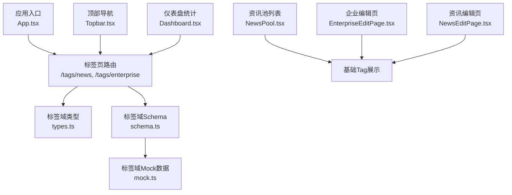
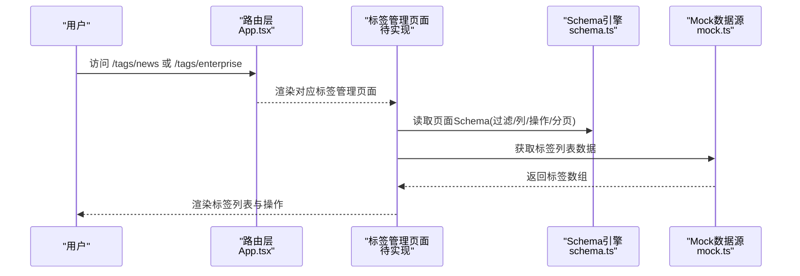
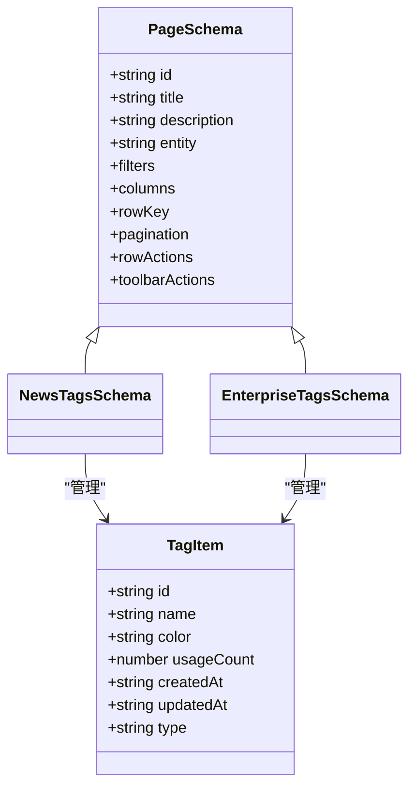
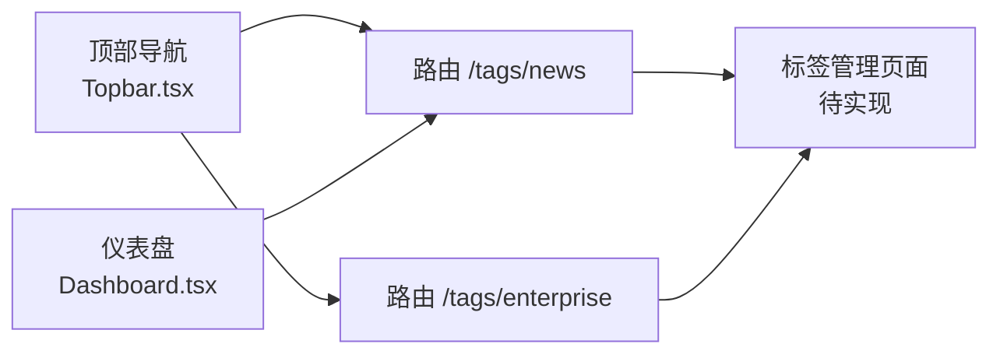
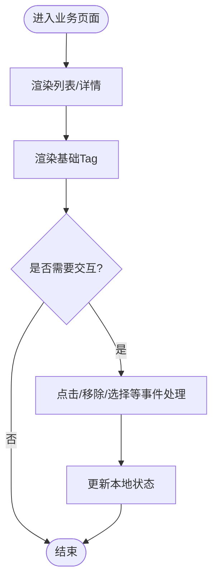
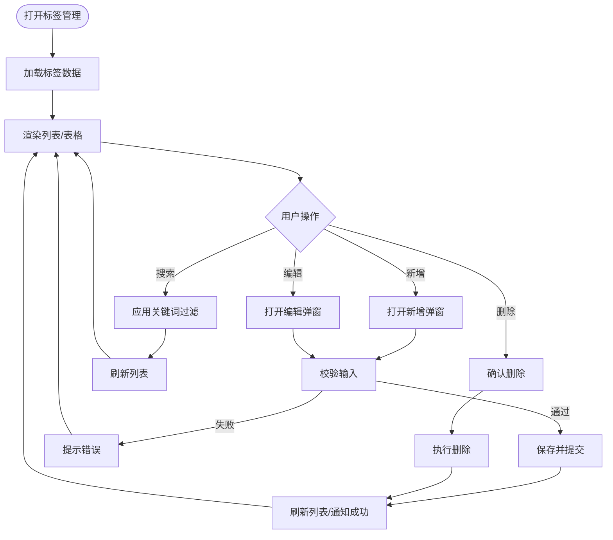
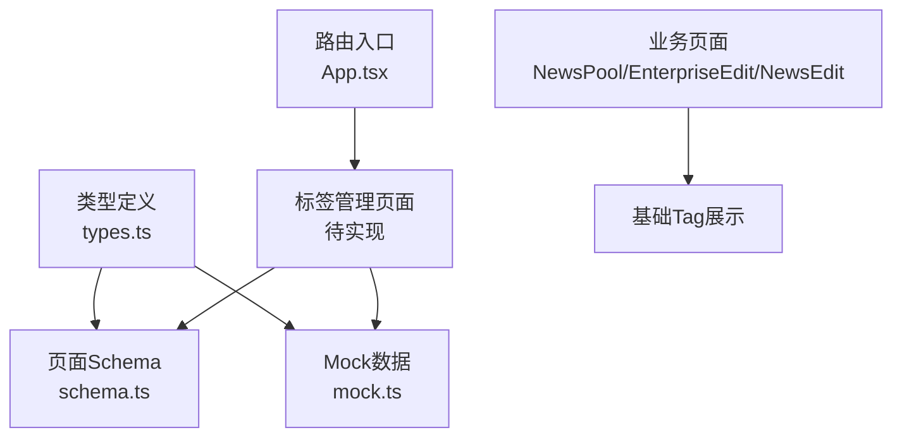

# Tags标签组件

<cite>
**本文引用的文件**
- [App.tsx](file://hj-admin/src/App.tsx)
- [types.ts](file://hj-admin/src/domains/tags/types.ts)
- [schema.ts](file://hj-admin/src/domains/tags/schema.ts)
- [mock.ts](file://hj-admin/src/domains/tags/mock.ts)
- [Topbar.tsx](file://hj-admin/src/layouts/Topbar.tsx)
- [Dashboard.tsx](file://hj-admin/src/pages/dashboard/Dashboard.tsx)
- [NewsPool.tsx](file://hj-admin/src/pages/news/NewsPool.tsx)
- [EnterpriseEditPage.tsx](file://hj-admin/src/domains/enterprise/pages/EnterpriseEditPage.tsx)
- [NewsEditPage.tsx](file://hj-admin/src/domains/news/pages/NewsEditPage.tsx)
</cite>

## 目录
1. [简介](#简介)
2. [项目结构](#项目结构)
3. [核心组件](#核心组件)
4. [架构总览](#架构总览)
5. [详细组件分析](#详细组件分析)
6. [依赖分析](#依赖分析)
7. [性能考虑](#性能考虑)
8. [故障排查指南](#故障排查指南)
9. [结论](#结论)
10. [附录](#附录)

## 简介
本文件围绕“Tags标签组件”进行系统化文档化，聚焦以下目标：
- 多功能标签管理能力：创建、编辑、删除、搜索与批量操作
- Props接口说明：标签数据格式、显示模式、交互行为配置
- 使用示例：表单输入、筛选器、分类管理等场景
- 后端集成：异步加载、缓存策略、状态同步
- 自定义样式主题与响应式适配
- 可访问性与国际化配置

本项目中，标签能力由“领域Schema + Mock数据 + 页面路由”共同构成。当前仓库未提供独立的通用Tag UI组件实现，但通过Schema驱动与Mock数据，已具备完整的标签管理页面骨架与数据契约，可作为后续封装通用“Tags标签组件”的基础。

## 项目结构
与标签相关的代码主要分布在以下位置：
- 路由入口：定义标签管理页面的路由映射
- 领域类型与Schema：定义标签实体结构与页面渲染规则（列、过滤、行操作、工具栏）
- Mock数据：提供标签列表的样例数据
- 布局与导航：顶部导航展示标签管理入口
- 业务页面：资讯池与企业编辑等页面中使用基础Tag进行展示或交互

图表来源
- [App.tsx:28-30](file://hj-admin/src/App.tsx#L28-L30)
- [Topbar.tsx:9-10](file://hj-admin/src/layouts/Topbar.tsx#L9-L10)
- [Dashboard.tsx:11](file://hj-admin/src/pages/dashboard/Dashboard.tsx#L11)
- [types.ts:1-10](file://hj-admin/src/domains/tags/types.ts#L1-L10)
- [schema.ts:1-39](file://hj-admin/src/domains/tags/schema.ts#L1-L39)
- [mock.ts:1-20](file://hj-admin/src/domains/tags/mock.ts#L1-L20)
- [NewsPool.tsx:1](file://hj-admin/src/pages/news/NewsPool.tsx#L1)
- [EnterpriseEditPage.tsx:3](file://hj-admin/src/domains/enterprise/pages/EnterpriseEditPage.tsx#L3)
- [NewsEditPage.tsx:5](file://hj-admin/src/domains/news/pages/NewsEditPage.tsx#L5)

章节来源
- [App.tsx:28-30](file://hj-admin/src/App.tsx#L28-L30)
- [Topbar.tsx:9-10](file://hj-admin/src/layouts/Topbar.tsx#L9-L10)
- [Dashboard.tsx:11](file://hj-admin/src/pages/dashboard/Dashboard.tsx#L11)
- [types.ts:1-10](file://hj-admin/src/domains/tags/types.ts#L1-L10)
- [schema.ts:1-39](file://hj-admin/src/domains/tags/schema.ts#L1-L39)
- [mock.ts:1-20](file://hj-admin/src/domains/tags/mock.ts#L1-L20)
- [NewsPool.tsx:1](file://hj-admin/src/pages/news/NewsPool.tsx#L1)
- [EnterpriseEditPage.tsx:3](file://hj-admin/src/domains/enterprise/pages/EnterpriseEditPage.tsx#L3)
- [NewsEditPage.tsx:5](file://hj-admin/src/domains/news/pages/NewsEditPage.tsx#L5)

## 核心组件
当前仓库未提供独立的通用“Tags标签组件”实现，但提供了标签管理的完整数据契约与页面Schema，可用于构建通用组件。

- 标签数据模型
  - 字段：id、name、color、usageCount、createdAt、updatedAt、type
  - type用于区分“资讯标签”和“企业标签”两类标签体系
- 页面Schema
  - filters：支持按名称关键字搜索
  - columns：展示名称、颜色、使用次数、创建时间、更新时间
  - rowActions：支持编辑与删除（含确认提示）
  - toolbarActions：支持新增标签
  - pagination：分页大小与总数展示
- Mock数据
  - 提供资讯与企业两类标签的样例数据，便于快速验证UI与交互

章节来源
- [types.ts:1-10](file://hj-admin/src/domains/tags/types.ts#L1-L10)
- [schema.ts:1-39](file://hj-admin/src/domains/tags/schema.ts#L1-L39)
- [mock.ts:1-20](file://hj-admin/src/domains/tags/mock.ts#L1-L20)

## 架构总览
从应用层到数据层的调用关系如下：
- 路由层将“标签管理”页面挂载至具体路径
- 页面层基于Schema渲染表格、过滤、行操作与工具栏
- 数据层通过Mock提供初始数据，后续可替换为真实API
- 其他业务页面（如资讯池、企业编辑、资讯编辑）使用基础Tag进行展示或轻量交互

图表来源
- [App.tsx:28-30](file://hj-admin/src/App.tsx#L28-L30)
- [schema.ts:1-39](file://hj-admin/src/domains/tags/schema.ts#L1-L39)
- [mock.ts:1-20](file://hj-admin/src/domains/tags/mock.ts#L1-L20)

## 详细组件分析

### 数据模型与Schema
- 数据模型
  - id：唯一标识
  - name：标签名称
  - color：标签颜色
  - usageCount：使用次数
  - createdAt/updatedAt：时间戳
  - type：标签类型（news | enterprise）
- Schema要点
  - 过滤：keyword输入框，占位符为“标签名称”
  - 列：名称、颜色、使用次数、创建时间、更新时间
  - 行操作：编辑、删除（带确认文案）
  - 工具栏：新增标签
  - 分页：pageSize=20，showTotal=true

图表来源
- [types.ts:1-10](file://hj-admin/src/domains/tags/types.ts#L1-L10)
- [schema.ts:1-39](file://hj-admin/src/domains/tags/schema.ts#L1-L39)

章节来源
- [types.ts:1-10](file://hj-admin/src/domains/tags/types.ts#L1-L10)
- [schema.ts:1-39](file://hj-admin/src/domains/tags/schema.ts#L1-L39)

### 页面与导航集成
- 路由挂载
  - /tags/news：资讯标签管理
  - /tags/enterprise：企业标签管理
- 顶部导航
  - 在顶部导航中展示“标签管理 › 资讯标签/企业标签”的链接
- 仪表盘统计
  - 仪表盘卡片中包含“资讯标签”统计项

图表来源
- [App.tsx:28-30](file://hj-admin/src/App.tsx#L28-L30)
- [Topbar.tsx:9-10](file://hj-admin/src/layouts/Topbar.tsx#L9-L10)
- [Dashboard.tsx:11](file://hj-admin/src/pages/dashboard/Dashboard.tsx#L11)

章节来源
- [App.tsx:28-30](file://hj-admin/src/App.tsx#L28-L30)
- [Topbar.tsx:9-10](file://hj-admin/src/layouts/Topbar.tsx#L9-L10)
- [Dashboard.tsx:11](file://hj-admin/src/pages/dashboard/Dashboard.tsx#L11)

### 业务页面中的标签使用
- 资讯池列表
  - 表格列包含“标签”，以Tag形式展示
- 企业编辑页
  - 使用Tag展示来源、关联度等信息
- 资讯编辑页
  - 展示自动标签列表，并支持移除单个标签

图表来源
- [NewsPool.tsx:1](file://hj-admin/src/pages/news/NewsPool.tsx#L1)
- [EnterpriseEditPage.tsx:3](file://hj-admin/src/domains/enterprise/pages/EnterpriseEditPage.tsx#L3)
- [NewsEditPage.tsx:5](file://hj-admin/src/domains/news/pages/NewsEditPage.tsx#L5)

章节来源
- [NewsPool.tsx:1](file://hj-admin/src/pages/news/NewsPool.tsx#L1)
- [EnterpriseEditPage.tsx:3](file://hj-admin/src/domains/enterprise/pages/EnterpriseEditPage.tsx#L3)
- [NewsEditPage.tsx:5](file://hj-admin/src/domains/news/pages/NewsEditPage.tsx#L5)

### 通用“Tags标签组件”设计建议（面向后续封装）
- 功能范围
  - 创建：支持新增标签（名称、颜色、类型）
  - 编辑：修改名称、颜色、类型
  - 删除：二次确认后删除
  - 搜索：按名称关键字过滤
  - 批量操作：批量删除、批量设置颜色/类型
- Props接口建议
  - dataSource：标签数据数组（遵循TagItem）
  - mode：显示模式（list/table/select）
  - filterable：是否启用搜索
  - actions：行操作集合（edit/delete/batch）
  - pagination：分页配置
  - onChange：数据变更回调
  - theme：主题配置（颜色、尺寸、圆角等）
  - locale：国际化键值映射
- 交互流程（新增/编辑/删除）

[本节为概念性设计，不直接分析具体源码文件]

## 依赖分析
- 组件耦合
  - 路由层仅负责挂载页面，对标签逻辑无强耦合
  - Schema与Mock解耦，便于替换为真实API
  - 业务页面仅消费基础Tag进行展示，避免复杂依赖
- 外部依赖
  - 前端UI库（Ant Design）用于基础Tag、表格、按钮等
- 潜在循环依赖
  - 当前未见循环引用；Schema与Mock单向依赖类型定义

图表来源
- [types.ts:1-10](file://hj-admin/src/domains/tags/types.ts#L1-L10)
- [schema.ts:1-39](file://hj-admin/src/domains/tags/schema.ts#L1-L39)
- [mock.ts:1-20](file://hj-admin/src/domains/tags/mock.ts#L1-L20)
- [App.tsx:28-30](file://hj-admin/src/App.tsx#L28-L30)
- [NewsPool.tsx:1](file://hj-admin/src/pages/news/NewsPool.tsx#L1)
- [EnterpriseEditPage.tsx:3](file://hj-admin/src/domains/enterprise/pages/EnterpriseEditPage.tsx#L3)
- [NewsEditPage.tsx:5](file://hj-admin/src/domains/news/pages/NewsEditPage.tsx#L5)

章节来源
- [types.ts:1-10](file://hj-admin/src/domains/tags/types.ts#L1-L10)
- [schema.ts:1-39](file://hj-admin/src/domains/tags/schema.ts#L1-L39)
- [mock.ts:1-20](file://hj-admin/src/domains/tags/mock.ts#L1-L20)
- [App.tsx:28-30](file://hj-admin/src/App.tsx#L28-L30)
- [NewsPool.tsx:1](file://hj-admin/src/pages/news/NewsPool.tsx#L1)
- [EnterpriseEditPage.tsx:3](file://hj-admin/src/domains/enterprise/pages/EnterpriseEditPage.tsx#L3)
- [NewsEditPage.tsx:5](file://hj-admin/src/domains/news/pages/NewsEditPage.tsx#L5)

## 性能考虑
- 列表渲染
  - 大数据量时建议使用虚拟滚动或分页加载
- 搜索过滤
  - 前端关键字过滤需结合防抖，避免频繁重渲染
- 网络请求
  - 首次加载与增量更新分离，避免全量刷新
- 内存占用
  - 及时释放无用状态与监听器，避免闭包泄漏

[本节提供一般性指导，不直接分析具体源码文件]

## 故障排查指南
- 路由无法访问
  - 检查路由路径是否正确挂载
  - 确认页面组件是否存在并已正确导入
- 列表为空
  - 检查Mock数据是否被正确引入
  - 若已替换为API，确认接口返回数据结构是否符合TagItem
- 操作无效
  - 确认行操作与工具栏按钮的事件绑定
  - 检查删除确认文案与提交逻辑
- 样式异常
  - 检查Tag颜色与尺寸是否与主题一致
  - 确认CSS覆盖是否生效

章节来源
- [App.tsx:28-30](file://hj-admin/src/App.tsx#L28-L30)
- [schema.ts:1-39](file://hj-admin/src/domains/tags/schema.ts#L1-L39)
- [mock.ts:1-20](file://hj-admin/src/domains/tags/mock.ts#L1-L20)

## 结论
当前仓库已具备标签管理的完整数据契约与页面Schema，以及Mock数据支撑，可作为通用“Tags标签组件”的坚实基础。建议在现有Schema与类型基础上，封装统一的标签组件，完善增删改查、搜索与批量操作，同时对接真实API，实现异步加载、缓存与状态同步，并提供主题与国际化扩展点。

[本节为总结性内容，不直接分析具体源码文件]

## 附录
- 使用示例（概念性）
  - 表单输入：在表单内以多选Tag方式选择多个标签
  - 筛选器：在查询条件区以Tag组展示已选筛选标签，支持一键清空
  - 分类管理：在分类树旁以Tag展示分类属性，支持拖拽排序与批量移动
- 后端集成建议
  - 异步加载：分页+懒加载，首屏优先
  - 缓存策略：本地缓存最近使用的标签列表，减少重复请求
  - 状态同步：乐观更新+失败回滚，确保用户体验
- 主题与响应式
  - 通过Props传入主题对象，控制颜色、尺寸、间距
  - 在小屏设备上采用折叠/滚动容器，保证可用性
- 可访问性与国际化
  - 为关键交互元素提供aria-label与键盘可达性
  - 通过locale对象提供多语言文案，支持动态切换

[本节为概念性内容，不直接分析具体源码文件]