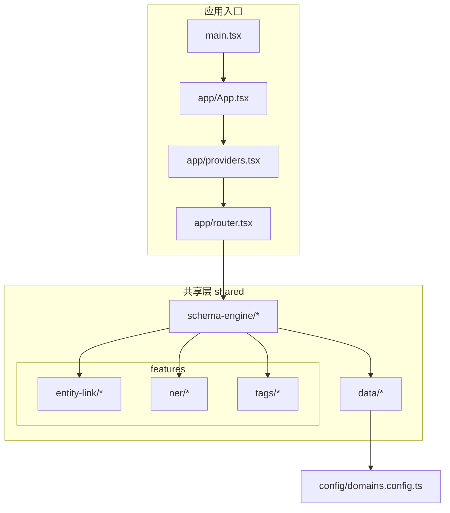
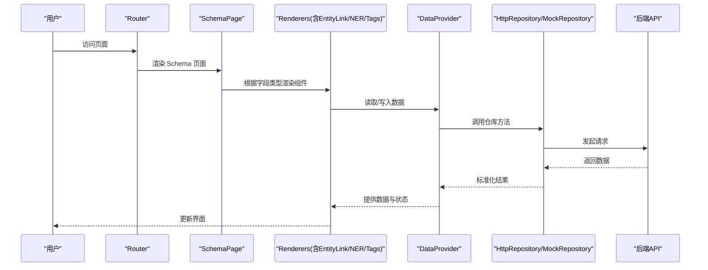
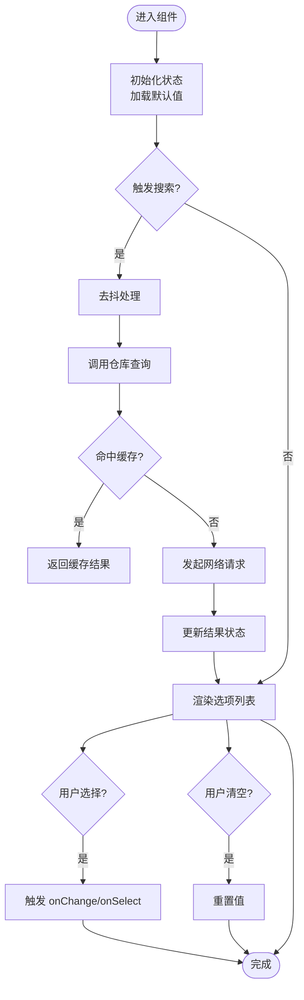
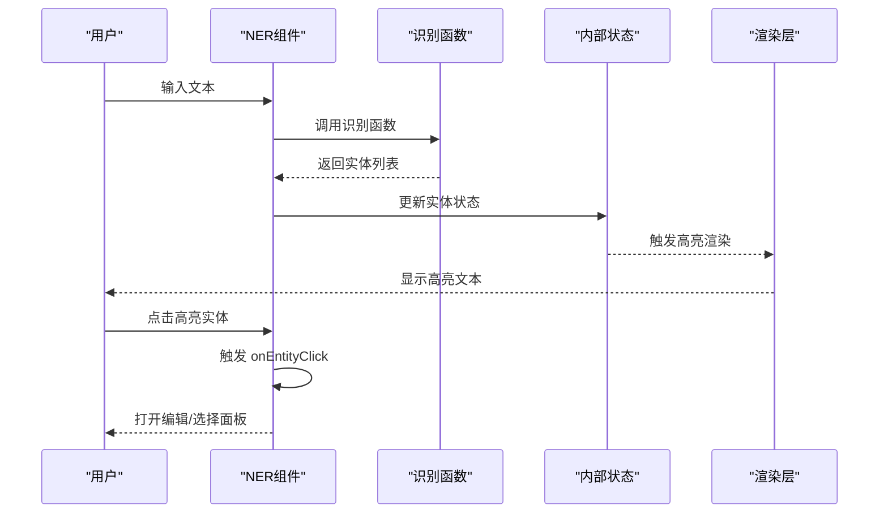
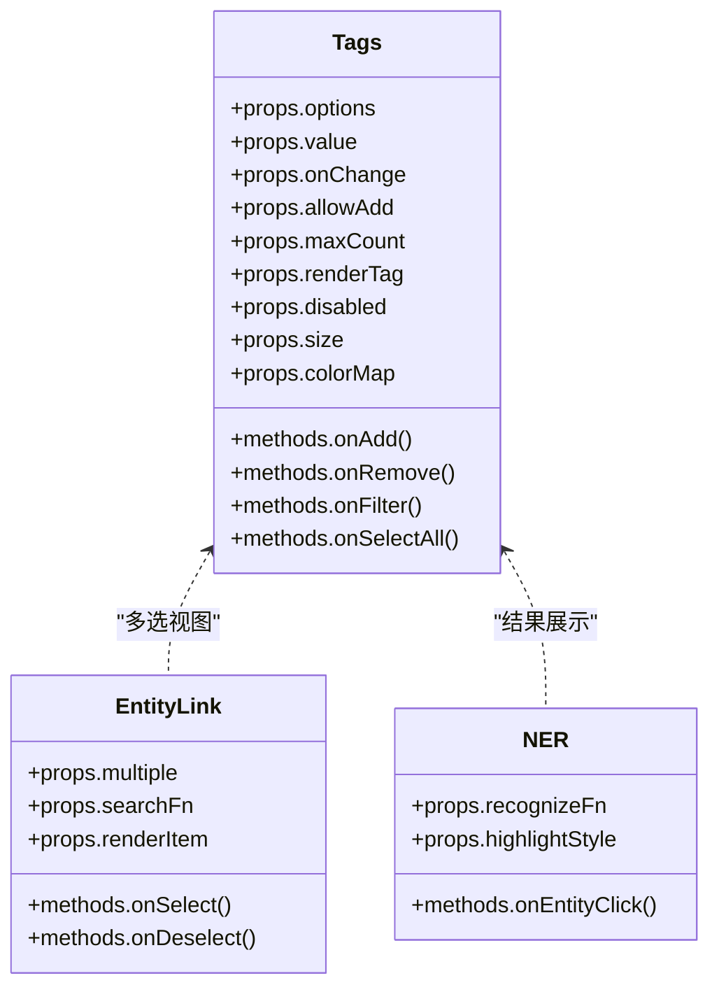
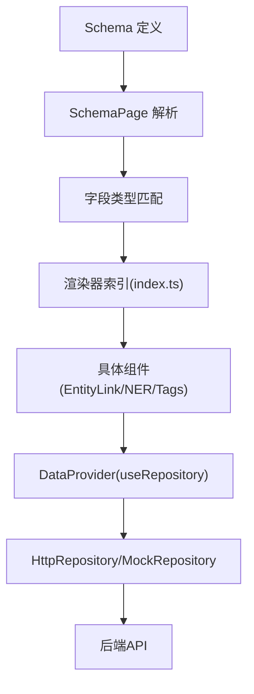
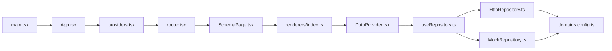

# 共享组件库

<cite>
**本文引用的文件**   
- [App.tsx](file://hj-admin/src/app/App.tsx)
- [providers.tsx](file://hj-admin/src/app/providers.tsx)
- [router.tsx](file://hj-admin/src/app/router.tsx)
- [bootstrap.ts](file://hj-admin/src/app/bootstrap.ts)
- [SchemaPage.tsx](file://hj-admin/src/shared/schema-engine/SchemaPage.tsx)
- [hooks.ts](file://hj-admin/src/shared/schema-engine/hooks.ts)
- [types.ts](file://hj-admin/src/shared/schema-engine/types.ts)
- [index.ts](file://hj-admin/src/shared/schema-engine/renderers/index.ts)
- [DataProvider.tsx](file://hj-admin/src/shared/data/DataProvider.tsx)
- [HttpRepository.ts](file://hj-admin/src/shared/data/HttpRepository.ts)
- [MockRepository.ts](file://hj-admin/src/shared/data/MockRepository.ts)
- [useRepository.ts](file://hj-admin/src/shared/data/useRepository.ts)
- [types.ts](file://hj-admin/src/shared/data/types.ts)
- [domains.config.ts](file://hj-admin/src/config/domains.config.ts)
- [main.tsx](file://hj-admin/src/main.tsx)
</cite>

## 目录
1. [简介](#简介)
2. [项目结构](#项目结构)
3. [核心组件](#核心组件)
4. [架构总览](#架构总览)
5. [详细组件分析](#详细组件分析)
6. [依赖分析](#依赖分析)
7. [性能考虑](#性能考虑)
8. [故障排查指南](#故障排查指南)
9. [结论](#结论)
10. [附录](#附录)

## 简介
本共享组件库围绕“可复用、可扩展、可配置”的目标，提供以下关键能力：
- 实体链接 EntityLink：在表单或页面中快速选择并展示关联实体（如企业、资源等），支持远程搜索与结果渲染。
- 命名实体识别 NER：在文本输入过程中进行实体抽取与高亮，便于标注与编辑。
- 标签 Tags：用于多值选择、过滤与展示，支持自定义渲染与事件回调。
- Schema 引擎与渲染器：通过声明式 Schema 驱动页面与表单的生成，配合 renderers 扩展点实现组件级定制。
- 数据层抽象：统一的数据访问接口，支持 HTTP 与 Mock 两种仓库实现，便于开发与测试切换。

该文档面向开发者与集成者，提供 API 参考、使用示例、集成方式、扩展机制、性能优化与测试方法。

## 项目结构
共享组件与相关基础设施位于 src/shared 下，按功能域组织：
- features/entity-link：实体链接组件及其类型、样式与逻辑
- features/ner：命名实体识别组件
- features/tags：标签组件
- schema-engine：基于 Schema 的页面/表单渲染引擎与扩展点
- data：数据访问抽象与仓库实现

图表来源
- [main.tsx](file://hj-admin/src/main.tsx)
- [App.tsx](file://hj-admin/src/app/App.tsx)
- [providers.tsx](file://hj-admin/src/app/providers.tsx)
- [router.tsx](file://hj-admin/src/app/router.tsx)
- [SchemaPage.tsx](file://hj-admin/src/shared/schema-engine/SchemaPage.tsx)
- [index.ts](file://hj-admin/src/shared/schema-engine/renderers/index.ts)
- [DataProvider.tsx](file://hj-admin/src/shared/data/DataProvider.tsx)
- [HttpRepository.ts](file://hj-admin/src/shared/data/HttpRepository.ts)
- [MockRepository.ts](file://hj-admin/src/shared/data/MockRepository.ts)
- [useRepository.ts](file://hj-admin/src/shared/data/useRepository.ts)
- [types.ts](file://hj-admin/src/shared/data/types.ts)
- [domains.config.ts](file://hj-admin/src/config/domains.config.ts)

章节来源
- [main.tsx](file://hj-admin/src/main.tsx)
- [App.tsx](file://hj-admin/src/app/App.tsx)
- [providers.tsx](file://hj-admin/src/app/providers.tsx)
- [router.tsx](file://hj-admin/src/app/router.tsx)
- [SchemaPage.tsx](file://hj-admin/src/shared/schema-engine/SchemaPage.tsx)
- [index.ts](file://hj-admin/src/shared/schema-engine/renderers/index.ts)
- [DataProvider.tsx](file://hj-admin/src/shared/data/DataProvider.tsx)
- [HttpRepository.ts](file://hj-admin/src/shared/data/HttpRepository.ts)
- [MockRepository.ts](file://hj-admin/src/shared/data/MockRepository.ts)
- [useRepository.ts](file://hj-admin/src/shared/data/useRepository.ts)
- [types.ts](file://hj-admin/src/shared/data/types.ts)
- [domains.config.ts](file://hj-admin/src/config/domains.config.ts)

## 核心组件
本节概述三大 UI 组件的职责与交互边界，以及它们在 Schema 引擎中的接入方式。

- EntityLink 实体链接
  - 职责：根据关键词搜索实体列表，支持单选/多选、远程分页、选中项渲染与清除。
  - 典型 Props：value、onChange、placeholder、searchFn、renderItem、disabled、loading、multiple、filterOptions、onSearch、onSelect、onDeselect、onClear、id/name（表单绑定）、aria-* 无障碍属性。
  - 事件：onSearch、onSelect、onDeselect、onClear、onChange。
  - 样式：主题色、尺寸、间距、选中态、禁用态、下拉面板定位与宽度。
  - 组合：可与 Tags 组合为“多选实体标签”，或与 NER 结合在标注场景下自动补全。

- NER 命名实体识别
  - 职责：监听输入变化，调用识别服务返回实体边界与类型，并在文本中高亮显示；支持点击编辑或删除实体。
  - 典型 Props：value、onChange、placeholder、recognizeFn、highlightStyle、editable、entities、readOnly、aria-*。
  - 事件：onChange、onEntityClick、onEntityRemove、onRecognize。
  - 样式：高亮颜色、光标位置、悬浮提示、编辑弹窗/行内编辑样式。
  - 组合：与 EntityLink 联动，将识别到的实体直接映射为已选实体；与 Tags 组合展示识别结果摘要。

- Tags 标签
  - 职责：展示一组标签，支持新增、删除、全选、反选、搜索过滤与自定义渲染。
  - 典型 Props：options、value、onChange、placeholder、allowAdd、maxCount、renderTag、disabled、size、colorMap、tagProps、aria-*。
  - 事件：onChange、onAdd、onRemove、onFilter、onSelectAll。
  - 样式：尺寸、圆角、边框、背景、选中态、禁用态、溢出省略。
  - 组合：作为 EntityLink 的多选视图，或作为 NER 识别结果的可视化呈现。

章节来源
- [SchemaPage.tsx](file://hj-admin/src/shared/schema-engine/SchemaPage.tsx)
- [index.ts](file://hj-admin/src/shared/schema-engine/renderers/index.ts)
- [DataProvider.tsx](file://hj-admin/src/shared/data/DataProvider.tsx)
- [HttpRepository.ts](file://hj-admin/src/shared/data/HttpRepository.ts)
- [MockRepository.ts](file://hj-admin/src/shared/data/MockRepository.ts)
- [useRepository.ts](file://hj-admin/src/shared/data/useRepository.ts)
- [types.ts](file://hj-admin/src/shared/data/types.ts)

## 架构总览
整体采用“Schema 驱动 + 渲染器扩展 + 数据仓库抽象”的分层架构：
- 应用层：路由与 Provider 注入全局上下文（主题、语言、数据源）。
- 渲染层：SchemaPage 解析 Schema，按字段类型分发到对应渲染器（EntityLink、NER、Tags 等）。
- 数据层：DataProvider 暴露统一 useRepository Hook，底层由 HttpRepository/MockRepository 实现。
- 配置层：domains.config.ts 集中管理领域接口地址与默认参数。

图表来源
- [router.tsx](file://hj-admin/src/app/router.tsx)
- [SchemaPage.tsx](file://hj-admin/src/shared/schema-engine/SchemaPage.tsx)
- [index.ts](file://hj-admin/src/shared/schema-engine/renderers/index.ts)
- [DataProvider.tsx](file://hj-admin/src/shared/data/DataProvider.tsx)
- [HttpRepository.ts](file://hj-admin/src/shared/data/HttpRepository.ts)
- [MockRepository.ts](file://hj-admin/src/shared/data/MockRepository.ts)

## 详细组件分析

### EntityLink 实体链接组件
- 设计模式
  - 受控组件：通过 value/onChange 与上层状态同步。
  - 远程搜索：onSearch 触发时调用仓库查询，支持分页与去抖。
  - 渲染器扩展：在 renderers/index.ts 中注册，供 SchemaPage 动态渲染。
- 关键 Props
  - value: 当前选中实体或实体数组
  - onChange: 值变更回调
  - searchFn: 搜索函数（或从仓库派生）
  - renderItem: 自定义选项渲染
  - multiple: 是否多选
  - disabled/loading/placeholder/id/name 等
- 事件
  - onSearch(keyword): 触发搜索
  - onSelect(item)/onDeselect(item)/onClear(): 单项操作
  - onChange(value): 值变更
- 样式定制
  - 主题变量覆盖（主色、字号、间距）
  - 下拉面板定位策略（固定/绝对）
  - 选中态与禁用态样式
- 与其他组件组合
  - 与 Tags 组合：将多选结果以标签形式展示
  - 与 NER 组合：将识别出的实体自动加入选中集合
- 性能优化
  - 搜索结果缓存与去抖
  - 虚拟滚动（大数据集）
  - React.memo 包裹选项渲染
- 测试建议
  - 单元测试：搜索、选择、清空、禁用态
  - 集成测试：与 DataProvider 和仓库联调
  - 快照测试：渲染结构与样式一致性

图表来源
- [SchemaPage.tsx](file://hj-admin/src/shared/schema-engine/SchemaPage.tsx)
- [index.ts](file://hj-admin/src/shared/schema-engine/renderers/index.ts)
- [DataProvider.tsx](file://hj-admin/src/shared/data/DataProvider.tsx)
- [HttpRepository.ts](file://hj-admin/src/shared/data/HttpRepository.ts)
- [MockRepository.ts](file://hj-admin/src/shared/data/MockRepository.ts)
- [useRepository.ts](file://hj-admin/src/shared/data/useRepository.ts)

章节来源
- [SchemaPage.tsx](file://hj-admin/src/shared/schema-engine/SchemaPage.tsx)
- [index.ts](file://hj-admin/src/shared/schema-engine/renderers/index.ts)
- [DataProvider.tsx](file://hj-admin/src/shared/data/DataProvider.tsx)
- [HttpRepository.ts](file://hj-admin/src/shared/data/HttpRepository.ts)
- [MockRepository.ts](file://hj-admin/src/shared/data/MockRepository.ts)
- [useRepository.ts](file://hj-admin/src/shared/data/useRepository.ts)

### NER 命名实体识别组件
- 设计模式
  - 受控文本输入：value/onChange 控制文本内容
  - 识别回调：recognizeFn 接收文本并返回实体边界与类型
  - 高亮渲染：根据实体边界计算 DOM 片段并插入高亮节点
- 关键 Props
  - value/onChange、placeholder、recognizeFn、highlightStyle、editable、entities、readOnly
- 事件
  - onChange(text)、onEntityClick(entity)、onEntityRemove(entity)、onRecognize(entities)
- 样式定制
  - 高亮颜色、边框、阴影、悬浮提示
  - 编辑态下的行内编辑器样式
- 与其他组件组合
  - 与 EntityLink 联动：点击高亮实体后打开选择器
  - 与 Tags 组合：展示识别结果摘要
- 性能优化
  - 增量识别：仅对变更区间重新计算
  - 防抖识别：避免频繁调用识别服务
  - 选择性重渲染：仅高亮区域更新
- 测试建议
  - 边界条件：空文本、超长文本、特殊字符
  - 识别准确性：模拟 recognizeFn 返回不同实体集合
  - 交互流程：点击高亮、删除实体、编辑文本

图表来源
- [SchemaPage.tsx](file://hj-admin/src/shared/schema-engine/SchemaPage.tsx)
- [index.ts](file://hj-admin/src/shared/schema-engine/renderers/index.ts)

章节来源
- [SchemaPage.tsx](file://hj-admin/src/shared/schema-engine/SchemaPage.tsx)
- [index.ts](file://hj-admin/src/shared/schema-engine/renderers/index.ts)

### Tags 标签组件
- 设计模式
  - 受控集合：value 为字符串/对象数组，onChange 同步更新
  - 可添加/删除：allowAdd 控制手动新增，maxCount 限制数量
  - 自定义渲染：renderTag 支持图标、颜色、操作按钮
- 关键 Props
  - options/value/onChange、placeholder、allowAdd、maxCount、renderTag、disabled、size、colorMap、tagProps
- 事件
  - onChange(values)、onAdd(tag)、onRemove(tag)、onFilter(keyword)、onSelectAll()
- 样式定制
  - 尺寸、圆角、边框、背景、选中态、禁用态、溢出省略
- 与其他组件组合
  - 作为 EntityLink 的多选视图
  - 作为 NER 识别结果的可视化摘要
- 性能优化
  - 列表虚拟化（大量标签）
  - 局部更新：仅变更标签重渲染
  - 防抖过滤：输入过滤时延迟执行
- 测试建议
  - 增删改查：新增、删除、全选、反选
  - 边界条件：超过 maxCount、重复标签、空集合
  - 自定义渲染：renderTag 正确渲染图标与操作

图表来源
- [SchemaPage.tsx](file://hj-admin/src/shared/schema-engine/SchemaPage.tsx)
- [index.ts](file://hj-admin/src/shared/schema-engine/renderers/index.ts)

章节来源
- [SchemaPage.tsx](file://hj-admin/src/shared/schema-engine/SchemaPage.tsx)
- [index.ts](file://hj-admin/src/shared/schema-engine/renderers/index.ts)

### Schema 引擎与渲染器扩展
- 渲染器注册
  - 在 renderers/index.ts 中注册各字段类型的渲染器，包括 EntityLink、NER、Tags 等
  - SchemaPage 根据字段 type 查找对应渲染器并传入 props
- 自定义渲染器
  - 新建渲染器文件，导出默认组件
  - 在 index.ts 中注册新类型映射
  - 在 Schema 中使用新 type 即可生效
- 表单字段扩展
  - 通过 hooks.ts 提供的 useField 钩子获取字段状态与校验
  - 结合 DataProvider 的 useRepository 进行数据读写
- 类型定义
  - types.ts 定义字段类型、渲染器接口、仓库接口等

图表来源
- [SchemaPage.tsx](file://hj-admin/src/shared/schema-engine/SchemaPage.tsx)
- [hooks.ts](file://hj-admin/src/shared/schema-engine/hooks.ts)
- [types.ts](file://hj-admin/src/shared/schema-engine/types.ts)
- [index.ts](file://hj-admin/src/shared/schema-engine/renderers/index.ts)
- [DataProvider.tsx](file://hj-admin/src/shared/data/DataProvider.tsx)
- [HttpRepository.ts](file://hj-admin/src/shared/data/HttpRepository.ts)
- [MockRepository.ts](file://hj-admin/src/shared/data/MockRepository.ts)

章节来源
- [SchemaPage.tsx](file://hj-admin/src/shared/schema-engine/SchemaPage.tsx)
- [hooks.ts](file://hj-admin/src/shared/schema-engine/hooks.ts)
- [types.ts](file://hj-admin/src/shared/schema-engine/types.ts)
- [index.ts](file://hj-admin/src/shared/schema-engine/renderers/index.ts)
- [DataProvider.tsx](file://hj-admin/src/shared/data/DataProvider.tsx)
- [HttpRepository.ts](file://hj-admin/src/shared/data/HttpRepository.ts)
- [MockRepository.ts](file://hj-admin/src/shared/data/MockRepository.ts)

## 依赖分析
组件与模块之间的依赖关系如下：
- 应用入口 main.tsx 启动 App，App 通过 providers.tsx 注入全局上下文
- router.tsx 负责路由与页面挂载，指向 SchemaPage
- SchemaPage 依赖 renderers/index.ts 中的渲染器注册表
- 渲染器依赖 DataProvider 与 useRepository，最终调用 HttpRepository/MockRepository
- domains.config.ts 提供领域接口配置，被仓库实现引用

图表来源
- [main.tsx](file://hj-admin/src/main.tsx)
- [App.tsx](file://hj-admin/src/app/App.tsx)
- [providers.tsx](file://hj-admin/src/app/providers.tsx)
- [router.tsx](file://hj-admin/src/app/router.tsx)
- [SchemaPage.tsx](file://hj-admin/src/shared/schema-engine/SchemaPage.tsx)
- [index.ts](file://hj-admin/src/shared/schema-engine/renderers/index.ts)
- [DataProvider.tsx](file://hj-admin/src/shared/data/DataProvider.tsx)
- [HttpRepository.ts](file://hj-admin/src/shared/data/HttpRepository.ts)
- [MockRepository.ts](file://hj-admin/src/shared/data/MockRepository.ts)
- [useRepository.ts](file://hj-admin/src/shared/data/useRepository.ts)
- [domains.config.ts](file://hj-admin/src/config/domains.config.ts)

章节来源
- [main.tsx](file://hj-admin/src/main.tsx)
- [App.tsx](file://hj-admin/src/app/App.tsx)
- [providers.tsx](file://hj-admin/src/app/providers.tsx)
- [router.tsx](file://hj-admin/src/app/router.tsx)
- [SchemaPage.tsx](file://hj-admin/src/shared/schema-engine/SchemaPage.tsx)
- [index.ts](file://hj-admin/src/shared/schema-engine/renderers/index.ts)
- [DataProvider.tsx](file://hj-admin/src/shared/data/DataProvider.tsx)
- [HttpRepository.ts](file://hj-admin/src/shared/data/HttpRepository.ts)
- [MockRepository.ts](file://hj-admin/src/shared/data/MockRepository.ts)
- [useRepository.ts](file://hj-admin/src/shared/data/useRepository.ts)
- [domains.config.ts](file://hj-admin/src/config/domains.config.ts)

## 性能考虑
- 组件级优化
  - React.memo 包裹纯展示组件，减少不必要的重渲染
  - 列表虚拟化（react-window/react-virtualized）用于大量标签或选项
  - 去抖与节流：搜索、识别、过滤等高频操作
- 数据层优化
  - 结果缓存：按查询键缓存搜索结果，避免重复请求
  - 分页与懒加载：按需加载更多数据
  - 错误重试与退避：网络异常时的重试策略
- 渲染优化
  - 只更新高亮区域：NER 的高亮节点局部更新
  - 稳定 key：为列表项提供稳定唯一 key，提升 Diff 效率
- 构建与打包
  - 代码分割：按需加载渲染器与页面
  - Tree-shaking：移除未使用的渲染器与工具函数

[本节为通用指导，不直接分析具体文件]

## 故障排查指南
- 常见问题
  - 组件未渲染：检查 renderers/index.ts 是否正确注册类型映射
  - 数据为空：确认 DataProvider 与仓库实现是否可用，检查 domains.config.ts 配置
  - 事件未触发：验证受控组件的 value/onChange 绑定是否正确
  - 样式异常：检查主题变量覆盖与 CSS 优先级
- 调试技巧
  - 使用浏览器开发者工具查看组件树与状态
  - 在仓库层打印请求与响应，确认数据格式
  - 临时启用 MockRepository 隔离后端问题
- 日志与监控
  - 在关键路径添加结构化日志（请求、响应、错误）
  - 上报前端错误与性能指标（首屏时间、交互耗时）

章节来源
- [DataProvider.tsx](file://hj-admin/src/shared/data/DataProvider.tsx)
- [HttpRepository.ts](file://hj-admin/src/shared/data/HttpRepository.ts)
- [MockRepository.ts](file://hj-admin/src/shared/data/MockRepository.ts)
- [useRepository.ts](file://hj-admin/src/shared/data/useRepository.ts)
- [domains.config.ts](file://hj-admin/src/config/domains.config.ts)

## 结论
本共享组件库通过 Schema 驱动与渲染器扩展，实现了 EntityLink、NER、Tags 等核心 UI 组件的可复用与可配置。数据层抽象使开发/测试环境无缝切换，配合性能优化与完善的测试策略，可满足复杂业务场景的交付需求。建议在后续迭代中持续完善类型定义、文档与自动化测试覆盖率。

[本节为总结性内容，不直接分析具体文件]

## 附录
- API 参考要点
  - EntityLink：value、onChange、searchFn、renderItem、multiple、onSearch、onSelect、onDeselect、onClear
  - NER：value、onChange、recognizeFn、highlightStyle、editable、onEntityClick、onEntityRemove
  - Tags：options、value、onChange、allowAdd、maxCount、renderTag、onAdd、onRemove、onFilter、onSelectAll
- 集成步骤
  - 在 renderers/index.ts 注册新渲染器
  - 在 Schema 中使用对应 type
  - 通过 DataProvider 与 useRepository 连接数据
- 最佳实践
  - 保持组件受控与不可变更新
  - 合理拆分大组件，提取可复用子组件
  - 为所有对外接口提供 TypeScript 类型定义

[本节为补充信息，不直接分析具体文件]