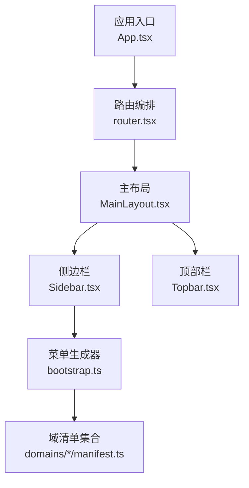
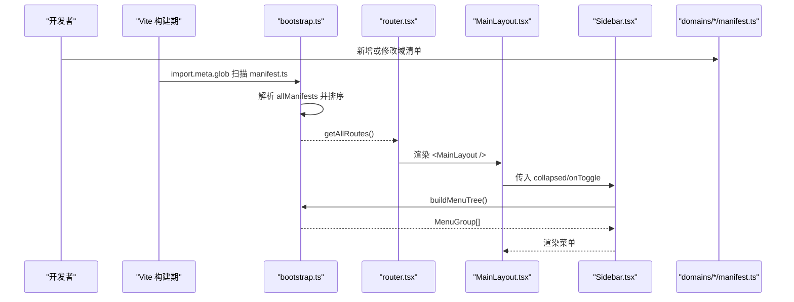
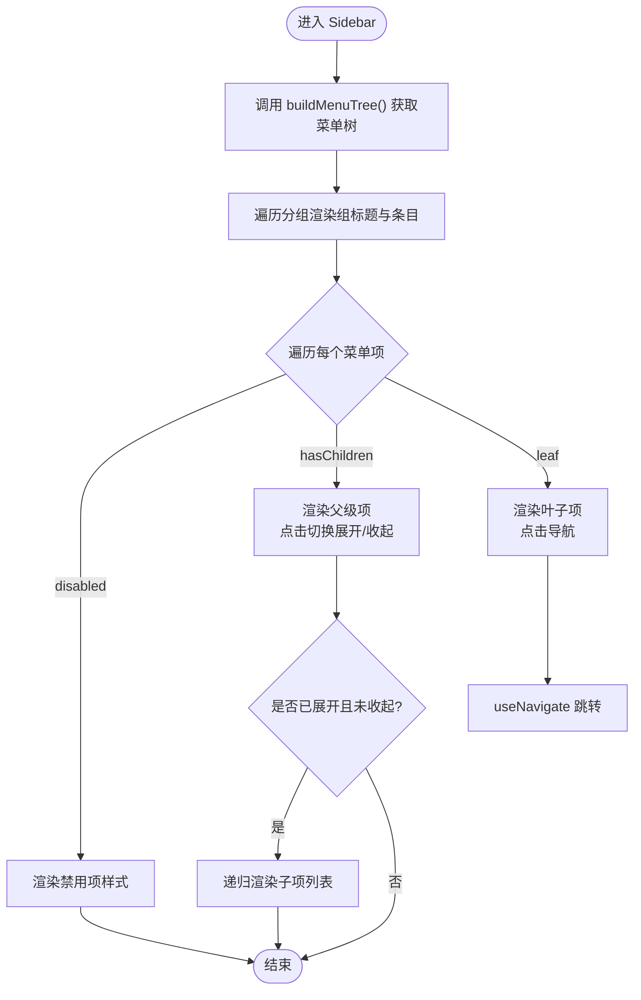
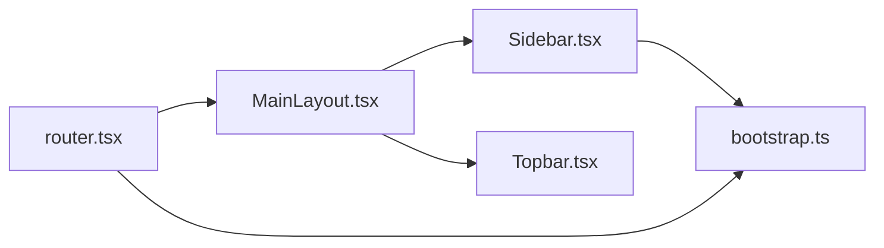

# 布局系统

<cite>
**本文引用的文件**   
- [MainLayout.tsx](file://hj-admin/src/layouts/MainLayout.tsx)
- [Sidebar.tsx](file://hj-admin/src/layouts/Sidebar.tsx)
- [Topbar.tsx](file://hj-admin/src/layouts/Topbar.tsx)
- [bootstrap.ts](file://hj-admin/src/app/bootstrap.ts)
- [router.tsx](file://hj-admin/src/app/router.tsx)
- [App.tsx](file://hj-admin/src/app/App.tsx)
- [news manifest.ts](file://hj-admin/src/domains/news/manifest.ts)
- [enterprise manifest.ts](file://hj-admin/src/domains/enterprise/manifest.ts)
- [resource manifest.ts](file://hj-admin/src/domains/resource/manifest.ts)
- [schema-engine types.ts](file://hj-admin/src/shared/schema-engine/types.ts)
- [data types.ts](file://hj-admin/src/shared/data/types.ts)
</cite>

## 目录
1. [简介](#简介)
2. [项目结构](#项目结构)
3. [核心组件](#核心组件)
4. [架构总览](#架构总览)
5. [详细组件分析](#详细组件分析)
6. [依赖关系分析](#依赖关系分析)
7. [性能与响应式建议](#性能与响应式建议)
8. [定制指南](#定制指南)
9. [常见问题排查](#常见问题排查)
10. [结论](#结论)

## 简介
本技术文档聚焦于布局系统的实现与扩展，围绕主布局 MainLayout、侧边栏 Sidebar、顶部栏 Topbar 三大组件展开，深入解释其设计理念、数据驱动机制（从 DomainManifest 自动构建菜单）、路由集成方式以及可扩展点。同时提供样式覆盖、组件替换、新增布局区域的方法，并给出移动端适配与性能优化建议及常见问题的解决方案。

## 项目结构
布局相关代码位于 src/layouts 下，由 app/router.tsx 统一挂载到路由树中；菜单与路由的自动生成逻辑集中在 app/bootstrap.ts，各业务域通过 domains/*/manifest.ts 声明式配置。



图表来源
- [App.tsx:1-21](file://hj-admin/src/app/App.tsx#L1-L21)
- [router.tsx:1-58](file://hj-admin/src/app/router.tsx#L1-L58)
- [MainLayout.tsx:1-23](file://hj-admin/src/layouts/MainLayout.tsx#L1-L23)
- [Sidebar.tsx:1-156](file://hj-admin/src/layouts/Sidebar.tsx#L1-L156)
- [Topbar.tsx:1-66](file://hj-admin/src/layouts/Topbar.tsx#L1-L66)
- [bootstrap.ts:1-104](file://hj-admin/src/app/bootstrap.ts#L1-L104)
- [news manifest.ts:1-42](file://hj-admin/src/domains/news/manifest.ts#L1-L42)
- [enterprise manifest.ts:1-20](file://hj-admin/src/domains/enterprise/manifest.ts#L1-L20)
- [resource manifest.ts:1-22](file://hj-admin/src/domains/resource/manifest.ts#L1-L22)

章节来源
- [App.tsx:1-21](file://hj-admin/src/app/App.tsx#L1-L21)
- [router.tsx:1-58](file://hj-admin/src/app/router.tsx#L1-L58)
- [MainLayout.tsx:1-23](file://hj-admin/src/layouts/MainLayout.tsx#L1-L23)
- [Sidebar.tsx:1-156](file://hj-admin/src/layouts/Sidebar.tsx#L1-L156)
- [Topbar.tsx:1-66](file://hj-admin/src/layouts/Topbar.tsx#L1-L66)
- [bootstrap.ts:1-104](file://hj-admin/src/app/bootstrap.ts#L1-L104)

## 核心组件
- MainLayout：负责整体页面骨架、侧边栏折叠状态、内容区滚动与 Outlet 渲染。
- Sidebar：基于 bootstrap.ts 的 buildMenuTree() 动态生成菜单，支持分组、禁用项、子菜单展开、激活态高亮等。
- Topbar：展示面包屑导航、质量告警提示、用户头像占位等。

章节来源
- [MainLayout.tsx:1-23](file://hj-admin/src/layouts/MainLayout.tsx#L1-L23)
- [Sidebar.tsx:1-156](file://hj-admin/src/layouts/Sidebar.tsx#L1-L156)
- [Topbar.tsx:1-66](file://hj-admin/src/layouts/Topbar.tsx#L1-L66)

## 架构总览
布局系统与“域清单”解耦，通过 import.meta.glob 在构建时扫描所有 domains/*/manifest.ts，汇总为 allManifests，再由 buildMenuTree() 生成菜单树，router.tsx 根据 getAllRoutes() 动态注册路由。



图表来源
- [bootstrap.ts:1-104](file://hj-admin/src/app/bootstrap.ts#L1-L104)
- [router.tsx:1-58](file://hj-admin/src/app/router.tsx#L1-L58)
- [MainLayout.tsx:1-23](file://hj-admin/src/layouts/MainLayout.tsx#L1-L23)
- [Sidebar.tsx:1-156](file://hj-admin/src/layouts/Sidebar.tsx#L1-L156)

## 详细组件分析

### MainLayout 设计与实现
- 布局策略：使用 Flex 纵向布局，左侧 Sidebar，右侧内容区包含 Topbar 和可滚动的 Outlet 容器。
- 状态管理：collapsed 控制侧边栏收起/展开，通过 onToggle 回调更新。
- 样式内联：字体、字号、行高、颜色、背景色等直接以 style 对象定义，便于快速原型迭代。
- 可扩展点：可在右侧内容区上方插入全局通知条、页头工具栏等；也可将样式抽取为 CSS 变量或主题 Provider。

章节来源
- [MainLayout.tsx:1-23](file://hj-admin/src/layouts/MainLayout.tsx#L1-L23)

### Sidebar 动态菜单生成逻辑
- 数据来源：调用 buildMenuTree()，该函数聚合 allManifests 中的 routes，按 menuGroup 分组，合并硬编码的禁用项，形成最终菜单树。
- 交互行为：
  - 父级点击：若存在 children 则切换展开；否则跳转到第一个子路由。
  - 子级点击：直接 navigate 到对应 path。
  - 激活态：当前路径匹配项高亮，父级若任一子项激活则父级也高亮。
  - 禁用项：不可点击，显示半透明样式与角标。
- 视觉反馈：hover 背景变化、箭头旋转指示展开状态、小圆点 dot 标记。
- 类型契约：MenuGroup、MenuGroupItem 定义在 bootstrap.ts 中，供 Sidebar 消费。



图表来源
- [Sidebar.tsx:1-156](file://hj-admin/src/layouts/Sidebar.tsx#L1-L156)
- [bootstrap.ts:24-104](file://hj-admin/src/app/bootstrap.ts#L24-L104)

章节来源
- [Sidebar.tsx:1-156](file://hj-admin/src/layouts/Sidebar.tsx#L1-L156)
- [bootstrap.ts:24-104](file://hj-admin/src/app/bootstrap.ts#L24-L104)

### Topbar 功能实现
- 面包屑：通过内置映射表将 pathname 转换为多级文本，并以 “›” 分隔；首层可点击回退到默认列表页。
- 通知系统：示例性展示一个带红点的告警图标，表示待处理事项数量。
- 用户信息：展示用户头像占位（文字头像），预留点击扩展空间。
- 可扩展点：可接入真实用户信息、消息中心、设置面板等。

章节来源
- [Topbar.tsx:1-66](file://hj-admin/src/layouts/Topbar.tsx#L1-L66)

### 从 DomainManifest 自动构建菜单的过程
- 构建流程：
  - 构建期通过 import.meta.glob 收集所有 domains/*/manifest.ts。
  - 提取 default 导出作为 DomainManifest，按 order 排序得到 allManifests。
  - buildMenuTree() 遍历 allManifests，过滤 hideInMenu 的路由，按 menuGroup 分组，单路由提升为一级菜单，多路由生成父子结构。
  - 合并硬编码的 disabledItems，按固定 groupOrder 输出最终菜单树。
- 关键类型：DomainManifest、RouteDef 定义在 schema-engine types.ts 中。

```mermaid
classDiagram
class DomainManifest {
+string name
+string label
+string icon
+string menuGroup
+number order
+boolean collapsible
+boolean dot
+RouteDef[] routes
}
class RouteDef {
+string path
+string label
+PageSchema schema
+() => Promise~Component~ component
+boolean hideInMenu
}
class MenuGroup {
+string group
+MenuGroupItem[] items
}
class MenuGroupItem {
+string key
+string label
+string icon
+boolean dot
+boolean disabled
+string badge
+{key : string;label : string}[] children
}
DomainManifest --> RouteDef : "包含"
MenuGroup --> MenuGroupItem : "包含"
```

图表来源
- [schema-engine types.ts:176-208](file://hj-admin/src/shared/schema-engine/types.ts#L176-L208)
- [bootstrap.ts:24-104](file://hj-admin/src/app/bootstrap.ts#L24-L104)

章节来源
- [bootstrap.ts:1-104](file://hj-admin/src/app/bootstrap.ts#L1-L104)
- [schema-engine types.ts:176-208](file://hj-admin/src/shared/schema-engine/types.ts#L176-L208)
- [news manifest.ts:1-42](file://hj-admin/src/domains/news/manifest.ts#L1-L42)
- [enterprise manifest.ts:1-20](file://hj-admin/src/domains/enterprise/manifest.ts#L1-L20)
- [resource manifest.ts:1-22](file://hj-admin/src/domains/resource/manifest.ts#L1-L22)

## 依赖关系分析
- 组件耦合：
  - MainLayout 仅依赖 Sidebar 与 Topbar，职责清晰。
  - Sidebar 依赖 bootstrap.ts 的菜单生成能力，不直接依赖具体域。
  - Topbar 依赖 react-router-dom 的 location/navigate，用于面包屑与导航。
- 外部依赖：
  - react-router-dom：路由与导航。
  - antd：Spin、Badge 等基础 UI。
- 潜在循环依赖：无。菜单生成与路由生成均集中于 bootstrap.ts，被 Sidebar 与 router.tsx 单向引用。



图表来源
- [MainLayout.tsx:1-23](file://hj-admin/src/layouts/MainLayout.tsx#L1-L23)
- [Sidebar.tsx:1-156](file://hj-admin/src/layouts/Sidebar.tsx#L1-L156)
- [Topbar.tsx:1-66](file://hj-admin/src/layouts/Topbar.tsx#L1-L66)
- [bootstrap.ts:1-104](file://hj-admin/src/app/bootstrap.ts#L1-L104)
- [router.tsx:1-58](file://hj-admin/src/app/router.tsx#L1-L58)

章节来源
- [MainLayout.tsx:1-23](file://hj-admin/src/layouts/MainLayout.tsx#L1-L23)
- [Sidebar.tsx:1-156](file://hj-admin/src/layouts/Sidebar.tsx#L1-L156)
- [Topbar.tsx:1-66](file://hj-admin/src/layouts/Topbar.tsx#L1-L66)
- [bootstrap.ts:1-104](file://hj-admin/src/app/bootstrap.ts#L1-L104)
- [router.tsx:1-58](file://hj-admin/src/app/router.tsx#L1-L58)

## 性能与响应式建议
- 性能优化
  - 菜单树缓存：buildMenuTree() 已在 Sidebar 中使用 useMemo 缓存，避免重复计算。
  - 路由懒加载：非 Schema 页面通过 lazy + Suspense 按需加载，减少首屏体积。
  - 避免重排：侧边栏宽度变化使用 transition，减少频繁 DOM 操作。
- 响应式与移动端适配
  - 当前布局为桌面优先，建议在 MainLayout 中引入断点判断，在小屏时将 Sidebar 改为抽屉模式（例如使用 antd Drawer）。
  - 内容区 padding 可根据屏幕尺寸调整，避免在小屏上拥挤。
  - 顶部栏在小屏隐藏次要元素（如告警图标）或采用下拉菜单收纳。
- 主题与样式
  - 建议将内联样式迁移至 CSS 变量或主题 Provider，便于一键换肤与暗色模式。
  - 将字体族、字号、行高、间距等抽象为设计令牌，集中管理。

[本节为通用建议，不直接分析具体文件]

## 定制指南

### 样式覆盖
- 全局样式：在 App.css 或 index.css 中覆盖布局容器的背景、边框、阴影等。
- 组件样式：通过 className 或 CSS Modules 对 Sidebar、Topbar 进行局部覆盖。
- 主题化：建议引入 CSS 变量或 Ant Design Theme Token，统一管理主色、背景、文字色等。

### 组件替换
- 替换侧边栏：在 MainLayout 中替换 Sidebar 为自定义实现，保持 props 接口一致（collapsed、onToggle）。
- 替换顶部栏：在 MainLayout 中替换 Topbar，保留面包屑、通知、用户信息等插槽。
- 替换布局骨架：在 router.tsx 中将 MainLayout 替换为新的布局组件，确保 Outlet 正确渲染。

### 新增布局区域
- 在 MainLayout 的内容区增加新区域（如全局公告条、快捷入口），注意保持 flex 布局与滚动区域隔离，避免遮挡。
- 如需全局弹窗或通知，建议使用 Context 或状态库管理，避免在多个组件中重复维护。

### 菜单与路由扩展
- 新增域：在 domains 下新建文件夹，创建 manifest.ts，声明 name、label、icon、menuGroup、order、routes 等字段。
- 隐藏菜单项：在 route 中设置 hideInMenu: true，适用于编辑页等内部路由。
- 禁用菜单项：在 bootstrap.ts 的 disabledItems 中添加占位项，用于未来批次规划。

章节来源
- [MainLayout.tsx:1-23](file://hj-admin/src/layouts/MainLayout.tsx#L1-L23)
- [router.tsx:1-58](file://hj-admin/src/app/router.tsx#L1-L58)
- [bootstrap.ts:1-104](file://hj-admin/src/app/bootstrap.ts#L1-L104)
- [news manifest.ts:1-42](file://hj-admin/src/domains/news/manifest.ts#L1-L42)
- [enterprise manifest.ts:1-20](file://hj-admin/src/domains/enterprise/manifest.ts#L1-L20)
- [resource manifest.ts:1-22](file://hj-admin/src/domains/resource/manifest.ts#L1-L22)

## 常见问题排查
- 菜单未出现
  - 检查 domains/*/manifest.ts 是否正确导出 default 且符合 DomainManifest 类型。
  - 确认 menuGroup 与 bootstrap.ts 的 groupOrder 一致，避免分组丢失。
- 路由无法访问
  - 检查 manifest.ts 中 path 是否与 router.tsx 生成的路由一致。
  - 若使用自定义组件，确保 component 懒加载返回正确的默认导出。
- 面包屑不正确
  - 核对 Topbar.tsx 中的 breadcrumbMap 是否包含当前路径。
- 侧边栏点击无效
  - 确认 item.children 是否存在，以及 navigate 的目标路径是否有效。
- 禁用项仍可点击
  - 检查 disabled 分支是否阻止了 onClick 执行。

章节来源
- [bootstrap.ts:1-104](file://hj-admin/src/app/bootstrap.ts#L1-L104)
- [router.tsx:1-58](file://hj-admin/src/app/router.tsx#L1-L58)
- [Topbar.tsx:1-66](file://hj-admin/src/layouts/Topbar.tsx#L1-L66)
- [Sidebar.tsx:1-156](file://hj-admin/src/layouts/Sidebar.tsx#L1-L156)

## 结论
本布局系统以“域清单驱动”为核心，实现了菜单与路由的自动化生成，降低了维护成本并提升了扩展性。MainLayout 提供稳定的布局骨架，Sidebar 与 Topbar 分别承担导航与信息展示职责。通过合理的样式组织、组件替换与新增布局区域方法，团队可以快速定制与演进后台界面。后续建议完善移动端适配、主题系统与全局状态管理，进一步提升用户体验与可维护性。