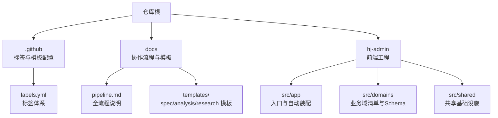
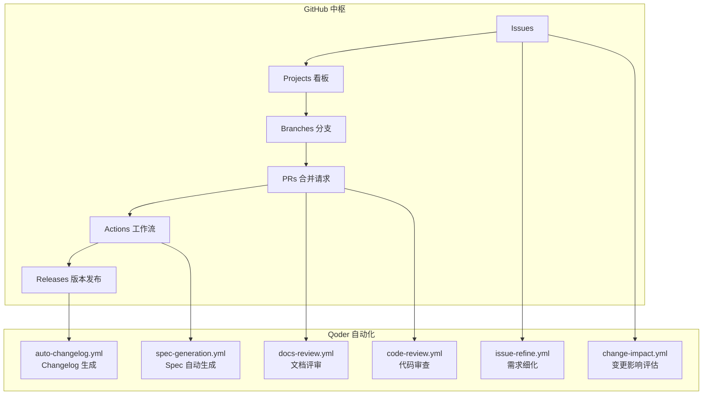
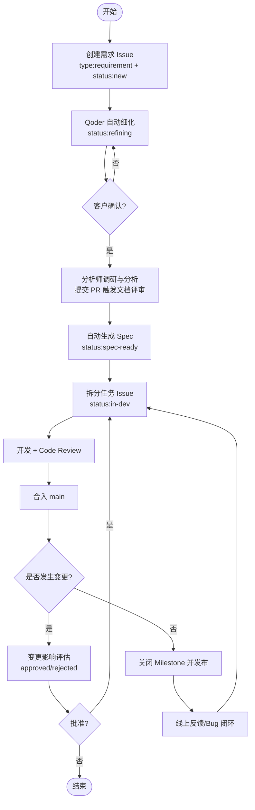
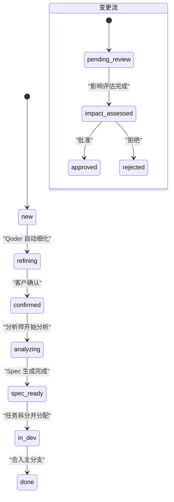
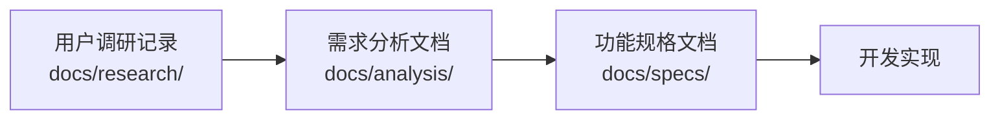
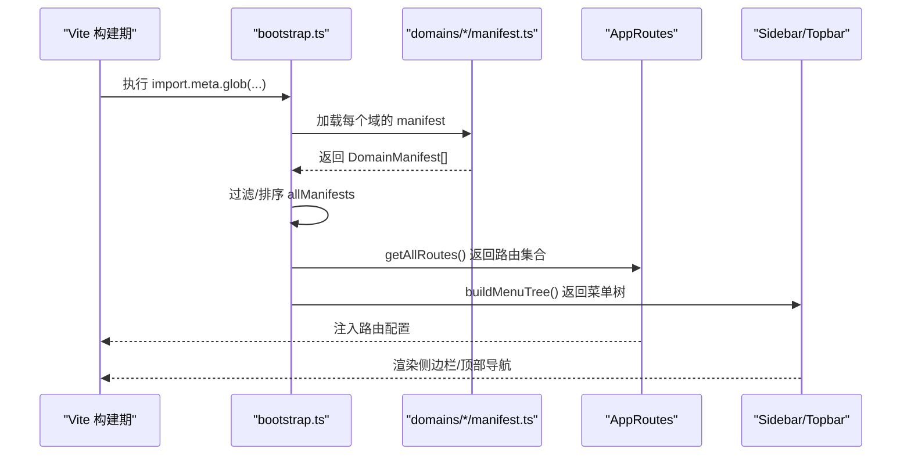
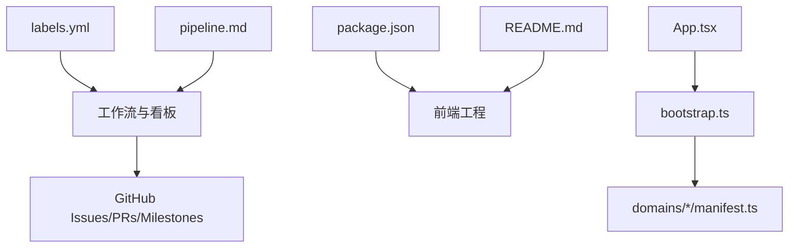

# GitHub协作工作流

<cite>
**本文引用的文件**   
- [AGENTS.md](file://AGENTS.md)
- [pipeline.md](file://docs/pipeline.md)
- [labels.yml](file://.github/labels.yml)
- [spec-template.md](file://docs/templates/spec-template.md)
- [analysis.md](file://docs/templates/analysis.md)
- [user-research.md](file://docs/templates/user-research.md)
- [App.tsx](file://hj-admin/src/app/App.tsx)
- [bootstrap.ts](file://hj-admin/src/app/bootstrap.ts)
- [package.json](file://hj-admin/package.json)
- [README.md](file://hj-admin/README.md)
</cite>

## 目录
1. [简介](#简介)
2. [项目结构](#项目结构)
3. [核心组件](#核心组件)
4. [架构总览](#架构总览)
5. [详细组件分析](#详细组件分析)
6. [依赖关系分析](#依赖关系分析)
7. [性能与可维护性建议](#性能与可维护性建议)
8. [故障排查指南](#故障排查指南)
9. [结论](#结论)
10. [附录](#附录)

## 简介
本项目以 GitHub 为唯一中枢，构建“人+AI”的端到端协作工作流：从需求输入、细化与分析，到 Spec 生成、任务拆分、开发审查、变更管理、版本发布与反馈闭环。Qoder 在关键节点提供自动化增强（如自动细化需求、影响评估、文档评审、Spec 自动生成、代码审查、Changelog 生成等）。前端采用 Vite + React + Ant Design，基于 Schema 驱动与域（Domain）组织方式，通过 bootstrap 自动发现与装配路由和菜单，实现零注册式扩展。

## 项目结构
仓库围绕“协作流程规范 + 前端工程”两部分展开：
- 协作流程规范：位于根目录与 docs 下，包含全流程说明、模板与标签体系定义
- 前端工程：位于 hj-admin 子目录，采用领域驱动的组织方式与 Schema 驱动的页面生成机制

图表来源
- [pipeline.md:1-266](file://docs/pipeline.md#L1-L266)
- [labels.yml:1-112](file://.github/labels.yml#L1-L112)
- [bootstrap.ts:1-104](file://hj-admin/src/app/bootstrap.ts#L1-L104)

章节来源
- [AGENTS.md:1-142](file://AGENTS.md#L1-L142)
- [pipeline.md:1-266](file://docs/pipeline.md#L1-L266)
- [labels.yml:1-112](file://.github/labels.yml#L1-L112)
- [bootstrap.ts:1-104](file://hj-admin/src/app/bootstrap.ts#L1-L104)

## 核心组件
- 协作流程编排：以 pipeline.md 为核心，定义七阶段流水线与状态流转规则
- 标签体系：labels.yml 统一类型、状态、优先级与模块标签，支撑自动化与看板筛选
- 文档模板：spec-template.md、analysis.md、user-research.md 规范产出物格式
- 前端自动装配：bootstrap.ts 利用 import.meta.glob 扫描 domains/*/manifest.ts，自动生成路由与菜单树
- 应用入口：App.tsx 仅做 Provider 链与路由挂载，保持职责单一

章节来源
- [pipeline.md:1-266](file://docs/pipeline.md#L1-L266)
- [labels.yml:1-112](file://.github/labels.yml#L1-L112)
- [spec-template.md:1-105](file://docs/templates/spec-template.md#L1-L105)
- [analysis.md:1-99](file://docs/templates/analysis.md#L1-L99)
- [user-research.md:1-56](file://docs/templates/user-research.md#L1-L56)
- [bootstrap.ts:1-104](file://hj-admin/src/app/bootstrap.ts#L1-L104)
- [App.tsx:1-21](file://hj-admin/src/app/App.tsx#L1-L21)

## 架构总览
下图展示“GitHub 中枢 + Qoder 自动化”的全景协作架构，覆盖 Issue → Projects → Branches → PRs → Actions → Releases 的主路径，以及各阶段的自动化触发点。

图表来源
- [pipeline.md:1-266](file://docs/pipeline.md#L1-L266)

章节来源
- [pipeline.md:1-266](file://docs/pipeline.md#L1-L266)

## 详细组件分析

### 协作流水线（七阶段）
- 阶段一：需求输入与细化
  - 创建 Issue（选择需求模板），自动打上 type:requirement 与 status:new
  - Qoder 自动添加 status:refining，并在评论中输出意图理解、歧义点、待确认项与确认清单
  - 人工确认后改为 status:confirmed
- 阶段二：需求分析与 Spec 生成
  - 分析师本地调研与分析，提交 PR 触发文档评审；通过后自动触发 Spec 生成并创建新 PR
  - 标签流转：status:confirmed → status:analyzing → status:spec-ready
- 阶段三：任务拆分与分配
  - 基于 Spec 拆分为 Task Issue，关联原始需求，设置 Milestone 与 in-dev 标签
- 阶段四：开发与代码审查
  - 按分支命名规范创建分支，PR 触发 code-review.yml 自动审查
- 阶段五：需求变更管理
  - 创建变更 Issue，自动评估影响范围并给出建议，人工决策后进入开发流程
- 阶段六：版本管理与发布
  - 关闭 Milestone 后创建 Release，自动触发 Changelog 生成
- 阶段七：反馈闭环
  - Bug Issue 关联原始需求，修复后更新 Spec，纳入后续迭代改进

图表来源
- [pipeline.md:1-266](file://docs/pipeline.md#L1-L266)

章节来源
- [pipeline.md:1-266](file://docs/pipeline.md#L1-L266)

### 标签体系与状态机
- 类型标签：type:requirement、type:change-request、type:bug、type:task、type:spec
- 状态标签（需求流）：status:new → status:refining → status:confirmed → status:analyzing → status:spec-ready → status:in-dev → status:done
- 状态标签（变更流）：status:pending-review → status:impact-assessed → status:approved / status:rejected
- 优先级：priority:P0/P1/P2
- 模块：module:ner、module:enterprise、module:news、module:resource、module:tags、module:infra

图表来源
- [labels.yml:1-112](file://.github/labels.yml#L1-L112)
- [pipeline.md:1-266](file://docs/pipeline.md#L1-L266)

章节来源
- [labels.yml:1-112](file://.github/labels.yml#L1-L112)
- [pipeline.md:1-266](file://docs/pipeline.md#L1-L266)

### 文档模板与产出物
- 用户调研记录（user-research.md）：用于记录访谈、问卷、现场观察与竞品分析，沉淀洞察与机会点
- 需求分析文档（analysis.md）：结构化梳理角色、场景、功能清单（P0/P1/P2）、非功能与数据需求、边界条件与依赖
- 功能规格文档（spec-template.md）：面向开发的权威依据，包含交互流程、页面/组件设计、数据模型、接口设计与验收标准

图表来源
- [user-research.md:1-56](file://docs/templates/user-research.md#L1-L56)
- [analysis.md:1-99](file://docs/templates/analysis.md#L1-L99)
- [spec-template.md:1-105](file://docs/templates/spec-template.md#L1-L105)

章节来源
- [user-research.md:1-56](file://docs/templates/user-research.md#L1-L56)
- [analysis.md:1-99](file://docs/templates/analysis.md#L1-L99)
- [spec-template.md:1-105](file://docs/templates/spec-template.md#L1-L105)

### 前端自动装配与路由菜单
- App.tsx 作为根组件，仅负责挂载 BrowserRouter、Provider 链与路由，不包含业务逻辑
- bootstrap.ts 使用 import.meta.glob 在构建时扫描所有 domains/*/manifest.ts，提取 DomainManifest 列表并按 order 排序
- getAllRoutes() 汇总所有域的路由；buildMenuTree() 将路由按 menuGroup 分组，组装启用的菜单项与硬编码禁用的占位项，形成最终菜单树

图表来源
- [bootstrap.ts:1-104](file://hj-admin/src/app/bootstrap.ts#L1-L104)
- [App.tsx:1-21](file://hj-admin/src/app/App.tsx#L1-L21)

章节来源
- [bootstrap.ts:1-104](file://hj-admin/src/app/bootstrap.ts#L1-L104)
- [App.tsx:1-21](file://hj-admin/src/app/App.tsx#L1-L21)

### 分支与 PR 规范
- 分支命名：feat/<issue>-<desc>、fix/<issue>-<desc>、change/<issue>-<desc>、release/v<ver>
- PR 标题：<type>: <description> (closes #<issue>)，必须关联对应 Issue，合入前需通过 Qoder Code Review

章节来源
- [AGENTS.md:1-142](file://AGENTS.md#L1-L142)
- [pipeline.md:1-266](file://docs/pipeline.md#L1-L266)

### 版本与发布
- 每个版本对应一个 Milestone，版本号遵循 v<主>.<次>.<补丁>
- 关闭 Milestone 后创建 Release，自动触发 Changelog 生成

章节来源
- [AGENTS.md:1-142](file://AGENTS.md#L1-L142)
- [pipeline.md:1-266](file://docs/pipeline.md#L1-L266)

## 依赖关系分析
- 协作层依赖
  - labels.yml 为所有工作流与看板提供统一的标签语义
  - pipeline.md 定义了工作流触发条件与状态流转，指导 Actions 与人工操作
- 前端工程依赖
  - package.json 声明了运行时与开发时依赖（React、AntD、Vite、TS、ESLint 等）
  - README.md 提供了基础脚手架说明与 ESLint 扩展建议
  - App.tsx 与 bootstrap.ts 构成应用启动与自动装配的核心链路

图表来源
- [labels.yml:1-112](file://.github/labels.yml#L1-L112)
- [pipeline.md:1-266](file://docs/pipeline.md#L1-L266)
- [package.json:1-35](file://hj-admin/package.json#L1-L35)
- [README.md:1-74](file://hj-admin/README.md#L1-L74)
- [App.tsx:1-21](file://hj-admin/src/app/App.tsx#L1-L21)
- [bootstrap.ts:1-104](file://hj-admin/src/app/bootstrap.ts#L1-L104)

章节来源
- [labels.yml:1-112](file://.github/labels.yml#L1-L112)
- [pipeline.md:1-266](file://docs/pipeline.md#L1-L266)
- [package.json:1-35](file://hj-admin/package.json#L1-L35)
- [README.md:1-74](file://hj-admin/README.md#L1-L74)
- [App.tsx:1-21](file://hj-admin/src/app/App.tsx#L1-L21)
- [bootstrap.ts:1-104](file://hj-admin/src/app/bootstrap.ts#L1-L104)

## 性能与可维护性建议
- 工作流层面
  - 合理拆分 Actions 任务，避免单个工作流过长导致超时
  - 对大文档评审与 Spec 生成增加缓存与增量处理策略
- 前端层面
  - 控制 manifest 数量与路由层级，避免菜单树过大导致渲染卡顿
  - 按需加载 domains 资源，结合懒加载优化首屏时间
- 文档层面
  - 严格遵循模板结构，减少返工成本
  - 使用标签与 Milestone 进行度量，持续改进交付效率

[本节为通用建议，不直接分析具体文件]

## 故障排查指南
- 标签未生效或看板不同步
  - 检查 labels.yml 是否与仓库实际标签一致
  - 确认 Actions 是否成功同步标签
- 需求细化无响应
  - 确认 Issue 已添加 type:requirement 标签
  - 检查工作流 issue-refine.yml 是否被触发
- 文档评审失败
  - 检查 PR 是否涉及 docs/research/ 或 docs/analysis/
  - 查看 docs-review.yml 日志定位问题
- Spec 未自动生成
  - 确认 analysis PR 已合并至目标分支
  - 检查 spec-generation.yml 触发条件与权限
- 代码审查阻塞
  - 查看 code-review.yml 报告，修复建议项
- 发布后无 Changelog
  - 确认 Release tag 符合 v<主>.<次>.<补丁> 格式
  - 检查 auto-changelog.yml 是否运行成功

章节来源
- [pipeline.md:1-266](file://docs/pipeline.md#L1-L266)
- [labels.yml:1-112](file://.github/labels.yml#L1-L112)

## 结论
本仓库以 GitHub 为中心，结合 Qoder 的自动化能力，构建了从需求到发布的完整协作闭环。通过标准化的标签体系、模板与工作流，团队可以在保证质量的同时提升交付效率。前端采用 Schema 驱动与自动装配，降低了新增模块的接入成本，有利于快速迭代与规模化扩展。

[本节为总结性内容，不直接分析具体文件]

## 附录
- 角色与操作方式
  - 需求分析师：使用 Agent 指导调研与评审，产出 research/analysis 文档，提交 PR 触发复审
  - 开发人员：查阅 specs，按分支规范开发，PR 触发 Code Review
  - 项目管理人员：通过 Projects 看板与 Milestone 跟踪进度与版本计划
- 忽略的检查范围
  - node_modules/、dist/、数据表 Excel 文件、.qoder/ 自动生成文件、research/analysis 原始材料（由专用工作流评审）

章节来源
- [AGENTS.md:1-142](file://AGENTS.md#L1-L142)