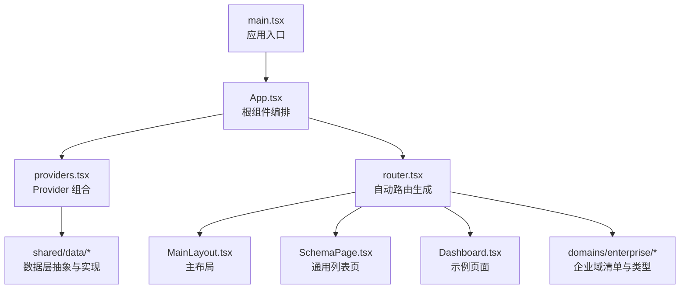
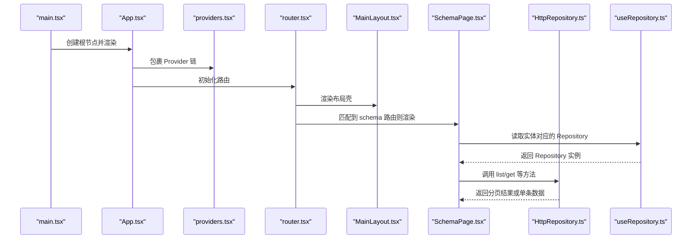
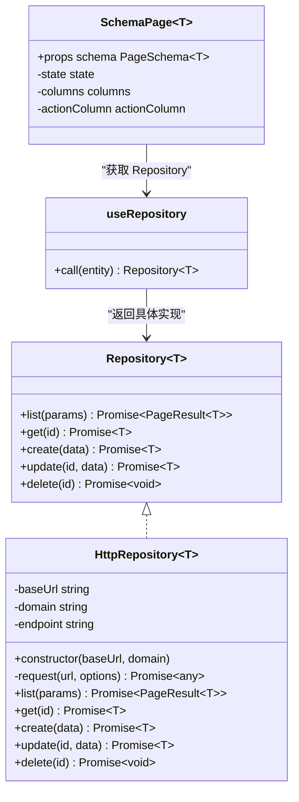
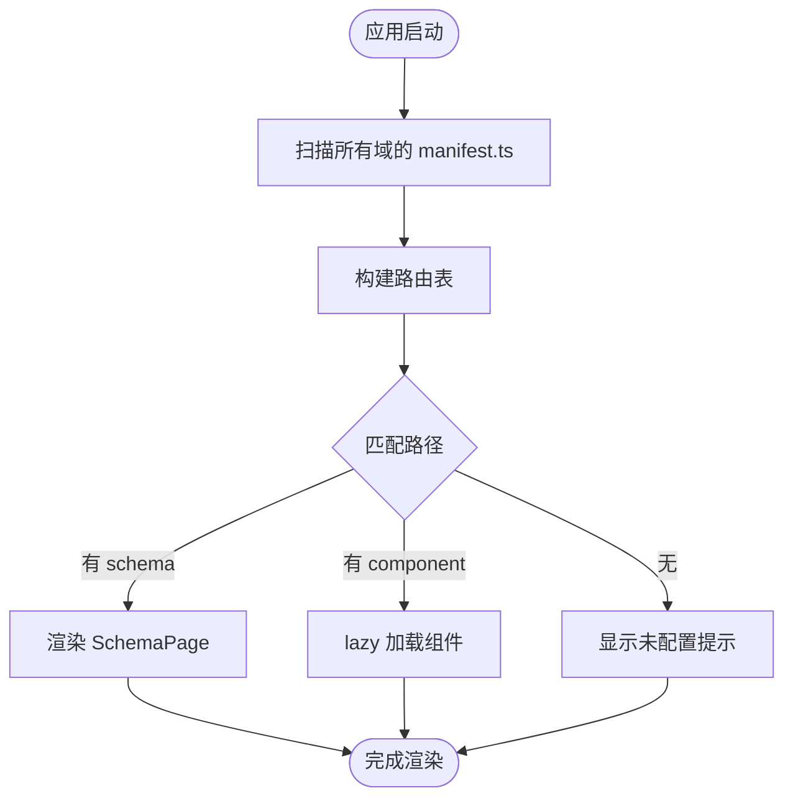
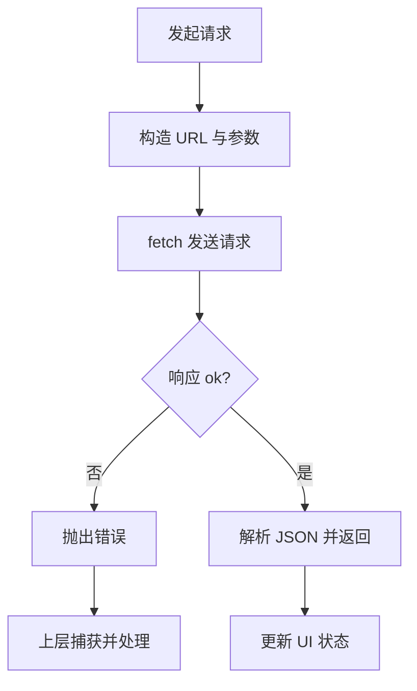
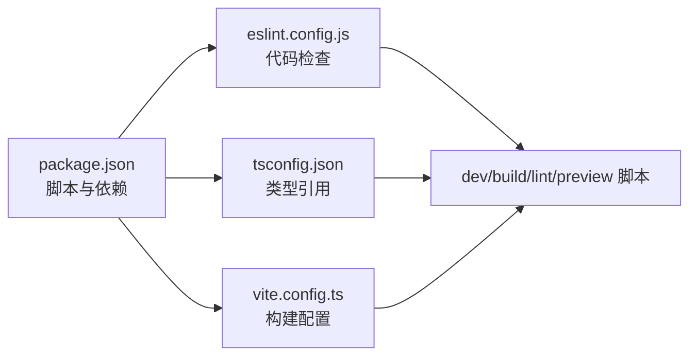

# 代码规范和最佳实践

<cite>
**本文引用的文件**
- [package.json](file://hj-admin/package.json)
- [eslint.config.js](file://hj-admin/eslint.config.js)
- [tsconfig.json](file://hj-admin/tsconfig.json)
- [vite.config.ts](file://hj-admin/vite.config.ts)
- [main.tsx](file://hj-admin/src/main.tsx)
- [App.tsx](file://hj-admin/src/app/App.tsx)
- [providers.tsx](file://hj-admin/src/app/providers.tsx)
- [router.tsx](file://hj-admin/src/app/router.tsx)
- [types.ts](file://hj-admin/src/shared/data/types.ts)
- [HttpRepository.ts](file://hj-admin/src/shared/data/HttpRepository.ts)
- [useRepository.ts](file://hj-admin/src/shared/data/useRepository.ts)
- [SchemaPage.tsx](file://hj-admin/src/shared/schema-engine/SchemaPage.tsx)
- [manifest.ts](file://hj-admin/src/domains/enterprise/manifest.ts)
- [index.ts](file://hj-admin/src/domains/enterprise/index.ts)
- [types.ts](file://hj-admin/src/domains/enterprise/types.ts)
- [MainLayout.tsx](file://hj-admin/src/layouts/MainLayout.tsx)
- [Dashboard.tsx](file://hj-admin/src/pages/dashboard/Dashboard.tsx)
</cite>

## 目录
1. [简介](#简介)
2. [项目结构](#项目结构)
3. [核心组件](#核心组件)
4. [架构总览](#架构总览)
5. [详细组件分析](#详细组件分析)
6. [依赖分析](#依赖分析)
7. [性能考虑](#性能考虑)
8. [故障排查指南](#故障排查指南)
9. [结论](#结论)
10. [附录](#附录)

## 简介
本规范面向前端工程 hj-admin，目标是建立一致的 TypeScript 类型定义、组件设计模式、命名约定与文件组织方式；统一 ESLint 规则与代码格式化标准；明确错误处理策略、日志记录规范与单元测试编写指南；并提供性能优化建议、安全编码实践与代码审查检查清单，帮助团队在协作中保持一致的代码风格和质量标准。

## 项目结构
- 应用入口与启动流程：
  - 根入口 main.tsx 使用 React StrictMode 挂载 App 组件。
  - App.tsx 负责组合全局 Provider 链与路由容器 BrowserRouter。
  - providers.tsx 集中组合数据层 Provider（如 DataProvider）。
- 路由与页面：
  - router.tsx 基于 bootstrap 发现域清单自动生成路由，支持 Schema 驱动的通用列表页与懒加载自定义页面。
  - MainLayout.tsx 提供侧边栏、顶栏与内容区布局。
  - Dashboard.tsx 为示例仪表盘页面。
- 领域与配置：
  - domains/enterprise 为企业域示例，包含 manifest.ts（域清单）、types.ts（领域类型）、index.ts（对外导出）等。
- 共享能力：
  - shared/data 提供 Repository 抽象与 HTTP 实现、Hook 与类型定义。
  - shared/schema-engine 提供 SchemaPage 通用列表渲染器及 hooks、renderers 等。

图表来源
- [main.tsx:1-11](file://hj-admin/src/main.tsx#L1-L11)
- [App.tsx:1-21](file://hj-admin/src/app/App.tsx#L1-L21)
- [providers.tsx:1-14](file://hj-admin/src/app/providers.tsx#L1-L14)
- [router.tsx:1-58](file://hj-admin/src/app/router.tsx#L1-L58)
- [MainLayout.tsx:1-23](file://hj-admin/src/layouts/MainLayout.tsx#L1-L23)
- [SchemaPage.tsx:1-226](file://hj-admin/src/shared/schema-engine/SchemaPage.tsx#L1-L226)
- [Dashboard.tsx:1-105](file://hj-admin/src/pages/dashboard/Dashboard.tsx#L1-L105)
- [types.ts](file://hj-admin/src/shared/data/types.ts)
- [manifest.ts](file://hj-admin/src/domains/enterprise/manifest.ts)

章节来源
- [main.tsx:1-11](file://hj-admin/src/main.tsx#L1-L11)
- [App.tsx:1-21](file://hj-admin/src/app/App.tsx#L1-L21)
- [providers.tsx:1-14](file://hj-admin/src/app/providers.tsx#L1-L14)
- [router.tsx:1-58](file://hj-admin/src/app/router.tsx#L1-L58)
- [MainLayout.tsx:1-23](file://hj-admin/src/layouts/MainLayout.tsx#L1-L23)
- [Dashboard.tsx:1-105](file://hj-admin/src/pages/dashboard/Dashboard.tsx#L1-L105)

## 核心组件
- 应用装配层
  - App.tsx：仅做编排，挂载 BrowserRouter、AppProviders、AppRoutes，不包含业务逻辑。
  - providers.tsx：集中组合全局 Provider，当前包含 DataProvider。
- 路由与页面
  - router.tsx：从 bootstrap 收集域清单，按 schema 或 component 动态渲染页面；内置 Dashboard 与通配跳转。
  - MainLayout.tsx：统一的布局壳，承载 Sidebar、Topbar 与 Outlet。
- 数据访问层
  - types.ts：定义 QueryParams、PageResult、Repository 接口、DataSourceMode 等核心类型。
  - HttpRepository.ts：基于 fetch 的 RESTful 客户端，封装 list/get/create/update/delete。
  - useRepository.ts：通过上下文获取指定实体的 Repository，未注册时返回空操作 fallback 并告警。
- 通用页面引擎
  - SchemaPage.tsx：根据 PageSchema 自动渲染筛选栏、Tab、表格、分页与行操作列，支持列渲染器注册表。

章节来源
- [App.tsx:1-21](file://hj-admin/src/app/App.tsx#L1-L21)
- [providers.tsx:1-14](file://hj-admin/src/app/providers.tsx#L1-L14)
- [router.tsx:1-58](file://hj-admin/src/app/router.tsx#L1-L58)
- [MainLayout.tsx:1-23](file://hj-admin/src/layouts/MainLayout.tsx#L1-L23)
- [types.ts:1-36](file://hj-admin/src/shared/data/types.ts#L1-L36)
- [HttpRepository.ts:1-70](file://hj-admin/src/shared/data/HttpRepository.ts#L1-L70)
- [useRepository.ts:1-24](file://hj-admin/src/shared/data/useRepository.ts#L1-L24)
- [SchemaPage.tsx:1-226](file://hj-admin/src/shared/schema-engine/SchemaPage.tsx#L1-L226)

## 架构总览
下图展示从入口到页面渲染的关键调用链与模块关系。

图表来源
- [main.tsx:1-11](file://hj-admin/src/main.tsx#L1-L11)
- [App.tsx:1-21](file://hj-admin/src/app/App.tsx#L1-L21)
- [providers.tsx:1-14](file://hj-admin/src/app/providers.tsx#L1-L14)
- [router.tsx:1-58](file://hj-admin/src/app/router.tsx#L1-L58)
- [MainLayout.tsx:1-23](file://hj-admin/src/layouts/MainLayout.tsx#L1-L23)
- [SchemaPage.tsx:1-226](file://hj-admin/src/shared/schema-engine/SchemaPage.tsx#L1-L226)
- [useRepository.ts:1-24](file://hj-admin/src/shared/data/useRepository.ts#L1-L24)
- [HttpRepository.ts:1-70](file://hj-admin/src/shared/data/HttpRepository.ts#L1-L70)

## 详细组件分析

### 类型系统与命名约定
- 类型分层
  - 领域类型：位于各 domain 下的 types.ts，描述实体字段、枚举与常量映射。
  - 数据层类型：shared/data/types.ts 定义跨域通用的查询参数、分页结果与 Repository 契约。
  - 引擎类型：schema-engine 的 types.ts 定义 PageSchema、ColumnDef、FilterField 等。
- 命名约定
  - 类型与接口：大驼峰，语义清晰，如 Enterprise、QueryParams、PageResult。
  - 常量与枚举：大写下划线或联合字面量，如 EnterpriseDim1、EnterpriseBizType。
  - 变量与函数：小驼峰，动词开头，如 setFilter、resetFilters。
  - 文件与目录：小写短横线或短横分隔，domain 以功能域划分。
- 推荐做法
  - 优先使用联合字面量与 Record 表达有限集合与键值映射。
  - 对可选字段显式标注 ?，避免隐式 undefined。
  - 对外暴露的类型集中在 index.ts 聚合导出，便于引用。

章节来源
- [types.ts:1-50](file://hj-admin/src/domains/enterprise/types.ts#L1-L50)
- [index.ts:1-3](file://hj-admin/src/domains/enterprise/index.ts#L1-L3)
- [types.ts:1-36](file://hj-admin/src/shared/data/types.ts#L1-L36)

### 组件设计模式
- 容器与展示分离
  - 容器组件负责状态与副作用（如 SchemaPage），展示组件只接收 props 渲染。
- 配置驱动页面
  - 通过 PageSchema 声明式配置筛选、列、操作、分页与 Tab，减少样板代码。
- 可插拔渲染器
  - 列渲染通过 renderWithRegistry 注册表扩展，支持字符串映射与自定义函数两种形式。
- 布局复用
  - MainLayout 作为统一外壳，子路由通过 Outlet 注入，保持导航一致性。

图表来源
- [types.ts:1-36](file://hj-admin/src/shared/data/types.ts#L1-L36)
- [HttpRepository.ts:1-70](file://hj-admin/src/shared/data/HttpRepository.ts#L1-L70)
- [SchemaPage.tsx:1-226](file://hj-admin/src/shared/schema-engine/SchemaPage.tsx#L1-L226)
- [useRepository.ts:1-24](file://hj-admin/src/shared/data/useRepository.ts#L1-L24)

章节来源
- [SchemaPage.tsx:1-226](file://hj-admin/src/shared/schema-engine/SchemaPage.tsx#L1-L226)
- [useRepository.ts:1-24](file://hj-admin/src/shared/data/useRepository.ts#L1-L24)
- [HttpRepository.ts:1-70](file://hj-admin/src/shared/data/HttpRepository.ts#L1-L70)
- [MainLayout.tsx:1-23](file://hj-admin/src/layouts/MainLayout.tsx#L1-L23)

### 路由与域清单机制
- 域清单
  - 每个 domain 提供 manifest.ts，声明 name、label、icon、menuGroup、order、routes 等元信息。
  - routes 支持 schema 路由与 component 懒加载路由混合。
- 自动路由
  - router.tsx 通过 getAllRoutes 汇总所有域清单，动态生成 Routes。
  - 无 schema 的路由采用 lazy 加载，提升首屏性能。
- 默认与兜底
  - 内置 /dashboard 始终存在；* 通配跳转到 /dashboard。

图表来源
- [manifest.ts:1-20](file://hj-admin/src/domains/enterprise/manifest.ts#L1-L20)
- [router.tsx:1-58](file://hj-admin/src/app/router.tsx#L1-L58)

章节来源
- [manifest.ts:1-20](file://hj-admin/src/domains/enterprise/manifest.ts#L1-L20)
- [router.tsx:1-58](file://hj-admin/src/app/router.tsx#L1-L58)

### 数据访问与错误处理
- 统一契约
  - Repository<T> 定义 CRUD 方法，屏蔽后端差异。
- HTTP 实现
  - HttpRepository 基于 fetch，统一设置 Content-Type，失败时抛出错误。
  - list 将 QueryParams 序列化为 URLSearchParams，支持分页、排序与过滤。
- 运行时保护
  - useRepository 在未找到实体仓库时返回空操作 fallback，并输出控制台告警，避免崩溃。
- 建议的错误处理策略
  - 在 Repository 层捕获网络异常并转换为领域错误对象。
  - 在 SchemaPage 或上层 Hook 中统一处理 loading、error、success 状态。
  - 用户可见错误通过 Antd 消息或弹窗提示，内部错误记录日志。

图表来源
- [HttpRepository.ts:1-70](file://hj-admin/src/shared/data/HttpRepository.ts#L1-L70)
- [useRepository.ts:1-24](file://hj-admin/src/shared/data/useRepository.ts#L1-L24)

章节来源
- [HttpRepository.ts:1-70](file://hj-admin/src/shared/data/HttpRepository.ts#L1-L70)
- [useRepository.ts:1-24](file://hj-admin/src/shared/data/useRepository.ts#L1-L24)

### 日志记录规范
- 开发期
  - 使用 console.warn/console.error 输出关键路径与异常堆栈。
  - 在 useRepository 中针对缺失仓库进行告警，便于快速定位配置问题。
- 生产期
  - 建议接入统一日志 SDK，区分 info/warn/error 级别。
  - 敏感信息脱敏后再上报。
- 建议
  - 为每个域与页面添加前缀标签，便于检索。
  - 控制日志粒度，避免高频重复日志。

章节来源
- [useRepository.ts:1-24](file://hj-admin/src/shared/data/useRepository.ts#L1-L24)

### 单元测试编写指南
- 测试范围
  - 纯函数与工具函数：输入输出断言。
  - 组件：渲染快照、交互事件、条件分支。
  - 数据层：Mock Repository 验证调用次数与参数。
- 工具建议
  - 使用 Vite 生态的测试框架（如 Vitest），配合 @testing-library/react。
  - 对异步操作使用 async/await 与 flushPromises。
- 覆盖率与质量门禁
  - 设定最低覆盖率阈值，CI 中执行测试并阻断合并。

[本节为通用指导，不直接分析具体文件]

### 安全编码实践
- 输入校验与白名单
  - 对用户输入进行必要校验，避免 XSS 与注入风险。
- 资源加载
  - 谨慎使用 dangerouslySetInnerHTML，必要时进行 HTML 清洗。
- 权限控制
  - 路由级与按钮级权限校验，结合后端鉴权。
- 密钥管理
  - 不在源码中硬编码密钥，使用环境变量与部署平台管理。

[本节为通用指导，不直接分析具体文件]

## 依赖分析
- 构建与脚本
  - package.json 定义了 dev/build/lint/preview 脚本，build 先执行 tsc -b 再 vite build。
- 类型与编译
  - tsconfig.json 使用 project references 指向 app 与 node 两个配置。
- 代码质量
  - eslint.config.js 启用 JS 推荐、TypeScript 推荐、React Hooks 与 React Refresh 规则，忽略 dist。
- 构建工具
  - vite.config.ts 引入 @vitejs/plugin-react 插件。

图表来源
- [package.json:1-35](file://hj-admin/package.json#L1-L35)
- [eslint.config.js:1-23](file://hj-admin/eslint.config.js#L1-L23)
- [tsconfig.json:1-8](file://hj-admin/tsconfig.json#L1-L8)
- [vite.config.ts:1-8](file://hj-admin/vite.config.ts#L1-L8)

章节来源
- [package.json:1-35](file://hj-admin/package.json#L1-L35)
- [eslint.config.js:1-23](file://hj-admin/eslint.config.js#L1-L23)
- [tsconfig.json:1-8](file://hj-admin/tsconfig.json#L1-L8)
- [vite.config.ts:1-8](file://hj-admin/vite.config.ts#L1-L8)

## 性能考虑
- 路由懒加载
  - 非首屏页面使用 lazy 加载，降低初始包体积。
- 列表渲染优化
  - 合理设置 Table rowKey，避免不必要的重渲染。
  - 对复杂列渲染使用 memo 或注册轻量渲染器。
- 数据请求优化
  - 合并请求、缓存热点数据，避免重复拉取。
  - 分页与增量更新，减少一次性数据量。
- 构建优化
  - 按需引入第三方库，开启 Tree Shaking。
  - 静态资源压缩与 CDN 加速。

[本节为通用指导，不直接分析具体文件]

## 故障排查指南
- 常见问题
  - 路由未生效：检查域 manifest 是否正确导出并在 bootstrap 中被发现。
  - 页面空白：确认 Schema 配置是否完整，列 dataIndex 与数据类型是否匹配。
  - 数据为空：检查 useRepository 是否注册了对应实体，查看控制台告警。
  - 网络错误：查看 HttpRepository 抛出的错误信息，确认后端 API 地址与方法。
- 定位步骤
  - 打开浏览器开发者工具，查看 Network 与 Console。
  - 在 SchemaPage 中打印 state 与 columns，确认渲染链路。
  - 临时替换 Repository 为 Mock 实现，隔离后端问题。

章节来源
- [useRepository.ts:1-24](file://hj-admin/src/shared/data/useRepository.ts#L1-L24)
- [SchemaPage.tsx:1-226](file://hj-admin/src/shared/schema-engine/SchemaPage.tsx#L1-L226)
- [HttpRepository.ts:1-70](file://hj-admin/src/shared/data/HttpRepository.ts#L1-L70)

## 结论
本项目通过“领域清单 + 通用页面引擎 + 统一数据契约”的架构，显著降低了页面开发成本并提升了可维护性。配合严格的类型系统、ESLint 规则与清晰的命名约定，团队可以在保证一致性的前提下高效迭代。建议在后续版本中完善日志体系、错误边界与测试覆盖，持续优化性能与安全。

[本节为总结，不直接分析具体文件]

## 附录

### 代码规范与最佳实践清单
- TypeScript 类型定义
  - 优先使用联合字面量与 Record；对外类型集中导出；避免 any。
- 组件设计
  - 容器与展示分离；配置驱动页面；可插拔渲染器；布局复用。
- 命名约定
  - 类型/接口大驼峰；变量/函数小驼峰；文件/目录小写短横；常量大写或联合字面量。
- 文件组织
  - 按领域划分 domains；共享能力放入 shared；布局与页面分目录存放。
- ESLint 与格式化
  - 启用 recommended 规则集；忽略 dist；在 CI 中执行 lint。
- 错误处理
  - 统一错误对象；用户可见错误提示；内部错误记录日志。
- 日志记录
  - 分级记录；敏感信息脱敏；带前缀标签便于检索。
- 单元测试
  - 覆盖纯函数、组件与数据层；设定覆盖率阈值；CI 门禁。
- 性能优化
  - 路由懒加载；列表优化；请求合并与缓存；构建优化。
- 安全编码
  - 输入校验；资源加载安全；权限控制；密钥管理。
- 代码审查检查清单
  - 类型是否完备；是否有潜在空引用；是否存在性能瓶颈；是否遵循命名与组织规范；是否新增日志与错误处理；是否补充测试用例。

[本节为通用指导，不直接分析具体文件]