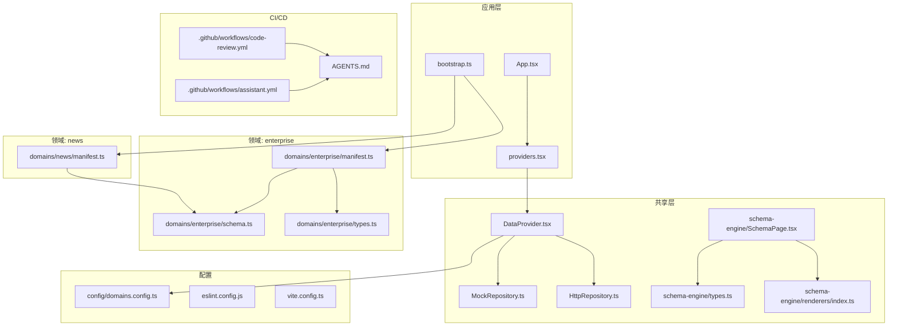
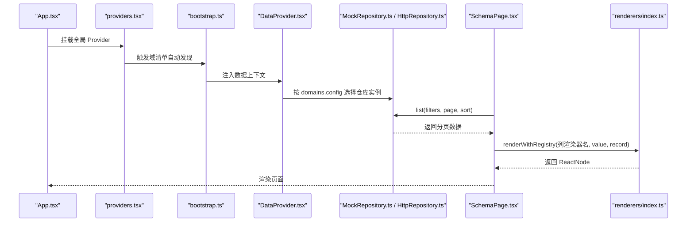
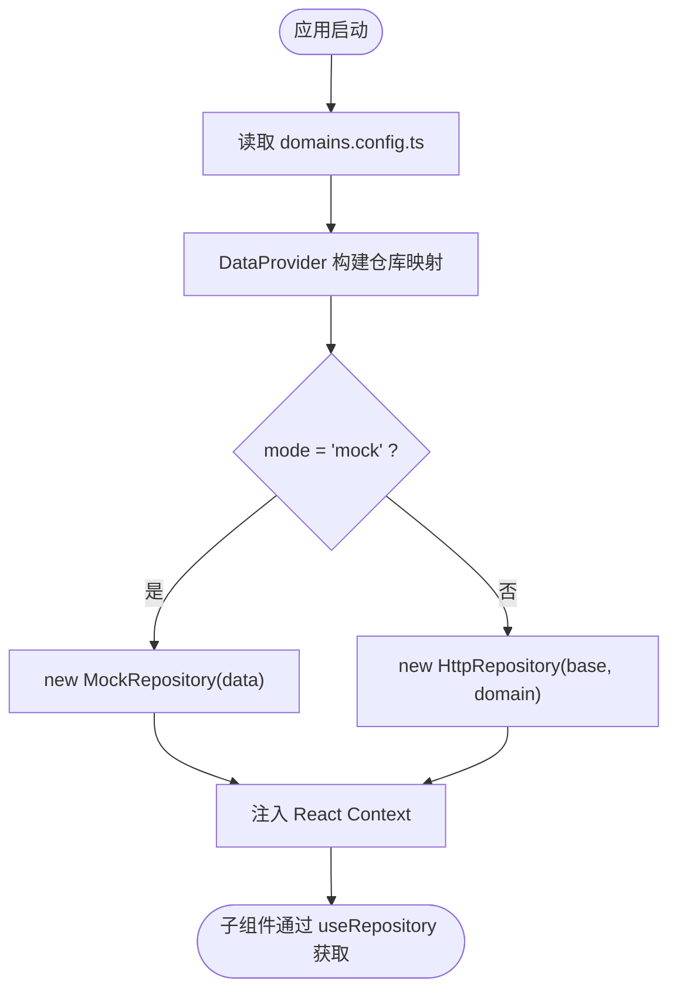
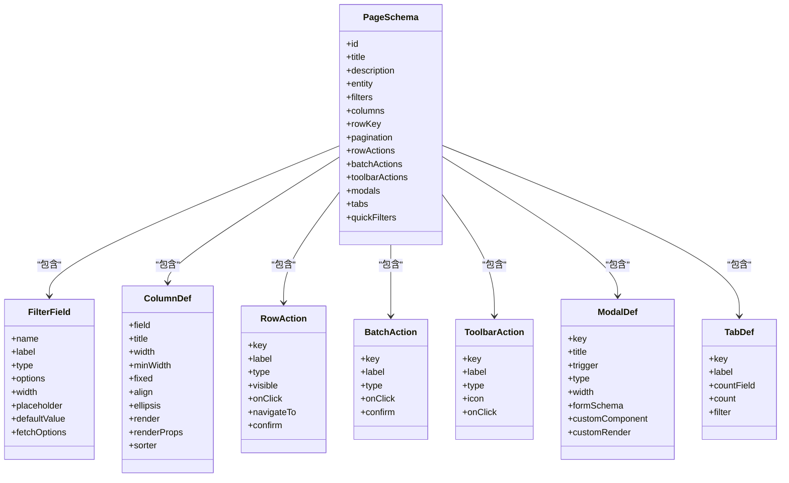
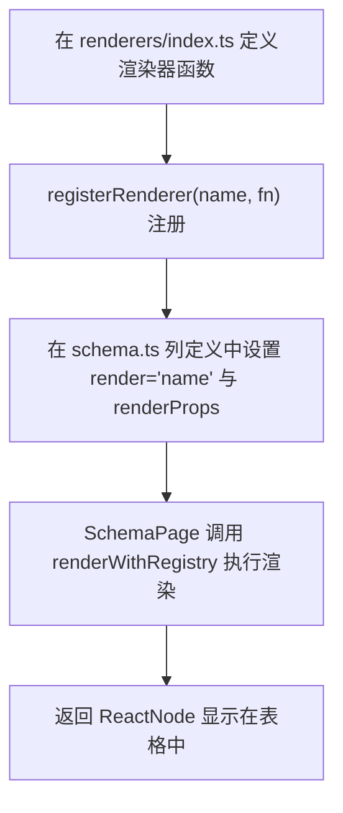
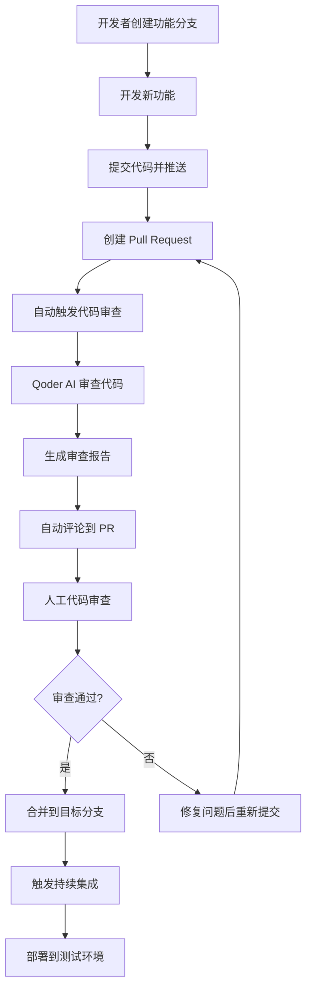
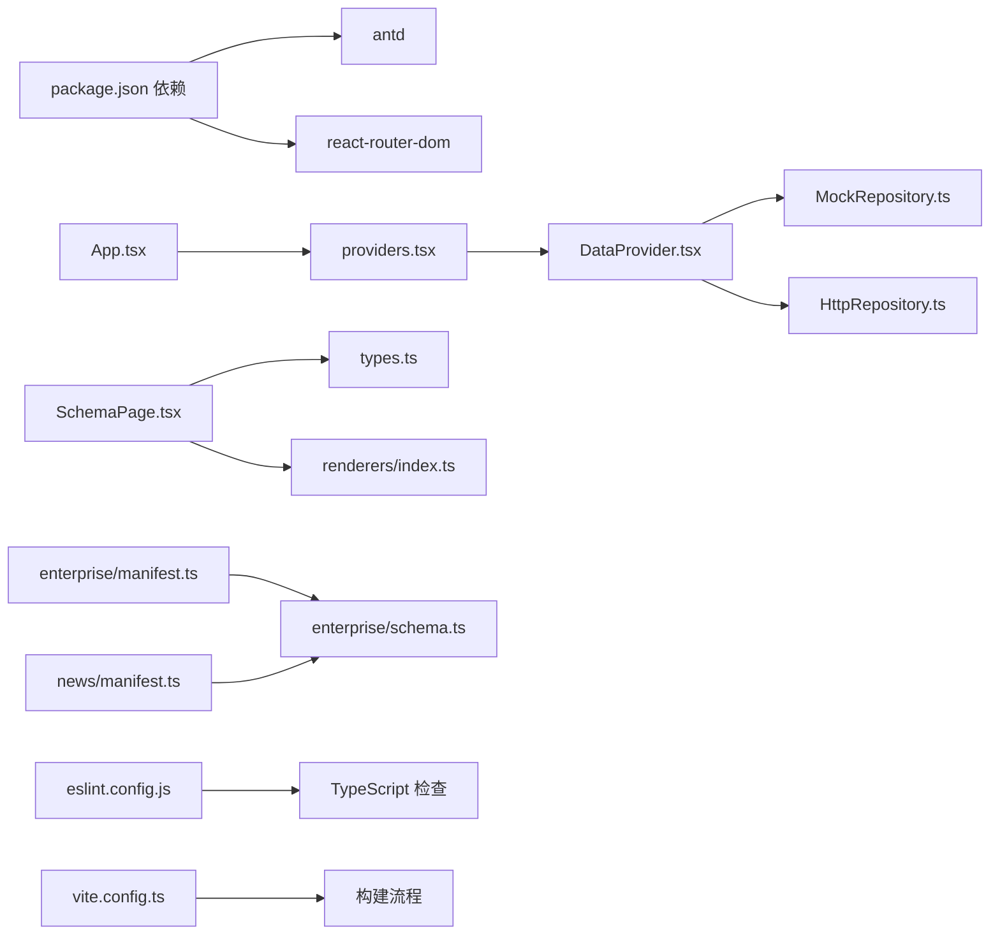

# 开发指南

<cite>
**本文引用的文件**
- [AGENTS.md](file://AGENTS.md)
- [assistant.yml](file://.github/workflows/assistant.yml)
- [code-review.yml](file://.github/workflows/code-review.yml)
- [App.tsx](file://hj-admin/src/app/App.tsx)
- [bootstrap.ts](file://hj-admin/src/app/bootstrap.ts)
- [providers.tsx](file://hj-admin/src/app/providers.tsx)
- [domains.config.ts](file://hj-admin/src/config/domains.config.ts)
- [DataProvider.tsx](file://hj-admin/src/shared/data/DataProvider.tsx)
- [MockRepository.ts](file://hj-admin/src/shared/data/MockRepository.ts)
- [HttpRepository.ts](file://hj-admin/src/shared/data/HttpRepository.ts)
- [types.ts](file://hj-admin/src/shared/schema-engine/types.ts)
- [SchemaPage.tsx](file://hj-admin/src/shared/schema-engine/SchemaPage.tsx)
- [renderers/index.ts](file://hj-admin/src/shared/schema-engine/renderers/index.ts)
- [enterprise/manifest.ts](file://hj-admin/src/domains/enterprise/manifest.ts)
- [enterprise/schema.ts](file://hj-admin/src/domains/enterprise/schema.ts)
- [enterprise/types.ts](file://hj-admin/src/domains/enterprise/types.ts)
- [news/manifest.ts](file://hj-admin/src/domains/news/manifest.ts)
- [package.json](file://hj-admin/package.json)
- [eslint.config.js](file://hj-admin/eslint.config.js)
- [vite.config.ts](file://hj-admin/vite.config.ts)
</cite>

## 更新摘要
**变更内容**
- 新增版本控制规范与Git工作流程章节
- 添加代码审查流程说明（基于GitHub Actions）
- 集成CI/CD流水线配置说明
- 补充基于AGENTS.md的项目架构指导
- 更新编码规范与最佳实践

## 目录
1. [简介](#简介)
2. [项目结构](#项目结构)
3. [核心组件](#核心组件)
4. [架构总览](#架构总览)
5. [详细组件分析](#详细组件分析)
6. [版本控制与协作规范](#版本控制与协作规范)
7. [依赖分析](#依赖分析)
8. [性能考虑](#性能考虑)
9. [故障排查指南](#故障排查指南)
10. [结论](#结论)
11. [附录](#附录)

## 简介
本指南面向新加入的开发者，提供"从零到一"的新业务域开发流程与最佳实践。内容覆盖：
- 新域创建与注册（目录、清单、路由、Schema）
- 数据源集成（Mock/HTTP 切换）
- 自定义渲染器开发与注册
- TypeScript 类型规范与组件设计模式
- 错误处理策略与调试技巧
- 性能优化建议（代码分割、懒加载、缓存）
- **版本控制规范与Git工作流程**
- **代码审查流程与CI/CD集成**

## 项目结构
本项目采用"领域驱动 + Schema 驱动"的架构：
- 应用层：入口、Provider 组合、路由
- 共享层：数据上下文、仓库实现、Schema 引擎与渲染器
- 领域层：各业务域的清单、Schema、类型、页面与仓库初始化



**图表来源**
- [App.tsx:1-21](file://hj-admin/src/app/App.tsx#L1-L21)
- [bootstrap.ts:1-104](file://hj-admin/src/app/bootstrap.ts#L1-L104)
- [providers.tsx:1-14](file://hj-admin/src/app/providers.tsx#L1-L14)
- [DataProvider.tsx:1-44](file://hj-admin/src/shared/data/DataProvider.tsx#L1-L44)
- [MockRepository.ts:1-101](file://hj-admin/src/shared/data/MockRepository.ts#L1-L101)
- [HttpRepository.ts:1-70](file://hj-admin/src/shared/data/HttpRepository.ts#L1-L70)
- [types.ts:1-216](file://hj-admin/src/shared/schema-engine/types.ts#L1-L216)
- [SchemaPage.tsx:1-226](file://hj-admin/src/shared/schema-engine/SchemaPage.tsx#L1-L226)
- [renderers/index.ts:1-163](file://hj-admin/src/shared/schema-engine/renderers/index.ts#L1-L163)
- [domains.config.ts:1-18](file://hj-admin/src/config/domains.config.ts#L1-L18)
- [enterprise/manifest.ts:1-20](file://hj-admin/src/domains/enterprise/manifest.ts#L1-L20)
- [enterprise/schema.ts:1-64](file://hj-admin/src/domains/enterprise/schema.ts#L1-L64)
- [enterprise/types.ts:1-50](file://hj-admin/src/domains/enterprise/types.ts#L1-L50)
- [news/manifest.ts:1-42](file://hj-admin/src/domains/news/manifest.ts#L1-L42)
- [code-review.yml:1-27](file://.github/workflows/code-review.yml#L1-L27)
- [assistant.yml:1-30](file://.github/workflows/assistant.yml#L1-L30)
- [AGENTS.md:1-71](file://AGENTS.md#L1-L71)

**章节来源**
- [App.tsx:1-21](file://hj-admin/src/app/App.tsx#L1-L21)
- [bootstrap.ts:1-104](file://hj-admin/src/app/bootstrap.ts#L1-L104)
- [providers.tsx:1-14](file://hj-admin/src/app/providers.tsx#L1-L14)
- [domains.config.ts:1-18](file://hj-admin/src/config/domains.config.ts#L1-L18)
- [DataProvider.tsx:1-44](file://hj-admin/src/shared/data/DataProvider.tsx#L1-L44)
- [MockRepository.ts:1-101](file://hj-admin/src/shared/data/MockRepository.ts#L1-L101)
- [HttpRepository.ts:1-70](file://hj-admin/src/shared/data/HttpRepository.ts#L1-L70)
- [types.ts:1-216](file://hj-admin/src/shared/schema-engine/types.ts#L1-L216)
- [SchemaPage.tsx:1-226](file://hj-admin/src/shared/schema-engine/SchemaPage.tsx#L1-L226)
- [renderers/index.ts:1-163](file://hj-admin/src/shared/schema-engine/renderers/index.ts#L1-L163)
- [enterprise/manifest.ts:1-20](file://hj-admin/src/domains/enterprise/manifest.ts#L1-L20)
- [enterprise/schema.ts:1-64](file://hj-admin/src/domains/enterprise/schema.ts#L1-L64)
- [enterprise/types.ts:1-50](file://hj-admin/src/domains/enterprise/types.ts#L1-L50)
- [news/manifest.ts:1-42](file://hj-admin/src/domains/news/manifest.ts#L1-L42)

## 核心组件
- 应用入口与 Provider 编排：根组件仅负责挂载 BrowserRouter、全局 Provider 链与路由，不包含业务逻辑。
- Bootstrap 自动装配：利用 Vite 的 `import.meta.glob` 构建时扫描所有域清单，零注册发现机制。
- 数据上下文 DataProvider：按 domain 动态装配 MockRepository 或 HttpRepository，统一对外暴露 Repository 接口。
- Schema 引擎 types：定义筛选、列、行操作、批量操作、工具栏、弹窗、Tab、表单等完整页面描述类型。
- 通用列表页 SchemaPage：根据 PageSchema 自动渲染筛选栏、Tab、表格、分页、操作列与弹窗，将"写页面"降维为"写配置"。
- 渲染器注册表：集中管理列渲染器，支持字符串引用与函数两种形式，便于扩展与复用。
- 领域清单 manifest：声明域元信息、菜单分组、排序、路由与 Schema 绑定。

**章节来源**
- [App.tsx:1-21](file://hj-admin/src/app/App.tsx#L1-L21)
- [bootstrap.ts:1-104](file://hj-admin/src/app/bootstrap.ts#L1-L104)
- [providers.tsx:1-14](file://hj-admin/src/app/providers.tsx#L1-L14)
- [DataProvider.tsx:1-44](file://hj-admin/src/shared/data/DataProvider.tsx#L1-L44)
- [types.ts:1-216](file://hj-admin/src/shared/schema-engine/types.ts#L1-L216)
- [SchemaPage.tsx:1-226](file://hj-admin/src/shared/schema-engine/SchemaPage.tsx#L1-L226)
- [renderers/index.ts:1-163](file://hj-admin/src/shared/schema-engine/renderers/index.ts#L1-L163)
- [enterprise/manifest.ts:1-20](file://hj-admin/src/domains/enterprise/manifest.ts#L1-L20)

## 架构总览
下图展示了从应用启动到页面渲染的关键路径：App 挂载 Provider，Bootstrap 自动发现域清单，DataProvider 装配仓库，SchemaPage 读取 Schema 并调用仓库获取数据，通过渲染器渲染列。



**图表来源**
- [App.tsx:1-21](file://hj-admin/src/app/App.tsx#L1-L21)
- [bootstrap.ts:1-104](file://hj-admin/src/app/bootstrap.ts#L1-L104)
- [providers.tsx:1-14](file://hj-admin/src/app/providers.tsx#L1-L14)
- [DataProvider.tsx:1-44](file://hj-admin/src/shared/data/DataProvider.tsx#L1-L44)
- [MockRepository.ts:1-101](file://hj-admin/src/shared/data/MockRepository.ts#L1-L101)
- [HttpRepository.ts:1-70](file://hj-admin/src/shared/data/HttpRepository.ts#L1-L70)
- [SchemaPage.tsx:1-226](file://hj-admin/src/shared/schema-engine/SchemaPage.tsx#L1-L226)
- [renderers/index.ts:1-163](file://hj-admin/src/shared/schema-engine/renderers/index.ts#L1-L163)

## 详细组件分析

### 新业务域开发流程（从零到一）
步骤概览：
1. 在 src/domains 下新建域目录（如 myDomain），包含 index.ts、manifest.ts、schema.ts、types.ts、repository.ts、pages 等。
2. 编写 types.ts：定义领域实体类型与枚举。
3. 编写 schema.ts：基于 PageSchema 定义筛选、列、分页、操作、Tab 等。
4. 编写 manifest.ts：声明域名称、标签、图标、菜单分组、排序、路由与 Schema 绑定；按需引入 repository.ts 以注册 mock 数据。
5. 编写 repository.ts：使用 registerMockData(domainName, data[]) 注册初始数据（可选）。
6. 在 config/domains.config.ts 中为该域配置数据源模式（'mock' 或 'http'）。
7. 如需自定义列渲染，参考"自定义渲染器"小节进行注册。
8. 运行 dev 服务，访问对应路由验证效果。

关键要点：
- 清单 manifest 是"域的身份证"，AI Agent 与路由系统据此发现域与页面。
- Schema 驱动页面，尽量保持可序列化（字符串渲染器名），减少手写组件。
- 数据源切换只需修改 domains.config.ts，无需改动 Schema 与页面。

**章节来源**
- [enterprise/manifest.ts:1-20](file://hj-admin/src/domains/enterprise/manifest.ts#L1-L20)
- [enterprise/schema.ts:1-64](file://hj-admin/src/domains/enterprise/schema.ts#L1-L64)
- [enterprise/types.ts:1-50](file://hj-admin/src/domains/enterprise/types.ts#L1-L50)
- [news/manifest.ts:1-42](file://hj-admin/src/domains/news/manifest.ts#L1-L42)
- [domains.config.ts:1-18](file://hj-admin/src/config/domains.config.ts#L1-L18)

### 配置文件与数据源集成
- 数据源模式：每个域在 domains.config.ts 中声明使用 'mock' 或 'http'。
- DataProvider 根据配置构建对应 Repository 实例，并通过 React Context 提供给子树。
- MockRepository：内存过滤/分页/排序，模拟网络延迟，返回 Promise，保证前后端一致体验。
- HttpRepository：占位实现，API 就绪后替换真实请求逻辑。



**图表来源**
- [domains.config.ts:1-18](file://hj-admin/src/config/domains.config.ts#L1-L18)
- [DataProvider.tsx:1-44](file://hj-admin/src/shared/data/DataProvider.tsx#L1-L44)
- [MockRepository.ts:1-101](file://hj-admin/src/shared/data/MockRepository.ts#L1-L101)
- [HttpRepository.ts:1-70](file://hj-admin/src/shared/data/HttpRepository.ts#L1-L70)

**章节来源**
- [domains.config.ts:1-18](file://hj-admin/src/config/domains.config.ts#L1-L18)
- [DataProvider.tsx:1-44](file://hj-admin/src/shared/data/DataProvider.tsx#L1-L44)
- [MockRepository.ts:1-101](file://hj-admin/src/shared/data/MockRepository.ts#L1-L101)
- [HttpRepository.ts:1-70](file://hj-admin/src/shared/data/HttpRepository.ts#L1-L70)

### Schema 定义与页面渲染
- PageSchema 描述一个列表页的全部能力：标题、描述、实体、筛选、列、分页、行/批量/工具栏操作、弹窗、Tab、快捷筛选等。
- SchemaPage 解析 PageSchema，组装筛选栏、Tab、表格、分页与操作列，并将列渲染委托给渲染器注册表。
- 列渲染支持两种方式：
  - 字符串引用：render: 'renderer-name'，配合 renderProps 传递参数。
  - 函数渲染：render: (value, record, index) => ReactNode，用于复杂场景。



**图表来源**
- [types.ts:1-216](file://hj-admin/src/shared/schema-engine/types.ts#L1-L216)
- [SchemaPage.tsx:1-226](file://hj-admin/src/shared/schema-engine/SchemaPage.tsx#L1-L226)

**章节来源**
- [types.ts:1-216](file://hj-admin/src/shared/schema-engine/types.ts#L1-L216)
- [SchemaPage.tsx:1-226](file://hj-admin/src/shared/schema-engine/SchemaPage.tsx#L1-L226)
- [enterprise/schema.ts:1-64](file://hj-admin/src/domains/enterprise/schema.ts#L1-L64)

### 自定义渲染器开发方法
目标：在不改动 Schema 与页面的前提下，新增列渲染能力。

步骤：
1. 在 renderers/index.ts 中新增渲染器函数，遵循 Renderer 签名。
2. 使用 registerRenderer('your-renderer', rendererFn) 注册。
3. 在 Schema 的列定义中使用 render: 'your-renderer' 与 renderProps 传参。
4. 若需要交互，可通过 onAction 回调向上通知。

内置渲染器示例（路径参考）：
- 状态徽章：status-badge
- 百分比：percent
- 链接跳转：link
- 日期或破折号：date-or-dash
- 颜色标签：color-tag
- URL 链接：url
- 成功率：success-rate
- 关联进度：link-progress
- 位置标签：position-tags



**图表来源**
- [renderers/index.ts:1-163](file://hj-admin/src/shared/schema-engine/renderers/index.ts#L1-L163)
- [SchemaPage.tsx:1-226](file://hj-admin/src/shared/schema-engine/SchemaPage.tsx#L1-L226)

**章节来源**
- [renderers/index.ts:1-163](file://hj-admin/src/shared/schema-engine/renderers/index.ts#L1-L163)
- [SchemaPage.tsx:1-226](file://hj-admin/src/shared/schema-engine/SchemaPage.tsx#L1-L226)

### 领域清单与路由
- manifest.ts 声明域元信息与路由，支持：
  - 有 schema：由 SchemaPage 自动渲染
  - 无 schema：component 懒加载自定义页面
- 示例：企业域与资讯域均通过 manifest 声明路由与 Schema 绑定。

**章节来源**
- [enterprise/manifest.ts:1-20](file://hj-admin/src/domains/enterprise/manifest.ts#L1-L20)
- [news/manifest.ts:1-42](file://hj-admin/src/domains/news/manifest.ts#L1-L42)

### 类型系统与领域模型
- 领域类型集中在 types.ts，包括枚举、实体、辅助常量等。
- 所有 Schema 与渲染器都基于 shared/schema-engine/types.ts 的类型契约，确保强类型与一致性。

**章节来源**
- [enterprise/types.ts:1-50](file://hj-admin/src/domains/enterprise/types.ts#L1-L50)
- [types.ts:1-216](file://hj-admin/src/shared/schema-engine/types.ts#L1-L216)

## 版本控制与协作规范

### Git 分支管理策略
- **main 分支**：生产环境代码，保持稳定状态
- **develop 分支**：开发主分支，集成所有功能特性
- **feature/* 分支**：功能开发分支，从 develop 分支切出
- **bugfix/* 分支**：问题修复分支，从 main 或 develop 分支切出
- **release/* 分支**：发布准备分支，用于测试和预发布

### 提交信息规范
遵循 Conventional Commits 规范：
- `feat:` 新功能
- `fix:` 修复bug
- `docs:` 文档更新
- `style:` 代码格式调整
- `refactor:` 代码重构
- `test:` 测试相关
- `chore:` 构建过程或辅助工具的变动

### 代码审查流程
项目集成了基于 GitHub Actions 的自动化代码审查流程：

#### 自动化代码审查
当 Pull Request 创建或更新时，系统会自动触发 Qoder AI 代码审查：
- 检查代码质量和潜在问题
- 提供改进建议和最佳实践
- 生成中文审查报告
- 自动评论到 PR 中

#### 智能助手集成
支持通过 Issue 评论触发 AI 助手：
- 在 Issue 评论中添加 `@qoder` 触发助手
- 自动分析问题并提供解决方案
- 支持代码解释和技术咨询



**图表来源**
- [code-review.yml:1-27](file://.github/workflows/code-review.yml#L1-L27)
- [assistant.yml:1-30](file://.github/workflows/assistant.yml#L1-L30)

### CI/CD 流水线配置

#### 代码审查流水线
- **触发条件**：Pull Request 创建或同步更新
- **执行环境**：Ubuntu 最新稳定版
- **权限配置**：读写 Pull Requests，只读代码库
- **审查语言**：中文输出

#### 智能助手流水线
- **触发条件**：Issue 评论中包含 `@qoder`
- **功能特性**：
  - 自动分析问题描述
  - 提供技术解决方案
  - 生成代码示例
  - 回答技术问题

**章节来源**
- [code-review.yml:1-27](file://.github/workflows/code-review.yml#L1-L27)
- [assistant.yml:1-30](file://.github/workflows/assistant.yml#L1-L30)
- [AGENTS.md:1-71](file://AGENTS.md#L1-L71)

### 项目架构指导（基于 AGENTS.md）

#### 核心架构原则
- **Schema 驱动**：通过 `PageSchema` 配置自动生成列表页、筛选栏、弹窗、操作列
- **域（Domain）组织**：每个业务模块自包含 `manifest.ts` + `schema.ts` + `repository.ts` + `pages/`
- **bootstrap 自动装配**：利用 Vite 的 `import.meta.glob` 构建时扫描所有域清单，零注册
- **Mock/HTTP 数据源切换**：通过 `src/config/domains.config.ts` 集中控制

#### 目录结构规范
```
hj-admin/
├── src/
│   ├── app/              # 入口编排层（App、bootstrap、router、providers）
│   ├── domains/          # 业务域（enterprise/news/resource/tags）
│   │   └── <domain>/
│   │       ├── manifest.ts   # 域清单（路由、菜单、图标）
│   │       ├── schema.ts     # PageSchema 配置
│   │       ├── repository.ts # 数据仓库注册
│   │       ├── pages/        # 自定义页面
│   │       ├── types.ts      # 类型定义
│   │       └── mock.ts       # Mock 数据
│   ├── shared/           # 共享基础设施
│   │   ├── data/             # DataProvider、Repository、useHook
│   │   └── schema-engine/    # SchemaPage、渲染器、类型定义
│   ├── layouts/          # MainLayout、Sidebar、Topbar
│   └── config/           # 域配置文件
└── 数据表/                # Excel 参考数据（氢能产业链全环节）
```

#### 编码规范
- **语言**：TypeScript，禁止使用 `any`
- **组件**：函数式组件 + Hooks，组件名 PascalCase
- **样式**：Ant Design + CSS 变量，不引入额外 CSS 框架
- **命名**：变量/函数 camelCase，常量 UPPER_SNAKE_CASE，文件 camelCase 或 PascalCase
- **注释**：使用中文注释，复杂逻辑必须说明业务背景
- **依赖方向**：app → domains → shared，shared 不反向依赖任何 domain

#### NER 核心功能说明
NER（命名实体识别）确认面板是本项目的核心业务逻辑：
- **位置**：新闻编辑页右侧
- **功能**：运营人员校对 AI 自动识别出的企业/项目实体
- **置信度层级**：
  - L1：精确匹配，高置信度，可自动关联
  - L2：归一化匹配，中等置信度，需人工确认
  - L3：相似度匹配，低置信度，需重点审核
- **状态**：已确认 / 待分类 / 待匹配 / 已忽略（噪音）
- **操作**：确认关联 / 忽略 / 创建新实体 / 手动添加

#### 审查重点
- 所有数据库查询必须使用参数化查询
- API 端点必须包含权限检查
- 敏感信息（密码、Token）不得硬编码
- Schema 配置中的类型定义必须完整
- 新增域必须遵循 manifest → schema → repository → pages 结构

**章节来源**
- [AGENTS.md:1-71](file://AGENTS.md#L1-L71)

## 依赖分析
- 应用层依赖共享层的数据上下文与 Schema 引擎。
- 共享层依赖 antd、react-router-dom 等 UI 与路由库。
- 领域层依赖共享层类型与渲染器，通过 manifest 与 Schema 接入。



**图表来源**
- [package.json:1-35](file://hj-admin/package.json#L1-L35)
- [App.tsx:1-21](file://hj-admin/src/app/App.tsx#L1-L21)
- [providers.tsx:1-14](file://hj-admin/src/app/providers.tsx#L1-L14)
- [DataProvider.tsx:1-44](file://hj-admin/src/shared/data/DataProvider.tsx#L1-L44)
- [MockRepository.ts:1-101](file://hj-admin/src/shared/data/MockRepository.ts#L1-L101)
- [HttpRepository.ts:1-70](file://hj-admin/src/shared/data/HttpRepository.ts#L1-L70)
- [SchemaPage.tsx:1-226](file://hj-admin/src/shared/schema-engine/SchemaPage.tsx#L1-L226)
- [types.ts:1-216](file://hj-admin/src/shared/schema-engine/types.ts#L1-L216)
- [renderers/index.ts:1-163](file://hj-admin/src/shared/schema-engine/renderers/index.ts#L1-L163)
- [enterprise/manifest.ts:1-20](file://hj-admin/src/domains/enterprise/manifest.ts#L1-L20)
- [enterprise/schema.ts:1-64](file://hj-admin/src/domains/enterprise/schema.ts#L1-L64)
- [news/manifest.ts:1-42](file://hj-admin/src/domains/news/manifest.ts#L1-L42)
- [eslint.config.js:1-23](file://hj-admin/eslint.config.js#L1-L23)
- [vite.config.ts:1-8](file://hj-admin/vite.config.ts#L1-L8)

**章节来源**
- [package.json:1-35](file://hj-admin/package.json#L1-L35)

## 性能考虑
- 代码分割与懒加载：
  - 对非 Schema 页面使用 component: () => import(...) 实现路由级懒加载，减少首屏体积。
- 列表渲染优化：
  - 合理设置 Table 的 rowKey、固定列与滚动区域，避免不必要的重排。
  - 对大数据量场景，优先后端分页与过滤，前端只做轻量计算。
- 缓存策略：
  - 当前仓库未实现缓存，可在 HttpRepository 层增加响应缓存（如按查询键缓存）或结合 React Query 等方案。
- 渲染器性能：
  - 避免在渲染器中进行昂贵计算，必要时使用 useMemo 或预计算字段。
- 构建与依赖：
  - 使用 Vite 开发/构建，按需引入 antd 组件与图标，减少打包体积。

## 故障排查指南
常见问题与定位思路：
- 页面空白或报错：
  - 检查 manifest 的路由 path 与 label 是否正确，确认是否绑定了 schema 或 component。
  - 确认 Schema 中的 entity 是否与 DataProvider 注册的 domain 一致。
- 数据为空或筛选无效：
  - 确认 repository.ts 是否调用了 registerMockData 注册数据。
  - 检查 domains.config.ts 中该域的模式是否为 'mock'，或 HTTP 接口是否可用。
- 列渲染异常：
  - 确认 render 字段使用的渲染器名已在 renderers/index.ts 中注册。
  - 查看控制台是否有"Renderer not found in registry"的警告。
- 导航失败：
  - 检查 navigateTo 模板中的占位符（如 :id）是否与记录 id 匹配。
- 性能问题：
  - 在浏览器 Performance 面板观察长任务，定位渲染器或数据处理瓶颈。
- **代码审查相关问题**：
  - 检查 GitHub Actions 日志，确认 CI/CD 流水线执行情况。
  - 查看 AI 代码审查报告，根据建议修复代码质量问题。
  - 确认 ESLint 配置是否正确，解决代码风格问题。

**章节来源**
- [renderers/index.ts:1-163](file://hj-admin/src/shared/schema-engine/renderers/index.ts#L1-L163)
- [SchemaPage.tsx:1-226](file://hj-admin/src/shared/schema-engine/SchemaPage.tsx#L1-L226)
- [DataProvider.tsx:1-44](file://hj-admin/src/shared/data/DataProvider.tsx#L1-L44)
- [domains.config.ts:1-18](file://hj-admin/src/config/domains.config.ts#L1-L18)
- [eslint.config.js:1-23](file://hj-admin/eslint.config.js#L1-L23)

## 结论
通过"清单 + Schema + 渲染器 + 仓库"的分层设计，本项目实现了高内聚、低耦合的可扩展后台架构。新业务域的开发可以聚焦于类型、Schema 与少量交互逻辑，借助统一的渲染器与数据源抽象快速落地。

**新增的版本控制与协作规范**进一步提升了团队协作效率：
- 标准化的 Git 分支管理确保代码质量
- 自动化的代码审查流程提高开发效率
- CI/CD 集成实现持续交付
- 基于 AGENTS.md 的项目架构指导为新成员提供清晰的学习路径

建议在后续迭代中逐步完善 HTTP 仓库、缓存与监控能力，进一步提升稳定性与性能。

## 附录

### 新域开发清单（Checklist）
- 目录与文件
  - 新建 src/domains/<domain>/index.ts、manifest.ts、schema.ts、types.ts、repository.ts、pages/*
- 类型与 Schema
  - 在 types.ts 定义领域类型
  - 在 schema.ts 定义 PageSchema（筛选、列、分页、操作、Tab）
- 清单与路由
  - 在 manifest.ts 声明域元信息、菜单分组、排序、路由与 Schema 绑定
- 数据源
  - 在 repository.ts 中注册 mock 数据（可选）
  - 在 domains.config.ts 中配置数据源模式
- 渲染器
  - 如需自定义列展示，在 renderers/index.ts 中注册并使用
- 验证
  - 启动 dev 服务，访问路由验证功能与样式

### Git 工作流检查清单
- 分支管理
  - 从 develop 分支创建 feature/* 分支
  - 完成功能后创建 Pull Request
- 代码质量
  - 运行本地 ESLint 检查
  - 确保 TypeScript 编译通过
  - 遵循 Conventional Commits 提交规范
- 代码审查
  - 等待 AI 自动审查完成
  - 根据审查报告修复问题
  - 获得至少一位团队成员批准
- 合并与部署
  - 合并到 develop 分支
  - 触发 CI/CD 流水线
  - 验证测试环境部署成功

**章节来源**
- [enterprise/manifest.ts:1-20](file://hj-admin/src/domains/enterprise/manifest.ts#L1-L20)
- [enterprise/schema.ts:1-64](file://hj-admin/src/domains/enterprise/schema.ts#L1-L64)
- [enterprise/types.ts:1-50](file://hj-admin/src/domains/enterprise/types.ts#L1-L50)
- [news/manifest.ts:1-42](file://hj-admin/src/domains/news/manifest.ts#L1-L42)
- [domains.config.ts:1-18](file://hj-admin/src/config/domains.config.ts#L1-L18)
- [renderers/index.ts:1-163](file://hj-admin/src/shared/schema-engine/renderers/index.ts#L1-L163)
- [code-review.yml:1-27](file://.github/workflows/code-review.yml#L1-L27)
- [assistant.yml:1-30](file://.github/workflows/assistant.yml#L1-L30)
- [AGENTS.md:1-71](file://AGENTS.md#L1-L71)