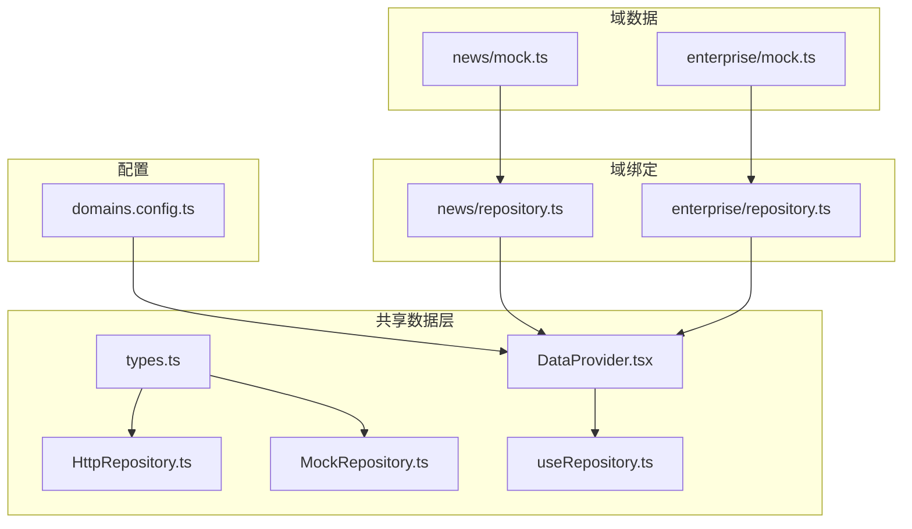
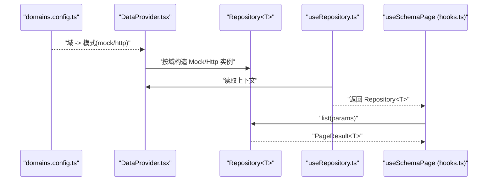
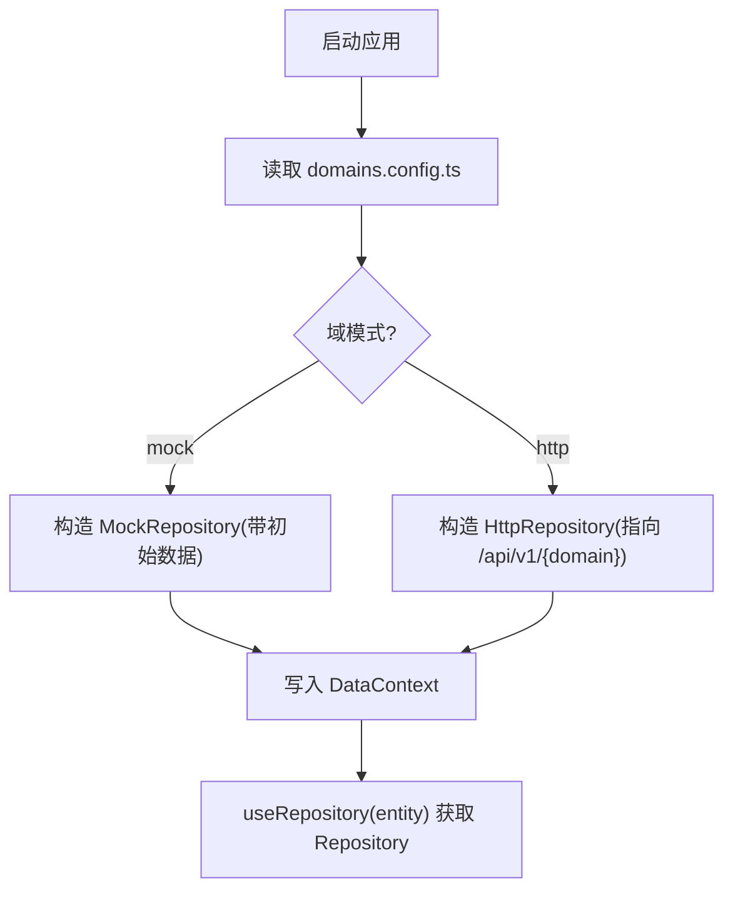
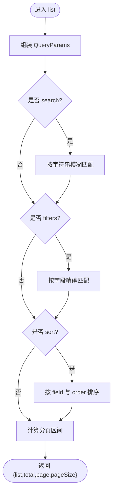
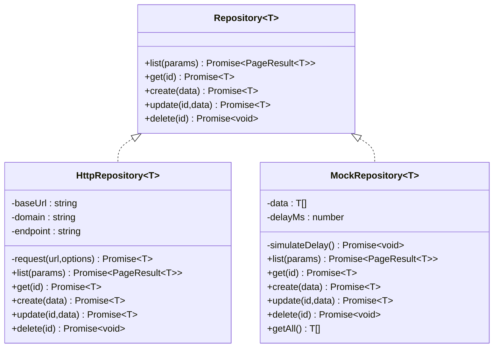
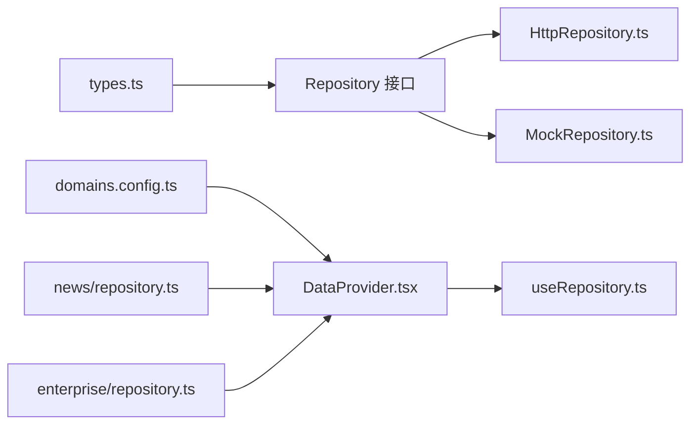

# 数据源集成

<cite>
**本文引用的文件**   
- [types.ts](file://hj-admin/src/shared/data/types.ts)
- [HttpRepository.ts](file://hj-admin/src/shared/data/HttpRepository.ts)
- [MockRepository.ts](file://hj-admin/src/shared/data/MockRepository.ts)
- [DataProvider.tsx](file://hj-admin/src/shared/data/DataProvider.tsx)
- [useRepository.ts](file://hj-admin/src/shared/data/useRepository.ts)
- [domains.config.ts](file://hj-admin/src/config/domains.config.ts)
- [news/repository.ts](file://hj-admin/src/domains/news/repository.ts)
- [enterprise/repository.ts](file://hj-admin/src/domains/enterprise/repository.ts)
- [news/mock.ts](file://hj-admin/src/domains/news/mock.ts)
- [enterprise/mock.ts](file://hj-admin/src/domains/enterprise/mock.ts)
- [hooks.ts](file://hj-admin/src/shared/schema-engine/hooks.ts)
</cite>

## 目录
1. [引言](#引言)
2. [项目结构](#项目结构)
3. [核心组件](#核心组件)
4. [架构总览](#架构总览)
5. [详细组件分析](#详细组件分析)
6. [依赖分析](#依赖分析)
7. [性能考虑](#性能考虑)
8. [故障排查指南](#故障排查指南)
9. [结论](#结论)
10. [附录](#附录)

## 引言
本指南面向需要在项目中实现“数据源集成”的开发者，围绕 Repository 模式、HTTP 客户端封装、请求拦截与错误处理、Mock 数据源配置与切换、分页查询、批量操作、实时数据更新、异步数据流与缓存策略等主题，提供从原理到实践的完整说明。本项目采用“按域（domain）注册数据源”的方式，通过统一的 Repository 接口屏蔽底层差异，使页面与 Schema 引擎无需关心数据来源是内存 Mock 还是远程 HTTP。

## 项目结构
- 共享数据层位于 shared/data，定义统一契约与两种实现：
  - 类型与契约：QueryParams、PageResult、Repository、DataSourceMode、DomainDataSourceConfig
  - 抽象提供者：DataProvider 根据 domain 配置创建具体 Repository 实例
  - 获取 Hook：useRepository 在组件中按 entity 名称取用对应 Repository
- 域级绑定位于各 domains/*/repository.ts，负责将域内 mock 数据注入 DataProvider
- 配置中心位于 config/domains.config.ts，集中声明每个域的数据源模式（mock/http）
- 示例域包含 news 与 enterprise，分别提供 mock 数据与绑定逻辑

图表来源
- [types.ts:1-36](file://hj-admin/src/shared/data/types.ts#L1-L36)
- [HttpRepository.ts:1-69](file://hj-admin/src/shared/data/HttpRepository.ts#L1-L69)
- [MockRepository.ts:1-101](file://hj-admin/src/shared/data/MockRepository.ts#L1-L101)
- [DataProvider.tsx:1-44](file://hj-admin/src/shared/data/DataProvider.tsx#L1-L44)
- [useRepository.ts:1-24](file://hj-admin/src/shared/data/useRepository.ts#L1-L24)
- [domains.config.ts:1-18](file://hj-admin/src/config/domains.config.ts#L1-L18)
- [news/repository.ts:1-11](file://hj-admin/src/domains/news/repository.ts#L1-L11)
- [enterprise/repository.ts:1-6](file://hj-admin/src/domains/enterprise/repository.ts#L1-L6)
- [news/mock.ts:1-60](file://hj-admin/src/domains/news/mock.ts#L1-L60)
- [enterprise/mock.ts:1-24](file://hj-admin/src/domains/enterprise/mock.ts#L1-L24)

章节来源
- [types.ts:1-36](file://hj-admin/src/shared/data/types.ts#L1-L36)
- [DataProvider.tsx:1-44](file://hj-admin/src/shared/data/DataProvider.tsx#L1-L44)
- [domains.config.ts:1-18](file://hj-admin/src/config/domains.config.ts#L1-L18)

## 核心组件
- Repository 接口：统一 list/get/create/update/delete 契约，参数与返回结果遵循 QueryParams/PageResult 约定
- HttpRepository：基于 fetch 的轻量 HTTP 客户端，自动拼接 URLSearchParams，统一错误抛出
- MockRepository：内存数据源，支持关键词搜索、多字段筛选、排序、分页，并模拟网络延迟
- DataProvider：按域读取 domainConfig，选择 Mock/Http 实现，并通过 React Context 暴露
- useRepository：在组件中以 entity 名称获取对应 Repository，未注册时返回空操作 fallback

章节来源
- [types.ts:1-36](file://hj-admin/src/shared/data/types.ts#L1-L36)
- [HttpRepository.ts:1-69](file://hj-admin/src/shared/data/HttpRepository.ts#L1-L69)
- [MockRepository.ts:1-101](file://hj-admin/src/shared/data/MockRepository.ts#L1-L101)
- [DataProvider.tsx:1-44](file://hj-admin/src/shared/data/DataProvider.tsx#L1-L44)
- [useRepository.ts:1-24](file://hj-admin/src/shared/data/useRepository.ts#L1-L24)

## 架构总览
下图展示了从配置到运行时数据访问的完整链路：配置决定数据源模式，DataProvider 构建 Repository 映射，useRepository 在组件中按需取用，Schema 引擎通过 useSchemaPage 驱动分页/筛选/加载。

图表来源
- [domains.config.ts:1-18](file://hj-admin/src/config/domains.config.ts#L1-L18)
- [DataProvider.tsx:1-44](file://hj-admin/src/shared/data/DataProvider.tsx#L1-L44)
- [useRepository.ts:1-24](file://hj-admin/src/shared/data/useRepository.ts#L1-L24)
- [hooks.ts:1-79](file://hj-admin/src/shared/schema-engine/hooks.ts#L1-L79)

## 详细组件分析

### Repository 模式与扩展方法
- 统一契约：所有数据访问均通过 Repository<T> 的五个方法完成，便于替换实现与测试
- 扩展建议：
  - 批量操作：在接口上增加 batchCreate/batchUpdate/batchDelete，或在现有 create/update/delete 基础上组合调用
  - 事务/重试：在 HttpRepository.request 外层封装重试与幂等策略
  - 审计日志：在 Repository 入口记录操作人、时间戳、变更摘要
  - 软删除：update 时标记 deletedAt，delete 改为状态变更而非物理删除

章节来源
- [types.ts:1-36](file://hj-admin/src/shared/data/types.ts#L1-L36)

### HTTP 客户端封装与请求拦截器
- 当前实现使用原生 fetch，统一设置 Content-Type，并在非 ok 响应时抛出错误
- 建议增强点：
  - 请求拦截：在 request 前注入鉴权头、traceId、业务租户标识
  - 响应拦截：对统一错误码进行转换，将后端错误包装为领域异常
  - 超时控制：为 fetch 添加 AbortController 与超时取消
  - 重试机制：针对 5xx 或网络抖动进行指数退避重试
  - 并发控制：限制同域并发请求数，避免雪崩

章节来源
- [HttpRepository.ts:1-69](file://hj-admin/src/shared/data/HttpRepository.ts#L1-L69)

### 错误处理机制
- 当前行为：HTTP 非成功状态直接抛错；Mock 在找不到资源时抛错
- 建议：
  - 统一错误对象：包含 code/message/diagnostic，便于前端展示与埋点
  - 用户提示：在 useSchemaPage 捕获错误后显示友好提示
  - 降级策略：网络失败时回退到本地缓存或上次成功结果

章节来源
- [HttpRepository.ts:1-69](file://hj-admin/src/shared/data/HttpRepository.ts#L1-L69)
- [MockRepository.ts:1-101](file://hj-admin/src/shared/data/MockRepository.ts#L1-L101)

### Mock 数据源配置与无缝切换
- 配置方式：在 domains.config.ts 中将域设置为 'mock' 或 'http'
- 数据注入：在各域的 repository.ts 中调用 registerMockData 注册初始数据
- 切换效果：仅修改配置即可在开发/测试环境使用 Mock，生产环境切换为 HTTP，页面与 Schema 代码零改动

图表来源
- [domains.config.ts:1-18](file://hj-admin/src/config/domains.config.ts#L1-L18)
- [DataProvider.tsx:1-44](file://hj-admin/src/shared/data/DataProvider.tsx#L1-L44)
- [news/repository.ts:1-11](file://hj-admin/src/domains/news/repository.ts#L1-L11)
- [enterprise/repository.ts:1-6](file://hj-admin/src/domains/enterprise/repository.ts#L1-L6)

章节来源
- [domains.config.ts:1-18](file://hj-admin/src/config/domains.config.ts#L1-L18)
- [DataProvider.tsx:1-44](file://hj-admin/src/shared/data/DataProvider.tsx#L1-L44)
- [news/repository.ts:1-11](file://hj-admin/src/domains/news/repository.ts#L1-L11)
- [enterprise/repository.ts:1-6](file://hj-admin/src/domains/enterprise/repository.ts#L1-L6)

### 分页查询、筛选与排序
- 参数约定：page/pageSize/search/filters/sort.field/sort.order
- Mock 行为：内存过滤、排序、分页，并模拟延迟
- HTTP 行为：将参数拼接到 URLSearchParams，由后端处理

图表来源
- [MockRepository.ts:1-101](file://hj-admin/src/shared/data/MockRepository.ts#L1-L101)
- [HttpRepository.ts:1-69](file://hj-admin/src/shared/data/HttpRepository.ts#L1-L69)

章节来源
- [MockRepository.ts:1-101](file://hj-admin/src/shared/data/MockRepository.ts#L1-L101)
- [HttpRepository.ts:1-69](file://hj-admin/src/shared/data/HttpRepository.ts#L1-L69)

### 批量操作
- 现状：当前 Repository 仅提供单条 CRUD
- 建议实现：
  - 在 Repository 接口新增 batchCreate/batchUpdate/batchDelete
  - 在 HttpRepository 中合并为一次批量 API 调用
  - 在 MockRepository 中批量更新内存数据
  - 在 useSchemaPage 中提供批量动作回调，结合确认对话框与乐观更新

章节来源
- [types.ts:1-36](file://hj-admin/src/shared/data/types.ts#L1-L36)

### 实时数据更新
- 现状：当前无实时推送能力
- 建议方案：
  - 短轮询：在 useSchemaPage 中定时刷新，或使用 useEffect 间隔触发 repo.list
  - WebSocket/SSE：在 HttpRepository 外建立连接，收到增量事件后局部更新 state
  - 事件总线：在 DataProvider 层广播领域事件，useSchemaPage 订阅后刷新

章节来源
- [hooks.ts:1-79](file://hj-admin/src/shared/schema-engine/hooks.ts#L1-L79)

### 异步数据流与缓存策略
- 现状：useSchemaPage 管理 loading/data/total 等状态，未内置缓存
- 建议策略：
  - 请求去重：相同 params 并发只发一次请求
  - 结果缓存：以 key=entity+params 为键缓存最近 N 次结果，过期策略可基于时间或版本号
  - 失效策略：create/update/delete 后主动失效相关缓存
  - 预取：在路由切换或 Tab 切换时预取下一页数据

章节来源
- [hooks.ts:1-79](file://hj-admin/src/shared/schema-engine/hooks.ts#L1-L79)

### 类图：Repository 体系

图表来源
- [types.ts:1-36](file://hj-admin/src/shared/data/types.ts#L1-L36)
- [HttpRepository.ts:1-69](file://hj-admin/src/shared/data/HttpRepository.ts#L1-L69)
- [MockRepository.ts:1-101](file://hj-admin/src/shared/data/MockRepository.ts#L1-L101)

## 依赖分析
- 低耦合：页面与 Schema 仅依赖 Repository 接口与 useRepository Hook
- 集中式配置：domains.config.ts 作为唯一开关，降低侵入性
- 域级解耦：各域独立维护 mock 数据与注册逻辑，互不影响

图表来源
- [types.ts:1-36](file://hj-admin/src/shared/data/types.ts#L1-L36)
- [HttpRepository.ts:1-69](file://hj-admin/src/shared/data/HttpRepository.ts#L1-L69)
- [MockRepository.ts:1-101](file://hj-admin/src/shared/data/MockRepository.ts#L1-L101)
- [DataProvider.tsx:1-44](file://hj-admin/src/shared/data/DataProvider.tsx#L1-L44)
- [useRepository.ts:1-24](file://hj-admin/src/shared/data/useRepository.ts#L1-L24)
- [domains.config.ts:1-18](file://hj-admin/src/config/domains.config.ts#L1-L18)
- [news/repository.ts:1-11](file://hj-admin/src/domains/news/repository.ts#L1-L11)
- [enterprise/repository.ts:1-6](file://hj-admin/src/domains/enterprise/repository.ts#L1-L6)

章节来源
- [domains.config.ts:1-18](file://hj-admin/src/config/domains.config.ts#L1-L18)
- [DataProvider.tsx:1-44](file://hj-admin/src/shared/data/DataProvider.tsx#L1-L44)

## 性能考虑
- 列表页优化
  - 服务端分页：确保 pageSize 合理，避免一次性拉取过多数据
  - 防抖搜索：search 输入防抖，减少无效请求
  - 增量更新：对高频变动字段采用局部刷新
- 缓存与去重
  - 请求去重：相同 params 合并请求
  - 结果缓存：LRU 或时间窗口缓存，配合失效策略
- 渲染优化
  - 虚拟滚动：大数据量列表使用虚拟化
  - 懒加载：图片与富文本按需加载
- 网络优化
  - 压缩与 CDN：静态资源与接口响应压缩
  - 连接复用：保持长连接或 HTTP/2

[本节为通用指导，不直接分析具体文件]

## 故障排查指南
- 常见问题
  - 未注册 Repository：useRepository 会打印警告并返回空操作实现，检查 domains.config.ts 与 useRepository 传入的 entity 名称
  - Mock 数据为空：确认对应域的 repository.ts 已调用 registerMockData 并正确导入 mock 数据
  - HTTP 请求失败：检查 baseUrl 与域名路径是否正确，关注非 ok 响应的错误信息
- 定位步骤
  - 打开控制台查看警告与错误日志
  - 在 useSchemaPage 的 fetchData 中观察请求参数与返回结果
  - 临时将域模式切为 mock，验证是否为后端问题

章节来源
- [useRepository.ts:1-24](file://hj-admin/src/shared/data/useRepository.ts#L1-L24)
- [news/repository.ts:1-11](file://hj-admin/src/domains/news/repository.ts#L1-L11)
- [enterprise/repository.ts:1-6](file://hj-admin/src/domains/enterprise/repository.ts#L1-L6)
- [HttpRepository.ts:1-69](file://hj-admin/src/shared/data/HttpRepository.ts#L1-L69)

## 结论
通过 Repository 模式与按域配置的数据源切换，本项目实现了前后端解耦与开发体验一致性。建议在后续迭代中完善请求拦截、错误处理、批量操作、实时推送与缓存策略，进一步提升系统的健壮性与性能。

[本节为总结，不直接分析具体文件]

## 附录

### 快速上手清单
- 新增域
  - 在 domains.config.ts 中添加域与模式
  - 在 domains/<name>/repository.ts 中注册 mock 数据（如需）
  - 在页面中使用 useRepository('<name>') 获取 Repository
- 切换数据源
  - 将目标域的模式从 'mock' 改为 'http'，无需改动页面代码
- 调试技巧
  - 使用 useSchemaPage 提供的 setFilter/setPage/resetFilters 等方法快速复现问题
  - 在浏览器 Network 面板观察 HTTP 请求与响应

章节来源
- [domains.config.ts:1-18](file://hj-admin/src/config/domains.config.ts#L1-L18)
- [news/repository.ts:1-11](file://hj-admin/src/domains/news/repository.ts#L1-L11)
- [enterprise/repository.ts:1-6](file://hj-admin/src/domains/enterprise/repository.ts#L1-L6)
- [hooks.ts:1-79](file://hj-admin/src/shared/schema-engine/hooks.ts#L1-L79)