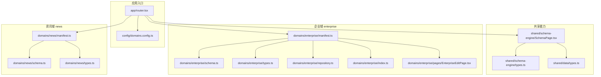
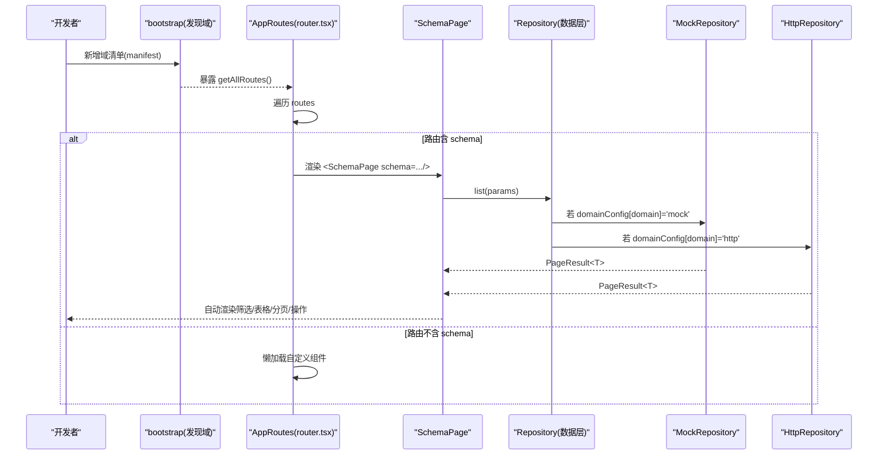
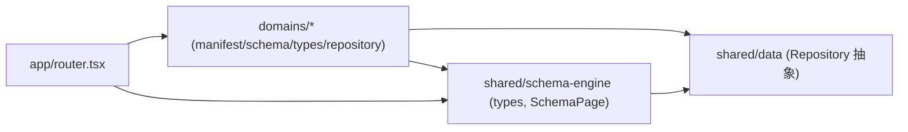

# 新业务域开发

<cite>
**本文引用的文件**
- [domains.config.ts](file://hj-admin/src/config/domains.config.ts)
- [router.tsx](file://hj-admin/src/app/router.tsx)
- [types.ts（Schema 引擎）](file://hj-admin/src/shared/schema-engine/types.ts)
- [SchemaPage.tsx](file://hj-admin/src/shared/schema-engine/SchemaPage.tsx)
- [types.ts（数据层抽象）](file://hj-admin/src/shared/data/types.ts)
- [manifest.ts（企业域）](file://hj-admin/src/domains/enterprise/manifest.ts)
- [schema.ts（企业域）](file://hj-admin/src/domains/enterprise/schema.ts)
- [types.ts（企业域）](file://hj-admin/src/domains/enterprise/types.ts)
- [repository.ts（企业域）](file://hj-admin/src/domains/enterprise/repository.ts)
- [index.ts（企业域）](file://hj-admin/src/domains/enterprise/index.ts)
- [EnterpriseEditPage.tsx](file://hj-admin/src/domains/enterprise/pages/EnterpriseEditPage.tsx)
- [manifest.ts（资讯域）](file://hj-admin/src/domains/news/manifest.ts)
- [schema.ts（资讯域）](file://hj-admin/src/domains/news/schema.ts)
- [types.ts（资讯域）](file://hj-admin/src/domains/news/types.ts)
</cite>

## 目录
1. [简介](#简介)
2. [项目结构](#项目结构)
3. [核心组件](#核心组件)
4. [架构总览](#架构总览)
5. [详细组件分析](#详细组件分析)
6. [依赖分析](#依赖分析)
7. [性能考虑](#性能考虑)
8. [故障排查指南](#故障排查指南)
9. [结论](#结论)
10. [附录：从零创建新业务域的完整步骤](#附录从零创建新业务域的完整步骤)

## 简介
本指南面向新开发者，提供“从零开始创建一个完整业务域模块”的端到端说明。内容涵盖：
- 目录结构与命名规范
- 清单 manifest 配置与必填字段
- Schema 页面声明式定义
- 类型定义规范
- 数据源集成（Mock/HTTP）
- 领域注册机制、路由自动生成、菜单配置
- 最佳实践与常见问题解决方案

目标是让开发者通过“写配置 + 少量自定义组件”的方式快速落地一个可维护、可扩展的业务域。

## 项目结构
本项目采用“按域组织”的结构，每个业务域位于 src/domains/<domain>/ 下，包含清单、Schema、类型、仓库绑定等文件；共享能力集中在 shared 目录；应用启动与路由在 app 目录中完成。

图表来源
- [router.tsx:1-58](file://hj-admin/src/app/router.tsx#L1-L58)
- [domains.config.ts:1-18](file://hj-admin/src/config/domains.config.ts#L1-L18)
- [types.ts（Schema 引擎）:1-216](file://hj-admin/src/shared/schema-engine/types.ts#L1-L216)
- [SchemaPage.tsx:1-226](file://hj-admin/src/shared/schema-engine/SchemaPage.tsx#L1-L226)
- [manifest.ts（企业域）:1-20](file://hj-admin/src/domains/enterprise/manifest.ts#L1-L20)
- [schema.ts（企业域）:1-64](file://hj-admin/src/domains/enterprise/schema.ts#L1-L64)
- [types.ts（企业域）:1-50](file://hj-admin/src/domains/enterprise/types.ts#L1-L50)
- [repository.ts（企业域）:1-6](file://hj-admin/src/domains/enterprise/repository.ts#L1-L6)
- [index.ts（企业域）:1-3](file://hj-admin/src/domains/enterprise/index.ts#L1-L3)
- [EnterpriseEditPage.tsx:1-117](file://hj-admin/src/domains/enterprise/pages/EnterpriseEditPage.tsx#L1-L117)
- [manifest.ts（资讯域）:1-42](file://hj-admin/src/domains/news/manifest.ts#L1-L42)
- [schema.ts（资讯域）:1-123](file://hj-admin/src/domains/news/schema.ts#L1-L123)
- [types.ts（资讯域）:1-50](file://hj-admin/src/domains/news/types.ts#L1-L50)

章节来源
- [router.tsx:1-58](file://hj-admin/src/app/router.tsx#L1-L58)
- [domains.config.ts:1-18](file://hj-admin/src/config/domains.config.ts#L1-L18)

## 核心组件
- 清单 Manifest：描述域的名称、图标、菜单分组、排序、路由集合等，是“域的身份证”。
- Schema 页面：以声明式方式定义筛选栏、表格列、分页、行操作、Tab 分组等，驱动通用列表页渲染器自动构建界面。
- 类型定义：为实体与枚举提供强类型约束，贯穿 Schema 与页面逻辑。
- 数据源集成：通过 Repository 抽象统一 list/get/create/update/delete 契约，支持 mock/http 两种模式，由域配置集中切换。
- 路由生成：从所有域的清单聚合路由，有 schema 的走 SchemaPage 自动渲染，无 schema 的懒加载自定义组件。
- 菜单与导航：清单中的 menuGroup、label、icon、order 等控制侧边菜单展示与顺序。

章节来源
- [types.ts（Schema 引擎）:176-208](file://hj-admin/src/shared/schema-engine/types.ts#L176-L208)
- [types.ts（Schema 引擎）:132-174](file://hj-admin/src/shared/schema-engine/types.ts#L132-L174)
- [types.ts（数据层抽象）:20-27](file://hj-admin/src/shared/data/types.ts#L20-L27)
- [router.tsx:25-57](file://hj-admin/src/app/router.tsx#L25-L57)
- [SchemaPage.tsx:76-223](file://hj-admin/src/shared/schema-engine/SchemaPage.tsx#L76-L223)

## 架构总览
下图展示了“清单 → 路由 → SchemaPage → 数据层”的整体调用链与数据流。

图表来源
- [router.tsx:25-57](file://hj-admin/src/app/router.tsx#L25-L57)
- [SchemaPage.tsx:76-223](file://hj-admin/src/shared/schema-engine/SchemaPage.tsx#L76-L223)
- [types.ts（数据层抽象）:20-27](file://hj-admin/src/shared/data/types.ts#L20-L27)
- [domains.config.ts:1-18](file://hj-admin/src/config/domains.config.ts#L1-L18)

## 详细组件分析

### 清单 Manifest（域注册与菜单）
- 作用：声明域元信息、菜单分组、排序、是否可折叠、是否显示小圆点，以及该域下的路由集合。
- 关键字段：
  - name：域唯一名，用于数据源配置与 entity 绑定
  - label：菜单显示名
  - icon：菜单图标
  - menuGroup：所属菜单分组
  - order：排序权重（越小越靠前）
  - collapsible/dot：菜单交互样式
  - routes：路由数组，path、label、schema/component/hideInMenu 等
- 示例参考：
  - 企业域清单：[manifest.ts（企业域）:1-20](file://hj-admin/src/domains/enterprise/manifest.ts#L1-L20)
  - 资讯域清单：[manifest.ts（资讯域）:1-42](file://hj-admin/src/domains/news/manifest.ts#L1-L42)

章节来源
- [manifest.ts（企业域）:1-20](file://hj-admin/src/domains/enterprise/manifest.ts#L1-L20)
- [manifest.ts（资讯域）:1-42](file://hj-admin/src/domains/news/manifest.ts#L1-L42)
- [types.ts（Schema 引擎）:176-208](file://hj-admin/src/shared/schema-engine/types.ts#L176-L208)

### Schema 页面（声明式列表页）
- 作用：用配置代替手写 JSX，自动渲染筛选栏、Tab、表格、分页、行操作、批量操作、弹窗等。
- 关键结构：
  - id/title/description/entity：页面标识与数据实体绑定
  - filters：筛选字段定义（select/input/dateRange 等）
  - columns：表格列定义（field/title/render/renderProps/sorter 等）
  - rowKey/pagination：行主键与分页配置
  - rowActions/batchActions/toolbarActions：行/批/工具栏操作
  - modals/tabs/quickFilters：弹窗/分组/快捷筛选
- 示例参考：
  - 企业域待处理池与已确认企业：[schema.ts（企业域）:1-64](file://hj-admin/src/domains/enterprise/schema.ts#L1-L64)
  - 资讯域三张表：[schema.ts（资讯域）:1-123](file://hj-admin/src/domains/news/schema.ts#L1-L123)
- 渲染实现：
  - 通用渲染器：[SchemaPage.tsx:76-223](file://hj-admin/src/shared/schema-engine/SchemaPage.tsx#L76-L223)
  - 类型定义：[types.ts（Schema 引擎）:132-174](file://hj-admin/src/shared/schema-engine/types.ts#L132-L174)

章节来源
- [schema.ts（企业域）:1-64](file://hj-admin/src/domains/enterprise/schema.ts#L1-L64)
- [schema.ts（资讯域）:1-123](file://hj-admin/src/domains/news/schema.ts#L1-L123)
- [SchemaPage.tsx:76-223](file://hj-admin/src/shared/schema-engine/SchemaPage.tsx#L76-L223)
- [types.ts（Schema 引擎）:132-174](file://hj-admin/src/shared/schema-engine/types.ts#L132-L174)

### 类型定义规范
- 建议将领域内实体与枚举拆分为独立 types.ts，供 schema 与页面引用，保证类型安全与一致性。
- 示例参考：
  - 企业域类型：[types.ts（企业域）:1-50](file://hj-admin/src/domains/enterprise/types.ts#L1-L50)
  - 资讯域类型：[types.ts（资讯域）:1-50](file://hj-admin/src/domains/news/types.ts#L1-L50)

章节来源
- [types.ts（企业域）:1-50](file://hj-admin/src/domains/enterprise/types.ts#L1-L50)
- [types.ts（资讯域）:1-50](file://hj-admin/src/domains/news/types.ts#L1-L50)

### 数据源集成（Repository 与域配置）
- 数据层抽象：
  - Repository<T> 接口统一 list/get/create/update/delete 契约
  - QueryParams/PageResult 定义查询参数与分页结果
- 域配置：
  - domains.config.ts 中按域名映射到 'mock' 或 'http'
  - 切换时只需修改此处，Schema 与页面代码零改动
- 示例参考：
  - 数据层类型：[types.ts（数据层抽象）:1-36](file://hj-admin/src/shared/data/types.ts#L1-L36)
  - 企业域仓库绑定（注册 mock 数据）：[repository.ts（企业域）:1-6](file://hj-admin/src/domains/enterprise/repository.ts#L1-L6)
  - 域配置：[domains.config.ts:1-18](file://hj-admin/src/config/domains.config.ts#L1-L18)

章节来源
- [types.ts（数据层抽象）:1-36](file://hj-admin/src/shared/data/types.ts#L1-L36)
- [repository.ts（企业域）:1-6](file://hj-admin/src/domains/enterprise/repository.ts#L1-L6)
- [domains.config.ts:1-18](file://hj-admin/src/config/domains.config.ts#L1-L18)

### 路由自动生成与菜单
- 路由生成：
  - AppRoutes 从 bootstrap 获取所有域的路由，有 schema 的走 SchemaPage，无 schema 的懒加载自定义组件
- 菜单与导航：
  - 清单中的 menuGroup/label/icon/order/collapsible/dot 控制菜单展示与行为
- 示例参考：
  - 路由生成：[router.tsx:25-57](file://hj-admin/src/app/router.tsx#L25-L57)
  - 企业域清单（含路由与菜单项）：[manifest.ts（企业域）:1-20](file://hj-admin/src/domains/enterprise/manifest.ts#L1-L20)
  - 资讯域清单（含路由与菜单项）：[manifest.ts（资讯域）:1-42](file://hj-admin/src/domains/news/manifest.ts#L1-L42)

章节来源
- [router.tsx:25-57](file://hj-admin/src/app/router.tsx#L25-L57)
- [manifest.ts（企业域）:1-20](file://hj-admin/src/domains/enterprise/manifest.ts#L1-L20)
- [manifest.ts（资讯域）:1-42](file://hj-admin/src/domains/news/manifest.ts#L1-L42)

### 自定义页面组件
- 当需要复杂交互或特殊 UI 时，可在清单路由中通过 component 懒加载自定义组件。
- 示例参考：
  - 企业编辑页（自定义组件）：[EnterpriseEditPage.tsx:1-117](file://hj-admin/src/domains/enterprise/pages/EnterpriseEditPage.tsx#L1-L117)

章节来源
- [EnterpriseEditPage.tsx:1-117](file://hj-admin/src/domains/enterprise/pages/EnterpriseEditPage.tsx#L1-L117)

## 依赖分析
- 低耦合高内聚：
  - 每个域自包含 manifest/schema/types/repository，职责清晰
  - 共享能力集中在 shared 目录，避免重复实现
- 外部依赖：
  - React Router 负责路由分发
  - Ant Design 提供 UI 组件
  - 数据层通过 Repository 抽象屏蔽后端差异
- 潜在风险：
  - 清单与 Schema 需保持字段一致，否则运行时可能报错
  - 大量列渲染器与复杂 filter 会影响首屏性能，需按需优化

图表来源
- [router.tsx:25-57](file://hj-admin/src/app/router.tsx#L25-L57)
- [types.ts（Schema 引擎）:132-174](file://hj-admin/src/shared/schema-engine/types.ts#L132-L174)
- [SchemaPage.tsx:76-223](file://hj-admin/src/shared/schema-engine/SchemaPage.tsx#L76-L223)
- [types.ts（数据层抽象）:20-27](file://hj-admin/src/shared/data/types.ts#L20-L27)

## 性能考虑
- 列表页默认分页，合理设置 pageSize 与 showTotal，避免一次性加载过多数据
- 使用 render 字符串渲染器减少自定义函数开销，必要时再扩展
- 对复杂筛选与 Tab 分组进行服务端过滤与分页，降低前端计算压力
- 懒加载自定义组件，减少首屏体积
- 列宽与 scrollX 合理配置，避免不必要的重排

## 故障排查指南
- 路由未生效
  - 检查清单中 path 是否唯一且未被覆盖
  - 确认清单已被 bootstrap 发现并导出
- 页面空白或报错
  - 核对 Schema 的 entity 是否与数据层注册名一致
  - 检查列 field 是否在类型定义中存在
- 数据不更新
  - 确认 repository 是否正确注册 mock 数据或 http 请求
  - 检查 domains.config.ts 中对应域的数据源模式
- 菜单不显示
  - 检查清单的 menuGroup/label/icon/order 是否配置正确
  - 确认 hideInMenu 未误设为 true

章节来源
- [router.tsx:25-57](file://hj-admin/src/app/router.tsx#L25-L57)
- [domains.config.ts:1-18](file://hj-admin/src/config/domains.config.ts#L1-L18)
- [repository.ts（企业域）:1-6](file://hj-admin/src/domains/enterprise/repository.ts#L1-L6)

## 结论
通过“清单 + Schema + 类型 + Repository”的组合，新业务域可以快速落地并保持良好可维护性。配合自动路由与菜单生成，开发者可将精力聚焦于业务逻辑与用户体验，而非样板代码。

## 附录：从零创建新业务域的完整步骤
- 新建域目录
  - 在 src/domains 下创建新域文件夹，如 myDomain
- 编写类型定义
  - 新建 types.ts，定义实体与枚举，供后续引用
- 编写清单 manifest
  - 新建 manifest.ts，填写 name/label/icon/menuGroup/order/routes 等必填字段
  - 在 routes 中声明路径、标签、schema 或自定义组件
- 编写 Schema 页面
  - 新建 schema.ts，定义 PageSchema，包括 filters/columns/pagination/rowActions 等
  - 如需复杂页面，可在清单中通过 component 懒加载自定义组件
- 集成数据源
  - 新建 repository.ts，注册 mock 数据或对接 HTTP 实现
  - 在 domains.config.ts 中将新域映射到 'mock' 或 'http'
- 导出与注册
  - 在 index.ts 中导出清单与类型，确保被 bootstrap 发现
- 验证与调试
  - 启动应用，检查菜单与路由是否正常
  - 打开页面，验证筛选、表格、分页、行操作是否符合预期
  - 根据问题定位清单、Schema、类型或数据源配置

章节来源
- [manifest.ts（企业域）:1-20](file://hj-admin/src/domains/enterprise/manifest.ts#L1-L20)
- [schema.ts（企业域）:1-64](file://hj-admin/src/domains/enterprise/schema.ts#L1-L64)
- [types.ts（企业域）:1-50](file://hj-admin/src/domains/enterprise/types.ts#L1-L50)
- [repository.ts（企业域）:1-6](file://hj-admin/src/domains/enterprise/repository.ts#L1-L6)
- [index.ts（企业域）:1-3](file://hj-admin/src/domains/enterprise/index.ts#L1-L3)
- [domains.config.ts:1-18](file://hj-admin/src/config/domains.config.ts#L1-L18)