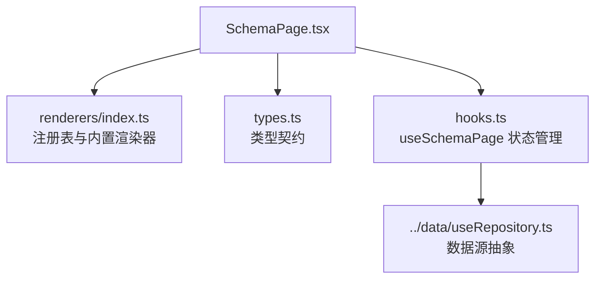
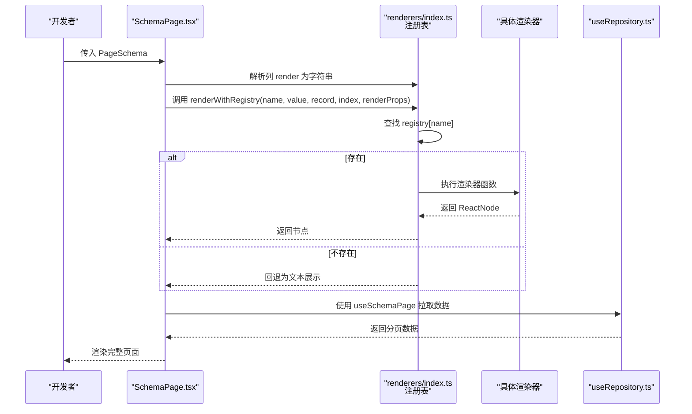
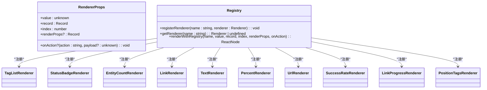
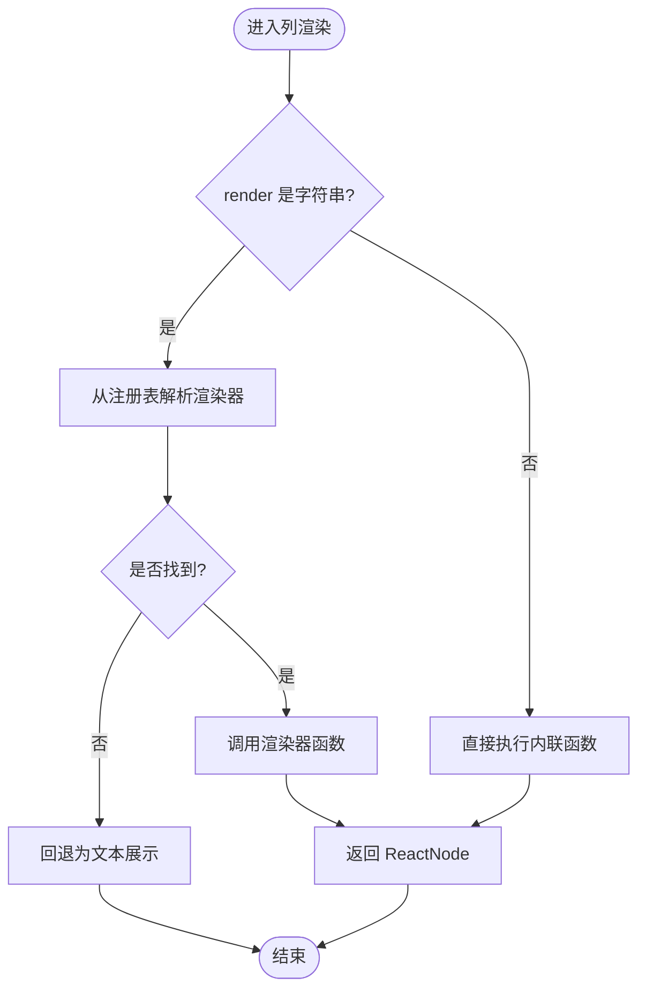
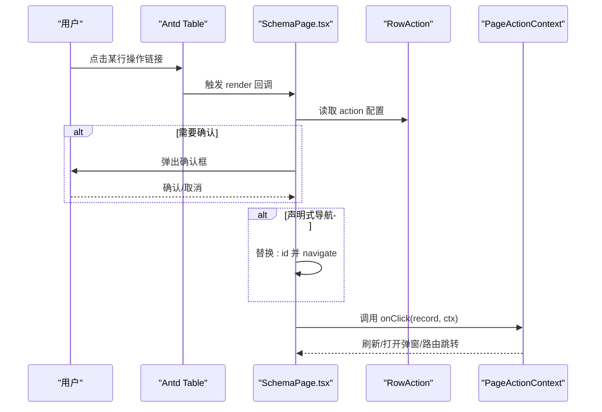
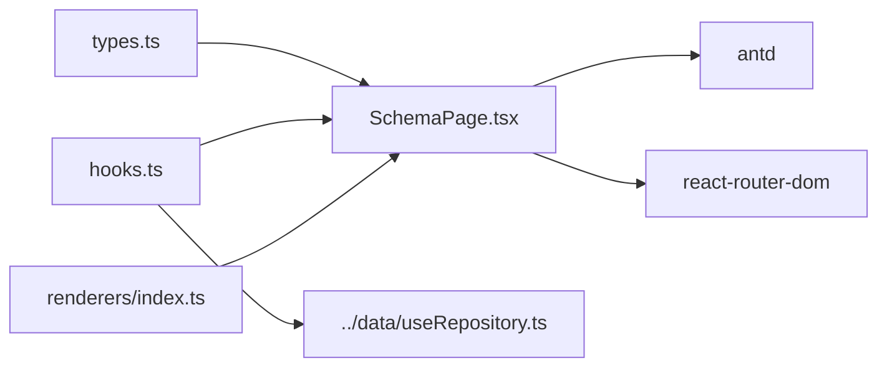

# 自定义渲染器开发

<cite>
**本文引用的文件列表**
- [renderers/index.ts](file://hj-admin/src/shared/schema-engine/renderers/index.ts)
- [types.ts](file://hj-admin/src/shared/schema-engine/types.ts)
- [SchemaPage.tsx](file://hj-admin/src/shared/schema-engine/SchemaPage.tsx)
- [hooks.ts](file://hj-admin/src/shared/schema-engine/hooks.ts)
</cite>

## 目录
1. [简介](#简介)
2. [项目结构](#项目结构)
3. [核心组件](#核心组件)
4. [架构总览](#架构总览)
5. [详细组件分析](#详细组件分析)
6. [依赖关系分析](#依赖关系分析)
7. [性能考虑](#性能考虑)
8. [故障排查指南](#故障排查指南)
9. [结论](#结论)
10. [附录](#附录)

## 简介
本指南面向需要在现有 Schema 驱动引擎中扩展“自定义渲染器”的开发者。你将了解：
- 渲染器接口规范、生命周期与 Props 定义
- 渲染器注册机制与调用流程
- 多种渲染器类型实现示例（表格列、表单字段、操作按钮等）
- 调试技巧、性能优化建议与错误处理策略
- 如何与现有组件库集成，并复用已有能力

## 项目结构
本项目采用“配置驱动 + 渲染器注册表”的方式组织页面渲染逻辑。核心位于 shared/schema-engine 目录：
- types.ts：定义 PageSchema、ColumnDef、RowAction、FormSchema 等类型契约
- renderers/index.ts：提供渲染器注册表、内置渲染器与统一调用入口
- SchemaPage.tsx：通用列表页渲染器，根据 PageSchema 自动渲染筛选栏、Tab、表格、分页与操作区
- hooks.ts：封装数据加载、筛选、分页、Tab 切换等状态管理

图表来源
- [SchemaPage.tsx:1-226](file://hj-admin/src/shared/schema-engine/SchemaPage.tsx#L1-L226)
- [renderers/index.ts:1-163](file://hj-admin/src/shared/schema-engine/renderers/index.ts#L1-L163)
- [types.ts:1-216](file://hj-admin/src/shared/schema-engine/types.ts#L1-L216)
- [hooks.ts:1-106](file://hj-admin/src/shared/schema-engine/hooks.ts#L1-L106)

章节来源
- [SchemaPage.tsx:1-226](file://hj-admin/src/shared/schema-engine/SchemaPage.tsx#L1-L226)
- [types.ts:1-216](file://hj-admin/src/shared/schema-engine/types.ts#L1-L216)
- [renderers/index.ts:1-163](file://hj-admin/src/shared/schema-engine/renderers/index.ts#L1-L163)
- [hooks.ts:1-106](file://hj-admin/src/shared/schema-engine/hooks.ts#L1-L106)

## 核心组件
- 渲染器接口与注册表
  - RendererProps：包含 value、record、index、renderProps、onAction
  - Renderer：函数签名 (props: RendererProps) => ReactNode
  - registerRenderer(name, renderer)：将命名渲染器加入全局注册表
  - getRenderer(name)：按名称获取渲染器
  - renderWithRegistry(...)：查找并执行渲染器，未找到时回退为文本展示
- 表格列渲染
  - ColumnDef.render 支持字符串引用或函数
  - 当为字符串时，由 SchemaPage 通过 renderWithRegistry 调用对应渲染器
- 行操作与上下文
  - RowAction 支持条件显示、导航、确认提示与回调
  - PageActionContext 提供 refresh、navigate、showModal 等能力

章节来源
- [renderers/index.ts:9-46](file://hj-admin/src/shared/schema-engine/renderers/index.ts#L9-L46)
- [types.ts:27-56](file://hj-admin/src/shared/schema-engine/types.ts#L27-L56)
- [types.ts:132-174](file://hj-admin/src/shared/schema-engine/types.ts#L132-L174)
- [SchemaPage.tsx:89-142](file://hj-admin/src/shared/schema-engine/SchemaPage.tsx#L89-L142)

## 架构总览
下图展示了从 Schema 到最终 UI 的关键路径，以及渲染器的注册与调用过程。

图表来源
- [SchemaPage.tsx:89-110](file://hj-admin/src/shared/schema-engine/SchemaPage.tsx#L89-L110)
- [renderers/index.ts:31-46](file://hj-admin/src/shared/schema-engine/renderers/index.ts#L31-L46)
- [hooks.ts:20-57](file://hj-admin/src/shared/schema-engine/hooks.ts#L20-L57)

## 详细组件分析

### 渲染器接口与注册机制
- 接口规范
  - RendererProps.value：当前单元格值
  - RendererProps.record：整行记录
  - RendererProps.index：行索引
  - RendererProps.renderProps：列定义中传递的额外参数
  - RendererProps.onAction：用于触发上层动作（如跳转、弹窗刷新）
- 注册与获取
  - registerRenderer：在模块加载期完成注册，保持可序列化（AI 友好）
  - getRenderer：按需查询
  - renderWithRegistry：统一入口，缺失时降级为文本
- 内置渲染器示例
  - tag-list、status-badge、entity-count、link、date-or-dash、text、color-tag、percent、url、success-rate、link-progress、position-tags

图表来源
- [renderers/index.ts:9-46](file://hj-admin/src/shared/schema-engine/renderers/index.ts#L9-L46)
- [renderers/index.ts:50-163](file://hj-admin/src/shared/schema-engine/renderers/index.ts#L50-L163)

章节来源
- [renderers/index.ts:9-46](file://hj-admin/src/shared/schema-engine/renderers/index.ts#L9-L46)
- [renderers/index.ts:50-163](file://hj-admin/src/shared/schema-engine/renderers/index.ts#L50-L163)

### 表格列渲染流程
- ColumnDef.render 支持两种形式：
  - 字符串：引用注册表中的渲染器名
  - 函数：直接实现渲染逻辑
- 当为字符串时，SchemaPage 会将其转换为 Antd Table 的 render 回调，并在其中调用 renderWithRegistry

图表来源
- [SchemaPage.tsx:89-110](file://hj-admin/src/shared/schema-engine/SchemaPage.tsx#L89-L110)
- [renderers/index.ts:31-46](file://hj-admin/src/shared/schema-engine/renderers/index.ts#L31-L46)

章节来源
- [SchemaPage.tsx:89-110](file://hj-admin/src/shared/schema-engine/SchemaPage.tsx#L89-L110)
- [renderers/index.ts:31-46](file://hj-admin/src/shared/schema-engine/renderers/index.ts#L31-L46)

### 行操作与上下文注入
- 行操作列由 SchemaPage 动态生成，支持：
  - visible 条件显示
  - confirm 确认提示
  - navigateTo 声明式导航（替换 :id）
  - onClick 回调接收 record 与 PageActionContext
- PageActionContext 提供 refresh、navigate、showModal 等方法，便于在渲染器或操作中触发页面级行为

图表来源
- [SchemaPage.tsx:112-142](file://hj-admin/src/shared/schema-engine/SchemaPage.tsx#L112-L142)
- [types.ts:44-56](file://hj-admin/src/shared/schema-engine/types.ts#L44-L56)
- [types.ts:210-216](file://hj-admin/src/shared/schema-engine/types.ts#L210-L216)

章节来源
- [SchemaPage.tsx:112-142](file://hj-admin/src/shared/schema-engine/SchemaPage.tsx#L112-L142)
- [types.ts:44-56](file://hj-admin/src/shared/schema-engine/types.ts#L44-L56)
- [types.ts:210-216](file://hj-admin/src/shared/schema-engine/types.ts#L210-L216)

### 表单字段渲染器（概念性说明）
- 当前仓库未提供基于注册表的表单字段渲染器；表单字段由 FilterFieldRenderer 以 switch 分支方式渲染
- 若需扩展表单字段渲染器，建议：
  - 新增 FormFieldType 枚举项
  - 在 FilterFieldRenderer 中增加分支或使用注册表模式
  - 在 FormFieldDef 中补充联动、选项等属性
- 参考位置：FilterFieldRenderer 的类型与渲染分支

章节来源
- [types.ts:106-129](file://hj-admin/src/shared/schema-engine/types.ts#L106-L129)
- [SchemaPage.tsx:35-73](file://hj-admin/src/shared/schema-engine/SchemaPage.tsx#L35-L73)

### 操作按钮渲染器（概念性说明）
- 当前仓库未提供独立的“操作按钮渲染器”，行操作由 SchemaPage 直接渲染
- 如需将操作按钮抽象为可复用渲染器，建议：
  - 在 ColumnDef 中新增 actions 字段，支持数组形式的操作定义
  - 在 SchemaPage 中遍历 actions 并渲染为 Space 包裹的按钮集合
  - 将可见性、确认、导航、回调等逻辑下沉至渲染器

[本节为概念性设计，不直接分析具体文件]

## 依赖关系分析
- 组件耦合
  - SchemaPage 依赖 types.ts 的契约、hooks.ts 的状态管理、renderers/index.ts 的注册表
  - hooks.ts 依赖 ../data/useRepository.ts 的数据访问抽象
- 外部依赖
  - antd：UI 组件（Table、Select、Input、Button、Space、Badge、Tabs、Modal、DatePicker）
  - react-router-dom：Link、useNavigate
- 潜在循环依赖
  - 当前未见循环依赖；注册表为单向导出，SchemaPage 仅消费注册表

图表来源
- [SchemaPage.tsx:1-226](file://hj-admin/src/shared/schema-engine/SchemaPage.tsx#L1-L226)
- [hooks.ts:1-106](file://hj-admin/src/shared/schema-engine/hooks.ts#L1-L106)
- [renderers/index.ts:1-163](file://hj-admin/src/shared/schema-engine/renderers/index.ts#L1-L163)
- [types.ts:1-216](file://hj-admin/src/shared/schema-engine/types.ts#L1-L216)

章节来源
- [SchemaPage.tsx:1-226](file://hj-admin/src/shared/schema-engine/SchemaPage.tsx#L1-L226)
- [hooks.ts:1-106](file://hj-admin/src/shared/schema-engine/hooks.ts#L1-L106)
- [renderers/index.ts:1-163](file://hj-admin/src/shared/schema-engine/renderers/index.ts#L1-L163)
- [types.ts:1-216](file://hj-admin/src/shared/schema-engine/types.ts#L1-L216)

## 性能考虑
- 避免重复计算
  - 使用 useMemo 缓存 columns 与 actionColumn，减少重渲染开销
- 控制渲染粒度
  - 在渲染器内部对长列表进行截断或虚拟滚动（例如 URL 渲染器已做长度截断）
- 事件委托与稳定回调
  - 在渲染器中尽量使用稳定回调，避免每次创建新函数导致子组件重渲染
- 数据层优化
  - 合理设置 pageSize 与 showSizeChanger，避免一次性加载过多数据
- 样式与布局
  - 合理使用固定列与横向滚动，提升大数据量下的交互体验

章节来源
- [SchemaPage.tsx:89-142](file://hj-admin/src/shared/schema-engine/SchemaPage.tsx#L89-L142)
- [renderers/index.ts:125-133](file://hj-admin/src/shared/schema-engine/renderers/index.ts#L125-L133)

## 故障排查指南
- 渲染器未找到
  - 现象：控制台输出警告，单元格回退为文本
  - 排查：检查 registerRenderer 是否被调用、name 是否与 schema 一致
- 值类型异常
  - 现象：渲染器期望数组/对象但收到字符串或空值
  - 排查：在渲染器中对 value 做类型守卫与默认值处理
- 导航失败
  - 现象：navigateTo 未生效
  - 排查：确认 :id 占位符是否存在于 record.id，且路由配置正确
- 数据加载失败
  - 现象：loading 卡住或无数据
  - 排查：查看 useSchemaPage 的错误日志，确认 Repository 实现是否正确

章节来源
- [renderers/index.ts:31-46](file://hj-admin/src/shared/schema-engine/renderers/index.ts#L31-L46)
- [hooks.ts:36-57](file://hj-admin/src/shared/schema-engine/hooks.ts#L36-L57)
- [SchemaPage.tsx:124-131](file://hj-admin/src/shared/schema-engine/SchemaPage.tsx#L124-L131)

## 结论
通过统一的渲染器注册表与 Schema 驱动，本项目实现了“写配置即页面”的高效开发模式。借助 RendererProps 与 PageActionContext，渲染器既能专注展示，也能与页面级行为解耦协作。建议在业务扩展中优先复用内置渲染器，必要时通过 registerRenderer 新增专用渲染器，并保持 render 字段的字符串引用风格，以获得更好的可维护性与 AI 友好性。

## 附录

### 渲染器开发清单
- 定义渲染器函数，遵循 RendererProps 约定
- 在模块加载期调用 registerRenderer 完成注册
- 在 PageSchema.columns 中使用 render: 'renderer-name' 引用
- 通过 renderProps 传递列级配置
- 使用 onAction 触发页面级动作（可选）

章节来源
- [renderers/index.ts:21-46](file://hj-admin/src/shared/schema-engine/renderers/index.ts#L21-L46)
- [types.ts:27-41](file://hj-admin/src/shared/schema-engine/types.ts#L27-L41)
- [SchemaPage.tsx:89-110](file://hj-admin/src/shared/schema-engine/SchemaPage.tsx#L89-L110)