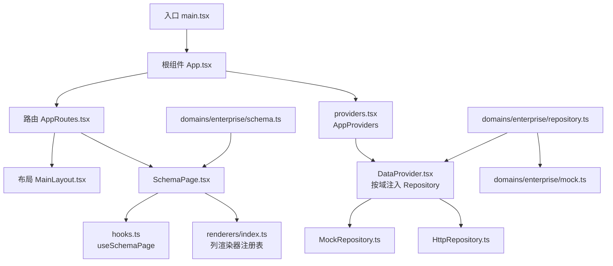
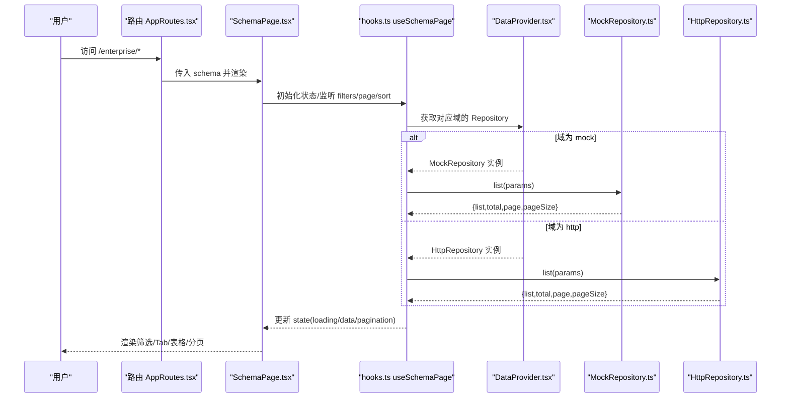
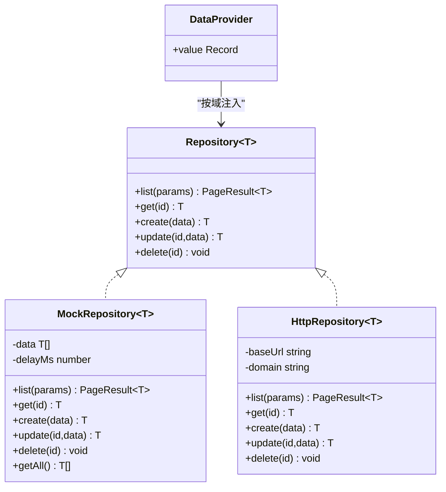
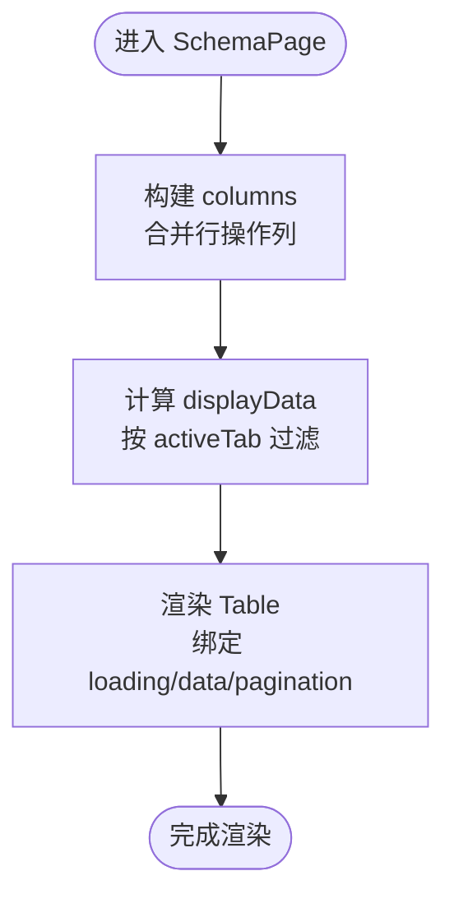
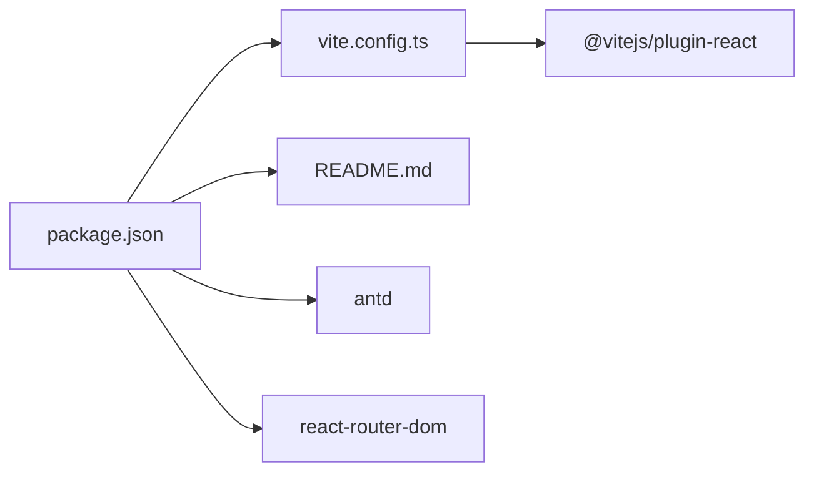

# 调试技巧和故障排除

<cite>
**本文引用的文件**
- [package.json](file://hj-admin/package.json)
- [vite.config.ts](file://hj-admin/vite.config.ts)
- [README.md](file://hj-admin/README.md)
- [src/main.tsx](file://hj-admin/src/main.tsx)
- [src/app/App.tsx](file://hj-admin/src/app/App.tsx)
- [src/app/providers.tsx](file://hj-admin/src/app/providers.tsx)
- [src/app/router.tsx](file://hj-admin/src/app/router.tsx)
- [src/shared/data/DataProvider.tsx](file://hj-admin/src/shared/data/DataProvider.tsx)
- [src/shared/data/types.ts](file://hj-admin/src/shared/data/types.ts)
- [src/shared/data/MockRepository.ts](file://hj-admin/src/shared/data/MockRepository.ts)
- [src/shared/data/HttpRepository.ts](file://hj-admin/src/shared/data/HttpRepository.ts)
- [src/domains/enterprise/repository.ts](file://hj-admin/src/domains/enterprise/repository.ts)
- [src/domains/enterprise/mock.ts](file://hj-admin/src/domains/enterprise/mock.ts)
- [src/domains/enterprise/schema.ts](file://hj-admin/src/domains/enterprise/schema.ts)
- [src/shared/schema-engine/hooks.ts](file://hj-admin/src/shared/schema-engine/hooks.ts)
- [src/shared/schema-engine/renderers/index.ts](file://hj-admin/src/shared/schema-engine/renderers/index.ts)
- [src/shared/schema-engine/SchemaPage.tsx](file://hj-admin/src/shared/schema-engine/SchemaPage.tsx)
</cite>

## 目录
1. [简介](#简介)
2. [项目结构](#项目结构)
3. [核心组件](#核心组件)
4. [架构总览](#架构总览)
5. [详细组件分析](#详细组件分析)
6. [依赖关系分析](#依赖关系分析)
7. [性能考虑](#性能考虑)
8. [故障排除指南](#故障排除指南)
9. [结论](#结论)
10. [附录](#附录)

## 简介
本指南面向开发与测试阶段，聚焦于在浏览器与本地开发环境中的调试技巧与问题定位方法。内容覆盖：
- 开发环境与工具链配置（Vite、ESLint、React 相关插件）
- 浏览器开发者工具使用要点（控制台、网络面板、性能面板、内存快照）
- React DevTools 安装与常用用法
- 数据层与 Schema 渲染流程的断点与日志策略
- 常见错误诊断与修复（Schema 解析错误、数据加载失败、组件渲染异常）
- 性能分析与优化建议（列表渲染、分页、筛选排序、懒加载）
- 日志记录策略、错误监控与告警思路
- 复杂问题的快速定位路径

## 项目结构
本项目采用“域驱动 + 配置化页面”的架构：通过 domain 下的 schema 定义页面行为，由通用 SchemaPage 自动渲染；数据访问通过 Repository 抽象，支持 Mock 与 HTTP 两种模式切换。

图表来源
- [src/main.tsx:1-11](file://hj-admin/src/main.tsx#L1-L11)
- [src/app/App.tsx:1-21](file://hj-admin/src/app/App.tsx#L1-L21)
- [src/app/router.tsx:1-58](file://hj-admin/src/app/router.tsx#L1-L58)
- [src/app/providers.tsx:1-14](file://hj-admin/src/app/providers.tsx#L1-L14)
- [src/shared/data/DataProvider.tsx:1-44](file://hj-admin/src/shared/data/DataProvider.tsx#L1-L44)
- [src/shared/data/MockRepository.ts:1-101](file://hj-admin/src/shared/data/MockRepository.ts#L1-L101)
- [src/shared/data/HttpRepository.ts:1-70](file://hj-admin/src/shared/data/HttpRepository.ts#L1-L70)
- [src/domains/enterprise/repository.ts:1-6](file://hj-admin/src/domains/enterprise/repository.ts#L1-L6)
- [src/domains/enterprise/mock.ts:1-24](file://hj-admin/src/domains/enterprise/mock.ts#L1-L24)
- [src/domains/enterprise/schema.ts:1-64](file://hj-admin/src/domains/enterprise/schema.ts#L1-L64)
- [src/shared/schema-engine/SchemaPage.tsx:1-226](file://hj-admin/src/shared/schema-engine/SchemaPage.tsx#L1-L226)

章节来源
- [package.json:1-35](file://hj-admin/package.json#L1-L35)
- [vite.config.ts:1-8](file://hj-admin/vite.config.ts#L1-L8)
- [README.md:1-74](file://hj-admin/README.md#L1-L74)
- [src/main.tsx:1-11](file://hj-admin/src/main.tsx#L1-L11)
- [src/app/App.tsx:1-21](file://hj-admin/src/app/App.tsx#L1-L21)
- [src/app/router.tsx:1-58](file://hj-admin/src/app/router.tsx#L1-L58)
- [src/app/providers.tsx:1-14](file://hj-admin/src/app/providers.tsx#L1-L14)
- [src/shared/data/DataProvider.tsx:1-44](file://hj-admin/src/shared/data/DataProvider.tsx#L1-L44)
- [src/shared/data/types.ts:1-36](file://hj-admin/src/shared/data/types.ts#L1-L36)
- [src/shared/data/MockRepository.ts:1-101](file://hj-admin/src/shared/data/MockRepository.ts#L1-L101)
- [src/shared/data/HttpRepository.ts:1-70](file://hj-admin/src/shared/data/HttpRepository.ts#L1-L70)
- [src/domains/enterprise/repository.ts:1-6](file://hj-admin/src/domains/enterprise/repository.ts#L1-L6)
- [src/domains/enterprise/mock.ts:1-24](file://hj-admin/src/domains/enterprise/mock.ts#L1-L24)
- [src/domains/enterprise/schema.ts:1-64](file://hj-admin/src/domains/enterprise/schema.ts#L1-L64)
- [src/shared/schema-engine/SchemaPage.tsx:1-226](file://hj-admin/src/shared/schema-engine/SchemaPage.tsx#L1-L226)

## 核心组件
- 应用启动与 Provider 组合
  - 入口挂载 StrictMode 与根组件，根组件负责组合 BrowserRouter、全局 Provider 与路由。
- 路由与懒加载
  - 路由根据域清单生成，带 schema 的路由走 SchemaPage，否则懒加载自定义组件。
- 数据上下文与仓库
  - DataProvider 按域注入 MockRepository 或 HttpRepository，统一对外提供 list/get/create/update/delete。
- Schema 引擎
  - SchemaPage 基于 PageSchema 自动渲染筛选栏、Tab、表格、分页与行操作；列渲染通过 renderers 注册表扩展。

章节来源
- [src/main.tsx:1-11](file://hj-admin/src/main.tsx#L1-L11)
- [src/app/App.tsx:1-21](file://hj-admin/src/app/App.tsx#L1-L21)
- [src/app/providers.tsx:1-14](file://hj-admin/src/app/providers.tsx#L1-L14)
- [src/app/router.tsx:1-58](file://hj-admin/src/app/router.tsx#L1-L58)
- [src/shared/data/DataProvider.tsx:1-44](file://hj-admin/src/shared/data/DataProvider.tsx#L1-L44)
- [src/shared/data/types.ts:1-36](file://hj-admin/src/shared/data/types.ts#L1-L36)
- [src/shared/data/MockRepository.ts:1-101](file://hj-admin/src/shared/data/MockRepository.ts#L1-L101)
- [src/shared/data/HttpRepository.ts:1-70](file://hj-admin/src/shared/data/HttpRepository.ts#L1-L70)
- [src/shared/schema-engine/SchemaPage.tsx:1-226](file://hj-admin/src/shared/schema-engine/SchemaPage.tsx#L1-L226)

## 架构总览
下图展示从路由到 Schema 渲染再到数据请求的关键调用链，便于在调试时快速定位断点。

图表来源
- [src/app/router.tsx:1-58](file://hj-admin/src/app/router.tsx#L1-L58)
- [src/shared/schema-engine/SchemaPage.tsx:1-226](file://hj-admin/src/shared/schema-engine/SchemaPage.tsx#L1-L226)
- [src/shared/schema-engine/hooks.ts](file://hj-admin/src/shared/schema-engine/hooks.ts)
- [src/shared/data/DataProvider.tsx:1-44](file://hj-admin/src/shared/data/DataProvider.tsx#L1-L44)
- [src/shared/data/MockRepository.ts:1-101](file://hj-admin/src/shared/data/MockRepository.ts#L1-L101)
- [src/shared/data/HttpRepository.ts:1-70](file://hj-admin/src/shared/data/HttpRepository.ts#L1-L70)

## 详细组件分析

### 数据层（Repository 抽象与实现）
- 类型契约
  - QueryParams/PageResult/Repository 定义了统一的查询参数、分页结果与 CRUD 接口。
- MockRepository
  - 内存过滤/排序/分页，模拟延迟，返回 Promise，适合前端联调与演示。
- HttpRepository
  - 基于 fetch 封装，拼接 URLSearchParams，统一错误处理与 JSON 解析。
- 数据源选择
  - DataProvider 根据 domainConfig 决定使用 Mock 还是 HTTP；企业域通过 registerMockData 注入初始数据。

图表来源
- [src/shared/data/types.ts:1-36](file://hj-admin/src/shared/data/types.ts#L1-L36)
- [src/shared/data/MockRepository.ts:1-101](file://hj-admin/src/shared/data/MockRepository.ts#L1-L101)
- [src/shared/data/HttpRepository.ts:1-70](file://hj-admin/src/shared/data/HttpRepository.ts#L1-L70)
- [src/shared/data/DataProvider.tsx:1-44](file://hj-admin/src/shared/data/DataProvider.tsx#L1-L44)

章节来源
- [src/shared/data/types.ts:1-36](file://hj-admin/src/shared/data/types.ts#L1-L36)
- [src/shared/data/MockRepository.ts:1-101](file://hj-admin/src/shared/data/MockRepository.ts#L1-L101)
- [src/shared/data/HttpRepository.ts:1-70](file://hj-admin/src/shared/data/HttpRepository.ts#L1-L70)
- [src/shared/data/DataProvider.tsx:1-44](file://hj-admin/src/shared/data/DataProvider.tsx#L1-L44)
- [src/domains/enterprise/repository.ts:1-6](file://hj-admin/src/domains/enterprise/repository.ts#L1-L6)
- [src/domains/enterprise/mock.ts:1-24](file://hj-admin/src/domains/enterprise/mock.ts#L1-L24)

### Schema 引擎（SchemaPage 与 hooks）
- SchemaPage
  - 将 PageSchema 映射为筛选栏、Tab、表格、分页与行操作；列渲染通过 renderers 注册表进行字符串渲染器或函数渲染。
- hooks.useSchemaPage
  - 管理 filters、page、sort、selectedRowKeys、loading、data、total 等状态，并在变化时触发数据刷新。
- 渲染流程
  - 列渲染优先使用注册表的内置渲染器（如 link、percent、status-badge、date-or-dash），也可传入自定义函数。

图表来源
- [src/shared/schema-engine/SchemaPage.tsx:1-226](file://hj-admin/src/shared/schema-engine/SchemaPage.tsx#L1-L226)
- [src/shared/schema-engine/hooks.ts](file://hj-admin/src/shared/schema-engine/hooks.ts)
- [src/shared/schema-engine/renderers/index.ts](file://hj-admin/src/shared/schema-engine/renderers/index.ts)

章节来源
- [src/shared/schema-engine/SchemaPage.tsx:1-226](file://hj-admin/src/shared/schema-engine/SchemaPage.tsx#L1-L226)
- [src/shared/schema-engine/hooks.ts](file://hj-admin/src/shared/schema-engine/hooks.ts)
- [src/shared/schema-engine/renderers/index.ts](file://hj-admin/src/shared/schema-engine/renderers/index.ts)

### 路由与懒加载
- 路由自动生成
  - 从 bootstrap 发现的所有域清单中生成路由；有 schema 的路由直接渲染 SchemaPage，无 schema 则懒加载自定义组件。
- 懒加载与 Suspense
  - 使用 lazy + Suspense 包裹自定义页面，提升首屏性能。

章节来源
- [src/app/router.tsx:1-58](file://hj-admin/src/app/router.tsx#L1-L58)

## 依赖关系分析
- 包管理与脚本
  - 使用 Vite 作为构建与开发服务器，React 19，Ant Design 6，react-router-dom 7。
- 插件与规则
  - README 提供了 ESLint 增强与 React 专用规则的扩展建议。

图表来源
- [package.json:1-35](file://hj-admin/package.json#L1-L35)
- [vite.config.ts:1-8](file://hj-admin/vite.config.ts#L1-L8)
- [README.md:1-74](file://hj-admin/README.md#L1-L74)

章节来源
- [package.json:1-35](file://hj-admin/package.json#L1-L35)
- [vite.config.ts:1-8](file://hj-admin/vite.config.ts#L1-L8)
- [README.md:1-74](file://hj-admin/README.md#L1-L74)

## 性能考虑
- 列表与分页
  - 合理设置 pageSize，避免一次性渲染过多 DOM；对大数据量可结合虚拟滚动（按需引入）。
- 筛选与排序
  - 客户端排序/筛选仅适用于小数据集；大数据应交由后端处理并通过 QueryParams 传递。
- 懒加载
  - 非首屏页面使用 lazy + Suspense，减少首屏体积。
- 列渲染
  - 优先使用内置渲染器；自定义渲染函数应避免重计算，必要时缓存或使用 useMemo。
- 网络请求
  - 使用 HttpRepository 统一拼接参数与错误处理；必要时增加重试与超时控制。

[本节为通用指导，不直接分析具体文件]

## 故障排除指南

### 开发环境与工具链
- 启动与预览
  - 使用 npm/yarn/pnpm 执行 dev/build/preview 脚本。
- ESLint 与类型检查
  - 参考 README 的建议启用类型感知规则与 React 专用规则，有助于提前发现潜在问题。
- Vite 插件
  - 当前使用官方 React 插件，如需开启 React Compiler 可按文档指引配置。

章节来源
- [package.json:1-35](file://hj-admin/package.json#L1-L35)
- [README.md:1-74](file://hj-admin/README.md#L1-L74)
- [vite.config.ts:1-8](file://hj-admin/vite.config.ts#L1-L8)

### 浏览器开发者工具使用要点
- 控制台
  - 查看运行时错误与警告；在关键位置添加 console.log/console.table 辅助排查。
- 网络面板
  - 观察请求 URL、参数、响应体与耗时；对跨域与鉴权问题进行初步定位。
- 性能面板
  - 录制页面交互，识别长任务与重排重绘热点；关注列表渲染与筛选触发的重渲染。
- 内存快照
  - 对比两次快照，排查内存泄漏与未释放引用。

[本节为通用指导，不直接分析具体文件]

### React DevTools 使用
- 安装与打开
  - 在浏览器扩展商店安装 React DevTools，打开后切换到 Components/Pipeline/Profiler 标签页。
- 常用技巧
  - 高亮组件更新、查看 props/state 变化、使用 Profiler 记录渲染耗时。
- 与 SchemaPage 结合
  - 在 SchemaPage 的列渲染处打断点，观察 record/value 是否符合预期。

[本节为通用指导，不直接分析具体文件]

### 数据加载失败的诊断
- 现象
  - 列表为空、分页总数异常、筛选无效、创建/更新/删除报错。
- 定位步骤
  - 确认 DataProvider 选择的模式（mock/http）是否正确；检查 domainConfig 与 registerMockData 是否生效。
  - 在 MockRepository.list 与 HttpRepository.request 处打断点，核对 params 与响应结构。
  - 若为 HTTP，检查 Network 面板的请求 URL、Query 参数、响应码与 JSON 结构是否与 PageResult 一致。
- 常见问题
  - 字段名不一致导致筛选/排序失效；后端返回结构与 PageResult 不匹配；跨域或鉴权失败。

章节来源
- [src/shared/data/DataProvider.tsx:1-44](file://hj-admin/src/shared/data/DataProvider.tsx#L1-L44)
- [src/shared/data/MockRepository.ts:1-101](file://hj-admin/src/shared/data/MockRepository.ts#L1-L101)
- [src/shared/data/HttpRepository.ts:1-70](file://hj-admin/src/shared/data/HttpRepository.ts#L1-L70)
- [src/domains/enterprise/repository.ts:1-6](file://hj-admin/src/domains/enterprise/repository.ts#L1-L6)
- [src/domains/enterprise/mock.ts:1-24](file://hj-admin/src/domains/enterprise/mock.ts#L1-L24)

### Schema 解析错误的诊断
- 现象
  - 页面空白、列缺失、Tab 不显示、行操作不可用、列渲染异常。
- 定位步骤
  - 检查 PageSchema 的必填字段（id/title/entity/columns/filters 等）是否完整。
  - 在 SchemaPage 构建 columns 与 actionColumn 处打断点，确认列定义与行操作可见性逻辑。
  - 校验列 render 值是否在 renderers 注册表中存在；不存在时使用自定义函数替代。
- 常见问题
  - field 与后端字段不一致；renderProps 传参错误；visible 条件误判导致按钮隐藏。

章节来源
- [src/shared/schema-engine/SchemaPage.tsx:1-226](file://hj-admin/src/shared/schema-engine/SchemaPage.tsx#L1-L226)
- [src/shared/schema-engine/renderers/index.ts](file://hj-admin/src/shared/schema-engine/renderers/index.ts)
- [src/domains/enterprise/schema.ts:1-64](file://hj-admin/src/domains/enterprise/schema.ts#L1-L64)

### 组件渲染问题的诊断
- 现象
  - 表格不更新、分页不生效、Tab 切换无效果、行点击无跳转。
- 定位步骤
  - 在 useSchemaPage 的状态更新处打断点，确认 filters/page/sort 变化是否触发刷新。
  - 检查 Table 的 rowKey、dataSource、pagination 绑定是否正确。
  - 行操作 navigateTo 中的 :id 替换逻辑是否拿到有效 id。
- 常见问题
  - 缺少 rowKey 导致行更新错乱；分页 current/pageSize 未受控；导航参数缺失。

章节来源
- [src/shared/schema-engine/SchemaPage.tsx:1-226](file://hj-admin/src/shared/schema-engine/SchemaPage.tsx#L1-L226)
- [src/shared/schema-engine/hooks.ts](file://hj-admin/src/shared/schema-engine/hooks.ts)

### 路由与懒加载问题
- 现象
  - 页面 404、懒加载卡住、Suspense 一直显示加载中。
- 定位步骤
  - 检查路由 path 与 schema 的 entity 是否匹配；确认 LazyPage 的 loader 是否能成功 import。
  - 在 router.tsx 的 Route 元素处打断点，验证 route.schema/route.component 是否存在。
- 常见问题
  - 路径大小写不一致；懒加载模块导出默认组件不正确；Suspense fallback 样式遮挡。

章节来源
- [src/app/router.tsx:1-58](file://hj-admin/src/app/router.tsx#L1-L58)

### 日志记录策略
- 前端日志
  - 在关键分支（网络请求、Schema 渲染、状态变更）输出结构化日志，包含时间戳、模块名、关键参数与结果摘要。
- 错误上报
  - 捕获全局错误与未处理 Promise 拒绝，上报至监控系统；附带堆栈、URL、用户信息与设备信息。
- 敏感信息脱敏
  - 避免在日志中输出密码、Token、身份证号等敏感字段。

[本节为通用指导，不直接分析具体文件]

### 错误监控与告警配置
- 指标建议
  - 页面加载时长、接口成功率、接口平均耗时、白屏率、JS 错误数。
- 告警阈值
  - 错误率突增、接口超时比例升高、首屏加载超过阈值时触发告警。
- 追踪链路
  - 为每次请求分配唯一 traceId，贯穿前端日志与后端日志，便于端到端定位。

[本节为通用指导，不直接分析具体文件]

### 快速定位复杂问题的路径
- 自上而下
  - 路由 → SchemaPage → hooks 状态 → Repository → 网络请求 → 响应结构。
- 自下而上
  - 网络面板异常 → HttpRepository.request 断点 → 上游调用方 → UI 表现。
- 典型场景
  - 筛选无效：检查 QueryParams.filters 键名与后端一致；SchemaPage 的 filter 名称与列字段一致。
  - 分页异常：确认 page/pageSize 与后端约定一致；MockRepository 的分片逻辑与后端对齐。
  - 列渲染异常：确认 render 值在 renderers 中存在；record 字段可用。

[本节为通用指导，不直接分析具体文件]

## 结论
通过合理的工具链配置、清晰的断点与日志策略，以及针对数据层与 Schema 引擎的针对性排查，可以高效定位并解决大多数开发与联调问题。建议在团队内沉淀常见问题的检查清单与自动化校验（如 Schema 字段校验、接口契约校验），进一步提升稳定性与交付效率。

[本节为总结性内容，不直接分析具体文件]

## 附录
- 常用命令
  - 开发：npm run dev
  - 构建：npm run build
  - 预览：npm run preview
  - 代码检查：npm run lint
- 关键配置文件
  - Vite 配置：vite.config.ts
  - 包依赖与脚本：package.json
  - 工程说明与扩展建议：README.md

章节来源
- [package.json:1-35](file://hj-admin/package.json#L1-L35)
- [vite.config.ts:1-8](file://hj-admin/vite.config.ts#L1-L8)
- [README.md:1-74](file://hj-admin/README.md#L1-L74)