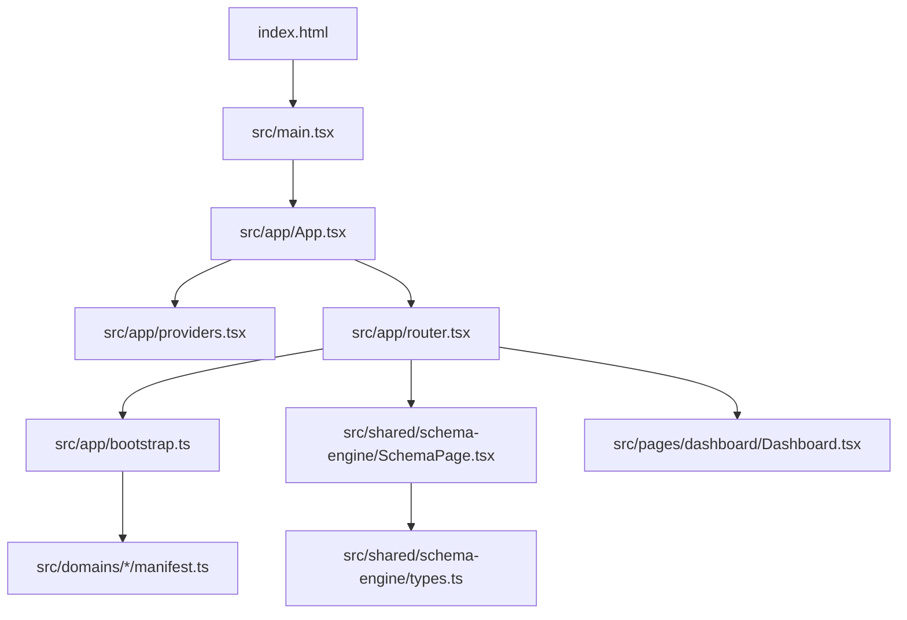
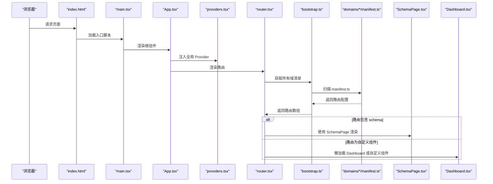
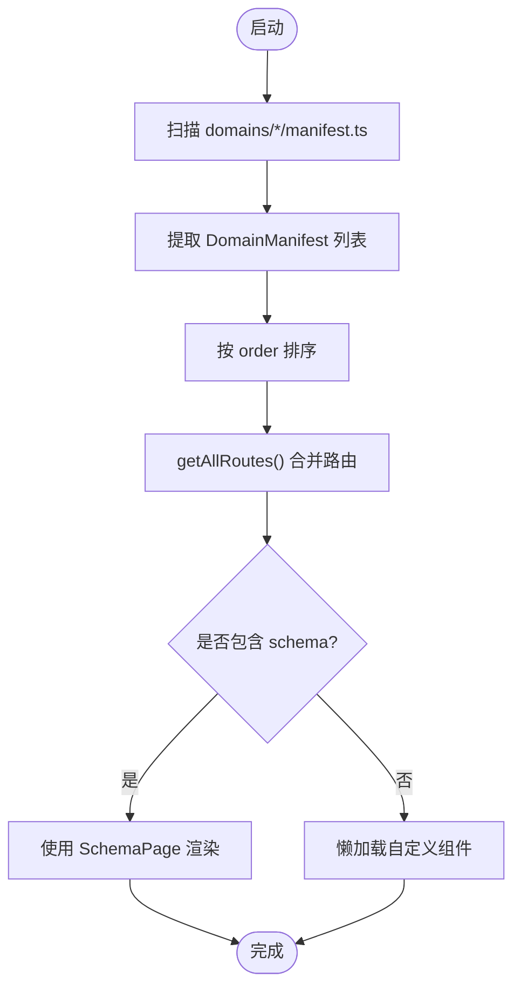
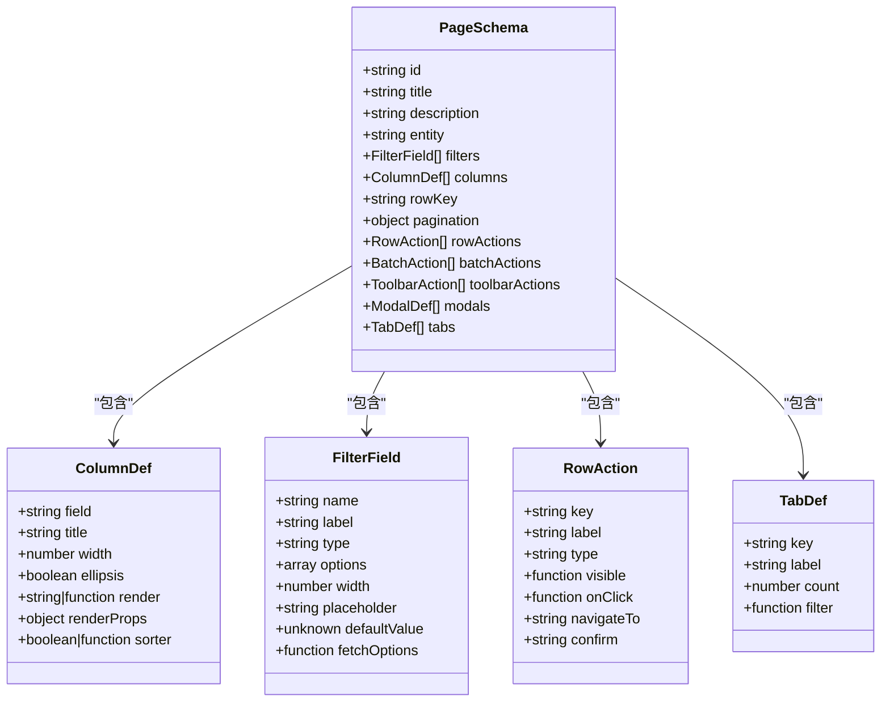
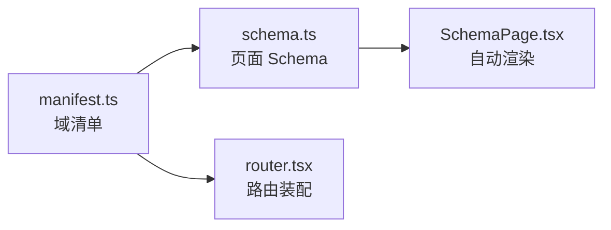
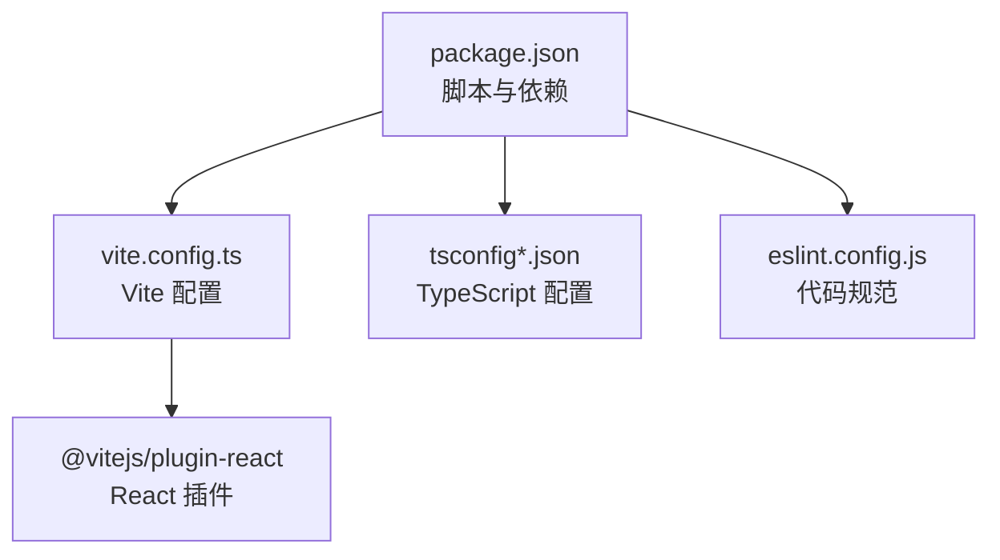

# 快速开始

<cite>
**本文引用的文件**   
- [package.json](file://hj-admin/package.json)
- [README.md](file://hj-admin/README.md)
- [vite.config.ts](file://hj-admin/vite.config.ts)
- [index.html](file://hj-admin/index.html)
- [main.tsx](file://hj-admin/src/main.tsx)
- [App.tsx](file://hj-admin/src/app/App.tsx)
- [providers.tsx](file://hj-admin/src/app/providers.tsx)
- [router.tsx](file://hj-admin/src/app/router.tsx)
- [bootstrap.ts](file://hj-admin/src/app/bootstrap.ts)
- [SchemaPage.tsx](file://hj-admin/src/shared/schema-engine/SchemaPage.tsx)
- [types.ts](file://hj-admin/src/shared/schema-engine/types.ts)
- [manifest.ts](file://hj-admin/src/domains/enterprise/manifest.ts)
- [schema.ts](file://hj-admin/src/domains/enterprise/schema.ts)
- [Dashboard.tsx](file://hj-admin/src/pages/dashboard/Dashboard.tsx)
</cite>

## 目录
1. [简介](#简介)
2. [项目结构](#项目结构)
3. [核心组件](#核心组件)
4. [架构总览](#架构总览)
5. [详细组件分析](#详细组件分析)
6. [依赖分析](#依赖分析)
7. [性能考虑](#性能考虑)
8. [故障排查指南](#故障排查指南)
9. [结论](#结论)
10. [附录](#附录)

## 简介
本指南面向不同经验水平的开发者，帮助你在最短时间内搭建并运行“氢界大数据平台”前端工程。你将了解：
- 环境准备与安装步骤
- 开发服务器启动方式
- 基本目录结构与关键入口
- Schema 驱动引擎的工作方式
- 常见问题定位与解决
- 第一个自定义页面的最小示例（基于 Schema）

## 项目结构
本项目采用 Vite + React + TypeScript 技术栈，使用“域清单 + Schema 驱动”的方式自动生成路由与页面，新增业务域无需手动注册路由。

图表来源
- [index.html:1-14](file://hj-admin/index.html#L1-L14)
- [main.tsx:1-11](file://hj-admin/src/main.tsx#L1-L11)
- [App.tsx:1-21](file://hj-admin/src/app/App.tsx#L1-L21)
- [providers.tsx:1-14](file://hj-admin/src/app/providers.tsx#L1-L14)
- [router.tsx:1-58](file://hj-admin/src/app/router.tsx#L1-L58)
- [bootstrap.ts:1-104](file://hj-admin/src/app/bootstrap.ts#L1-L104)
- [SchemaPage.tsx:1-226](file://hj-admin/src/shared/schema-engine/SchemaPage.tsx#L1-L226)
- [types.ts:1-216](file://hj-admin/src/shared/schema-engine/types.ts#L1-L216)
- [Dashboard.tsx:1-105](file://hj-admin/src/pages/dashboard/Dashboard.tsx#L1-L105)

章节来源
- [package.json:1-35](file://hj-admin/package.json#L1-L35)
- [README.md:1-74](file://hj-admin/README.md#L1-L74)
- [vite.config.ts:1-8](file://hj-admin/vite.config.ts#L1-L8)
- [index.html:1-14](file://hj-admin/index.html#L1-L14)
- [main.tsx:1-11](file://hj-admin/src/main.tsx#L1-L11)
- [App.tsx:1-21](file://hj-admin/src/app/App.tsx#L1-L21)
- [providers.tsx:1-14](file://hj-admin/src/app/providers.tsx#L1-L14)
- [router.tsx:1-58](file://hj-admin/src/app/router.tsx#L1-L58)
- [bootstrap.ts:1-104](file://hj-admin/src/app/bootstrap.ts#L1-L104)
- [SchemaPage.tsx:1-226](file://hj-admin/src/shared/schema-engine/SchemaPage.tsx#L1-L226)
- [types.ts:1-216](file://hj-admin/src/shared/schema-engine/types.ts#L1-L216)
- [Dashboard.tsx:1-105](file://hj-admin/src/pages/dashboard/Dashboard.tsx#L1-L105)

## 核心组件
- 应用入口与根组件
  - index.html 提供挂载点 root，main.tsx 创建 React 根节点并渲染 App。
  - App.tsx 组合 BrowserRouter、全局 Provider 链与路由。
- 数据上下文
  - providers.tsx 统一注入 DataProvider，为页面提供数据访问能力。
- 自动路由与 Schema 渲染
  - router.tsx 从 bootstrap.ts 发现所有域的 manifest，生成路由；有 schema 的走 SchemaPage，无 schema 的懒加载自定义组件。
  - bootstrap.ts 通过 import.meta.glob 扫描 domains/*/manifest.ts，自动汇总路由与菜单。
- Schema 驱动引擎
  - types.ts 定义 PageSchema、ColumnDef、FilterField、RowAction、TabDef 等类型。
  - SchemaPage.tsx 根据 PageSchema 自动渲染筛选栏、Tab、表格、分页与行操作。

章节来源
- [index.html:1-14](file://hj-admin/index.html#L1-L14)
- [main.tsx:1-11](file://hj-admin/src/main.tsx#L1-L11)
- [App.tsx:1-21](file://hj-admin/src/app/App.tsx#L1-L21)
- [providers.tsx:1-14](file://hj-admin/src/app/providers.tsx#L1-L14)
- [router.tsx:1-58](file://hj-admin/src/app/router.tsx#L1-L58)
- [bootstrap.ts:1-104](file://hj-admin/src/app/bootstrap.ts#L1-L104)
- [types.ts:1-216](file://hj-admin/src/shared/schema-engine/types.ts#L1-L216)
- [SchemaPage.tsx:1-226](file://hj-admin/src/shared/schema-engine/SchemaPage.tsx#L1-L226)

## 架构总览
下图展示了从浏览器到页面渲染的关键路径，以及 Schema 驱动的自动化流程。

图表来源
- [index.html:1-14](file://hj-admin/index.html#L1-L14)
- [main.tsx:1-11](file://hj-admin/src/main.tsx#L1-L11)
- [App.tsx:1-21](file://hj-admin/src/app/App.tsx#L1-L21)
- [providers.tsx:1-14](file://hj-admin/src/app/providers.tsx#L1-L14)
- [router.tsx:1-58](file://hj-admin/src/app/router.tsx#L1-L58)
- [bootstrap.ts:1-104](file://hj-admin/src/app/bootstrap.ts#L1-L104)
- [SchemaPage.tsx:1-226](file://hj-admin/src/shared/schema-engine/SchemaPage.tsx#L1-L226)
- [Dashboard.tsx:1-105](file://hj-admin/src/pages/dashboard/Dashboard.tsx#L1-L105)

## 详细组件分析

### 自动路由与域清单
- 自动发现机制
  - bootstrap.ts 使用 import.meta.glob 在构建时扫描所有 domains/*/manifest.ts，提取默认导出的 DomainManifest，并按 order 排序。
  - getAllRoutes() 聚合所有路由供 router.tsx 使用。
- 路由渲染策略
  - router.tsx 遍历路由：若存在 schema，则使用 SchemaPage 渲染；否则懒加载自定义组件。
  - 内置 /dashboard 始终作为自定义组件渲染。

图表来源
- [bootstrap.ts:1-104](file://hj-admin/src/app/bootstrap.ts#L1-L104)
- [router.tsx:1-58](file://hj-admin/src/app/router.tsx#L1-L58)

章节来源
- [bootstrap.ts:1-104](file://hj-admin/src/app/bootstrap.ts#L1-L104)
- [router.tsx:1-58](file://hj-admin/src/app/router.tsx#L1-L58)

### Schema 驱动引擎
- 类型体系
  - types.ts 定义了 PageSchema、ColumnDef、FilterField、RowAction、TabDef、FormSchema 等核心类型，构成“写配置即页面”的基础。
- 渲染逻辑
  - SchemaPage.tsx 根据 PageSchema 动态渲染筛选栏、Tab、表格、分页与行操作列，支持字符串渲染器引用与自定义函数渲染。
  - 支持批量选择、滚动、固定列、排序、条件显示等操作。

图表来源
- [types.ts:1-216](file://hj-admin/src/shared/schema-engine/types.ts#L1-L216)
- [SchemaPage.tsx:1-226](file://hj-admin/src/shared/schema-engine/SchemaPage.tsx#L1-L226)

章节来源
- [types.ts:1-216](file://hj-admin/src/shared/schema-engine/types.ts#L1-L216)
- [SchemaPage.tsx:1-226](file://hj-admin/src/shared/schema-engine/SchemaPage.tsx#L1-L226)

### 企业域示例（清单与 Schema）
- 清单 manifest.ts
  - 定义域名称、图标、分组、排序、可折叠与小圆点等元信息。
  - routes 中声明了带 schema 的列表页与隐藏菜单的编辑页。
- Schema schema.ts
  - 定义待处理池与已确认企业的页面 Schema，包括筛选字段、列定义、分页、行操作与 Tab 分组。

图表来源
- [manifest.ts:1-20](file://hj-admin/src/domains/enterprise/manifest.ts#L1-L20)
- [schema.ts:1-64](file://hj-admin/src/domains/enterprise/schema.ts#L1-L64)
- [SchemaPage.tsx:1-226](file://hj-admin/src/shared/schema-engine/SchemaPage.tsx#L1-L226)
- [router.tsx:1-58](file://hj-admin/src/app/router.tsx#L1-L58)

章节来源
- [manifest.ts:1-20](file://hj-admin/src/domains/enterprise/manifest.ts#L1-L20)
- [schema.ts:1-64](file://hj-admin/src/domains/enterprise/schema.ts#L1-L64)

### 仪表盘页面（自定义组件）
- Dashboard.tsx 展示统计卡片与简易图表，作为默认首页示例，体现非 Schema 页面的实现方式。

章节来源
- [Dashboard.tsx:1-105](file://hj-admin/src/pages/dashboard/Dashboard.tsx#L1-L105)

## 依赖分析
- 运行时依赖
  - React、React DOM、react-router-dom、Ant Design、dayjs 等。
- 开发依赖
  - Vite、TypeScript、ESLint、@vitejs/plugin-react 等。
- 构建与脚本
  - dev/build/lint/preview 命令由 package.json 定义。

图表来源
- [package.json:1-35](file://hj-admin/package.json#L1-L35)
- [vite.config.ts:1-8](file://hj-admin/vite.config.ts#L1-L8)

章节来源
- [package.json:1-35](file://hj-admin/package.json#L1-L35)
- [vite.config.ts:1-8](file://hj-admin/vite.config.ts#L1-L8)

## 性能考虑
- 路由懒加载：非 Schema 页面通过 lazy 加载，减少首屏体积。
- 静态资源与样式：按需引入 Ant Design 组件，避免全量打包。
- 列表渲染优化：SchemaPage 对列渲染进行缓存（useMemo），减少重复计算。
- 构建优化：Vite 原生 ES 模块与插件生态，提升开发与构建速度。

[本节为通用建议，不直接分析具体文件]

## 故障排查指南
- 端口冲突
  - 现象：启动时报端口占用错误。
  - 处理：修改 vite 配置中的端口号后重启开发服务器。
- 依赖安装失败
  - 现象：npm/yarn/pnpm 安装报错或网络超时。
  - 处理：切换镜像源、清理缓存后重试；确保 Node.js 版本满足要求。
- 页面空白或白屏
  - 现象：打开页面无任何内容。
  - 处理：检查 index.html 的挂载点是否存在；确认 main.tsx 是否正确渲染 App；查看控制台是否有未捕获异常。
- 路由无法匹配
  - 现象：访问路径跳转到 /dashboard 或显示“页面未配置”。
  - 处理：确认对应域的 manifest.ts 是否导出正确；检查 path 是否与路由一致；如需隐藏菜单，请设置 hideInMenu。
- Schema 页面不渲染
  - 现象：列表为空或列不显示。
  - 处理：核对 PageSchema 字段名与数据类型；确认 entity 是否在 DataProvider 中注册；检查列 render 是否为字符串引用或函数。

章节来源
- [router.tsx:1-58](file://hj-admin/src/app/router.tsx#L1-L58)
- [bootstrap.ts:1-104](file://hj-admin/src/app/bootstrap.ts#L1-L104)
- [SchemaPage.tsx:1-226](file://hj-admin/src/shared/schema-engine/SchemaPage.tsx#L1-L226)
- [index.html:1-14](file://hj-admin/index.html#L1-L14)
- [main.tsx:1-11](file://hj-admin/src/main.tsx#L1-L11)

## 结论
通过“域清单 + Schema 驱动”的架构，本项目实现了“配置即页面”的高效开发模式。新增业务只需编写清单与 Schema，即可自动生成路由与页面，显著降低样板代码与维护成本。配合 Vite 的快速迭代体验，适合多团队并行开发与持续演进。

[本节为总结性内容，不直接分析具体文件]

## 附录

### 环境准备
- 推荐 Node.js 版本：建议使用与当前包管理兼容的稳定版本（如 LTS）。
- 包管理器：npm、yarn 或 pnpm 均可。
- 其他工具：Git（用于克隆仓库）。

章节来源
- [package.json:1-35](file://hj-admin/package.json#L1-L35)

### 克隆与安装
- 克隆仓库
  - git clone <仓库地址>
  - cd hj-admin
- 安装依赖
  - npm install
  - yarn install
  - pnpm install
- 启动开发服务器
  - npm run dev
  - yarn dev
  - pnpm dev
- 预览构建产物
  - npm run build
  - npm run preview

章节来源
- [package.json:1-35](file://hj-admin/package.json#L1-L35)

### 基本目录说明
- src/main.tsx：应用入口，创建根节点并渲染 App。
- src/app/App.tsx：根组件，组合 Router、Providers 与路由。
- src/app/providers.tsx：全局 Provider 组合层。
- src/app/router.tsx：自动路由装配与页面渲染策略。
- src/app/bootstrap.ts：自动发现域清单并生成路由与菜单。
- src/shared/schema-engine：Schema 驱动引擎（类型、渲染器、Hooks）。
- src/domains：按业务域划分的清单、Schema、类型与页面。
- src/pages：自定义页面（如 Dashboard）。

章节来源
- [main.tsx:1-11](file://hj-admin/src/main.tsx#L1-L11)
- [App.tsx:1-21](file://hj-admin/src/app/App.tsx#L1-L21)
- [providers.tsx:1-14](file://hj-admin/src/app/providers.tsx#L1-L14)
- [router.tsx:1-58](file://hj-admin/src/app/router.tsx#L1-L58)
- [bootstrap.ts:1-104](file://hj-admin/src/app/bootstrap.ts#L1-L104)
- [types.ts:1-216](file://hj-admin/src/shared/schema-engine/types.ts#L1-L216)
- [SchemaPage.tsx:1-226](file://hj-admin/src/shared/schema-engine/SchemaPage.tsx#L1-L226)

### 第一个自定义页面（Schema 驱动）
目标：创建一个简单的“资讯库”列表页，仅包含标题、状态与更新时间三列，并提供分页与搜索。

步骤概览
- 新建域清单
  - 在 src/domains/news/ 下创建 manifest.ts，定义 name、label、menuGroup、order、routes。
  - routes 中包含一个带 schema 的路径，例如 /news/list。
- 定义页面 Schema
  - 在 src/domains/news/schema.ts 中定义 PageSchema，包含 filters、columns、pagination、rowActions 等。
  - columns 中至少包含 field、title、width 等必要字段。
- 类型定义（可选）
  - 在 src/domains/news/types.ts 中定义 News 接口，便于列渲染与类型提示。
- 验证路由
  - 启动开发服务器后访问 /news/list，应看到由 SchemaPage 自动渲染的列表页。
- 扩展功能
  - 添加更多筛选字段、行操作、Tab 分组或批量操作。
  - 如需隐藏菜单项，可在 route 上设置 hideInMenu。

参考示例
- 清单与 Schema 参考：企业域
  - [manifest.ts:1-20](file://hj-admin/src/domains/enterprise/manifest.ts#L1-L20)
  - [schema.ts:1-64](file://hj-admin/src/domains/enterprise/schema.ts#L1-L64)

章节来源
- [manifest.ts:1-20](file://hj-admin/src/domains/enterprise/manifest.ts#L1-L20)
- [schema.ts:1-64](file://hj-admin/src/domains/enterprise/schema.ts#L1-L64)
- [types.ts:1-216](file://hj-admin/src/shared/schema-engine/types.ts#L1-L216)
- [SchemaPage.tsx:1-226](file://hj-admin/src/shared/schema-engine/SchemaPage.tsx#L1-L226)