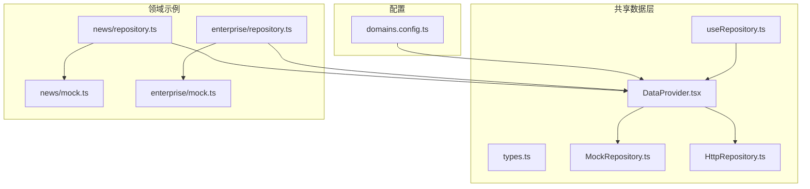
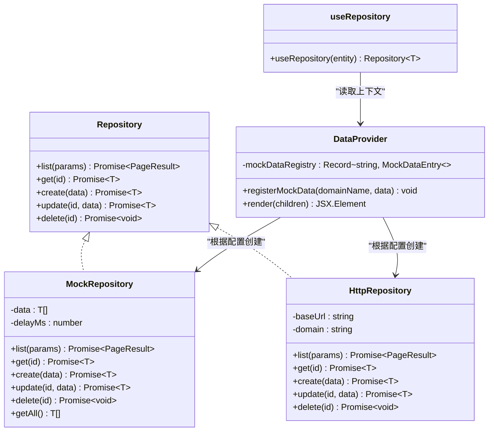
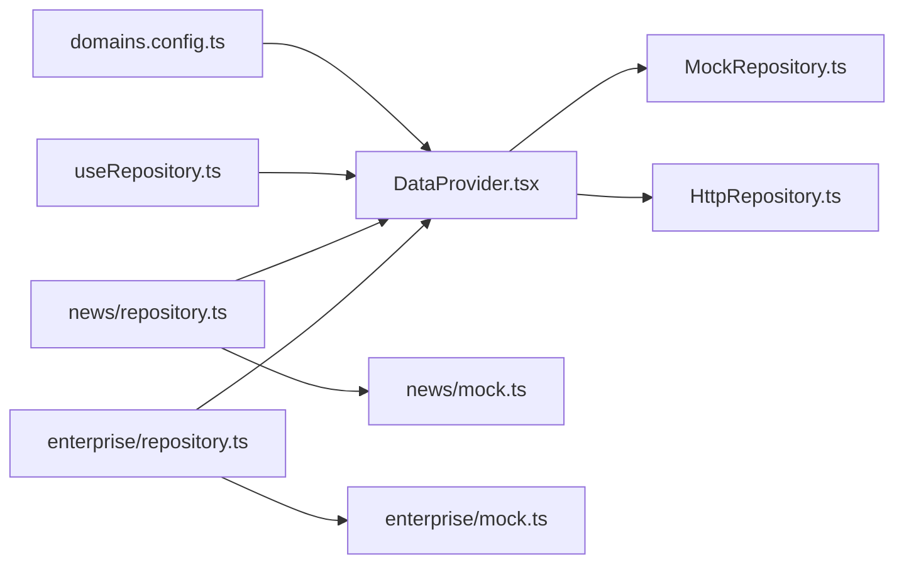

# DataProvider上下文管理

<cite>
**本文引用的文件**   
- [DataProvider.tsx](file://hj-admin/src/shared/data/DataProvider.tsx)
- [types.ts](file://hj-admin/src/shared/data/types.ts)
- [HttpRepository.ts](file://hj-admin/src/shared/data/HttpRepository.ts)
- [MockRepository.ts](file://hj-admin/src/shared/data/MockRepository.ts)
- [useRepository.ts](file://hj-admin/src/shared/data/useRepository.ts)
- [domains.config.ts](file://hj-admin/src/config/domains.config.ts)
- [news/repository.ts](file://hj-admin/src/domains/news/repository.ts)
- [enterprise/repository.ts](file://hj-admin/src/domains/enterprise/repository.ts)
- [news/mock.ts](file://hj-admin/src/domains/news/mock.ts)
- [enterprise/mock.ts](file://hj-admin/src/domains/enterprise/mock.ts)
</cite>

## 目录
1. [简介](#简介)
2. [项目结构](#项目结构)
3. [核心组件](#核心组件)
4. [架构总览](#架构总览)
5. [详细组件分析](#详细组件分析)
6. [依赖关系分析](#依赖关系分析)
7. [性能与优化](#性能与优化)
8. [错误处理与调试](#错误处理与调试)
9. [扩展指南与最佳实践](#扩展指南与最佳实践)
10. [结论](#结论)

## 简介
本技术文档聚焦于数据层上下文管理方案，围绕 React Context 在数据管理层中的应用展开。重点包括：
- DataContext 的创建与 Provider 模式的使用
- Repository 实例的注册机制与动态切换（Mock vs HTTP）
- registerMockData 的数据注册流程
- useMemo 的性能优化策略与依赖管理
- 自定义数据源注册的扩展指南与最佳实践
- 错误处理、性能监控与调试技巧

该方案通过“域”为维度组织数据访问能力，统一抽象出 Repository 接口，并以配置驱动的方式在构建期或启动期决定使用 Mock 还是真实 HTTP 实现，从而在不改动业务代码的前提下完成数据源切换。

## 项目结构
数据上下文相关的关键文件位于 shared/data 目录，配合 config/domains.config.ts 进行域级数据源模式配置；各 domain 模块通过各自的 repository.ts 将 mock 数据注入到全局注册表。

图表来源
- [DataProvider.tsx:1-44](file://hj-admin/src/shared/data/DataProvider.tsx#L1-L44)
- [useRepository.ts:1-24](file://hj-admin/src/shared/data/useRepository.ts#L1-L24)
- [types.ts:1-36](file://hj-admin/src/shared/data/types.ts#L1-L36)
- [MockRepository.ts:1-101](file://hj-admin/src/shared/data/MockRepository.ts#L1-L101)
- [HttpRepository.ts:1-70](file://hj-admin/src/shared/data/HttpRepository.ts#L1-L70)
- [domains.config.ts:1-18](file://hj-admin/src/config/domains.config.ts#L1-L18)
- [news/repository.ts:1-11](file://hj-admin/src/domains/news/repository.ts#L1-L11)
- [enterprise/repository.ts:1-6](file://hj-admin/src/domains/enterprise/repository.ts#L1-L6)
- [news/mock.ts:1-60](file://hj-admin/src/domains/news/mock.ts#L1-L60)
- [enterprise/mock.ts:1-24](file://hj-admin/src/domains/enterprise/mock.ts#L1-L24)

章节来源
- [DataProvider.tsx:1-44](file://hj-admin/src/shared/data/DataProvider.tsx#L1-L44)
- [domains.config.ts:1-18](file://hj-admin/src/config/domains.config.ts#L1-L18)

## 核心组件
- DataContext 与 DataProvider：基于 React Context 提供按域映射的 Repository 实例集合，并在渲染时通过 useMemo 缓存，避免重复创建。
- useRepository Hook：从上下文中获取指定域的 Repository，若未注册则返回空操作 fallback，保证页面不崩溃并给出警告提示。
- Repository 接口与类型：定义统一的 list/get/create/update/delete 契约，以及查询参数、分页结果等类型。
- MockRepository：内存中模拟网络延迟、过滤、排序、分页、增删改查，便于前端独立开发。
- HttpRepository：占位实现，封装 fetch 请求，构造 URLSearchParams，支持分页、筛选、排序等查询参数。

章节来源
- [DataProvider.tsx:1-44](file://hj-admin/src/shared/data/DataProvider.tsx#L1-L44)
- [useRepository.ts:1-24](file://hj-admin/src/shared/data/useRepository.ts#L1-L24)
- [types.ts:1-36](file://hj-admin/src/shared/data/types.ts#L1-L36)
- [MockRepository.ts:1-101](file://hj-admin/src/shared/data/MockRepository.ts#L1-L101)
- [HttpRepository.ts:1-70](file://hj-admin/src/shared/data/HttpRepository.ts#L1-L70)

## 架构总览
下图展示了数据上下文与仓库实现的交互关系，以及配置如何驱动实例化选择。

图表来源
- [types.ts:1-36](file://hj-admin/src/shared/data/types.ts#L1-L36)
- [MockRepository.ts:1-101](file://hj-admin/src/shared/data/MockRepository.ts#L1-L101)
- [HttpRepository.ts:1-70](file://hj-admin/src/shared/data/HttpRepository.ts#L1-L70)
- [DataProvider.tsx:1-44](file://hj-admin/src/shared/data/DataProvider.tsx#L1-L44)
- [useRepository.ts:1-24](file://hj-admin/src/shared/data/useRepository.ts#L1-L24)

## 详细组件分析

### DataProvider 与 DataContext
- 职责
  - 维护一个全局的 mock 数据注册表，供各域在引导阶段注入数据。
  - 依据 domains.config.ts 中的域配置，动态创建对应模式的 Repository 实例，并挂载到 React Context。
  - 使用 useMemo 缓存仓库映射，避免每次渲染重复创建。
- 关键流程
  - 初始化：创建空的 mockDataRegistry。
  - 注册：调用 registerMockData(domainName, data) 写入注册表。
  - 渲染：遍历 domainConfig，按 mode 选择 MockRepository 或 HttpRepository，生成 map 并作为 value 提供给子树。
- 性能要点
  - useMemo 依赖为空数组，意味着仓库映射在应用生命周期内固定不变，适合静态配置场景。
  - 如需运行时动态切换数据源模式，应调整依赖项以触发重建。

章节来源
- [DataProvider.tsx:1-44](file://hj-admin/src/shared/data/DataProvider.tsx#L1-L44)
- [domains.config.ts:1-18](file://hj-admin/src/config/domains.config.ts#L1-L18)

### registerMockData 数据注册流程
- 作用
  - 在 bootstrap 阶段由各域的 repository.ts 调用，将对应域的数据写入全局注册表。
- 流程
  - 入口：各域 repository.ts 导入 registerMockData 并传入域名与数据数组。
  - 存储：DataProvider 内部将数据存入 mockDataRegistry[domain]。
  - 消费：DataProvider 渲染时读取注册表，构造 MockRepository 实例。
- 典型用法
  - news 域同时注册新闻列表与数据源两类数据。
  - enterprise 域注册企业列表数据。

章节来源
- [DataProvider.tsx:1-44](file://hj-admin/src/shared/data/DataProvider.tsx#L1-L44)
- [news/repository.ts:1-11](file://hj-admin/src/domains/news/repository.ts#L1-L11)
- [enterprise/repository.ts:1-6](file://hj-admin/src/domains/enterprise/repository.ts#L1-L6)
- [news/mock.ts:1-60](file://hj-admin/src/domains/news/mock.ts#L1-L60)
- [enterprise/mock.ts:1-24](file://hj-admin/src/domains/enterprise/mock.ts#L1-L24)

### useRepository Hook
- 行为
  - 从 DataContext 中取出 repos 映射，按 entity 名称查找对应 Repository。
  - 若未找到，输出警告并返回空操作的 fallback Repository，确保 UI 不会崩溃。
- 适用场景
  - SchemaPage 或任意组件通过 useRepository('news') 等方式获取数据访问能力。

章节来源
- [useRepository.ts:1-24](file://hj-admin/src/shared/data/useRepository.ts#L1-L24)

### MockRepository 实现要点
- 功能
  - 模拟网络延迟，提供 list/get/create/update/delete 全量能力。
  - list 支持关键词搜索、多字段筛选、排序与分页。
  - getAll 用于统计等非分页场景。
- 复杂度
  - list 的时间复杂度近似 O(n)，其中 n 为当前内存数据量；排序为 O(n log n)。
- 注意事项
  - 所有方法均返回 Promise，保持与 HTTP 实现一致的异步体验。
  - 更新/删除操作会修改内部副本，注意引用变化对上层状态的影响。

章节来源
- [MockRepository.ts:1-101](file://hj-admin/src/shared/data/MockRepository.ts#L1-L101)

### HttpRepository 实现要点
- 功能
  - 基于 fetch 发起 RESTful 请求，自动拼接 domain 路径与查询参数。
  - 支持分页、筛选、排序等参数的序列化。
- 错误处理
  - 非 2xx 响应抛出错误，包含状态码与文本信息。
- 扩展点
  - 可在此处添加鉴权头、重试、超时控制、拦截器等通用逻辑。

章节来源
- [HttpRepository.ts:1-70](file://hj-admin/src/shared/data/HttpRepository.ts#L1-L70)

### 配置驱动的数据源切换
- 配置位置
  - domains.config.ts 中以键值对形式声明每个域的数据源模式。
- 切换方式
  - 将某域的值由 'mock' 改为 'http'，即可在下次渲染时切换到真实 API。
- 影响范围
  - 仅修改配置，无需改动 Schema 与页面代码，符合零侵入原则。

章节来源
- [domains.config.ts:1-18](file://hj-admin/src/config/domains.config.ts#L1-L18)

## 依赖关系分析
- 组件耦合
  - DataProvider 依赖 types、MockRepository、HttpRepository 与 domains.config。
  - useRepository 依赖 DataContext 与 types。
  - 各域 repository.ts 依赖 registerMockData 与自身 mock 数据。
- 外部依赖
  - HttpRepository 依赖浏览器 fetch API。
- 潜在循环
  - 当前无直接循环依赖；各域通过 registerMockData 单向注入数据。

图表来源
- [domains.config.ts:1-18](file://hj-admin/src/config/domains.config.ts#L1-L18)
- [DataProvider.tsx:1-44](file://hj-admin/src/shared/data/DataProvider.tsx#L1-L44)
- [MockRepository.ts:1-101](file://hj-admin/src/shared/data/MockRepository.ts#L1-L101)
- [HttpRepository.ts:1-70](file://hj-admin/src/shared/data/HttpRepository.ts#L1-L70)
- [useRepository.ts:1-24](file://hj-admin/src/shared/data/useRepository.ts#L1-L24)
- [news/repository.ts:1-11](file://hj-admin/src/domains/news/repository.ts#L1-L11)
- [enterprise/repository.ts:1-6](file://hj-admin/src/domains/enterprise/repository.ts#L1-L6)
- [news/mock.ts:1-60](file://hj-admin/src/domains/news/mock.ts#L1-L60)
- [enterprise/mock.ts:1-24](file://hj-admin/src/domains/enterprise/mock.ts#L1-L24)

## 性能与优化
- useMemo 缓存
  - DataProvider 使用 useMemo 构建仓库映射，依赖为空数组，表示在应用生命周期内复用同一份实例，避免重复创建带来的开销。
- 何时需要变更依赖
  - 如果需要在运行时动态切换数据源模式或新增域，应将相关配置对象作为依赖传入，以便在配置变化时重建映射。
- 大型数据集
  - MockRepository 的 list 为内存计算，数据量大时建议：
    - 增加分页大小限制
    - 引入索引或预过滤
    - 按需加载或虚拟滚动
- 网络请求
  - HttpRepository 可在 request 方法中加入：
    - 请求去重
    - 重试与退避
    - 超时控制
    - 指标上报（耗时、成功率）

章节来源
- [DataProvider.tsx:1-44](file://hj-admin/src/shared/data/DataProvider.tsx#L1-L44)
- [MockRepository.ts:1-101](file://hj-admin/src/shared/data/MockRepository.ts#L1-L101)
- [HttpRepository.ts:1-70](file://hj-admin/src/shared/data/HttpRepository.ts#L1-L70)

## 错误处理与调试
- 未注册实体
  - useRepository 在未找到对应 Repository 时会输出警告，并返回空操作实现，防止页面崩溃。
- 数据缺失
  - MockRepository.get/update 在找不到记录时抛出错误，调用方可捕获并展示友好提示。
- 网络异常
  - HttpRepository.request 在非 2xx 响应时抛出错误，包含状态码与文本，便于定位问题。
- 调试建议
  - 在 MockRepository.list 前后打印日志，观察过滤/排序/分页效果。
  - 在 HttpRepository.request 前后记录请求 URL、参数与响应时间。
  - 使用浏览器 Network 面板验证后端接口是否符合预期。

章节来源
- [useRepository.ts:1-24](file://hj-admin/src/shared/data/useRepository.ts#L1-L24)
- [MockRepository.ts:1-101](file://hj-admin/src/shared/data/MockRepository.ts#L1-L101)
- [HttpRepository.ts:1-70](file://hj-admin/src/shared/data/HttpRepository.ts#L1-L70)

## 扩展指南与最佳实践
- 新增域的步骤
  - 在 domains/<newDomain>/ 下创建 manifest、schema、types、mock、repository 等文件。
  - 在 repository.ts 中调用 registerMockData 注册初始数据。
  - 在 domains.config.ts 中添加新域的配置项，设置 'mock' 或 'http'。
- 自定义数据源
  - 实现新的 Repository 类，遵循 Repository 接口约定。
  - 在 DataProvider 中根据配置分支创建新实例，或通过工厂函数统一管理。
- 运行时切换数据源
  - 将 domainConfig 作为可变状态，并在 DataProvider 的 useMemo 依赖中包含它，以实现热切换。
- 安全与健壮性
  - 在 HttpRepository 中统一处理鉴权、错误码映射与用户提示。
  - 对输入参数做校验与兜底，避免无效查询导致后端压力。
- 性能监控
  - 在请求链路埋点，收集 P50/P95 耗时、失败率、重试次数等指标。
  - 对 MockRepository 的 list 执行耗时进行采样，评估大数据集下的性能瓶颈。

章节来源
- [DataProvider.tsx:1-44](file://hj-admin/src/shared/data/DataProvider.tsx#L1-L44)
- [domains.config.ts:1-18](file://hj-admin/src/config/domains.config.ts#L1-L18)
- [HttpRepository.ts:1-70](file://hj-admin/src/shared/data/HttpRepository.ts#L1-L70)
- [MockRepository.ts:1-101](file://hj-admin/src/shared/data/MockRepository.ts#L1-L101)

## 结论
本方案通过 React Context 与 Repository 抽象，实现了按域组织的数据访问能力，并以配置驱动的方式无缝切换 Mock 与 HTTP 实现。结合 useMemo 的缓存策略与完善的错误处理，既保证了开发期的高效体验，也为上线后的稳定性与可观测性打下基础。后续可按需扩展更多数据源实现，并通过运行时配置与监控手段持续提升系统质量。