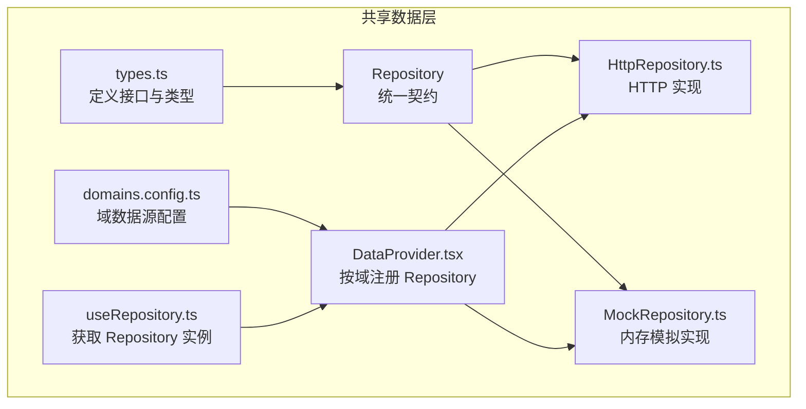
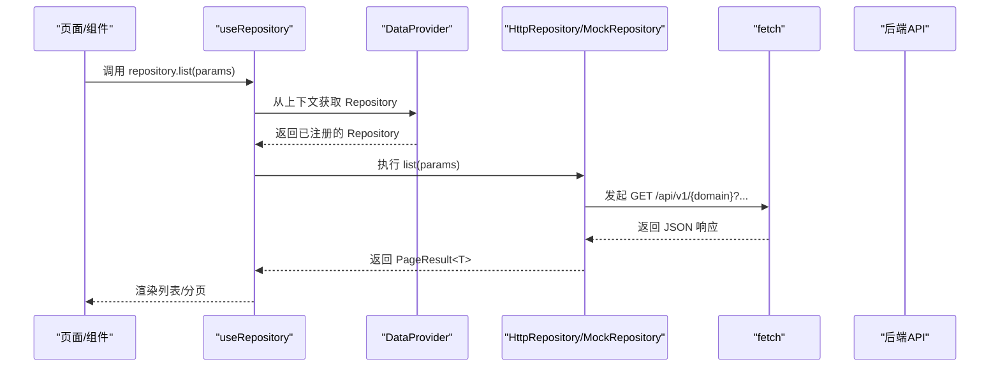
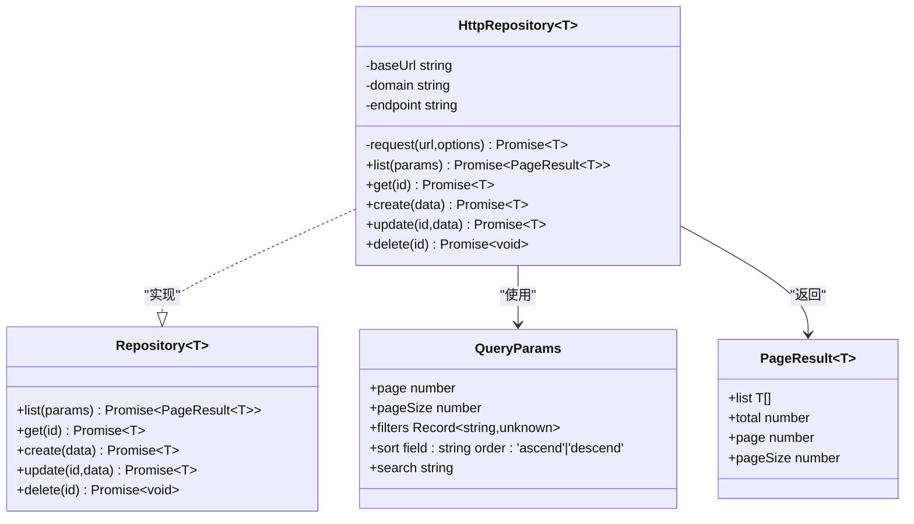
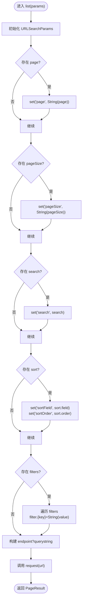
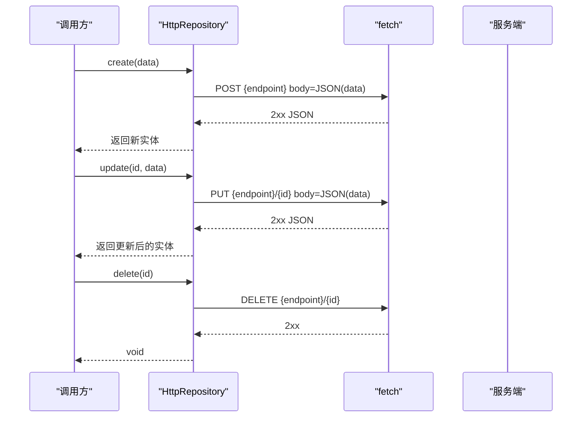
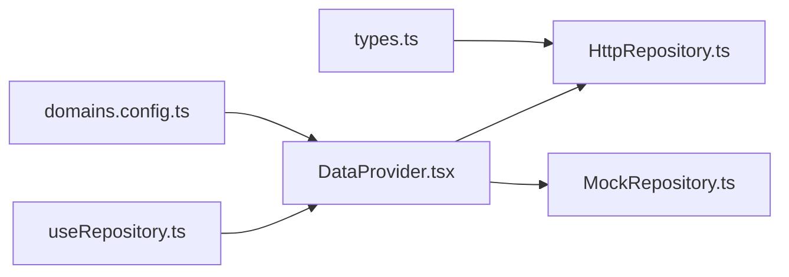

# HTTP仓库实现

<cite>
**本文引用的文件**   
- [HttpRepository.ts](file://hj-admin/src/shared/data/HttpRepository.ts)
- [types.ts](file://hj-admin/src/shared/data/types.ts)
- [DataProvider.tsx](file://hj-admin/src/shared/data/DataProvider.tsx)
- [useRepository.ts](file://hj-admin/src/shared/data/useRepository.ts)
- [domains.config.ts](file://hj-admin/src/config/domains.config.ts)
</cite>

## 目录
1. [简介](#简介)
2. [项目结构](#项目结构)
3. [核心组件](#核心组件)
4. [架构总览](#架构总览)
5. [详细组件分析](#详细组件分析)
6. [依赖关系分析](#依赖关系分析)
7. [性能考虑](#性能考虑)
8. [故障排查指南](#故障排查指南)
9. [结论](#结论)
10. [附录](#附录)

## 简介
本技术文档聚焦于前端数据访问层中的 HTTP 仓库实现，围绕 HttpRepository 类对 Repository 接口的具体实现展开。内容涵盖：
- HTTP 请求封装机制（URL 构建、请求头设置、参数序列化与响应处理）
- 分页查询逻辑（page/pageSize 转换、filters 过滤条件序列化、sort 排序规则处理）
- CRUD 操作到 HTTP 方法的映射关系
- 错误处理机制（网络异常、业务错误、超时处理的统一封装现状与建议）
- HTTP 客户端配置选项与自定义拦截器集成方案
- 性能优化建议与缓存策略实现思路

## 项目结构
本项目采用“域驱动 + 数据源抽象”的架构模式。每个业务域通过统一的 Repository 接口进行数据访问，运行时根据配置选择 Mock 或 HTTP 实现。关键文件职责如下：
- types.ts：定义 Repository 接口、查询参数、分页结果等核心类型
- HttpRepository.ts：基于 fetch 的 HTTP 仓库实现
- DataProvider.tsx：按域注册 Repository 实例，注入 React 上下文
- useRepository.ts：在组件中获取指定域的 Repository 实例
- domains.config.ts：声明各域的数据源模式（mock/http），用于切换后端接入

图表来源
- [types.ts:1-36](file://hj-admin/src/shared/data/types.ts#L1-L36)
- [HttpRepository.ts:1-70](file://hj-admin/src/shared/data/HttpRepository.ts#L1-L70)
- [DataProvider.tsx:1-43](file://hj-admin/src/shared/data/DataProvider.tsx#L1-L43)
- [useRepository.ts:1-23](file://hj-admin/src/shared/data/useRepository.ts#L1-L23)
- [domains.config.ts:1-18](file://hj-admin/src/config/domains.config.ts#L1-L18)

章节来源
- [types.ts:1-36](file://hj-admin/src/shared/data/types.ts#L1-L36)
- [HttpRepository.ts:1-70](file://hj-admin/src/shared/data/HttpRepository.ts#L1-L70)
- [DataProvider.tsx:1-43](file://hj-admin/src/shared/data/DataProvider.tsx#L1-L43)
- [useRepository.ts:1-23](file://hj-admin/src/shared/data/useRepository.ts#L1-L23)
- [domains.config.ts:1-18](file://hj-admin/src/config/domains.config.ts#L1-L18)

## 核心组件
- Repository 接口：定义 list/get/create/update/delete 五个方法，作为所有数据源的统一契约
- QueryParams/PageResult：描述分页查询输入与返回结构
- HttpRepository：基于浏览器原生 fetch 的 HTTP 实现，负责 URL 拼接、参数序列化、JSON 编解码与基础错误抛出
- DataProvider：根据 domains.config 为每个域创建对应 Repository 实例并注入上下文
- useRepository：在组件中按实体名获取对应 Repository 实例，未找到时返回空操作 fallback

章节来源
- [types.ts:1-36](file://hj-admin/src/shared/data/types.ts#L1-L36)
- [HttpRepository.ts:1-70](file://hj-admin/src/shared/data/HttpRepository.ts#L1-L70)
- [DataProvider.tsx:1-43](file://hj-admin/src/shared/data/DataProvider.tsx#L1-L43)
- [useRepository.ts:1-23](file://hj-admin/src/shared/data/useRepository.ts#L1-L23)

## 架构总览
下图展示了从组件调用到 HTTP 请求的关键路径，以及数据源切换机制。

图表来源
- [useRepository.ts:1-23](file://hj-admin/src/shared/data/useRepository.ts#L1-L23)
- [DataProvider.tsx:1-43](file://hj-admin/src/shared/data/DataProvider.tsx#L1-L43)
- [HttpRepository.ts:1-70](file://hj-admin/src/shared/data/HttpRepository.ts#L1-L70)

## 详细组件分析

### HttpRepository 类分析
- 构造与端点
  - 构造函数接收 baseUrl 与 domain，endpoint 属性组合为 {baseUrl}/{domain}
- 请求封装 request
  - 使用 fetch 发起请求，默认设置 Content-Type: application/json
  - 若 response.ok 为 false，抛出包含状态码和文本的错误
  - 成功时解析 JSON 并返回
- 分页查询 list
  - 使用 URLSearchParams 构建查询字符串
  - page/pageSize/search 直接映射为同名参数
  - sort 对象拆分为 sortField/sortOrder 两个参数
  - filters 对象以 filter.{key}=value 形式追加
  - 最终拼接为 endpoint?querystring 并调用 request
- CRUD 映射
  - get(id): GET {endpoint}/{id}
  - create(data): POST {endpoint}，body 为 JSON.stringify(data)
  - update(id, data): PUT {endpoint}/{id}，body 为 JSON.stringify(data)
  - delete(id): DELETE {endpoint}/{id}

图表来源
- [HttpRepository.ts:1-70](file://hj-admin/src/shared/data/HttpRepository.ts#L1-L70)
- [types.ts:1-36](file://hj-admin/src/shared/data/types.ts#L1-L36)

章节来源
- [HttpRepository.ts:1-70](file://hj-admin/src/shared/data/HttpRepository.ts#L1-L70)
- [types.ts:1-36](file://hj-admin/src/shared/data/types.ts#L1-L36)

### 分页查询实现细节
- 参数转换
  - page/pageSize 转换为字符串后加入查询串
  - search 原样传递
  - sort.field/sort.order 分别映射为 sortField/sortOrder
- 过滤条件序列化
  - filters 对象遍历，忽略 undefined/null/空字符串
  - 以 filter.{key}=value 的形式追加，支持多键值
- 请求 URL 构建
  - 将 URLSearchParams.toString() 拼接到 endpoint 后形成完整 URL

图表来源
- [HttpRepository.ts:29-46](file://hj-admin/src/shared/data/HttpRepository.ts#L29-L46)

章节来源
- [HttpRepository.ts:29-46](file://hj-admin/src/shared/data/HttpRepository.ts#L29-L46)

### CRUD 操作的 HTTP 映射
- GET 读取详情：GET {endpoint}/{id}
- POST 新增：POST {endpoint}，请求体为 JSON 对象
- PUT 更新：PUT {endpoint}/{id}，请求体为 JSON 对象
- DELETE 删除：DELETE {endpoint}/{id}

图表来源
- [HttpRepository.ts:48-68](file://hj-admin/src/shared/data/HttpRepository.ts#L48-L68)

章节来源
- [HttpRepository.ts:48-68](file://hj-admin/src/shared/data/HttpRepository.ts#L48-L68)

### 错误处理机制
- 当前实现
  - 当 response.ok 为 false 时，抛出包含状态码与文本的错误
  - 未显式处理网络异常（如 DNS/连接失败）与超时
- 建议的统一封装
  - 网络异常捕获：try/catch 包裹 fetch，区分网络错误与 HTTP 错误
  - 超时控制：为 fetch 添加 AbortController 与 setTimeout，统一抛出超时错误
  - 业务错误归一化：约定后端返回结构（如 code/message/data），在 request 中解析并抛出领域错误
  - 重试与退避：对幂等请求（GET/PUT/DELETE）增加指数退避重试
  - 可观测性：记录请求 URL、方法、耗时、错误堆栈，便于定位问题

章节来源
- [HttpRepository.ts:20-27](file://hj-admin/src/shared/data/HttpRepository.ts#L20-L27)

### HTTP 客户端配置与自定义拦截器集成
- 当前配置项
  - baseUrl：全局 API 前缀（由 DataProvider 传入）
  - domain：域名称，决定资源路径
- 扩展建议
  - 在 request 中合并通用 headers（如 Authorization、X-Request-Id）
  - 提供可选的 baseURL 与 timeout 配置
  - 引入拦截器链：请求前（鉴权、日志）、响应后（错误归一化、缓存写入）
  - 支持取消重复请求与并发限流

章节来源
- [DataProvider.tsx:24-35](file://hj-admin/src/shared/data/DataProvider.tsx#L24-L35)
- [HttpRepository.ts:7-18](file://hj-admin/src/shared/data/HttpRepository.ts#L7-L18)

## 依赖关系分析
- 类型依赖
  - HttpRepository 依赖 types.ts 中的 Repository、QueryParams、PageResult
- 运行期依赖
  - DataProvider 根据 domains.config 动态选择 HttpRepository 或 MockRepository
  - useRepository 从上下文获取 Repository 实例供组件使用

图表来源
- [types.ts:1-36](file://hj-admin/src/shared/data/types.ts#L1-L36)
- [HttpRepository.ts:1-70](file://hj-admin/src/shared/data/HttpRepository.ts#L1-L70)
- [DataProvider.tsx:1-43](file://hj-admin/src/shared/data/DataProvider.tsx#L1-L43)
- [useRepository.ts:1-23](file://hj-admin/src/shared/data/useRepository.ts#L1-L23)
- [domains.config.ts:1-18](file://hj-admin/src/config/domains.config.ts#L1-L18)

章节来源
- [types.ts:1-36](file://hj-admin/src/shared/data/types.ts#L1-L36)
- [HttpRepository.ts:1-70](file://hj-admin/src/shared/data/HttpRepository.ts#L1-L70)
- [DataProvider.tsx:1-43](file://hj-admin/src/shared/data/DataProvider.tsx#L1-L43)
- [useRepository.ts:1-23](file://hj-admin/src/shared/data/useRepository.ts#L1-L23)
- [domains.config.ts:1-18](file://hj-admin/src/config/domains.config.ts#L1-L18)

## 性能考虑
- 减少不必要的重渲染
  - 在组件层对 list 结果做稳定引用与增量更新
- 请求去重与取消
  - 对相同参数的重复请求进行去重；用户快速翻页时取消旧请求
- 分页与懒加载
  - 合理设置 pageSize，避免一次性拉取过多数据
- 缓存策略
  - 读多写少场景使用内存缓存（按 key 缓存 list 结果）
  - 结合时间戳或版本号失效策略，保证一致性
- 压缩与传输
  - 启用 gzip/br 压缩（由代理或服务器配置）
  - 仅请求必要字段（后端支持字段裁剪时）

[本节为通用指导，不直接分析具体文件]

## 故障排查指南
- 常见错误
  - HTTP 非 2xx：检查后端状态码与 message，确认路由与权限
  - 网络异常：检查跨域、代理、DNS、证书与网络连通性
  - 超时：检查后端响应时间与网络延迟，必要时调整超时阈值
- 定位手段
  - 在 request 中打印请求 URL、方法与耗时
  - 统一错误分类（网络/HTTP/业务），便于上层展示与埋点
- 恢复策略
  - 对幂等请求实施有限次重试与指数退避
  - 提供降级与离线提示

章节来源
- [HttpRepository.ts:20-27](file://hj-admin/src/shared/data/HttpRepository.ts#L20-L27)

## 结论
HttpRepository 提供了简洁清晰的 HTTP 数据访问实现，遵循 Repository 接口契约，并通过 DataProvider 与 useRepository 完成运行时装配与注入。当前实现覆盖了基本的分页、过滤、排序与 CRUD 映射，具备良好扩展性。建议在现有基础上完善错误处理、超时控制、拦截器与缓存策略，以提升健壮性与性能表现。

[本节为总结性内容，不直接分析具体文件]

## 附录

### 配置与切换指南
- 切换数据源
  - 修改 domains.config.ts 中对应域的值为 'http'，即可切换到 HttpRepository
- 全局 API 前缀
  - 在 DataProvider 中维护 API_BASE，统一变更后端地址

章节来源
- [domains.config.ts:1-18](file://hj-admin/src/config/domains.config.ts#L1-L18)
- [DataProvider.tsx:24-35](file://hj-admin/src/shared/data/DataProvider.tsx#L24-L35)