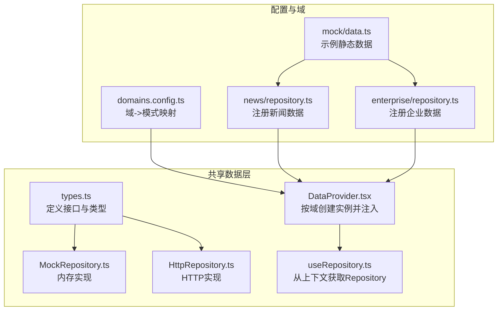
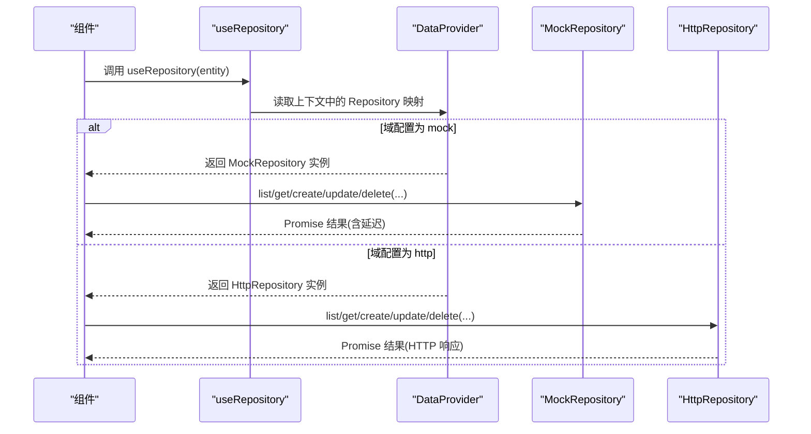
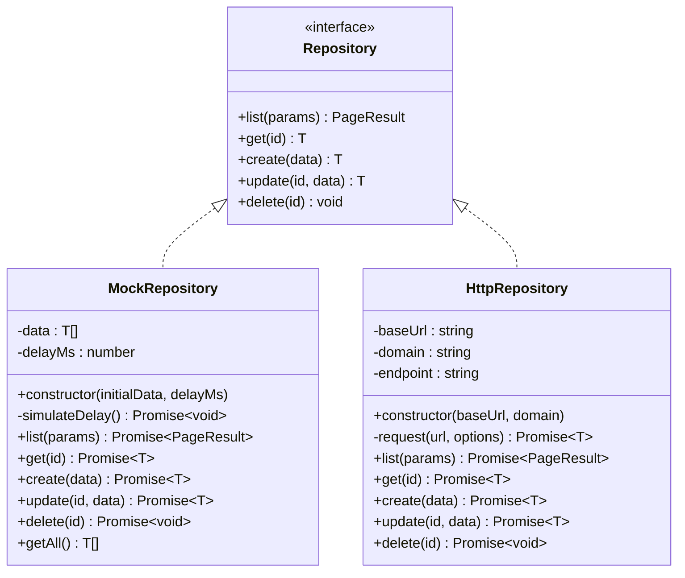
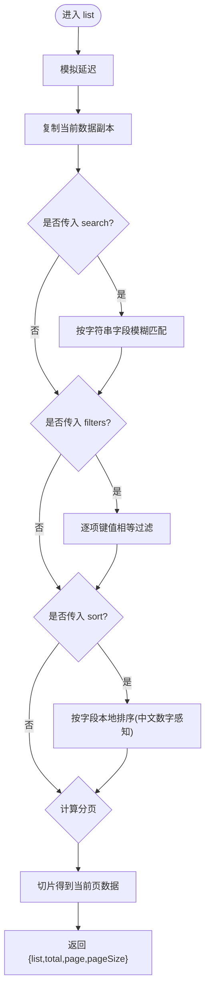
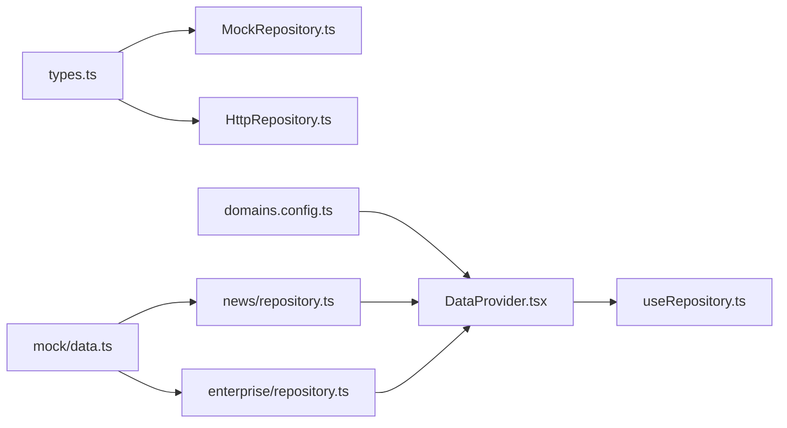

# Mock仓库实现

<cite>
**本文引用的文件**
- [MockRepository.ts](file://hj-admin/src/shared/data/MockRepository.ts)
- [HttpRepository.ts](file://hj-admin/src/shared/data/HttpRepository.ts)
- [types.ts](file://hj-admin/src/shared/data/types.ts)
- [DataProvider.tsx](file://hj-admin/src/shared/data/DataProvider.tsx)
- [useRepository.ts](file://hj-admin/src/shared/data/useRepository.ts)
- [domains.config.ts](file://hj-admin/src/config/domains.config.ts)
- [news/repository.ts](file://hj-admin/src/domains/news/repository.ts)
- [enterprise/repository.ts](file://hj-admin/src/domains/enterprise/repository.ts)
- [mock/data.ts](file://hj-admin/src/mock/data.ts)
</cite>

## 目录
1. [简介](#简介)
2. [项目结构](#项目结构)
3. [核心组件](#核心组件)
4. [架构总览](#架构总览)
5. [详细组件分析](#详细组件分析)
6. [依赖关系分析](#依赖关系分析)
7. [性能考量](#性能考量)
8. [故障排查指南](#故障排查指南)
9. [结论](#结论)
10. [附录](#附录)

## 简介
本技术文档聚焦于开发测试环境中的“Mock 仓库”实现，围绕 MockRepository 类在内存中模拟后端 API 的行为展开。内容涵盖：
- 内存数据存储机制（初始化、存储结构、生命周期）
- CRUD 操作的内存模拟与一致性保证
- 延迟响应模拟（固定延迟、可扩展为随机延迟与异步行为）
- 测试数据管理策略（生成、注册、重置与清理）
- 与真实 HTTP 仓库的无缝切换机制与配置方法
- Mock 数据设计与调试技巧（验证与断言建议）
- 单元测试最佳实践与用例编写指南

## 项目结构
该功能位于共享数据层，采用“接口抽象 + 多实现 + 上下文注入”的方式组织：
- 类型与契约：定义查询参数、分页结果与 Repository 接口
- 实现：MockRepository（内存）、HttpRepository（HTTP）
- 注入：DataProvider 根据域配置创建具体实现并注入到 React 上下文
- 使用：useRepository Hook 从上下文中获取对应域的 Repository
- 域注册：各域通过 repository.ts 将初始数据注册到 DataProvider

图表来源
- [types.ts:1-36](file://hj-admin/src/shared/data/types.ts#L1-L36)
- [MockRepository.ts:1-101](file://hj-admin/src/shared/data/MockRepository.ts#L1-L101)
- [HttpRepository.ts:1-70](file://hj-admin/src/shared/data/HttpRepository.ts#L1-L70)
- [DataProvider.tsx:1-44](file://hj-admin/src/shared/data/DataProvider.tsx#L1-L44)
- [useRepository.ts:1-24](file://hj-admin/src/shared/data/useRepository.ts#L1-L24)
- [domains.config.ts:1-18](file://hj-admin/src/config/domains.config.ts#L1-L18)
- [news/repository.ts:1-11](file://hj-admin/src/domains/news/repository.ts#L1-L11)
- [enterprise/repository.ts:1-6](file://hj-admin/src/domains/enterprise/repository.ts#L1-L6)
- [mock/data.ts:1-233](file://hj-admin/src/mock/data.ts#L1-L233)

章节来源
- [types.ts:1-36](file://hj-admin/src/shared/data/types.ts#L1-L36)
- [MockRepository.ts:1-101](file://hj-admin/src/shared/data/MockRepository.ts#L1-L101)
- [HttpRepository.ts:1-70](file://hj-admin/src/shared/data/HttpRepository.ts#L1-L70)
- [DataProvider.tsx:1-44](file://hj-admin/src/shared/data/DataProvider.tsx#L1-L44)
- [useRepository.ts:1-24](file://hj-admin/src/shared/data/useRepository.ts#L1-L24)
- [domains.config.ts:1-18](file://hj-admin/src/config/domains.config.ts#L1-L18)
- [news/repository.ts:1-11](file://hj-admin/src/domains/news/repository.ts#L1-L11)
- [enterprise/repository.ts:1-6](file://hj-admin/src/domains/enterprise/repository.ts#L1-L6)
- [mock/data.ts:1-233](file://hj-admin/src/mock/data.ts#L1-L233)

## 核心组件
- Repository 接口：统一的数据访问契约，包含 list/get/create/update/delete 五个方法，返回 Promise，便于前端以一致方式处理加载态与错误态。
- MockRepository：基于数组的内存实现，支持关键词搜索、筛选、排序、分页；提供固定延迟模拟网络请求；新增记录自动生成 id。
- HttpRepository：占位实现，负责将调用转换为 RESTful 请求，便于后续替换为真实后端。
- DataProvider：根据 domains.config 为每个域创建对应的 Repository 实例，并通过 React Context 暴露给 useRepository。
- useRepository：在任意组件中以 entity 名称获取对应 Repository，未注册时返回空操作 fallback，避免崩溃。
- 域注册：各域在 bootstrap 阶段调用 registerMockData 将初始数据注入到 DataProvider。

章节来源
- [types.ts:1-36](file://hj-admin/src/shared/data/types.ts#L1-L36)
- [MockRepository.ts:1-101](file://hj-admin/src/shared/data/MockRepository.ts#L1-L101)
- [HttpRepository.ts:1-70](file://hj-admin/src/shared/data/HttpRepository.ts#L1-L70)
- [DataProvider.tsx:1-44](file://hj-admin/src/shared/data/DataProvider.tsx#L1-L44)
- [useRepository.ts:1-24](file://hj-admin/src/shared/data/useRepository.ts#L1-L24)
- [news/repository.ts:1-11](file://hj-admin/src/domains/news/repository.ts#L1-L11)
- [enterprise/repository.ts:1-6](file://hj-admin/src/domains/enterprise/repository.ts#L1-L6)

## 架构总览
下图展示了从配置到运行时调用的完整链路：配置决定使用 Mock 还是 HTTP；DataProvider 在启动时构建 Repository 映射；组件通过 useRepository 获取并使用。

图表来源
- [DataProvider.tsx:26-41](file://hj-admin/src/shared/data/DataProvider.tsx#L26-L41)
- [useRepository.ts:8-23](file://hj-admin/src/shared/data/useRepository.ts#L8-L23)
- [MockRepository.ts:20-94](file://hj-admin/src/shared/data/MockRepository.ts#L20-L94)
- [HttpRepository.ts:29-68](file://hj-admin/src/shared/data/HttpRepository.ts#L29-L68)
- [domains.config.ts:7-17](file://hj-admin/src/config/domains.config.ts#L7-L17)

## 详细组件分析

### MockRepository 类分析
- 职责：在内存中维护一份数据副本，模拟后端 API 的异步行为，并提供过滤、排序、分页等能力。
- 数据结构：内部使用数组保存实体对象；每条记录需具备唯一 id 字段（create 自动分配）。
- 延迟模拟：所有写/读操作前均执行固定延迟，便于 UI 展示 loading 状态。
- 一致性：对数据的增删改查均在同一份内存数组上操作，保证一次会话内的一致性。

图表来源
- [types.ts:20-27](file://hj-admin/src/shared/data/types.ts#L20-L27)
- [MockRepository.ts:7-100](file://hj-admin/src/shared/data/MockRepository.ts#L7-L100)
- [HttpRepository.ts:7-69](file://hj-admin/src/shared/data/HttpRepository.ts#L7-L69)

#### 列表查询流程（过滤/排序/分页）

图表来源
- [MockRepository.ts:20-67](file://hj-admin/src/shared/data/MockRepository.ts#L20-L67)

章节来源
- [MockRepository.ts:1-101](file://hj-admin/src/shared/data/MockRepository.ts#L1-L101)

### 延迟响应模拟
- 固定延迟：所有读写操作前统一 await 固定毫秒数，确保 UI 能稳定展示加载态。
- 扩展建议：
  - 随机延迟：在 simulateDelay 中引入 Math.random 区间抖动，更贴近真实网络波动。
  - 异步失败：可结合配置开关，在特定条件下抛出异常或返回错误码，用于覆盖错误分支。
  - 可控延迟：暴露 setDelay(ms) 方法，便于单测中快速推进时间。

章节来源
- [MockRepository.ts:16-18](file://hj-admin/src/shared/data/MockRepository.ts#L16-L18)
- [MockRepository.ts:20-94](file://hj-admin/src/shared/data/MockRepository.ts#L20-L94)

### 测试数据管理与生命周期
- 数据来源：各域在 bootstrap 阶段通过 registerMockData 将静态数据注入到 DataProvider 的注册表。
- 初始化：DataProvider 构造时将注册表中的数据拷贝进对应域的 MockRepository 实例。
- 生命周期：
  - 应用启动：注册数据 -> 构建 Repository 映射 -> 注入上下文。
  - 运行期：组件通过 useRepository 获取实例并进行 CRUD。
  - 刷新/重启：页面刷新后内存数据丢失，需重新注册。
- 重置与清理：
  - 简单方案：在测试或调试入口重新调用 registerMockData 覆盖旧数据。
  - 进阶方案：在 DataProvider 中暴露 reset(domain) 方法，按域重建 MockRepository。

章节来源
- [DataProvider.tsx:17-20](file://hj-admin/src/shared/data/DataProvider.tsx#L17-L20)
- [DataProvider.tsx:26-38](file://hj-admin/src/shared/data/DataProvider.tsx#L26-L38)
- [news/repository.ts:7-11](file://hj-admin/src/domains/news/repository.ts#L7-L11)
- [enterprise/repository.ts:1-6](file://hj-admin/src/domains/enterprise/repository.ts#L1-L6)
- [mock/data.ts:1-233](file://hj-admin/src/mock/data.ts#L1-L233)

### 与真实 HTTP 仓库的无缝切换
- 配置驱动：domains.config.ts 中为每个域指定 'mock' 或 'http'。
- 运行时选择：DataProvider 遍历配置，按需 new MockRepository 或 new HttpRepository，并放入上下文。
- 零侵入：组件仅依赖 useRepository，无需关心底层实现。
- 迁移步骤：
  1) 在后端 API 就绪后，修改对应域的 mode 为 'http'。
  2) 确认 HttpRepository 的请求路径与后端路由一致。
  3) 逐步回归验证关键页面。

章节来源
- [domains.config.ts:7-17](file://hj-admin/src/config/domains.config.ts#L7-L17)
- [DataProvider.tsx:26-38](file://hj-admin/src/shared/data/DataProvider.tsx#L26-L38)
- [HttpRepository.ts:29-68](file://hj-admin/src/shared/data/HttpRepository.ts#L29-L68)

### 数据模型与查询参数约定
- 查询参数 QueryParams：支持 page/pageSize/search/filters/sort。
- 分页结果 PageResult：返回 list/total/page/pageSize。
- 排序规则：sort.field 为字段名，sort.order 为 ascend/descend；本地排序使用 localeCompare 并开启数字感知。
- 筛选规则：filters 为键值对，值为 undefined/null/'' 时忽略该项。
- 搜索规则：search 为字符串，对对象的所有字符串字段进行子串匹配。

章节来源
- [types.ts:4-18](file://hj-admin/src/shared/data/types.ts#L4-L18)
- [MockRepository.ts:24-58](file://hj-admin/src/shared/data/MockRepository.ts#L24-L58)

### CRUD 语义与一致性
- get：按 id 查找，不存在抛错。
- create：合并入参并生成新 id，插入到数组头部。
- update：按 id 定位并浅合并更新字段，不存在抛错。
- delete：按 id 过滤移除。
- getAll：返回全量快照（供统计/计数等场景）。
- 一致性：所有变更在同一内存数组上进行，无并发锁；适合单线程前端环境。

章节来源
- [MockRepository.ts:69-99](file://hj-admin/src/shared/data/MockRepository.ts#L69-L99)

## 依赖关系分析
- 低耦合：Repository 接口解耦了业务逻辑与数据源实现。
- 集中装配：DataProvider 作为装配中心，依据配置组装不同实现。
- 易扩展：新增数据源只需实现 Repository 并在配置中注册。

图表来源
- [types.ts:1-36](file://hj-admin/src/shared/data/types.ts#L1-L36)
- [MockRepository.ts:1-101](file://hj-admin/src/shared/data/MockRepository.ts#L1-L101)
- [HttpRepository.ts:1-70](file://hj-admin/src/shared/data/HttpRepository.ts#L1-L70)
- [DataProvider.tsx:1-44](file://hj-admin/src/shared/data/DataProvider.tsx#L1-L44)
- [useRepository.ts:1-24](file://hj-admin/src/shared/data/useRepository.ts#L1-L24)
- [domains.config.ts:1-18](file://hj-admin/src/config/domains.config.ts#L1-L18)
- [news/repository.ts:1-11](file://hj-admin/src/domains/news/repository.ts#L1-L11)
- [enterprise/repository.ts:1-6](file://hj-admin/src/domains/enterprise/repository.ts#L1-L6)
- [mock/data.ts:1-233](file://hj-admin/src/mock/data.ts#L1-L233)

章节来源
- [DataProvider.tsx:26-38](file://hj-admin/src/shared/data/DataProvider.tsx#L26-L38)
- [useRepository.ts:8-23](file://hj-admin/src/shared/data/useRepository.ts#L8-L23)

## 性能考量
- 内存操作复杂度：
  - list：O(n) 过滤 + O(n log n) 排序 + O(1) 切片，整体 O(n log n)。
  - get/update/delete：O(n) 线性查找。
- 大数据集优化建议：
  - 索引化：为常用查询字段建立索引（如 id、status），提升查找效率。
  - 惰性计算：仅在需要时执行排序/过滤。
  - 分页下推：当数据量较大时，优先减少不必要的全量扫描。
- 延迟控制：
  - 单测中可将延迟设为 0 加速执行。
  - 生产调试时可放大延迟观察 UI 交互。

[本节为通用指导，不直接分析具体文件]

## 故障排查指南
- 找不到 Repository：
  - 现象：useRepository 返回空操作实现并打印警告。
  - 排查：检查 domains.config 是否注册该域；检查对应域的 repository.ts 是否调用 registerMockData。
- 数据未生效：
  - 现象：list 返回空或旧数据。
  - 排查：确认 registerMockData 已执行；确认初始数据格式符合预期（至少包含 id）。
- 更新/删除无效：
  - 现象：update/delete 报错或无效果。
  - 排查：确认传入 id 是否存在；注意 create 生成的 id 格式。
- 排序不符合预期：
  - 现象：中文数字排序异常。
  - 排查：确认 sort.field 存在且为可比较类型；localeCompare 已启用数字感知。

章节来源
- [useRepository.ts:11-21](file://hj-admin/src/shared/data/useRepository.ts#L11-L21)
- [MockRepository.ts:69-94](file://hj-admin/src/shared/data/MockRepository.ts#L69-L94)
- [MockRepository.ts:48-58](file://hj-admin/src/shared/data/MockRepository.ts#L48-L58)

## 结论
MockRepository 提供了与真实 API 一致的异步接口体验，配合 DataProvider 与 useRepository 实现了“配置即切换”的数据源抽象。其内存实现简洁高效，适合开发与联调阶段；同时具备良好的扩展性，可通过增加随机延迟、错误注入等手段完善测试覆盖。随着后端就绪，仅需调整配置即可平滑切换到 HttpRepository，保持上层代码不变。

[本节为总结性内容，不直接分析具体文件]

## 附录

### Mock 数据设计与调试技巧
- 数据设计
  - 结构化：为每个域准备最小可用数据集，覆盖典型状态与边界值。
  - 稳定性：id 尽量稳定，便于跨页面关联与断言。
- 调试技巧
  - 控制台日志：在 list/get/create/update/delete 前后输出关键参数与结果摘要。
  - 可视化：在 Schema 页面或独立 Tab 中展示当前内存快照，辅助定位问题。
- 验证与断言
  - 基础断言：长度、字段存在性、枚举取值范围。
  - 业务断言：排序顺序、分页 total 与实际数量一致、筛选条件命中情况。
  - 时序断言：在单测中可断言 Promise 的 resolve 时机是否符合预期延迟。

[本节为通用指导，不直接分析具体文件]

### 单元测试最佳实践与用例编写指南
- 测试目标
  - 正确性：CRUD 行为符合预期。
  - 鲁棒性：缺失字段、非法 id、空查询参数等边界场景。
  - 一致性：多次变更后数据状态一致。
- 推荐用例
  - 初始化：注册数据后 list 返回正确总数与首项。
  - 搜索与筛选：组合 search 与 filters 的交集过滤。
  - 排序：ascend/descend 两种顺序下的首尾元素校验。
  - 分页：越界页码、pageSize 变化时的切片结果。
  - 写入：create 生成新 id 并出现在首位；update 合并字段；delete 移除后不可再 get。
  - 错误：get/update 不存在的 id 应抛错。
- 工具建议
  - 使用 jest/vitest 等框架；在 beforeEach 中注册干净数据。
  - 将延迟置 0 或缩短，提高执行速度。
  - 封装 helper：registerMockDataForTest、resetDomain、assertPageResult 等。

[本节为通用指导，不直接分析具体文件]