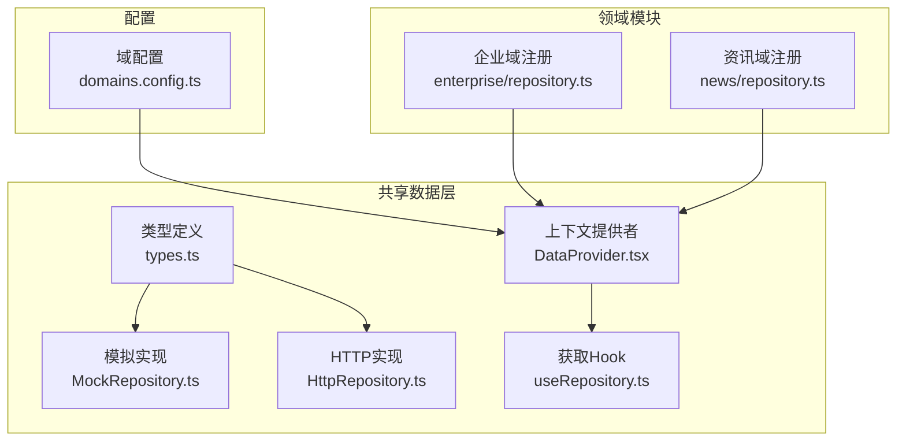
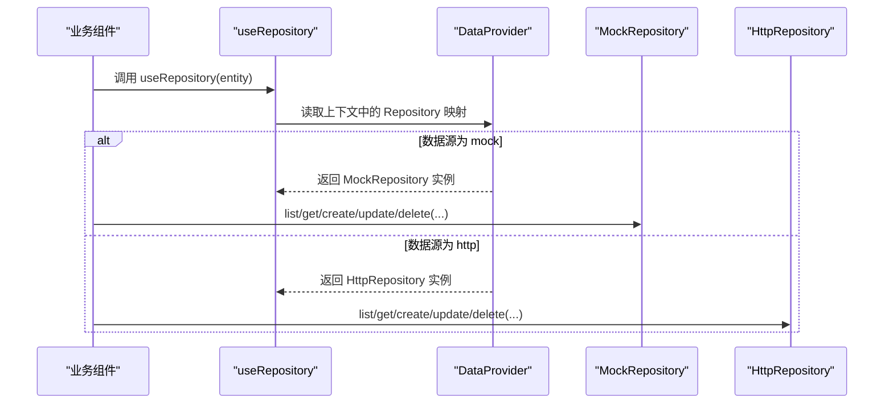
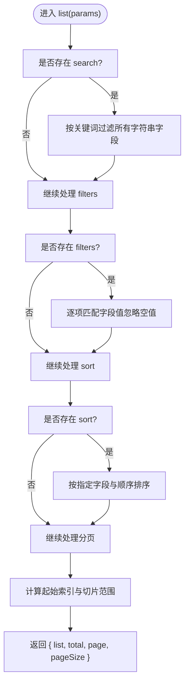
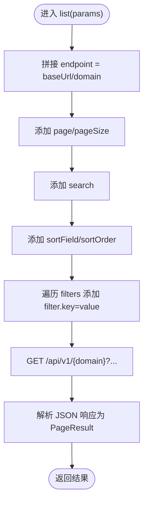

# Repository接口定义

<cite>
**本文引用的文件**
- [types.ts](file://hj-admin/src/shared/data/types.ts)
- [HttpRepository.ts](file://hj-admin/src/shared/data/HttpRepository.ts)
- [MockRepository.ts](file://hj-admin/src/shared/data/MockRepository.ts)
- [DataProvider.tsx](file://hj-admin/src/shared/data/DataProvider.tsx)
- [useRepository.ts](file://hj-admin/src/shared/data/useRepository.ts)
- [domains.config.ts](file://hj-admin/src/config/domains.config.ts)
- [enterprise/repository.ts](file://hj-admin/src/domains/enterprise/repository.ts)
- [news/repository.ts](file://hj-admin/src/domains/news/repository.ts)
</cite>

## 目录
1. [简介](#简介)
2. [项目结构](#项目结构)
3. [核心组件](#核心组件)
4. [架构总览](#架构总览)
5. [详细组件分析](#详细组件分析)
6. [依赖关系分析](#依赖关系分析)
7. [性能与行为特性](#性能与行为特性)
8. [故障排查指南](#故障排查指南)
9. [结论](#结论)
10. [附录：自定义实现最佳实践](#附录自定义实现最佳实践)

## 简介
本文件围绕数据访问抽象层，系统化阐述 Repository 设计模式在该仓库中的落地方式。重点包括：
- Repository<T> 泛型接口的职责与约定
- QueryParams 查询参数结构与分页、过滤、排序、搜索语义
- PageResult 分页结果字段含义与使用场景
- DataSourceMode 数据源模式枚举及切换机制
- HttpRepository 与 MockRepository 两种实现的行为差异
- 在域（domain）中注册数据与选择数据源的流程
- 如何编写自定义 Repository 实现并集成到系统

## 项目结构
该数据访问抽象位于 shared/data 目录，配合各域的 repository.ts 完成数据注册与绑定；通过 DataProvider 统一注入，useRepository Hook 提供消费入口。



图表来源
- [types.ts:1-36](file://hj-admin/src/shared/data/types.ts#L1-L36)
- [MockRepository.ts:1-101](file://hj-admin/src/shared/data/MockRepository.ts#L1-L101)
- [HttpRepository.ts:1-70](file://hj-admin/src/shared/data/HttpRepository.ts#L1-L70)
- [DataProvider.tsx:1-44](file://hj-admin/src/shared/data/DataProvider.tsx#L1-L44)
- [useRepository.ts:1-24](file://hj-admin/src/shared/data/useRepository.ts#L1-L24)
- [domains.config.ts](file://hj-admin/src/config/domains.config.ts)
- [enterprise/repository.ts:1-6](file://hj-admin/src/domains/enterprise/repository.ts#L1-L6)
- [news/repository.ts:1-11](file://hj-admin/src/domains/news/repository.ts#L1-L11)

章节来源
- [types.ts:1-36](file://hj-admin/src/shared/data/types.ts#L1-L36)
- [DataProvider.tsx:1-44](file://hj-admin/src/shared/data/DataProvider.tsx#L1-L44)
- [useRepository.ts:1-24](file://hj-admin/src/shared/data/useRepository.ts#L1-L24)
- [HttpRepository.ts:1-70](file://hj-admin/src/shared/data/HttpRepository.ts#L1-L70)
- [MockRepository.ts:1-101](file://hj-admin/src/shared/data/MockRepository.ts#L1-L101)
- [enterprise/repository.ts:1-6](file://hj-admin/src/domains/enterprise/repository.ts#L1-L6)
- [news/repository.ts:1-11](file://hj-admin/src/domains/news/repository.ts#L1-L11)

## 核心组件
- 类型契约
  - QueryParams：统一的查询参数结构，包含分页、过滤、排序、搜索等维度
  - PageResult<T>：标准分页结果结构，包含列表、总数、页码、每页条数
  - Repository<T>：CRUD 统一契约，list/get/create/update/delete
  - DataSourceMode：数据源模式 'mock' | 'http'
- 实现类
  - MockRepository：内存数据 + 延迟模拟，支持本地过滤/排序/分页
  - HttpRepository：基于 fetch 的 HTTP 客户端封装，将 QueryParams 映射为 URL 查询串
- 运行时装配
  - DataProvider：根据 domains.config 为每个 domain 创建对应 Repository 实例，并通过 React Context 暴露
  - useRepository：从 Context 按 entity 名称获取 Repository 实例，未找到时返回空操作 fallback

章节来源
- [types.ts:1-36](file://hj-admin/src/shared/data/types.ts#L1-L36)
- [MockRepository.ts:1-101](file://hj-admin/src/shared/data/MockRepository.ts#L1-L101)
- [HttpRepository.ts:1-70](file://hj-admin/src/shared/data/HttpRepository.ts#L1-L70)
- [DataProvider.tsx:1-44](file://hj-admin/src/shared/data/DataProvider.tsx#L1-L44)
- [useRepository.ts:1-24](file://hj-admin/src/shared/data/useRepository.ts#L1-L24)

## 架构总览
下图展示了从配置到实现的装配路径，以及组件如何通过 Hook 获取 Repository 进行数据访问。



图表来源
- [DataProvider.tsx:26-41](file://hj-admin/src/shared/data/DataProvider.tsx#L26-L41)
- [useRepository.ts:8-23](file://hj-admin/src/shared/data/useRepository.ts#L8-L23)
- [MockRepository.ts:7-94](file://hj-admin/src/shared/data/MockRepository.ts#L7-L94)
- [HttpRepository.ts:7-68](file://hj-admin/src/shared/data/HttpRepository.ts#L7-L68)

## 详细组件分析

### 类型契约与数据模型
- QueryParams
  - page/pageSize：分页参数，默认值由具体实现决定
  - filters：键值对过滤条件，空值会被忽略
  - sort：{ field, order }，order 支持 ascend/descend
  - search：全局关键词搜索
- PageResult<T>
  - list：当前页数据数组
  - total：满足条件的总记录数
  - page/pageSize：当前页码与每页大小
- Repository<T>
  - list(params): Promise<PageResult<T>>
  - get(id): Promise<T>
  - create(data): Promise<T>
  - update(id, data): Promise<T>
  - delete(id): Promise<void>
- DataSourceMode
  - 'mock'：使用 MockRepository
  - 'http'：使用 HttpRepository

章节来源
- [types.ts:1-36](file://hj-admin/src/shared/data/types.ts#L1-L36)

### 查询参数处理流程（QueryParams）
下图展示 list 方法如何处理查询参数，包括搜索、过滤、排序与分页。



图表来源
- [MockRepository.ts:20-67](file://hj-admin/src/shared/data/MockRepository.ts#L20-L67)

章节来源
- [MockRepository.ts:20-67](file://hj-admin/src/shared/data/MockRepository.ts#L20-L67)

### HTTP 请求构建流程（HttpRepository.list）
下图展示如何将 QueryParams 转换为 URL 查询串并发起请求。



图表来源
- [HttpRepository.ts:29-46](file://hj-admin/src/shared/data/HttpRepository.ts#L29-L46)

章节来源
- [HttpRepository.ts:29-46](file://hj-admin/src/shared/data/HttpRepository.ts#L29-L46)

### 错误处理约定
- MockRepository
  - get/update 找不到资源时抛出错误
  - 其他方法不抛错，仅更新内存数据
- HttpRepository
  - request 内部对非 ok 响应抛出错误
  - 其余方法透传上层错误

章节来源
- [MockRepository.ts:69-89](file://hj-admin/src/shared/data/MockRepository.ts#L69-L89)
- [HttpRepository.ts:20-27](file://hj-admin/src/shared/data/HttpRepository.ts#L20-L27)

### 数据源模式与装配
- DataSourceMode 取值
  - 'mock'：使用 MockRepository
  - 'http'：使用 HttpRepository
- 装配流程
  - DataProvider 读取 domains.config 中每个 domain 的模式
  - 若为 mock，则从注册表取初始数据构造 MockRepository
  - 若为 http，则以 API_BASE 与 domain 构造 HttpRepository
  - 最终通过 React Context 暴露给 useRepository 消费

章节来源
- [types.ts:29-35](file://hj-admin/src/shared/data/types.ts#L29-L35)
- [DataProvider.tsx:26-41](file://hj-admin/src/shared/data/DataProvider.tsx#L26-L41)
- [domains.config.ts](file://hj-admin/src/config/domains.config.ts)

### 领域数据注册
- enterprise/repository.ts：向 DataProvider 注册企业域初始数据
- news/repository.ts：向 DataProvider 注册新闻域初始数据与数据源元数据

章节来源
- [enterprise/repository.ts:1-6](file://hj-admin/src/domains/enterprise/repository.ts#L1-L6)
- [news/repository.ts:1-11](file://hj-admin/src/domains/news/repository.ts#L1-L11)

## 依赖关系分析
- types.ts 被所有实现与提供者引用，作为契约中心
- DataProvider 依赖 domains.config 与两个实现类
- useRepository 依赖 DataProvider 的 Context
- 各域 repository.ts 通过 registerMockData 向 DataProvider 注入初始数据

```mermaid
classDiagram
class Repository~T~ {
+list(params) Promise~PageResult~T~~
+get(id) Promise~T~
+create(data) Promise~T~
+update(id,data) Promise~T~
+delete(id) Promise~void~
}
class QueryParams {
+page? : number
+pageSize? : number
+filters? : Record<string, unknown>
+sort? : {field : string; order : 'ascend'|'descend'}
+search? : string
}
class PageResult~T~ {
+list : T[]
+total : number
+page : number
+pageSize : number
}
class DataSourceMode {
<<type>>
}
class MockRepository~T~ {
-data : T[]
-delayMs : number
+list(params) Promise~PageResult~T~~
+get(id) Promise~T~
+create(data) Promise~T~
+update(id,data) Promise~T~
+delete(id) Promise~void~
}
class HttpRepository~T~ {
-baseUrl : string
-domain : string
+list(params) Promise~PageResult~T~~
+get(id) Promise~T~
+create(data) Promise~T~
+update(id,data) Promise~T~
+delete(id) Promise~void~
}
class DataProvider {
+children
}
class useRepository {
+useRepository(entity) Repository~T~
}
Repository <|.. MockRepository
Repository <|.. HttpRepository
DataProvider --> MockRepository : "创建实例"
DataProvider --> HttpRepository : "创建实例"
useRepository --> DataProvider : "读取Context"
QueryParams <.. Repository
PageResult <.. Repository
DataSourceMode <.. DataProvider
```

图表来源
- [types.ts:1-36](file://hj-admin/src/shared/data/types.ts#L1-L36)
- [MockRepository.ts:7-94](file://hj-admin/src/shared/data/MockRepository.ts#L7-L94)
- [HttpRepository.ts:7-68](file://hj-admin/src/shared/data/HttpRepository.ts#L7-L68)
- [DataProvider.tsx:26-41](file://hj-admin/src/shared/data/DataProvider.tsx#L26-L41)
- [useRepository.ts:8-23](file://hj-admin/src/shared/data/useRepository.ts#L8-L23)

## 性能与行为特性
- MockRepository
  - 内存操作，时间复杂度近似 O(n) 用于过滤与排序，适合开发调试
  - 内置延迟模拟，便于观察 loading 状态
- HttpRepository
  - 网络 I/O 主导，受后端性能与带宽影响
  - 将查询参数编码为 URL 查询串，避免额外请求体开销
- 分页策略
  - 前端侧采用 page/pageSize 控制，后端需保证 total 准确
- 排序与搜索
  - MockRepository 对所有字符串字段进行模糊匹配；生产环境建议在后端实现高效全文检索或索引

[本节为通用指导，无需源码引用]

## 故障排查指南
- 现象：useRepository 返回空操作实现
  - 原因：未在 domains.config 中注册对应 domain，或未在 bootstrap 阶段执行各域 repository.ts
  - 定位：检查控制台警告信息，确认 domain 是否已注册
- 现象：get/update 报“未找到”
  - 原因：MockRepository 中不存在对应 id；或后端返回 404
  - 定位：检查传入 id 是否与数据一致；查看后端日志
- 现象：list 返回空列表
  - 原因：filters/search 条件过严；后端未正确解析 filter.* 参数
  - 定位：逐步放宽条件验证；对比 HttpRepository 生成的查询串

章节来源
- [useRepository.ts:11-22](file://hj-admin/src/shared/data/useRepository.ts#L11-L22)
- [MockRepository.ts:69-89](file://hj-admin/src/shared/data/MockRepository.ts#L69-L89)
- [HttpRepository.ts:20-27](file://hj-admin/src/shared/data/HttpRepository.ts#L20-L27)

## 结论
本方案以 Repository<T> 为核心契约，结合 QueryParams/PageResult 标准化查询与分页语义，通过 DataSourceMode 灵活切换 mock/http 实现。DataProvider 负责装配，useRepository 提供便捷消费入口，使业务组件与数据源解耦，提升可测试性与可维护性。

[本节为总结性内容，无需源码引用]

## 附录：自定义实现最佳实践
- 新增自定义实现
  - 新建类实现 Repository<T>，遵循 list/get/create/update/delete 签名
  - 在 list 中完整支持 QueryParams 的分页、过滤、排序、搜索语义
  - 明确错误处理约定：失败时抛出错误，成功时返回规范数据结构
- 集成到系统
  - 在 domains.config 中添加新 domain 及其 DataSourceMode
  - 在 DataProvider 中确保能根据 mode 创建你的实现实例
  - 如需预置数据，参考各域 repository.ts 使用 registerMockData 注册初始数据
- 注意事项
  - 保持与 HttpRepository 一致的查询参数编码风格，便于前后端联调
  - 对大数据集优先使用服务端分页与索引，避免前端全量排序/过滤
  - 为关键路径增加日志与监控，便于问题定位

章节来源
- [types.ts:20-30](file://hj-admin/src/shared/data/types.ts#L20-L30)
- [DataProvider.tsx:26-41](file://hj-admin/src/shared/data/DataProvider.tsx#L26-L41)
- [enterprise/repository.ts:1-6](file://hj-admin/src/domains/enterprise/repository.ts#L1-L6)
- [news/repository.ts:1-11](file://hj-admin/src/domains/news/repository.ts#L1-L11)