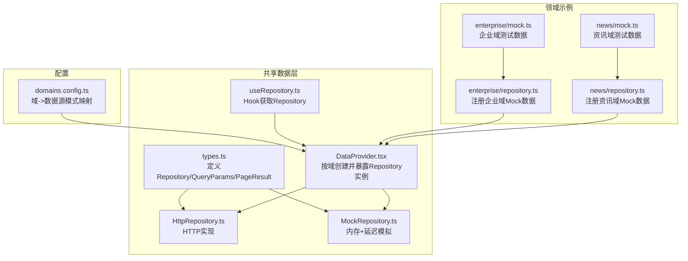
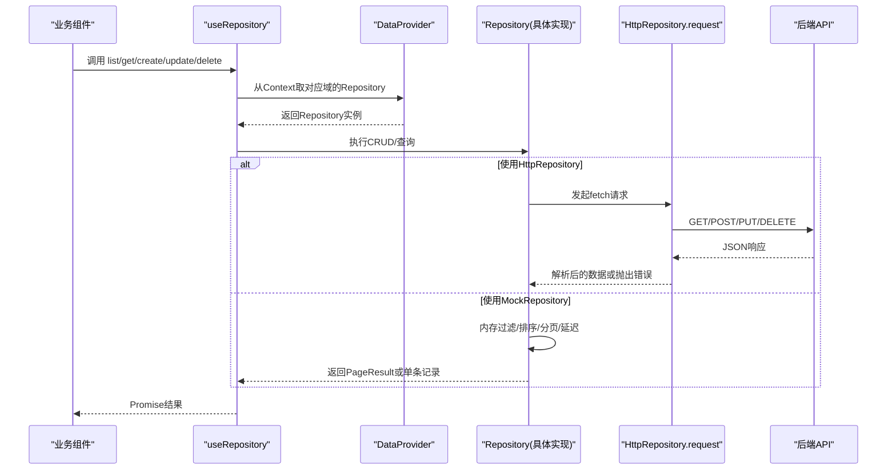
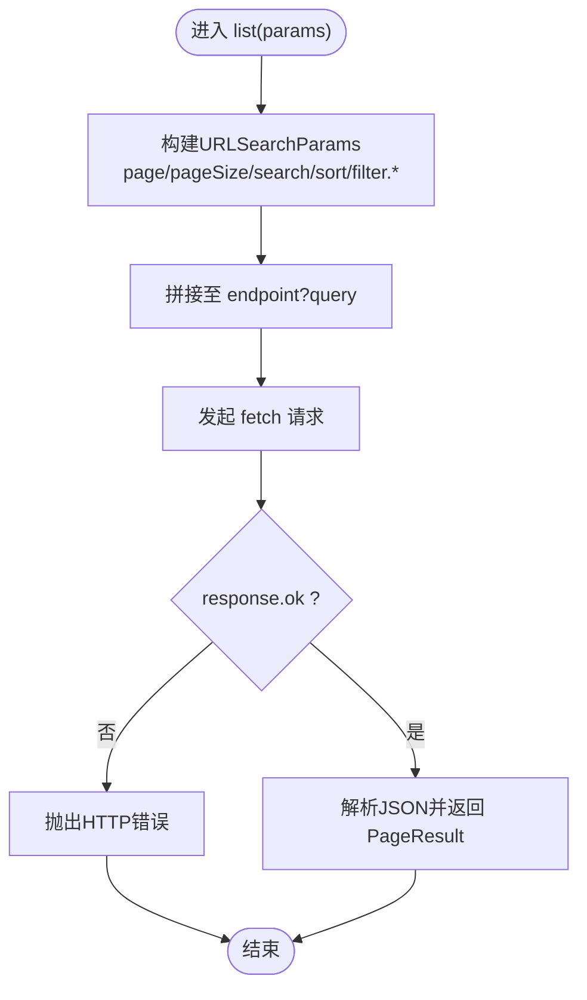
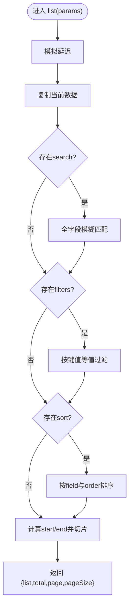
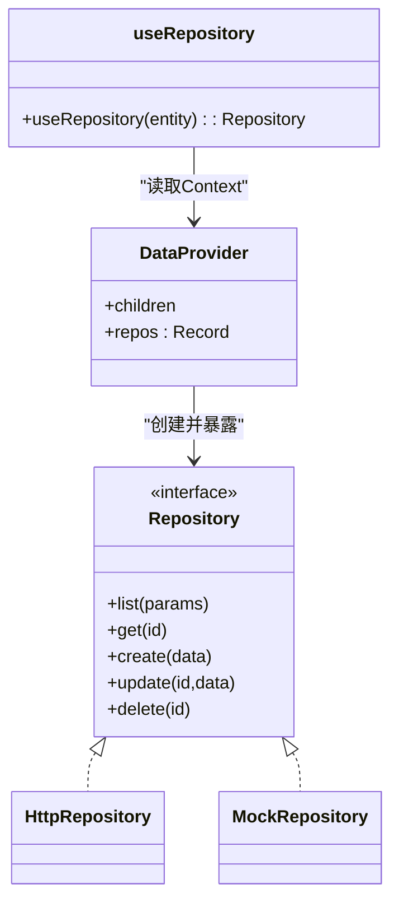
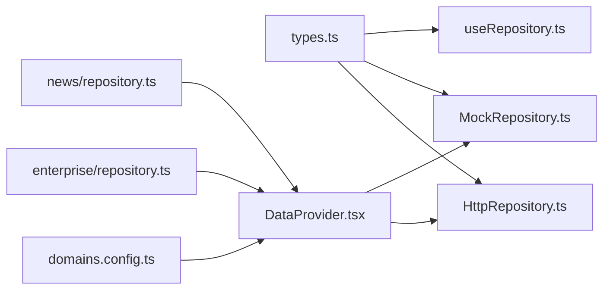

# Repository模式实现

<cite>
**本文引用的文件列表**   
- [HttpRepository.ts](file://hj-admin/src/shared/data/HttpRepository.ts)
- [MockRepository.ts](file://hj-admin/src/shared/data/MockRepository.ts)
- [types.ts](file://hj-admin/src/shared/data/types.ts)
- [useRepository.ts](file://hj-admin/src/shared/data/useRepository.ts)
- [DataProvider.tsx](file://hj-admin/src/shared/data/DataProvider.tsx)
- [domains.config.ts](file://hj-admin/src/config/domains.config.ts)
- [enterprise/repository.ts](file://hj-admin/src/domains/enterprise/repository.ts)
- [news/repository.ts](file://hj-admin/src/domains/news/repository.ts)
- [enterprise/mock.ts](file://hj-admin/src/domains/enterprise/mock.ts)
- [news/mock.ts](file://hj-admin/src/domains/news/mock.ts)
</cite>

## 目录
1. [简介](#简介)
2. [项目结构](#项目结构)
3. [核心组件](#核心组件)
4. [架构总览](#架构总览)
5. [详细组件分析](#详细组件分析)
6. [依赖关系分析](#依赖关系分析)
7. [性能与优化](#性能与优化)
8. [故障排查指南](#故障排查指南)
9. [结论](#结论)
10. [附录：自定义Repository实现与集成指南](#附录自定义repository实现与集成指南)

## 简介
本技术文档围绕项目中实现的Repository设计模式，系统阐述其抽象契约、HTTP与Mock两种具体实现、数据上下文注入机制以及领域注册方式。重点覆盖以下方面：
- Repository统一抽象与类型定义
- HttpRepository的HTTP请求封装、URL构建、参数序列化、响应处理与错误处理
- MockRepository的内存数据存储、CRUD模拟、延迟响应与测试数据管理
- DataProvider与useRepository的数据源切换与获取机制
- 扩展自定义Repository的实现与集成步骤
- 性能优化、缓存策略与重试机制的建议与落地方案

## 项目结构
本项目采用“共享数据层 + 领域注册”的组织方式：
- 共享数据层位于 src/shared/data，提供统一的Repository接口、HTTP与Mock实现、React Hook与上下文提供者
- 领域模块位于 src/domains/<domain>，每个域通过 repository.ts 将自身Mock数据注册到全局注册表
- 配置中心位于 src/config/domains.config.ts，集中声明各域的数据源模式（mock/http）

图表来源
- [types.ts:1-36](file://hj-admin/src/shared/data/types.ts#L1-L36)
- [HttpRepository.ts:1-70](file://hj-admin/src/shared/data/HttpRepository.ts#L1-L70)
- [MockRepository.ts:1-101](file://hj-admin/src/shared/data/MockRepository.ts#L1-L101)
- [DataProvider.tsx:1-44](file://hj-admin/src/shared/data/DataProvider.tsx#L1-L44)
- [useRepository.ts:1-24](file://hj-admin/src/shared/data/useRepository.ts#L1-L24)
- [domains.config.ts:1-18](file://hj-admin/src/config/domains.config.ts#L1-L18)
- [enterprise/repository.ts:1-6](file://hj-admin/src/domains/enterprise/repository.ts#L1-L6)
- [news/repository.ts:1-11](file://hj-admin/src/domains/news/repository.ts#L1-L11)
- [enterprise/mock.ts:1-24](file://hj-admin/src/domains/enterprise/mock.ts#L1-L24)
- [news/mock.ts:1-60](file://hj-admin/src/domains/news/mock.ts#L1-L60)

章节来源
- [types.ts:1-36](file://hj-admin/src/shared/data/types.ts#L1-L36)
- [HttpRepository.ts:1-70](file://hj-admin/src/shared/data/HttpRepository.ts#L1-L70)
- [MockRepository.ts:1-101](file://hj-admin/src/shared/data/MockRepository.ts#L1-L101)
- [DataProvider.tsx:1-44](file://hj-admin/src/shared/data/DataProvider.tsx#L1-L44)
- [useRepository.ts:1-24](file://hj-admin/src/shared/data/useRepository.ts#L1-L24)
- [domains.config.ts:1-18](file://hj-admin/src/config/domains.config.ts#L1-L18)
- [enterprise/repository.ts:1-6](file://hj-admin/src/domains/enterprise/repository.ts#L1-L6)
- [news/repository.ts:1-11](file://hj-admin/src/domains/news/repository.ts#L1-L11)
- [enterprise/mock.ts:1-24](file://hj-admin/src/domains/enterprise/mock.ts#L1-L24)
- [news/mock.ts:1-60](file://hj-admin/src/domains/news/mock.ts#L1-L60)

## 核心组件
- Repository<T> 接口：统一CRUD与分页查询契约，包含 list/get/create/update/delete 方法
- QueryParams/PageResult：标准化查询参数与分页结果结构
- HttpRepository：基于fetch的HTTP实现，负责URL拼接、参数序列化、JSON编解码与基础错误处理
- MockRepository：内存存储，支持关键词搜索、多字段过滤、排序与分页，并提供可配置的延迟以模拟网络
- DataProvider：根据 domains.config 为每个域创建对应Repository实例，并通过React Context暴露
- useRepository：在任意组件中按实体名获取对应域的Repository实例

章节来源
- [types.ts:1-36](file://hj-admin/src/shared/data/types.ts#L1-L36)
- [HttpRepository.ts:1-70](file://hj-admin/src/shared/data/HttpRepository.ts#L1-L70)
- [MockRepository.ts:1-101](file://hj-admin/src/shared/data/MockRepository.ts#L1-L101)
- [DataProvider.tsx:1-44](file://hj-admin/src/shared/data/DataProvider.tsx#L1-L44)
- [useRepository.ts:1-24](file://hj-admin/src/shared/data/useRepository.ts#L1-L24)

## 架构总览
下图展示了从组件调用到数据返回的整体流程，包括数据源选择、请求封装与响应处理。

图表来源
- [useRepository.ts:1-24](file://hj-admin/src/shared/data/useRepository.ts#L1-L24)
- [DataProvider.tsx:1-44](file://hj-admin/src/shared/data/DataProvider.tsx#L1-L44)
- [HttpRepository.ts:1-70](file://hj-admin/src/shared/data/HttpRepository.ts#L1-L70)
- [MockRepository.ts:1-101](file://hj-admin/src/shared/data/MockRepository.ts#L1-L101)

## 详细组件分析

### Repository抽象与类型契约
- 统一接口：list/get/create/update/delete，所有数据访问均通过此契约进行
- 查询参数：支持分页(page/pageSize)、筛选(filters)、排序(sort.field/sort.order)、全文搜索(search)
- 分页结果：包含list/total/page/pageSize，便于前端表格渲染与分页控件联动

章节来源
- [types.ts:1-36](file://hj-admin/src/shared/data/types.ts#L1-L36)

### HttpRepository实现要点
- URL构建：以baseUrl/domain作为端点前缀，GET路径追加id，POST/PUT/DELETE分别对应增删改
- 参数序列化：使用URLSearchParams构造查询字符串；filters以filter.<key>=<value>形式传递
- 请求封装：统一设置Content-Type为application/json，合并外部options
- 响应处理：非ok状态直接抛错；成功则解析JSON返回
- 错误处理：HTTP状态码异常时抛出错误，上层需捕获并提示

图表来源
- [HttpRepository.ts:29-46](file://hj-admin/src/shared/data/HttpRepository.ts#L29-L46)
- [HttpRepository.ts:20-27](file://hj-admin/src/shared/data/HttpRepository.ts#L20-L27)

章节来源
- [HttpRepository.ts:1-70](file://hj-admin/src/shared/data/HttpRepository.ts#L1-L70)

### MockRepository实现要点
- 内存存储：维护一份数组副本，所有操作不持久化
- 延迟模拟：所有异步方法先await一个可配置的setTimeout，模拟网络耗时
- 搜索与过滤：支持全字段模糊匹配与等值过滤
- 排序：支持按指定字段升/降序，空值置后
- 分页：按page/pageSize切片返回，同时返回total用于分页控件
- CRUD：get/find by id，create生成临时id并插入头部，update合并字段，delete按id移除
- 辅助能力：getAll()用于Tab计数等非分页场景

图表来源
- [MockRepository.ts:20-67](file://hj-admin/src/shared/data/MockRepository.ts#L20-L67)

章节来源
- [MockRepository.ts:1-101](file://hj-admin/src/shared/data/MockRepository.ts#L1-L101)

### DataProvider与useRepository协作
- DataProvider依据domains.config为每个域创建Repository实例（mock或http），并通过React Context暴露
- useRepository在组件内通过Context获取对应entity的Repository，若未注册则返回空操作的fallback以避免崩溃

图表来源
- [DataProvider.tsx:1-44](file://hj-admin/src/shared/data/DataProvider.tsx#L1-L44)
- [useRepository.ts:1-24](file://hj-admin/src/shared/data/useRepository.ts#L1-L24)
- [HttpRepository.ts:1-70](file://hj-admin/src/shared/data/HttpRepository.ts#L1-L70)
- [MockRepository.ts:1-101](file://hj-admin/src/shared/data/MockRepository.ts#L1-L101)

章节来源
- [DataProvider.tsx:1-44](file://hj-admin/src/shared/data/DataProvider.tsx#L1-L44)
- [useRepository.ts:1-24](file://hj-admin/src/shared/data/useRepository.ts#L1-L24)

### 领域注册与数据绑定
- 每个领域通过自身的repository.ts调用registerMockData，将初始数据写入全局注册表
- DataProvider在启动时读取该注册表，为对应域初始化MockRepository
- 示例：企业域与资讯域分别注册了各自的Mock数据

章节来源
- [enterprise/repository.ts:1-6](file://hj-admin/src/domains/enterprise/repository.ts#L1-L6)
- [news/repository.ts:1-11](file://hj-admin/src/domains/news/repository.ts#L1-L11)
- [enterprise/mock.ts:1-24](file://hj-admin/src/domains/enterprise/mock.ts#L1-L24)
- [news/mock.ts:1-60](file://hj-admin/src/domains/news/mock.ts#L1-L60)

## 依赖关系分析
- types.ts被HttpRepository、MockRepository、useRepository共同引用，构成契约基础
- DataProvider依赖domains.config决定数据源模式，并组合HttpRepository/MockRepository
- 领域repository.ts仅负责向DataProvider注册Mock数据，不耦合具体实现细节
- useRepository解耦组件与数据源，使页面代码无需关心具体实现

图表来源
- [types.ts:1-36](file://hj-admin/src/shared/data/types.ts#L1-L36)
- [HttpRepository.ts:1-70](file://hj-admin/src/shared/data/HttpRepository.ts#L1-L70)
- [MockRepository.ts:1-101](file://hj-admin/src/shared/data/MockRepository.ts#L1-L101)
- [useRepository.ts:1-24](file://hj-admin/src/shared/data/useRepository.ts#L1-L24)
- [DataProvider.tsx:1-44](file://hj-admin/src/shared/data/DataProvider.tsx#L1-L44)
- [domains.config.ts:1-18](file://hj-admin/src/config/domains.config.ts#L1-L18)
- [enterprise/repository.ts:1-6](file://hj-admin/src/domains/enterprise/repository.ts#L1-L6)
- [news/repository.ts:1-11](file://hj-admin/src/domains/news/repository.ts#L1-L11)

章节来源
- [types.ts:1-36](file://hj-admin/src/shared/data/types.ts#L1-L36)
- [HttpRepository.ts:1-70](file://hj-admin/src/shared/data/HttpRepository.ts#L1-L70)
- [MockRepository.ts:1-101](file://hj-admin/src/shared/data/MockRepository.ts#L1-L101)
- [useRepository.ts:1-24](file://hj-admin/src/shared/data/useRepository.ts#L1-L24)
- [DataProvider.tsx:1-44](file://hj-admin/src/shared/data/DataProvider.tsx#L1-L44)
- [domains.config.ts:1-18](file://hj-admin/src/config/domains.config.ts#L1-L18)
- [enterprise/repository.ts:1-6](file://hj-admin/src/domains/enterprise/repository.ts#L1-L6)
- [news/repository.ts:1-11](file://hj-admin/src/domains/news/repository.ts#L1-L11)

## 性能与优化
以下为通用建议与实践方向（结合现有实现可扩展）：
- 请求级优化
  - 去抖与节流：对搜索输入与频繁翻页做防抖/节流，减少重复请求
  - 并发控制：批量更新时限制并发数，避免雪崩
  - 取消请求：在组件卸载或路由切换时取消未完成请求，避免状态污染
- 缓存策略
  - 本地缓存：对热点数据（如字典、标签）做短期缓存，配合失效策略
  - 请求级缓存：相同参数的list请求在短窗口内复用结果
  - 乐观更新：对create/update/delete先更新UI，失败再回滚
- 重试机制
  - 指数退避：对瞬时网络错误进行有限次重试，逐步增加等待时间
  - 幂等性：确保POST/PUT/DELETE具备幂等语义或后端保证
- 渲染优化
  - 虚拟滚动：大数据量列表使用虚拟滚动降低DOM压力
  - 增量更新：只更新变更行，避免整表重渲染
- 内存与GC
  - MockRepository在大数据集下注意slice与排序开销，必要时引入索引或分片

[本节为通用指导，不直接分析具体文件]

## 故障排查指南
- 未找到Repository
  - 现象：useRepository返回空操作fallback并打印警告
  - 排查：确认domains.config中是否包含该域；确认领域repository.ts是否正确调用registerMockData
- HTTP错误
  - 现象：HttpRepository在非ok状态抛出错误
  - 排查：检查后端状态码与消息；确认URL与参数格式是否符合约定
- 数据为空或分页异常
  - 现象：list返回空或total不正确
  - 排查：检查filters/search/sort参数；确认MockRepository数据是否存在；核对后端分页逻辑
- 延迟导致卡顿
  - 现象：MockRepository默认延迟影响交互体验
  - 排查：调整构造函数delayMs或在开发环境关闭延迟

章节来源
- [useRepository.ts:1-24](file://hj-admin/src/shared/data/useRepository.ts#L1-L24)
- [HttpRepository.ts:20-27](file://hj-admin/src/shared/data/HttpRepository.ts#L20-L27)
- [MockRepository.ts:16-18](file://hj-admin/src/shared/data/MockRepository.ts#L16-L18)
- [DataProvider.tsx:26-38](file://hj-admin/src/shared/data/DataProvider.tsx#L26-L38)

## 结论
本项目通过Repository模式实现了数据访问的统一抽象，并以HttpRepository与MockRepository双实现支撑前后端联调与独立开发。DataProvider与useRepository进一步解耦了数据源选择与组件使用，使得在不同数据源之间切换仅需修改配置。后续可在现有基础上引入缓存、重试、取消请求与更完善的错误上报，以提升稳定性与用户体验。

[本节为总结性内容，不直接分析具体文件]

## 附录：自定义Repository实现与集成指南

### 新增自定义数据源（示例：GraphQLRepository）
- 步骤
  1. 新建实现类，遵循Repository<T>接口
  2. 在DataProvider中根据新的DataSourceMode创建实例并注入Context
  3. 在domains.config中添加新域的配置项
  4. 在对应领域的repository.ts中注册初始数据（如需）
  5. 在组件中使用useRepository(entity)获取并使用

- 关键对接点
  - 类型契约：参考types.ts中的Repository/QueryParams/PageResult
  - 数据源选择：参考DataProvider.tsx中按mode分支创建实例的逻辑
  - 领域注册：参考enterprise/repository.ts与news/repository.ts的注册方式

章节来源
- [types.ts:1-36](file://hj-admin/src/shared/data/types.ts#L1-L36)
- [DataProvider.tsx:26-38](file://hj-admin/src/shared/data/DataProvider.tsx#L26-L38)
- [enterprise/repository.ts:1-6](file://hj-admin/src/domains/enterprise/repository.ts#L1-L6)
- [news/repository.ts:1-11](file://hj-admin/src/domains/news/repository.ts#L1-L11)

### 常见集成问题与建议
- 参数命名不一致：确保QueryParams字段与后端一致，必要时在Repository内部做适配转换
- 错误边界：在组件层统一捕获Promise错误，展示友好提示
- 类型安全：为不同域定义强类型T，提升IDE提示与编译期校验

[本节为实践指导，不直接分析具体文件]