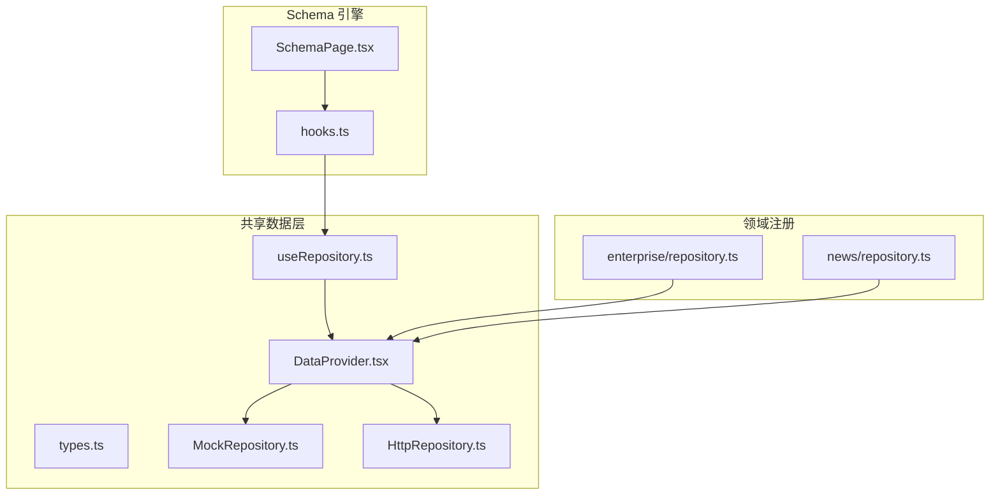
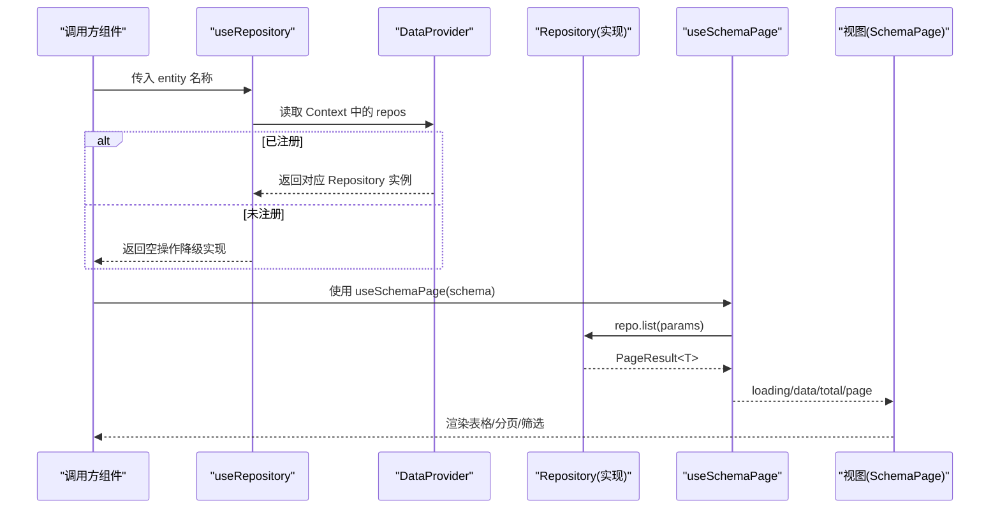
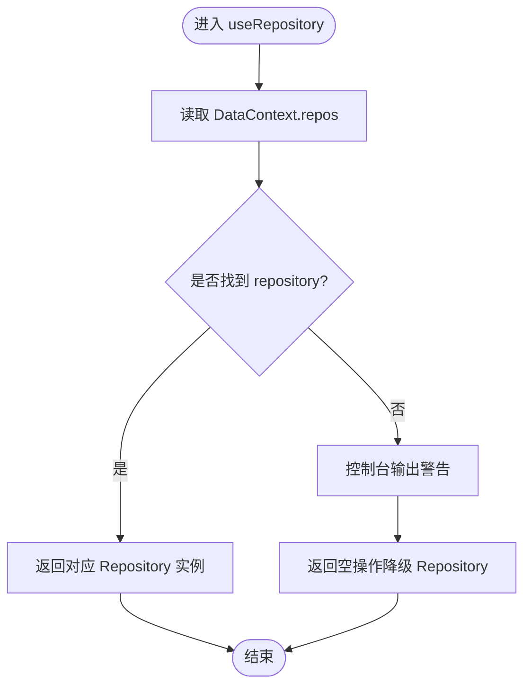
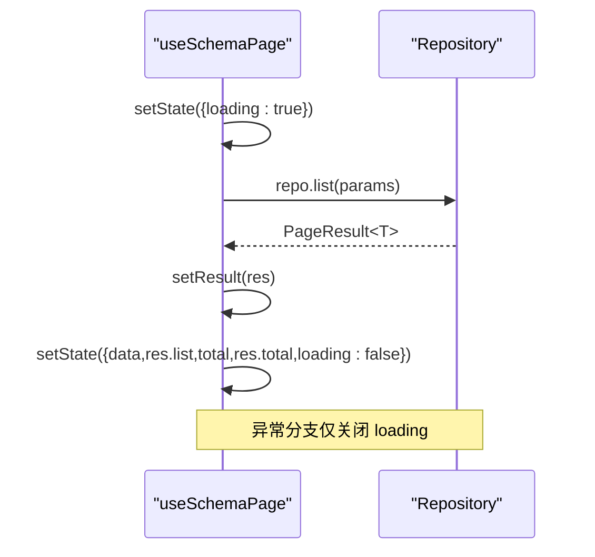
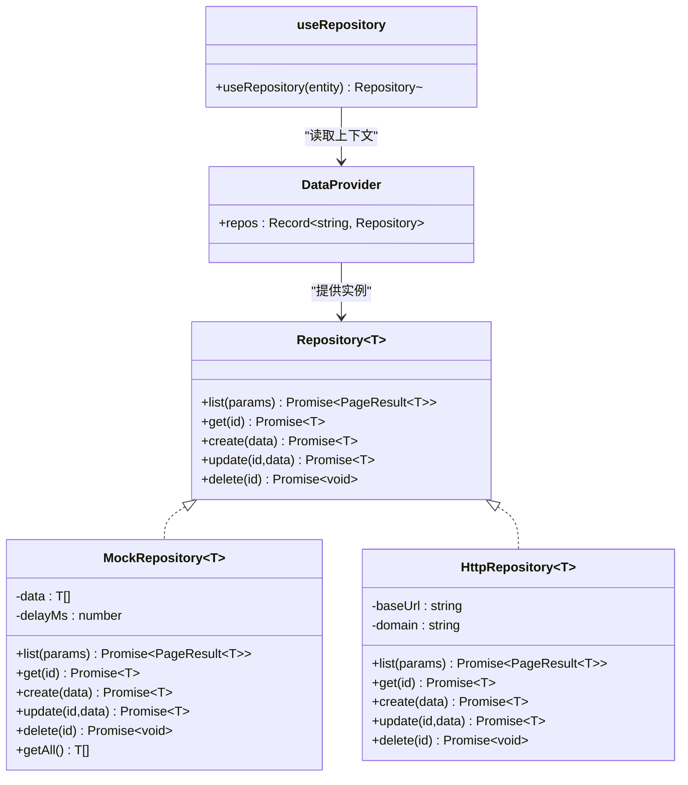

# useRepository Hook封装

<cite>
**本文引用的文件**
- [useRepository.ts](file://hj-admin/src/shared/data/useRepository.ts)
- [DataProvider.tsx](file://hj-admin/src/shared/data/DataProvider.tsx)
- [types.ts](file://hj-admin/src/shared/data/types.ts)
- [HttpRepository.ts](file://hj-admin/src/shared/data/HttpRepository.ts)
- [MockRepository.ts](file://hj-admin/src/shared/data/MockRepository.ts)
- [hooks.ts](file://hj-admin/src/shared/schema-engine/hooks.ts)
- [SchemaPage.tsx](file://hj-admin/src/shared/schema-engine/SchemaPage.tsx)
- [enterprise/repository.ts](file://hj-admin/src/domains/enterprise/repository.ts)
- [news/repository.ts](file://hj-admin/src/domains/news/repository.ts)
</cite>

## 目录
1. [简介](#简介)
2. [项目结构](#项目结构)
3. [核心组件](#核心组件)
4. [架构总览](#架构总览)
5. [详细组件分析](#详细组件分析)
6. [依赖关系分析](#依赖关系分析)
7. [性能考量](#性能考量)
8. [故障排查指南](#故障排查指南)
9. [结论](#结论)
10. [附录：使用模式与最佳实践](#附录使用模式与最佳实践)

## 简介
本文件围绕 useRepository Hook 的设计与实现，系统性阐述其在数据访问层中的职责、状态管理策略、错误处理、缓存机制现状与扩展点、批量操作与事务性支持建议，以及性能优化技巧（防抖、节流、懒加载）。文档同时提供基于现有代码的可视化图示与“代码片段路径”指引，帮助读者快速理解并扩展该 Hook。

## 项目结构
useRepository 位于共享数据层，配合 DataProvider 提供的上下文，为 Schema 页面及任意组件按域（domain）注入 Repository 实例。当前仓库包含两类 Repository 实现：
- MockRepository：内存模拟，支持搜索、筛选、排序、分页，便于前端开发体验与真实 API 一致。
- HttpRepository：HTTP 客户端封装，面向后端 RESTful API。

图表来源
- [useRepository.ts:1-24](file://hj-admin/src/shared/data/useRepository.ts#L1-L24)
- [DataProvider.tsx:1-44](file://hj-admin/src/shared/data/DataProvider.tsx#L1-L44)
- [types.ts:1-36](file://hj-admin/src/shared/data/types.ts#L1-L36)
- [MockRepository.ts:1-101](file://hj-admin/src/shared/data/MockRepository.ts#L1-L101)
- [HttpRepository.ts:1-70](file://hj-admin/src/shared/data/HttpRepository.ts#L1-L70)
- [SchemaPage.tsx:1-226](file://hj-admin/src/shared/schema-engine/SchemaPage.tsx#L1-L226)
- [hooks.ts:1-79](file://hj-admin/src/shared/schema-engine/hooks.ts#L1-L79)
- [enterprise/repository.ts:1-6](file://hj-admin/src/domains/enterprise/repository.ts#L1-L6)
- [news/repository.ts:1-11](file://hj-admin/src/domains/news/repository.ts#L1-L11)

章节来源
- [useRepository.ts:1-24](file://hj-admin/src/shared/data/useRepository.ts#L1-L24)
- [DataProvider.tsx:1-44](file://hj-admin/src/shared/data/DataProvider.tsx#L1-L44)
- [types.ts:1-36](file://hj-admin/src/shared/data/types.ts#L1-L36)
- [MockRepository.ts:1-101](file://hj-admin/src/shared/data/MockRepository.ts#L1-L101)
- [HttpRepository.ts:1-70](file://hj-admin/src/shared/data/HttpRepository.ts#L1-L70)
- [SchemaPage.tsx:1-226](file://hj-admin/src/shared/schema-engine/SchemaPage.tsx#L1-L226)
- [hooks.ts:1-79](file://hj-admin/src/shared/schema-engine/hooks.ts#L1-L79)
- [enterprise/repository.ts:1-6](file://hj-admin/src/domains/enterprise/repository.ts#L1-L6)
- [news/repository.ts:1-11](file://hj-admin/src/domains/news/repository.ts#L1-L11)

## 核心组件
- useRepository：从 React Context 中按 entity 名称获取对应域的 Repository 实例；若未注册则返回空操作的降级实现，避免运行时崩溃。
- DataProvider：根据 domainConfig 动态创建各域的 Repository 实例（mock 或 http），并通过 Context 暴露给子树。
- Repository 接口：统一 list/get/create/update/delete 契约，定义查询参数与分页结果类型。
- MockRepository：内存数据源，支持关键词搜索、多字段筛选、排序、分页，并模拟网络延迟。
- HttpRepository：基于 fetch 的 HTTP 客户端，将 QueryParams 映射为 URL 查询字符串，执行标准 CRUD。

章节来源
- [useRepository.ts:1-24](file://hj-admin/src/shared/data/useRepository.ts#L1-L24)
- [DataProvider.tsx:1-44](file://hj-admin/src/shared/data/DataProvider.tsx#L1-L44)
- [types.ts:1-36](file://hj-admin/src/shared/data/types.ts#L1-L36)
- [MockRepository.ts:1-101](file://hj-admin/src/shared/data/MockRepository.ts#L1-L101)
- [HttpRepository.ts:1-70](file://hj-admin/src/shared/data/HttpRepository.ts#L1-L70)

## 架构总览
useRepository 作为“轻量级工厂”，负责解析实体名并返回对应的 Repository 实例。上层 Schema 引擎通过 useSchemaPage 组合 useState/useEffect 完成列表加载、筛选、分页等状态管理，最终由 Repository 实现具体数据访问。

图表来源
- [useRepository.ts:1-24](file://hj-admin/src/shared/data/useRepository.ts#L1-L24)
- [DataProvider.tsx:1-44](file://hj-admin/src/shared/data/DataProvider.tsx#L1-L44)
- [hooks.ts:1-79](file://hj-admin/src/shared/schema-engine/hooks.ts#L1-L79)
- [SchemaPage.tsx:1-226](file://hj-admin/src/shared/schema-engine/SchemaPage.tsx#L1-L226)

## 详细组件分析

### useRepository 设计与行为
- 作用：在任意组件内通过 entity 名称获取对应域的 Repository。
- 容错：当 entity 未在 DataProvider 中注册时，返回一个空操作的 Repository，保证 UI 不崩溃，并在控制台输出警告信息。
- 类型：泛型 T 默认 Record<string, unknown>，可被上层 useSchemaPage 推导为具体实体类型。

图表来源
- [useRepository.ts:1-24](file://hj-admin/src/shared/data/useRepository.ts#L1-L24)

章节来源
- [useRepository.ts:1-24](file://hj-admin/src/shared/data/useRepository.ts#L1-L24)

### DataProvider 与 Repository 装配
- 装配逻辑：遍历 domainConfig，按 mode 选择 MockRepository 或 HttpRepository。
- Mock 数据注册：各域通过 registerMockData 在启动阶段注入初始数据。
- 性能：使用 useMemo 构建 repos 映射，避免重复创建。

章节来源
- [DataProvider.tsx:1-44](file://hj-admin/src/shared/data/DataProvider.tsx#L1-L44)
- [enterprise/repository.ts:1-6](file://hj-admin/src/domains/enterprise/repository.ts#L1-L6)
- [news/repository.ts:1-11](file://hj-admin/src/domains/news/repository.ts#L1-L11)

### Repository 接口与类型契约
- 统一方法：list/get/create/update/delete。
- 查询参数：支持分页、筛选、排序、关键词搜索。
- 分页结果：包含 list、total、page、pageSize。

章节来源
- [types.ts:1-36](file://hj-admin/src/shared/data/types.ts#L1-L36)

### MockRepository 实现要点
- 内存过滤/分页/排序：对本地数组进行链式处理，最后切片返回。
- 模拟延迟：所有异步方法均 await 一段随机延迟，以贴近真实网络。
- 全量数据：提供 getAll 用于 Tab 计数等场景。

章节来源
- [MockRepository.ts:1-101](file://hj-admin/src/shared/data/MockRepository.ts#L1-L101)

### HttpRepository 实现要点
- 请求封装：统一 headers 与错误判断，失败抛出异常。
- 参数映射：将 QueryParams 转为 URLSearchParams，filters 前缀 filter.xxx。
- 标准 CRUD：GET/POST/PUT/DELETE 对应 get/list/create/update/delete。

章节来源
- [HttpRepository.ts:1-70](file://hj-admin/src/shared/data/HttpRepository.ts#L1-L70)

### Schema 引擎的状态管理（useState + useEffect）
- 状态：loading、data、total、page、pageSize、filters、activeTab、selectedRowKeys。
- 数据加载：fetchData 设置 loading=true，调用 repo.list，成功后更新 data/total/loading，失败仅关闭 loading。
- 副作用：useEffect 监听 page、pageSize、filters 变化触发重新加载。
- 交互：setFilter/resetFilters/setPage/setActiveTab 等回调驱动状态变更。

图表来源
- [hooks.ts:1-79](file://hj-admin/src/shared/schema-engine/hooks.ts#L1-L79)

章节来源
- [hooks.ts:1-79](file://hj-admin/src/shared/schema-engine/hooks.ts#L1-L79)
- [SchemaPage.tsx:1-226](file://hj-admin/src/shared/schema-engine/SchemaPage.tsx#L1-L226)

## 依赖关系分析
- useRepository 依赖 DataProvider 的 Context 和 types 的 Repository 接口。
- DataProvider 依赖 domainConfig 与各域注册的 mock 数据。
- Schema 引擎 hooks 依赖 useRepository 与 types 的 QueryParams/PageResult。
- 领域模块通过 registerMockData 向 DataProvider 注入初始数据。

图表来源
- [types.ts:1-36](file://hj-admin/src/shared/data/types.ts#L1-L36)
- [MockRepository.ts:1-101](file://hj-admin/src/shared/data/MockRepository.ts#L1-L101)
- [HttpRepository.ts:1-70](file://hj-admin/src/shared/data/HttpRepository.ts#L1-L70)
- [DataProvider.tsx:1-44](file://hj-admin/src/shared/data/DataProvider.tsx#L1-L44)
- [useRepository.ts:1-24](file://hj-admin/src/shared/data/useRepository.ts#L1-L24)

章节来源
- [types.ts:1-36](file://hj-admin/src/shared/data/types.ts#L1-L36)
- [MockRepository.ts:1-101](file://hj-admin/src/shared/data/MockRepository.ts#L1-L101)
- [HttpRepository.ts:1-70](file://hj-admin/src/shared/data/HttpRepository.ts#L1-L70)
- [DataProvider.tsx:1-44](file://hj-admin/src/shared/data/DataProvider.tsx#L1-L44)
- [useRepository.ts:1-24](file://hj-admin/src/shared/data/useRepository.ts#L1-L24)

## 性能考量
- 当前实现特点
  - useRepository 本身无缓存与去重，仅做上下文查找与降级处理。
  - MockRepository 每次 list 都会执行内存过滤/排序/分页，适合小数据集；大数据集需考虑服务端分页与索引。
  - HttpRepository 每次请求均发起网络 IO，无本地缓存与并发控制。
  - useSchemaPage 在 page、pageSize、filters 变化时触发重新加载，未内置防抖/节流。

- 可扩展优化方向（建议）
  - 防抖/节流：在 useSchemaPage 中对 filters/search 输入增加防抖，减少频繁请求。
  - 本地缓存：在 useRepository 或 Repository 层引入键控缓存（如按 entity+params 生成 key），结合过期策略与失效事件。
  - 并发控制：对相同 key 的请求合并，避免重复网络请求。
  - 懒加载：按需加载领域模块与 mock 数据，降低首屏体积。
  - 增量更新：在 create/update/delete 后局部刷新相关条目，而非全量拉取。

[本节为通用性能讨论，不直接分析具体文件]

## 故障排查指南
- 常见现象
  - 控制台出现“Repository not found for entity”警告：说明 entity 未在 domains.config 中配置或未注册到 DataProvider。
  - 列表为空或报错：检查 QueryParams 是否正确传递、后端是否返回期望的分页结构。
  - 删除/更新无效：确认 id 是否存在于数据源，MockRepository 会抛错提示未找到。

- 定位步骤
  - 确认 domainConfig 中是否包含目标 entity 且 mode 正确。
  - 确认对应域的 repository.ts 是否调用了 registerMockData 注入初始数据。
  - 在 useSchemaPage 的 fetchData 捕获分支查看错误日志。

章节来源
- [useRepository.ts:1-24](file://hj-admin/src/shared/data/useRepository.ts#L1-L24)
- [DataProvider.tsx:1-44](file://hj-admin/src/shared/data/DataProvider.tsx#L1-L44)
- [MockRepository.ts:1-101](file://hj-admin/src/shared/data/MockRepository.ts#L1-L101)
- [HttpRepository.ts:1-70](file://hj-admin/src/shared/data/HttpRepository.ts#L1-L70)
- [hooks.ts:1-79](file://hj-admin/src/shared/schema-engine/hooks.ts#L1-L79)

## 结论
useRepository 在当前仓库中扮演“实体到 Repository 实例”的轻量桥接角色，配合 DataProvider 的装配与 Schema 引擎的状态管理，形成清晰的数据流。当前版本未内置缓存、批量与事务能力，但通过统一的 Repository 接口与清晰的上下文注入方式，易于扩展这些能力。建议在 useRepository 或 Repository 层引入键控缓存、请求合并与失效策略，并在 useSchemaPage 中增加防抖/节流以提升交互体验。

[本节为总结性内容，不直接分析具体文件]

## 附录：使用模式与最佳实践

- 基本用法
  - 在组件中通过 useRepository('entity') 获取 Repository 实例，再调用 list/get/create/update/delete。
  - 在 Schema 页面中，优先使用 useSchemaPage 管理列表状态与加载流程。

- 自定义 Hook 扩展建议
  - 在 useRepository 外层封装带缓存的 useCachedRepository：维护 key→Promise 的缓存表，支持过期时间与手动失效。
  - 在 useSchemaPage 外层封装 useDebouncedList：对 search/filters 输入进行防抖后再触发 fetchData。
  - 在 Repository 层实现批量操作：例如 batchDelete(ids)，内部串行或并行执行 delete，并提供成功/失败回调与重试策略。

- 缓存机制设计要点（建议）
  - 缓存键：entity + JSON.stringify(sorted params)。
  - 过期策略：时间戳 TTL 或版本号失效。
  - 失效时机：create/update/delete 成功后主动失效相关 key。
  - 并发合并：同一 key 的多次请求合并为一次，完成后广播结果。

- 批量与事务性（建议）
  - 批量操作：提供 batchCreate/batchUpdate/batchDelete，内部聚合请求或分片提交。
  - 事务性：在应用层维护操作队列，顺序执行并在任一失败时回滚已生效的前置操作（如先记录快照，再逐步撤销）。

- 性能优化清单
  - 输入防抖：search 与复杂筛选使用防抖。
  - 列表节流：滚动加载或翻页节流。
  - 懒加载：按需加载领域模块与 mock 数据。
  - 局部更新：写操作后只更新受影响行，避免整表重绘。

[本节为概念性与建议性内容，不直接分析具体文件]