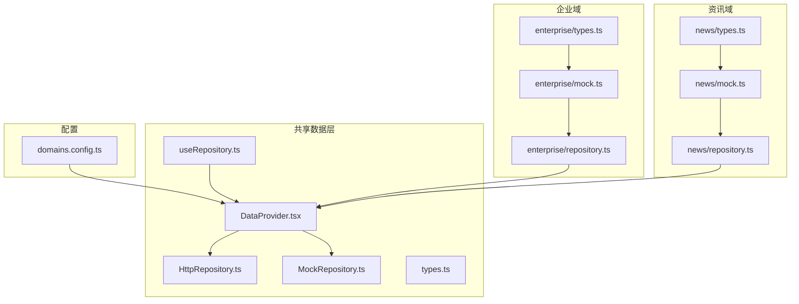
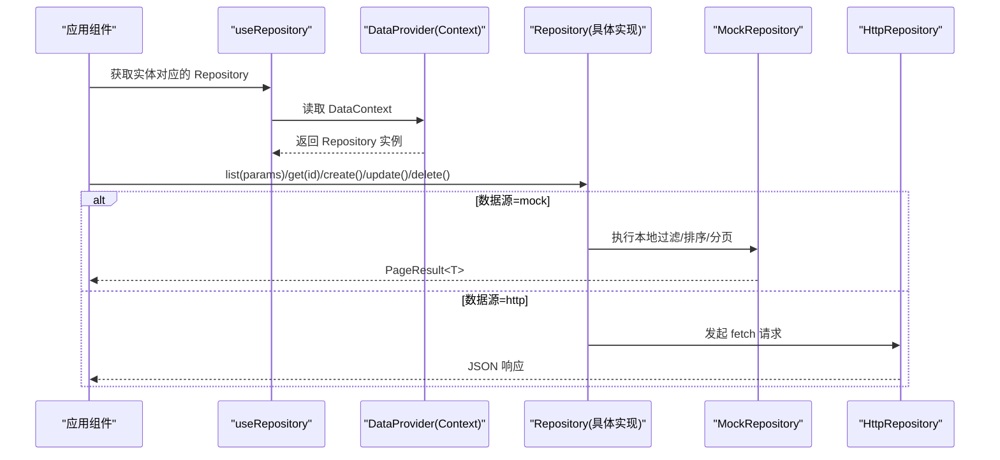
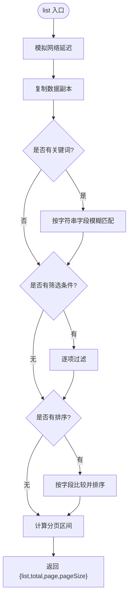
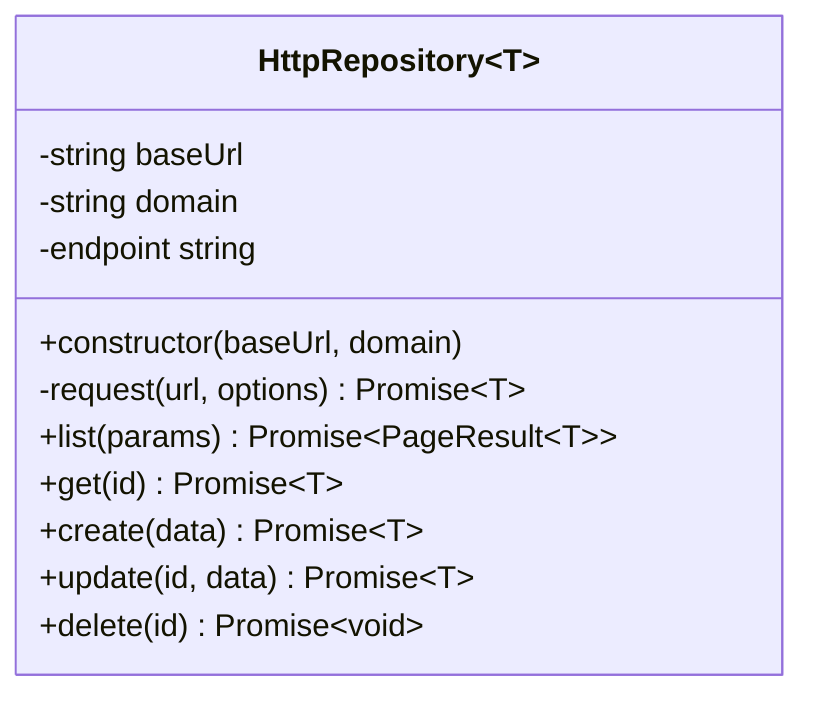
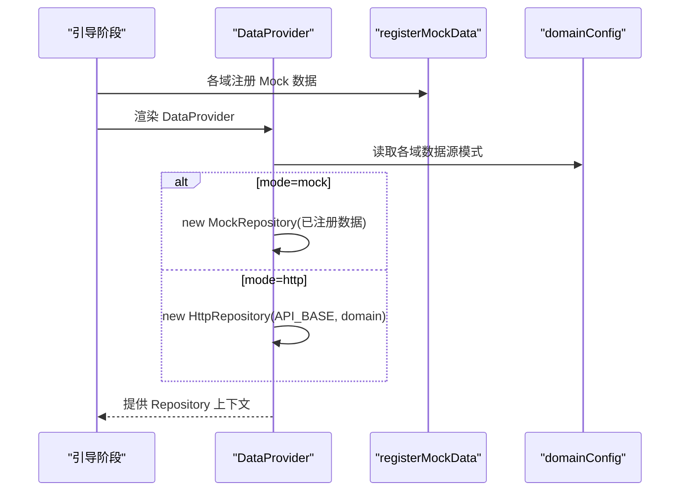
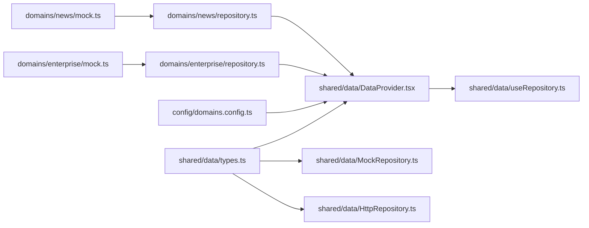

# 数据管理层

<cite>
**本文引用的文件**   
- [DataProvider.tsx](file://hj-admin/src/shared/data/DataProvider.tsx)
- [HttpRepository.ts](file://hj-admin/src/shared/data/HttpRepository.ts)
- [MockRepository.ts](file://hj-admin/src/shared/data/MockRepository.ts)
- [useRepository.ts](file://hj-admin/src/shared/data/useRepository.ts)
- [types.ts](file://hj-admin/src/shared/data/types.ts)
- [domains.config.ts](file://hj-admin/src/config/domains.config.ts)
- [repository.ts（企业域）](file://hj-admin/src/domains/enterprise/repository.ts)
- [repository.ts（资讯域）](file://hj-admin/src/domains/news/repository.ts)
- [mock.ts（企业域）](file://hj-admin/src/domains/enterprise/mock.ts)
- [mock.ts（资讯域）](file://hj-admin/src/domains/news/mock.ts)
- [types.ts（企业域）](file://hj-admin/src/domains/enterprise/types.ts)
- [types.ts（资讯域）](file://hj-admin/src/domains/news/types.ts)
</cite>

## 目录
1. [简介](#简介)
2. [项目结构](#项目结构)
3. [核心组件](#核心组件)
4. [架构总览](#架构总览)
5. [详细组件分析](#详细组件分析)
6. [依赖关系分析](#依赖关系分析)
7. [性能考量](#性能考量)
8. [故障排除指南](#故障排除指南)
9. [结论](#结论)
10. [附录](#附录)

## 简介
本技术文档聚焦于前端数据管理层的实现与最佳实践，围绕 Repository 模式构建统一的数据访问抽象层，提供 MockRepository 与 HttpRepository 两种具体实现；通过 DataProvider 进行上下文管理与数据源切换；使用 useRepository Hook 在组件中获取领域对应的 Repository。文档同时涵盖类型系统、错误处理、重试机制、请求拦截器扩展点、以及从开发到生产的无缝切换策略，并给出集成后端 API 的完整示例与排障建议。

## 项目结构
数据管理层位于 shared/data 目录，配合 config/domains.config.ts 完成按域的数据源配置，各业务域（如 enterprise、news）通过各自的 repository.ts 注册 Mock 数据，并在需要时引入类型定义与样例数据。

图表来源
- [DataProvider.tsx:1-44](file://hj-admin/src/shared/data/DataProvider.tsx#L1-L44)
- [HttpRepository.ts:1-70](file://hj-admin/src/shared/data/HttpRepository.ts#L1-L70)
- [MockRepository.ts:1-101](file://hj-admin/src/shared/data/MockRepository.ts#L1-L101)
- [useRepository.ts:1-24](file://hj-admin/src/shared/data/useRepository.ts#L1-L24)
- [types.ts:1-36](file://hj-admin/src/shared/data/types.ts#L1-L36)
- [domains.config.ts:1-18](file://hj-admin/src/config/domains.config.ts#L1-L18)
- [repository.ts（企业域）:1-6](file://hj-admin/src/domains/enterprise/repository.ts#L1-L6)
- [repository.ts（资讯域）:1-11](file://hj-admin/src/domains/news/repository.ts#L1-L11)
- [mock.ts（企业域）:1-24](file://hj-admin/src/domains/enterprise/mock.ts#L1-L24)
- [mock.ts（资讯域）:1-60](file://hj-admin/src/domains/news/mock.ts#L1-L60)
- [types.ts（企业域）:1-50](file://hj-admin/src/domains/enterprise/types.ts#L1-L50)
- [types.ts（资讯域）:1-50](file://hj-admin/src/domains/news/types.ts#L1-L50)

章节来源
- [DataProvider.tsx:1-44](file://hj-admin/src/shared/data/DataProvider.tsx#L1-L44)
- [domains.config.ts:1-18](file://hj-admin/src/config/domains.config.ts#L1-L18)

## 核心组件
- Repository 抽象接口：定义 list/get/create/update/delete 的统一契约，支持分页、排序、筛选与搜索参数。
- MockRepository：内存数据源，模拟网络延迟，提供本地过滤、排序、分页能力，便于前端独立开发与联调。
- HttpRepository：HTTP 客户端实现，将 Repository 方法映射为 RESTful 请求，构造查询参数与路径。
- DataProvider：基于 React Context 提供按域解析的 Repository 实例，依据 domainConfig 选择 mock/http 数据源。
- useRepository：Hook 用于在任意组件中按实体名获取对应域的 Repository，缺失时返回空操作 fallback 避免崩溃。
- 类型体系：QueryParams/PageResult/Repository/DomainDataSourceConfig 等核心类型，确保跨模块一致性与可维护性。

章节来源
- [types.ts:1-36](file://hj-admin/src/shared/data/types.ts#L1-L36)
- [MockRepository.ts:1-101](file://hj-admin/src/shared/data/MockRepository.ts#L1-L101)
- [HttpRepository.ts:1-70](file://hj-admin/src/shared/data/HttpRepository.ts#L1-L70)
- [DataProvider.tsx:1-44](file://hj-admin/src/shared/data/DataProvider.tsx#L1-L44)
- [useRepository.ts:1-24](file://hj-admin/src/shared/data/useRepository.ts#L1-L24)

## 架构总览
下图展示了数据流与控制流：应用启动后，DataProvider 根据 domains.config.ts 为每个域创建对应的 Repository 实例并注入 Context；组件通过 useRepository 获取指定域的 Repository；调用方以统一的 QueryParams 发起查询，由具体实现负责执行（本地或远程）。

图表来源
- [DataProvider.tsx:26-41](file://hj-admin/src/shared/data/DataProvider.tsx#L26-L41)
- [useRepository.ts:8-23](file://hj-admin/src/shared/data/useRepository.ts#L8-L23)
- [MockRepository.ts:20-67](file://hj-admin/src/shared/data/MockRepository.ts#L20-L67)
- [HttpRepository.ts:29-46](file://hj-admin/src/shared/data/HttpRepository.ts#L29-L46)

## 详细组件分析

### Repository 抽象与类型设计
- 查询参数 QueryParams 包含分页、筛选、排序与关键词搜索字段，适配通用列表场景。
- 分页结果 PageResult 提供 list/total/page/pageSize 标准结构，便于 UI 渲染与交互。
- Repository<T> 泛型接口约束所有数据访问行为，保证 Mock 与 HTTP 实现的一致性。
- DomainDataSourceConfig 用于声明各域的数据源模式，驱动运行时选择。

章节来源
- [types.ts:1-36](file://hj-admin/src/shared/data/types.ts#L1-L36)

### MockRepository 实现要点
- 内存数据副本：构造函数复制初始数据，避免外部修改影响内部状态。
- 模拟延迟：所有异步方法均等待固定时长，还原真实网络体验。
- 过滤与排序：支持多条件 filters、search 全文匹配、sort 字段比较（含中文数字排序）。
- 分页：基于 page/pageSize 计算切片范围，返回 total 与实际页码。
- CRUD：get 不存在抛错；create 生成 id 并插入头部；update 合并字段；delete 移除元素。
- 全量读取：getAll 供统计与计数等场景使用。

图表来源
- [MockRepository.ts:20-67](file://hj-admin/src/shared/data/MockRepository.ts#L20-L67)

章节来源
- [MockRepository.ts:1-101](file://hj-admin/src/shared/data/MockRepository.ts#L1-L101)

### HttpRepository 实现要点
- 端点拼接：baseUrl/domain 组合成资源根路径。
- 请求封装：统一设置 Content-Type，非 ok 响应抛出错误，自动解析 JSON。
- 列表查询：将 QueryParams 序列化为 URLSearchParams，filters 前缀 filter.，sort 拆分为 sortField/sortOrder。
- CRUD 映射：GET/POST/PUT/DELETE 分别对应 get/list/create/update/delete。

图表来源
- [HttpRepository.ts:7-69](file://hj-admin/src/shared/data/HttpRepository.ts#L7-L69)

章节来源
- [HttpRepository.ts:1-70](file://hj-admin/src/shared/data/HttpRepository.ts#L1-L70)

### DataProvider 上下文与数据源切换
- 注册表：registerMockData 允许各域在引导阶段注册其 Mock 数据。
- 实例化策略：遍历 domainConfig，若 mode 为 mock 则用 MockRepository 并注入已注册数据；否则使用 HttpRepository。
- 全局常量：API_BASE 作为后端基础路径，便于集中管理。
- 零侵入切换：仅修改 domains.config.ts 即可在开发/生产环境间切换数据源，页面与 Schema 代码无需改动。

图表来源
- [DataProvider.tsx:17-41](file://hj-admin/src/shared/data/DataProvider.tsx#L17-L41)
- [domains.config.ts:7-18](file://hj-admin/src/config/domains.config.ts#L7-L18)

章节来源
- [DataProvider.tsx:1-44](file://hj-admin/src/shared/data/DataProvider.tsx#L1-L44)
- [domains.config.ts:1-18](file://hj-admin/src/config/domains.config.ts#L1-L18)

### useRepository Hook 与容错
- 从 Context 读取 repos 映射，按实体名取 Repository。
- 未找到时输出警告并返回空操作的 fallback，避免运行时崩溃。
- 泛型 T 可由调用方传入，增强类型推断。

章节来源
- [useRepository.ts:1-24](file://hj-admin/src/shared/data/useRepository.ts#L1-L24)

### 域级 Mock 数据注册
- 企业域：在 repository.ts 中调用 registerMockData('enterprise', ...)，数据来自 mock.ts。
- 资讯域：在 repository.ts 中注册 news 与 dataSources 两类数据，数据来自 mock.ts。
- 类型对齐：各域 types.ts 定义强类型模型，Mock 数据与其保持一致，保障前后端契约稳定。

章节来源
- [repository.ts（企业域）:1-6](file://hj-admin/src/domains/enterprise/repository.ts#L1-L6)
- [repository.ts（资讯域）:1-11](file://hj-admin/src/domains/news/repository.ts#L1-L11)
- [mock.ts（企业域）:1-24](file://hj-admin/src/domains/enterprise/mock.ts#L1-L24)
- [mock.ts（资讯域）:1-60](file://hj-admin/src/domains/news/mock.ts#L1-L60)
- [types.ts（企业域）:1-50](file://hj-admin/src/domains/enterprise/types.ts#L1-L50)
- [types.ts（资讯域）:1-50](file://hj-admin/src/domains/news/types.ts#L1-L50)

## 依赖关系分析
- 低耦合：useRepository 仅依赖 Context 与类型；Repository 实现之间互不依赖。
- 配置驱动：DataProvider 依赖 domainConfig 决定实例化策略，解耦业务逻辑与数据源选择。
- 域内自描述：各域通过 repository.ts 注册 Mock 数据，types.ts 定义模型，mock.ts 提供样例，职责清晰。

图表来源
- [types.ts:1-36](file://hj-admin/src/shared/data/types.ts#L1-L36)
- [DataProvider.tsx:1-44](file://hj-admin/src/shared/data/DataProvider.tsx#L1-L44)
- [MockRepository.ts:1-101](file://hj-admin/src/shared/data/MockRepository.ts#L1-L101)
- [HttpRepository.ts:1-70](file://hj-admin/src/shared/data/HttpRepository.ts#L1-L70)
- [domains.config.ts:1-18](file://hj-admin/src/config/domains.config.ts#L1-L18)
- [repository.ts（企业域）:1-6](file://hj-admin/src/domains/enterprise/repository.ts#L1-L6)
- [repository.ts（资讯域）:1-11](file://hj-admin/src/domains/news/repository.ts#L1-L11)
- [mock.ts（企业域）:1-24](file://hj-admin/src/domains/enterprise/mock.ts#L1-L24)
- [mock.ts（资讯域）:1-60](file://hj-admin/src/domains/news/mock.ts#L1-L60)

章节来源
- [types.ts:1-36](file://hj-admin/src/shared/data/types.ts#L1-L36)
- [DataProvider.tsx:1-44](file://hj-admin/src/shared/data/DataProvider.tsx#L1-L44)
- [domains.config.ts:1-18](file://hj-admin/src/config/domains.config.ts#L1-L18)

## 性能考量
- 列表查询复杂度：MockRepository 的 list 为 O(n) 过滤与 O(n log n) 排序，适合中小规模数据；大数据集建议在后端实现索引与分页。
- 延迟模拟：MockRepository 默认延迟有助于测试加载态与骨架屏，但应避免在生产环境启用。
- 序列化开销：HttpRepository 每次 list 都会构建 URLSearchParams，注意参数数量与长度对请求体积的影响。
- 缓存策略：当前未内置缓存，可在上层（如 React Query/SWR）或 HttpRepository.request 中增加内存缓存与失效策略。

[本节为通用指导，不涉及具体文件分析]

## 故障排除指南
- 找不到 Repository
  - 现象：控制台输出警告提示未找到实体对应的 Repository。
  - 排查：确认 entity 名称与 domainConfig 中的 key 一致，且已在对应域的 repository.ts 中注册 Mock 数据。
  - 参考：useRepository 的 fallback 逻辑。
- 数据为空或分页异常
  - 现象：list 返回空列表或 total 不正确。
  - 排查：检查 filters/search/sort 参数是否符合约定；确认 Mock 数据中存在相应字段。
- 网络请求失败
  - 现象：HTTP 状态码非 2xx 抛出错误。
  - 排查：确认 API_BASE 与后端路由一致；检查 CORS 与鉴权头；查看浏览器网络面板。
- 数据源未切换
  - 现象：期望走 http 却仍走 mock。
  - 排查：确认 domains.config.ts 中对应域的模式已改为 'http'，且应用已重启。

章节来源
- [useRepository.ts:11-21](file://hj-admin/src/shared/data/useRepository.ts#L11-L21)
- [HttpRepository.ts:20-27](file://hj-admin/src/shared/data/HttpRepository.ts#L20-L27)
- [domains.config.ts:7-18](file://hj-admin/src/config/domains.config.ts#L7-L18)

## 结论
本数据管理层以 Repository 模式为核心，结合 DataProvider 与 useRepository 实现了“按域”的数据访问抽象与上下文分发。通过单一配置文件即可完成开发/生产环境的数据源切换，极大降低迁移成本。MockRepository 提供了与真实 API 一致的异步体验，便于前端独立迭代；HttpRepository 则为后续接入后端预留了清晰的扩展点。建议在后续版本中补充缓存、重试与拦截器等高级特性，进一步提升健壮性与性能。

[本节为总结性内容，不涉及具体文件分析]

## 附录

### 数据模型定义最佳实践
- 使用 TypeScript 枚举/字面量联合类型表达有限集合（如状态、分类），提升可读性与安全性。
- 为复杂对象定义明确接口，必要时拆分子类型（如标签项、实体关联统计）。
- 保持 Mock 数据与类型定义严格一致，避免运行时类型不一致导致的渲染问题。
- 在领域边界内组织类型文件，便于复用与维护。

章节来源
- [types.ts（企业域）:1-50](file://hj-admin/src/domains/enterprise/types.ts#L1-L50)
- [types.ts（资讯域）:1-50](file://hj-admin/src/domains/news/types.ts#L1-L50)

### 错误处理、重试机制与请求拦截器扩展建议
- 错误处理
  - 在 HttpRepository.request 中统一捕获网络与解析错误，向上抛出结构化错误对象，便于上层展示。
  - 对 401/403/404/5xx 等状态码进行差异化处理（跳转登录、提示用户、降级显示）。
- 重试机制
  - 针对幂等 GET 请求实现指数退避重试；对写操作谨慎重试，避免重复提交。
  - 可封装 retryFetch 或在 request 中注入重试策略。
- 请求拦截器
  - 在 request 中统一注入鉴权头、租户标识、追踪 ID。
  - 记录请求日志与耗时，便于性能分析与问题定位。
- 缓存策略
  - 对 list 与 get 结果做短期内存缓存，结合 key 与过期时间管理。
  - 在 create/update/delete 后主动失效相关缓存条目。

[本节为通用建议，不涉及具体文件分析]

### 集成后端 API 的完整示例流程
- 步骤一：在 domains.config.ts 中将目标域设置为 'http'。
- 步骤二：确认 HttpRepository 的 endpoint 与后端路由一致（如 /api/v1/{domain}）。
- 步骤三：在浏览器开发者工具中验证 list/get/create/update/delete 的请求与响应格式。
- 步骤四：在上层组件中使用 useRepository(entity).list({ page, pageSize, filters, sort, search }) 获取数据。
- 步骤五：如需鉴权或埋点，扩展 HttpRepository.request 添加 headers 与日志。

章节来源
- [domains.config.ts:7-18](file://hj-admin/src/config/domains.config.ts#L7-L18)
- [HttpRepository.ts:16-46](file://hj-admin/src/shared/data/HttpRepository.ts#L16-L46)
- [useRepository.ts:8-23](file://hj-admin/src/shared/data/useRepository.ts#L8-L23)